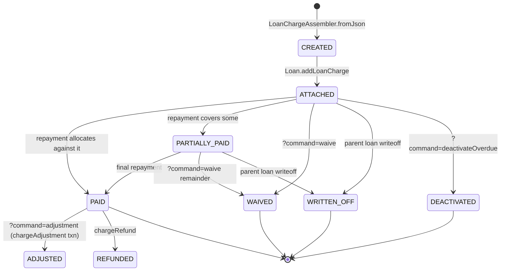

A `LoanCharge` is Apache Fineract's per-loan instance of a fee or penalty whose template lives on the platform-level `Charge` (`m_charge`) row. The entity is in `fineract-loan/src/main/java/org/apache/fineract/portfolio/loanaccount/domain/LoanCharge.java`, maps to `m_loan_charge`, and is owned by `Loan.charges` with `CascadeType.ALL` + `orphanRemoval = true`. This page walks through the field model, the four supporting entities (`LoanInstallmentCharge`, `LoanTrancheCharge`, `LoanChargePaidBy`, `LoanOverdueInstallmentCharge`), the charge lifecycle and the time/calculation enumerations consumed from `fineract-core` and `fineract-charge`.

For the REST contract see [Loan charges API](/loan/loan-charges-api). For how repayments allocate against charges see [Transaction processors](/loan/transaction-processors).

## Entity overview

```java
@Setter @Getter @Entity
@Table(name = "m_loan_charge",
       uniqueConstraints = { @UniqueConstraint(columnNames = { "external_id" }, name = "external_id") })
public class LoanCharge extends AbstractAuditableWithUTCDateTimeCustom<Long> {

    @ManyToOne(optional = false) @JoinColumn(name = "loan_id",   nullable = false) private Loan   loan;
    @ManyToOne(optional = false) @JoinColumn(name = "charge_id", nullable = false) private Charge charge;

    @Column(name = "charge_time_enum",        nullable = false) private Integer chargeTime;
    @Column(name = "submitted_on_date")                           private LocalDate submittedOnDate;
    @Column(name = "due_for_collection_as_of_date")              private LocalDate dueDate;
    @Column(name = "charge_calculation_enum")                    private Integer chargeCalculation;
    @Column(name = "charge_payment_mode_enum")                   private Integer chargePaymentMode;

    @Column(name = "calculation_percentage",      scale = 6, precision = 19) private BigDecimal percentage;
    @Column(name = "calculation_on_amount",       scale = 6, precision = 19) private BigDecimal amountPercentageAppliedTo;
    @Column(name = "charge_amount_or_percentage", scale = 6, precision = 19, nullable = false) private BigDecimal amountOrPercentage;

    @Column(name = "amount",                      scale = 6, precision = 19, nullable = false) private BigDecimal amount;
    @Column(name = "amount_paid_derived",         scale = 6, precision = 19) private BigDecimal amountPaid;
    @Column(name = "amount_waived_derived",       scale = 6, precision = 19) private BigDecimal amountWaived;
    @Column(name = "amount_writtenoff_derived",   scale = 6, precision = 19) private BigDecimal amountWrittenOff;
    @Column(name = "amount_outstanding_derived",  scale = 6, precision = 19, nullable = false) private BigDecimal amountOutstanding;

    @Column(name = "is_penalty",      nullable = false) private boolean penaltyCharge = false;
    @Setter @Column(name = "is_paid_derived", nullable = false) private boolean paid    = false;
    @Setter @Column(name = "waived",          nullable = false) private boolean waived  = false;

    @Column(name = "min_cap", scale = 6, precision = 19) private BigDecimal minCap;
    @Column(name = "max_cap", scale = 6, precision = 19) private BigDecimal maxCap;

    @Column(name = "is_active", nullable = false) private boolean active = true;
    @Column(name = "external_id") private ExternalId externalId;
```

### Per-field semantics

| Field | Set when | Notes |
| --- | --- | --- |
| `charge` | Created | Pointer to the parent `Charge` template (defines name, currency, default amount) |
| `chargeTime` | Created | Stored as `int`; mapped through `ChargeTimeType` (see below) |
| `dueDate` | Created (or per-installment for instalment fees) | `null` for `DISBURSEMENT` charges |
| `chargeCalculation` | Created | Stored as `int`; mapped through `ChargeCalculationType` |
| `chargePaymentMode` | Created | `REGULAR` (0) or `ACCOUNT_TRANSFER` (1) |
| `percentage` | Percent-based calc | The configured % |
| `amountPercentageAppliedTo` | Percent-based calc | The base the % was applied to (principal, interest, etc.) |
| `amountOrPercentage` | Created | Stored verbatim — useful for re-creating after changes |
| `amount` | Created | The resolved monetary amount |
| `amountPaid` | Repayment | Sum of `LoanChargePaidBy.amount` linked to this charge |
| `amountWaived` | Waive | Set by `waive(...)` |
| `amountWrittenOff` | Write-off | Set when the parent loan is written off |
| `amountOutstanding` | Always | `amount − amountPaid − amountWaived − amountWrittenOff` |
| `penaltyCharge` | Created | Copied from `Charge.penalty` |
| `paid` | Derived | Boolean for `amountOutstanding == 0 && amountWaived == 0` |
| `waived` | Derived | Boolean for `amountWaived > 0` |
| `minCap` / `maxCap` | Created | Floor/ceiling for percent charges |
| `active` | Always true at create | Flipped to false by `deactivateOverdue` |
| `externalId` | Optional | Caller-supplied UUID, unique |

## ChargeTimeType

```java
public enum ChargeTimeType {                              // from fineract-core
    INVALID(0,  "chargeTimeType.invalid"),
    DISBURSEMENT(1, "chargeTimeType.disbursement"),       // loan: fee taken at disbursal
    SPECIFIED_DUE_DATE(2, "chargeTimeType.specifiedDueDate"),  // loan + savings
    SAVINGS_ACTIVATION(3, ...), SAVINGS_CLOSURE(4, ...),  // savings-only
    WITHDRAWAL_FEE(5, ...), ANNUAL_FEE(6, ...), MONTHLY_FEE(7, ...),
    INSTALMENT_FEE(8, "chargeTimeType.instalmentFee"),    // loan: per-installment fan-out
    OVERDUE_INSTALLMENT(9, "chargeTimeType.overdueInstallment"),  // loan: COB-applied penalty
    OVERDRAFT_FEE(10, ...), WEEKLY_FEE(11, ...),
    TRANCHE_DISBURSEMENT(12, "chargeTimeType.tranchedisbursement"),  // loan: per-tranche fee
    SHAREACCOUNT_ACTIVATION(13, ...), SHARE_PURCHASE(14, ...), SHARE_REDEEM(15, ...),
    SAVINGS_NOACTIVITY_FEE(16, ...);
}
```

The loan-relevant subset:

| `ChargeTimeType` | Stored `chargeTime` int | Behaviour |
| --- | --- | --- |
| `DISBURSEMENT` | 1 | Charged at the actual disbursement transaction; deducted from `netDisbursalAmount` |
| `SPECIFIED_DUE_DATE` | 2 | Sits alone on `LoanCharge.dueDate`; one row only |
| `INSTALMENT_FEE` | 8 | Fans out — one row in `LoanCharge` plus one `LoanInstallmentCharge` per installment |
| `OVERDUE_INSTALLMENT` | 9 | Applied by the COB step `APPLY_CHARGE_TO_OVERDUE_LOANS` ([Loan COB steps](/cob/loan-cob-business-steps)) |
| `TRANCHE_DISBURSEMENT` | 12 | One row per tranche; activated when the tranche is disbursed |

## ChargeCalculationType

```java
public enum ChargeCalculationType {                       // from fineract-charge
    INVALID(0, ...),
    FLAT(1, "chargeCalculationType.flat"),
    PERCENT_OF_AMOUNT(2, "chargeCalculationType.percent.of.amount"),
    PERCENT_OF_AMOUNT_AND_INTEREST(3, "chargeCalculationType.percent.of.amount.and.interest"),
    PERCENT_OF_INTEREST(4, "chargeCalculationType.percent.of.interest"),
    PERCENT_OF_DISBURSEMENT_AMOUNT(5, "chargeCalculationType.percent.of.disbursement.amount");
}
```

`LoanCharge.percentageOf(value, percentage)` does the math:

```java
public static BigDecimal percentageOf(final BigDecimal value, final BigDecimal percentage) {
    BigDecimal percentageOf = BigDecimal.ZERO;
    if (value.compareTo(BigDecimal.ZERO) > 0) {
        final MathContext mc = MoneyHelper.getMathContext();
        final BigDecimal multiplicand = percentage.divide(BigDecimal.valueOf(100L), mc);
        percentageOf = value.multiply(multiplicand, mc);
    }
    return percentageOf;
}
```

The base value is chosen by the constructor depending on the calc type — principal for `PERCENT_OF_AMOUNT`, principal+interest for `PERCENT_OF_AMOUNT_AND_INTEREST`, etc.

## ChargePaymentMode

```java
public enum ChargePaymentMode {
    REGULAR(0, "chargepaymentmode.regular"),
    ACCOUNT_TRANSFER(1, "chargepaymentmode.accounttransfer");
}
```

`ACCOUNT_TRANSFER` triggers an `AccountTransfer` from the linked savings account at charge-payment time, rather than waiting for a manual `?command=pay` call.

## LoanInstallmentCharge: per-installment fan-out

When the charge time is `INSTALMENT_FEE`, the constructor instantiates one `LoanInstallmentCharge` per installment:

```java
@Entity @Table(name = "m_loan_installment_charge") @Getter
public class LoanInstallmentCharge {

    @ManyToOne @JoinColumn(name = "loan_charge_id", nullable = false)
    private LoanCharge loancharge;

    @Setter @ManyToOne @JoinColumn(name = "loan_schedule_id", nullable = false)
    private LoanRepaymentScheduleInstallment installment;

    @Column(name = "amount",                       scale = 6, precision = 19, nullable = false) private BigDecimal amount;
    @Column(name = "amount_paid_derived",          scale = 6, precision = 19) private BigDecimal amountPaid;
    @Setter @Column(name = "amount_waived_derived", scale = 6, precision = 19) private BigDecimal amountWaived;
    @Column(name = "amount_writtenoff_derived",    scale = 6, precision = 19) private BigDecimal amountWrittenOff;
    @Column(name = "amount_outstanding_derived",   scale = 6, precision = 19, nullable = false) private BigDecimal amountOutstanding;
    @Column(name = "amount_through_charge_payment",scale = 6, precision = 19) private BigDecimal amountThroughChargePayment;

    @Setter @Column(name = "is_paid_derived", nullable = false) private boolean paid   = false;
    @Setter @Column(name = "waived",           nullable = false) private boolean waived = false;
}
```

The parent `LoanCharge.amount` is the **sum** of its `loanInstallmentCharge` rows. When an installment is paid the corresponding `LoanInstallmentCharge` is updated and the parent `LoanCharge.amountPaid` rolled up by `reconcileFullyPaid()`. Helpers:

```java
public LoanInstallmentCharge getInstallmentLoanCharge(final LocalDate periodDueDate)
public LoanInstallmentCharge getInstallmentLoanCharge(final Integer installmentNumber)
public LoanInstallmentCharge getLastPaidOrPartiallyPaidInstallmentLoanCharge(MonetaryCurrency currency)
public LoanInstallmentCharge getUnpaidInstallmentLoanCharge()
public List<LoanChargePaidDetail> fetchRepaymentInstallment(final MonetaryCurrency currency)
```

## LoanTrancheCharge

When a product has `multiDisburseLoan = true`, charges with `chargeTime = TRANCHE_DISBURSEMENT` are attached to the tranche, not the parent loan as a whole. They are recorded in `m_loan_tranche_charges`:

```java
@Entity @Table(name = "m_loan_tranche_charges")
public class LoanTrancheCharge {

    @ManyToOne @JoinColumn(name = "loan_id",   nullable = false) private Loan   loan;
    @ManyToOne @JoinColumn(name = "charge_id", nullable = false) private Charge charge;

    public static LoanTrancheCharge createLoanTrancheCharge(Charge chargeDefinition) { … }
    public static LoanTrancheCharge createLoanTrancheChargeWithLoan(Charge chargeDefinition, Loan loan) { … }
}
```

And the link between the tranche charge and the actual `LoanCharge` instance that gets created at the disbursement is `LoanTrancheDisbursementCharge`:

```java
@OneToOne(mappedBy = "loancharge", cascade = CascadeType.ALL,
          orphanRemoval = true, fetch = FetchType.LAZY)
private LoanTrancheDisbursementCharge loanTrancheDisbursementCharge;     // on LoanCharge
```

This indirection allows: (1) the product/charge template to know "this tranche charges X"; (2) the disbursement to materialise a `LoanCharge` row at the right time; (3) accounting to track tranche-specific fees.

## LoanChargePaidBy: the payment trail

```java
@Entity @Table(name = "m_loan_charge_paid_by")
public class LoanChargePaidBy {
    @ManyToOne @JoinColumn(name = "loan_transaction_id", nullable = false)
    private LoanTransaction loanTransaction;

    @ManyToOne @JoinColumn(name = "loan_charge_id", nullable = false)
    private LoanCharge loanCharge;

    @Column(name = "amount",            scale = 6, precision = 19, nullable = false) private BigDecimal amount;
    @Column(name = "installment_number")                                              private Integer installmentNumber;
}
```

Every monetary movement of a charge — pay, waive, refund, adjustment, charge-payment-via-savings — is recorded as a `LoanChargePaidBy`. The set is reachable in two directions:

- `LoanCharge.loanChargePaidBySet` → "show me every transaction that touched this charge"
- `LoanTransaction.loanChargesPaid` → "show me every charge this transaction cleared"

The `installmentNumber` is non-null only when the parent charge is an `INSTALMENT_FEE` and the transaction paid a specific installment's slice.

## LoanOverdueInstallmentCharge

For each `OVERDUE_INSTALLMENT` charge applied to a specific late installment, the link table `m_loan_overdue_installment_charge` records which installment triggered the penalty:

```java
@OneToOne(mappedBy = "loancharge", cascade = CascadeType.ALL,
          orphanRemoval = true, fetch = FetchType.LAZY)
private LoanOverdueInstallmentCharge overdueInstallmentCharge;
```

`ApplyChargeToOverdueLoansBusinessStep` (see [Loan COB steps](/cob/loan-cob-business-steps)) creates new `LoanCharge` rows of this kind during the daily batch and writes the link so subsequent runs don't double-apply.

## LoanCharge lifecycle



Each transition flips one or more of the boolean derived columns and emits a `LoanTransaction` of the appropriate type:

| Command | Transaction emitted | LoanCharge update |
| --- | --- | --- |
| `pay` | `CHARGE_PAYMENT` (type 17) | `amountPaid += txn.amount`, recompute outstanding |
| `waive` | `WAIVE_CHARGES` (type 9) | `amountWaived += amount`, `waived = true` |
| `adjustment` | `CHARGE_ADJUSTMENT` (type 26) | Adjusts `amountPaid` |
| `chargeRefund` (transaction endpoint) | `CHARGE_REFUND` (type 24) | Decrements `amountPaid` |
| Write-off (parent loan) | `WRITEOFF` (type 6) | `amountWrittenOff = amountOutstanding` |
| `deactivateOverdue` | — | `active = false` (no transaction; only for overdue charges) |

## Methods on LoanCharge

The 740-line entity has methods grouped by intent:

| Method | Use |
| --- | --- |
| `markAsFullyPaid()`, `reconcileFullyPaid()` | Force `paid = true`, recompute outstanding |
| `isFullyPaid()`, `isPaid()`, `isWaived()`, `isActive()` | State predicates |
| `resetToOriginal(MonetaryCurrency)` | Used when transactions are replayed |
| `resetPaidAmount(MonetaryCurrency)` | Used by reverse-replay before re-applying repayments |
| `setOutstandingAmount(BigDecimal)` | Direct setter — used by recalculation |
| `waive(MonetaryCurrency, Integer installmentNumber)` | Returns the `Money` waived; if instalment-fee delegates to `LoanInstallmentCharge.waive()` |
| `getInstallmentLoanCharge(LocalDate \| Integer)` | Lookup the per-installment row |
| `fetchRepaymentInstallment(MonetaryCurrency)` | Build `LoanChargePaidDetail` list ordered for processors |
| `getLoanChargePaidBy(Predicate<LoanChargePaidBy>)` | Filter the payment trail |
| `toData()` | Project to `LoanChargeData` for API responses |

The `percentageOf` and `minCap` / `maxCap` enforcement is in `calculateAmountOutstanding(...)` and `calculateOutstanding()` (private helpers).

## How charges are created

Three paths:

1. **At application submit.** `LoanApplicationCommandFromApiJsonDeserializer` reads the `"charges": [...]` JSON array and `LoanChargeAssembler.fromParsedJson` materialises one `LoanCharge` per entry. They are passed into `Loan.newIndividualLoanApplication(... loanCharges ...)` and end up in `Loan.charges`.

2. **Post-application via REST.** `POST /v1/loans/{loanId}/charges` ends up in `LoanWritePlatformServiceJpaRepositoryImpl.addLoanCharge(...)`. Charges added post-disbursement must have a `dueDate >= business date` or be type `INSTALMENT_FEE` / `OVERDUE_INSTALLMENT`.

3. **Overdue by COB.** `ApplyChargeToOverdueLoansBusinessStep` issues an internal command to create an `OVERDUE_INSTALLMENT` charge against each overdue installment older than the configured grace period.

## Validators

- `LoanChargeValidator` (in `serialization/`) — verifies the `chargeId` exists, that the parent loan can accept the charge (e.g. the product must allow `OVERDUE_INSTALLMENT`), that `min_cap < max_cap`, and that the charge currency matches the loan's.
- `LoanChargeApiJsonValidator` — validates the wire JSON shape (required fields, types).
- `LoanChargeWritePlatformServiceImpl` (in `fineract-provider`) — orchestrates the write side. Calls the validators, builds the `LoanCharge`, then delegates to `Loan.addLoanCharge(...)`.

## Read path

The companion service is `LoanChargeReadPlatformService` (implementation in `fineract-provider`). Its main entry points:

```java
Collection<LoanChargeData>           retrieveLoanCharges(Long loanId);
LoanChargeData                       retrieveLoanChargeDetails(Long loanChargeId, Long loanId);
ChargeData                           retrieveLoanChargeTemplate();
Collection<LoanInstallmentChargeData> retrieveInstallmentLoanCharges(Long loanChargeId, boolean activeOnly);
```

The DTOs (`LoanChargeData`, `LoanInstallmentChargeData`) live in `fineract-loan/.../data/`. They flatten the entity into the JSON payload returned by the API.

## ChargeOff vs charge — disambiguation

Two related-sounding concepts:

- **Charge** (this page): a `LoanCharge` row — a fee or penalty. Lives at the line-item level.
- **Charge-off**: a loan-level write-down recognised by the lender. Implemented as a `CHARGE_OFF` `LoanTransaction` (type 27) and `Loan.chargedOff = true`. See [Loan transactions](/loan/loan-transactions) and [Loan write service](/loan/loan-write-service).

They are unrelated except that both ultimately drive accounting reclasses.

## Wire view (cross-reference)

The companion REST resource is `LoanChargesApiResource` (`fineract-provider/.../api/LoanChargesApiResource.java`). Endpoints:

| Method | Path | Action |
| --- | --- | --- |
| `GET` | `/v1/loans/{loanId}/charges` | List |
| `GET` | `/v1/loans/{loanId}/charges/template` | Template (charge picker) |
| `GET` | `/v1/loans/{loanId}/charges/{loanChargeId}` | One |
| `POST` | `/v1/loans/{loanId}/charges` | Create (no `?command=`) or `?command=pay` / `deactivateOverdue` |
| `POST` | `/v1/loans/{loanId}/charges/{loanChargeId}` | `?command=pay|waive|adjustment` |
| `PUT` | `/v1/loans/{loanId}/charges/{loanChargeId}` | Update due date, amount, etc. |
| `DELETE` | `/v1/loans/{loanId}/charges/{loanChargeId}` | Delete (only pre-disbursal or unsaved) |

All endpoints have an `external-id/{loanExternalId}` and `external-id/{loanChargeExternalId}` mirror. Full reference: [Loan charges API](/loan/loan-charges-api).

## Cross-references

<CardGroup cols={2}>
  <Card title="Loan transactions" icon="arrow-right-arrow-left" href="/loan/loan-transactions">
    Where the charge-related transactions (`CHARGE_PAYMENT`, `WAIVE_CHARGES`, `CHARGE_REFUND`, `CHARGE_ADJUSTMENT`) live.
  </Card>
  <Card title="Loan charges API" icon="globe" href="/loan/loan-charges-api">
    Every REST entry point with JSON shapes and command dispatch table.
  </Card>
  <Card title="COB business steps" icon="calendar-day" href="/cob/loan-cob-business-steps">
    `APPLY_CHARGE_TO_OVERDUE_LOANS` step — how overdue installment charges materialise.
  </Card>
  <Card title="Transaction processors" icon="filter" href="/loan/transaction-processors">
    How a repayment chooses which charges to settle, in which order.
  </Card>
</CardGroup>
