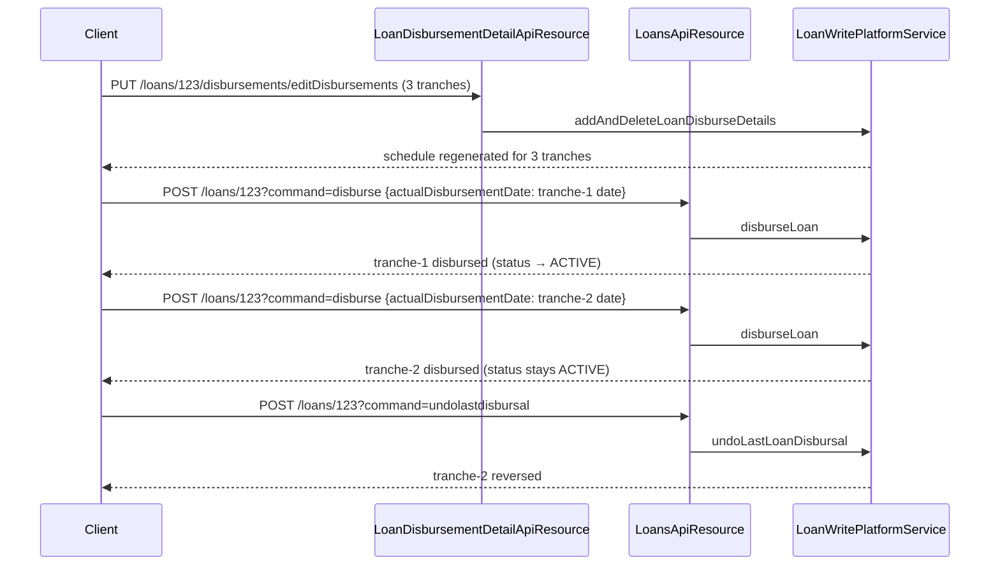

`LoanDisbursementDetailApiResource` is the dedicated resource for managing the per-tranche disbursement schedule of multi-tranche Apache Fineract loans. It sits at `/v1/loans/{loanId}/disbursements` and exposes three endpoints: get a tranche, update a tranche's expected date / amount, and bulk add-and-delete tranches.

Source: `fineract-provider/src/main/java/org/apache/fineract/portfolio/loanaccount/api/LoanDisbursementDetailApiResource.java` (110 lines — the smallest of the four loan API resources).

For the underlying entity see [Loan domain model](/loan/loan-domain-model) (`LoanDisbursementDetails` section). The triggering verb for actually disbursing money is `?command=disburse` on `LoansApiResource` — see [Loans API](/loan/loans-api).

## Class

```java
@Path("/v1/loans/{loanId}/disbursements")
@Component
@Tag(name = "Loan Disbursement Details", description = "")
@RequiredArgsConstructor
public class LoanDisbursementDetailApiResource {

    private static final Set<String> RESPONSE_DATA_PARAMETERS = new HashSet<>(Arrays.asList(
        "id", "expectedDisbursementDate", "actualDisbursementDate",
        "principal", "approvedPrincipal"));

    private static final String RESOURCE_NAME_FOR_PERMISSIONS = "LOAN";

    private final DefaultToApiJsonSerializer<DisbursementData> toApiJsonSerializer;
    private final PortfolioCommandSourceWritePlatformService    commandsSourceWritePlatformService;
    private final PlatformSecurityContext                       context;
    private final ApiRequestParameterHelper                     apiRequestParameterHelper;
    private final LoanReadPlatformService                       loanReadPlatformService;
}
```

The serializer is parameterised on `DisbursementData` (in `fineract-loan/.../data/DisbursementData.java`).

## Endpoint table

| Method | Path | Handler method | Service method |
| --- | --- | --- | --- |
| `GET` | `/v1/loans/{loanId}/disbursements/{disbursementId}` | `retriveDetail` | `LoanReadPlatformService.retrieveLoanDisbursementDetail` |
| `PUT` | `/v1/loans/{loanId}/disbursements/{disbursementId}` | `updateDisbursementDate` | `LoanWritePlatformService.updateDisbursementDateAndAmountForTranche` |
| `PUT` | `/v1/loans/{loanId}/disbursements/editDisbursements` | `addAndDeleteDisbursementDetail` | `LoanWritePlatformService.addAndDeleteLoanDisburseDetails` |

There are no DELETE or POST endpoints — deletes are folded into the `editDisbursements` bulk-replace path.

## `GET /{disbursementId}`

```java
@GET
@Path("{disbursementId}")
@Consumes({ MediaType.APPLICATION_JSON })
@Produces({ MediaType.APPLICATION_JSON })
public String retriveDetail(@PathParam("loanId") final Long loanId,
        @PathParam("disbursementId") final Long disbursementId,
        @Context final UriInfo uriInfo) {

    this.context.authenticatedUser().validateHasReadPermission(RESOURCE_NAME_FOR_PERMISSIONS);

    final DisbursementData disbursementData =
        this.loanReadPlatformService.retrieveLoanDisbursementDetail(loanId, disbursementId);

    final ApiRequestJsonSerializationSettings settings =
        this.apiRequestParameterHelper.process(uriInfo.getQueryParameters());
    return this.toApiJsonSerializer.serialize(settings, disbursementData, RESPONSE_DATA_PARAMETERS);
}
```

Returns the `DisbursementData` for a single tranche:

```json
{
  "id": 7,
  "expectedDisbursementDate": [2025, 3, 1],
  "actualDisbursementDate": null,
  "principal": 5000.00,
  "approvedPrincipal": 5000.00
}
```

When the tranche has been disbursed, `actualDisbursementDate` is non-null.

## `PUT /{disbursementId}` — update single tranche

```java
@PUT
@Path("{disbursementId}")
@Consumes({ MediaType.APPLICATION_JSON })
@Produces({ MediaType.APPLICATION_JSON })
public CommandProcessingResult updateDisbursementDate(@PathParam("loanId") final Long loanId,
        @PathParam("disbursementId") final Long disbursementId,
        final String apiRequestBodyAsJson) {

    final CommandWrapper commandRequest = new CommandWrapperBuilder()
        .updateDisbusementDate(loanId, disbursementId)
        .withJson(apiRequestBodyAsJson).build();

    return this.commandsSourceWritePlatformService.logCommandSource(commandRequest);
}
```

The builder verb `updateDisbusementDate` (yes, with the typo `Disbus`) maps to handler `UpdateLoanDisbursementDateCommandHandler` and reaches `LoanWritePlatformService.updateDisbursementDateAndAmountForTranche(loanId, disbursementId, command)`.

### Request body

```json
{
  "expectedDisbursementDate": "01 March 2025",
  "principal": 5500.00,
  "locale": "en",
  "dateFormat": "dd MMMM yyyy"
}
```

| Field | Required | Notes |
| --- | --- | --- |
| `expectedDisbursementDate` | yes | Future date acceptable; past dates allowed only if the tranche has not been disbursed |
| `principal` | yes | New tranche amount |
| `locale` / `dateFormat` | yes | Standard Fineract dictionary |

Constraints:

- The tranche must not have `actualDisbursementDate` (must be undisbursed).
- The sum of all tranche `principal` must not exceed `Loan.approvedPrincipal`.
- The new `expectedDisbursementDate` must not place this tranche before an earlier already-disbursed tranche.

After the update, the loan schedule is regenerated via `LoanScheduleService.regenerateRepaymentSchedule(loan, scheduleGeneratorDTO)`.

## `PUT /editDisbursements` — bulk add/delete

```java
@PUT
@Path("editDisbursements")
@Consumes({ MediaType.APPLICATION_JSON })
@Produces({ MediaType.APPLICATION_JSON })
@RequestBody(required = true, content = @Content(schema = @Schema(
    implementation = LoanDisbursementDetailApiResourceSwagger.PostAddAndDeleteDisbursementDetailRequest.class)))
public CommandProcessingResult addAndDeleteDisbursementDetail(@PathParam("loanId") final Long loanId,
        @Parameter(hidden = true) final String apiRequestBodyAsJson) {

    CommandWrapper commandRequest = new CommandWrapperBuilder()
        .addAndDeleteDisbursementDetails(loanId)
        .withJson(apiRequestBodyAsJson).build();

    return this.commandsSourceWritePlatformService.logCommandSource(commandRequest);
}
```

Maps to handler `AddAndDeleteDisbursementDetailsCommandHandler` and reaches `LoanWritePlatformService.addAndDeleteLoanDisburseDetails(loanId, command)`.

### Request body

```json
{
  "dateFormat": "dd MMMM yyyy",
  "locale": "en",
  "approvedLoanAmount": 10000.00,
  "disbursementData": [
    { "id": 5, "expectedDisbursementDate": "1 March 2025", "principal": 3000.00 },
    { "id": 6, "expectedDisbursementDate": "1 April 2025", "principal": 3000.00 },
    {           "expectedDisbursementDate": "1 May 2025",   "principal": 4000.00 }
  ]
}
```

| Field | Required | Notes |
| --- | --- | --- |
| `disbursementData[]` | yes | The complete new list of tranches |
| `disbursementData[].id` | optional | Present → update existing; absent → create new |
| `approvedLoanAmount` | optional | When raising, the new total approved principal |
| `locale`, `dateFormat` | yes | Dates are parsed per locale |

The service:

1. Compares the incoming array with `Loan.disbursementDetails`.
2. For each existing tranche with an `id` present in the request: updates date/principal.
3. For each existing tranche **not** in the request: marks for deletion (only valid if `actualDisbursementDate == null` — already-realised tranches cannot be deleted).
4. For each new tranche (no `id`): creates a `LoanDisbursementDetails` row.
5. If `approvedLoanAmount` is supplied, validates against the product's max and updates `Loan.approvedPrincipal`.
6. Regenerates the loan schedule.

### Validation

The validator (`LoanApplicationValidator.validateDisbursementDetails`) enforces:

- At least one tranche.
- No two tranches share `expectedDisbursementDate`.
- Sum of `principal` matches `approvedPrincipal` (within rounding tolerance).
- Tranches strictly in date order after sorting.
- For loans already disbursed: at least one already-disbursed tranche must remain unchanged.

Failures throw `PlatformApiDataValidationException` (HTTP 400).

## Swagger request schema

```java
public static final class PostAddAndDeleteDisbursementDetailRequest {
    public String dateFormat;        // "dd MMMM yyyy"
    public String locale;            // "en"
    public Double approvedLoanAmount; // 10000
    public List<DisbursementDetail> disbursementData;
}

public static final class DisbursementDetail {
    public Long       id;                          // 5 — null for new
    public String     expectedDisbursementDate;    // "1 March 2025"
    public BigDecimal principal;                   // 3000
}
```

## Response

```json
{
  "officeId": 1,
  "clientId": 42,
  "loanId": 123,
  "resourceId": 123,
  "changes": {
    "disbursementData": [ … ],
    "approvedLoanAmount": 10000.0,
    "locale": "en",
    "dateFormat": "dd MMMM yyyy",
    "recalculateLoanSchedule": true
  }
}
```

The `changes` map carries every modified field — clients can diff against their local state to know what changed without refetching.

## How the multi-tranche disbursement actually happens

Editing the tranches via this resource does **not** disburse the money. The actual disbursement is triggered by `POST /v1/loans/{loanId}?command=disburse` with `actualDisbursementDate` in the body — see [Loans API](/loan/loans-api).

The flow for a 3-tranche loan:



## Permissions

| Action | Permission code |
| --- | --- |
| `GET` | `READ_LOAN` |
| `PUT /{disbursementId}` | `UPDATE_DISBURSEMENT_DATE` |
| `PUT /editDisbursements` | `UPDATE_DISBURSEMENT_DETAIL` |

Seeded in `m_permission`.

## What this resource does NOT cover

- **The single-disbursement `?command=disburse`** — that's [Loans API](/loan/loans-api).
- **Undo last tranche disbursement** — that's `POST /v1/loans/{loanId}?command=undolastdisbursal`.
- **Disbursement-time charges** (`ChargeTimeType.DISBURSEMENT` or `TRANCHE_DISBURSEMENT`) — those are managed via [Loan charges API](/loan/loan-charges-api).
- **Schedule preview after editing tranches** — call `GET /v1/loans/{loanId}?associations=repaymentSchedule` to see the regenerated schedule.

## Cross-references

<CardGroup cols={2}>
  <Card title="Loan domain model" icon="database" href="/loan/loan-domain-model">
    `LoanDisbursementDetails` entity and `Loan.disbursementDetails` collection.
  </Card>
  <Card title="Loans API" icon="globe" href="/loan/loans-api">
    `?command=disburse`, `?command=undodisbursal`, `?command=undolastdisbursal` — the actual money-movement verbs.
  </Card>
  <Card title="Loan write service" icon="pen-to-square" href="/loan/loan-write-service">
    `LoanWritePlatformService.addAndDeleteLoanDisburseDetails`, `updateDisbursementDateAndAmountForTranche`, `disburseLoan`.
  </Card>
  <Card title="Schedule generator" icon="table" href="/loan/loan-schedule-generator">
    How the schedule is regenerated after each tranche edit.
  </Card>
  <Card title="Loan charges API" icon="globe" href="/loan/loan-charges-api">
    Tranche-disbursement charges (`ChargeTimeType.TRANCHE_DISBURSEMENT`).
  </Card>
</CardGroup>
