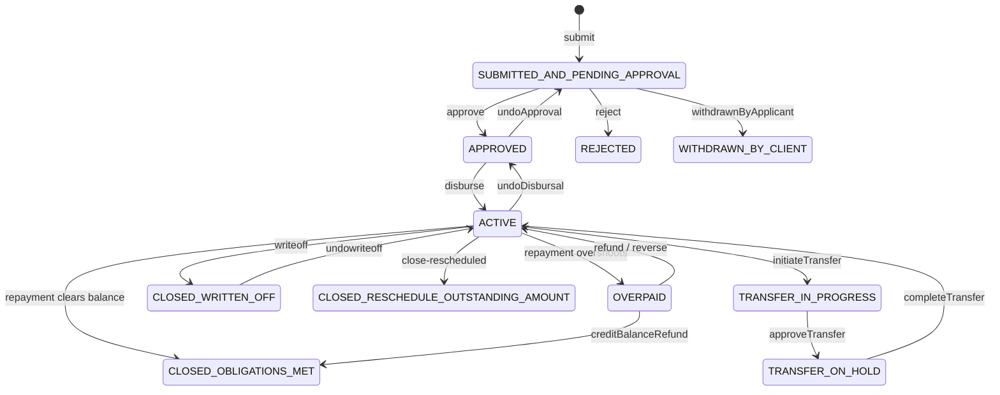

`Loan` is the aggregate root of the Apache Fineract loan domain. It sits in `fineract-loan/src/main/java/org/apache/fineract/portfolio/loanaccount/domain/Loan.java`, maps to the `m_loan` table, and owns four lifecycle-controlling collections — `loanTransactions`, `repaymentScheduleInstallments`, `charges`, and `disbursementDetails` — via `CascadeType.ALL` + `orphanRemoval = true`. Every state-changing operation in Fineract — a repayment, a disbursement, a charge waiver, a charge-off — eventually lands on a method on `Loan` itself. This page documents the entity field-by-field, the `LoanStatus` state machine, the `AccountType` (loan-type) enum, and the embedded `LoanSummary`.

The companion pages are [Loan transactions](/loan/loan-transactions), [Loan charges](/loan/loan-charges), and [Repayment schedule domain](/loan/loan-repayment-schedule-domain).

## Table mapping and identifiers

```java
@Entity
@Table(name = "m_loan", uniqueConstraints = {
        @UniqueConstraint(columnNames = { "account_no" }, name = "loan_account_no_UNIQUE"),
        @UniqueConstraint(columnNames = { "external_id" }, name = "loan_externalid_UNIQUE") })
public class Loan extends AbstractAuditableWithUTCDateTimeCustom<Long> {
    @Version int version;

    @Setter
    @Column(name = "account_no", length = 20, unique = true, nullable = false)
    private String accountNumber;

    @Setter
    @Column(name = "external_id")
    private ExternalId externalId;
```

| Column | Java field | Type | Notes |
| --- | --- | --- | --- |
| `id` | `id` (inherited) | `Long` | Generated identity, surfaces as `loanId` everywhere |
| `account_no` | `accountNumber` | `String(20)` | Human-readable, unique. Auto-generated by `RandomPasswordGenerator(19)` when the caller omits it (see end of constructor in `Loan.java`) |
| `external_id` | `externalId` | `ExternalId` | Optional UUID-style identifier supplied by the caller, also unique |
| `version` | `version` | `int` | JPA optimistic locking |

`AbstractAuditableWithUTCDateTimeCustom<Long>` injects `created_on`, `created_by`, `last_modified_on`, `last_modified_by` — the standard auditing columns documented in [Auditing](/core/auditing-and-context).

## Party associations: client, group, GLIM

```java
@ManyToOne @JoinColumn(name = "client_id")  private Client client;
@ManyToOne @JoinColumn(name = "group_id")   private Group group;
@Setter @ManyToOne @JoinColumn(name = "glim_id")
private GroupLoanIndividualMonitoringAccount glim;

@Enumerated @Column(name = "loan_type_enum", nullable = false)
private AccountType loanType;
```

The five factory methods (`newIndividualLoanApplication`, `newGroupLoanApplication`, `newIndividualLoanApplicationFromGroup`, …) choose which of `client` / `group` is populated. The `loan_type_enum` discriminator is the same `AccountType` enum used by savings:

| Ordinal | `AccountType` | Meaning |
| --- | --- | --- |
| 0 | `INVALID` | Defensive default |
| 1 | `INDIVIDUAL` | Client-only loan |
| 2 | `GROUP` | Group-only loan |
| 3 | `JLG` | Individual under a group (Joint Liability Group) |
| 4 | `GLIM` | Group Loan with Individual Monitoring (parent + children) |
| 5 | `GSIM` | Group Savings with Individual Monitoring |

For GLIM, the parent `GroupLoanIndividualMonitoringAccount` is non-null and `Loan.glim` links each child loan to it.

## Product, fund, officer, and processing strategy

```java
@ManyToOne(fetch = FetchType.LAZY)
@JoinColumn(name = "product_id", nullable = false)
private LoanProduct loanProduct;

@ManyToOne(fetch = FetchType.EAGER) @JoinColumn(name = "fund_id")
private Fund fund;

@Setter @ManyToOne(fetch = FetchType.EAGER) @JoinColumn(name = "loan_officer_id")
private Staff loanOfficer;

@ManyToOne(fetch = FetchType.LAZY) @JoinColumn(name = "loanpurpose_cv_id")
private CodeValue loanPurpose;

@Column(name = "loan_transaction_strategy_code", nullable = false)
private String transactionProcessingStrategyCode;
@Column(name = "loan_transaction_strategy_name")
private String transactionProcessingStrategyName;
```

`transactionProcessingStrategyCode` is the discriminator that picks one of the seven processors documented in [Transaction processors](/loan/transaction-processors) — e.g. `mifos-standard-strategy`, `rbi-india-strategy`, `advanced-payment-allocation-strategy`. It is denormalised onto the loan row (both code and human name) so that historical loans keep their strategy even if the product's default changes.

## Loan product detail (embedded)

```java
@Embedded
private LoanProductRelatedDetail loanRepaymentScheduleDetail;
```

`LoanProductRelatedDetail` is the embedded JPA component that carries: `principal` (Money), `nominalInterestRatePerPeriod`, `interestPeriodFrequencyType`, `annualNominalInterestRate`, `numberOfRepayments`, `repaymentEvery`, `repaymentPeriodFrequencyType`, `amortizationMethod` (equal installments vs equal principal), `interestMethod` (flat vs declining balance), `interestCalculationPeriodMethod` (daily vs same-as-repayment), `loanScheduleType` (cumulative vs progressive), `loanScheduleProcessingType` (horizontal vs vertical). See [Schedule generator](/loan/loan-schedule-generator) for how these are consumed.

## Term, status, and lifecycle dates

```java
@Setter @Column(name = "term_frequency", nullable = false) private Integer termFrequency;
@Setter @Enumerated @Column(name = "term_period_frequency_enum", nullable = false)
private PeriodFrequencyType termPeriodFrequencyType;

@Setter(AccessLevel.PACKAGE)
@Column(name = "loan_status_id", nullable = false)
@Convert(converter = LoanStatusConverter.class)
private LoanStatus loanStatus;

@Setter @Column(name = "submittedon_date")     private LocalDate submittedOnDate;
@Setter @Column(name = "rejectedon_date")      private LocalDate rejectedOnDate;
@Setter @Column(name = "withdrawnon_date")     private LocalDate withdrawnOnDate;
@Setter @Column(name = "approvedon_date")      private LocalDate approvedOnDate;
@Setter @Column(name = "expected_disbursedon_date") private LocalDate expectedDisbursementDate;
@Setter @Column(name = "disbursedon_date")     private LocalDate actualDisbursementDate;
@Setter @Column(name = "closedon_date")        private LocalDate closedOnDate;
@Setter @Column(name = "writtenoffon_date")    private LocalDate writtenOffOnDate;
@Setter @Column(name = "rescheduledon_date")   private LocalDate rescheduledOnDate;
@Setter @Column(name = "expected_maturedon_date") private LocalDate expectedMaturityDate;
@Setter @Column(name = "maturedon_date")       private LocalDate actualMaturityDate;
@Setter @Column(name = "overpaidon_date")      private LocalDate overpaidOnDate;
```

Each date has a corresponding `*_userid` FK to `m_appuser` so that the audit trail tells you who triggered the transition.

### LoanStatus enum

```java
public enum LoanStatus {
    INVALID(0, "loanStatusType.invalid"),
    SUBMITTED_AND_PENDING_APPROVAL(100, "loanStatusType.submitted.and.pending.approval"),
    APPROVED(200, "loanStatusType.approved"),
    ACTIVE(300, "loanStatusType.active"),
    TRANSFER_IN_PROGRESS(303, "loanStatusType.transfer.in.progress"),
    TRANSFER_ON_HOLD(304, "loanStatusType.transfer.on.hold"),
    WITHDRAWN_BY_CLIENT(400, "loanStatusType.withdrawn.by.client"),
    REJECTED(500, "loanStatusType.rejected"),
    CLOSED_OBLIGATIONS_MET(600, "loanStatusType.closed.obligations.met"),
    CLOSED_WRITTEN_OFF(601, "loanStatusType.closed.written.off"),
    CLOSED_RESCHEDULE_OUTSTANDING_AMOUNT(602, "loanStatusType.closed.reschedule.outstanding.amount"),
    OVERPAID(700, "loanStatusType.overpaid");
```

The integer code lives in `loan_status_id`. `LoanStatusConverter` translates between the int and the enum.



The state machine itself is encoded in `DefaultLoanLifecycleStateMachine` (same package). Helpers on the enum include `isActive()`, `isClosed()`, `isOverpaid()`, `isClosedWrittenOff()`, `isWaitingForDisbursal()`.

### LoanSubStatus enum

A second, sparser sub-status — `loan_sub_status_id` — captures non-status changes:

```java
public enum LoanSubStatus {
    INVALID(0, "loanSubStatusType.invalid"),
    FORECLOSED(100, "loanSubStatusType.foreclosed"),
    CONTRACT_TERMINATION(900, "loanSubStatusType.contractTermination");
```

`FORECLOSED` is set by `forecloseLoan(...)` in `LoanWritePlatformServiceJpaRepositoryImpl`; `CONTRACT_TERMINATION` by `applyContractTermination(...)` (see [Loan write service](/loan/loan-write-service)). Both keep `loanStatus = CLOSED_OBLIGATIONS_MET` but differentiate the close reason.

## Principal amounts and disbursal limits

```java
@Setter @Column(name = "principal_amount_proposed", scale = 6, precision = 19, nullable = false)
private BigDecimal proposedPrincipal;
@Setter @Column(name = "approved_principal", scale = 6, precision = 19, nullable = false)
private BigDecimal approvedPrincipal;
@Setter @Column(name = "net_disbursal_amount", scale = 6, precision = 19, nullable = false)
private BigDecimal netDisbursalAmount;

@Setter @Column(name = "fixed_emi_amount", scale = 6, precision = 19)
private BigDecimal fixedEmiAmount;
@Setter @Column(name = "max_outstanding_loan_balance", scale = 6, precision = 19)
private BigDecimal maxOutstandingLoanBalance;

@Setter @Column(name = "total_overpaid_derived", scale = 6, precision = 19)
private BigDecimal totalOverpaid;
@Setter @Column(name = "total_recovered_derived", scale = 6, precision = 19)
private BigDecimal totalRecovered;
```

| Field | Set when | Why it differs from `principal` |
| --- | --- | --- |
| `proposedPrincipal` | Submit | What the applicant asked for |
| `approvedPrincipal` | Approve | What the bank agreed to lend |
| `netDisbursalAmount` | Constructor / disburse | `approvedPrincipal − sum(charges due at disbursement)` |
| `loanRepaymentScheduleDetail.principal` | Schedule generation | Drives interest math |
| `fixedEmiAmount` | Optional product feature | EMI override, used by equal-installments amortization |
| `maxOutstandingLoanBalance` | Tranche loans | Cap enforced by `LoanApprovedAmountWritePlatformService` |
| `totalOverpaid` | Derived | Updated on every repayment + write-off |
| `totalRecovered` | Derived | Sum of `RECOVERY_REPAYMENT` transactions |

The constructor establishes the invariant:

```java
this.approvedPrincipal = this.loanRepaymentScheduleDetail.getPrincipal().getAmount();
this.proposedPrincipal = this.loanRepaymentScheduleDetail.getPrincipal().getAmount();
this.netDisbursalAmount = this.approvedPrincipal.subtract(deriveSumTotalOfChargesDueAtDisbursement());
```

## Owned collections

The four lifecycle collections are all `mappedBy = "loan"` with `CascadeType.ALL` and `orphanRemoval = true`:

```java
@OneToMany(cascade = CascadeType.ALL, mappedBy = "loan", orphanRemoval = true, fetch = FetchType.LAZY)
private Set<LoanCharge> charges = new HashSet<>();

@OneToMany(cascade = CascadeType.ALL, mappedBy = "loan", orphanRemoval = true, fetch = FetchType.LAZY)
private Set<LoanTrancheCharge> trancheCharges = new HashSet<>();

@OrderBy(value = "installmentNumber")
@OneToMany(cascade = CascadeType.ALL, mappedBy = "loan", orphanRemoval = true, fetch = FetchType.LAZY)
private List<LoanRepaymentScheduleInstallment> repaymentScheduleInstallments = new ArrayList<>();

@OrderBy(value = "dateOf, createdDate, id")
@OneToMany(cascade = CascadeType.ALL, mappedBy = "loan", orphanRemoval = true, fetch = FetchType.LAZY)
private List<LoanTransaction> loanTransactions = new ArrayList<>();

@OneToMany(cascade = CascadeType.ALL, mappedBy = "loan", orphanRemoval = true, fetch = FetchType.LAZY)
@OrderBy(value = "expectedDisbursementDate, id")
private List<LoanDisbursementDetails> disbursementDetails = new ArrayList<>();
```

The two `@OrderBy` clauses matter for processors: transactions are always iterated in `dateOf, createdDate, id` order, and installments in `installmentNumber` order. Re-replay determinism depends on this.

Additional collections (not full lifecycle):

| Field | Purpose |
| --- | --- |
| `loanCollateralManagements` | Loan-level collateral records |
| `loanOfficerHistory` | `LoanOfficerAssignmentHistory` entries when officers are reassigned |
| `postDatedChecks` | Optional PDC sub-aggregate |
| `loanTermVariations` | `LoanTermVariations` for reschedule / EMI change / due-date change |
| `paymentAllocationRules` + `creditAllocationRules` | Progressive-only rules (TODO: move to fineract-progressive-loan) |
| `rates` | Many-to-many to `m_rate` via the `m_loan_rate` join table |

## Embedded `LoanSummary`

```java
@Setter @Embedded
private LoanSummary summary;
```

`LoanSummary` is a JPA `@Embeddable` whose columns are stored on the `m_loan` row itself (no separate table). It is the running denormalized balance — every transaction commits an update via `LoanBalanceService`. Key fields (truncated):

| Field | Column | Meaning |
| --- | --- | --- |
| `totalPrincipal` | `total_principal_derived` | Sum of all installment principals |
| `totalCapitalizedIncome` | `capitalized_income_derived` | Capitalized-income additions (progressive feature) |
| `totalPrincipalDisbursed` | `principal_disbursed_derived` | Sum of `DISBURSEMENT` transactions |
| `totalPrincipalRepaid` | `principal_repaid_derived` | Sum of principal portions of repayments |
| `totalPrincipalWrittenOff` | `principal_writtenoff_derived` | From `WRITEOFF` |
| `totalPrincipalOutstanding` | `principal_outstanding_derived` | `disbursed − repaid − writtenoff` |
| `totalInterestCharged` | `interest_charged_derived` | Sum of installment `interestCharged` |
| `totalInterestRepaid` | `interest_repaid_derived` | Interest portion of repayments |
| `totalInterestWaived` | `interest_waived_derived` | From `WAIVE_INTEREST` |
| `totalInterestWrittenOff` | `interest_writtenoff_derived` | From `WRITEOFF` |
| `totalInterestOutstanding` | `interest_outstanding_derived` | `charged − repaid − waived − writtenoff` |
| `totalFeeChargesCharged` | `fee_charges_charged_derived` | Sum of installment `feeChargesCharged` |
| `totalFeeChargesDueAtDisbursement` | `total_charges_due_at_disbursement_derived` | Up-front fees |
| `totalFeeChargesRepaid` | `fee_charges_repaid_derived` | Fees paid |

Parallel columns exist for penalties (`penalty_charges_*_derived`) and an aggregate `total_expected_repayment_derived` / `total_repayment_derived` / `total_outstanding_derived` / `total_costofloan_derived`. The full list is in `LoanSummary.java`.

## Recalculation, NPA, accrual

```java
@OneToOne(cascade = CascadeType.ALL, mappedBy = "loan", orphanRemoval = true, fetch = FetchType.LAZY)
private LoanInterestRecalculationDetails loanInterestRecalculationDetails;

@Column(name = "is_npa", nullable = false) private boolean isNpa;
@Setter @Column(name = "accrued_till")     private LocalDate accruedTill;
@Setter @Column(name = "is_floating_interest_rate") private Boolean isFloatingInterestRate;
@Setter @Column(name = "interest_rate_differential", scale = 6, precision = 19)
private BigDecimal interestRateDifferential;
@Setter @Column(name = "interest_recalcualated_on") private LocalDate interestRecalculatedOn;
```

- `isNpa` (non-performing asset) is flipped by `LoanArrearsAgingServiceImpl` when an installment crosses the configured NPA threshold.
- `accruedTill` is advanced by `AddPeriodicAccrualEntriesBusinessStep` (see [Loan COB steps](/cob/loan-cob-business-steps)).
- `LoanInterestRecalculationDetails` is present only for products with interest recalculation enabled and holds the compounding type, frequency, and `restFrequencyType`.

## Charge-off and fraud flags

```java
@Column(name = "is_charged_off", nullable = false) private boolean chargedOff;
@ManyToOne(fetch = FetchType.LAZY) @JoinColumn(name = "charge_off_reason_cv_id")
private CodeValue chargeOffReason;
@Column(name = "charged_off_on_date") private LocalDate chargedOffOnDate;
@ManyToOne(fetch = FetchType.LAZY) @JoinColumn(name = "charged_off_by_userid")
private AppUser chargedOffBy;

@Column(name = "is_fraud", nullable = false) private boolean fraud = false;
```

Charge-off is a separate concept from write-off:

- **Write-off** moves the loan to status `CLOSED_WRITTEN_OFF` and the principal is gone.
- **Charge-off** keeps the loan in status `ACTIVE` but flips `chargedOff = true` and an accounting reclass is triggered (see [Accounting processors](/accounting/accounting-processors)).

`fraud` is set by the `markAsFraud` command and used by the COB and accounting paths to skip / reroute the loan.

## Disbursement details (multi-tranche)

```java
@OneToMany(cascade = CascadeType.ALL, mappedBy = "loan", orphanRemoval = true, fetch = FetchType.LAZY)
@OrderBy(value = "expectedDisbursementDate, id")
private List<LoanDisbursementDetails> disbursementDetails = new ArrayList<>();
```

`LoanDisbursementDetails` is the per-tranche row. For a single-disbursement loan there is exactly one row with `expectedDisbursementDate = loan.expectedDisbursementDate`. For tranche / multi-disbursement loans there are N rows:

```java
@Entity @Table(name = "m_loan_disbursement_detail")
public class LoanDisbursementDetails {
    @ManyToOne @JoinColumn(name = "loan_id", nullable = false) private Loan loan;
    @Column(name = "expected_disburse_date")  private LocalDate expectedDisbursementDate;
    @Column(name = "disbursedon_date")        private LocalDate actualDisbursementDate;
    @Column(name = "principal", scale = 6, precision = 19, nullable = false)
    private BigDecimal principal;
    @Column(name = "net_disbursal_amount", scale = 6, precision = 19)
    private BigDecimal netDisbursalAmount;
    @Column(name = "is_reversed", nullable = false) private boolean reversed;
}
```

The CRUD endpoint that manages these rows is documented in [Loan disbursement API](/loan/loan-disbursement-api). The write helpers are `addAndDeleteLoanDisburseDetails` and `updateDisbursementDateAndAmountForTranche` on `LoanWritePlatformServiceJpaRepositoryImpl`.

The `boolean allowFullTermForTranche` field on `Loan` decides whether each tranche restarts the term clock (false → the original maturity is preserved across tranches; true → each tranche extends the schedule).

## Top-up

```java
@Column(name = "is_topup", nullable = false) private boolean isTopup = false;

@OneToOne(cascade = CascadeType.ALL, mappedBy = "loan", orphanRemoval = true, fetch = FetchType.LAZY)
private LoanTopupDetails loanTopupDetails;
```

`LoanTopupDetails` records the parent loan that this loan tops up; on disbursement the parent is partially settled from this loan's proceeds. The flag is set by the application command when `isTopup = true` is in the JSON payload.

## Floating interest, fixed principal %

```java
@Setter @Column(name = "is_floating_interest_rate") private Boolean isFloatingInterestRate;
@Setter @Column(name = "interest_rate_differential", scale = 6, precision = 19)
private BigDecimal interestRateDifferential;

@Setter @Column(name = "fixed_principal_percentage_per_installment", scale = 2, precision = 5)
private BigDecimal fixedPrincipalPercentagePerInstallment;
```

Floating rates: the product has a base rate ladder (see `fineract-loan-product` floating-rate code) and `interestRateDifferential` is added on top. The scheduler then projects each repayment period's rate at run-time.

`fixedPrincipalPercentagePerInstallment` is used by the equal-principal amortization to round to a fixed % share of disbursed principal per installment.

## Delinquency / arrears support

```java
@Setter @Column(name = "last_closed_business_date") private LocalDate lastClosedBusinessDate;
@Column(name = "enable_installment_level_delinquency", nullable = false)
private boolean enableInstallmentLevelDelinquency = false;
```

- `lastClosedBusinessDate` is advanced by `AbstractLoanItemProcessor.setLastRun(loan)` at the end of every successful COB cycle. It is the "this loan has been processed up to" watermark.
- `enableInstallmentLevelDelinquency` flips the per-installment delinquency bucket model (see `loan/delinquency`).

## Constructors and factory methods

`Loan` has three public static factories:

```java
Loan.newIndividualLoanApplication(...)
Loan.newGroupLoanApplication(...)
Loan.newIndividualLoanApplicationFromGroup(...)   // JLG
```

All three delegate to the same private constructor. The constructor:

1. Stores `loanRepaymentScheduleDetail`, identifiers, party FKs.
2. Stores the processing strategy code + name from the resolved processor.
3. If `loanCharges` is non-empty, associates them with this loan and seeds `LoanSummary.totalFeeChargesDueAtDisbursement` from the disbursement-time charges. Otherwise a fresh `LoanSummary()` is created.
4. If `loanType.isIndividualAccount()` and collateral is provided, attaches `LoanCollateralManagement` rows.
5. Sets disbursementDetails (each gets `updateLoan(this)`).
6. Sets `approvedPrincipal = proposedPrincipal = loanRepaymentScheduleDetail.principal`.
7. Computes `netDisbursalAmount = approvedPrincipal − sum(disbursement-time charges)`.
8. Stores `rates`, `fixedPrincipalPercentagePerInstallment`, `enableInstallmentLevelDelinquency`, `allowFullTermForTranche`, `submittedOnDate`.

The status is **not** set in the constructor — the caller (the assembler) calls `submitApplication(...)` which sets `loanStatus = SUBMITTED_AND_PENDING_APPROVAL` via the `LoanLifecycleStateMachine`.

## Lifecycle state machine

`DefaultLoanLifecycleStateMachine` implements `LoanLifecycleStateMachine`:

```java
public interface LoanLifecycleStateMachine {
    LoanStatus dryTransition(LoanEvent loanEvent, Loan loan);
    void transition(LoanEvent loanEvent, Loan loan);
}
```

`LoanEvent` is the verb set (`LOAN_CREATED`, `LOAN_APPROVED`, `LOAN_APPROVAL_UNDO`, `LOAN_REJECTED`, `LOAN_WITHDRAWN`, `LOAN_DISBURSED`, `LOAN_DISBURSAL_UNDO`, `LOAN_DISBURSAL_UNDO_LAST`, `LOAN_REPAYMENT_OR_WAIVER`, `REPAID_IN_FULL`, `WRITE_OFF_OUTSTANDING`, `WRITE_OFF_OUTSTANDING_UNDO`, `LOAN_OVERPAYMENT`, `LOAN_ADJUST_TRANSACTION`, `LOAN_INITIATE_TRANSFER`, `LOAN_REJECT_TRANSFER`, `LOAN_WITHDRAW_TRANSFER`, `LOAN_COMPLETE_TRANSFER`, `LOAN_CHARGE_PAYMENT`, `LOAN_CHARGE_ADDED`, `LOAN_CHARGE_ADJUSTMENT`, `LOAN_CHARGEBACK`, `LOAN_CREDIT_BALANCE_REFUND`, `LOAN_FORECLOSURE`, `LOAN_REFUND`, `LOAN_RECOVERY_PAYMENT`, `LOAN_RESCHEDULE`, `LOAN_EDIT_MULTI_DISBURSE_DATE`, `LOAN_CLOSED`, `LOAN_CONTRACT_TERMINATION`). The state machine writes the resulting `LoanStatus` back to `Loan.loanStatus` and emits a `LoanStatusChangeHistory` row when configured.

`Loan.setLoanStatus` is **package-private** (`@Setter(AccessLevel.PACKAGE)`) — only the state machine in the same package can flip it. This is the entity's main encapsulation guarantee.

## Repository façades

Two repositories wrap `Loan`:

```java
public interface LoanRepository extends JpaRepository<Loan, Long>, JpaSpecificationExecutor<Loan> { … }

@Component
public class LoanRepositoryWrapper {
    Loan findOneWithNotFoundDetection(Long id);
    Loan findOneWithNotFoundDetection(Long id, boolean loadLazyCollections);
    Loan findOneWithNotFoundDetection(ExternalId externalId);
    void save(Loan loan);
    void saveAndFlush(Loan loan);
    …
}
```

Always use the wrapper from services — it throws `LoanNotFoundException` (HTTP 404) instead of returning `null`, and it has a `loadLazyCollections` flag that drives `findOneById` to greedily fetch the four lifecycle collections in one round trip (used by the heavy write paths).

## Key methods on `Loan` (selection)

The entity exposes ~150 public methods. The lifecycle-critical ones include:

| Method | Triggered by | Side effects |
| --- | --- | --- |
| `submitApplication(...)` | `LoanApplicationWritePlatformService.submitApplication` | Generates schedule, sets status, populates charges |
| `loanApplicationApproval(...)` | Approve command | Status `APPROVED`, `approvedOnDate`, `approvedPrincipal` |
| `undoApproval(...)` | UndoApproval command | Status back to `SUBMITTED_AND_PENDING_APPROVAL` |
| `disburse(...)` | Disburse command | Status `ACTIVE`, creates `LoanTransaction.disbursement`, recalculates `LoanSummary` |
| `undoDisbursal(...)` | UndoDisbursal command | Reverses disbursement transaction(s), status `APPROVED` |
| `makeRepayment(...)` | Repayment command | Delegates to processor, creates `LoanTransaction`, updates installments |
| `waiveInterest(...)` | WaiveInterest command | Creates `WAIVE_INTEREST` transaction |
| `closeAsWrittenOff(...)` | WriteOff command | Status `CLOSED_WRITTEN_OFF`, creates `WRITEOFF` transaction |
| `markAsChargedOff(...)` | ChargeOff command | `chargedOff = true`, `chargedOffOnDate`, `chargedOffBy`, creates `CHARGE_OFF` transaction |
| `closeAsObligationsMet(...)` | Triggered when balance reaches zero | Status `CLOSED_OBLIGATIONS_MET`, `closedOnDate` |

Each of these is wrapped by a method on `LoanWritePlatformServiceJpaRepositoryImpl` (see [Loan write service](/loan/loan-write-service)) or `LoanApplicationWritePlatformServiceJpaRepositoryImpl` (see [Application write service](/loan/loan-application-write-service)).

## Audit, version, and last-modified

`AbstractAuditableWithUTCDateTimeCustom` brings:

- `createdBy` (`AppUser`, FK `created_by`)
- `createdDate` (`OffsetDateTime`, UTC)
- `lastModifiedBy`
- `lastModifiedDate`

Plus the `@Version int version` field on `Loan` itself enforces optimistic locking. A concurrent update will throw `OptimisticLockException` which the framework converts to `409 Conflict` — see [Error handling](/core/exception-mappers).

## Reading a `Loan`

The standard idiom anywhere in a write service:

```java
final Loan loan = this.loanRepositoryWrapper.findOneWithNotFoundDetection(loanId, true);
```

The `true` flag triggers `LoanRepositoryWrapper.findOneById` with eager fetch joins on `charges`, `repaymentScheduleInstallments`, `loanTransactions`, and `disbursementDetails` to avoid N+1 reads when the calling method will mutate them all.

## What's next

- **Charges and the LoanCharge sub-graph** → [Loan charges](/loan/loan-charges)
- **All transaction types and reversal rules** → [Loan transactions](/loan/loan-transactions)
- **Per-installment data model** → [Repayment schedule domain](/loan/loan-repayment-schedule-domain)
- **Lifecycle write endpoints** → [Application write service](/loan/loan-application-write-service) and [Loan write service](/loan/loan-write-service)
- **Read queries against `m_loan`** → [Loan read service](/loan/loan-read-service)
- **The `LoansApiResource` controller** → [Loans API](/loan/loans-api)
