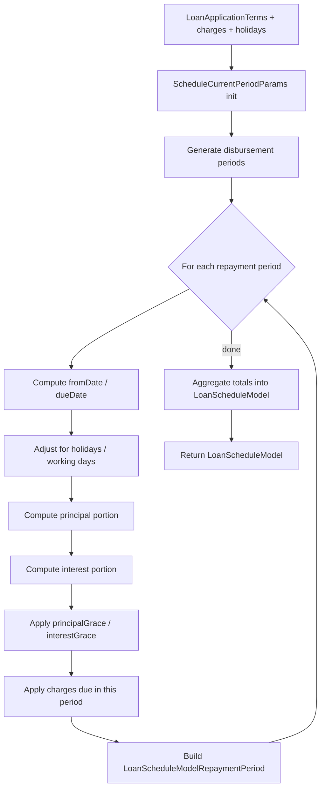

`LoanScheduleGenerator` is the math engine that turns a `LoanApplicationTerms` (principal, rate, term, frequency, grace, charges, holidays) into a `LoanScheduleModel` — the projected list of period rows. Apache Fineract picks one of three concrete generators at runtime based on the product's `LoanScheduleType` (cumulative vs progressive) and `InterestMethod` (declining-balance vs flat), via the `LoanScheduleGeneratorFactory`. This page documents the factory plumbing, the math knobs that select behaviour, and the recalculation handler.

Source files (in `fineract-loan/src/main/java/org/apache/fineract/portfolio/loanaccount/loanschedule/domain/`):

- `LoanScheduleGenerator.java` — the interface
- `LoanScheduleGeneratorFactory.java` — the factory interface (`fineract-loan`)
- `AbstractCumulativeLoanScheduleGenerator.java` — shared cumulative logic
- `CumulativeFlatInterestLoanScheduleGenerator.java`
- `CumulativeDecliningBalanceInterestLoanScheduleGenerator.java`
- `LoanApplicationTerms.java`
- `LoanScheduleModel.java`, `LoanScheduleModelPeriod.java`, `LoanScheduleModelRepaymentPeriod.java`, `LoanScheduleModelDisbursementPeriod.java`
- `DefaultScheduledDateGenerator.java`, `DefaultPaymentPeriodsInOneYearCalculator.java`, `AprCalculator.java`

The factory implementation `DefaultLoanScheduleGeneratorFactory` and the progressive generator live in `fineract-provider` and `fineract-progressive-loan` respectively.

## The interface

```java
public interface LoanScheduleGenerator {

    LoanScheduleModel generate(MathContext mc, LoanApplicationTerms loanApplicationTerms,
                               Set<LoanCharge> loanCharges, HolidayDetailDTO holidayDetailDTO);

    LoanScheduleDTO rescheduleNextInstallments(MathContext mc, LoanApplicationTerms loanApplicationTerms,
            Loan loan, HolidayDetailDTO holidayDetailDTO,
            LoanRepaymentScheduleTransactionProcessor loanRepaymentScheduleTransactionProcessor,
            LocalDate rescheduleFrom);

    LoanScheduleDTO rescheduleNextInstallments(MathContext mc, LoanApplicationTerms loanApplicationTerms,
            Loan loan, HolidayDetailDTO holidayDetailDTO,
            LoanRepaymentScheduleTransactionProcessor loanRepaymentScheduleTransactionProcessor,
            LocalDate rescheduleFrom, LocalDate rescheduleTill);

    OutstandingAmountsDTO calculatePrepaymentAmount(MonetaryCurrency currency, LocalDate onDate,
            LoanApplicationTerms loanApplicationTerms, MathContext mc, Loan loan,
            HolidayDetailDTO holidayDetailDTO,
            LoanRepaymentScheduleTransactionProcessor loanRepaymentScheduleTransactionProcessor);

    Money getPeriodInterestTillDate(@NotNull LoanRepaymentScheduleInstallment installment,
                                    @NotNull LocalDate targetDate);
}
```

Three responsibilities:

1. **`generate`** — produce a brand-new `LoanScheduleModel` from scratch. Called on application submission and on full reschedule.
2. **`rescheduleNextInstallments`** — recompute the remaining schedule from `rescheduleFrom` onwards, keeping past installments unchanged. Called by interest recalculation, mid-loan reschedule, and tranche disbursement.
3. **`calculatePrepaymentAmount`** — compute the exact prepayment amount to settle as of `onDate` (used by `?command=foreclosure` and `?command=prepayLoan` templates).

Plus the small helper `getPeriodInterestTillDate(installment, targetDate)` used by foreclosure and interest-recalc paths.

## The factory

```java
// fineract-loan
public interface LoanScheduleGeneratorFactory {
    LoanScheduleGenerator create(LoanScheduleType loanScheduleType, InterestMethod interestMethod);
}
```

```java
// fineract-provider
@Component
@RequiredArgsConstructor
public class DefaultLoanScheduleGeneratorFactory implements LoanScheduleGeneratorFactory {

    private final ProgressiveLoanScheduleGenerator                progressiveLoanScheduleGenerator;
    private final CumulativeFlatInterestLoanScheduleGenerator     cumulativeFlatInterestLoanScheduleGenerator;
    private final CumulativeDecliningBalanceInterestLoanScheduleGenerator
                                                                  cumulativeDecliningBalanceInterestLoanScheduleGenerator;

    @Override
    public LoanScheduleGenerator create(final LoanScheduleType loanScheduleType,
                                        final InterestMethod interestMethod) {
        return switch (loanScheduleType) {
            case CUMULATIVE  -> cumulativeLoanScheduleGenerator(interestMethod);
            case PROGRESSIVE -> progressiveLoanScheduleGenerator;
        };
    }

    private LoanScheduleGenerator cumulativeLoanScheduleGenerator(final InterestMethod interestMethod) {
        return switch (interestMethod) {
            case FLAT               -> cumulativeFlatInterestLoanScheduleGenerator;
            case DECLINING_BALANCE  -> cumulativeDecliningBalanceInterestLoanScheduleGenerator;
            case INVALID            -> null;
        };
    }

    private LoanScheduleGenerator progressiveLoanScheduleGenerator(final InterestMethod interestMethod) {
        return progressiveLoanScheduleGenerator;
    }
}
```

`LoanScheduleType` × `InterestMethod` gives a 2×2 matrix, with the progressive type collapsing both rows:

| LoanScheduleType | InterestMethod | Generator |
| --- | --- | --- |
| `CUMULATIVE` | `FLAT` | `CumulativeFlatInterestLoanScheduleGenerator` |
| `CUMULATIVE` | `DECLINING_BALANCE` | `CumulativeDecliningBalanceInterestLoanScheduleGenerator` |
| `PROGRESSIVE` | * | `ProgressiveLoanScheduleGenerator` (fineract-progressive-loan) |

## InterestMethod, AmortizationMethod, InterestCalculationPeriodMethod

The three enum knobs in `LoanProductRelatedDetail` that drive the math:

```java
public enum InterestMethod {                              // fineract-loan/.../loanproduct/domain
    DECLINING_BALANCE(0, "interestType.declining.balance"),
    FLAT             (1, "interestType.flat"),
    INVALID          (2, "interestType.invalid");
}

public enum AmortizationMethod {
    EQUAL_PRINCIPAL    (0, "amortizationType.equal.principal"),
    EQUAL_INSTALLMENTS (1, "amortizationType.equal.installments"),
    INVALID            (2, "amortizationType.invalid");
}

public enum InterestCalculationPeriodMethod {
    DAILY                    (0, "interestCalculationPeriodType.daily"),
    SAME_AS_REPAYMENT_PERIOD (1, "interestCalculationPeriodType.same.as.repayment.period"),
    INVALID                  (2, "interestCalculationPeriodType.invalid");
}
```

These three are passed in through `LoanApplicationTerms` (copied from `LoanProductRelatedDetail` on submit).

### Declining-balance vs flat interest

**Declining balance** — interest is computed each period on the outstanding principal:

```
interest_n = outstanding_principal_(n-1) × rate_per_period
principal_n = installment_amount − interest_n
outstanding_n = outstanding_(n-1) − principal_n
```

This is what `CumulativeDecliningBalanceInterestLoanScheduleGenerator` does. The classic banking model.

**Flat interest** — interest is computed once over the full term, then split equally across installments regardless of how much has been repaid:

```
total_interest = principal × annual_rate × loan_term_in_years
interest_per_installment = total_interest / number_of_repayments
principal_per_installment = principal / number_of_repayments
```

`CumulativeFlatInterestLoanScheduleGenerator` implements this. Common in MFI products in some jurisdictions.

### Equal-installments vs equal-principal

`AmortizationMethod` selects how each period's split is computed:

- **`EQUAL_INSTALLMENTS`** — every installment has the same total amount (EMI). `FinanicalFunctions.calculateEMI(principal, ratePerPeriod, n)` or `Money.pmt(...)` produces the EMI; principal and interest are split per period.
- **`EQUAL_PRINCIPAL`** — every installment has the same **principal** portion (`principal / n`); the interest portion declines period over period.

In code: the abstract base `AbstractCumulativeLoanScheduleGenerator.calculatePeriodsRepaymentAmounts(...)` branches on `loanApplicationTerms.getAmortizationMethod()`.

### Daily vs same-as-repayment interest period

`InterestCalculationPeriodMethod`:

- **`SAME_AS_REPAYMENT_PERIOD`** — one interest accrual per installment period (the simple model used by flat-interest products).
- **`DAILY`** — each day in the period is its own accrual. Used by declining-balance products with prepayment or non-uniform period lengths.

When `DAILY` is selected, `DefaultPaymentPeriodsInOneYearCalculator` is consulted to map the rate-per-period back to a per-day rate.

## LoanApplicationTerms — the parameter object

`LoanApplicationTerms` is immutable, built via its inner `Builder`. The key fields that the generators consult:

| Field | Purpose |
| --- | --- |
| `principal` (`Money`) | Loan principal |
| `numberOfRepayments` | Term length in installments |
| `repaymentEvery` | Period count per installment |
| `repaymentPeriodFrequencyType` | DAY/WEEK/MONTH/YEAR |
| `annualNominalInterestRate` | Annual % |
| `interestMethod` | FLAT / DECLINING_BALANCE |
| `interestCalculationPeriodMethod` | DAILY / SAME_AS_REPAYMENT_PERIOD |
| `amortizationMethod` | EQUAL_PRINCIPAL / EQUAL_INSTALLMENTS |
| `expectedDisbursementDate` | Loan starts |
| `repaymentsStartingFromDate` | First installment due |
| `interestChargedFromDate` | Interest start (may differ from disbursement for grace) |
| `principalGrace` | Periods with zero principal portion |
| `interestPaymentGrace` | Periods where interest is deferred (but still accrues) |
| `interestChargingGrace` | Periods where interest is not even accrued |
| `fixedEmiAmount` | Override EMI (used for equal-installments) |
| `principalThresholdForLastInstalment` | Tail-rounding tolerance |
| `disbursementDatas` (`List<DisbursementData>`) | Multi-tranche disbursement |
| `loanTermVariations` | Mid-term rate/date overrides |
| `loanScheduleType`, `loanScheduleProcessingType` | Picks the generator family |
| `fixedPrincipalPercentagePerInstallment` | Equal-principal rounding |
| `daysInYearType`, `daysInMonthType` | Year/month convention (360/365 etc.) |
| `holidayDetailDTO` | Holiday adjustment rules |

## The cumulative generator pipeline

Both cumulative generators inherit from `AbstractCumulativeLoanScheduleGenerator`. The `generate(...)` pipeline:



Key intermediate types:

- **`ScheduleCurrentPeriodParams`** — running state across iterations (outstanding principal, cumulative interest, etc.).
- **`PrincipalInterest`** — small tuple of `(principal, interest, interestPaymentDue)` produced by `calculatePrincipalInterestComponentsForPeriod(...)`.
- **`ScheduledDateGenerator`** — produces the actual `dueDate` from a base date + repayment period, accounting for holidays. The default impl is `DefaultScheduledDateGenerator`.

For multi-tranche, `LoanScheduleModelDisbursementPeriod` rows are interleaved into the model marking when each tranche is expected.

## The progressive generator (cross-reference)

`ProgressiveLoanScheduleGenerator` (in `fineract-progressive-loan/.../loanschedule/`) takes a different approach: the schedule is recomputed end-to-end on every transaction, using `EMICalculator` and the per-installment fixed-payment model. Detailed in [Progressive loan overview](/progressive-loan/overview).

## Recalculation handler

When interest recalculation is enabled on the product (`isInterestRecalculationEnabled`), every payment that lands before the next installment due date can change the future interest schedule. The orchestrator is `LoanScheduleService.regenerateRepaymentSchedule(loan, scheduleGeneratorDTO)`:

```java
public interface LoanScheduleService {
    void   regenerateRepaymentSchedule(Loan loan, ScheduleGeneratorDTO dto);
    LoanScheduleDTO rescheduleNextInstallments(Loan loan, LocalDate recalculateFrom,
                                               ScheduleGeneratorDTO dto, boolean wasArchivedScheduleDeleted);
    // …
}
```

The implementation:

1. **Pick generator** via `dto.getLoanScheduleFactory().create(loan.getLoanScheduleType(), loan.getInterestMethod())`.
2. **Build `LoanApplicationTerms`** from the current `Loan` state (taking interim term variations into account).
3. **Archive the existing schedule** by copying installments into `LoanRepaymentScheduleHistory` (see [Repayment schedule domain](/loan/loan-repayment-schedule-domain)).
4. **Run `generator.generate(...)`** or **`generator.rescheduleNextInstallments(...)`** depending on whether full or partial regeneration is needed.
5. **Replace `Loan.repaymentScheduleInstallments`** with the new rows (existing entries beyond `recalculateFrom` are removed via orphanRemoval).
6. **Re-replay all transactions** through the `LoanRepaymentScheduleTransactionProcessor` to repopulate the `*Completed` derived columns.

This is wired into `LoanWritePlatformServiceJpaRepositoryImpl.recalculateInterest(...)` and called from any path that mutates interest-bearing terms (e.g. tranche addition, EMI amount change, reschedule, repayment under recalculation).

## Schedule recalculation command handler

There is a dedicated REST endpoint `POST /v1/loans/{loanId}?command=recalculateInterest` (mapping in `LoansApiResource`):

```java
} else if (CommandParameterUtil.is(commandParam, "recalculateInterest")) {
    commandRequest = builder.recalculateInterestOnLoan(resolvedLoanId).build();
}
```

The handler bean `RecalculateInterestOnLoanCommandHandler` calls `LoanWritePlatformService.recalculateInterest(loanId)` which in turn calls `LoanScheduleService.regenerateRepaymentSchedule(loan, …)`.

A daily Spring Batch job — `LOAN_RECALCULATE_INTEREST_FOR_LOANS` — also reaches the same service.

## ScheduleGeneratorDTO

`ScheduleGeneratorDTO` is the bundle passed in from write services:

```java
public final class ScheduleGeneratorDTO {
    final LoanScheduleGeneratorFactory loanScheduleFactory;
    final CurrencyData                 currency;
    final ApplicationCurrency          applicationCurrency;
    final LocalDate                    recalculateFrom;
    final HolidayDetailDTO             holidayDetailDTO;
    final BigDecimal                   overdueCharge;
    final Money                        overdueChargeAmount;
    final boolean                      isInterestRecalculationEnabled;
    final boolean                      isFirstRepaymentDateAllowedOnHoliday;
    final boolean                      isInterestToBeRecoveredFirstWhenGreaterThanEMI;
    final boolean                      isPrincipalCompoundingDisabledForOverdueLoans;
    final LocalDate                    businessDate;
    // …
}
```

`LoanUtilService.buildScheduleGeneratorDTO(loan, recalculateFrom)` constructs it; the bool flags come from `ConfigurationDomainService` (the global configuration).

## HolidayDetailDTO

```java
public final class HolidayDetailDTO {
    final boolean isHolidayEnabled;
    final List<Holiday> holidays;
    final WorkingDays workingDays;
    final boolean allowTransactionsOnHoliday;
    final boolean allowTransactionsOnNonWorkingDay;
    final List<RepaymentRescheduleType> repaymentReschedulingType;
}
```

Built from `HolidayRepositoryWrapper` and `WorkingDaysRepositoryWrapper`. `DefaultScheduledDateGenerator` consults it to shift due dates onto the next valid working day per the configured rescheduling rule.

## Prepayment calculation

```java
OutstandingAmountsDTO calculatePrepaymentAmount(MonetaryCurrency currency, LocalDate onDate,
        LoanApplicationTerms loanApplicationTerms, MathContext mc, Loan loan,
        HolidayDetailDTO holidayDetailDTO,
        LoanRepaymentScheduleTransactionProcessor loanRepaymentScheduleTransactionProcessor);
```

The generator implementation computes the principal outstanding as of `onDate`, plus the prorated interest portion via `getPeriodInterestTillDate(installment, onDate)`. Returns an `OutstandingAmountsDTO` with `principal`, `interest`, `feeCharges`, `penaltyCharges`. Used by:

- `LoanReadPlatformService.retrieveLoanForeclosureTemplate(loanId, transactionDate)`
- `?command=prepayLoan` template
- The foreclosure write path in `LoanWritePlatformServiceJpaRepositoryImpl.forecloseLoan(...)`

## APR calculation

`AprCalculator` computes the effective Annual Percentage Rate from the rate / frequency / amortization combo:

```java
public class AprCalculator {
    public BigDecimal calculateFrom(PeriodFrequencyType repaymentPeriodFrequencyType,
                                    BigDecimal interestRatePerPeriod,
                                    int numberOfRepayments);
}
```

Surfaced on `LoanAccountData.annualNominalInterestRate` and on the product summary.

## Generator math helpers

`FinanicalFunctions` (note the typo, intentional) wraps the standard finance math:

```java
public final class FinanicalFunctions {
    public static double calculateEMI(double principal, double ratePerPeriod, int n);
    public static double pmt(double rate, int nper, double pv, double fv, boolean type);
    // … fv, pv, ipmt, ppmt
}
```

`PaymentPeriodsInOneYearCalculator` projects how many periods fit into a year given the rate basis (360/365/`actualDaysInYear`).

## Writing a new generator (extension point)

To add a new schedule type, three things are needed:

1. Implement `LoanScheduleGenerator` (probably by extending `AbstractCumulativeLoanScheduleGenerator`).
2. Annotate `@Component` so Spring picks it up.
3. Update (or replace) `DefaultLoanScheduleGeneratorFactory` to return your generator for the new `LoanScheduleType` value.

Because the factory bean is `@Component`, your replacement bean wins via `@Primary` or by being defined in a more specific configuration class. The progressive scheduler is added this way from a separate Gradle module.

## Schedule API resource

The read-only "compute a schedule without persisting" endpoint is `LoanScheduleApiResource`:

```text
POST /v1/loans?command=calculateLoanSchedule
```

This passes the JSON through `LoanScheduleAssembler` and returns the generated `LoanScheduleData`. Used by the UI for "preview before submission".

## Cross-references

<CardGroup cols={2}>
  <Card title="Repayment schedule domain" icon="calendar-days" href="/loan/loan-repayment-schedule-domain">
    The persistent installment rows the generator produces.
  </Card>
  <Card title="Transaction processors" icon="filter" href="/loan/transaction-processors">
    How the schedule is consumed by repayment allocation.
  </Card>
  <Card title="Progressive loan overview" icon="arrows-rotate" href="/progressive-loan/overview">
    The progressive generator and the advanced payment allocation strategy.
  </Card>
  <Card title="Loan write service" icon="pen-to-square" href="/loan/loan-write-service">
    Where `LoanScheduleService.regenerateRepaymentSchedule(...)` is invoked from.
  </Card>
  <Card title="Loan COB business steps" icon="calendar-day" href="/cob/loan-cob-business-steps">
    The `LOAN_INTEREST_RECALCULATION` daily step that re-runs the generator.
  </Card>
</CardGroup>
