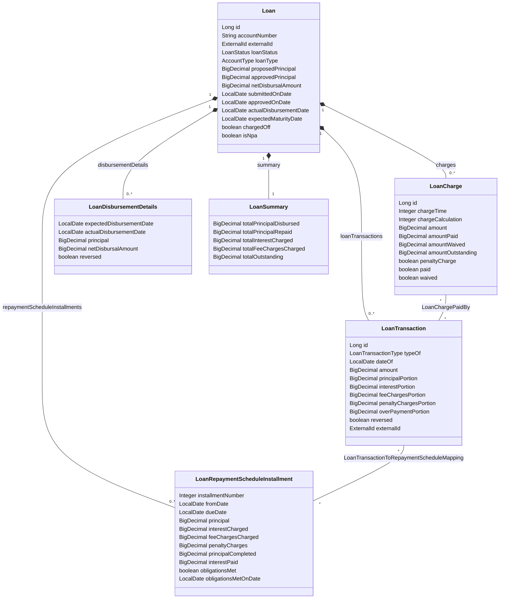
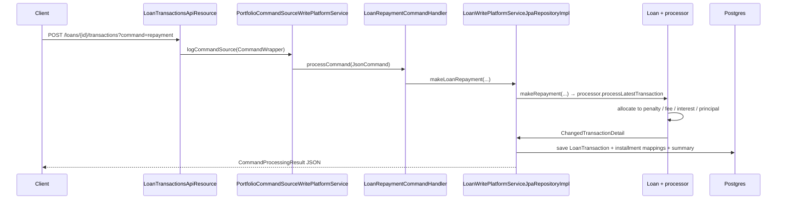

The `fineract-loan` Gradle module is the heart of Apache Fineract's lending domain. It owns the JPA entities, the repayment-schedule generators, the transaction processors (the strategies that decide how a payment is allocated across penalty/fee/interest/principal), and the service interfaces consumed by the rest of the platform. The runtime REST resources live one level up in `fineract-provider/src/main/java/org/apache/fineract/portfolio/loanaccount/api/` and they delegate every state-changing call through the `CommandWrapperBuilder` → `PortfolioCommandSourceWritePlatformService` chain documented in [Command source pipeline](/command/command-source).

Use this page as the index. Each child page focuses on a single sub-area; the table at the bottom maps every public Java symbol back to the page that documents it.

## Source tree at a glance

`fineract-loan/src/main/java/org/apache/fineract/portfolio/loanaccount/`:

```text
api/              LoanApiConstants, LoanTransactionApiConstants, *ApiResourceSwagger
command/          LoanUpdateCommand and friends (JSON → command DTO)
data/             LoanAccountData, LoanTransactionData, LoanChargeData, …
domain/           Loan, LoanTransaction, LoanCharge, LoanRepaymentScheduleInstallment, …
  └─ transactionprocessor/    LoanRepaymentScheduleTransactionProcessor + impl/*
  └─ arrears/, reaging/, reamortization/   Per-feature sub-aggregates
exception/        LoanNotFoundException, LoanTransactionNotFoundException, …
guarantor/        Guarantor entity tree
handler/          CommandHandler beans (one per CommandWrapperBuilder verb)
jobs/             Spring Batch step definitions surfaced as scheduler jobs
loanschedule/     LoanScheduleGenerator interface + Cumulative/Progressive impls
mapper/           MapStruct mappers (entity ↔ data ↔ DTO)
rescheduleloan/   LoanRescheduleRequest entity + assemblers
serialization/    LoanApplicationCommandFromApiJsonDeserializer, validators
service/          LoanReadPlatformService, LoanWritePlatformService, …
starter/          Spring Boot auto-config wiring
```

The actual REST controllers and the JPA implementations of the write/read services live in `fineract-provider`. The `fineract-progressive-loan` module adds the `AdvancedPaymentScheduleTransactionProcessor` and the progressive schedule generator — see [Progressive loan overview](/progressive-loan/overview).

## Core entity relationships



Three rules govern the graph:

1. **Loan is the aggregate root.** Every cascade is rooted at `Loan` — `CascadeType.ALL` plus `orphanRemoval = true` on `charges`, `repaymentScheduleInstallments`, `loanTransactions`, `disbursementDetails`. Deleting a draft `Loan` (status `SUBMITTED_AND_PENDING_APPROVAL`) cascades to all four collections.
2. **Transactions and installments are joined through `LoanTransactionToRepaymentScheduleMapping`.** Each repayment row can map across multiple installments; each installment row can be touched by many transactions. Allocation is performed by a `LoanRepaymentScheduleTransactionProcessor` — see [Transaction processors](/loan/transaction-processors).
3. **Charges record their payment through `LoanChargePaidBy`.** A `LoanTransaction.loanChargesPaid` set indicates exactly which `LoanCharge` (and how much) the transaction cleared.

## Request flow: a repayment from REST to the database



The same shape governs every state-changing endpoint. For the read side, the controller calls `LoanReadPlatformService` directly without a command-handler hop — see [Loan read service](/loan/loan-read-service).

## Sub-page map

<CardGroup cols={2}>
  <Card title="Loan domain model" icon="database" href="/loan/loan-domain-model">
    Field-by-field walkthrough of `Loan`, `LoanStatus`, `LoanType` / `AccountType`, `LoanSubStatus`, `LoanDisbursementDetails`, and `LoanSummary`.
  </Card>
  <Card title="Loan charges" icon="receipt" href="/loan/loan-charges">
    `LoanCharge` lifecycle, `LoanInstallmentCharge`, `LoanTrancheCharge`, and how `ChargeTimeType` maps onto disbursement vs specified-due vs installment fees.
  </Card>
  <Card title="Loan transactions" icon="arrow-right-arrow-left" href="/loan/loan-transactions">
    All 35+ `LoanTransactionType` values, the `LoanTransactionRelation` chain used by chargebacks and refunds, and the reversal rules.
  </Card>
  <Card title="Repayment schedule domain" icon="calendar-days" href="/loan/loan-repayment-schedule-domain">
    `LoanRepaymentScheduleInstallment`, `LoanRepaymentScheduleHistory`, and the schedule-period model produced by the generators.
  </Card>
  <Card title="Application write service" icon="file-pen" href="/loan/loan-application-write-service">
    `LoanApplicationWritePlatformServiceJpaRepositoryImpl` — submit, modify, approve, undo-approval, disburse, undo-disbursal, delete.
  </Card>
  <Card title="Loan write service" icon="pen-to-square" href="/loan/loan-write-service">
    `LoanWritePlatformServiceJpaRepositoryImpl` — repayments, waivers, write-offs, charge-off, goodwill credit, merchant-issued refund.
  </Card>
  <Card title="Loan read service" icon="magnifying-glass" href="/loan/loan-read-service">
    `LoanReadPlatformServiceImpl` — the JDBC-backed query layer, hand-written SQL, RowMappers, and the pagination helpers.
  </Card>
  <Card title="Schedule generator" icon="table" href="/loan/loan-schedule-generator">
    `LoanScheduleGeneratorFactory`, declining-balance vs flat interest, equal-installment vs equal-principal amortization.
  </Card>
  <Card title="Transaction processors" icon="filter" href="/loan/transaction-processors">
    The nine shipped cumulative strategies — `mifos-standard`, `rbi-india`, `creocore`, `heavensfamily`, `early-repayment`, due-pen-int-pri-fee, due-pen-fee-int-pri, interest-principal-penalty-fees-order, principal-interest-penalty-fees-order — plus the progressive `advanced-payment-allocation-strategy`.
  </Card>
  <Card title="Loans API" icon="globe" href="/loan/loans-api">
    `LoansApiResource` — `GET/POST/PUT/DELETE /v1/loans` and the long `?command=...` switchboard on `POST /v1/loans/{loanId}`.
  </Card>
  <Card title="Loan transactions API" icon="globe" href="/loan/loan-transactions-api">
    `LoanTransactionsApiResource` — `POST /v1/loans/{loanId}/transactions?command=repayment|writeoff|charge-off|...` plus adjustment.
  </Card>
  <Card title="Loan charges API" icon="globe" href="/loan/loan-charges-api">
    `LoanChargesApiResource` — list/create/update/delete charges plus `?command=pay|waive|adjustment|deactivateOverdue`.
  </Card>
  <Card title="Loan disbursement API" icon="globe" href="/loan/loan-disbursement-api">
    `LoanDisbursementDetailApiResource` — multi-tranche disbursement details (`/v1/loans/{loanId}/disbursements`).
  </Card>
</CardGroup>

## Closely related areas (outside this folder)

- **[Progressive loan overview](/progressive-loan/overview)** — the `fineract-progressive-loan` module that adds `AdvancedPaymentScheduleTransactionProcessor` and the progressive schedule generator. The `LoanScheduleType` enum (`CUMULATIVE` vs `PROGRESSIVE`) lives in `fineract-loan` but the progressive impl lives there.
- **[Loan COB business steps](/cob/loan-cob-business-steps)** — the daily Spring Batch steps that ride on the same `Loan` aggregate to apply overdue charges, classify delinquency, age arrears, and post accruals.
- **[Accounting processors](/accounting/accounting-processors)** — `LoanJournalEntryPoster` and the matching `AccountingProcessorForLoan` chain that turn `LoanTransaction` events into journal entries.
- **[Loan APIs (catalog)](/api/loans)** — Swagger-style catalog of every endpoint with request/response shapes if you only need the wire contract.

## Module boundaries and dependencies

`fineract-loan` depends on `fineract-core` (for `MonetaryCurrency`, `Money`, `JsonCommand`, `CommandWrapper`, `ExternalId`, `AbstractAuditableWithUTCDateTimeCustom`, `LoanStatus`). The loan-product domain (`LoanProduct`, `LoanProductRelatedDetail`, `InterestMethod`, `AmortizationType`) lives inside the same module under `portfolio/loanproduct/`. The module is consumed by:

| Consumer | What it imports from fineract-loan |
| --- | --- |
| `fineract-provider` | All service interfaces, all entities, the API resources are implemented here |
| `fineract-progressive-loan` | `Loan`, `LoanTransaction`, `LoanRepaymentScheduleInstallment`, `AbstractLoanRepaymentScheduleTransactionProcessor` |
| `fineract-investor` | `Loan` and `LoanTransaction` (for external asset owner transfers) |
| `fineract-accounting` | `LoanTransaction`, `LoanTransactionType` to drive journal entries |

There is no Spring web layer inside `fineract-loan` itself — only POJOs, JPA entities, interfaces, and Spring `@Component` beans for the schedule generators, transaction processor implementations, and assemblers. The actual `@Path` resources live in `fineract-provider/.../portfolio/loanaccount/api/`.

## Public symbol → page lookup

| Symbol | Documented on |
| --- | --- |
| `Loan`, `LoanStatus`, `LoanSubStatus`, `LoanSummary`, `LoanDisbursementDetails` | [Loan domain model](/loan/loan-domain-model) |
| `LoanCharge`, `LoanInstallmentCharge`, `LoanTrancheCharge`, `LoanChargePaidBy`, `LoanOverdueInstallmentCharge` | [Loan charges](/loan/loan-charges) |
| `LoanTransaction`, `LoanTransactionType`, `LoanTransactionRelation`, `LoanTransactionRelationTypeEnum`, `LoanTransactionToRepaymentScheduleMapping` | [Loan transactions](/loan/loan-transactions) |
| `LoanRepaymentScheduleInstallment`, `LoanRepaymentScheduleHistory`, `LoanScheduleModel`, `LoanScheduleModelPeriod`, `LoanScheduleParams` | [Repayment schedule domain](/loan/loan-repayment-schedule-domain) |
| `LoanApplicationWritePlatformService` + JPA impl, `LoanAssembler` | [Application write service](/loan/loan-application-write-service) |
| `LoanWritePlatformService` + JPA impl, `LoanAccountDomainService` | [Loan write service](/loan/loan-write-service) |
| `LoanReadPlatformService` + impl | [Loan read service](/loan/loan-read-service) |
| `LoanScheduleGenerator`, `LoanScheduleGeneratorFactory`, `Cumulative*`, `AbstractCumulative*` | [Schedule generator](/loan/loan-schedule-generator) |
| `LoanRepaymentScheduleTransactionProcessor`, `AbstractLoan...Processor`, all `impl/*` classes | [Transaction processors](/loan/transaction-processors) |
| `LoansApiResource` | [Loans API](/loan/loans-api) |
| `LoanTransactionsApiResource` | [Loan transactions API](/loan/loan-transactions-api) |
| `LoanChargesApiResource` | [Loan charges API](/loan/loan-charges-api) |
| `LoanDisbursementDetailApiResource` | [Loan disbursement API](/loan/loan-disbursement-api) |

<Tip>
When in doubt, start from the `Loan` entity ([Loan domain model](/loan/loan-domain-model)) and follow the field types into the page that documents them. Every collection on `Loan` is exhaustively cross-linked from there.
</Tip>

## Where each lifecycle event lands

A complete tour of the major lifecycle verbs and which subsystem implements them:

| Verb | HTTP path + command | Service method | Page |
| --- | --- | --- | --- |
| Submit application | `POST /v1/loans` | `LoanApplicationWritePlatformService.submitApplication` | [App write service](/loan/loan-application-write-service) |
| Modify application | `PUT /v1/loans/{loanId}` | `modifyApplication` | [App write service](/loan/loan-application-write-service) |
| Delete (only pending) | `DELETE /v1/loans/{loanId}` | `deleteApplication` | [App write service](/loan/loan-application-write-service) |
| Approve | `POST /v1/loans/{loanId}?command=approve` | `approveApplication` | [App write service](/loan/loan-application-write-service) |
| Undo approval | `?command=undoapproval` | `undoApplicationApproval` | [App write service](/loan/loan-application-write-service) |
| Reject | `?command=reject` | `rejectApplication` | [App write service](/loan/loan-application-write-service) |
| Withdraw | `?command=withdrawnByApplicant` | `applicantWithdrawsFromApplication` | [App write service](/loan/loan-application-write-service) |
| Disburse | `?command=disburse` | `LoanWritePlatformService.disburseLoan` | [Loan write service](/loan/loan-write-service) |
| Undo disbursal | `?command=undodisbursal` | `undoLoanDisbursal` | [Loan write service](/loan/loan-write-service) |
| Make repayment | `POST /v1/loans/{loanId}/transactions?command=repayment` | `makeLoanRepayment(REPAYMENT, …)` | [Loan write service](/loan/loan-write-service) |
| Waive interest | `?command=waiveinterest` | `waiveInterestOnLoan` | [Loan write service](/loan/loan-write-service) |
| Write-off | `?command=writeoff` | `writeOff` | [Loan write service](/loan/loan-write-service) |
| Charge-off | `?command=charge-off` | `chargeOff` | [Loan write service](/loan/loan-write-service) |
| Foreclose | `?command=foreclosure` | `forecloseLoan` | [Loan write service](/loan/loan-write-service) |
| Add charge | `POST /v1/loans/{loanId}/charges` | `LoanChargeWritePlatformService.addLoanCharge` | [Loan charges API](/loan/loan-charges-api) |
| Pay charge | `POST /v1/loans/{loanId}/charges/{id}?command=pay` | `payLoanCharge` | [Loan charges API](/loan/loan-charges-api) |
| Waive charge | `?command=waive` | `waiveLoanCharge` | [Loan charges API](/loan/loan-charges-api) |
| Edit tranches | `PUT /v1/loans/{loanId}/disbursements/editDisbursements` | `addAndDeleteLoanDisburseDetails` | [Loan disbursement API](/loan/loan-disbursement-api) |

## What this page is not

This page deliberately does not document the rescheduling flow (`fineract-loan/.../rescheduleloan/`), the guarantor sub-aggregate, the GLIM / GSIM helpers, the bulk-import workbook populators, or the data-table associations. Those are covered by dedicated pages elsewhere in the wiki — most notably under `loan/reschedule-loans`, `loan/guarantors`, `loan/glim-group-loans`, and `runtime/bulk-import`.

It also does not cover the daily COB pipeline (delinquency, arrears aging, overdue charges, periodic accrual) — that's [Loan COB business steps](/cob/loan-cob-business-steps) — or the accounting reclass that follows every transaction — that's [Accounting processors](/accounting/accounting-processors).

## When to read which page first

- **You are tracking down a bug in a write path** → start with the relevant `?command=` row in [Loans API](/loan/loans-api) / [Loan transactions API](/loan/loan-transactions-api), follow the handler bean, then the service method on [Loan write service](/loan/loan-write-service).
- **You need to know how a repayment is allocated** → [Transaction processors](/loan/transaction-processors).
- **You need to know how a schedule is built** → [Schedule generator](/loan/loan-schedule-generator) then [Repayment schedule domain](/loan/loan-repayment-schedule-domain).
- **You need the database shape** → [Loan domain model](/loan/loan-domain-model) is the canonical reference; the JPA `@Column` annotations are reproduced verbatim from `Loan.java`.
- **You need the wire shape** → [Loans API](/loan/loans-api), [Loan transactions API](/loan/loan-transactions-api), [Loan charges API](/loan/loan-charges-api), [Loan disbursement API](/loan/loan-disbursement-api).
