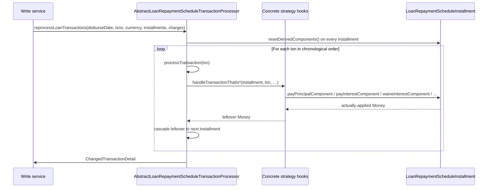

A `LoanRepaymentScheduleTransactionProcessor` decides how money flowing into an Apache Fineract loan is split across the four buckets — **penalty**, **fee**, **interest**, **principal** — and how it cascades across installments. The bucket order, advance-payment handling, and late-payment handling are different for every shipped strategy. The product picks one by setting `transactionProcessingStrategyCode` on `LoanProductRelatedDetail` (and the chosen code is copied onto every loan at submission).

This page documents the interface, the abstract base, the seven shipped cumulative strategies (in `fineract-loan`), and the progressive `AdvancedPaymentScheduleTransactionProcessor` (in `fineract-progressive-loan`).

## The interface

```java
public interface LoanRepaymentScheduleTransactionProcessor {

    String getCode();
    String getName();
    boolean accept(String s);

    /** Process the most-recently-added transaction against the existing schedule. */
    ChangedTransactionDetail processLatestTransaction(LoanTransaction loanTransaction, TransactionCtx ctx);

    /**
     * Re-process the entire transaction history (reverse-replay). Used when:
     *  - a back-dated transaction is added (newTxn.dateOf < some existing.dateOf), or
     *  - an existing transaction is adjusted/reversed.
     */
    ChangedTransactionDetail reprocessLoanTransactions(LocalDate disbursementDate,
            List<LoanTransaction> repaymentsOrWaivers, MonetaryCurrency currency,
            List<LoanRepaymentScheduleInstallment> repaymentScheduleInstallments,
            Set<LoanCharge> charges);

    Money handleRepaymentSchedule(List<LoanTransaction> transactionsPostDisbursement,
            MonetaryCurrency currency,
            List<LoanRepaymentScheduleInstallment> installments,
            Set<LoanCharge> loanCharges);

    /** Used by interest recalculation to introduce a new interest-only installment. */
    boolean isInterestFirstRepaymentScheduleTransactionProcessor();
}
```

`accept(String code)` returns true when the processor's `STRATEGY_CODE` matches — this lets a list of processors be probed in order.

## `TransactionCtx`

```java
public class TransactionCtx {
    private final MonetaryCurrency currency;
    private final List<LoanRepaymentScheduleInstallment> installments;
    private final Set<LoanCharge> charges;
    private final MoneyHolder overpaymentHolder;
    private final ChangedTransactionDetail changedTransactionDetail;
    private final List<LoanTermVariations> activeTermVariations;
    // …
}
```

`MoneyHolder` is a mutable wrapper for the running overpayment balance — the processor updates it as installments overflow.

## `ChangedTransactionDetail`

Returned by both `processLatestTransaction` and `reprocessLoanTransactions`. It is the bookkeeping object the calling write service uses to know which transactions to journal-post for accounting:

```java
public class ChangedTransactionDetail {
    private final Map<Long, LoanTransaction> newTransactionMappings = new LinkedHashMap<>();
    private final List<LoanTransaction> newTransactions = new ArrayList<>();
    // accessors
}
```

`newTransactionMappings` maps the original (now-reversed) transaction's id → the replacement transaction. `newTransactions` is the chronological replay sequence.

## `AbstractLoanRepaymentScheduleTransactionProcessor`

The base class implements `processLatestTransaction` and `reprocessLoanTransactions` once. Subclasses override **three** allocation hooks:

```java
public abstract class AbstractLoanRepaymentScheduleTransactionProcessor
        implements LoanRepaymentScheduleTransactionProcessor {

    @Override
    public ChangedTransactionDetail processLatestTransaction(LoanTransaction loanTransaction, TransactionCtx ctx) { … }

    @Override
    public ChangedTransactionDetail reprocessLoanTransactions(LocalDate disbursementDate,
            List<LoanTransaction> repaymentsOrWaivers, MonetaryCurrency currency,
            List<LoanRepaymentScheduleInstallment> repaymentScheduleInstallments,
            Set<LoanCharge> charges) { … }

    /** Allocation when payment matches the current period exactly. */
    protected abstract Money handleTransactionThatIsOnTimePaymentOfInstallment(
            LoanRepaymentScheduleInstallment currentInstallment,
            LoanTransaction loanTransaction, Money transactionAmountUnprocessed,
            List<LoanTransactionToRepaymentScheduleMapping> transactionMappings, Set<LoanCharge> charges);

    /** Allocation when payment lands before the current period's due date. */
    protected abstract Money handleTransactionThatIsPaymentInAdvanceOfInstallment(
            LoanRepaymentScheduleInstallment currentInstallment,
            List<LoanRepaymentScheduleInstallment> installments,
            LoanTransaction loanTransaction, Money paymentInAdvance,
            List<LoanTransactionToRepaymentScheduleMapping> transactionMappings, Set<LoanCharge> charges);

    /** Allocation when payment lands after a period that is already overdue. */
    protected abstract Money handleTransactionThatIsALateRepaymentOfInstallment(
            LoanRepaymentScheduleInstallment currentInstallment,
            List<LoanRepaymentScheduleInstallment> installments,
            LoanTransaction loanTransaction, Money transactionAmountUnprocessed,
            List<LoanTransactionToRepaymentScheduleMapping> transactionMappings, Set<LoanCharge> charges);

    protected Money handleTransactionAndCharges(LoanTransaction loanTransaction,
            MonetaryCurrency currency, …) { … }

    protected Money processTransaction(LoanTransaction loanTransaction, MonetaryCurrency currency, …) { … }
}
```

The abstract base also handles:

- The reverse-replay loop: walk transactions in `(dateOf, createdDate, id)` order, reset installment derived columns at the start, replay every transaction by calling `processTransaction(...)`.
- Splitting the four amounts onto `LoanTransactionToRepaymentScheduleMapping` rows.
- Updating `Loan.summary` via `LoanBalanceService` at the end.

## Reverse-replay pipeline



## Strategy catalogue

The shipped strategies and their codes:

| `STRATEGY_CODE` | `STRATEGY_NAME` | Class | Module |
| --- | --- | --- | --- |
| `mifos-standard-strategy` | Penalties, Fees, Interest, Principal order | `FineractStyleLoanRepaymentScheduleTransactionProcessor` | fineract-loan |
| `heavensfamily-strategy` | HeavensFamily Unique | `HeavensFamilyLoanRepaymentScheduleTransactionProcessor` | fineract-loan |
| `creocore-strategy` | Creocore Unique | `CreocoreLoanRepaymentScheduleTransactionProcessor` | fineract-loan |
| `rbi-india-strategy` | Overdue/Due Fee/Int,Principal | `RBILoanRepaymentScheduleTransactionProcessor` | fineract-loan |
| `early-repayment-strategy` | Early Repayment Strategy | `EarlyPaymentLoanRepaymentScheduleTransactionProcessor` | fineract-loan |
| `interest-principal-penalties-fees-order-strategy` | Interest, Principal, Penalties, Fees Order | `InterestPrincipalPenaltyFeesOrderLoanRepaymentScheduleTransactionProcessor` | fineract-loan |
| `principal-interest-penalties-fees-order-strategy` | Principal, Interest, Penalties, Fees Order | `PrincipalInterestPenaltyFeesOrderLoanRepaymentScheduleTransactionProcessor` | fineract-loan |
| `due-penalty-fee-interest-principal-in-advance-principal-penalty-fee-interest-strategy` | (verbose) | `DuePenFeeIntPriInAdvancePriPenFeeIntLoanRepaymentScheduleTransactionProcessor` | fineract-loan |
| `due-penalty-interest-principal-fee-in-advance-penalty-interest-principal-fee-strategy` | (verbose) | `DuePenIntPriFeeInAdvancePenIntPriFeeLoanRepaymentScheduleTransactionProcessor` | fineract-loan |
| `advanced-payment-allocation-strategy` | Advanced payment allocation strategy | `AdvancedPaymentScheduleTransactionProcessor` | fineract-progressive-loan |

### Fineract style (`mifos-standard-strategy`)

```java
public class FineractStyleLoanRepaymentScheduleTransactionProcessor
        extends AbstractLoanRepaymentScheduleTransactionProcessor {

    public static final String STRATEGY_CODE = "mifos-standard-strategy";
    public static final String STRATEGY_NAME = "Penalties, Fees, Interest, Principal order";
    // ctor (externalIdFactory, loanChargeValidator, loanBalanceService)
}
```

Allocation order is **penalty → fee → interest → principal**. All three hooks (`handleTransactionThatIsOnTime`, `…InAdvance`, `…LateRepayment`) delegate to the same on-time handler. Used by most Fineract installations as the default.

```text
Payment 100 to installment with (penalty 5, fee 10, interest 20, principal 80):
  → penalty 5  (remaining 95)
  → fee     10 (remaining 85)
  → interest 20 (remaining 65)
  → principal 65 (overflow 0)
```

### HeavensFamily (`heavensfamily-strategy`)

```java
public class HeavensFamilyLoanRepaymentScheduleTransactionProcessor
        extends AbstractLoanRepaymentScheduleTransactionProcessor {
    public static final String STRATEGY_CODE = "heavensfamily-strategy";
    public static final String STRATEGY_NAME = "HeavensFamily Unique";
}
```

Pays interest first then principal on the current installment. **If a payment is in-advance, only principal is taken** (interest is waived for any installment whose principal is fully prepaid). Late payments fall back to the on-time order.

### Creocore (`creocore-strategy`)

```java
public class CreocoreLoanRepaymentScheduleTransactionProcessor
        extends AbstractLoanRepaymentScheduleTransactionProcessor {
    public static final String STRATEGY_CODE = "creocore-strategy";
    public static final String STRATEGY_NAME  = "Creocore Unique";
}
```

Similar to HeavensFamily for ordering — **interest first, then principal**. Advance overflow goes onto the next installment's principal. If the entire principal of an installment is paid in advance, the interest component is waived. Late and on-time payments use the same path.

```java
@Override
protected Money handleTransactionThatIsPaymentInAdvanceOfInstallment(...) {
    return handleTransactionThatIsOnTimePaymentOfInstallment(currentInstallment,
            loanTransaction, paymentInAdvance, transactionMappings, charges);
}
```

### RBI India (`rbi-india-strategy`)

```java
public class RBILoanRepaymentScheduleTransactionProcessor
        extends AbstractLoanRepaymentScheduleTransactionProcessor {
    public static final String STRATEGY_CODE = "rbi-india-strategy";
    public static final String STRATEGY_NAME = "Overdue/Due Fee/Int,Principal";
}
```

Per RBI regulations, **all interest must be paid (current and overdue) before principal is paid**. So a partial payment of 40 against two installments due of 220 each (200 principal + 20 interest) would split:

```text
20 → interest of installment #1
20 → interest of installment #2
0  → principal of either
```

Implemented by walking every overdue installment, paying interest only; once all interest is cleared, walking again to pay principal.

### Early repayment (`early-repayment-strategy`)

```java
public class EarlyPaymentLoanRepaymentScheduleTransactionProcessor
        extends AbstractLoanRepaymentScheduleTransactionProcessor {
    public static final String STRATEGY_CODE = "early-repayment-strategy";
    public static final String STRATEGY_NAME = "Early Repayment Strategy";
}
```

Order is **interest → principal → penalty → fee**. Advance payments roll the overflow into the **principal of subsequent installments** (so an early lump payment shrinks the term).

### Due-pen-fee-int-pri / In-advance pri-pen-fee-int

```java
public class DuePenFeeIntPriInAdvancePriPenFeeIntLoanRepaymentScheduleTransactionProcessor
        extends AbstractLoanRepaymentScheduleTransactionProcessor {
    public static final String STRATEGY_CODE = "due-penalty-fee-interest-principal-in-advance-principal-penalty-fee-interest-strategy";
    public static final String STRATEGY_NAME = "Due penalty, fee, interest, principal, In advance principal, penalty, fee, interest";
}
```

A combined behaviour:

- **Due / overdue (on-time or late)**: penalty → fee → interest → principal
- **In-advance**: principal → penalty → fee → interest

### Due-pen-int-pri-fee / In-advance pen-int-pri-fee

```java
public class DuePenIntPriFeeInAdvancePenIntPriFeeLoanRepaymentScheduleTransactionProcessor … {
    public static final String STRATEGY_CODE = "due-penalty-interest-principal-fee-in-advance-penalty-interest-principal-fee-strategy";
    public static final String STRATEGY_NAME = "Due penalty, interest, principal, fee, In advance penalty, interest, principal, fee";
}
```

Both due and in-advance follow the same ordering: penalty → interest → principal → fee.

### Interest-principal-penalty-fee

```java
public class InterestPrincipalPenaltyFeesOrderLoanRepaymentScheduleTransactionProcessor … {
    public static final String STRATEGY_CODE = "interest-principal-penalties-fees-order-strategy";
    public static final String STRATEGY_NAME = "Interest, Principal, Penalties, Fees Order";
}
```

Straight interest → principal → penalty → fee. Same hook for all three scenarios.

### Principal-interest-penalty-fee

```java
public class PrincipalInterestPenaltyFeesOrderLoanRepaymentScheduleTransactionProcessor … {
    public static final String STRATEGY_CODE = "principal-interest-penalties-fees-order-strategy";
    public static final String STRATEGY_NAME = "Principal, Interest, Penalties, Fees Order";
}
```

The reverse: principal → interest → penalty → fee. Used when the lender prioritises principal recovery (e.g. NPA loans).

## AdvancedPaymentScheduleTransactionProcessor (progressive)

Lives in `fineract-progressive-loan/src/main/java/org/apache/fineract/portfolio/loanaccount/domain/transactionprocessor/impl/AdvancedPaymentScheduleTransactionProcessor.java`:

```java
public class AdvancedPaymentScheduleTransactionProcessor
        extends AbstractLoanRepaymentScheduleTransactionProcessor {

    public static final String ADVANCED_PAYMENT_ALLOCATION_STRATEGY = "advanced-payment-allocation-strategy";
    public static final String ADVANCED_PAYMENT_ALLOCATION_STRATEGY_NAME = "Advanced payment allocation strategy";

    @Override public String getCode() { return ADVANCED_PAYMENT_ALLOCATION_STRATEGY; }
    @Override public String getName() { return ADVANCED_PAYMENT_ALLOCATION_STRATEGY_NAME; }
    // …
}
```

Unlike the cumulative strategies, this one consults a **per-loan** allocation rule set:

- `LoanPaymentAllocationRule` (in `fineract-loan/.../domain/`) — one row per `PaymentAllocationTransactionType` × buckets. Defines the order of `PaymentAllocationType` (e.g. `PAST_DUE_PRINCIPAL`, `PAST_DUE_INTEREST`, `DUE_PRINCIPAL`, `DUE_INTEREST`, `IN_ADVANCE_PRINCIPAL`, …) and the `FutureInstallmentAllocationRule` for any overflow.
- `LoanCreditAllocationRule` — controls how chargebacks are credit-allocated.
- `LoanScheduleProcessingType` — `HORIZONTAL` (fill installment fully before moving on) vs `VERTICAL` (fill same bucket across all installments first).

The processor walks the rules in order, calling matching `pay*Component` / `waive*Component` methods on installments. The rules are configured per loan (or inherited from the product) — see [Progressive loan overview](/progressive-loan/overview).

The behaviour is significantly more configurable than any cumulative strategy and is required for loans of `LoanScheduleType = PROGRESSIVE`.

## Factory and resolution

`LoanRepaymentScheduleTransactionProcessorFactory` (in `fineract-loan/.../domain/`):

```java
public interface LoanRepaymentScheduleTransactionProcessorFactory {
    LoanRepaymentScheduleTransactionProcessor determineProcessor(String transactionProcessingStrategyCode);
}
```

The default implementation autowires `List<LoanRepaymentScheduleTransactionProcessor>` and returns the first one whose `accept(code)` returns true:

```java
@Override
public LoanRepaymentScheduleTransactionProcessor determineProcessor(String code) {
    return processors.stream()
        .filter(p -> p.accept(code))
        .findFirst()
        .orElseThrow(() -> new UnsupportedLoanTransactionStrategyException(code));
}
```

Used in `LoanAssembler` at application submission, and in `LoanTransactionProcessingService` on every write.

## Accept logic

The default `accept(String code)` on `AbstractLoanRepaymentScheduleTransactionProcessor`:

```java
@Override
public boolean accept(final String s) {
    return s != null && s.equalsIgnoreCase(this.getCode());
}
```

## Choosing a strategy per loan

The product's default is on `LoanProduct.transactionProcessingStrategyCode`. When a loan is created, the assembler:

1. Reads `transactionProcessingStrategy` from the JSON, falling back to the product default.
2. Resolves via the factory.
3. Persists both `code` and `name` onto the new `Loan` row.

Once stored, the loan's processor never changes — even if the product's default is later changed. This is critical: it preserves how the loan was supposed to allocate when historical reconstruction is needed.

## Horizontal vs vertical (progressive only)

```java
public enum LoanScheduleProcessingType {
    HORIZONTAL("Horizontal"),
    VERTICAL("Vertical");
}
```

- **Horizontal** (default): For each installment in order, fill each bucket fully before moving to the next installment.
- **Vertical**: For each bucket in priority order, fill all installments before moving to the next bucket.

Only meaningful for `advanced-payment-allocation-strategy`. The cumulative strategies are implicitly horizontal.

## Interest-first marker

Some strategies override `isInterestFirstRepaymentScheduleTransactionProcessor()` to return true. This is consulted by the interest-recalc code path to know whether a new interest-only installment should be inserted before existing principal — see [Schedule generator](/loan/loan-schedule-generator).

## Cross-references

<CardGroup cols={2}>
  <Card title="Loan transactions" icon="arrow-right-arrow-left" href="/loan/loan-transactions">
    `LoanTransaction.principalPortion / interestPortion / feeChargesPortion / penaltyChargesPortion` — the fields the processor sets.
  </Card>
  <Card title="Repayment schedule" icon="calendar-days" href="/loan/loan-repayment-schedule-domain">
    `LoanRepaymentScheduleInstallment.payPrincipalComponent / payInterestComponent / …` hooks called by the processors.
  </Card>
  <Card title="Loan write service" icon="pen-to-square" href="/loan/loan-write-service">
    `ReprocessLoanTransactionsService` — the bridge that calls `reprocessLoanTransactions(...)`.
  </Card>
  <Card title="Progressive loan overview" icon="arrows-rotate" href="/progressive-loan/overview">
    The progressive scheduler and the per-loan payment allocation rule model.
  </Card>
</CardGroup>
