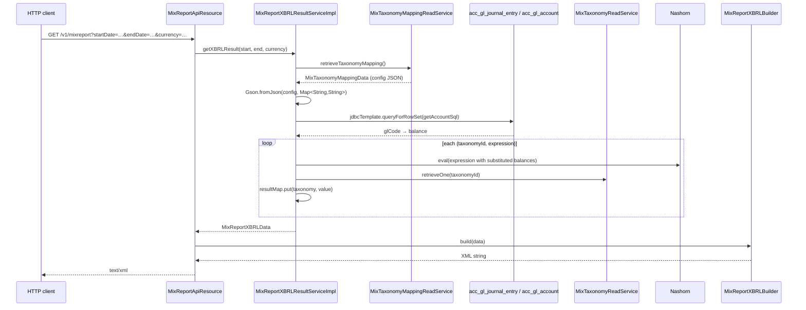

`MixTaxonomyMapping` is the Apache Fineract entity that ties the MIX Market XBRL taxonomy catalog (`mix_taxonomy`) to the **chart of accounts**. A single row stores a JSON `config` blob whose keys are `MixTaxonomy.id` values and whose values are JavaScript expressions over `{glCode}` placeholders. When `/v1/mixreport` is invoked, `MixReportXBRLResultServiceImpl` resolves each expression against the GL balances for the requested date range and currency.

For the catalog itself see [Mix taxonomy](/mix/mix-taxonomy); for the resources see [Mix report API](/mix/mix-report-api).

## `MixTaxonomyMapping` entity

`fineract-mix/src/main/java/org/apache/fineract/mix/domain/MixTaxonomyMapping.java`:

```java
package org.apache.fineract.mix.domain;

import java.io.Serial;
import java.io.Serializable;
import lombok.Getter;
import lombok.NoArgsConstructor;
import lombok.Setter;
import lombok.experimental.Accessors;
import org.springframework.data.annotation.Id;
import org.springframework.data.relational.core.mapping.Column;
import org.springframework.data.relational.core.mapping.Table;

@Table("mix_taxonomy_mapping")
@Getter @Setter @NoArgsConstructor @Accessors(chain = true)
public final class MixTaxonomyMapping implements Serializable {

    @Serial private static final long serialVersionUID = 1L;

    @Id
    @Column("id")
    private Long id;

    @Column("identifier")
    private String identifier;

    @Column("config")
    private String config;

    @Column("currency")
    private String currency;
}
```

Like the rest of the module, this is Spring Data JDBC (not JPA). The table is expected to hold at most **one** row in the current implementation; both the read and write paths assume the row whose `id=1`.

| Column | Field | Purpose |
| --- | --- | --- |
| `id` | `id` | PK. Defaulted to `1L` by the resource when the inbound request lacks an id. |
| `identifier` | `identifier` | An opaque identifier reserved for distinguishing multiple mapping rows (not yet exercised; the resource carries `// TODO support multiple configuration file loading; this is the legacy behavior`). |
| `config` | `config` | A JSON document `{ "<taxonomyId>": "<expression>", ... }`. |
| `currency` | `currency` | ISO currency code attached to the configuration. Forwarded into the XBRL output as the `iso4217` unit. |

The repository is `MixTaxonomyMappingRepository extends CrudRepository<MixTaxonomyMapping, Long>`. The read service simply takes the first row:

```java
@Override
public MixTaxonomyMappingData retrieveTaxonomyMapping() {
    return repository.findAll().stream().findFirst().map(mapper::map).orElse(null);
}
```

`findAll()` does not order — for a singleton row this is fine. If the table ever holds multiple rows, the row returned is undefined.

### `MixTaxonomyMappingData` and `MixTaxonomyMappingMapper`

```java
@Builder @Data @NoArgsConstructor @AllArgsConstructor @Accessors(chain = true)
public class MixTaxonomyMappingData {
    private String identifier;
    private String config;
    private String currency;
}
```

```java
@Mapper(config = MapstructMapperConfig.class)
public interface MixTaxonomyMappingMapper {
    MixTaxonomyMappingData map(MixTaxonomyMapping source);
}
```

Plain projection.

### `MixTaxonomyMappingUpdateRequest` / `Response`

The PUT shape is `MixTaxonomyMappingUpdateRequest`:

```java
@Builder @Data @NoArgsConstructor @AllArgsConstructor
public class MixTaxonomyMappingUpdateRequest implements Serializable {
    @Serial private static final long serialVersionUID = 1L;
    private Long   id;
    private String identifier;
    private String config;
    private String currency;
}
```

The response is just the persisted row id:

```java
@Builder @Data @NoArgsConstructor @AllArgsConstructor
public class MixTaxonomyMappingUpdateResponse implements Serializable {
    @Serial private static final long serialVersionUID = 1L;
    private Long entityId;
}
```

### `MixTaxonomyMappingUpdateRequestMapper`

A MapStruct mapper that converts the request DTO into a `MixTaxonomyMapping` entity. The write service hands the mapped entity to `repository.save(...)` so any pre-existing row with the same id is overwritten:

```java
@Slf4j @RequiredArgsConstructor @Service
public class MixTaxonomyMappingWriteServiceImpl implements MixTaxonomyMappingWriteService {

    private final MixTaxonomyMappingRepository repository;
    private final MixTaxonomyMappingUpdateRequestMapper mapper;

    @Transactional
    @Override
    public MixTaxonomyMappingUpdateResponse updateMapping(@Valid final MixTaxonomyMappingUpdateRequest request) {
        final var taxonomyMapping = mapper.map(request);
        repository.save(taxonomyMapping);
        return MixTaxonomyMappingUpdateResponse.builder().entityId(taxonomyMapping.getId()).build();
    }
}
```

This is a **full replacement**: every field of the inbound request becomes the new row. There is no diffing of the JSON `config` blob.

## Command pipeline integration

Unlike most of the platform, this module uses `fineract-command`'s typed pipeline (not `CommandWrapperBuilder` / `m_command_source`).

```java
@Data @EqualsAndHashCode(callSuper = true)
public class MixTaxonomyMappingUpdateCommand extends Command<MixTaxonomyMappingUpdateRequest> {}
```

The handler:

```java
@Slf4j @Component @RequiredArgsConstructor
public class MixTaxonomyMappingUpdateCommandHandler
        implements CommandHandler<MixTaxonomyMappingUpdateRequest, MixTaxonomyMappingUpdateResponse> {

    private final MixTaxonomyMappingWriteService writeTaxonomyService;

    @Retry(name = "commandMixTaxonomyMappingUpdate", fallbackMethod = "fallback")
    @Transactional
    @Override
    public MixTaxonomyMappingUpdateResponse handle(Command<MixTaxonomyMappingUpdateRequest> command) {
        return writeTaxonomyService.updateMapping(command.getPayload());
    }

    @Override
    public MixTaxonomyMappingUpdateResponse fallback(Command<MixTaxonomyMappingUpdateRequest> command, Throwable t) {
        return CommandHandler.super.fallback(command, t);
    }
}
```

Two characteristics differentiate this from the legacy charge / floating-rate handlers:

- **resilience4j `@Retry`** — the handler is wrapped by retry policy `commandMixTaxonomyMappingUpdate` (configured via Spring properties under `resilience4j.retry.instances.commandMixTaxonomyMappingUpdate.*`). Transient failures (database lock contention, etc.) are retried per the policy. On final failure, the supplied `fallback` returns whatever the default `CommandHandler.fallback` does (which in the base interface is to rethrow the cause).
- **No `m_command_source` entry** — the command pipeline is a Spring component, not the JPA-backed command log. Audit trail relies on the standard `AbstractAuditableCustom` columns *if* the entity extends them. `MixTaxonomyMapping` does **not** extend `AbstractAuditableCustom`, so no audit metadata is captured today.

## The `config` JSON shape

`MixTaxonomyMapping.config` is a string that should parse as `Map<String, String>`:

```json
{
  "1":  "{1101}+{1102}",
  "2":  "{1110}-{2010}",
  "13": "({1101}+{1102})/12"
}
```

Semantics:

- Key — the `MixTaxonomy.id` of the taxonomy item this expression computes (resolved by `MixTaxonomyReadServiceImpl.retrieveOne(Long.parseLong(key))`).
- Value — a JavaScript arithmetic expression where each `{NNN}` placeholder is the **GL code** (`acc_gl_account.gl_code`) whose balance for the date range will be substituted.

### Placeholder extraction

```java
public List<String> getGLCodes(final String template) {
    final ArrayList<String> placeholders = new ArrayList<>();
    if (template != null) {
        final Pattern p = Pattern.compile("\\{(.*?)\\}");
        final Matcher m = p.matcher(template);
        while (m.find()) {
            final String match = m.group();
            final String code = match.substring(1, match.length() - 1);
            placeholders.add(code);
        }
    }
    return placeholders;
}
```

Regex `\{(.*?)\}` (non-greedy) matches every `{GLCODE}` occurrence. Lazy matching keeps nested expressions like `({1101}+{1102})/12` working correctly.

### Substitution and evaluation

```java
private BigDecimal processMappingString(Map<String, BigDecimal> accountBalanceMap, String mappingString) {
    final List<String> glCodes = getGLCodes(mappingString);
    for (final String glcode : glCodes) {
        final BigDecimal balance = accountBalanceMap.get(glcode);
        mappingString = mappingString.replaceAll("\\{" + glcode + "\\}", balance != null ? balance.toString() : "0");
    }
    float eval = 0f;
    try {
        // TODO: this doesn't work anymore in modern JVMs!!!!
        final Number value = (Number) SCRIPT_ENGINE.eval(mappingString);
        if (value != null) {
            eval = value.floatValue();
        }
    } catch (final ScriptException e) {
        log.error("Problem occurred in processMappingString function", e);
        throw new IllegalArgumentException(e.getMessage(), e);
    }
    return BigDecimal.valueOf(eval);
}
```

Behaviour and caveats:

- **Missing GL code → 0**. If the JS expression references a GL code that doesn't appear in the balance map for the date range, the substitution uses literal `"0"`.
- **Final value uses `float`**. `eval.floatValue()` is the precision contract. The returned `BigDecimal.valueOf(float)` therefore inherits float precision — not what you'd normally want for financial calculations.
- **JavaScript engine**. `SCRIPT_ENGINE = new ScriptEngineManager().getEngineByName("JavaScript")` resolves to Nashorn. The source carries `// TODO: this doesn't work anymore in modern JVMs!!!!` because Nashorn was removed from the JDK in 15+. Deployments on a current JDK need the standalone Nashorn artifact (`org.openjdk.nashorn:nashorn-core`) on the classpath; otherwise `SCRIPT_ENGINE` is `null` and the call NPEs.
- **No sandboxing**. The expression executes in the JVM's JS engine without any deny-list. The `config` JSON is therefore **trusted input**; only platform admins should be able to set it.

### GL balance map

`setupBalanceMap(...)` runs the SQL string from `getAccountSql(startDate, endDate)` via `JdbcTemplate.queryForRowSet(...)` and maps `gl_code → balance`:

```java
private Map<String, BigDecimal> setupBalanceMap(final String sql) {
    Map<String, BigDecimal> accountBalanceMap = new HashMap<>();
    final SqlRowSet rs = this.jdbcTemplate.queryForRowSet(sql);
    while (rs.next()) {
        accountBalanceMap.put(rs.getString("glcode"), rs.getBigDecimal("balance"));
    }
    return accountBalanceMap;
}
```

The SQL is a UNION across `acc_gl_journal_entry × acc_gl_account` summing debits (`type_enum=2`) minus credits (`type_enum=1`) per GL code in the date range. Important to know:

- The source comment is explicit: `// TODO: this should at least use prepared statements and not just string concatenate the date objects!`. Today the dates are interpolated into the SQL string. The endpoint takes `startDate` / `endDate` as `java.sql.Date` and relies on `Date.toString()` to produce a date literal — which is **fine** on PostgreSQL and MySQL but is a fragile contract.
- The date filter is `entry_date <= endDate AND entry_date > startDate` — **right-open**: the start day is excluded, the end day is included.

### End-to-end evaluation



## Failure modes

| Cause | Outcome |
| --- | --- |
| Mapping row missing or `config` empty | `MixReportXBRLResultServiceImpl.getXBRLResult` throws `MixReportXBRLMappingInvalidException("Mapping is empty")`. |
| `config` invalid JSON | Gson throws `JsonSyntaxException` (uncaught, propagates as 500). |
| GL code referenced in expression has no balance | Substituted with `"0"` (no error). |
| Nashorn missing on classpath | `SCRIPT_ENGINE` is null → NPE on first `eval` (uncaught, propagates as 500). |
| Expression syntax error | `ScriptException` → `IllegalArgumentException` (caught at the resource layer by the global mapper). |

## Permissions

There is **no `validateHasReadPermission` call** on either `/v1/mixmapping` (GET, PUT) or `/v1/mixreport` (GET) in the current implementation. The only access control is whatever the security filter chain (HTTP Basic / OAuth2) imposes for authenticated users. Operators that must restrict access have to do it at the gateway or via Spring Security configuration.

## Cross-references

- For the catalog rows the expressions reference: [Mix taxonomy](/mix/mix-taxonomy).
- For the three resources and the XBRL output document: [Mix report API](/mix/mix-report-api).
- For the module map and the rationale behind using `fineract-command` instead of `CommandWrapperBuilder`: [Mix overview](/mix/overview).
- For the chart of accounts and journal entries this module reads: see the accounting module reference.
- For shared `Command` / `CommandHandler` / `CommandPipeline`, MapStruct, Spring Data JDBC plumbing: [Portfolio shared domain](/core/portfolio-shared-domain).
- For the broader reporting picture and how this resource compares to `/v1/runreports/{name}`: [Reports and data APIs](/api/reports-and-data-apis).
