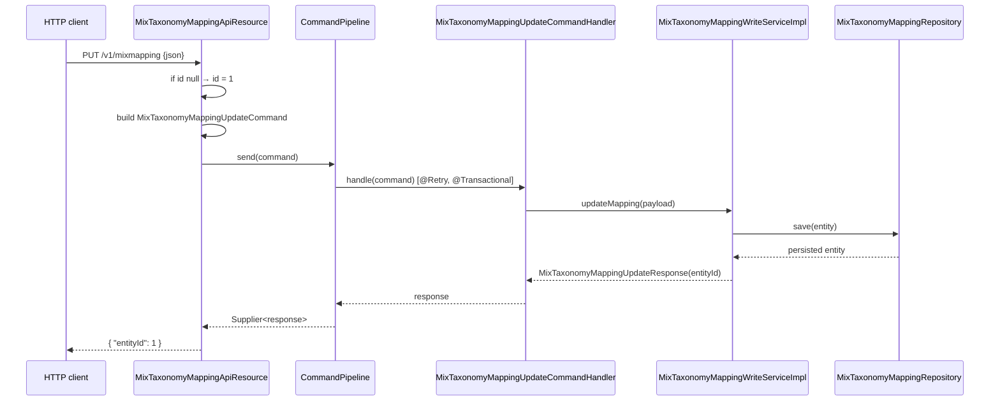

The Apache Fineract `fineract-mix` module exposes three Jersey resources: `MixTaxonomyApiResource` at `/v1/mixtaxonomy`, `MixTaxonomyMappingApiResource` at `/v1/mixmapping`, and `MixReportApiResource` at `/v1/mixreport`. Together they let an operator list the MIX taxonomy catalog, replace the JSON expression configuration that maps MIX items to GL balances, and render an XBRL document for an arbitrary date window and currency.

For the entity model behind these endpoints see [Mix taxonomy](/mix/mix-taxonomy) and [Mix mapping](/mix/mix-mapping); for the module map see [Mix overview](/mix/overview).

## Endpoint summary

| HTTP | Path | Method | Permission | Purpose |
| --- | --- | --- | --- | --- |
| `GET` | `/v1/mixtaxonomy` | `retrieveAll` | none in-code | List MIX taxonomy items. |
| `GET` | `/v1/mixmapping` | `retrieveTaxonomyMapping` | none in-code | Fetch the single mapping row. |
| `PUT` | `/v1/mixmapping` | `updateTaxonomyMapping` | none in-code | Replace the mapping row through the `fineract-command` pipeline. |
| `GET` | `/v1/mixreport` | `retrieveXBRLReport` | none in-code | Run all expressions, build XBRL XML. |

> None of the three resources call `context.authenticatedUser().validateHasReadPermission(...)`. Access control is entirely whatever the security filter chain enforces for authenticated requests. Deployments that need finer-grained authorization must add it at the gateway / Spring Security layer.

## `MixTaxonomyApiResource`

`fineract-mix/src/main/java/org/apache/fineract/mix/api/MixTaxonomyApiResource.java`:

```java
@Path("/v1/mixtaxonomy")
@Component
@Tag(name = "Mix Taxonomy", description = "")
@RequiredArgsConstructor
public class MixTaxonomyApiResource {

    private final MixTaxonomyReadService readTaxonomyService;

    @GET
    @Consumes({ MediaType.APPLICATION_JSON })
    @Produces({ MediaType.APPLICATION_JSON })
    public List<MixTaxonomyData> retrieveAll() {
        return readTaxonomyService.retrieveAll();
    }
}
```

`retrieveAll` calls `MixTaxonomyReadServiceImpl.retrieveAll()`, which delegates to `MixTaxonomyRepository.findAllByOrderByIdAsc()` and maps each row through `MixTaxonomyMapper`. Each entry returns:

```json
{
  "id":          1,
  "name":        "GrossLoanPortfolio",
  "namespace":   null,
  "dimension":   "dim:LoanProductDimension",
  "type":        0,
  "description": "Gross outstanding loan portfolio."
}
```

The `namespace` is always `null` here because the mapper ignores the field (`@Mapping(ignore = true, target = "namespace")`); the XBRL builder resolves the prefix at output time. See [Mix taxonomy](/mix/mix-taxonomy).

## `MixTaxonomyMappingApiResource`

```java
@Path("/v1/mixmapping")
@Component
@Tag(name = "Mix Mapping", description = "")
@RequiredArgsConstructor
public class MixTaxonomyMappingApiResource {

    private final MixTaxonomyMappingReadService readTaxonomyMappingService;
    private final CommandPipeline commandPipeline;

    @GET
    @Consumes({ MediaType.APPLICATION_JSON })
    @Produces({ MediaType.APPLICATION_JSON })
    public MixTaxonomyMappingData retrieveTaxonomyMapping() {
        return this.readTaxonomyMappingService.retrieveTaxonomyMapping();
    }

    @PUT
    @Consumes({ MediaType.APPLICATION_JSON })
    @Produces({ MediaType.APPLICATION_JSON })
    public MixTaxonomyMappingUpdateResponse updateTaxonomyMapping(final MixTaxonomyMappingUpdateRequest request) {
        // TODO support multiple configuration file loading; this is the legacy behavior
        if (request.getId() == null) {
            request.setId(1L);
        }
        final var command = new MixTaxonomyMappingUpdateCommand();
        command.setPayload(request);
        final Supplier<MixTaxonomyMappingUpdateResponse> response = commandPipeline.send(command);
        return response.get();
    }
}
```

### `GET /v1/mixmapping`

Returns the single mapping row in the form:

```json
{
  "identifier": "mfi-default",
  "config":     "{\"1\":\"{1101}+{1102}\",\"2\":\"{1110}-{2010}\"}",
  "currency":   "USD"
}
```

`config` is a JSON string (escaped). It is **not** unwrapped server-side — clients must `JSON.parse` it themselves. When the table is empty the response body is `null`.

### `PUT /v1/mixmapping`

Body shape:

```json
{
  "id":         1,
  "identifier": "mfi-default",
  "config":     "{\"1\":\"{1101}+{1102}\",\"2\":\"{1110}-{2010}\",\"13\":\"({1101}+{1102})/12\"}",
  "currency":   "USD"
}
```

When `id` is null the resource forces it to `1L` — there is a single row whose primary key is `1`. The request DTO carries `@Valid` so JSR-303 constraints on the request fields (if any are added later) will be applied by Bean Validation.

The dispatch goes through the `fineract-command` pipeline:



Key differences from the legacy command path (used by `/v1/charges`, `/v1/floatingrates`, etc.):

- **resilience4j retry** wraps the handler — see [Mix mapping](/mix/mix-mapping) for the policy name.
- **No `m_command_source` row** — this command does not feed the maker-checker / audit log; it commits directly.
- **No `@CommandType`** — dispatch is by typed `Command<T>` subclass at compile time, not by `(entity, action)` string lookup at runtime.

Response:

```json
{ "entityId": 1 }
```

## `MixReportApiResource`

```java
@Path("/v1/mixreport")
@Component
@Tag(name = "Mix Report", description = """
        """)
@RequiredArgsConstructor
public class MixReportApiResource {

    private final MixReportXBRLResultService xbrlResultService;
    private final MixReportXBRLBuilder xbrlBuilder;

    @GET
    @Produces({ MediaType.APPLICATION_XML })
    public String retrieveXBRLReport(@QueryParam("startDate") final Date startDate,
                                     @QueryParam("endDate")   final Date endDate,
                                     @QueryParam("currency")  final String currency) {

        final var data = xbrlResultService.getXBRLResult(startDate, endDate, currency);

        // TODO: make this type safe?
        return this.xbrlBuilder.build(data);
    }
}
```

Two important details:

- The query parameter types are `java.sql.Date`. JAX-RS will parse `2024-09-01` literal strings into `Date` via the `valueOf` static factory; non-ISO formats will produce `400 Bad Request` at the JAX-RS layer.
- The response is `MediaType.APPLICATION_XML` — the body is the literal XBRL document as text.

### Steps inside

1. `MixReportXBRLResultServiceImpl.getXBRLResult(startDate, endDate, currency)`:
   - Loads the single mapping row.
   - Throws `MixReportXBRLMappingInvalidException("Mapping is empty")` if no `config`.
   - Parses `config` JSON to `Map<String,String>`.
   - Runs the GL balance SQL for `[startDate, endDate]` (right-open / closed-on-end window).
   - For each `(taxonomyId, expression)` substitutes `{glCode}` placeholders with balances and evaluates via Nashorn.
   - Looks up the matching `MixTaxonomyData` and builds the result map.
   - Returns a `MixReportXBRLData` `{ resultMap, startDate, endDate, currency }`.

2. `MixReportXBRLBuilder.build(MixReportXBRLData)` walks the result map and emits an XML document:

```java
public String build(final Map<MixTaxonomyData, BigDecimal> map, final Date startDate, final Date endDate, final String currency) {
    Integer instantScenarioCounter  = 0;
    Integer durationScenarioCounter = 0;
    Map<MixReportXBRLContextData, String> contextMap = new HashMap<>();
    final Document doc = DocumentHelper.createDocument();
    Element root = doc.addElement("xbrl");

    root.addElement("schemaRef").addNamespace("link",
        "http://www.themix.org/sites/default/files/Taxonomy2010/dct/dc-all_2010-08-31.xsd");

    for (final Map.Entry<MixTaxonomyData, BigDecimal> entry : map.entrySet()) {
        final MixTaxonomyData taxonomy = entry.getKey();
        final BigDecimal      value    = entry.getValue();
        addTaxonomy(root, taxonomy, value, startDate, endDate, instantScenarioCounter, durationScenarioCounter, contextMap);
    }
    addContexts(root, startDate, endDate, contextMap);
    addCurrencyUnit(root, currency);
    addNumberUnit(root);
    doc.setXMLEncoding("UTF-8");
    // ...
}
```

Highlights:

- Output is built with **dom4j** (`org.dom4j.DocumentHelper`).
- The root element is `<xbrl>` with the MIX 2010 schema reference always pinned to `dc-all_2010-08-31.xsd` at `http://www.themix.org`.
- Two scheme constants and two unit IDs are baked into the builder (`SCHEME_URL = "http://www.themix.org"`, `IDENTIFIER = "000000"`, `UNITID_PURE = "Unit1"`, `UNITID_CUR = "Unit2"`).
- Each taxonomy entry is placed into one of two scenario groups:
  - **Instant** — point-in-time facts (balance-sheet items).
  - **Duration** — facts spanning the `[startDate, endDate]` window (income/expense).
  The split is decided per taxonomy type and dimension by `addTaxonomy(...)`.
- Currency-bearing facts reference `unitRef="Unit2"`, which is declared with the requested `currency` via `addCurrencyUnit(root, currency)`. Pure-numeric facts (counts, ratios) reference `unitRef="Unit1"`.

### Sample response (abridged)

```xml
<?xml version="1.0" encoding="UTF-8"?>
<xbrl>
  <link:schemaRef xmlns:link="http://www.themix.org/sites/default/files/Taxonomy2010/dct/dc-all_2010-08-31.xsd"/>
  <context id="ctx_instant_1">
    <entity>
      <identifier scheme="http://www.themix.org">000000</identifier>
    </entity>
    <period>
      <instant>2024-12-31</instant>
    </period>
  </context>
  <context id="ctx_duration_1">
    <entity>
      <identifier scheme="http://www.themix.org">000000</identifier>
    </entity>
    <period>
      <startDate>2024-01-01</startDate>
      <endDate>2024-12-31</endDate>
    </period>
  </context>
  <unit id="Unit1"><measure>xbrli:pure</measure></unit>
  <unit id="Unit2"><measure>iso4217:USD</measure></unit>

  <mcx:GrossLoanPortfolio contextRef="ctx_instant_1" unitRef="Unit2">1234567.00</mcx:GrossLoanPortfolio>
  <mcx:NetIncome           contextRef="ctx_duration_1" unitRef="Unit2">234567.00</mcx:NetIncome>
</xbrl>
```

The XML produced is hand-rolled per fact — the source comment says "TODO: we should do this with JAXB" — so the element ordering and namespace bindings depend on the iteration order over the `MixTaxonomyData` map. Clients that diff the output across runs should sort the facts before comparison.

## Errors

| HTTP | Cause |
| --- | --- |
| 400 | JAX-RS parameter parse failure (`startDate` / `endDate` not in `yyyy-MM-dd`). |
| 500 | `MixReportXBRLMappingInvalidException("Mapping is empty")` from `getXBRLResult`. |
| 500 | `JsonSyntaxException` from Gson when `config` is malformed JSON. |
| 500 | `IllegalArgumentException` wrapping a `ScriptException` from Nashorn when an expression fails to evaluate (or when Nashorn is missing on the classpath, in which case `SCRIPT_ENGINE` is null and the first `eval` NPEs). |
| 500 | Database errors from the hand-rolled `getAccountSql` UNION query — e.g. on databases where `Date.toString()` does not produce a valid date literal. |

## Operational notes

- **No pagination, no caching** — every `/v1/mixreport` call re-runs the SQL UNION and re-evaluates every expression. Heavy use should sit behind a CDN or a thin in-process cache.
- **Date window semantics** — `entry_date <= endDate AND entry_date > startDate`. The start date is excluded, the end date included. To get "December 2024" pass `startDate=2024-11-30&endDate=2024-12-31`.
- **Currency parameter** — drives only the XBRL `<unit>` declaration. The SQL does **not** filter by currency; if the GL has entries in multiple currencies the balances aggregate naively.
- **Single mapping row** — operators expecting multi-config support should note the `// TODO support multiple configuration file loading; this is the legacy behavior` comment in the PUT handler.

## Cross-references

- For the catalog entities behind `/v1/mixtaxonomy`: [Mix taxonomy](/mix/mix-taxonomy).
- For the mapping entity, the JS expression DSL and the command pipeline used by PUT `/v1/mixmapping`: [Mix mapping](/mix/mix-mapping).
- For the module overview: [Mix overview](/mix/overview).
- For shared JAX-RS / MapStruct / Spring Data JDBC plumbing: [Portfolio shared domain](/core/portfolio-shared-domain).
- For the broader report API surface and the relationship with `/v1/runreports/{name}`: [Reports and data APIs](/api/reports-and-data-apis).
- For the chart of accounts the JS expressions read against: accounting module reference and [Configuration and code APIs](/api/configuration-and-code-apis).
