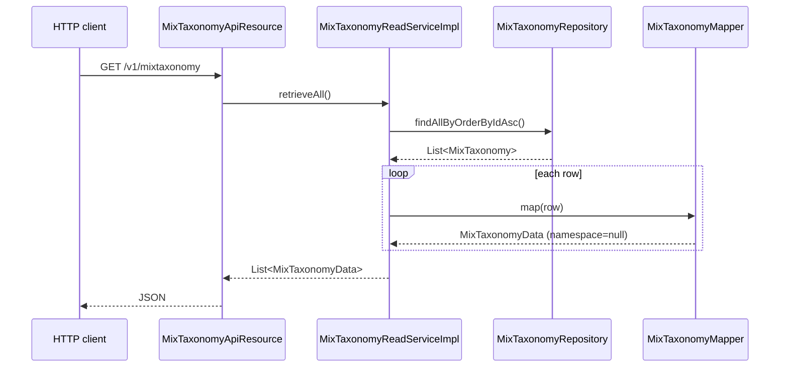
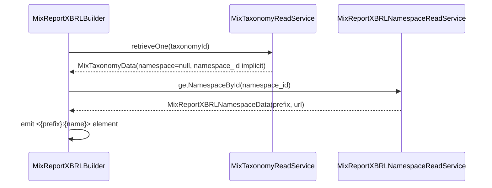

The Apache Fineract MIX taxonomy catalog is two tables — `mix_taxonomy` and `mix_xbrl_namespace` — that describe the MIX Market XBRL elements the platform knows how to emit and the XML namespaces they live under. Both tables are seeded by Liquibase and are read-only at runtime: there is **no API endpoint** that creates or updates rows in either. The entities are Spring Data JDBC records, not JPA, because they are simple read-mostly catalogs.

For the mapping that ties these catalog rows to GL balance expressions, see [Mix mapping](/mix/mix-mapping). For the resources that consume the catalog, see [Mix report API](/mix/mix-report-api).

## `MixTaxonomy` entity

`fineract-mix/src/main/java/org/apache/fineract/mix/domain/MixTaxonomy.java`:

```java
package org.apache.fineract.mix.domain;

import java.io.Serial;
import java.io.Serializable;
import lombok.Getter;
import lombok.NoArgsConstructor;
import lombok.Setter;
import lombok.experimental.Accessors;
import org.springframework.data.annotation.Id;
import org.springframework.data.relational.core.mapping.Column;
import org.springframework.data.relational.core.mapping.Table;

@Table("mix_taxonomy")
@Getter @Setter @NoArgsConstructor @Accessors(chain = true)
public final class MixTaxonomy implements Serializable {

    @Serial private static final long serialVersionUID = 1L;

    @Id
    @Column("id")
    private Long id;

    @Column("name")
    private String name;

    @Column("namespace_id")
    private Long namespaceId;

    @Column("dimension")
    private String dimension;

    @Column("type")
    private Integer type;

    @Column("description")
    private String description;

    // TODO: this is never used, but creates an error on MySQL (tinyint vs boolean mapping)
    // @Column("need_mapping")
    // private Boolean needMapping;
}
```

Notes:

- The `@Id` / `@Column` / `@Table` annotations come from `org.springframework.data.relational.core.mapping` — this is **Spring Data JDBC**, not JPA. There is no entity manager, no `@OneToMany`; the relationship to `mix_xbrl_namespace` is by id only, resolved manually by the mapper.
- The class is `final` and exposes no domain methods. Updates would be a `repository.save(...)` call, but no endpoint does that today.
- The legacy `need_mapping` column exists in the schema but is commented out in the code because of a tinyint/boolean type mismatch on MySQL. The codebase still tolerates the column in the database; it's just not read.

### Persisted fields

| Column | Java field | Purpose |
| --- | --- | --- |
| `id` | `id` | Surrogate PK. Referenced from `mix_taxonomy_mapping.config` JSON as the key of the `(taxonomyId → expression)` entries. |
| `name` | `name` | XBRL element local name, e.g. `GrossLoanPortfolio`. |
| `namespace_id` | `namespaceId` | FK to `mix_xbrl_namespace.id`, drives the `prefix:name` qname in the output XML. |
| `dimension` | `dimension` | Optional dimension qname (e.g. `dim:LoanProductDimension`) for multi-dimensional facts. |
| `type` | `type` | Integer code: `0=PORTFOLIO`, `1=BALANCE_SHEET`, `2=INCOME`, `3=EXPENSE` (declared as constants on `MixTaxonomyData`). |
| `description` | `description` | Human-readable description. |

> The four type constants on `MixTaxonomyData` carry the values 0–3:
>
> ```java
> public static final Integer PORTFOLIO     = 0;
> public static final Integer BALANCE_SHEET = 1;
> public static final Integer INCOME        = 2;
> public static final Integer EXPENSE       = 3;
> ```
>
> The codebase contains a known quirk — `MixTaxonomyData.isPortfolio()` returns `this.type == 5`, **not** `== 0`. The source carries an explicit comment: `// TODO: why is this different from the PORTFOLIO constant? This doesn't seem right!`. Treat this as a known bug for now — when adding new type codes or interpreting existing data, prefer the comparison against the named constants and avoid `isPortfolio()` in new code.

### Repository

`MixTaxonomyRepository extends CrudRepository<MixTaxonomy, Long>` (Spring Data JDBC). The interface adds one query:

```java
List<MixTaxonomy> findAllByOrderByIdAsc();
```

This sorted list is the canonical iteration order used by both `MixTaxonomyReadServiceImpl` and `MixReportXBRLResultServiceImpl` when building the XBRL document.

## `MixTaxonomyData` — read DTO

`fineract-mix/src/main/java/org/apache/fineract/mix/data/MixTaxonomyData.java`:

```java
@Builder @Data @NoArgsConstructor @AllArgsConstructor @Accessors(chain = true)
public class MixTaxonomyData implements Serializable {

    public static final Integer PORTFOLIO     = 0;
    public static final Integer BALANCE_SHEET = 1;
    public static final Integer INCOME        = 2;
    public static final Integer EXPENSE       = 3;

    @Serial private static final long serialVersionUID = 1L;

    private Long    id;
    private String  name;
    private String  namespace;
    private String  dimension;
    private Integer type;
    private String  description;

    @JsonIgnore
    public boolean isPortfolio() {
        return this.type == 5;   // see note above
    }
}
```

`namespace` here is the resolved namespace **prefix** (not the URL) — `MixTaxonomyMapper` deliberately ignores the namespace field at map time (`@Mapping(ignore = true, target = "namespace")`) because the `MixTaxonomy` row only stores `namespace_id`. The current `retrieveAll` path does not populate `namespace`; the field is set later inside `MixReportXBRLBuilder` when it needs the qname.

## `MixTaxonomyMapper` — MapStruct

```java
@Mapper(config = MapstructMapperConfig.class)
public interface MixTaxonomyMapper {

    @Mapping(ignore = true, target = "namespace")
    MixTaxonomyData map(MixTaxonomy source);
}
```

Map-only; the `namespace` field is intentionally left null at this stage.

## `MixTaxonomyReadServiceImpl`

```java
@Slf4j @RequiredArgsConstructor @Service
public class MixTaxonomyReadServiceImpl implements MixTaxonomyReadService {

    private final MixTaxonomyRepository repository;
    private final MixTaxonomyMapper mapper;

    @Override
    public List<MixTaxonomyData> retrieveAll() {
        return repository.findAllByOrderByIdAsc().stream().map(mapper::map).toList();
    }

    @Override
    public MixTaxonomyData retrieveOne(final Long id) {
        return repository.findById(id).map(mapper::map).orElse(null);
    }
}
```

Two methods:

- `retrieveAll()` returns every catalog row, ordered by id. This is what `GET /v1/mixtaxonomy` serves and what `MixReportXBRLResultServiceImpl` walks per row when evaluating expressions.
- `retrieveOne(id)` is used during XBRL build to look up the `MixTaxonomyData` for a configured `taxonomyId`. **Returns `null` on miss** rather than throwing — the builder treats the null as "skip this entry".

## `MixReportXBRLNamespace` entity

```java
@Table("mix_xbrl_namespace")
@Getter @Setter @NoArgsConstructor @Accessors(chain = true)
public class MixReportXBRLNamespace implements Serializable {

    @Serial private static final long serialVersionUID = 1L;

    @Id
    @Column("id")
    private Long id;

    @Column("prefix")
    private String prefix;

    @Column("url")
    private String url;
}
```

Same Spring Data JDBC pattern: simple POJO with `@Id` and two attribute columns.

| Column | Field | Notes |
| --- | --- | --- |
| `id` | `id` | Referenced from `mix_taxonomy.namespace_id`. |
| `prefix` | `prefix` | The qname prefix, e.g. `mcx`, `cor`, `dim`. |
| `url` | `url` | The namespace URI used in `xmlns:<prefix>="…"` of the XBRL output. |

### `MixReportXBRLNamespaceData` and the mapper

```java
@Mapper(config = MapstructMapperConfig.class)
public interface MixReportXBRLNamespaceMapper {
    MixReportXBRLNamespaceData map(MixReportXBRLNamespace source);
}
```

Plain field-for-field mapping. The DTO is read by `MixReportXBRLBuilder` when it walks the namespace catalog to emit the root element attributes.

### `MixReportXBRLNamespaceReadServiceImpl`

A thin service over `MixReportXBRLNamespaceRepository` (`CrudRepository<MixReportXBRLNamespace, Long>`):

```java
public interface MixReportXBRLNamespaceReadService {
    MixReportXBRLNamespaceData getNamespaceById(Long id);
    Collection<MixReportXBRLNamespaceData> retrieveAll();
}
```

Used inside `MixReportXBRLBuilder` to resolve the prefix and URL when emitting `xmlns:<prefix>="<url>"` attributes on `<xbrl>` and to translate a `MixTaxonomyData.dimension` into a fully-qualified `prefix:LocalName`.

## How the two catalogs interact in the XBRL output

When `MixReportXBRLBuilder.build(...)` walks the result map:

1. For each `(MixTaxonomyData taxonomy, BigDecimal value)` entry it pulls the `namespace_id` (via `MixTaxonomy.namespaceId` resolved by `MixTaxonomyReadServiceImpl.retrieveOne(id)`).
2. It resolves the prefix and URL through `MixReportXBRLNamespaceReadService.getNamespaceById(namespaceId)`.
3. It emits the fact element as `<{prefix}:{name} contextRef="…" unitRef="…">{value}</{prefix}:{name}>`.
4. Per-namespace `xmlns:{prefix}="{url}"` declarations are gathered on the root `<xbrl>` element.

There is also a fixed schema reference baked into the builder:

```java
root.addElement("schemaRef").addNamespace("link",
    "http://www.themix.org/sites/default/files/Taxonomy2010/dct/dc-all_2010-08-31.xsd");
```

So all output documents pin against the MIX 2010-08-31 schema, regardless of which taxonomy rows are in the catalog.

## Schema source

Both tables are populated through Liquibase changesets. The seeded data covers the MIX Market 2010 taxonomy: dozens of items (`GrossLoanPortfolio`, `Borrowings`, `OperatingExpense`, etc.) across the four type codes (`PORTFOLIO`, `BALANCE_SHEET`, `INCOME`, `EXPENSE`) and a handful of namespaces (the MIX schemas plus the standard XBRL namespaces). New rows can be added by an operator with direct DB access; there is no API.

## How callers retrieve and use the catalog



When the same data is consumed internally by `MixReportXBRLBuilder`, the namespace is resolved per row:



`MixTaxonomyData` doesn't actually carry `namespace_id` — the builder reads it indirectly via `MixTaxonomy` from the `MixTaxonomyRepository.findById(id)` call inside `MixTaxonomyReadServiceImpl.retrieveOne(id)`. The mapper drops it on the way to `MixTaxonomyData`, then re-introduces the resolved `prefix` field by setting `MixTaxonomyData.namespace` post-mapping (in the builder). The flow is awkward and worth refactoring; see the "TODO: this should be done with JAXB" comment in `MixReportXBRLBuilder`.

## When to add new catalog rows

New `MixTaxonomy` rows or new `MixReportXBRLNamespace` rows are added via Liquibase changesets, not via API:

1. Add a row to `mix_xbrl_namespace` with a new `(prefix, url)` pair (or reuse an existing namespace).
2. Add the corresponding row(s) to `mix_taxonomy` referencing that namespace's `id`.
3. Update `mix_taxonomy_mapping.config` (via `PUT /v1/mixmapping`) to attach a GL-expression to the new taxonomy id.
4. Run `/v1/mixreport` — the new fact appears in the output.

There is no UI that helps with steps 1 and 2 — operators edit migrations directly.

## Cross-references

- For the mapping entity and the JavaScript expression language: [Mix mapping](/mix/mix-mapping).
- For the resources that surface the catalog and run the builder: [Mix report API](/mix/mix-report-api).
- For the module overview: [Mix overview](/mix/overview).
- For shared MapStruct, Spring Data JDBC, `Serial` / `Serializable` plumbing used by these DTOs: [Portfolio shared domain](/core/portfolio-shared-domain).
- For the chart of accounts the JavaScript expressions consume: see the accounting module reference and the GL APIs in [Reports and data APIs](/api/reports-and-data-apis).
- For the data-quality "tinyint/boolean" caveat on MySQL and the `isPortfolio()` quirk: this page (above) — both are tracked as known issues in the source comments.
