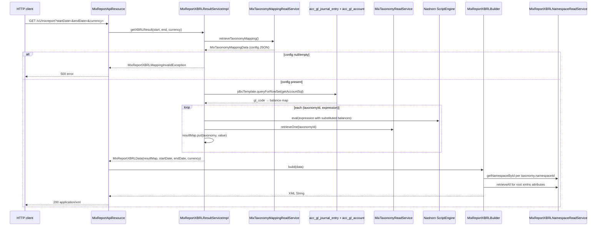
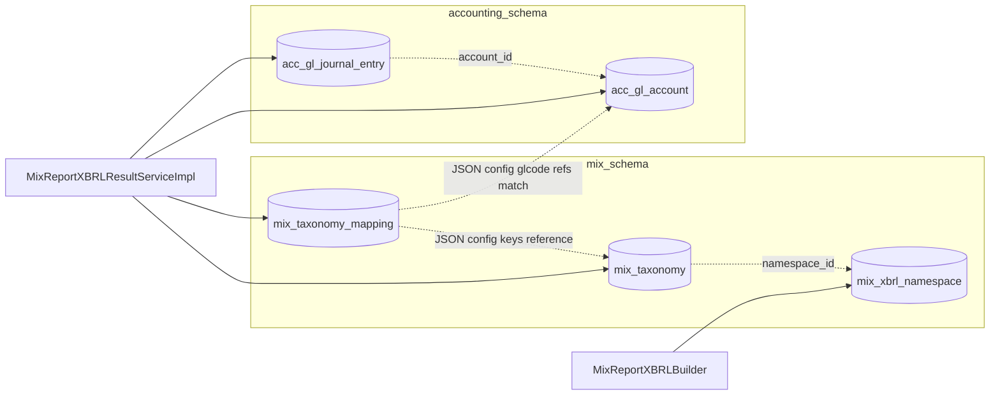

`fineract-mix` is the Apache Fineract Gradle module that publishes microfinance balance-sheet data in the **MIX Market XBRL taxonomy**. The module ships three things: a catalog of MIX taxonomy items (`mix_taxonomy`) and their XBRL namespaces (`mix_xbrl_namespace`), a single configuration row that maps each MIX item to a JavaScript expression over GL account balances (`mix_taxonomy_mapping`), and a JAX-RS resource at `/v1/mixreport` that runs the mapping against the tenant GL and returns an XBRL XML document.

The MIX Market reporting standard is a long-running industry convention for microfinance institutions; the taxonomy schema referenced by the XBRL output is hosted at `https://www.xbrl.org/taxonomyrecognition/mx_2009-06-19_summary-page.htm` (see the constants in `MixReportXBRLBuilder`).

Use this overview to navigate:

- The catalog entities → [Mix taxonomy](/mix/mix-taxonomy).
- The mapping entity and the JavaScript expression DSL → [Mix mapping](/mix/mix-mapping).
- The REST surface (`/v1/mixtaxonomy`, `/v1/mixmapping`, `/v1/mixreport`) → [Mix report API](/mix/mix-report-api).

## Module layout

```
fineract-mix/
└── src/main/java/org/apache/fineract/mix/
    ├── api/
    │   ├── MixReportApiResource.java                ← @Path("/v1/mixreport")
    │   ├── MixTaxonomyApiResource.java              ← @Path("/v1/mixtaxonomy")
    │   └── MixTaxonomyMappingApiResource.java       ← @Path("/v1/mixmapping")
    ├── command/
    │   └── MixTaxonomyMappingUpdateCommand.java     ← Command<MixTaxonomyMappingUpdateRequest>
    ├── data/
    │   ├── MixReportXBRLContextData.java
    │   ├── MixReportXBRLData.java                   ← in-memory result envelope
    │   ├── MixReportXBRLNamespaceData.java
    │   ├── MixTaxonomyData.java                     ← read DTO for one taxonomy item
    │   ├── MixTaxonomyMappingData.java
    │   ├── MixTaxonomyMappingUpdateRequest.java
    │   └── MixTaxonomyMappingUpdateResponse.java
    ├── domain/                                       ← Spring Data JDBC entities
    │   ├── MixReportXBRLNamespace.java              ← @Table("mix_xbrl_namespace")
    │   ├── MixReportXBRLNamespaceRepository.java
    │   ├── MixTaxonomy.java                         ← @Table("mix_taxonomy")
    │   ├── MixTaxonomyMapping.java                  ← @Table("mix_taxonomy_mapping")
    │   ├── MixTaxonomyMappingRepository.java
    │   └── MixTaxonomyRepository.java
    ├── exception/
    │   └── MixReportXBRLMappingInvalidException.java
    ├── handler/
    │   └── MixTaxonomyMappingUpdateCommandHandler.java
    ├── mapping/                                      ← MapStruct mappers
    │   ├── MixReportXBRLNamespaceMapper.java
    │   ├── MixTaxonomyMapper.java
    │   ├── MixTaxonomyMappingMapper.java
    │   └── MixTaxonomyMappingUpdateRequestMapper.java
    └── service/
        ├── MixReportXBRLBuilder.java                ← serialises XBRL XML
        ├── MixReportXBRLNamespaceReadService.java + Impl
        ├── MixReportXBRLResultService.java + Impl   ← runs the JS expressions
        ├── MixTaxonomyMappingReadService.java + Impl
        ├── MixTaxonomyMappingWriteService.java + Impl
        └── MixTaxonomyReadService.java + Impl
```

Persistence in this module is **Spring Data JDBC** (`@Table`, `@Id`, `@Column` from `org.springframework.data.relational.core.mapping`), not JPA. The entities are plain DTOs without lifecycle callbacks, which matches the read-mostly nature of the data: the catalog rows are loaded from a seed migration and rarely changed; the single mapping row is updated via one resource and queried by another.

## Conceptual model

```mermaid
flowchart LR
    subgraph Catalog
        NS[MixReportXBRLNamespace\nprefix + url]
        TX[MixTaxonomy\nname, dimension, type]
    end
    subgraph Configuration
        TM[MixTaxonomyMapping\nidentifier, config JSON]
    end
    subgraph Runtime
        Bal[acc_gl_journal_entry\n+ acc_gl_account]
        RSI[MixReportXBRLResultService]
        Bld[MixReportXBRLBuilder]
    end
    TX -->|namespace_id| NS
    TM -.->|JSON config maps taxonomyId → JS expr| TX
    RSI -->|run JS expr per taxonomy| Bal
    RSI -->|Map TaxonomyData,BigDecimal| Bld
    Bld -->|XML| Out[/v1/mixreport response]
```

The data flow on `GET /v1/mixreport?startDate=…&endDate=…&currency=…`:

1. `MixReportXBRLResultServiceImpl` loads the single `MixTaxonomyMapping` row and parses its `config` field as `Map<String,String>` (`taxonomyId → JavaScript expression`).
2. It runs the **GL account balance query** for the date range (a hand-rolled UNION SQL over `acc_gl_journal_entry` × `acc_gl_account`) and builds a balance map keyed by GL code.
3. For each `(taxonomyId, expression)` entry it evaluates the JavaScript via Nashorn (`ScriptEngineManager.getEngineByName("JavaScript")`), substituting GL code references for their balance, and pairs the resulting `BigDecimal` with the resolved `MixTaxonomyData`.
4. `MixReportXBRLBuilder` walks the result map and produces an XBRL XML document, adding `link:schemaRef`, namespaces (from `mix_xbrl_namespace`), `context`, `unit`, and per-fact elements.

> The "JavaScript" engine is Nashorn, deprecated and removed from the JDK since Java 15. Deployments on a current JDK must add the standalone Nashorn artifact to the classpath; if the engine cannot be created, `MixReportXBRLResultServiceImpl.SCRIPT_ENGINE` is null and the evaluation will NPE on first use.

## REST surface at a glance

| Path | Methods | Purpose |
| --- | --- | --- |
| `/v1/mixtaxonomy` | `GET` | List every MIX taxonomy item. |
| `/v1/mixmapping` | `GET`, `PUT` | Read / replace the mapping configuration. |
| `/v1/mixreport` | `GET` | Render the XBRL document for a date range and currency. |

Detail is in [Mix report API](/mix/mix-report-api).

## Command pipeline used by `/v1/mixmapping`

Unlike the rest of the platform, this module does **not** use the legacy `CommandWrapperBuilder` / `PortfolioCommandSourceWritePlatformService` / `@CommandType` plumbing. Instead it consumes the newer `fineract-command` pipeline:

- `MixTaxonomyMappingUpdateCommand extends Command<MixTaxonomyMappingUpdateRequest>` — the typed command envelope.
- `MixTaxonomyMappingUpdateCommandHandler implements CommandHandler<...>` — annotated with `@Retry(name = "commandMixTaxonomyMappingUpdate", fallbackMethod = "fallback")` (resilience4j) and `@Transactional`.
- The API resource builds the command, sets a payload, and dispatches via `CommandPipeline.send(command)`:

```java
@PUT
public MixTaxonomyMappingUpdateResponse updateTaxonomyMapping(final MixTaxonomyMappingUpdateRequest request) {
    if (request.getId() == null) { request.setId(1L); }   // legacy single-row behaviour
    final var command = new MixTaxonomyMappingUpdateCommand();
    command.setPayload(request);
    final Supplier<MixTaxonomyMappingUpdateResponse> response = commandPipeline.send(command);
    return response.get();
}
```

## Exceptions

| Exception | Trigger |
| --- | --- |
| `MixReportXBRLMappingInvalidException` | `MixReportXBRLResultServiceImpl.getXBRLResult` finds the mapping is null/empty, or the per-taxonomy JS evaluation throws. |

Mapped to a runtime exception; the resource currently lets it propagate up to the global exception mapper.

## What this module does not do

- It does **not** write to or query loan / savings / client tables directly — its only data source is the chart of accounts and journal entries.
- It does **not** integrate with the report-mailing job. The XBRL report is interactive only; there is no batch driver.
- It does **not** participate in `m_command_source` / maker-checker. The single mutating endpoint goes through the `fineract-command` pipeline instead.

## End-to-end report request



## Schema-side dependencies



`mix_taxonomy_mapping.config` straddles the two schemas — its **keys** reference `mix_taxonomy.id`, its **values** reference `acc_gl_account.gl_code`. Neither reference is a real FK; both are textual lookups at run time. Misalignment between the mapping and the GL chart of accounts surfaces only on report execution.

## What the module deliberately does not own

- **Account balance calculation** — the GL balance SQL inside `MixReportXBRLResultServiceImpl` is bespoke to this report; it does not call the standard accounting read services because the date window semantics differ from the chart-of-accounts UI.
- **Authorization** — no `validateHasReadPermission(...)` calls inside the resources. The deployment is expected to layer authorization above the Jersey resources.
- **Validation of the `config` JSON** — there is no sanity-check that the keys resolve to taxonomy ids or that the glcodes resolve to GL accounts. Errors surface only on report execution.
- **Pentaho / SQL reports** — `/v1/mixreport` is its own bespoke output path. It does **not** go through `ReportingProcessServiceProvider` (see [Report provider](/report/report-provider)); operators who want the XBRL output emailed have to add a custom job.

## Quick reference — fields, FKs and tables

| Concern | Where it lives |
| --- | --- |
| Catalog tables | `mix_taxonomy`, `mix_xbrl_namespace`, `mix_taxonomy_mapping`. |
| Spring Data JDBC entities | `MixTaxonomy`, `MixReportXBRLNamespace`, `MixTaxonomyMapping`. |
| Read DTOs | `MixTaxonomyData`, `MixReportXBRLNamespaceData`, `MixTaxonomyMappingData`, `MixReportXBRLData`, `MixReportXBRLContextData`. |
| Read services | `MixTaxonomyReadService`, `MixReportXBRLNamespaceReadService`, `MixTaxonomyMappingReadService`. |
| Write service | `MixTaxonomyMappingWriteService` (only mutates `mix_taxonomy_mapping`). |
| Result service | `MixReportXBRLResultServiceImpl` — runs JS expressions and aggregates GL balances. |
| Output builder | `MixReportXBRLBuilder` — dom4j-based XML emission. |
| Command pipeline | `MixTaxonomyMappingUpdateCommand` + `Handler` via `fineract-command`'s `CommandPipeline`. |
| Cross-module dependencies | `acc_gl_journal_entry`, `acc_gl_account` (read-only). |
| Permissions | None enforced in-code. |
| Liquibase seeding | MIX Market 2010 taxonomy items + standard XBRL namespaces. The mapping row is **not** seeded — operators must define it. |

## Worked example — populating a single MIX fact

Suppose the catalog has a `MixTaxonomy(id=1, name="GrossLoanPortfolio", namespace_id=10, type=1)` and the namespace row `MixReportXBRLNamespace(id=10, prefix="mcx", url="http://www.themix.org/xbrl/mcx")`. The operator wants to populate this fact from two GL accounts: `1101` (gross loans) and `1102` (interest accrued).

Steps:

1. Update the mapping row:

   ```json
   PUT /v1/mixmapping
   {
     "id": 1,
     "identifier": "mfi-default",
     "config": "{\"1\":\"{1101}+{1102}\"}",
     "currency": "USD"
   }
   ```

   The `config` JSON associates taxonomy `1` with the expression `{1101}+{1102}`.

2. Generate the report:

   ```
   GET /v1/mixreport?startDate=2024-01-01&endDate=2024-12-31&currency=USD
   ```

3. Inside `getXBRLResult`:
   - The mapping JSON parses to `{ "1" → "{1101}+{1102}" }`.
   - The GL balance SQL produces `{ "1101" → 1000000.00, "1102" → 234567.00 }` for `[2024-01-02, 2024-12-31]`.
   - `processMappingString("{1101}+{1102}", ...)` substitutes to `"1000000.00+234567.00"` and Nashorn evaluates it to `1234567.00`.
   - `retrieveOne(1)` returns the `GrossLoanPortfolio` `MixTaxonomyData`.
   - `resultMap` becomes `{ MixTaxonomyData("GrossLoanPortfolio") → 1234567.00 }`.

4. The builder emits:

   ```xml
   <mcx:GrossLoanPortfolio contextRef="ctx_instant_1" unitRef="Unit2">1234567.00</mcx:GrossLoanPortfolio>
   ```

   together with the `<context>`, `<unit id="Unit2"><measure>iso4217:USD</measure></unit>` declarations.

If `1102` had no balance for the window, the substitution would have been `"1000000.00+0"` → `1000000.00`. If the expression had been syntactically wrong (e.g. `"{1101}+"`), Nashorn would have thrown a `ScriptException` that the result service wraps as `IllegalArgumentException`.

## Operational notes for new contributors

- The Nashorn-based JavaScript evaluator is a known weak point. Best practice in new deployments is to add `org.openjdk.nashorn:nashorn-core` as a runtime dependency and pin the JDK to one where Nashorn still loads, or to replace the eval with a small parser. New code in this module should not lean further on the script engine.
- The hand-rolled GL balance SQL in `MixReportXBRLResultServiceImpl.getAccountSql(...)` interpolates `java.sql.Date` values directly into the query string. This works on MySQL / PostgreSQL but is the kind of code that will fail loudly if the date type ever changes — there is an explicit TODO comment requesting prepared statements.
- The `dom4j` builder predates the project's adoption of JAXB; the TODO comment in `MixReportXBRLBuilder` calls for a refactor. Any structural change to the XBRL output should be made through `addTaxonomy / addContexts / addCurrencyUnit / addNumberUnit` rather than by ad-hoc edits to `build(...)`.
- `MixTaxonomyData.isPortfolio()` checks `type == 5` even though `PORTFOLIO = 0`. The original quirk is documented in the source as a TODO. Treat the constants on `MixTaxonomyData` as the truth and avoid calling `isPortfolio()` until the bug is fixed.

## Cross-references

- For the catalog entities `MixTaxonomy` and `MixReportXBRLNamespace`: [Mix taxonomy](/mix/mix-taxonomy).
- For the mapping entity and the JavaScript-expression DSL: [Mix mapping](/mix/mix-mapping).
- For all three Jersey resources and the `MixReportXBRLBuilder` output shape: [Mix report API](/mix/mix-report-api).
- For shared `JsonCommand`, `CommandWrapper`, `Command`/`CommandPipeline` and MapStruct config: [Portfolio shared domain](/core/portfolio-shared-domain).
- For the GL chart of accounts the JS expressions consume: see the accounting module reference.
- For the broader read-side report APIs and how `/v1/mixreport` relates to `/v1/runreports/{name}`: [Reports and data APIs](/api/reports).
