# Accounting & GL Data Model

This page is the physical-schema reference for Apache Fineract's general
ledger. The accounting module is intentionally simple: the chart of accounts
is a tree of `acc_gl_account` rows; every business event posts a balanced
pair (or set) of `acc_gl_journal_entry` rows; product → account routing is
held in `acc_product_mapping`; named financial activities (Asset-Transfer,
Liability-Transfer, etc.) are pinned in `acc_gl_financial_activity_account`;
period closes are tracked in `acc_gl_closure`. The provisioning subsystem
(`m_provisioning_*`) is reused for loan-loss provisioning entries.

All accounting tables are seeded by
`fineract-provider/.../changelog/tenant/parts/0001_initial_schema.xml` (with
later precision adjustments in `0117_set_datetime_precision.xml` and audit
columns in `0024_add_audit_entries.xml`,
`0025_add_audit_entries_to_journal_entry.xml`). The
`fineract-accounting` module owns the JPA entities under
`org.apache.fineract.accounting.*` and `org.apache.fineract.organisation.*`.

## Source map

| Cluster element                          | JPA entity                                                          | Liquibase changeSet                                                                |
| ---------------------------------------- | ------------------------------------------------------------------- | ---------------------------------------------------------------------------------- |
| `acc_gl_account`                         | `accounting.glaccount.domain.GLAccount`                             | `0001_initial_schema.xml`                                                          |
| `acc_gl_journal_entry`                   | `accounting.journalentry.domain.JournalEntry`                       | `0001_initial_schema.xml`; audit in `0025_*`                                       |
| `acc_gl_closure`                         | `accounting.closure.domain.GLClosure`                               | `0001_initial_schema.xml`                                                          |
| `acc_gl_financial_activity_account`      | `accounting.financialactivityaccount.domain.FinancialActivityAccount`| `0001_initial_schema.xml`                                                          |
| `acc_product_mapping`                    | `accounting.producttoaccountmapping.domain.ProductToGLAccountMapping`| `0001_initial_schema.xml`                                                          |
| `acc_accounting_rule`                    | `accounting.rule.domain.AccountingRule`                             | `0001_initial_schema.xml`                                                          |
| `acc_rule_tags`                          | `accounting.rule.domain.AccountingTagRule`                          | `0001_initial_schema.xml`                                                          |
| `acc_coa_codevalue`                      | (not present — used `m_code_value`)                                 | — (table not in schema)                                                            |
| `m_provisioning_criteria`                | `accounting.provisioning.domain.ProvisioningCriteria`               | `0001_initial_schema.xml`                                                          |
| `m_provisioning_criteria_definition`     | `accounting.provisioning.domain.ProvisioningCriteriaDefinition`     | `0001_initial_schema.xml`                                                          |
| `m_provisioning_history`                 | `accounting.provisioning.domain.ProvisioningEntry` (parent)         | `0001_initial_schema.xml`                                                          |
| `m_loanproduct_provisioning_entry`       | `accounting.provisioning.domain.LoanProductProvisioningEntry`       | `0001_initial_schema.xml`                                                          |
| `m_loanproduct_provisioning_mapping`     | `accounting.provisioning.domain.LoanProductProvisionMapping`        | `0001_initial_schema.xml`                                                          |
| `m_loan_paid_in_advance`                 | `loanaccount.domain.LoanPaidInAdvance`                              | `0001_initial_schema.xml` (referenced from accounting)                             |
| `m_journal_entry_aggregation` (post-processing helpers in custom modules) | (no canonical entity)                       | added by `0021_external_owner_reference_in_journal_entry_aggregation.xml`          |

Subsystem cross-links:
[`accounting/gl-accounts`](/accounting/gl-accounts),
[`accounting/journal-entries`](/accounting/journal-entries),
[`accounting/closure`](/accounting/closure),
[`accounting/financial-activity-accounts`](/accounting/financial-activity-accounts),
[`accounting/product-to-account-mapping`](/accounting/product-to-account-mapping),
[`accounting/accounting-rules`](/accounting/accounting-rules),
[`accounting/provisioning-entries`](/accounting/provisioning-entries),
[`accounting/accrual-postings`](/accounting/accrual-postings),
[`accounting/running-balance-job`](/accounting/running-balance-job) and
[`accounting/trial-balance`](/accounting/trial-balance).

## ER diagram

```mermaid
erDiagram
    acc_gl_account ||--o{ acc_gl_account : "parent_id (self)"
    acc_gl_account ||--o{ acc_gl_journal_entry : "account_id"
    acc_gl_account ||--o{ acc_gl_financial_activity_account : "gl_account_id"
    acc_gl_account ||--o{ acc_product_mapping : "gl_account_id"
    acc_gl_account ||--o{ acc_accounting_rule : "debit_account_id / credit_account_id"
    acc_accounting_rule ||--o{ acc_rule_tags : "acc_rule_id"
    m_code_value ||--o{ acc_rule_tags : "tag_id"
    m_code_value ||--o{ acc_gl_account : "tag_id"
    m_office ||--o{ acc_gl_journal_entry : "office_id"
    m_office ||--o{ acc_gl_closure : "office_id"
    m_office ||--o{ acc_accounting_rule : "office_id"
    m_appuser ||--o{ acc_gl_journal_entry : "createdby_id / lastmodifiedby_id"
    m_appuser ||--o{ acc_gl_closure : "createdby_id / lastmodifiedby_id"
    acc_gl_journal_entry ||--o{ acc_gl_journal_entry : "reversal_id"
    m_loan_transaction ||--o{ acc_gl_journal_entry : "loan_transaction_id"
    m_savings_account_transaction ||--o{ acc_gl_journal_entry : "savings_transaction_id"
    m_client_transaction ||--o{ acc_gl_journal_entry : "client_transaction_id"
    m_payment_detail ||--o{ acc_gl_journal_entry : "payment_details_id"
    m_product_loan ||--o{ acc_product_mapping : "product_id (product_type=LOAN)"
    m_savings_product ||--o{ acc_product_mapping : "product_id (product_type=SAVINGS)"
    m_share_product ||--o{ acc_product_mapping : "product_id (product_type=SHARES)"
    m_charge ||--o{ acc_product_mapping : "charge_id"
    m_payment_type ||--o{ acc_product_mapping : "payment_type"
    m_provisioning_criteria ||--o{ m_provisioning_criteria_definition : "criteria_id"
    m_provisioning_criteria ||--o{ m_loanproduct_provisioning_mapping : "criteria_id"
    m_provisioning_criteria ||--o{ m_loanproduct_provisioning_entry : "criteria_id"
    m_product_loan ||--o{ m_loanproduct_provisioning_mapping : "product_id"
    m_provisioning_history ||--o{ m_loanproduct_provisioning_entry : "history_id"
    acc_gl_account ||--o{ m_provisioning_criteria_definition : "liability_account / expense_account"
    acc_gl_account ||--o{ m_loanproduct_provisioning_entry : "liability_account / expense_account"
```

## `acc_gl_account`

The chart-of-accounts node. Both summary and detail nodes live in this table;
`account_usage = 1` (HEADER) vs `2` (DETAIL) controls whether the account can
be posted to directly.

| Column                          | Type           | Nullable | Role                                                                                                                       |
| ------------------------------- | -------------- | -------- | -------------------------------------------------------------------------------------------------------------------------- |
| `id`                            | `BIGINT`       | no       | PK.                                                                                                                        |
| `name`                          | `VARCHAR(200)` | no       | Display name.                                                                                                              |
| `parent_id`                     | `BIGINT`       | yes      | Self FK → `acc_gl_account.id`. Tree structure.                                                                             |
| `hierarchy`                     | `VARCHAR(50)`  | yes      | Materialised path, e.g. `.1.4.18.`.                                                                                        |
| `gl_code`                       | `VARCHAR(45)`  | no       | Unique business GL code.                                                                                                   |
| `disabled`                      | `boolean`      | no       | Soft-disable flag.                                                                                                         |
| `manual_journal_entries_allowed`| `boolean`      | no       | Whether a UI user can hand-post.                                                                                           |
| `account_usage`                 | `TINYINT`      | no       | `GLAccountUsage` (1 = HEADER, 2 = DETAIL).                                                                                 |
| `classification_enum`           | `SMALLINT`     | no       | `GLAccountType` (ASSET=1, LIABILITY=2, EQUITY=3, INCOME=4, EXPENSE=5).                                                     |
| `tag_id`                        | `INT`          | yes      | FK → `m_code_value.id` (tag within the `AssetAccountTags` / `LiabilityAccountTags` etc. system codes).                     |
| `description`                   | `VARCHAR(500)` | yes      | Free text.                                                                                                                 |

See [`accounting/gl-accounts`](/accounting/gl-accounts).

## `acc_gl_journal_entry`

The journal line. One row per debit/credit leg. Balanced postings carry the
same `transaction_id` (a string built from
`AccountingProcessorHelper.generateTransactionId`).

| Column                          | Type            | Nullable | Role                                                                                          |
| ------------------------------- | --------------- | -------- | --------------------------------------------------------------------------------------------- |
| `id`                            | `BIGINT`        | no       | PK.                                                                                           |
| `account_id`                    | `BIGINT`        | no       | FK → `acc_gl_account.id`.                                                                     |
| `office_id`                     | `BIGINT`        | no       | FK → `m_office.id`. Scopes the running balance.                                               |
| `reversal_id`                   | `BIGINT`        | yes      | Self FK → `acc_gl_journal_entry.id` when this row reverses another.                           |
| `currency_code`                 | `VARCHAR(3)`    | no       | ISO 4217.                                                                                     |
| `transaction_id`                | `VARCHAR(50)`   | no       | Logical bundle id; all legs of a single posting share this.                                   |
| `loan_transaction_id`           | `BIGINT`        | yes      | FK → `m_loan_transaction.id`. Set for loan-driven postings.                                   |
| `savings_transaction_id`        | `BIGINT`        | yes      | FK → `m_savings_account_transaction.id`.                                                      |
| `client_transaction_id`         | `BIGINT`        | yes      | FK → `m_client_transaction.id`.                                                               |
| `reversed`                      | `boolean`       | no       | True after a reversing entry has been posted against this row.                                |
| `ref_num`                       | `VARCHAR(100)`  | yes      | Caller-supplied reference (cheque, wire ref, etc.).                                           |
| `manual_entry`                  | `boolean`       | no       | True when posted via the GL-write API rather than a business event.                           |
| `entry_date`                    | `date`          | no       | Effective accounting date.                                                                    |
| `type_enum`                     | `SMALLINT`      | no       | `JournalEntryType` (DEBIT=1, CREDIT=2).                                                       |
| `amount`                        | `DECIMAL(19,6)` | no       | Always positive — direction is encoded by `type_enum`.                                        |
| `description`                   | `VARCHAR(500)`  | yes      | Free text.                                                                                    |
| `entity_type_enum`              | `SMALLINT`      | yes      | `PortfolioProductType` of the originating entity (LOAN / SAVINGS / SHARE / CLIENT).           |
| `entity_id`                     | `BIGINT`        | yes      | Id of the originating loan / savings / share account / client.                                |
| `createdby_id`                  | `BIGINT`        | no       | FK → `m_appuser.id`.                                                                          |
| `lastmodifiedby_id`             | `BIGINT`        | no       | FK → `m_appuser.id`.                                                                          |
| `created_date`                  | `datetime`      | no       | System timestamp.                                                                             |
| `lastmodified_date`             | `datetime`      | no       | System timestamp.                                                                             |
| `is_running_balance_calculated` | `boolean`       | no       | Flag set by `update_accounting_running_balances` job.                                         |
| `office_running_balance`        | `DECIMAL(19,6)` | no       | Office-scoped running balance after this row.                                                 |
| `organization_running_balance`  | `DECIMAL(19,6)` | no       | Org-wide running balance after this row.                                                      |
| `payment_details_id`            | `BIGINT`        | yes      | FK → `m_payment_detail.id`.                                                                   |
| `share_transaction_id`          | `BIGINT`        | yes      | FK → `m_share_account_transactions.id`.                                                       |
| `transaction_date`              | `date`          | yes      | Original business transaction date (often equal to `entry_date`).                             |

Investor module adds `m_external_asset_owner.id` reference via the
`external_owner_reference` column in the journal-entry aggregation table.
See [`accounting/journal-entries`](/accounting/journal-entries),
[`accounting/journal-entry-aggregation`](/accounting/journal-entry-aggregation),
[`accounting/running-balance-job`](/accounting/running-balance-job) and
[`accounting/trial-balance`](/accounting/trial-balance).

## `acc_gl_closure`

A period close pinned to an office. Subsequent attempts to post `entry_date <= closing_date` for that office fail.

| Column              | Type           | Nullable | Role                                              |
| ------------------- | -------------- | -------- | ------------------------------------------------- |
| `id`                | `BIGINT`       | no       | PK.                                               |
| `office_id`         | `BIGINT`       | no       | FK → `m_office.id`.                               |
| `closing_date`      | `date`         | no       | Last closed date (inclusive).                     |
| `is_deleted`        | `boolean`      | no       | Soft delete (reopens the period).                 |
| `createdby_id`      | `BIGINT`       | yes      | Audit.                                            |
| `lastmodifiedby_id` | `BIGINT`       | yes      | Audit.                                            |
| `created_date`      | `datetime`     | yes      | Audit.                                            |
| `lastmodified_date` | `datetime`     | yes      | Audit.                                            |
| `comments`          | `VARCHAR(500)` | yes      | Free text.                                        |

See [`accounting/closure`](/accounting/closure).

## `acc_gl_financial_activity_account`

Pins a specific `acc_gl_account` to a named system activity. One row per
`financial_activity_type` (it is the unique key). Activities include
`ASSET_TRANSFER`, `LIABILITY_TRANSFER`, `CASH_AT_MAINVAULT`,
`CASH_AT_TELLER`, etc. — see `FinancialActivity` enum.

| Column                  | Type     | Nullable | Role                                                  |
| ----------------------- | -------- | -------- | ----------------------------------------------------- |
| `id`                    | `BIGINT` | no       | PK.                                                   |
| `gl_account_id`         | `BIGINT` | no       | FK → `acc_gl_account.id`.                             |
| `financial_activity_type`| `SMALLINT`| no     | `FinancialActivity` enum (unique).                    |

See [`accounting/financial-activity-accounts`](/accounting/financial-activity-accounts).

## `acc_product_mapping`

Routes a (product, charge, payment-type) tuple to a GL account. Sparse —
each row populates exactly one of `product_id`, `charge_id` or `payment_type`.

| Column                  | Type      | Nullable | Role                                                                          |
| ----------------------- | --------- | -------- | ----------------------------------------------------------------------------- |
| `id`                    | `BIGINT`  | no       | PK.                                                                           |
| `gl_account_id`         | `BIGINT`  | yes      | FK → `acc_gl_account.id`.                                                     |
| `product_id`            | `BIGINT`  | yes      | FK → `m_product_loan.id`, `m_savings_product.id`, `m_share_product.id`, etc.  |
| `product_type`          | `SMALLINT`| yes      | `PortfolioProductType` (LOAN=1, SAVING=2, CLIENT=3, SHARES=4).                |
| `payment_type`          | `INT`     | yes      | FK → `m_payment_type.id`.                                                     |
| `charge_id`             | `BIGINT`  | yes      | FK → `m_charge.id`.                                                           |
| `financial_account_type`| `SMALLINT`| yes      | The semantic slot (e.g. `LOAN_PORTFOLIO`, `INCOME_FROM_INTEREST`, …).         |

See [`accounting/product-to-account-mapping`](/accounting/product-to-account-mapping).

## `acc_accounting_rule`

A reusable named debit/credit rule for manual postings.

| Column                  | Type           | Nullable | Role                                                          |
| ----------------------- | -------------- | -------- | ------------------------------------------------------------- |
| `id`                    | `BIGINT`       | no       | PK.                                                           |
| `name`                  | `VARCHAR(100)` | yes      | Unique rule name.                                             |
| `office_id`             | `BIGINT`       | yes      | FK → `m_office.id` (rule scoped to an office, or NULL = all). |
| `debit_account_id`      | `BIGINT`       | yes      | FK → `acc_gl_account.id`.                                     |
| `allow_multiple_debits` | `boolean`      | no       | Whether the rule allows multiple debit legs.                  |
| `credit_account_id`     | `BIGINT`       | yes      | FK → `acc_gl_account.id`.                                     |
| `allow_multiple_credits`| `boolean`      | no       | Whether the rule allows multiple credit legs.                 |
| `description`           | `VARCHAR(500)` | yes      | Free text.                                                    |
| `system_defined`        | `boolean`      | no       | True for rules created by Liquibase seed data.                |

## `acc_rule_tags`

Tag-based rules — links an `acc_accounting_rule` to a `m_code_value` tag,
flagged as debit or credit.

| Column         | Type      | Nullable | Role                                                |
| -------------- | --------- | -------- | --------------------------------------------------- |
| `id`           | `BIGINT`  | no       | PK.                                                 |
| `acc_rule_id`  | `BIGINT`  | no       | FK → `acc_accounting_rule.id`.                      |
| `tag_id`       | `INT`     | no       | FK → `m_code_value.id`.                             |
| `acc_type_enum`| `SMALLINT`| no       | DEBIT=1, CREDIT=2.                                  |

See [`accounting/accounting-rules`](/accounting/accounting-rules).

## `m_loan_paid_in_advance`

Although physically owned by the loan domain (see
[`models/loans-and-products`](/models/loans-and-products)), the accounting
side reads this table to compute the "Income Recognised in Advance" leg used
in the periodic accrual job.

## Provisioning tables

The provisioning subsystem creates loan-loss reserve journal entries on a
schedule by classifying outstanding loans into `m_provisioning_criteria`
buckets keyed on overdue days.

### `m_provisioning_criteria`

| Column              | Type           | Nullable | Role                              |
| ------------------- | -------------- | -------- | --------------------------------- |
| `id`                | `BIGINT`       | no       | PK.                               |
| `criteria_name`     | `VARCHAR(200)` | no       | Unique name.                      |
| `createdby_id`      | `BIGINT`       | yes      | Audit.                            |
| `created_date`      | `datetime`     | yes      | Audit.                            |
| `lastmodifiedby_id` | `BIGINT`       | yes      | Audit.                            |
| `lastmodified_date` | `datetime`     | yes      | Audit.                            |

### `m_provisioning_criteria_definition`

A single overdue-age bucket within a criterion.

| Column                | Type           | Nullable | Role                                                            |
| --------------------- | -------------- | -------- | --------------------------------------------------------------- |
| `id`                  | `BIGINT`       | no       | PK.                                                             |
| `criteria_id`         | `BIGINT`       | no       | FK → `m_provisioning_criteria.id`.                              |
| `category_id`         | `BIGINT`       | no       | FK → `m_provisioning_category.id` (Standard, Sub-Standard, Doubtful, Loss). |
| `min_age` / `max_age` | `BIGINT`       | no       | Overdue-day bounds (inclusive).                                 |
| `provision_percentage`| `DECIMAL(5,2)` | no       | % of outstanding to reserve.                                    |
| `liability_account`   | `BIGINT`       | yes      | FK → `acc_gl_account.id` (liability side of the reserve).       |
| `expense_account`     | `BIGINT`       | yes      | FK → `acc_gl_account.id` (expense side of the reserve).         |

### `m_loanproduct_provisioning_mapping`

Pins a single `m_provisioning_criteria` to a given loan product.

| Column        | Type     | Nullable | Role                                            |
| ------------- | -------- | -------- | ----------------------------------------------- |
| `id`          | `BIGINT` | no       | PK.                                             |
| `product_id`  | `BIGINT` | no       | FK → `m_product_loan.id` (unique).              |
| `criteria_id` | `BIGINT` | no       | FK → `m_provisioning_criteria.id`.              |

### `m_provisioning_history`

Header row for one provisioning run. The Java entity is
`ProvisioningEntry`.

| Column                 | Type        | Nullable | Role                                                          |
| ---------------------- | ----------- | -------- | ------------------------------------------------------------- |
| `id`                   | `BIGINT`    | no       | PK.                                                           |
| `journal_entry_created`| `boolean`   | yes      | True once journal entries have been posted for this run.      |
| `createdby_id`         | `BIGINT`    | yes      | Audit.                                                        |
| `created_date`         | `date`      | yes      | Audit.                                                        |
| `lastmodifiedby_id`    | `BIGINT`    | yes      | Audit.                                                        |
| `lastmodified_date`    | `date`      | yes      | Audit.                                                        |

### `m_loanproduct_provisioning_entry`

Per-product-per-office detail line of a run.

| Column            | Type            | Nullable | Role                                              |
| ----------------- | --------------- | -------- | ------------------------------------------------- |
| `id`              | `BIGINT`        | no       | PK.                                               |
| `history_id`      | `BIGINT`        | no       | FK → `m_provisioning_history.id`.                 |
| `criteria_id`     | `BIGINT`        | no       | FK → `m_provisioning_criteria.id`.                |
| `currency_code`   | `VARCHAR(3)`    | no       | ISO 4217.                                         |
| `office_id`       | `BIGINT`        | no       | FK → `m_office.id`.                               |
| `product_id`      | `BIGINT`        | no       | FK → `m_product_loan.id`.                         |
| `category_id`     | `BIGINT`        | no       | FK → `m_provisioning_category.id`.                |
| `overdue_in_days` | `BIGINT`        | yes      | Bucket boundary.                                  |
| `reseve_amount`   | `DECIMAL(20,6)` | yes      | Reserve amount calculated (sic, typo preserved). |
| `liability_account`| `BIGINT`       | yes      | FK → `acc_gl_account.id` snapshot.                |
| `expense_account` | `BIGINT`        | yes      | FK → `acc_gl_account.id` snapshot.                |

See [`accounting/provisioning-entries`](/accounting/provisioning-entries).

`m_provisioning_category` is a small reference table seeded with the four
classical Basel-style buckets.

## Cross-cluster references

- `m_office`, `m_appuser` are referenced by every accounting row →
  [`models/offices-staff-organization`](/models/offices-staff-organization),
  [`models/users-roles-permissions`](/models/users-roles-permissions).
- `m_code_value` is referenced by `acc_gl_account.tag_id`,
  `acc_rule_tags.tag_id` →
  [`models/configuration-and-codes`](/models/configuration-and-codes).
- `m_loan_transaction`, `m_savings_account_transaction`,
  `m_client_transaction`, `m_share_account_transactions`,
  `m_payment_detail` are all referenced from `acc_gl_journal_entry` →
  [`models/loans-and-products`](/models/loans-and-products),
  [`models/savings-and-deposits`](/models/savings-and-deposits),
  [`models/clients-and-groups`](/models/clients-and-groups).
- `m_product_loan`, `m_savings_product`, `m_share_product` and `m_charge`
  feature in `acc_product_mapping` →
  [`models/loans-and-products`](/models/loans-and-products),
  [`models/savings-and-deposits`](/models/savings-and-deposits),
  [`models/charges-fees-taxes`](/models/charges-fees-taxes).
- `m_external_asset_owner` is referenced by accrual / journal-entry
  aggregation rows →
  [`models/investor-and-transfers`](/models/investor-and-transfers).
