# Charges, Fees & Taxes Data Model

This page documents the physical tables that hold reusable **charge
definitions** (`m_charge`), the per-installment charge breakdowns
(`m_loan_installment_charge`), the **payment-type catalogue** that classifies
the cash movement, and the **tax** subsystem (`m_tax_component`,
`m_tax_group`, `m_tax_group_mappings`) used for withholding tax on savings
and for charge-on-charge VAT in loans.

The base tables are seeded by
`fineract-provider/.../changelog/tenant/parts/0001_initial_schema.xml`.
Later changeSets in the same `parts/` directory add audit columns, the
free-withdrawal counter, restart frequencies and the `is_payment_type` flag
that lets a charge be triggered by payment-type code. The
`fineract-charge` and `fineract-tax` modules carry their own changeSets for
the loan-decoupled charge tables.

## Source map

| Cluster element                  | JPA entity                                                          | Liquibase changeSet                                |
| -------------------------------- | ------------------------------------------------------------------- | -------------------------------------------------- |
| `m_charge`                       | `charge.domain.Charge`                                              | `0001_initial_schema.xml`                          |
| `m_payment_type`                 | `paymenttype.domain.PaymentType`                                    | `0001_initial_schema.xml`; extra fields in `0052_loan_transaction_chargeback.xml` |
| `m_payment_detail`               | `paymentdetail.domain.PaymentDetail`                                | `0001_initial_schema.xml`                          |
| `m_loan_installment_charge`      | `loanaccount.domain.LoanInstallmentCharge`                          | `0001_initial_schema.xml`                          |
| `m_loan_overdue_installment_charge` | `loanaccount.domain.LoanOverdueInstallmentCharge`                | `0001_initial_schema.xml`                          |
| `m_tax_component`                | `tax.domain.TaxComponent`                                           | `0001_initial_schema.xml`                          |
| `m_tax_component_history`        | `tax.domain.TaxComponentHistory`                                    | `0001_initial_schema.xml`                          |
| `m_tax_group`                    | `tax.domain.TaxGroup`                                               | `0001_initial_schema.xml`                          |
| `m_tax_group_mappings`           | `tax.domain.TaxGroupMappings`                                       | `0001_initial_schema.xml`                          |
| `m_loan_charge`                  | `loanaccount.domain.LoanCharge`                                     | (see [`models/loans-and-products`](/models/loans-and-products)) |
| `m_savings_account_charge`       | `savings.domain.SavingsAccountCharge`                               | (see [`models/savings-and-deposits`](/models/savings-and-deposits)) |
| `m_client_charge`                | `client.domain.ClientCharge` (provider)                             | (see [`models/clients-and-groups`](/models/clients-and-groups))    |
| `m_share_account_charge`         | `shareaccounts.domain.ShareAccountCharge`                           | `0001_initial_schema.xml`                          |
| `m_product_loan_charge` / `m_savings_product_charge` / `m_share_product_charge` | product-join tables          | `0001_initial_schema.xml`                          |

Subsystem cross-links:
[`charge/overview`](/charge/overview),
[`loan/loan-charges`](/loan/loan-charges),
[`loan/loan-charges-api`](/loan/loan-charges-api),
[`savings/savings-charges`](/savings/savings-charges),
[`portfolio/client-charges`](/portfolio/client-charges),
[`portfolio/payment-types`](/portfolio/payment-types) and
[`portfolio/payment-details`](/portfolio/payment-details).

Note: there is **no** dedicated `m_charge_payment` table in current schema —
"charge payment" is realised as the linkage rows
`m_loan_charge_paid_by` and `m_savings_account_charge_paid_by` documented
in the loans and savings pages.

## ER diagram

```mermaid
erDiagram
    m_charge ||--o{ m_loan_charge : "charge_id"
    m_charge ||--o{ m_savings_account_charge : "charge_id"
    m_charge ||--o{ m_client_charge : "charge_id"
    m_charge ||--o{ m_share_account_charge : "charge_id"
    m_charge ||--o{ m_product_loan_charge : "charge_id"
    m_charge ||--o{ m_savings_product_charge : "charge_id"
    m_charge ||--o{ m_share_product_charge : "charge_id"
    m_charge }o--o| acc_gl_account : "income_or_liability_account_id"
    m_charge }o--o| m_payment_type : "payment_type_id"
    m_charge }o--o| m_tax_group : "tax_group_id"
    m_payment_type ||--o{ m_payment_detail : "payment_type_id"
    m_loan_charge ||--o{ m_loan_installment_charge : "loan_charge_id"
    m_loan_charge ||--o{ m_loan_overdue_installment_charge : "loan_charge_id"
    m_loan_repayment_schedule ||--o{ m_loan_installment_charge : "loan_schedule_id"
    m_tax_group ||--o{ m_tax_group_mappings : "tax_group_id"
    m_tax_component ||--o{ m_tax_group_mappings : "tax_component_id"
    m_tax_component ||--o{ m_tax_component_history : "tax_component_id"
    m_tax_component }o--o| acc_gl_account : "debit_account_id"
    m_tax_component }o--o| acc_gl_account : "credit_account_id"
    m_tax_group ||--o{ m_charge : "tax_group_id (savings-only)"
    m_tax_group ||--o{ m_savings_account : "tax_group_id"
    m_tax_group ||--o{ m_savings_product : "tax_group_id"
```

## `m_charge`

A reusable charge / fee / penalty definition.

| Column                            | Type            | Nullable | Role                                                                                                |
| --------------------------------- | --------------- | -------- | --------------------------------------------------------------------------------------------------- |
| `id`                              | `BIGINT`        | no       | PK.                                                                                                 |
| `name`                            | `VARCHAR(100)`  | yes      | Unique display name.                                                                                |
| `currency_code`                   | `VARCHAR(3)`    | no       | ISO 4217.                                                                                           |
| `charge_applies_to_enum`          | `SMALLINT`      | no       | `ChargeAppliesTo` (LOAN=1, SAVINGS=2, CLIENT=3, SHARES=4).                                          |
| `charge_time_enum`                | `SMALLINT`      | no       | `ChargeTimeType` (DISBURSEMENT, SPECIFIED_DUE_DATE, INSTALMENT_FEE, OVERDUE_INSTALMENT, ANNUAL_FEE, MONTHLY_FEE, WEEKLY_FEE, WITHDRAWAL_FEE, DEPOSIT_FEE, …). |
| `charge_calculation_enum`         | `SMALLINT`      | no       | `ChargeCalculationType` (FLAT, PERCENT_OF_AMOUNT, PERCENT_OF_AMOUNT_AND_INTEREST, PERCENT_OF_INTEREST, …). |
| `charge_payment_mode_enum`        | `SMALLINT`      | yes      | `ChargePaymentMode` (REGULAR=0, ACCOUNT_TRANSFER=1).                                                |
| `amount`                          | `DECIMAL(19,6)` | no       | Default amount (flat) or percentage.                                                                |
| `fee_on_day` / `fee_on_month`     | `SMALLINT`      | yes      | Anchor day-of-month / month for annual / monthly fees.                                              |
| `fee_interval`                    | `SMALLINT`      | yes      | Number of months / days between recurring fees.                                                     |
| `is_penalty`                      | `boolean`       | no       | Marks the charge as a penalty (vs a fee).                                                           |
| `is_active`                       | `boolean`       | no       | Active toggle.                                                                                      |
| `is_deleted`                      | `boolean`       | no       | Soft delete.                                                                                        |
| `min_cap` / `max_cap`             | `DECIMAL(19,6)` | yes      | Floor / ceiling.                                                                                    |
| `fee_frequency`                   | `SMALLINT`      | yes      | Frequency unit for repeating fees (`PeriodFrequencyType`).                                          |
| `is_free_withdrawal`              | `boolean`       | no       | Marks "free withdrawal" charge variant.                                                             |
| `free_withdrawal_charge_frequency`| `INT`           | no       | Number of free withdrawals.                                                                         |
| `restart_frequency`               | `INT`           | no       | Periodic reset frequency.                                                                           |
| `restart_frequency_enum`          | `INT`           | no       | Unit for the reset frequency.                                                                       |
| `is_payment_type`                 | `boolean`       | no       | When true, this charge is triggered by a specific payment type.                                     |
| `payment_type_id`                 | `INT`           | yes      | FK → `m_payment_type.id`. Required when `is_payment_type = 1`.                                      |
| `income_or_liability_account_id`  | `BIGINT`        | yes      | FK → `acc_gl_account.id`. Income leg for fees; liability leg for tax-bearing charges.               |
| `tax_group_id`                    | `BIGINT`        | yes      | FK → `m_tax_group.id`. Used when withholding tax applies on top of the charge.                      |

See [`charge/overview`](/charge/overview).

## `m_loan_installment_charge`

Per-installment slicing of an `m_loan_charge`. Created when a flat or %
charge is split across installments instead of falling on a single bullet
date.

| Column                          | Type            | Nullable | Role                                              |
| ------------------------------- | --------------- | -------- | ------------------------------------------------- |
| `id`                            | `BIGINT`        | no       | PK.                                               |
| `loan_charge_id`                | `BIGINT`        | no       | FK → `m_loan_charge.id`.                          |
| `loan_schedule_id`              | `BIGINT`        | no       | FK → `m_loan_repayment_schedule.id`.              |
| `due_date`                      | `date`          | yes      | Due date.                                         |
| `amount`                        | `DECIMAL(19,6)` | no       | Allocated amount.                                 |
| `amount_paid_derived`           | `DECIMAL(19,6)` | yes      | Running paid amount.                              |
| `amount_waived_derived`         | `DECIMAL(19,6)` | yes      | Running waived amount.                            |
| `amount_writtenoff_derived`     | `DECIMAL(19,6)` | yes      | Running written-off amount.                       |
| `amount_outstanding_derived`    | `DECIMAL(19,6)` | no       | Outstanding rollup.                               |
| `is_paid_derived` / `waived`    | `boolean`       | no       | Settlement flags.                                 |
| `amount_through_charge_payment` | `DECIMAL(19,6)` | yes      | Amount funded by a standalone charge-payment txn. |

See [`loan/loan-charges`](/loan/loan-charges).

## `m_loan_overdue_installment_charge`

Tracks which overdue-fee row covers which installment in which cycle. See
[`models/loans-and-products`](/models/loans-and-products).

## `m_payment_type`

The payment-type catalogue.

| Column           | Type            | Nullable | Role                                        |
| ---------------- | --------------- | -------- | ------------------------------------------- |
| `id`             | `BIGINT`        | no       | PK.                                         |
| `value`          | `VARCHAR(100)`  | yes      | Display label (e.g. "Cash", "Wire").        |
| `description`    | `VARCHAR(500)`  | yes      | Free text.                                  |
| `is_cash_payment`| `boolean`       | yes      | Marks the payment type as cash-like.        |
| `order_position` | `INT`           | yes      | UI ordering.                                |
| `code_name`      | `VARCHAR(100)`  | yes      | Added by `0052_loan_transaction_chargeback.xml`; used by chargeback. |
| `is_system_defined` | `boolean`    | yes      | Added by `0052`; true for built-in chargeback types. |

`0052_loan_transaction_chargeback.xml` also seeds two new rows:
"chargeback adjustment" and "internal" used by the loan-charge-back flow.

See [`portfolio/payment-types`](/portfolio/payment-types).

## `m_payment_detail`

A free-form payment slip associated with a single transaction (loan, savings
or client) describing the cash movement.

| Column            | Type            | Nullable | Role                                          |
| ----------------- | --------------- | -------- | --------------------------------------------- |
| `id`              | `BIGINT`        | no       | PK.                                           |
| `payment_type_id` | `INT`           | yes      | FK → `m_payment_type.id`.                     |
| `account_number`  | `VARCHAR(100)`  | yes      | External account number.                      |
| `check_number`    | `VARCHAR(100)`  | yes      | Cheque number.                                |
| `receipt_number`  | `VARCHAR(100)`  | yes      | Receipt number.                               |
| `bank_number`     | `VARCHAR(100)`  | yes      | Bank routing code.                            |
| `routing_code`    | `VARCHAR(100)`  | yes      | Routing code.                                 |

See [`portfolio/payment-details`](/portfolio/payment-details).

## `m_tax_component`

A single named tax with a percentage, optionally pinned to a GL account
pair. Versioning lives in `m_tax_component_history`.

| Column                  | Type            | Nullable | Role                                                      |
| ----------------------- | --------------- | -------- | --------------------------------------------------------- |
| `id`                    | `BIGINT`        | no       | PK.                                                       |
| `name`                  | `VARCHAR(50)`   | no       | Display label (e.g. "VAT", "WHT").                        |
| `percentage`            | `DECIMAL(19,6)` | no       | Current rate.                                             |
| `debit_account_type_enum`| `SMALLINT`     | yes      | `GLAccountType` of the debit account (informational).     |
| `debit_account_id`      | `BIGINT`        | yes      | FK → `acc_gl_account.id`.                                 |
| `credit_account_type_enum`| `SMALLINT`    | yes      | `GLAccountType` of the credit account.                    |
| `credit_account_id`     | `BIGINT`        | yes      | FK → `acc_gl_account.id`.                                 |
| `start_date`            | `date`          | no       | Effective from.                                           |
| `createdby_id`          | `BIGINT`        | no       | Audit.                                                    |
| `created_date`          | `datetime`      | no       | Audit.                                                    |
| `lastmodifiedby_id`     | `BIGINT`        | no       | Audit.                                                    |
| `lastmodified_date`     | `datetime`      | no       | Audit.                                                    |

## `m_tax_component_history`

Each row freezes a (`tax_component_id`, `percentage`) pair against a date
window so historical postings stay consistent with the rate that was active
when they were created.

| Column              | Type            | Nullable | Role                                       |
| ------------------- | --------------- | -------- | ------------------------------------------ |
| `id`                | `BIGINT`        | no       | PK.                                        |
| `tax_component_id`  | `BIGINT`        | no       | FK → `m_tax_component.id`.                 |
| `percentage`        | `DECIMAL(19,6)` | no       | Historical rate.                           |
| `start_date`        | `date`          | no       | Window start.                              |
| `end_date`          | `date`          | no       | Window end.                                |
| `createdby_id` / `created_date` / `lastmodifiedby_id` / `lastmodified_date` | mixed | no | Audit.                                |

## `m_tax_group`

A named bundle of components (e.g. "VAT + Cess" or "Service Tax 2018").

| Column              | Type           | Nullable | Role                  |
| ------------------- | -------------- | -------- | --------------------- |
| `id`                | `BIGINT`       | no       | PK.                   |
| `name`              | `VARCHAR(50)`  | no       | Display label.        |
| `createdby_id` / `created_date` / `lastmodifiedby_id` / `lastmodified_date` | mixed | no | Audit. |

## `m_tax_group_mappings`

Join table between `m_tax_group` and `m_tax_component` with date windows so
the group composition can change over time without breaking historical
references.

| Column              | Type       | Nullable | Role                                          |
| ------------------- | ---------- | -------- | --------------------------------------------- |
| `id`                | `BIGINT`   | no       | PK.                                           |
| `tax_group_id`      | `BIGINT`   | no       | FK → `m_tax_group.id`.                        |
| `tax_component_id`  | `BIGINT`   | no       | FK → `m_tax_component.id`.                    |
| `start_date`        | `date`     | no       | Window start.                                 |
| `end_date`          | `date`     | yes      | Window end.                                   |
| `createdby_id` / `created_date` / `lastmodifiedby_id` / `lastmodified_date` | mixed | no | Audit. |

`m_tax_group.id` is the value stored in `m_savings_account.tax_group_id`,
`m_savings_product.tax_group_id` and `m_charge.tax_group_id`.

## Product join tables

These three tables wire a charge to a product so that the charge is offered
by default on every account opened against that product. They are pure join
tables: `(product_id, charge_id)`.

| Table                      | Owner entity field                |
| -------------------------- | --------------------------------- |
| `m_product_loan_charge`    | `LoanProduct.charges`             |
| `m_savings_product_charge` | `SavingsProduct.charges`          |
| `m_share_product_charge`   | `ShareProduct.charges`            |

## Charge calculation matrix

The interplay of `charge_applies_to_enum`, `charge_time_enum` and
`charge_calculation_enum` determines whether a given combination is even
valid. The validation matrix (enforced in `ChargeRepository` and the
write services) is:

| `applies_to` | Valid `charge_time` values                                                       |
| ------------ | -------------------------------------------------------------------------------- |
| LOAN (1)     | DISBURSEMENT, SPECIFIED_DUE_DATE, INSTALMENT_FEE, OVERDUE_INSTALMENT, TRANCHE_DISBURSEMENT |
| SAVINGS (2)  | SPECIFIED_DUE_DATE, ANNUAL_FEE, MONTHLY_FEE, WEEKLY_FEE, WITHDRAWAL_FEE, DEPOSIT_FEE, OVERDRAFT_FEE |
| CLIENT (3)   | SPECIFIED_DUE_DATE                                                               |
| SHARES (4)   | SHAREACCOUNT_ACTIVATION, SHARE_PURCHASE, SHARE_REDEEM                            |

The `charge_calculation_enum` (`ChargeCalculationType`) further refines
the amount:

| Value | Meaning                                          |
| ----- | ------------------------------------------------ |
| 1     | FLAT                                             |
| 2     | PERCENT_OF_AMOUNT                                |
| 3     | PERCENT_OF_AMOUNT_AND_INTEREST                   |
| 4     | PERCENT_OF_INTEREST                              |
| 5     | PERCENT_OF_DISBURSEMENT_AMOUNT                   |
| 6     | PERCENT_OF_TOTAL_OUTSTANDING (savings overdraft) |

For percentage calculations, the live amount stored on the charge instance
(`m_loan_charge.amount`, `m_savings_account_charge.amount`) is the
**materialised** value at recording time, not the percentage; the
percentage is preserved in `calculation_percentage` for re-computation
when the underlying base amount changes.

## Tax application

For savings accounts where `withhold_tax = true`, every interest-posting
transaction emits a paired tax entry computed against the active
`m_tax_group` of the row. The Steps:

1. The interest-posting routine computes the gross interest.
2. It loads the `m_tax_group_mappings` rows where the posting date falls
   between `start_date` and `end_date` (or `end_date IS NULL`).
3. For each mapped `m_tax_component`, the active rate is read from
   `m_tax_component_history` for the posting date — never directly from
   `m_tax_component.percentage`, which is only the current rate.
4. The tax amount is debited from the gross interest and credited to the
   component's `credit_account_id` while the residual lands in the
   savings balance.
5. The withholding rollup column `m_savings_account.total_withhold_tax_derived`
   is incremented.

Because the lookup is time-bounded, historical postings stay reproducible
even after the tax rate changes — the platform never silently re-rates an
old posting.

## Per-installment charge waiver mechanics

When a loan installment charge is waived, the platform UPDATEs both the
installment-level rollup (`m_loan_installment_charge.amount_waived_derived`,
`waived`) and the parent-charge rollup
(`m_loan_charge.amount_waived_derived`). The two should stay consistent;
any divergence is treated as a data-integrity error and surfaced by the
loan-reconciliation queries.

Charge waiver is its own loan transaction (`LoanTransactionType.WAIVE_CHARGES`,
type id `9`), with a `m_loan_charge_paid_by` row linking the waived charge
to the new transaction. See
[`models/loans-and-products`](/models/loans-and-products).

## Cross-cluster references

- `m_loan_charge`, `m_savings_account_charge`, `m_client_charge`,
  `m_share_account_charge` (the per-account charge rows) live with their
  parent accounts and are documented in
  [`models/loans-and-products`](/models/loans-and-products),
  [`models/savings-and-deposits`](/models/savings-and-deposits),
  [`models/clients-and-groups`](/models/clients-and-groups).
- `acc_gl_account` →
  [`models/accounting-and-gl`](/models/accounting-and-gl).
- `m_appuser` (audit) →
  [`models/users-roles-permissions`](/models/users-roles-permissions).
- `m_savings_account.tax_group_id` / `m_savings_product.tax_group_id` →
  [`models/savings-and-deposits`](/models/savings-and-deposits).
- `m_currency` / `m_organisation_currency` →
  [`models/offices-staff-organization`](/models/offices-staff-organization).
