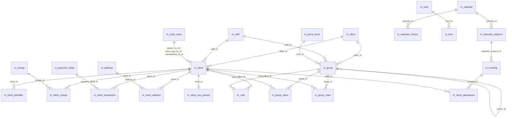

# Clients & Groups Data Model

This page is the physical-schema reference for the **party** side of Apache
Fineract: the natural and legal persons (clients), the cooperatives and
joint-liability groups they belong to, the meeting calendars that drive
repayment cycles, and the unstructured notes, addresses and funding sources
attached to them. Every loan, savings, share, charge and journal entry in
Fineract is ultimately anchored on one of these tables, so getting the column
shapes and foreign-key wiring correct is a precondition for reading any other
data-model page in this wiki.

All tables are created in the tenant database by
`fineract-provider/src/main/resources/db/changelog/tenant/parts/0001_initial_schema.xml`
and later refined by parts `0117_set_datetime_precision.xml`,
`0127_client_name_length.xml`, `0079_add_audit_entries_to_client_charge.xml`
and the `m_calendar_history` add-on. The JPA entities live in
`fineract-core` (under `org.apache.fineract.portfolio.client`, `.group`,
`.calendar`, `.fund`) and in `fineract-provider` (`note`, `address`).

## Source map

| Cluster element       | JPA entity (package `org.apache.fineract.portfolio.*`)              | Liquibase changeSet                                                                |
| --------------------- | ------------------------------------------------------------------- | ---------------------------------------------------------------------------------- |
| `m_client`            | `client.domain.Client`                                              | `0001_initial_schema.xml` (id `35`); later mutated by parts 117 / 127 / 139 / 161  |
| `m_client_identifier` | `client.domain.ClientIdentifier`                                    | `0001_initial_schema.xml` (id `39`)                                                |
| `m_client_charge`     | `charge.domain.ClientCharge` (provider)                             | `0001_initial_schema.xml` (id `38`)                                                |
| `m_client_transaction`| `client.domain.ClientTransaction` (provider)                        | `0001_initial_schema.xml` (id `40`)                                                |
| `m_client_address`    | `client.domain.ClientAddress` (provider)                            | `0001_initial_schema.xml` (id `36`)                                                |
| `m_address`           | `address.domain.Address` (provider)                                 | `0001_initial_schema.xml`                                                          |
| `m_client_attendance` | (not an entity — projected by SQL)                                  | `0001_initial_schema.xml` (id `37`)                                                |
| `m_client_non_person` | `client.domain.ClientNonPerson` (provider)                          | `0001_initial_schema.xml`                                                          |
| `m_group`             | `group.domain.Group`                                                | `0001_initial_schema.xml` (id `92`)                                                |
| `m_group_client`      | join table on `Group.clientMembers`                                 | `0001_initial_schema.xml` (id `93`)                                                |
| `m_group_roles`       | `group.domain.GroupRole`                                            | `0001_initial_schema.xml`                                                          |
| `m_group_level`       | `group.domain.GroupLevel`                                           | `0001_initial_schema.xml`                                                          |
| `m_calendar`          | `calendar.domain.Calendar`                                          | `0001_initial_schema.xml` (id `27`)                                                |
| `m_calendar_instance` | `calendar.domain.CalendarInstance`                                  | `0001_initial_schema.xml` (id `28`)                                                |
| `m_calendar_history`  | `calendar.domain.CalendarHistory`                                   | added in parts `0058_meeting_calendar_history.xml`                                 |
| `m_meeting`           | `meeting.domain.Meeting` (provider)                                 | `0001_initial_schema.xml` (id `109`)                                               |
| `m_note`              | `note.domain.Note` (provider)                                       | `0001_initial_schema.xml` (id `118`)                                               |
| `m_fund`              | `fund.domain.Fund`                                                  | `0001_initial_schema.xml` (id `86`)                                                |
| `staff_assignment_history` | `group.domain.StaffAssignmentHistory`                          | parts `0067_*` / `0068_staff_assignment_history.xml`                               |

Subsystem cross-links: see [`portfolio/clients`](/portfolio/clients),
[`portfolio/client-identifiers`](/portfolio/client-identifiers),
[`portfolio/client-charges`](/portfolio/client-charges),
[`portfolio/client-transactions`](/portfolio/client-transactions),
[`portfolio/client-address`](/portfolio/client-address),
[`portfolio/groups-and-centers`](/portfolio/groups-and-centers),
[`portfolio/calendar`](/portfolio/calendar),
[`portfolio/meetings`](/portfolio/meetings),
[`portfolio/notes`](/portfolio/notes) and
[`portfolio/funds`](/portfolio/funds).

## ER diagram

## `m_client`

`m_client` is the central party record. The Java entity
`org.apache.fineract.portfolio.client.domain.Client` lives in `fineract-core`
so downstream modules (loan, savings, share, accounting) can depend on it
without dragging in `fineract-provider`.

| Column                       | Type            | Nullable | Role / notes                                                                                       |
| ---------------------------- | --------------- | -------- | -------------------------------------------------------------------------------------------------- |
| `id`                         | `BIGINT`        | no       | Surrogate PK, auto-increment.                                                                      |
| `account_no`                 | `VARCHAR(20)`   | no       | Unique business account number, generated by `AccountNumberGenerator`.                             |
| `external_id`                | `VARCHAR(100)`  | yes      | Unique caller-supplied identifier; key for ext-id lookups.                                         |
| `status_enum`                | `INT`           | no       | `ClientStatus` (pending=100, active=300, closed=600, transfer_in_progress=303, …).                 |
| `sub_status`                 | `INT`           | yes      | Code-value FK into `m_code_value`, reason for sub-status of active client.                         |
| `activation_date`            | `date`          | yes      | Date the client becomes `active`.                                                                  |
| `office_joining_date`        | `date`          | yes      | Date attached to the current `office_id`; updated on transfer.                                     |
| `office_id`                  | `BIGINT`        | no       | FK → `m_office.id`. Drives data-scope filtering.                                                   |
| `transfer_to_office_id`      | `BIGINT`        | yes      | Set during inter-office transfer workflow.                                                         |
| `staff_id`                   | `BIGINT`        | yes      | FK → `m_staff.id` (loan officer).                                                                  |
| `firstname`/`middlename`/`lastname` | `VARCHAR(50)` | yes  | Used when `legal_form_enum = PERSON`.                                                              |
| `fullname`                   | `VARCHAR(100)`  | yes      | Used when `legal_form_enum = ENTITY`.                                                              |
| `display_name`               | `VARCHAR(100)`  | no       | Derived in `Client.deriveDisplayName()`.                                                           |
| `mobile_no`                  | `VARCHAR(50)`   | yes      | Unique when present.                                                                               |
| `is_staff`                   | `boolean`       | no       | `true` when the client is also a staff member.                                                     |
| `gender_cv_id`               | `INT`           | yes      | FK → `m_code_value.id` (Gender code).                                                              |
| `date_of_birth`              | `date`          | yes      | DOB for `PERSON` clients.                                                                          |
| `image_id`                   | `BIGINT`        | yes      | FK → `m_image.id`.                                                                                 |
| `closure_reason_cv_id`       | `INT`           | yes      | FK → `m_code_value.id` (ClientClosureReason).                                                      |
| `closedon_date`              | `date`          | yes      | Set on close transition.                                                                           |
| `updated_by` / `updated_on`  | `BIGINT`/`date` | yes      | Legacy audit (separate from Spring auditing).                                                      |
| `submittedon_date`           | `date`          | yes      | Submission timestamp.                                                                              |
| `submittedon_userid`         | `BIGINT`        | yes      | FK → `m_appuser.id`.                                                                               |
| `activatedon_userid`         | `BIGINT`        | yes      | FK → `m_appuser.id`.                                                                               |
| `closedon_userid`            | `BIGINT`        | yes      | FK → `m_appuser.id`.                                                                               |
| `default_savings_product`    | `BIGINT`        | yes      | FK → `m_savings_product.id`; auto-opens a savings account on activation.                           |
| `default_savings_account`    | `BIGINT`        | yes      | FK → `m_savings_account.id`.                                                                       |
| `client_type_cv_id`          | `INT`           | yes      | FK → `m_code_value.id` (ClientType).                                                               |
| `client_classification_cv_id`| `INT`           | yes      | FK → `m_code_value.id` (ClientClassification).                                                     |
| `reject_reason_cv_id`        | `INT`           | yes      | Reason for rejection (state 400).                                                                  |
| `rejectedon_date` / `rejectedon_userid` | mixed | yes      | Reject audit.                                                                                      |
| `withdraw_reason_cv_id`      | `INT`           | yes      | Withdrawn-state code value.                                                                        |
| `withdrawn_on_date` / `withdraw_on_userid` | mixed | yes  | Withdrawal audit.                                                                                  |
| `reactivated_on_date` / `reactivated_on_userid` | mixed | yes | Re-activation audit.                                                                              |
| `legal_form_enum`            | `INT`           | yes      | `LegalForm` (PERSON=1, ENTITY=2). Drives presence of `fullname` vs name fields.                    |
| `reopened_on_date` / `reopened_by_userid` | mixed | yes   | Re-open audit (only valid from CLOSED).                                                            |
| `email_address`              | `VARCHAR(150)`  | yes      | Free-form email, no uniqueness.                                                                    |
| `proposed_transfer_date`     | `date`          | yes      | Inter-office transfer scheduling.                                                                  |

Spring-data auditing also stamps `createdby_id`, `created_date`,
`lastmodifiedby_id`, `lastmodified_date` (added by part `0020_add_audit_entries.xml`).

See [`portfolio/clients`](/portfolio/clients) for write-service and lifecycle
behaviour.

## `m_client_identifier`

Government, KYC or institution identity documents on a client.

| Column              | Type           | Nullable | Role                                                                  |
| ------------------- | -------------- | -------- | --------------------------------------------------------------------- |
| `id`                | `BIGINT`       | no       | PK.                                                                   |
| `client_id`         | `BIGINT`       | no       | FK → `m_client.id`.                                                   |
| `document_type_id`  | `INT`          | no       | FK → `m_code_value.id` for code `Customer Identifier`.                |
| `document_key`      | `VARCHAR(50)`  | no       | The identifier value (e.g. passport number).                          |
| `status`            | `INT`          | no       | `ClientIdentifierStatus` (default 300 = ACTIVE).                      |
| `active`            | `INT`          | yes      | Alternate boolean activation flag (legacy).                           |
| `description`       | `VARCHAR(500)` | yes      | Free text.                                                            |
| `createdby_id`      | `BIGINT`       | yes      | Audit.                                                                |
| `lastmodifiedby_id` | `BIGINT`       | yes      | Audit.                                                                |
| `created_date`      | `datetime`     | yes      | Audit.                                                                |
| `lastmodified_date` | `datetime`     | yes      | Audit.                                                                |

Unique compound `(document_type_id, document_key)` is enforced by index
`unique_active_client_identifier`. See
[`portfolio/client-identifiers`](/portfolio/client-identifiers).

## `m_client_charge`

Charges applied at the client level (not loan, not savings). Backed by
`ClientCharge` in `fineract-provider`.

| Column                        | Type            | Nullable | Role                                                              |
| ----------------------------- | --------------- | -------- | ----------------------------------------------------------------- |
| `id`                          | `BIGINT`        | no       | PK.                                                               |
| `client_id`                   | `BIGINT`        | no       | FK → `m_client.id`.                                               |
| `charge_id`                   | `BIGINT`        | no       | FK → `m_charge.id`.                                               |
| `is_penalty`                  | `boolean`       | no       | Mirrors `m_charge.is_penalty`.                                    |
| `charge_time_enum`            | `SMALLINT`      | no       | `ChargeTimeType` (specific, due_for_collection, …).               |
| `charge_due_date`             | `date`          | yes      | When the charge falls due.                                        |
| `charge_calculation_enum`     | `SMALLINT`      | no       | `ChargeCalculationType`.                                          |
| `amount`                      | `DECIMAL(19,6)` | no       | Original charge amount.                                           |
| `amount_paid_derived`         | `DECIMAL(19,6)` | yes      | Running paid total.                                               |
| `amount_waived_derived`       | `DECIMAL(19,6)` | yes      | Running waived total.                                             |
| `amount_writtenoff_derived`   | `DECIMAL(19,6)` | yes      | Running written-off total.                                        |
| `amount_outstanding_derived`  | `DECIMAL(19,6)` | no       | Outstanding = amount − paid − waived − written-off.               |
| `is_paid_derived`             | `boolean`       | yes      | Convenience flag.                                                 |
| `waived`                      | `boolean`       | yes      | Whether the charge has been waived.                               |
| `is_active`                   | `boolean`       | yes      | Reactivation flag.                                                |
| `inactivated_on_date`         | `date`          | yes      | Set when the charge is inactivated.                               |

See [`portfolio/client-charges`](/portfolio/client-charges) and
[`models/charges-fees-taxes`](/models/charges-fees-taxes).

## `m_client_transaction`

Monetary client-level transactions (charge payments, refunds, fee waivers).

| Column                 | Type            | Nullable | Role                                                            |
| ---------------------- | --------------- | -------- | --------------------------------------------------------------- |
| `id`                   | `BIGINT`        | no       | PK.                                                             |
| `client_id`            | `BIGINT`        | no       | FK → `m_client.id`.                                             |
| `office_id`            | `BIGINT`        | no       | FK → `m_office.id` (office of record at time of transaction).   |
| `currency_code`        | `VARCHAR(3)`    | no       | ISO 4217.                                                       |
| `payment_detail_id`    | `BIGINT`        | yes      | FK → `m_payment_detail.id`.                                     |
| `is_reversed`          | `boolean`       | no       | Reversal flag.                                                  |
| `external_id`          | `VARCHAR(50)`   | yes      | Unique caller-supplied id.                                      |
| `transaction_date`     | `date`          | no       | Effective date.                                                 |
| `transaction_type_enum`| `SMALLINT`      | no       | `ClientTransactionType`.                                        |
| `amount`               | `DECIMAL(19,6)` | no       | Signed amount.                                                  |
| `created_date`         | `datetime`      | no       | System timestamp.                                               |
| `appuser_id`           | `BIGINT`        | no       | FK → `m_appuser.id`.                                            |

Each row spawns linked entries in `m_client_charge_paid_by` and
`acc_gl_journal_entry`. See
[`portfolio/client-transactions`](/portfolio/client-transactions).

## `m_client_address` and `m_address`

Address records are normalised so that one physical address may be reused
across multiple clients.

### `m_address`

| Column            | Type            | Nullable | Role                                                            |
| ----------------- | --------------- | -------- | --------------------------------------------------------------- |
| `id`              | `BIGINT`        | no       | PK.                                                             |
| `street`          | `VARCHAR(100)`  | yes      | Street name.                                                    |
| `address_line_1`  | `VARCHAR(100)`  | yes      | Line 1.                                                         |
| `address_line_2`  | `VARCHAR(100)`  | yes      | Line 2.                                                         |
| `address_line_3`  | `VARCHAR(100)`  | yes      | Line 3.                                                         |
| `town_village`    | `VARCHAR(100)`  | yes      | Town or village.                                                |
| `city`            | `VARCHAR(100)`  | yes      | City.                                                           |
| `county_district` | `VARCHAR(100)`  | yes      | County / district.                                              |
| `state_province_id`| `INT`          | yes      | FK → `m_code_value.id` (state code).                            |
| `country_id`      | `INT`           | yes      | FK → `m_code_value.id` (country code).                          |
| `postal_code`     | `VARCHAR(10)`   | yes      | Postal / zip.                                                   |
| `latitude`        | `DECIMAL(10,8)` | yes      | Geographic latitude.                                            |
| `longitude`       | `DECIMAL(10,8)` | yes      | Geographic longitude.                                           |
| `created_by`      | `VARCHAR(100)`  | yes      | Audit (username string).                                        |
| `created_on`      | `date`          | yes      | Audit.                                                          |
| `updated_by`      | `VARCHAR(100)`  | yes      | Audit.                                                          |
| `updated_on`      | `date`          | yes      | Audit.                                                          |

### `m_client_address`

| Column            | Type      | Nullable | Role                                                                         |
| ----------------- | --------- | -------- | ---------------------------------------------------------------------------- |
| `id`              | `BIGINT`  | no       | PK.                                                                          |
| `client_id`       | `BIGINT`  | no       | FK → `m_client.id`.                                                          |
| `address_id`      | `BIGINT`  | no       | FK → `m_address.id`.                                                         |
| `address_type_id` | `INT`     | no       | FK → `m_code_value.id` (`ADDRESS_TYPE` system code, e.g. Permanent/Mailing). |
| `is_active`       | `boolean` | no       | Current address flag.                                                        |

See [`portfolio/client-address`](/portfolio/client-address).

## `m_client_attendance`

Per-meeting attendance row generated by collection sheets.

| Column                  | Type       | Nullable | Role                                                |
| ----------------------- | ---------- | -------- | --------------------------------------------------- |
| `id`                    | `BIGINT`   | no       | PK.                                                 |
| `client_id`             | `BIGINT`   | no       | FK → `m_client.id`.                                 |
| `meeting_id`            | `BIGINT`   | no       | FK → `m_meeting.id`.                                |
| `attendance_type_enum`  | `SMALLINT` | no       | `AttendanceType` (PRESENT, ABSENT, APPROVED, …).    |

## `m_client_non_person`

Stores corporate / legal-entity attributes when `m_client.legal_form_enum =
ENTITY`. Columns: `client_id` (PK, FK), `constitution_cv_id`,
`main_business_line_cv_id`, `incorp_no`, `incorp_validity_till`, `remarks`.

## `m_group`

Cooperative / joint-liability group or a center (a center is a `m_group` row
whose `level_id` points to the CENTER level in `m_group_level`).

| Column                  | Type           | Nullable | Role                                                                |
| ----------------------- | -------------- | -------- | ------------------------------------------------------------------- |
| `id`                    | `BIGINT`       | no       | PK.                                                                 |
| `external_id`           | `VARCHAR(100)` | yes      | Unique business id.                                                 |
| `status_enum`           | `INT`          | no       | `GroupingTypeStatus` (default 300 = ACTIVE).                        |
| `activation_date`       | `date`         | yes      | Group activation date.                                              |
| `office_id`             | `BIGINT`       | no       | FK → `m_office.id`.                                                 |
| `staff_id`              | `BIGINT`       | yes      | FK → `m_staff.id`.                                                  |
| `parent_id`             | `BIGINT`       | yes      | Self FK → `m_group.id`; centers are parents of groups.              |
| `level_id`              | `INT`          | no       | FK → `m_group_level.id` (CENTER, GROUP, …).                         |
| `display_name`          | `VARCHAR(100)` | no       | Display label.                                                      |
| `hierarchy`             | `VARCHAR(100)` | yes      | Materialised path (e.g. `.1.6.21.`).                                |
| `closure_reason_cv_id`  | `INT`          | yes      | FK → `m_code_value.id`.                                             |
| `closedon_date`         | `date`         | yes      | Closure date.                                                       |
| `activatedon_userid`    | `BIGINT`       | yes      | Audit.                                                              |
| `submittedon_date`      | `date`         | yes      | Audit.                                                              |
| `submittedon_userid`    | `BIGINT`      | yes      | Audit.                                                              |
| `closedon_userid`       | `BIGINT`       | yes      | Audit.                                                              |
| `account_no`            | `VARCHAR(20)`  | no       | Business id.                                                        |

Plus audit columns from `0020_add_audit_entries.xml`. See
[`portfolio/groups-and-centers`](/portfolio/groups-and-centers).

## `m_group_client`

Join table for `Group.clientMembers`. Two-column composite PK:

| Column      | Type     | Nullable | Role                          |
| ----------- | -------- | -------- | ----------------------------- |
| `group_id`  | `BIGINT` | no       | PK, FK → `m_group.id`.        |
| `client_id` | `BIGINT` | no       | PK, FK → `m_client.id`.       |

## `m_group_level`

Defines the hierarchy of groupings. Standard installations ship CENTER and
GROUP rows.

| Column                  | Type          | Nullable | Role                                                |
| ----------------------- | ------------- | -------- | --------------------------------------------------- |
| `id`                    | `INT`         | no       | PK.                                                 |
| `parent_id`             | `INT`         | yes      | Self FK.                                            |
| `super_parent`          | `boolean`     | no       | Marks the root level.                               |
| `level_name`            | `VARCHAR(100)`| no       | Human-readable name.                                |
| `recursable`            | `boolean`     | no       | Whether this level may nest into itself.            |
| `can_have_clients`      | `boolean`     | no       | Whether clients can attach directly.                |

## `m_group_roles`

Optional role assignment of a client within a group.

| Column         | Type     | Nullable | Role                                                  |
| -------------- | -------- | -------- | ----------------------------------------------------- |
| `id`           | `BIGINT` | no       | PK.                                                   |
| `group_id`     | `BIGINT` | no       | FK → `m_group.id`.                                    |
| `client_id`    | `BIGINT` | no       | FK → `m_client.id`.                                   |
| `role_cv_id`   | `INT`    | no       | FK → `m_code_value.id` (GroupRole system code).       |

## `staff_assignment_history`

Track of which `m_staff.id` was responsible for a client / group on a given
date range. Fields: `staff_id`, `office_id`, `centre_id`/`group_id`/`client_id`
(nullable, exactly one populated), `start_date`, `end_date`, audit columns.

## `m_calendar` and `m_calendar_instance`

A calendar (`m_calendar`) carries an RFC-5545-style recurrence; a calendar
instance (`m_calendar_instance`) attaches a calendar to a concrete entity
(group, loan, etc.).

### `m_calendar`

| Column              | Type           | Nullable | Role                                                            |
| ------------------- | -------------- | -------- | --------------------------------------------------------------- |
| `id`                | `BIGINT`       | no       | PK.                                                             |
| `title`             | `VARCHAR(70)`  | no       | Display title.                                                  |
| `description`       | `VARCHAR(100)` | yes      | Notes.                                                          |
| `location`          | `VARCHAR(50)`  | yes      | Meeting location.                                               |
| `start_date`        | `date`         | no       | Start date.                                                     |
| `end_date`          | `date`         | yes      | End date (optional).                                            |
| `duration`          | `SMALLINT`     | yes      | Optional meeting duration.                                      |
| `calendar_type_enum`| `SMALLINT`     | no       | `CalendarType` (COLLECTION=1, TRAINING, INTAKE, AUDIT).         |
| `repeating`         | `boolean`      | no       | Whether this calendar repeats.                                  |
| `recurrence`        | `VARCHAR(100)` | yes      | RRULE string parsed by `CalendarHelper`.                        |
| `remind_by_enum`    | `SMALLINT`     | yes      | `CalendarRemindBy`.                                             |
| `first_reminder`    | `SMALLINT`     | yes      | Days/units before event.                                        |
| `second_reminder`   | `SMALLINT`     | yes      | Secondary reminder.                                             |
| `createdby_id`      | `BIGINT`       | yes      | Audit.                                                          |
| `lastmodifiedby_id` | `BIGINT`       | yes      | Audit.                                                          |
| `created_date`      | `datetime`     | yes      | Audit.                                                          |
| `lastmodified_date` | `datetime`     | yes      | Audit.                                                          |
| `meeting_time`      | `time`         | yes      | Time-of-day for the recurrence.                                 |

### `m_calendar_instance`

| Column             | Type       | Nullable | Role                                                       |
| ------------------ | ---------- | -------- | ---------------------------------------------------------- |
| `id`               | `BIGINT`   | no       | PK.                                                        |
| `calendar_id`      | `BIGINT`   | no       | FK → `m_calendar.id`.                                      |
| `entity_id`        | `BIGINT`   | no       | Generic FK; resolved via `entity_type_enum`.               |
| `entity_type_enum` | `SMALLINT` | no       | `CalendarEntityType` (CLIENTS=1, GROUPS, LOANS, CENTERS).  |

### `m_calendar_history`

Added by `0058_meeting_calendar_history.xml`. Each row is a "frozen" copy of
the previous calendar shape after a reschedule, used by repayment-schedule
recalculation to honour historical meeting dates.

| Column              | Type           | Nullable | Role                                |
| ------------------- | -------------- | -------- | ----------------------------------- |
| `id`                | `BIGINT`       | no       | PK.                                 |
| `calendar_id`       | `BIGINT`       | no       | FK → `m_calendar.id`.               |
| `start_date`        | `date`         | no       | Start of period this row is valid.  |
| `end_date`          | `date`         | yes      | End of period this row is valid.    |
| `recurrence`        | `VARCHAR(100)` | no       | RRULE in effect during the period.  |
| `createdby_id`      | `BIGINT`       | yes      | Audit.                              |
| `lastmodifiedby_id` | `BIGINT`       | yes      | Audit.                              |
| `created_date`      | `datetime`     | yes      | Audit.                              |
| `lastmodified_date` | `datetime`     | yes      | Audit.                              |

See [`portfolio/calendar`](/portfolio/calendar) for the recurrence helper
and [`portfolio/meetings`](/portfolio/meetings) for the meeting writeflow.

## `m_meeting`

A concrete materialisation of a calendar instance.

| Column                | Type     | Nullable | Role                                  |
| --------------------- | -------- | -------- | ------------------------------------- |
| `id`                  | `BIGINT` | no       | PK.                                   |
| `calendar_instance_id`| `BIGINT` | no       | FK → `m_calendar_instance.id`.        |
| `meeting_date`        | `date`   | no       | The actual date of the meeting.       |

## `m_note`

Polymorphic notes attached to any of the supported parent entities. The
`note_type_enum` selects which FK is populated.

| Column                          | Type            | Nullable | Role                                          |
| ------------------------------- | --------------- | -------- | --------------------------------------------- |
| `id`                            | `BIGINT`        | no       | PK.                                           |
| `client_id`                     | `BIGINT`        | yes      | FK → `m_client.id`.                           |
| `group_id`                      | `BIGINT`        | yes      | FK → `m_group.id`.                            |
| `loan_id`                       | `BIGINT`        | yes      | FK → `m_loan.id`.                             |
| `loan_transaction_id`           | `BIGINT`        | yes      | FK → `m_loan_transaction.id`.                 |
| `savings_account_id`            | `BIGINT`        | yes      | FK → `m_savings_account.id`.                  |
| `savings_account_transaction_id`| `BIGINT`        | yes      | FK → `m_savings_account_transaction.id`.      |
| `share_account_id`              | `BIGINT`        | yes      | FK → `m_share_account.id`.                    |
| `note_type_enum`                | `SMALLINT`      | no       | `NoteType` enum.                              |
| `note`                          | `VARCHAR(1000)` | yes      | Free text.                                    |
| `created_date`                  | `datetime`      | yes      | Audit.                                        |
| `createdby_id`                  | `BIGINT`        | yes      | Audit.                                        |
| `lastmodified_date`             | `datetime`      | yes      | Audit.                                        |
| `lastmodifiedby_id`             | `BIGINT`        | yes      | Audit.                                        |

See [`portfolio/notes`](/portfolio/notes).

## `m_fund`

Source of capital that a loan can be tagged with for reporting.

| Column        | Type           | Nullable | Role                                       |
| ------------- | -------------- | -------- | ------------------------------------------ |
| `id`          | `BIGINT`       | no       | PK.                                        |
| `name`        | `VARCHAR(255)` | yes      | Unique fund name.                          |
| `external_id` | `VARCHAR(100)` | yes      | Unique caller-supplied identifier.         |

See [`portfolio/funds`](/portfolio/funds). Funds are referenced from
`m_loan.fund_id`, joining this cluster to
[`models/loans-and-products`](/models/loans-and-products).

## Cross-cluster references

- `m_office`, `m_staff` → [`models/offices-staff-organization`](/models/offices-staff-organization).
- `m_code_value` → [`models/configuration-and-codes`](/models/configuration-and-codes).
- `m_charge` (referenced by `m_client_charge.charge_id`) →
  [`models/charges-fees-taxes`](/models/charges-fees-taxes).
- `m_image` (`m_client.image_id`) →
  [`models/documents-and-images`](/models/documents-and-images).
- `m_payment_detail`, `m_appuser` → [`models/users-roles-permissions`](/models/users-roles-permissions).
- `m_loan`, `m_savings_account`, `m_share_account` (referenced by `m_note`) →
  [`models/loans-and-products`](/models/loans-and-products) and
  [`models/savings-and-deposits`](/models/savings-and-deposits).
