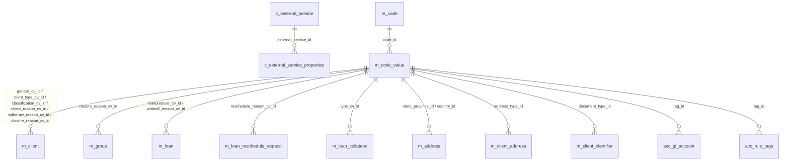

# Configuration & Codes Data Model

This page documents the tables that hold **tenant-level configuration** in
Apache Fineract: the global on/off toggles in `c_configuration`, the
external-service credentials in `c_external_service` /
`c_external_service_properties`, the dropdown-list catalogue in
`m_code` / `m_code_value`, and the single-row cache-type setting in
`c_cache`. None of these are domain entities in the business sense — they
are infrastructure tables consumed by services across every other module.

Tables are seeded by
`fineract-provider/.../changelog/tenant/parts/0001_initial_schema.xml` and
the initial data set is loaded by
`0002_initial_data.xml` (codes) and
`0003_postgresql_specific_initial_data.xml`. There is no
`m_global_configuration` table — the requested name maps to `c_configuration`
in the actual schema.

## Source map

| Cluster element                | JPA entity                                                          | Liquibase changeSet                                  |
| ------------------------------ | ------------------------------------------------------------------- | ---------------------------------------------------- |
| `c_configuration`              | `infrastructure.configuration.domain.GlobalConfigurationProperty`   | `0001_initial_schema.xml` (id `19`)                  |
| `c_external_service`           | `infrastructure.configuration.domain.ExternalServicesProperties`-style| `0001_initial_schema.xml`                            |
| `c_external_service_properties`| `infrastructure.configuration.domain.ExternalServicesProperties`    | `0001_initial_schema.xml`                            |
| `m_code`                       | `infrastructure.codes.domain.Code`                                  | `0001_initial_schema.xml`                            |
| `m_code_value`                 | `infrastructure.codes.domain.CodeValue`                             | `0001_initial_schema.xml`                            |
| `c_cache`                      | `infrastructure.cache.domain.PlatformCache`                         | `0001_initial_schema.xml`                            |

Note: there is no `m_global_configuration` table — global flags live in
`c_configuration`. The `c_` prefix is used for purely infrastructural
configuration tables; `m_` is reserved for business-domain tables. Despite
the naming, both have the same lifecycle (per-tenant DB).

Subsystem cross-links:
[`core/configuration-properties`](/core/configuration-properties),
[`core/codes`](/core/codes),
[`core/cache-infrastructure`](/core/cache-infrastructure) and the
`fineract-doc` page on tenant database structure.

## ER diagram

## `c_configuration`

A row per global toggle. The runtime API exposes these through the
`/configurations` endpoints (`fineract-core` configuration-properties). Each
flag is keyed by `name`; the meaning of the auxiliary columns
(`value`, `date_value`, `string_value`) depends on the flag.

| Column         | Type           | Nullable | Role                                                                                                |
| -------------- | -------------- | -------- | --------------------------------------------------------------------------------------------------- |
| `id`           | `BIGINT`       | no       | PK.                                                                                                 |
| `name`         | `VARCHAR(100)` | yes      | Unique flag name (e.g. `maker-checker`, `amazon-S3`, `reschedule-future-repayments`).               |
| `value`        | `INT`          | yes      | Numeric value when the flag carries a count (e.g. days-to-keep).                                    |
| `date_value`   | `date`         | yes      | Date value when the flag pins a cutoff date.                                                        |
| `string_value` | `VARCHAR(100)` | yes      | String value for free-form configuration (cron expression, choice).                                 |
| `enabled`      | `boolean`      | no       | Master on/off switch.                                                                               |
| `is_trap_door` | `boolean`      | no       | When `true`, the flag can only be **enabled** through the API — disabling requires DBA intervention.|
| `description`  | `VARCHAR(300)` | yes      | Human-readable description shown in the admin UI.                                                   |

Seeded names include `maker-checker`, `amazon-S3`, `reschedule-future-repayments`,
`allow-transactions-on-holiday`, `allow-transactions-on-non_workingday`,
`constraint_approach_for_datatables`, `penalty-wait-period`,
`force-password-reset-days`, `savings-interest-posting-current-period-end`,
`financial-year-beginning-month`, `meetings-mandatory-for-jlg-loans`,
`min-clients-in-group`, `max-clients-in-group`, `office-specific-products-enabled`,
`restrict-products-to-user-office`, `is-business-date-enabled`, etc. The
canonical list is in `0002_initial_data.xml`.

See [`core/configuration-properties`](/core/configuration-properties).

## `c_external_service`

| Column | Type           | Nullable | Role                                                            |
| ------ | -------------- | -------- | --------------------------------------------------------------- |
| `id`   | `BIGINT`       | no       | PK.                                                             |
| `name` | `VARCHAR(100)` | yes      | Unique service name (`S3`, `SMTP`, `SMS`, `NOTIFICATION`).      |

The seed data file inserts the four canonical services.

## `c_external_service_properties`

Sparse key-value table — each row pins a single property for one service.

| Column                | Type           | Nullable | Role                                                          |
| --------------------- | -------------- | -------- | ------------------------------------------------------------- |
| `name`                | `VARCHAR(150)` | no       | Property name (e.g. `s3_bucket_name`, `username`, `password`).|
| `value`               | `VARCHAR(250)` | yes      | Property value (sometimes encrypted by the application layer).|
| `external_service_id` | `BIGINT`       | no       | FK → `c_external_service.id`.                                 |

A compound unique index `(external_service_id, name)` prevents duplicates.
See the document and notification module pages —
[`models/documents-and-images`](/models/documents-and-images) and
`notification` overviews — for which service slot they consult.

## `m_code`

Top-level dropdown / classification category. Every business entity that
needs a configurable enum (gender, marital status, identifier type,
collateral type, loan purpose, closure reason, etc.) reads from a single
`m_code` row.

| Column              | Type           | Nullable | Role                                                                   |
| ------------------- | -------------- | -------- | ---------------------------------------------------------------------- |
| `id`                | `INT`          | no       | PK.                                                                    |
| `code_name`         | `VARCHAR(100)` | yes      | Unique code name (e.g. `Gender`, `ClientType`, `LoanCollateral`).      |
| `is_system_defined` | `boolean`      | no       | When `true`, the row cannot be deleted from the API.                   |

Codes such as `Gender`, `ClientType`, `ClientClassification`,
`LoanCollateral`, `Customer Identifier`, `LoanPurpose`,
`ClientClosureReason`, `LoanWriteoff Reason`, `LoanRescheduleReason`,
`AddressType`, `Country`, `StateProvince`, `AssetAccountTags`,
`LiabilityAccountTags`, `EquityAccountTags`, `IncomeAccountTags`,
`ExpenseAccountTags` are seeded.

See [`core/codes`](/core/codes).

## `m_code_value`

The actual enum value within a code.

| Column             | Type           | Nullable | Role                                                                |
| ------------------ | -------------- | -------- | ------------------------------------------------------------------- |
| `id`               | `INT`          | no       | PK. This is the integer stored in `*_cv_id` columns elsewhere.      |
| `code_id`          | `INT`          | no       | FK → `m_code.id`.                                                   |
| `code_value`       | `VARCHAR(100)` | yes      | Display label.                                                      |
| `code_description` | `VARCHAR(500)` | yes      | Description.                                                        |
| `order_position`   | `INT`          | no       | Sort order within the parent code.                                  |
| `code_score`       | `INT`          | yes      | Optional numeric weight (used by SPM scorecards).                   |
| `is_active`        | `boolean`      | no       | Active toggle. Inactive values do not appear in dropdowns.          |
| `is_mandatory`     | `boolean`      | no       | Used by the front-end to mark required selections.                  |

Compound unique constraint `(code_id, code_value)` is added by a later part.

Every `*_cv_id` / `tag_id` column across the schema is an FK to
`m_code_value.id`. The cross-cluster references at the bottom of the other
data-model pages enumerate them.

## `c_cache`

A single-row table carrying the global cache strategy.

| Column            | Type      | Nullable | Role                                                              |
| ----------------- | --------- | -------- | ----------------------------------------------------------------- |
| `id`              | `BIGINT`  | no       | PK.                                                               |
| `cache_type_enum` | `TINYINT` | no       | `CacheType` (NO_CACHE=1, SINGLE_NODE=2, MULTI_NODE=3). Default 1. |

When set to `MULTI_NODE`, the Ehcache replicating-cache configuration is
honoured (in clustered runtimes). See
[`core/cache-infrastructure`](/core/cache-infrastructure).

## Cross-cluster references

`m_code_value` is the most-referenced infrastructure table in the schema.
A non-exhaustive list of FKs from business tables:

| Referencing table.column                              | Code (m_code.code_name)                        | See page                                                            |
| ----------------------------------------------------- | ---------------------------------------------- | ------------------------------------------------------------------- |
| `m_client.gender_cv_id`                               | `Gender`                                       | [`models/clients-and-groups`](/models/clients-and-groups)           |
| `m_client.client_type_cv_id`                          | `ClientType`                                   | [`models/clients-and-groups`](/models/clients-and-groups)           |
| `m_client.client_classification_cv_id`                | `ClientClassification`                         | [`models/clients-and-groups`](/models/clients-and-groups)           |
| `m_client.closure_reason_cv_id`                       | `ClientClosureReason`                          | [`models/clients-and-groups`](/models/clients-and-groups)           |
| `m_client.sub_status`                                 | `ClientSubStatus`                              | [`models/clients-and-groups`](/models/clients-and-groups)           |
| `m_client_identifier.document_type_id`                | `Customer Identifier`                          | [`models/clients-and-groups`](/models/clients-and-groups)           |
| `m_client_address.address_type_id`                    | `ADDRESS_TYPE`                                 | [`models/clients-and-groups`](/models/clients-and-groups)           |
| `m_address.state_province_id` / `country_id`          | `STATE` / `COUNTRY`                            | [`models/clients-and-groups`](/models/clients-and-groups)           |
| `m_group.closure_reason_cv_id`                        | `GroupClosureReason`                           | [`models/clients-and-groups`](/models/clients-and-groups)           |
| `m_loan.loanpurpose_cv_id`                            | `LoanPurpose`                                  | [`models/loans-and-products`](/models/loans-and-products)           |
| `m_loan.writeoff_reason_cv_id`                        | `LoanWriteOffReasons`                          | [`models/loans-and-products`](/models/loans-and-products)           |
| `m_loan_collateral.type_cv_id`                        | `LoanCollateral`                               | [`models/loans-and-products`](/models/loans-and-products)           |
| `m_loan_reschedule_request.reschedule_reason_cv_id`   | `LoanRescheduleReason`                         | [`models/loans-and-products`](/models/loans-and-products)           |
| `acc_gl_account.tag_id`                               | `AssetAccountTags` / `LiabilityAccountTags` …  | [`models/accounting-and-gl`](/models/accounting-and-gl)             |
| `acc_rule_tags.tag_id`                                | as above                                       | [`models/accounting-and-gl`](/models/accounting-and-gl)             |

Other cross-links:

- `m_appuser` (audit on `c_configuration` mutations after parts `0020_*`) →
  [`models/users-roles-permissions`](/models/users-roles-permissions).
- `c_external_service` is consulted by the document, notification and SMS
  campaign subsystems —
  [`models/documents-and-images`](/models/documents-and-images) and the
  notification overview page.

## Reading and writing configuration at runtime

The platform exposes the contents of `c_configuration` through the
`/configurations` REST surface in `fineract-core`. The flow is:

1. `GET /configurations` lists every row.
2. `GET /configurations/{id}` returns a single row.
3. `PUT /configurations/{id}` updates the value columns. The platform
   enforces:

   - `is_trap_door = true` rows can only be **enabled**, never disabled —
     once a one-way switch is flipped, it cannot be flipped back via the
     API.
   - Numeric flags (`value`) refuse non-integer values.
   - Date flags (`date_value`) refuse non-ISO inputs.

The runtime fetches flags via
`GlobalConfigurationRepositoryWrapper.findOneByNameWithNotFoundDetection(name)`.
For hot paths the value is wrapped in a per-request cache to avoid
hitting the DB on every check.

## Reading codes at runtime

Code values are loaded through `CodeValueReadPlatformService` which caches
the entire list per code-name in the Ehcache (see
[`core/cache-infrastructure`](/core/cache-infrastructure)). Cache
invalidation is event-driven: a mutation on a code or code-value flushes
the entry. The cache is shared across nodes when
`c_cache.cache_type_enum = MULTI_NODE`.

## Notable system-defined codes

The following codes are seeded as `is_system_defined = true` and cannot be
deleted through the API:

| Code name                | Used for                                                                                  |
| ------------------------ | ----------------------------------------------------------------------------------------- |
| `Gender`                 | `m_client.gender_cv_id`.                                                                  |
| `ClientType`             | `m_client.client_type_cv_id`.                                                             |
| `ClientClassification`   | `m_client.client_classification_cv_id`.                                                   |
| `ClientClosureReason`    | `m_client.closure_reason_cv_id` and `m_group.closure_reason_cv_id`.                       |
| `LoanPurpose`            | `m_loan.loanpurpose_cv_id`.                                                               |
| `LoanCollateral`         | `m_loan_collateral.type_cv_id`.                                                           |
| `LoanWriteOffReasons`    | `m_loan.writeoff_reason_cv_id`.                                                           |
| `LoanRescheduleReason`   | `m_loan_reschedule_request.reschedule_reason_cv_id`.                                      |
| `Customer Identifier`    | `m_client_identifier.document_type_id`.                                                   |
| `ADDRESS_TYPE`           | `m_client_address.address_type_id`.                                                       |
| `STATE` / `COUNTRY`      | `m_address.state_province_id` / `m_address.country_id`.                                   |
| `AssetAccountTags`, `LiabilityAccountTags`, `EquityAccountTags`, `IncomeAccountTags`, `ExpenseAccountTags` | `acc_gl_account.tag_id` for each `classification_enum` value. |
| `GroupRole`              | `m_group_roles.role_cv_id`.                                                               |
| `Reject Reason`, `Withdraw Reason` | client / loan reject and withdraw codes.                                        |

Custom installations frequently add non-system codes for product-specific
sub-status values, additional address types, and document categories.

## Audit columns

After `0020_add_audit_entries.xml`, `c_configuration` and `m_code` carry
the standard Spring audit pair. `m_code_value` is not audited at the
column level — code-value history is captured externally through change
data capture when required.
