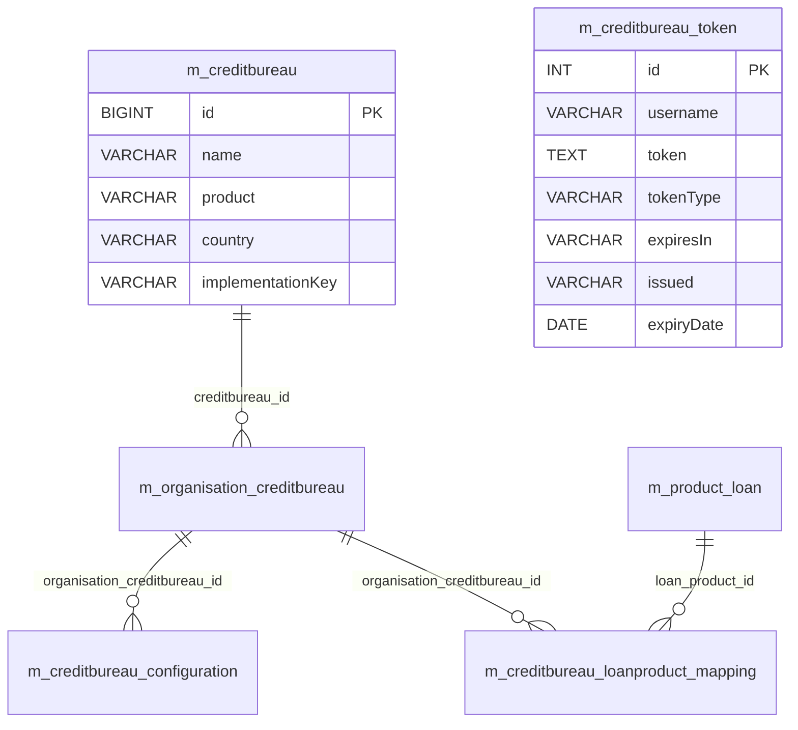

# Credit Bureau Data Model

This page documents the **credit-bureau integration** schema. The
architecture is layered:

1. **Provider catalogue** (`m_creditbureau`) — a static list of supported
   bureau adapters (`name`, `product`, `country`, `implementationKey`).
2. **Organisation registration** (`m_organisation_creditbureau`) — links
   the institution to one or more providers under a tenant-chosen `alias`.
3. **Provider configuration** (`m_creditbureau_configuration`) — key/value
   bag of credentials and tuning parameters for a registration.
4. **Loan-product mapping** (`m_creditbureau_loanproduct_mapping`) — chooses
   which registrations are consulted before disbursing a given loan product.
5. **OAuth tokens** (`m_creditbureau_token`) — bearer-token cache.

Note: the physical table names use the compact `m_creditbureau*` form
without the underscore. The task brief listed `m_credit_bureau_*` (with
underscore); only the actual `m_creditbureau*` rows are documented below.

Tables are seeded by
`fineract-provider/.../changelog/tenant/parts/0001_initial_schema.xml`.
JPA entities live in
`org.apache.fineract.infrastructure.creditbureau.domain.*`.

## Source map

| Cluster element                       | JPA entity                                                          | Liquibase changeSet                                       |
| ------------------------------------- | ------------------------------------------------------------------- | --------------------------------------------------------- |
| `m_creditbureau`                      | `creditbureau.domain.CreditBureau`                                  | `0001_initial_schema.xml`                                 |
| `m_organisation_creditbureau`         | `creditbureau.domain.OrganisationCreditBureau`                      | `0001_initial_schema.xml`                                 |
| `m_creditbureau_configuration`        | `creditbureau.domain.CreditBureauConfiguration`                     | `0001_initial_schema.xml`                                 |
| `m_creditbureau_loanproduct_mapping`  | `creditbureau.domain.CreditBureauLoanProductMapping`                | `0001_initial_schema.xml`                                 |
| `m_creditbureau_token`                | `creditbureau.domain.CreditBureauToken`                             | `0001_initial_schema.xml`                                 |

Subsystem cross-links:
[`creditbureau/overview`](/creditbureau/overview),
[`loan/loan-write-service`](/loan/loan-write-service) (where the disbursal
check is wired in) and the bureau-specific adapter docs under
`creditbureau` if present in your nav.

## ER diagram

The `m_creditbureau_token` table is intentionally not linked to the rest of
the diagram — tokens are cached by `username` (which is the credential
username sent to the bureau, often pulled out of
`m_creditbureau_configuration`).

## `m_creditbureau`

The catalogue of supported provider adapters.

| Column              | Type            | Nullable | Role                                                                |
| ------------------- | --------------- | -------- | ------------------------------------------------------------------- |
| `id`                | `BIGINT`        | no       | PK.                                                                 |
| `name`              | `VARCHAR(100)`  | no       | Display name (e.g. "Equifax", "Experian", "Thitsa Works").          |
| `product`           | `VARCHAR(100)`  | no       | Product family within the bureau (e.g. "Consumer", "Commercial").   |
| `country`           | `VARCHAR(100)`  | no       | Country / market.                                                   |
| `implementationKey` | `VARCHAR(100)`  | no       | Spring bean name of the `CreditBureauProvider` implementation.      |

Rows are inserted by seed data (`0002_initial_data.xml`) and through
provider-specific changeSets — Liquibase contexts make these conditional on
the bureau being enabled at build time.

## `m_organisation_creditbureau`

Per-tenant registration of a provider. An institution may register the same
`m_creditbureau` row under multiple `alias` values (one per portfolio or
country sub-office).

| Column           | Type           | Nullable | Role                                                              |
| ---------------- | -------------- | -------- | ----------------------------------------------------------------- |
| `id`             | `BIGINT`       | no       | PK.                                                               |
| `alias`          | `VARCHAR(50)`  | no       | Tenant-chosen label (e.g. "Equifax-Production").                  |
| `creditbureau_id`| `BIGINT`       | no       | FK → `m_creditbureau.id`.                                         |
| `isActive`       | `boolean`      | no       | Master enable/disable.                                            |

## `m_creditbureau_configuration`

A sparse key/value bag. Examples of `configkey` include `userName`,
`password`, `subscriptionKey`, `subscriptionId`, `addonQuery`, `productCode`.

| Column                       | Type           | Nullable | Role                                                          |
| ---------------------------- | -------------- | -------- | ------------------------------------------------------------- |
| `id`                         | `BIGINT`       | no       | PK.                                                           |
| `configkey`                  | `VARCHAR(50)`  | yes      | Key.                                                          |
| `value`                      | `LONGTEXT`     | yes      | Value (LONGTEXT to accommodate cert PEM / long credentials).  |
| `organisation_creditbureau_id`| `BIGINT`      | yes      | FK → `m_organisation_creditbureau.id`.                        |
| `description`                | `VARCHAR(50)`  | yes      | Free text.                                                    |

## `m_creditbureau_loanproduct_mapping`

Wires a registered bureau to one or more loan products and pins the
business rules that the disbursal flow honours.

| Column                          | Type      | Nullable | Role                                                                                |
| ------------------------------- | --------- | -------- | ----------------------------------------------------------------------------------- |
| `id`                            | `BIGINT`  | no       | PK.                                                                                 |
| `organisation_creditbureau_id`  | `BIGINT`  | no       | FK → `m_organisation_creditbureau.id`.                                              |
| `loan_product_id`               | `BIGINT`  | no       | FK → `m_product_loan.id`.                                                           |
| `is_creditcheck_mandatory`      | `boolean` | yes      | When `true`, the disbursal cannot proceed without a successful bureau response.     |
| `skip_creditcheck_in_failure`   | `boolean` | yes      | When `true`, transient bureau failures are tolerated.                               |
| `stale_period`                  | `INT`     | yes      | Days a previously-stored report stays valid.                                        |
| `isActive`                      | `boolean` | yes      | Whether the mapping is active.                                                      |

## `m_creditbureau_token`

OAuth-bearer-token cache. Tokens are upserted by `username` so that
concurrent threads can share a single live token until `expiryDate` passes.

| Column        | Type           | Nullable | Role                                              |
| ------------- | -------------- | -------- | ------------------------------------------------- |
| `id`          | `INT`          | no       | PK.                                               |
| `username`    | `VARCHAR(128)` | yes      | Bureau username the token was issued for.         |
| `token`       | `MEDIUMTEXT`   | yes      | The bearer token.                                 |
| `tokenType`   | `VARCHAR(128)` | yes      | Token type returned by the bureau (`Bearer`).     |
| `expiresIn`   | `VARCHAR(128)` | yes      | Original `expires_in` value from the OAuth flow.  |
| `issued`      | `VARCHAR(128)` | yes      | Original `issued` timestamp string.               |
| `expiryDate`  | `date`         | yes      | Materialised expiry.                              |

## Disbursal-time integration

The hand-off between `m_loan` and the credit-bureau machinery happens at
loan creation / approval / disbursement, in
`LoanWritePlatformServiceJpaRepositoryImpl`. The runtime flow is:

1. Look up the product's mapping in `m_creditbureau_loanproduct_mapping`
   where `loan_product_id = m_loan.product_id` and `isActive = true`.
2. If no mapping is found, skip the bureau check entirely.
3. If found:
   - Compute the `stale_period` cutoff: previously saved bureau responses
     within the cutoff window are reused without a network call.
   - Otherwise, resolve the active bureau implementation through the
     `m_creditbureau.implementationKey` Spring bean and invoke
     `CreditBureauProvider.getCreditScore(client, productCode)`.
   - On success, persist the response in the bureau-specific datatable
     (typically a registered datatable — see
     [`models/datatables`](/models/datatables)). The bureau token used for
     the call is read or refreshed from `m_creditbureau_token`.
4. Branch on `is_creditcheck_mandatory` and
   `skip_creditcheck_in_failure`:
   - `is_creditcheck_mandatory = false` → the bureau result is advisory
     and the loan continues regardless.
   - `is_creditcheck_mandatory = true` + `skip_creditcheck_in_failure =
     true` → the loan continues even if the call failed (no response
     returned by the bureau).
   - `is_creditcheck_mandatory = true` + `skip_creditcheck_in_failure =
     false` → the disbursal is rejected if the call failed.

## Token refresh

OAuth tokens cached in `m_creditbureau_token` are refreshed on demand by
the adapter when `expiryDate <= today`. The refresh process:

1. Reads the `userName` and `password` from
   `m_creditbureau_configuration` rows tied to the same
   `organisation_creditbureau_id`.
2. POSTs the OAuth `client_credentials` (or `password`) grant against the
   bureau's token endpoint.
3. UPSERTs the resulting bearer token back into `m_creditbureau_token`
   keyed by `username`, then proceeds with the original request.

Because the table is keyed by `username` (not by a (provider, username)
tuple), two registrations of the **same** bureau under different
`m_organisation_creditbureau.alias` values will share tokens if they use
the same username — typically not a problem because the username represents
a per-credentials identity.

## Configuration keys

The seeded list of `m_creditbureau_configuration.configkey` values varies
per provider. A non-exhaustive list:

| Key                 | Typical use                                                |
| ------------------- | ---------------------------------------------------------- |
| `userName`          | OAuth / basic-auth username.                               |
| `password`          | OAuth / basic-auth password.                               |
| `subscriptionId`    | Per-tenant subscription identifier.                        |
| `subscriptionKey`   | API key required by some bureaus on every request.         |
| `productCode`       | Identifier of the product the bureau should query against. |
| `addonQuery`        | Free-form query overrides.                                 |
| `endpoint`          | Override of the bureau base URL.                           |

Adapter implementations should validate at startup that the required keys
are present and emit a clear log line when they are not.

## Permissions and read surface

The credit-bureau API surface exposes:

- `GET /creditbureaus` — list the catalogue (`m_creditbureau`).
- `GET /creditbureaus/loanproduct` — list per-product mappings.
- `POST /organisationcreditbureau/{id}` — register / update a per-org
  bureau.
- `POST /loanproduct/{id}/mapping` — add / update the product mapping.

These actions are guarded by the seeded `CREATE_CREDITBUREAU_LOANPRODUCT`,
`UPDATE_CREDITBUREAU_LOANPRODUCT`,
`CREATE_ORGANISATIONCREDITBUREAU`,
`UPDATE_ORGANISATIONCREDITBUREAU` and `UPDATE_CREDITBUREAU_CONFIGURATION`
permissions.

## Cross-cluster references

- `m_product_loan` (loan product targeted by the mapping) →
  [`models/loans-and-products`](/models/loans-and-products).
- `m_client` is referenced indirectly through the loan that triggers a
  bureau call — see
  [`models/clients-and-groups`](/models/clients-and-groups).
- `m_appuser` audit on configuration mutations (added by part
  `0020_add_audit_entries.xml` where applicable) →
  [`models/users-roles-permissions`](/models/users-roles-permissions).
- Outbound bureau calls log to standard request/response logs in the
  runtime; there is no business-event row in
  [`models/external-events`](/models/external-events) for credit-bureau
  responses (the bureau result is consumed in-line by the loan workflow).
- The per-bureau response is typically persisted into a registered
  datatable; the registration lives in
  [`models/datatables`](/models/datatables).
