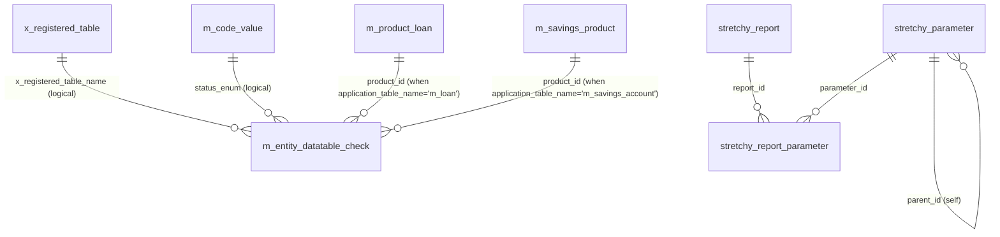

# Datatables & Reports Data Model

This page documents the metadata tables that power Apache Fineract's two
self-describing extension mechanisms:

1. **Datatables** — arbitrary CRUD-able tables that the platform exposes as
   typed REST resources, registered in `x_registered_table` and optionally
   gated by lifecycle checks in `m_entity_datatable_check`. The actual data
   tables themselves live alongside the registry (one row per registered
   table; the table's name is the `registered_table_name` value).
2. **Stretchy reports** — SQL- or Pentaho-backed reports defined in
   `stretchy_report` and parameterised through `stretchy_parameter` /
   `stretchy_report_parameter`. Both are read by the
   `org.apache.fineract.infrastructure.dataqueries` services.

The registry tables come from
`fineract-provider/.../changelog/tenant/parts/0001_initial_schema.xml`.
Stretchy-report payload widening (TEXT vs CLOB) appears in
`0017_fix_stretchy_reports.xml`; pentaho-report metadata in
`0018_pentaho_reports_to_table.xml`. JPA entities live in
`org.apache.fineract.infrastructure.dataqueries.domain.*` (in
`fineract-core`).

## Source map

| Cluster element             | JPA entity                                                          | Liquibase changeSet                                       |
| --------------------------- | ------------------------------------------------------------------- | --------------------------------------------------------- |
| `x_registered_table`        | `dataqueries.domain.RegisteredTable`                                | `0001_initial_schema.xml`                                 |
| `m_entity_datatable_check`  | `dataqueries.domain.EntityDatatableChecks`                          | `0001_initial_schema.xml`                                 |
| `stretchy_report`           | `dataqueries.domain.Report`                                         | `0001_initial_schema.xml`; widened by `0017_fix_stretchy_reports.xml` and `0018_pentaho_reports_to_table.xml` |
| `stretchy_parameter`        | `dataqueries.domain.ReportParameterUsage` (via join)                | `0001_initial_schema.xml`                                 |
| `stretchy_report_parameter` | `dataqueries.domain.ReportParameterUsage`                           | `0001_initial_schema.xml`                                 |
| `m_pentaho_reports` (added by `0018_*`) | not separately mapped — read by Pentaho integration code | `0018_pentaho_reports_to_table.xml`                       |

Subsystem cross-links:
[`core/dataqueries`](/core/dataqueries),
[`core/bulkimport`](/core/bulkimport),
[`dataqueries/overview`](/dataqueries/overview) if your nav has it,
[`portfolio/search`](/portfolio/search), and the reports module pages.

## ER diagram

## `x_registered_table`

A row per datatable that the platform exposes. The primary key
`registered_table_name` is the physical table name; that physical table is
created out-of-band (either through the `/datatables` API or by a
Liquibase changeSet) and follows a strict shape: a single `BIGINT` column
named the same as the application table's PK (e.g. `client_id`), plus the
caller-supplied user columns.

| Column                  | Type          | Nullable | Role                                                                                       |
| ----------------------- | ------------- | -------- | ------------------------------------------------------------------------------------------ |
| `registered_table_name` | `VARCHAR(50)` | no       | PK. Physical name of the user-owned table.                                                 |
| `application_table_name`| `VARCHAR(50)` | no       | One of `m_client`, `m_group`, `m_loan`, `m_savings_account`, `m_office`, `m_product_loan`, … |
| `entity_subtype`        | `VARCHAR(50)` | yes      | Optional sub-type discriminator (e.g. `PERSON` vs `ENTITY` for clients).                   |
| `category`              | `INT`         | no       | `RegisteredTableCategory` (100 = data table, 200 = check / pre-state).                     |

See [`core/dataqueries`](/core/dataqueries).

## `m_entity_datatable_check`

Lifecycle gate. The platform refuses to advance an entity from one state to
another until the registered datatable has at least one row for that entity
that satisfies the not-NULL constraints. Used, e.g., to enforce that a
"KYC documents" datatable is filled in before activating a client.

| Column                    | Type          | Nullable | Role                                                                                            |
| ------------------------- | ------------- | -------- | ----------------------------------------------------------------------------------------------- |
| `id`                      | `INT`         | no       | PK.                                                                                             |
| `application_table_name`  | `VARCHAR(200)`| no       | Target application table (e.g. `m_client`, `m_loan`).                                           |
| `x_registered_table_name` | `VARCHAR(50)` | no       | The datatable whose row presence is required (logical FK to `x_registered_table.registered_table_name`). |
| `status_enum`             | `INT`         | no       | Lifecycle state at which the check fires. Enum is product-specific: for clients these are `100=SUBMITTED`, `200=ACTIVE`, etc.; for loans, `200=APPROVAL`, `300=ACTIVATION`. Resolved via `m_code_value`. |
| `system_defined`          | `boolean`     | no       | When `true` the check cannot be deleted via the API.                                            |
| `product_id`              | `BIGINT`      | yes      | When set, scopes the check to a single product (loan / savings).                                |

## `stretchy_report`

The report definition. The body is either embedded SQL (`report_type = 'SQL'`)
or a reference to a Pentaho `.prpt` file (`report_type = 'Pentaho'`).

| Column                    | Type          | Nullable | Role                                                                  |
| ------------------------- | ------------- | -------- | --------------------------------------------------------------------- |
| `id`                      | `INT`         | no       | PK.                                                                   |
| `report_name`             | `VARCHAR(100)`| no       | Unique business name.                                                 |
| `report_type`             | `VARCHAR(20)` | no       | `Table`, `Chart`, `Pentaho`, `SMS`.                                  |
| `report_subtype`          | `VARCHAR(20)` | yes      | Optional sub-type label.                                              |
| `report_category`         | `VARCHAR(45)` | yes      | Grouping for the UI (Portfolio, Accounting, …).                       |
| `report_sql`              | `TEXT`        | yes      | SQL body. Widened by `0017_fix_stretchy_reports.xml`.                 |
| `description`             | `TEXT`        | yes      | Free text.                                                            |
| `core_report`             | `boolean`     | no       | When `true`, the report is part of the platform release.              |
| `use_report`              | `boolean`     | no       | Soft enable.                                                          |
| `self_service_user_report`| `boolean`     | no       | Surface the report to portal users.                                   |

`0018_pentaho_reports_to_table.xml` adds Pentaho metadata columns and seeds
canonical Pentaho report rows.

## `stretchy_parameter`

A reusable input definition (parameter) that can be wired into multiple
reports.

| Column                  | Type          | Nullable | Role                                                                |
| ----------------------- | ------------- | -------- | ------------------------------------------------------------------- |
| `id`                    | `INT`         | no       | PK.                                                                 |
| `parameter_name`        | `VARCHAR(45)` | no       | Unique parameter name (e.g. `OfficeIdSelectOne`).                   |
| `parameter_variable`    | `VARCHAR(45)` | yes      | The runtime variable name substituted into the SQL.                 |
| `parameter_label`       | `VARCHAR(45)` | no       | UI label.                                                           |
| `parameter_displayType` | `VARCHAR(45)` | no       | `text`, `date`, `select`, …                                         |
| `parameter_FormatType`  | `VARCHAR(10)` | no       | Java-style format hint (`Y-m-d`, etc.).                             |
| `parameter_default`     | `VARCHAR(45)` | no       | Default value.                                                      |
| `special`               | `VARCHAR(1)`  | yes      | When set, marks a built-in dynamic parameter (e.g. `Y` for "current office"). |
| `selectOne`             | `VARCHAR(1)`  | yes      | Forces single-select.                                               |
| `selectAll`             | `VARCHAR(1)`  | yes      | Allows multi-select.                                                |
| `parameter_sql`         | `TEXT`        | yes      | SQL that returns the available values for select-style parameters.  |
| `parent_id`             | `INT`         | yes      | Self FK → `stretchy_parameter.id` for dependent dropdowns.          |

## `stretchy_report_parameter`

The (report, parameter) join, optionally overriding the display name.

| Column                  | Type          | Nullable | Role                              |
| ----------------------- | ------------- | -------- | --------------------------------- |
| `id`                    | `INT`         | no       | PK.                               |
| `report_id`             | `INT`         | no       | FK → `stretchy_report.id`.        |
| `parameter_id`          | `INT`         | no       | FK → `stretchy_parameter.id`.     |
| `report_parameter_name` | `VARCHAR(45)` | yes      | Override label inside this report.|

## Datatable shape

When a datatable is created via the `/datatables` API the platform issues
a `CREATE TABLE` against the tenant database with a strict shape:

- First column: the application table's PK type and name (`client_id`,
  `group_id`, `loan_id`, `savings_account_id`, `office_id`, …).
- For "single-row" datatables: a unique constraint on that PK column —
  exactly one row per parent.
- For "multi-row" datatables: an additional `INT AUTO_INCREMENT` `id`
  column carrying the table's own surrogate key.
- User-supplied columns inferred from the JSON spec:

  | JSON `columnType` | SQL type                  |
  | ----------------- | ------------------------- |
  | `String`          | `VARCHAR(<length>)`       |
  | `Number`          | `INT`                     |
  | `Decimal`         | `DECIMAL(19,6)`           |
  | `Date`            | `DATE`                    |
  | `DateTime`        | `DATETIME` / `TIMESTAMP`  |
  | `Text`            | `TEXT`                    |
  | `Dropdown`        | `INT` (FK to `m_code_value.id`) |
  | `Boolean`         | `BIT` / `BOOLEAN`         |

Dropdown columns carry an FK to `m_code_value.id`; the metadata pointing
back at the referenced `m_code.id` is stored in the column comment as
`code=<code_id>` so that the read API can re-hydrate the dropdown options.

The data tables do not appear in this wiki by name because their physical
names are tenant-specific.

## Lifecycle of a datatable check

The check mechanism interlocks with the entity write services:

1. The client / loan / savings write service prepares its state transition
   (e.g. submit → approve).
2. Before persisting, it calls
   `EntityDatatableChecksWritePlatformService.runTheCheck(entityId,
   entityName, statusCode, productId)`.
3. The implementation loads matching `m_entity_datatable_check` rows where
   `(application_table_name, status_enum, product_id)` matches the
   transition. `product_id = NULL` rows act as universal checks.
4. For each match, the platform looks up the datatable row(s) for the
   entity. If no row exists, or if any required column is NULL, the
   transition is aborted with a `400 Bad Request`.

The corresponding write path lives in
`EntityDatatableChecksWritePlatformServiceJpaRepositoryImpl`. Reads use
the matching read-platform service.

## Report execution

Stretchy reports are executed by the
`ReadReportingService.retrieveReportValueAndType(reportName, params)` flow:

1. The platform loads the `stretchy_report` row and validates the calling
   user has the `READ_REPORT_<id>` permission, plus the report's own
   permission token.
2. Parameters are resolved through the `stretchy_report_parameter` join
   into `stretchy_parameter`; default values are taken from
   `stretchy_parameter.parameter_default`.
3. For `report_type = 'SQL'`, the body in `report_sql` is variable-substituted
   and executed read-only.
4. For `report_type = 'Pentaho'`, the platform delegates to the Pentaho
   engine, passing the parameters as report-engine inputs.
5. Output is shipped through Jersey with the `outputType` parameter
   controlling JSON / CSV / PDF rendering.

The dataqueries platform also enforces a tenant-level SQL-injection
filter — see [`security/sql-injection-prevention`](/security/sql-injection-prevention) —
that rejects parameter values containing semicolons or other risky
characters.

## Cross-cluster references

- `m_client`, `m_group`, `m_loan`, `m_savings_account`, `m_office`,
  `m_product_loan`, `m_savings_product` (all valid `application_table_name`
  targets) → respective subsystem pages in
  [`models/clients-and-groups`](/models/clients-and-groups),
  [`models/loans-and-products`](/models/loans-and-products),
  [`models/savings-and-deposits`](/models/savings-and-deposits),
  [`models/offices-staff-organization`](/models/offices-staff-organization).
- `m_code_value` (drives the lifecycle enum used by
  `m_entity_datatable_check.status_enum`, and dropdown column FKs) →
  [`models/configuration-and-codes`](/models/configuration-and-codes).
- `m_appuser` audit on report mutations (Spring auditing is added by part
  `0020_add_audit_entries.xml`) →
  [`models/users-roles-permissions`](/models/users-roles-permissions).
- `m_role` (per-report permission gating) →
  [`models/users-roles-permissions`](/models/users-roles-permissions).
- The credit-bureau response cache typically lives in a registered
  datatable —
  [`models/credit-bureau`](/models/credit-bureau).
