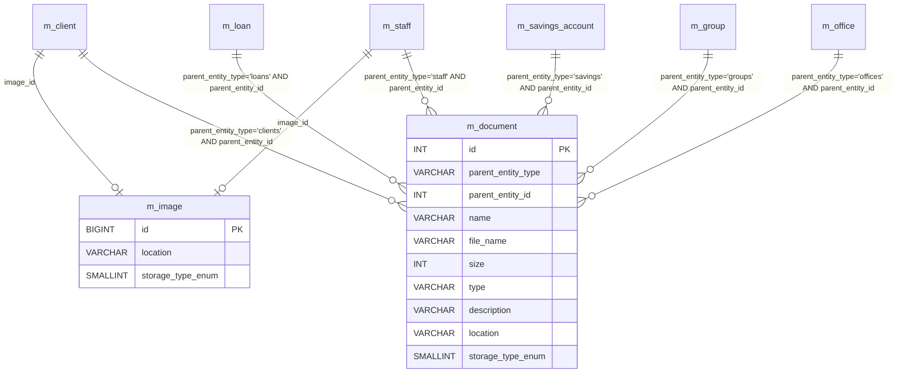

# Documents & Images Data Model

This page documents the **binary-attachment** schema. Fineract supports two
attachment kinds:

1. **Documents** (`m_document`) — arbitrary file uploads with a parent
   entity (client, loan, savings, group, …) selected via the polymorphic
   `parent_entity_type` + `parent_entity_id` pair. Stored in the local
   file system or Amazon S3 (controlled by `storage_type_enum`).
2. **Images** (`m_image`) — image-only attachments referenced directly from
   `m_client.image_id` and `m_staff.image_id`. Same storage backends as
   documents.

Both tables are seeded by
`fineract-provider/.../changelog/tenant/parts/0001_initial_schema.xml`.
The JPA entities live in
`org.apache.fineract.infrastructure.documentmanagement.domain.*` (in
`fineract-core` as part of the document-management-domain group).

## Source map

| Cluster element | JPA entity                                                          | Liquibase changeSet                                       |
| --------------- | ------------------------------------------------------------------- | --------------------------------------------------------- |
| `m_document`    | `documentmanagement.domain.Document`                                | `0001_initial_schema.xml`                                 |
| `m_image`       | `documentmanagement.domain.Image`                                   | `0001_initial_schema.xml`                                 |

The actual storage strategy is selected by the
`StorageType` enum (FILE_SYSTEM = 1, S3 = 2) and the S3 credentials are
looked up via `c_external_service` / `c_external_service_properties`
(`name = 'S3'`).

Subsystem cross-links:
[`core/document-management-domain`](/core/document-management-domain),
[`document/overview`](/document/overview) if your nav has it. The S3
configuration ties back to
[`models/configuration-and-codes`](/models/configuration-and-codes).

## ER diagram

The references from `m_document` into parent entities are logical (no
foreign keys) — `parent_entity_id` is a generic integer whose meaning is
determined by the string `parent_entity_type` ('clients', 'loans',
'savings', 'groups', 'staff', 'offices', etc.).

## `m_document`

| Column               | Type             | Nullable | Role                                                                                                |
| -------------------- | ---------------- | -------- | --------------------------------------------------------------------------------------------------- |
| `id`                 | `INT`            | no       | PK.                                                                                                 |
| `parent_entity_type` | `VARCHAR(50)`    | no       | One of `clients`, `loans`, `savings`, `groups`, `staff`, `offices`, `imports`, `share_account`, `loan_transactions`, `client_identifiers`. The exact list is defined by `DocumentManagementEntity`. |
| `parent_entity_id`   | `INT`            | no       | Id of the owning entity (looked up against `m_client`, `m_loan`, etc.).                             |
| `name`               | `VARCHAR(250)`   | no       | Display name supplied by the uploader.                                                              |
| `file_name`          | `VARCHAR(250)`   | no       | Original filename.                                                                                  |
| `size`               | `INT`            | yes      | Size in bytes.                                                                                      |
| `type`               | `VARCHAR(500)`   | yes      | MIME type (e.g. `application/pdf`).                                                                 |
| `description`        | `VARCHAR(1000)`  | yes      | Free-form description.                                                                              |
| `location`           | `VARCHAR(500)`   | no       | Storage location — relative path on the file system or the S3 key (depending on `storage_type_enum`).|
| `storage_type_enum`  | `SMALLINT`       | yes      | `StorageType` (1 = FILE_SYSTEM, 2 = S3).                                                            |

A unique index on `(parent_entity_type, parent_entity_id, name)` is added
by a later part to prevent duplicate filenames per owner.

The local-file-system root is configured via
`infrastructure.system.documentLocation` (defaults to the tenant directory
under `$FINERACT_HOME/documents`). The S3 bucket and credentials come from
`c_external_service_properties` rows with
`external_service_id = (SELECT id FROM c_external_service WHERE name = 'S3')`
(`s3_bucket_name`, `s3_access_key`, `s3_secret_key`).

See [`core/document-management-domain`](/core/document-management-domain).

## `m_image`

A minimal version of the same idea for profile pictures (a single image per
client or staff).

| Column              | Type           | Nullable | Role                                                            |
| ------------------- | -------------- | -------- | --------------------------------------------------------------- |
| `id`                | `BIGINT`       | no       | PK.                                                             |
| `location`          | `VARCHAR(500)` | yes      | Storage location (file-system path or S3 key).                  |
| `storage_type_enum` | `SMALLINT`     | yes      | `StorageType` (1 = FILE_SYSTEM, 2 = S3).                        |

Because there is no `parent_entity_type` column, the back-reference comes
from the owning entity — `m_client.image_id` and `m_staff.image_id` point
into this table. Deleting a client or a staff member sets the image_id back
to NULL and leaves the image row to be reaped by the next housekeeping
cycle.

## Storage strategies

The `storage_type_enum` value selects which `ContentRepository` Spring bean
serves the row. The two built-in implementations are:

### FILE_SYSTEM (`storage_type_enum = 1`)

`FileSystemContentRepository` writes the binary to the path computed by
joining `infrastructure.system.documentLocation` with the tenant identifier
and the value of the `location` column. The platform never deletes the
binary when the `m_document` row is deleted from the API — orphaned files
are cleaned up by an external housekeeping job. Implications:

- On a clustered deployment the `documentLocation` must be a shared mount
  (NFS, EFS, …) visible to all worker nodes; otherwise the binary will be
  served by only one node.
- The `name` column carries the upload's display name; `file_name` carries
  the original filename. Either may contain spaces but the on-disk filename
  is sanitised by the platform.
- Operating-system file-permission rules apply; the JVM owner must have
  write access to `documentLocation`.

### S3 (`storage_type_enum = 2`)

`S3ContentRepository` writes to the bucket identified by
`c_external_service_properties.name = 's3_bucket_name'`. The `location`
column stores the S3 object key (relative to the bucket root). When the
bucket is private, the platform issues short-lived presigned URLs through
`DocumentReadPlatformService.fetchPresignedUrl`. Implications:

- The bucket must exist before the platform writes the first row; the
  platform does **not** auto-provision the bucket.
- The S3 region is read from `c_external_service_properties.name = 's3_region'`
  when present.
- For S3-compatible providers (MinIO, Cloudflare R2), set the `s3_endpoint`
  property to the custom endpoint URL.

## Read / write surface

The REST surface is symmetrical for both tables:

- `GET /documents/{entity_type}/{entity_id}` — list documents.
- `POST /documents/{entity_type}/{entity_id}` — upload a document
  (multipart form, plus `name` and `description` text fields).
- `GET /documents/{entity_type}/{entity_id}/{document_id}/attachment` — stream
  the binary.
- `DELETE /documents/{entity_type}/{entity_id}/{document_id}` — delete the
  metadata row; the binary is left for housekeeping.
- `GET /{entity_type}/{entity_id}/images` — image variants on clients and
  staff.

The list of accepted `entity_type` values is hard-coded in
`DocumentManagementEntity`; adding a new value requires a code change in
`fineract-core` plus appropriate permission rows in `m_permission`.

## Audit columns

Both tables carry the standard Spring auditing pair (`createdby_id`,
`created_date`, `lastmodifiedby_id`, `lastmodified_date`) added by
`0020_add_audit_entries.xml`. They are populated from the
`PlatformSecurityContext`'s authenticated user.

## Cross-cluster references

- `m_client.image_id`, `m_staff.image_id` — see
  [`models/clients-and-groups`](/models/clients-and-groups) and
  [`models/offices-staff-organization`](/models/offices-staff-organization).
- Documents attach to the entities documented in
  [`models/clients-and-groups`](/models/clients-and-groups),
  [`models/loans-and-products`](/models/loans-and-products),
  [`models/savings-and-deposits`](/models/savings-and-deposits),
  [`models/offices-staff-organization`](/models/offices-staff-organization)
  and (for `imports`) the bulk-import system in
  [`core/bulkimport`](/core/bulkimport).
- S3 credentials live in
  [`models/configuration-and-codes`](/models/configuration-and-codes)
  (`c_external_service`, `c_external_service_properties`).
- Audit (added by `0020_add_audit_entries.xml`) references `m_appuser` →
  [`models/users-roles-permissions`](/models/users-roles-permissions).

## Indexing notes

- `m_document` does not carry a unique index on
  `(parent_entity_type, parent_entity_id, name)` by default — duplicates
  are possible. Applications that need uniqueness should add one
  out-of-band.
- `m_image` is queried only by primary key; no secondary index is
  installed.

## Failure modes worth knowing

1. **Missing storage backend.** When `storage_type_enum = 2` (S3) but the
   `c_external_service` rows for S3 are absent or disabled, every upload
   fails with `S3 credentials not configured`. The pre-upload validation
   in `DocumentWritePlatformServiceJpaRepositoryImpl` catches this case
   before any DB write occurs.
2. **Stale `location` after backend swap.** Switching from FILE_SYSTEM to
   S3 does **not** migrate the existing rows. Each row's
   `storage_type_enum` is consulted independently, so a mixed-mode
   deployment is valid but the migration must be coded by an operator
   (typically a Liquibase `update` with a corresponding upload script).
3. **Image without storage type.** Older `m_image` rows may have
   `storage_type_enum = NULL`. The platform falls back to FILE_SYSTEM in
   that case (see `Image.getStorageType()`); modern uploads always populate
   it.
