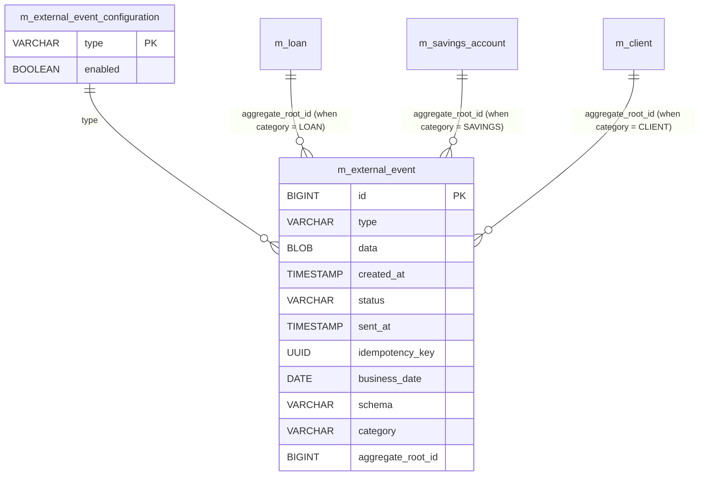
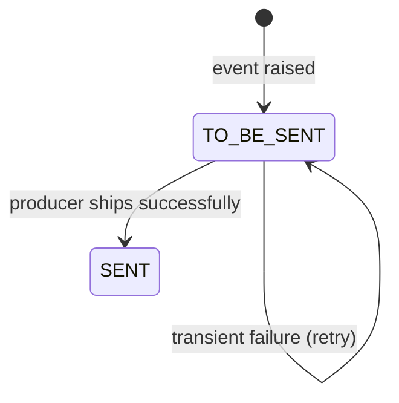

# External Events Data Model

This page documents the **outbound-event** subsystem that Apache Fineract
uses to publish domain events (loan disbursed, savings deposit, journal
entry posted, …) to downstream systems via JMS or Apache Kafka. The
schema is intentionally narrow: every event is recorded once in
`m_external_event` (with a UUID idempotency key) and is read by a producer
thread that flips the row's `status` once it has been shipped. The
`m_external_event_configuration` table is the per-event-type kill switch
the platform consults before recording an event in the first place.

Tables are seeded by
`0043_add_external_event_table.xml` and refined by `0045_*` (binary data
column), `0046_*` (schema column), `0051_*` (category column) and
`0085_*` (aggregate-root id). The JPA entities live in
`org.apache.fineract.infrastructure.event.external.repository.domain` in
`fineract-core`.

## Source map

| Cluster element                | JPA entity                                                          | Liquibase changeSet                                  |
| ------------------------------ | ------------------------------------------------------------------- | ---------------------------------------------------- |
| `m_external_event`             | `event.external.repository.domain.ExternalEvent`                    | `0043_add_external_event_table.xml`; later refined by `0045_*`, `0046_*`, `0051_*`, `0085_*` |
| `m_external_event_configuration` | `event.external.repository.domain.ExternalEventConfiguration`     | `0043_add_external_event_table.xml`                  |
| `m_external_event_view` (view) | `event.external.repository.domain.ExternalEventView`                | created in `0117_set_datetime_precision.xml` / runtime metadata |

Subsystem cross-links:
[`core/event-external`](/core/event-external),
[`events/overview`](/events/overview) if your nav has it, plus the runtime
configuration in [`runtime/spring-boot-configuration`](/runtime/spring-boot-configuration).

## ER diagram



The relations into `m_loan`, `m_savings_account` and `m_client` are
logical — they are not declared with a foreign key because
`aggregate_root_id` is a generic column whose meaning is decided by
`category`.

## `m_external_event`

The append-only event log. The producer scans rows where
`status = 'TO_BE_SENT'`, ships them in business-date batches, then flips
the row to `SENT`. Failures retain the row with `SENT_TIME` NULL so the
next poll loop retries.

| Column              | Type           | Nullable | Role                                                                                       |
| ------------------- | -------------- | -------- | ------------------------------------------------------------------------------------------ |
| `id`                | `BIGINT`       | no       | PK.                                                                                        |
| `type`              | `VARCHAR(100)` | no       | Event type name (e.g. `LoanCreatedBusinessEvent`, `SavingsDepositBusinessEvent`).          |
| `data`              | `BLOB`         | no       | Apache Avro / JSON-serialised payload (binary after `0045_*`).                             |
| `created_at`        | `timestamp`    | no       | When the event was recorded.                                                               |
| `status`            | `VARCHAR(100)` | no       | `ExternalEventStatus` (`TO_BE_SENT`, `SENT`, `FAILED`).                                    |
| `sent_at`           | `timestamp`    | no       | When the producer last shipped (or attempted to ship) this row.                            |
| `idempotency_key`   | `uuid`         | no       | Unique outbound key. Consumers de-duplicate by it.                                         |
| `business_date`     | `date`         | no       | The Fineract business date when the event was raised (= `m_business_date.BUSINESS_DATE`).  |
| `schema`            | `VARCHAR(300)` | no       | Added by `0046_*`. Fully-qualified Avro schema name (`fineract.events.loan.v1.LoanCreated`).|
| `category`          | `VARCHAR(100)` | no       | Added by `0051_*`. Category enum (`LOAN`, `SAVINGS`, `CLIENT`, `ACCOUNTING`, etc.).        |
| `aggregate_root_id` | `BIGINT`       | yes      | Added by `0085_*`. Id of the originating aggregate (`m_loan.id`, `m_savings_account.id`, `m_client.id`). |

Indices created by `0043_*`:

- `m_external_event_status_index` on `status`
- `m_external_event_business_date_index` on `business_date`

`0114_create_cob_indices.xml` (and later parts) add additional indices used
by the polling query.

See `org.apache.fineract.infrastructure.event.external.repository.domain.ExternalEvent`.

### Status lifecycle



The producer is the `ExternalEventService.postEvents` flow — see
[`core/event-external`](/core/event-external).

## `m_external_event_configuration`

One row per event type. When `enabled = false` the runtime skips creating
`m_external_event` rows of that type, making this the cheapest kill switch
available.

| Column   | Type           | Nullable | Role                                                                  |
| -------- | -------------- | -------- | --------------------------------------------------------------------- |
| `type`   | `VARCHAR(100)` | no       | PK. Matches `m_external_event.type` (e.g. `LoanDisbursedBusinessEvent`).|
| `enabled`| `boolean`      | no       | When `true`, the event is recorded; when `false`, it is dropped.      |

The seed data installs one row per `BusinessEvent` subclass found in the
classpath. Subsequent changeSets in `fineract-investor` and
`fineract-loan` add new rows for loan-ownership-transfer events, down-
payment events, etc. — see for example
`fineract-investor/.../parts/0009_add_loan_ownership_transfer_events.xml`
and
`fineract-loan/.../parts/1004_add_external_event_configuration_for_down_payment_transaction_event.xml`.

## `m_external_event_view` (database view)

A read-side view used by the producer query that joins `m_external_event` to
`m_external_event_configuration` and filters by `enabled = true`. It is
created together with the table in
`0117_set_datetime_precision.xml` (re-creation step) and is not represented
by its own JPA entity — the `ExternalEventView` Java class is mapped to it
as an `@Entity` with `@Immutable`.

## How events are recorded

Inside a transactional write service (e.g. loan disbursal), the platform
publishes a `BusinessEvent` instance to the in-process
`BusinessEventNotifierService`. Subscribers include the external-events
producer, `ExternalBusinessEventService`, which:

1. Looks up `m_external_event_configuration` by `type`. If `enabled =
   false`, the call short-circuits and no row is inserted.
2. Resolves the Avro schema for the event type (loaded from the
   `fineract-avro-schemas` jar).
3. Serialises the event payload into a binary blob.
4. Inserts a row in `m_external_event` within the **same transaction** as
   the originating business write. This is the key durability guarantee:
   either both the business state and the event row land, or neither
   does. The combination is atomic at the database level — the producer
   never has to reconcile lost events.

## How events are shipped

A background worker bean (`ExternalEventProducerBean`) polls the table
periodically. The query pattern is:

```sql
SELECT *
FROM   m_external_event_view
WHERE  status = 'TO_BE_SENT'
ORDER  BY id
LIMIT  N
```

`m_external_event_view` is a join of `m_external_event` with
`m_external_event_configuration` filtered on `enabled = true`. Each batch
of N rows is shipped to the configured broker (JMS or Kafka, controlled by
the `fineract.events.external.producer.read-batch-size` and broker
properties), then UPDATEd to `status = 'SENT'` in a second transaction.
Failed ships leave the rows in `TO_BE_SENT` and the next polling cycle
picks them up.

The idempotency contract is on the consumer: every event row has a
deterministic `idempotency_key` (UUID v4 produced when the event is
created). Consumers must de-duplicate by it so re-shipped events do not
cause double-processing.

## Status semantics

| `status`     | Meaning                                                     |
| ------------ | ----------------------------------------------------------- |
| `TO_BE_SENT` | The row has been inserted but not yet shipped.              |
| `SENT`       | The row has been shipped at least once.                     |
| (any other)  | Reserved for downstream customisations.                     |

Note: there is no `FAILED` terminal state — transient send failures keep
the row in `TO_BE_SENT` so the producer retries. Permanent failures (e.g.
broker rejection) are surfaced through logs and metrics; the operator must
either re-enable the broker or manually mark the row to skip it.

## Retention and growth

The `m_external_event` table grows linearly with business activity. The
project ships a scheduled job (`Purge external events`) that deletes
`status = 'SENT'` rows older than a configurable retention horizon. The
horizon is controlled by `c_configuration` (the
`purge-external-events-older-than-days` flag); see
[`models/configuration-and-codes`](/models/configuration-and-codes).

The status / business-date / id indices keep the producer query bounded
even at millions of rows; the purge job's query relies on
`(status, created_at)`.

## Categories and schemas

`m_external_event.category` (added by `0051_*`) bins events into
"functional families":

| Category      | Typical types                                                                     |
| ------------- | --------------------------------------------------------------------------------- |
| `LOAN`        | `LoanCreatedBusinessEvent`, `LoanApprovedBusinessEvent`, `LoanDisbursedBusinessEvent`, repayment / charge-off events |
| `SAVINGS`     | `SavingsCreateBusinessEvent`, `SavingsDepositBusinessEvent`, `SavingsWithdrawalBusinessEvent`, interest-posting events |
| `CLIENT`      | `ClientCreatedBusinessEvent`, `ClientActivatedBusinessEvent`, address / identifier events |
| `ACCOUNTING`  | `JournalEntryBusinessEvent`                                                       |
| `INVESTOR`    | `LoanOwnershipTransferBusinessEvent`                                              |

`schema` carries the Avro fully-qualified class name (e.g.
`fineract.events.loan.v1.LoanCreated`). Consumers use it to pick the
right deserialiser.

## Cross-cluster references

- `m_business_date` (`m_external_event.business_date` mirrors the COB
  business date) →
  [`models/offices-staff-organization`](/models/offices-staff-organization).
- Aggregate roots referenced by `aggregate_root_id`:
  - `m_loan` and `m_loan_transaction` →
    [`models/loans-and-products`](/models/loans-and-products).
  - `m_savings_account`, `m_savings_account_transaction` →
    [`models/savings-and-deposits`](/models/savings-and-deposits).
  - `m_client`, `m_client_transaction` →
    [`models/clients-and-groups`](/models/clients-and-groups).
  - `acc_gl_journal_entry` →
    [`models/accounting-and-gl`](/models/accounting-and-gl).
  - `m_external_asset_owner_transfer` →
    [`models/investor-and-transfers`](/models/investor-and-transfers).
- Audit / configuration:
  - `c_external_service` (the JMS / Kafka broker credentials) →
    [`models/configuration-and-codes`](/models/configuration-and-codes).
  - `c_configuration` (`purge-external-events-older-than-days`) →
    [`models/configuration-and-codes`](/models/configuration-and-codes).
  - `m_appuser` (event author, captured inside the Avro payload) →
    [`models/users-roles-permissions`](/models/users-roles-permissions).
