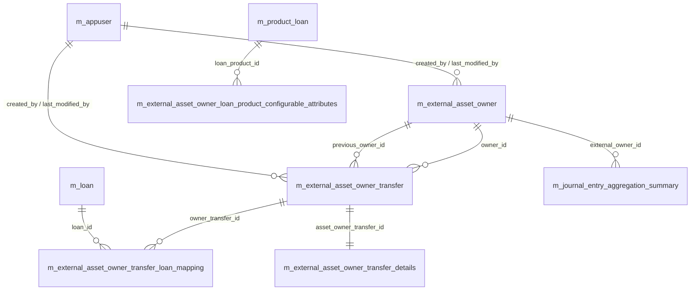
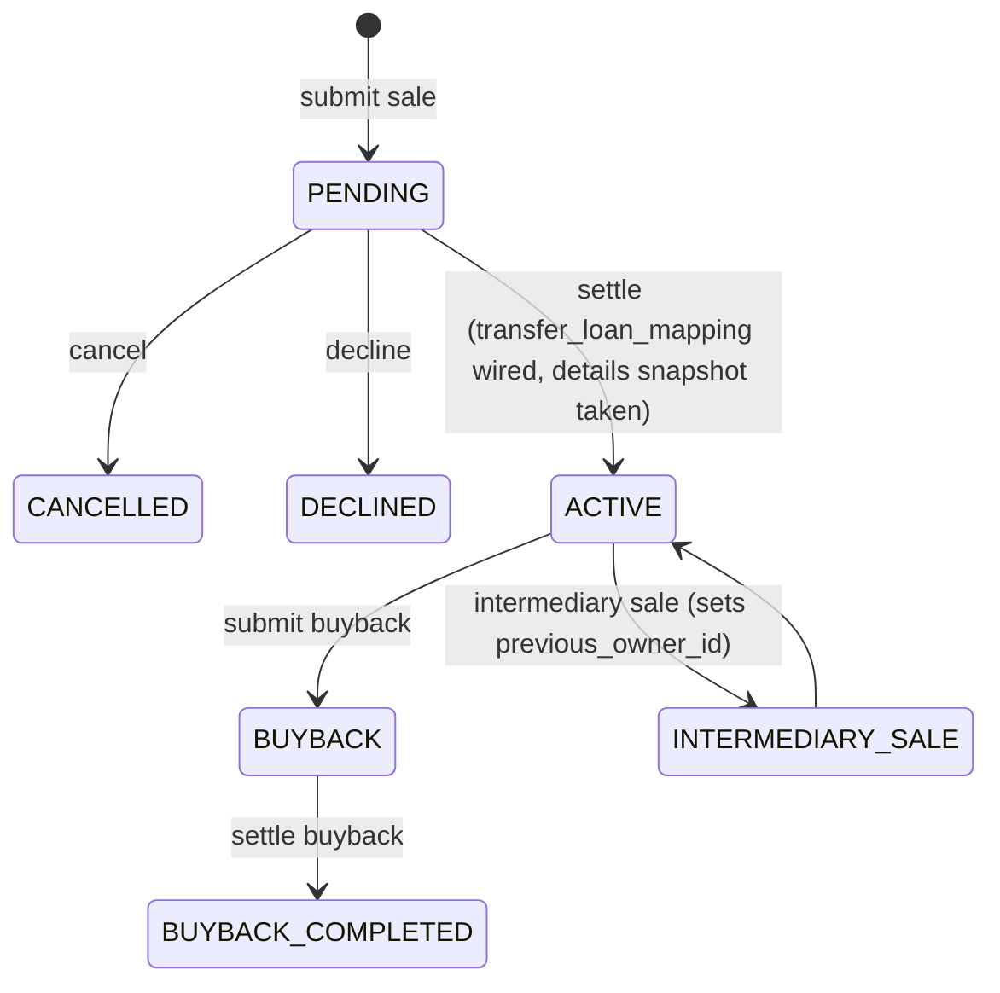

# Investor & Transfers Data Model

This page documents the **loan-sale / asset-owner-transfer** subsystem in
`fineract-investor`. Conceptually: an external investor (a buyer of loan
portfolios) is recorded once in `m_external_asset_owner`. Each instance of
selling — or repurchasing — one or more loans to that investor is an
`m_external_asset_owner_transfer` row, walked through a status / sub-status
state machine, settled on a date, and pinned to the loans through the
`m_external_asset_owner_transfer_loan_mapping` join. Outstanding-balance
snapshots at settlement are frozen in
`m_external_asset_owner_transfer_details`. Per-product behavioural overrides
live in `m_external_asset_owner_loan_product_configurable_attributes`.

All tables are owned by the `fineract-investor` module under
`fineract-investor/src/main/resources/db/changelog/tenant/module/investor/parts/`.
The JPA entities live in
`org.apache.fineract.investor.domain.*` and `org.apache.fineract.investor.config.*`.

## Source map

| Cluster element                                                  | JPA entity                                                          | Liquibase changeSet                                  |
| ---------------------------------------------------------------- | ------------------------------------------------------------------- | ---------------------------------------------------- |
| `m_external_asset_owner`                                         | `investor.domain.ExternalAssetOwner`                                | `0002_asset_schemas.xml`                             |
| `m_external_asset_owner_transfer`                                | `investor.domain.ExternalAssetOwnerTransfer`                        | `0002_asset_schemas.xml`; extended by `0006_*`, `0010_*`, `0016_*`, `0018_*`, `0019_*`, `0020_*` |
| `m_external_asset_owner_transfer_loan_mapping`                   | `investor.domain.ExternalAssetOwnerTransferLoanMapping`             | `0002_asset_schemas.xml`                             |
| `m_external_asset_owner_transfer_details`                        | `investor.domain.ExternalAssetOwnerTransferDetails`                 | `0007_add_external_asset_owner_transfer_details.xml` |
| `m_external_asset_owner_loan_product_configurable_attributes`    | `investor.config.ExternalAssetOwnerLoanProductAttributes`           | `0014_add_external_asset_owner_loan_product_configurable_attributes.xml` |
| `m_journal_entry_aggregation_summary` (external_owner_id column) | (consumed by accrual aggregation)                                   | extended by `0021_external_owner_reference_in_journal_entry_aggregation.xml` |

Subsystem cross-links:
[`investor/overview`](/investor/overview) and the sale/buyback flows under
the `investor` group. The journal-entry aggregation referenced from
`0021_*` is documented on
[`accounting/journal-entry-aggregation`](/accounting/journal-entry-aggregation).

## ER diagram

## `m_external_asset_owner`

An investor / external buyer. Per-tenant unique by `external_id`.

| Column                | Type                       | Nullable | Role                                          |
| --------------------- | -------------------------- | -------- | --------------------------------------------- |
| `id`                  | `BIGINT`                   | no       | PK.                                           |
| `external_id`         | `VARCHAR(100)`             | no       | Unique business identifier (FK target).       |
| `created_by`          | `BIGINT`                   | yes      | FK → `m_appuser.id`.                          |
| `created_on_utc`      | `TIMESTAMP WITH TIME ZONE` | yes      | UTC creation timestamp.                       |
| `last_modified_by`    | `BIGINT`                   | yes      | FK → `m_appuser.id`.                          |
| `last_modified_on_utc`| `TIMESTAMP WITH TIME ZONE` | yes      | UTC last-modified timestamp.                  |

(On MariaDB / MySQL the timestamp columns are plain `DATETIME`. Both
dialects are emitted by separate changeSets in `0002_asset_schemas.xml`.)

See [`investor/overview`](/investor/overview).

## `m_external_asset_owner_transfer`

The unit-of-sale. One row is created when a sale request is submitted; the
same row's `status` flips through the lifecycle.

| Column                            | Type             | Nullable | Role                                                                                                |
| --------------------------------- | ---------------- | -------- | --------------------------------------------------------------------------------------------------- |
| `id`                              | `BIGINT`         | no       | PK.                                                                                                 |
| `owner_id`                        | `BIGINT`         | yes      | FK → `m_external_asset_owner.id` (the new owner).                                                   |
| `external_id`                     | `VARCHAR(100)`   | yes      | Unique business reference for this transfer.                                                        |
| `status`                          | `VARCHAR(50)`    | yes      | `ExternalTransferStatus` (`PENDING`, `ACTIVE`, `BUYBACK`, `CANCELLED`, `DECLINED`, `BUYBACK_COMPLETED`, `INTERMEDIARY_SALE`). |
| `sub_status`                      | `VARCHAR(50)`    | yes      | Added by `0006_asset_schemas.xml`. Extra detail within `status` (e.g. samples of cancellation reason). |
| `purchase_price_ratio`            | `NUMERIC(19,6)`  | yes      | Ratio of paid-by-investor over book-value (changed to `VARCHAR` by `0004_*`).                       |
| `settlement_date`                 | `DATE`           | yes      | Effective transfer of ownership date.                                                               |
| `effective_date_from`             | `DATE`           | yes      | Lower bound of ownership window.                                                                    |
| `effective_date_to`               | `DATE`           | yes      | Upper bound of ownership window (NULL while ownership is live).                                     |
| `external_group_id`               | `VARCHAR(100)`   | yes      | Added by `0016_add_external_reference_id.xml`. Groups multiple transfers into a single sale batch.  |
| `previous_owner_id`               | `BIGINT`         | yes      | Added by `0020_add_previous_owner_reference.xml`. FK → `m_external_asset_owner.id`. Set for buy-back and intermediary sales. |
| `outstanding_interest_strategy`   | `VARCHAR(50)`    | yes      | Added by `0018_*`. How outstanding interest is settled at handover.                                 |
| `created_by` / `created_on_utc` / `last_modified_by` / `last_modified_on_utc` | mixed | mixed | Audit (PostgreSQL uses `TIMESTAMP WITH TIME ZONE`; MariaDB / MySQL use `DATETIME`).                |

Indices added in `0002_asset_schemas.xml`, `0012_*`, `0013_*` cover
`external_id`, `status`, `settlement_date`, `effective_date_from`,
`effective_date_to`, `sub_status` (from `0006_*`).

Status transitions are constrained by `0010_external_transafer_status_external_transfer_id_constraints.xml`
(sic — typo preserved).

See `org.apache.fineract.investor.domain.ExternalAssetOwnerTransfer`.

## `m_external_asset_owner_transfer_loan_mapping`

The (loan, transfer) join. A loan may participate in many transfers over its
lifetime; only one transfer at a time is "active" for a given loan.

| Column                | Type      | Nullable | Role                                                |
| --------------------- | --------- | -------- | --------------------------------------------------- |
| `id`                  | `BIGINT`  | no       | PK.                                                 |
| `loan_id`             | `BIGINT`  | no       | FK → `m_loan.id`.                                   |
| `owner_transfer_id`   | `BIGINT`  | yes      | FK → `m_external_asset_owner_transfer.id`.          |
| `created_by` / `created_on_utc` / `last_modified_by` / `last_modified_on_utc` | mixed | mixed | Audit.                                             |

`0008_add_mappings.xml` and `0017_*` add additional indices.

## `m_external_asset_owner_transfer_details`

Outstanding-balance snapshot taken at transfer settlement. Used to compute
the deferred-payoff schedule for buy-back transfers and the journal-entry
aggregation by external owner.

| Column                              | Type            | Nullable | Role                                                |
| ----------------------------------- | --------------- | -------- | --------------------------------------------------- |
| `id`                                | `BIGINT`        | no       | PK.                                                 |
| `asset_owner_transfer_id`           | `BIGINT`        | no       | Unique FK → `m_external_asset_owner_transfer.id`.   |
| `total_outstanding_derived`         | `DECIMAL(19,6)` | no       | Sum of principal + interest + fees + penalties.     |
| `principal_outstanding_derived`     | `DECIMAL(19,6)` | no       | Principal outstanding at settlement.                |
| `interest_outstanding_derived`      | `DECIMAL(19,6)` | no       | Interest outstanding.                               |
| `fee_charges_outstanding_derived`   | `DECIMAL(19,6)` | no       | Fees outstanding.                                   |
| `penalty_charges_outstanding_derived`| `DECIMAL(19,6)`| no       | Penalties outstanding.                              |
| `total_overpaid_derived`            | `DECIMAL(19,6)` | no       | Overpayment balance (rare but possible).            |
| `created_by` / `created_on_utc` / `last_modified_by` / `last_modified_on_utc` | mixed | mixed | Audit.                                             |

See `org.apache.fineract.investor.domain.ExternalAssetOwnerTransferDetails`.

## `m_external_asset_owner_loan_product_configurable_attributes`

Key/value override table. Each row pins a specific attribute on a specific
loan product so that loans sold to external owners behave differently from
the same product's regular loans. Added by `0014_*`; `0017_*` adds the
covering index on `loan_product_id, attribute_key`.

| Column                | Type           | Nullable | Role                                                            |
| --------------------- | -------------- | -------- | --------------------------------------------------------------- |
| `id`                  | `BIGINT`       | no       | PK.                                                             |
| `loan_product_id`     | `BIGINT`       | no       | FK → `m_product_loan.id`.                                       |
| `attribute_key`       | `VARCHAR(255)` | no       | Attribute name (e.g. `ALLOWED_LOAN_STATUSES`).                  |
| `attribute_value`     | `VARCHAR(255)` | no       | Attribute value (e.g. `ACTIVE,CLOSED_OBLIGATIONS_MET`).         |
| `created_by` / `created_on_utc` / `last_modified_by` / `last_modified_on_utc` | mixed | mixed | Audit.                                                       |

`0019_add_configurable_allowed_loan_statuses.xml` adds a seeded row enabling
the `ALLOWED_LOAN_STATUSES` attribute.

## Status / sub-status state machine

The intermediary-sale transition (`0015_add_intermediary_sale_command.xml`)
and the sale-and-buyback transition (`0005_add_sale_and_buyback_command.xml`)
were added separately and have their own permissions in `m_permission`
(`0022_add_external_asser_owner_create_permission.xml` adds the `CREATE`
permission).

## Settlement-day mechanics

When the COB job runs and a transfer is due, the settlement process is:

1. Promote `status` from `PENDING` to `ACTIVE`.
2. For each loan in the sale batch, insert / update a row in
   `m_external_asset_owner_transfer_loan_mapping` linking the loan to the
   transfer.
3. Compute the outstanding-balance snapshot from `m_loan` derived columns
   and store it in `m_external_asset_owner_transfer_details`.
4. Emit a `LoanOwnershipTransferBusinessEvent` external event (see
   [`models/external-events`](/models/external-events)) carrying the
   transfer id, the loan id, the purchase-price ratio and the snapshot.
5. From this point on, every subsequent loan accrual / repayment is
   reflected in `m_journal_entry_aggregation_summary` with
   `external_owner_id = m_external_asset_owner.id`, so the buyer's
   share of income and balances can be reported separately.

Buy-back follows the inverse path: a new `m_external_asset_owner_transfer`
row is created with `status = 'BUYBACK'` and (after the buyback's own
settlement date passes) the original transfer row is moved to
`BUYBACK_COMPLETED`. The `previous_owner_id` column added by `0020_*` lets
the schema represent intermediary sales between two external owners
without going through the originator.

## Allowed loan statuses

`0019_add_configurable_allowed_loan_statuses.xml` seeds an
`m_external_asset_owner_loan_product_configurable_attributes` row whose
`attribute_key = 'ALLOWED_LOAN_STATUSES'` and whose `attribute_value` is a
CSV of `LoanStatus` values that may participate in a sale. The default
(seeded) set excludes `SUBMITTED_AND_PENDING_APPROVAL` (loans that have not
been disbursed) and `REJECTED`/`WITHDRAWN`. Operators may extend the list
per product.

A second canonical attribute is `OUTSTANDING_INTEREST_STRATEGY` (added by
`0018_*` on the `transfer` row, with a column rather than a key/value
entry) — it picks between `PAY_FROM_BUYER` and `KEEP_AS_DEFERRED` for the
treatment of un-accrued interest at handover.

## Permissions

`0022_add_external_asser_owner_create_permission.xml` (sic) and earlier
parts seed the permission set used by the API. Notable codes:

- `CREATE_EXTERNALASSETOWNER` — register a new external owner.
- `SALEOFLOANBYOWNER_EXTERNALASSETOWNER` — submit a sale.
- `BUYBACKOFLOANBYOWNER_EXTERNALASSETOWNER` — submit a buyback.
- `INTERMEDIARYSALE_EXTERNALASSETOWNER` — submit an intermediary sale.
- `CANCEL_LOANTRANSFER` — cancel a pending transfer.

The corresponding REST surface lives under
`/external-asset-owners/transfers` and `/external-asset-owners` in
`fineract-investor`.

## Indices

`0002_asset_schemas.xml` installs:

- `external_asset_owner_transfer_external_id` on `external_id`.
- `external_asset_owner_transfer_status` on `status`.
- `external_asset_owner_transfer_settlement_date` on `settlement_date`.
- `external_asset_owner_transfer_effective_date_from` on `effective_date_from`.
- `external_asset_owner_transfer_effective_date_to` on `effective_date_to`.

`0006_*` adds `external_asset_owner_transfer_sub_status`. `0012_*` and
`0013_*` add composite indices used by the COB-time settlement query and by
the buyer-side reporting queries. `0017_*` covers
`(loan_product_id, attribute_key)` on the attributes table.

## Cross-cluster references

- `m_loan` (referenced from `*_transfer_loan_mapping`) →
  [`models/loans-and-products`](/models/loans-and-products).
- `m_product_loan` (referenced from
  `*_loan_product_configurable_attributes`) →
  [`models/loans-and-products`](/models/loans-and-products).
- `m_appuser` (`created_by`, `last_modified_by` on every table) →
  [`models/users-roles-permissions`](/models/users-roles-permissions).
- `m_journal_entry_aggregation_summary.external_owner_id` (added by
  `0021_*`) — the accrual aggregation pipeline keys its summary rows on
  the new owner so that buyer-period postings are reportable. See
  [`accounting/journal-entry-aggregation`](/accounting/journal-entry-aggregation)
  and [`models/accounting-and-gl`](/models/accounting-and-gl).
- The external-event types installed by
  `0009_add_loan_ownership_transfer_events.xml`
  (`LoanOwnershipTransferBusinessEvent` and friends) are recorded by
  [`models/external-events`](/models/external-events).
- The COB engine that triggers settlement runs on
  [`models/jobs-and-batch`](/models/jobs-and-batch) Spring Batch
  infrastructure.
