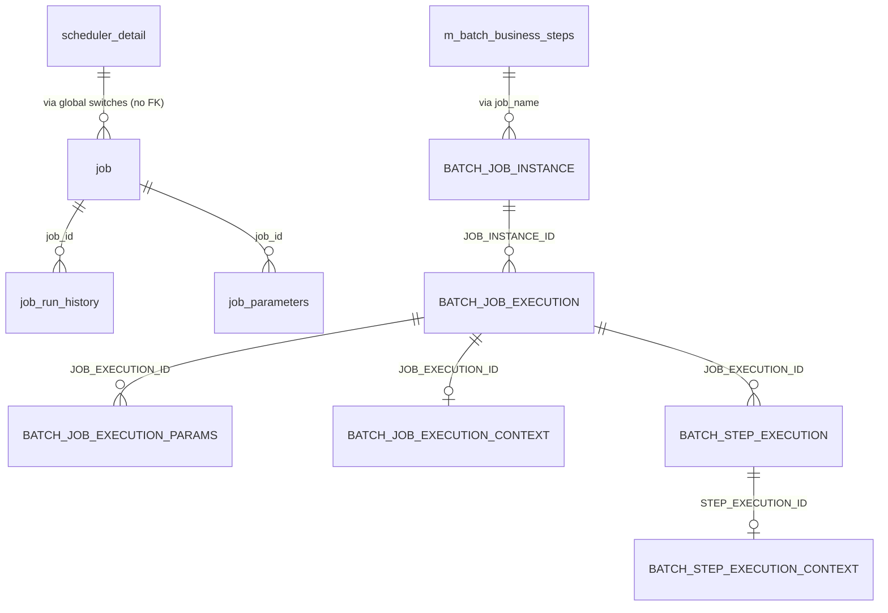

# Jobs & Batch Data Model

This page describes the physical tables that drive Apache Fineract's two
scheduling stacks:

1. The legacy **Quartz-backed scheduler** (`job`, `job_run_history`,
   `scheduler_detail`, `job_parameters`) — used for nightly portfolio jobs
   such as `Apply Holidays To Loans`, `Update Loan Arrears Ageing`,
   `Add Accrual Transactions`, `Generate Mandatory Savings Schedule`, etc.
2. The **Spring Batch** runtime (`BATCH_JOB_INSTANCE`,
   `BATCH_JOB_EXECUTION`, `BATCH_JOB_EXECUTION_PARAMS`,
   `BATCH_JOB_EXECUTION_CONTEXT`, `BATCH_STEP_EXECUTION`,
   `BATCH_STEP_EXECUTION_CONTEXT`) — used for the Close-of-Business (COB)
   chain and other long-running step-oriented jobs.

The companion configuration `m_batch_business_steps` selects which
business-step beans are wired into a given Spring Batch job.

The legacy tables come from
`0001_initial_schema.xml`; Spring Batch DDL is in
`0021_add_spring_batch_db_structure.xml` (raw SQL per dialect); the business
step table is added by `0022_add_batch_business_step_configuration_table.xml`.
Later parts (`0091_modify_parameter_value_type_in_job_parameters_table.xml`,
`0103_modify_parameter_json_column_custom_job_parameters.xml`,
`0114_create_cob_indices.xml`) widen the parameter type and add COB
indices.

## Source map

| Cluster element                  | JPA entity / use                                                          | Liquibase changeSet                                  |
| -------------------------------- | ------------------------------------------------------------------------- | ---------------------------------------------------- |
| `job`                            | `infrastructure.jobs.domain.ScheduledJobDetail`                           | `0001_initial_schema.xml`                            |
| `job_run_history`                | `infrastructure.jobs.domain.ScheduledJobRunHistory`                       | `0001_initial_schema.xml`                            |
| `job_parameters`                 | `infrastructure.jobs.domain.JobParameter`                                 | `0001_initial_schema.xml`; type widened by `0091_*`, JSON by `0103_*` |
| `scheduler_detail`               | `infrastructure.jobs.domain.SchedulerDetail`                              | `0001_initial_schema.xml`                            |
| `m_batch_business_steps`         | `cob.domain.BusinessStep`                                                 | `0022_add_batch_business_step_configuration_table.xml`|
| `BATCH_JOB_INSTANCE`             | Spring Batch — `JobInstance`                                              | `0021_add_spring_batch_db_structure.xml`             |
| `BATCH_JOB_EXECUTION`            | Spring Batch — `JobExecution`                                             | `0021_add_spring_batch_db_structure.xml`             |
| `BATCH_JOB_EXECUTION_PARAMS`     | Spring Batch — `JobParameters`                                            | `0021_add_spring_batch_db_structure.xml`             |
| `BATCH_JOB_EXECUTION_CONTEXT`    | Spring Batch — `ExecutionContext` (job-scope)                             | `0021_add_spring_batch_db_structure.xml`             |
| `BATCH_STEP_EXECUTION`           | Spring Batch — `StepExecution`                                            | `0021_add_spring_batch_db_structure.xml`             |
| `BATCH_STEP_EXECUTION_CONTEXT`   | Spring Batch — `ExecutionContext` (step-scope)                            | `0021_add_spring_batch_db_structure.xml`             |
| `BATCH_JOB_SEQ` / `BATCH_JOB_EXECUTION_SEQ` / `BATCH_STEP_EXECUTION_SEQ`  | Spring Batch sequences (dialect-specific) | `0021_add_spring_batch_db_structure.xml`             |

Subsystem cross-links:
[`core/jobs-domain`](/core/jobs-domain),
[`core/spring-batch-infra`](/core/spring-batch-infra),
[`jobs/overview`](/jobs/overview),
[`cob/overview`](/cob/overview) and
[`loan/loan-jobs`](/loan/loan-jobs).

## ER diagram

## `job`

| Column                  | Type           | Nullable | Role                                                                                                |
| ----------------------- | -------------- | -------- | --------------------------------------------------------------------------------------------------- |
| `id`                    | `BIGINT`       | no       | PK.                                                                                                 |
| `name`                  | `VARCHAR(100)` | no       | Job name (matches the `@CronTarget(jobName=...)` annotation).                                       |
| `display_name`          | `VARCHAR(100)` | no       | UI label.                                                                                           |
| `cron_expression`       | `VARCHAR(20)`  | no       | Quartz cron expression.                                                                             |
| `create_time`           | `datetime`     | no       | Row creation timestamp.                                                                             |
| `task_priority`         | `SMALLINT`     | no       | Priority; default 5.                                                                                |
| `group_name`            | `VARCHAR(50)`  | yes      | Quartz job-group.                                                                                   |
| `previous_run_start_time`| `datetime`    | yes      | Start of the most recent run.                                                                       |
| `next_run_time`         | `datetime`     | yes      | Next fire time as computed by Quartz.                                                               |
| `job_key`               | `VARCHAR(500)` | yes      | Internal Quartz job key.                                                                            |
| `initializing_errorlog` | `TEXT`         | yes      | Error captured during scheduler bootstrap.                                                          |
| `is_active`             | `boolean`      | no       | Master enable/disable.                                                                              |
| `currently_running`     | `boolean`      | no       | Distributed lock — `true` while a node is actively executing this job.                              |
| `updates_allowed`       | `boolean`      | no       | When `false` the API rejects mutations.                                                             |
| `scheduler_group`       | `SMALLINT`     | no       | Group used for staggered execution.                                                                 |
| `is_misfired`           | `boolean`      | no       | Set when Quartz reports a missed fire.                                                              |
| `node_id`               | `INT`          | yes      | Node currently running this job (when `currently_running = true`).                                  |
| `is_mismatched_job`     | `boolean`      | yes      | Set when the configured cron differs from the trigger.                                              |

See [`core/jobs-domain`](/core/jobs-domain) and
[`jobs/overview`](/jobs/overview).

## `job_run_history`

| Column         | Type           | Nullable | Role                                                            |
| -------------- | -------------- | -------- | --------------------------------------------------------------- |
| `id`           | `BIGINT`       | no       | PK.                                                             |
| `job_id`       | `BIGINT`       | no       | FK → `job.id`.                                                  |
| `version`      | `BIGINT`       | no       | Monotonic run number per job.                                   |
| `start_time`   | `datetime`     | no       | Run start.                                                      |
| `end_time`     | `datetime`     | no       | Run end.                                                        |
| `status`       | `VARCHAR(10)`  | no       | `SUCCESS` or `FAILED`.                                          |
| `error_message`| `TEXT`         | yes      | Top-level exception message.                                    |
| `trigger_type` | `VARCHAR(25)`  | no       | `cron` or `application` (manual API trigger).                   |
| `error_log`    | `TEXT`         | yes      | Truncated stack trace.                                          |

## `job_parameters`

Per-job parameter list consumed by the legacy job runner. Originally
`parameter_value` was `INT`; `0091_*` widened it to `VARCHAR`. `0103_*`
moved customised job parameters into a JSON-shaped column (see the part
file for the exact column name).

| Column           | Type           | Nullable | Role                                                |
| ---------------- | -------------- | -------- | --------------------------------------------------- |
| `id`             | `BIGINT`       | no       | PK.                                                 |
| `job_id`         | `BIGINT`       | no       | FK → `job.id`.                                      |
| `parameter_name` | `VARCHAR(100)` | no       | Parameter key.                                      |
| `parameter_value`| `INT` → widened| no       | Parameter value (later VARCHAR / JSON).             |

## `scheduler_detail`

Single-row table that holds tenant-wide scheduler switches.

| Column                     | Type      | Nullable | Role                                                                |
| -------------------------- | --------- | -------- | ------------------------------------------------------------------- |
| `id`                       | `SMALLINT`| no       | PK.                                                                 |
| `is_suspended`             | `boolean` | no       | Master pause switch.                                                |
| `execute_misfired_jobs`    | `boolean` | no       | Execute a job whose previous fire was missed.                       |
| `reset_scheduler_on_bootup`| `boolean` | no       | When `true`, the scheduler clears Quartz trigger state at startup.  |

## `m_batch_business_steps`

The COB engine and other Spring Batch jobs are assembled at runtime from a
sequence of "business steps". This table picks which business-step beans go
into a given job, and in which order.

| Column     | Type           | Nullable | Role                                                  |
| ---------- | -------------- | -------- | ----------------------------------------------------- |
| `id`       | `BIGINT`       | no       | PK.                                                   |
| `job_name` | `VARCHAR(100)` | no       | Spring Batch job name (e.g. `LOAN_CLOSE_OF_BUSINESS`).|
| `step_name`| `VARCHAR(100)` | no       | Bean name of the business step.                       |
| `step_order`| `SMALLINT`    | no       | Execution order within the job (ascending).           |

See [`cob/overview`](/cob/overview).

## Spring Batch infrastructure

These tables are created in raw SQL (per dialect) by
`0021_add_spring_batch_db_structure.xml`. The schema is the canonical Spring
Batch 5 metadata schema; Fineract does not customise it. The values below
mirror the SQL in the changeSet (PostgreSQL dialect, which is the standard
target).

### `BATCH_JOB_INSTANCE`

| Column           | Type          | Nullable | Role                                            |
| ---------------- | ------------- | -------- | ----------------------------------------------- |
| `JOB_INSTANCE_ID`| `BIGINT`      | no       | PK.                                             |
| `VERSION`        | `BIGINT`      | yes      | Optimistic lock.                                |
| `JOB_NAME`       | `VARCHAR(100)`| no       | Job bean name.                                  |
| `JOB_KEY`        | `VARCHAR(32)` | no       | Hash of (name, identifying params).             |

Unique constraint `JOB_INST_UN (JOB_NAME, JOB_KEY)`.

### `BATCH_JOB_EXECUTION`

| Column                   | Type          | Nullable | Role                                                  |
| ------------------------ | ------------- | -------- | ----------------------------------------------------- |
| `JOB_EXECUTION_ID`       | `BIGINT`      | no       | PK.                                                   |
| `VERSION`                | `BIGINT`      | yes      | Optimistic lock.                                      |
| `JOB_INSTANCE_ID`        | `BIGINT`      | no       | FK → `BATCH_JOB_INSTANCE.JOB_INSTANCE_ID`.            |
| `CREATE_TIME`            | `TIMESTAMP`   | no       | Creation timestamp.                                   |
| `START_TIME`             | `TIMESTAMP`   | yes      | Start.                                                |
| `END_TIME`               | `TIMESTAMP`   | yes      | End.                                                  |
| `STATUS`                 | `VARCHAR(10)` | yes      | `STARTED` / `COMPLETED` / `FAILED` / …                |
| `EXIT_CODE`              | `VARCHAR(2500)`| yes     | Exit code.                                            |
| `EXIT_MESSAGE`           | `VARCHAR(2500)`| yes     | Exit message.                                         |
| `LAST_UPDATED`           | `TIMESTAMP`   | yes      | Last-touched timestamp.                               |
| `JOB_CONFIGURATION_LOCATION` | `VARCHAR(2500)` | yes  | XML config location (legacy).                         |

### `BATCH_JOB_EXECUTION_PARAMS`

| Column             | Type          | Nullable | Role                                                  |
| ------------------ | ------------- | -------- | ----------------------------------------------------- |
| `JOB_EXECUTION_ID` | `BIGINT`      | no       | FK → `BATCH_JOB_EXECUTION.JOB_EXECUTION_ID`.          |
| `TYPE_CD`          | `VARCHAR(6)`  | no       | `STRING` / `LONG` / `DOUBLE` / `DATE`.                |
| `KEY_NAME`         | `VARCHAR(100)`| no       | Param name.                                           |
| `STRING_VAL`       | `VARCHAR(250)`| yes      | String value.                                         |
| `DATE_VAL`         | `TIMESTAMP`   | yes      | Date value.                                           |
| `LONG_VAL`         | `BIGINT`      | yes      | Long value.                                           |
| `DOUBLE_VAL`       | `DOUBLE PRECISION`| yes  | Double value.                                         |
| `IDENTIFYING`      | `CHAR(1)`     | no       | `Y` if param participates in JOB_KEY hashing.         |

### `BATCH_JOB_EXECUTION_CONTEXT`

| Column                 | Type           | Nullable | Role                                          |
| ---------------------- | -------------- | -------- | --------------------------------------------- |
| `JOB_EXECUTION_ID`     | `BIGINT`       | no       | PK & FK.                                      |
| `SHORT_CONTEXT`        | `VARCHAR(2500)`| no       | Inline serialised context.                    |
| `SERIALIZED_CONTEXT`   | `TEXT`         | yes      | Overflow context (when >2500 chars).          |

### `BATCH_STEP_EXECUTION`

| Column                      | Type            | Nullable | Role                                                  |
| --------------------------- | --------------- | -------- | ----------------------------------------------------- |
| `STEP_EXECUTION_ID`         | `BIGINT`        | no       | PK.                                                   |
| `VERSION`                   | `BIGINT`        | no       | Optimistic lock.                                      |
| `STEP_NAME`                 | `VARCHAR(100)`  | no       | Step bean name.                                       |
| `JOB_EXECUTION_ID`          | `BIGINT`        | no       | FK → `BATCH_JOB_EXECUTION.JOB_EXECUTION_ID`.          |
| `CREATE_TIME`               | `TIMESTAMP`     | no       | Creation timestamp.                                   |
| `START_TIME`                | `TIMESTAMP`     | yes      | Start.                                                |
| `END_TIME`                  | `TIMESTAMP`     | yes      | End.                                                  |
| `STATUS`                    | `VARCHAR(10)`   | yes      | Status.                                               |
| `COMMIT_COUNT`              | `BIGINT`        | yes      | Number of commits.                                    |
| `READ_COUNT`                | `BIGINT`        | yes      | Items read.                                           |
| `FILTER_COUNT`              | `BIGINT`        | yes      | Items filtered.                                       |
| `WRITE_COUNT`               | `BIGINT`        | yes      | Items written.                                        |
| `READ_SKIP_COUNT`           | `BIGINT`        | yes      | Reader skips.                                         |
| `WRITE_SKIP_COUNT`          | `BIGINT`        | yes      | Writer skips.                                         |
| `PROCESS_SKIP_COUNT`        | `BIGINT`        | yes      | Processor skips.                                      |
| `ROLLBACK_COUNT`            | `BIGINT`        | yes      | Rollbacks.                                            |
| `EXIT_CODE`                 | `VARCHAR(2500)` | yes      | Exit code.                                            |
| `EXIT_MESSAGE`              | `VARCHAR(2500)` | yes      | Exit message.                                         |
| `LAST_UPDATED`              | `TIMESTAMP`     | yes      | Last-touched timestamp.                               |

### `BATCH_STEP_EXECUTION_CONTEXT`

| Column                | Type           | Nullable | Role                                          |
| --------------------- | -------------- | -------- | --------------------------------------------- |
| `STEP_EXECUTION_ID`   | `BIGINT`       | no       | PK & FK.                                      |
| `SHORT_CONTEXT`       | `VARCHAR(2500)`| no       | Inline serialised context.                    |
| `SERIALIZED_CONTEXT`  | `TEXT`         | yes      | Overflow context.                             |

### Sequences

For PostgreSQL the changeSet creates `BATCH_STEP_EXECUTION_SEQ`,
`BATCH_JOB_EXECUTION_SEQ` and `BATCH_JOB_SEQ` (MariaDB / MySQL use AUTO
columns instead). They feed the primary keys of `BATCH_STEP_EXECUTION`,
`BATCH_JOB_EXECUTION` and `BATCH_JOB_INSTANCE` respectively.

The COB job indices are added by `0114_create_cob_indices.xml` (notably
`(JOB_EXECUTION_ID, STEP_NAME, START_TIME)` on `BATCH_STEP_EXECUTION` to
keep step-status queries fast).

## How the legacy scheduler hooks into Quartz

The Quartz wiring runs as follows on application start:

1. `SchedulerJobRunnerConfig` reads every row of `job` and builds a
   Quartz `JobDetail` keyed by `name`.
2. The `cron_expression` column drives a `CronTrigger`; if the row is
   `is_active = false`, the trigger is paused.
3. The `node_id` column is populated when the scheduler claims the job
   for execution; on cluster restart, rows with stale `currently_running
   = true` are reset by the `reset_scheduler_on_bootup` switch in
   `scheduler_detail`.

When a job fires, the runtime:

1. UPDATEs `job.currently_running = true, node_id = <local-node-id>`.
2. Runs the `@CronTarget`-annotated method in a fresh transaction.
3. INSERTs a `job_run_history` row with start time, end time, status
   (`SUCCESS` / `FAILED`), and any captured error.
4. UPDATEs `job.previous_run_start_time` and `job.next_run_time`.
5. UPDATEs `job.currently_running = false, node_id = NULL`.

A `FAILED` status does not stop the next scheduled fire — the operator must
explicitly disable the row if the job is broken.

## How the Spring Batch wiring runs

The COB chain is a Spring Batch job built from the rows of
`m_batch_business_steps` ordered by `step_order`. At runtime:

1. The launcher receives a (`businessDate`) parameter.
2. Spring Batch inserts a `BATCH_JOB_INSTANCE` row.
3. A `BATCH_JOB_EXECUTION` row is INSERTed with `STATUS = 'STARTED'`.
4. `BATCH_JOB_EXECUTION_PARAMS` are written for the (`businessDate`).
5. For each business step, the launcher INSERTs a `BATCH_STEP_EXECUTION`
   row and runs the step's `Tasklet` or `Chunk` body. After the body
   completes (or fails), the step execution row is UPDATEd with
   `STATUS`, `EXIT_CODE`, and counts.
6. After all steps complete, `BATCH_JOB_EXECUTION.STATUS` is set to
   `COMPLETED` (or `FAILED`).

The combination `(JOB_NAME, JOB_KEY)` on `BATCH_JOB_INSTANCE` prevents
running the same logical job twice with the same identifying parameters —
re-running the COB for a date that has already completed requires either
deleting the rows or supplying a new identifying parameter.

## COB business steps

The default seeded business step list (in `m_batch_business_steps`)
includes, among others:

| `step_name`                          | What it does                                                            |
| ------------------------------------ | ----------------------------------------------------------------------- |
| `APPLY_CHARGE_TO_OVERDUE_LOANS`      | Inserts overdue charges into `m_loan_charge`.                           |
| `LOAN_DELINQUENCY_CLASSIFICATION`    | Recomputes the delinquency bucket per loan, updates `m_loan_delinquency_tag_history`. |
| `CHECK_LOAN_REPAYMENT_REMINDER`      | Emits notifications for upcoming installments.                          |
| `CHECK_LOAN_REPAYMENT_OVERDUE`       | Emits overdue notifications.                                            |
| `UPDATE_LOAN_ARREARS_AGEING`         | Refreshes `m_loan_arrears_aging` per loan.                              |
| `ADD_PERIODIC_ACCRUAL_ENTRIES`       | Adds accrual transactions for the day.                                  |
| `INCREASE_BUSINESS_DATE_BY_1_DAY`    | Advances `m_business_date.BUSINESS_DATE` by one day.                    |
| `INCREASE_COB_DATE_BY_1_DAY`         | Advances `m_business_date.COB_DATE` by one day.                         |

The order matters — `INCREASE_BUSINESS_DATE_BY_1_DAY` must be last so that
all loan / savings recomputations consume the prior business date.

## Notes on the misfire policy

The `is_misfired` flag on `job` records the case where Quartz reports a
missed fire (job's scheduled time has passed but it was not executed). The
default behaviour, controlled by `scheduler_detail.execute_misfired_jobs`:

- When `true`, the scheduler re-fires the misfired trigger at the next
  available slot.
- When `false`, the misfire is logged and skipped; the next fire follows
  the cron expression as usual.

Operators investigating "job did not run on day X" issues should first
consult `job_run_history` for the corresponding `job_id`; the absence of a
row means the job did not start.

## Cross-cluster references

- The legacy `job` table is consulted by the COB-write services and reads
  the global on/off switches from
  [`models/configuration-and-codes`](/models/configuration-and-codes)
  (`c_configuration` and `scheduler_detail`).
- The Spring Batch tables are consumed by services in `fineract-cob` —
  see [`cob/overview`](/cob/overview). The business steps invoked by COB
  apply changes to `m_loan_arrears_aging`, `m_loan_delinquency_tag_history`,
  `m_business_date`, `m_loan` →
  [`models/loans-and-products`](/models/loans-and-products) and
  [`models/offices-staff-organization`](/models/offices-staff-organization).
- Audit columns reference `m_appuser` →
  [`models/users-roles-permissions`](/models/users-roles-permissions).
