# Loans & Products Data Model

This page is the physical reference for the **lending** side of Apache
Fineract. It documents every table that holds loan state — the loan account
itself, its multi-tranche disbursement detail, its repayment schedule and
schedule history, its transactions and charges, its collateral, its arrears
aging snapshot and the products that templated it.

Most tables come from
`fineract-provider/src/main/resources/db/changelog/tenant/parts/0001_initial_schema.xml`.
Subsequent changeSets in the same `parts/` directory (notably
`0019_refactor_loan_transaction.xml`, `0029_add_delinquency_buckets.xml`,
`0044_loan_account_external_id_unique.xml`,
`0117_set_datetime_precision.xml`, plus the modules under
`fineract-loan/src/main/resources/db/changelog/tenant/module/loan/parts/`
and `fineract-progressive-loan/...`) refine the columns referenced below.
The JPA entities live in `org.apache.fineract.portfolio.loanaccount.domain.*`
(provider) and `org.apache.fineract.portfolio.loanproduct.domain.*`.

## Source map

| Cluster element                       | JPA entity                                                       | Liquibase changeSet                                       |
| ------------------------------------- | ---------------------------------------------------------------- | --------------------------------------------------------- |
| `m_loan`                              | `loanaccount.domain.Loan`                                        | `0001_initial_schema.xml` (id `145`)                      |
| `m_loan_transaction`                  | `loanaccount.domain.LoanTransaction`                             | `0001_initial_schema.xml`                                 |
| `m_loan_transaction_relation`         | `loanaccount.domain.LoanTransactionRelation`                     | `0026_reversals_for_reversed_transactions.xml`            |
| `m_loan_repayment_schedule`           | `loanaccount.domain.LoanRepaymentScheduleInstallment`            | `0001_initial_schema.xml`                                 |
| `m_loan_repayment_schedule_history`   | `loanaccount.domain.LoanRepaymentScheduleHistory`                | `0001_initial_schema.xml`                                 |
| `m_loan_arrears_aging`                | `loanaccount.domain.LoanArrearsAging`                            | `0001_initial_schema.xml`                                 |
| `m_loan_charge`                       | `loanaccount.domain.LoanCharge`                                  | `0001_initial_schema.xml`; audit via part `1001`          |
| `m_loan_installment_charge`           | `loanaccount.domain.LoanInstallmentCharge`                       | `0001_initial_schema.xml`                                 |
| `m_loan_overdue_installment_charge`   | `loanaccount.domain.LoanOverdueInstallmentCharge`                | `0001_initial_schema.xml`                                 |
| `m_loan_charge_paid_by`               | `loanaccount.domain.LoanChargePaidBy`                            | `0001_initial_schema.xml`                                 |
| `m_loan_paid_in_advance`              | `loanaccount.domain.LoanPaidInAdvance`                           | `0001_initial_schema.xml`                                 |
| `m_loan_disbursement_detail`          | `loanaccount.domain.LoanDisbursementDetails`                     | `0001_initial_schema.xml`                                 |
| `m_loan_collateral`                   | `loanaccount.domain.LoanCollateral` (legacy)                     | `0001_initial_schema.xml`                                 |
| `m_loan_collateral_management`        | `collateralmanagement.domain.LoanCollateralManagement`           | `0001_initial_schema.xml`                                 |
| `m_loan_reschedule_request`           | `loanaccount.rescheduleloan.domain.LoanRescheduleRequest`        | `0001_initial_schema.xml`                                 |
| `m_loan_reschedule_request_term_variations_mapping` | `LoanRescheduleRequestToTermVariationMapping`      | parts `0080_loan_reschedule_term_variations.xml`          |
| `m_loan_recalculation_details`        | `loanaccount.domain.LoanInterestRecalculationDetails`            | `0001_initial_schema.xml`                                 |
| `m_loan_term_variations`              | `loanaccount.domain.LoanTermVariations`                          | `0001_initial_schema.xml`                                 |
| `m_loan_tranche_disbursement_charge`  | `loanaccount.domain.LoanTrancheDisbursementCharge`               | `0001_initial_schema.xml`                                 |
| `m_loan_topup`                        | `loanaccount.domain.LoanTopupDetails`                            | `0001_initial_schema.xml`                                 |
| `m_product_loan`                      | `loanproduct.domain.LoanProduct`                                 | `0001_initial_schema.xml`                                 |
| `m_product_loan_charge`               | join `LoanProduct.charges`                                       | `0001_initial_schema.xml`                                 |
| `m_product_loan_configurable_attributes` | `loanproduct.domain.LoanProductConfigurableAttributes`        | `0001_initial_schema.xml`                                 |
| `m_product_loan_recalculation_details`| `loanproduct.domain.LoanProductInterestRecalculationDetails`     | `0001_initial_schema.xml`                                 |
| `m_product_loan_floating_rates`       | `loanproduct.domain.LoanProductFloatingRates`                    | `0001_initial_schema.xml`                                 |
| `m_product_loan_variable_installment_config` | `loanproduct.domain.LoanProductVariableInstallmentConfig` | `0001_initial_schema.xml`                                 |
| `m_product_loan_variations_borrower_cycle`   | `loanproduct.domain.LoanProductBorrowerCycleVariations`   | `0001_initial_schema.xml`                                 |
| `m_delinquency_bucket`/`_mappings`/`_range`  | `delinquency.domain.*`                                    | `0029_add_delinquency_buckets.xml`                        |

Subsystem cross-links: see [`loan/loan-domain-model`](/loan/loan-domain-model),
[`loan/loan-repayment-schedule-domain`](/loan/loan-repayment-schedule-domain),
[`loan/loan-charges`](/loan/loan-charges),
[`loan/loan-transactions`](/loan/loan-transactions),
[`loan/loan-collateral-management`](/loan/loan-collateral-management),
[`loan/loan-arrears-and-reaging`](/loan/loan-arrears-and-reaging),
[`loan/loan-disbursement-api`](/loan/loan-disbursement-api),
[`loan/reschedule-loans`](/loan/reschedule-loans),
[`loan/delinquency`](/loan/delinquency) and
[`loan/loans-api`](/loan/loans-api).

## ER diagram

```mermaid
erDiagram
    m_product_loan ||--o{ m_loan : "product_id"
    m_client ||--o{ m_loan : "client_id"
    m_group ||--o{ m_loan : "group_id"
    m_fund ||--o{ m_loan : "fund_id"
    m_staff ||--o{ m_loan : "loan_officer_id"
    m_loan ||--o{ m_loan_transaction : "loan_id"
    m_loan_transaction ||--o{ m_loan_transaction_relation : "from_loan_transaction_id"
    m_loan ||--o{ m_loan_repayment_schedule : "loan_id"
    m_loan ||--o{ m_loan_repayment_schedule_history : "loan_id"
    m_loan ||--|| m_loan_arrears_aging : "loan_id"
    m_loan ||--|| m_loan_paid_in_advance : "loan_id"
    m_loan ||--o{ m_loan_charge : "loan_id"
    m_charge ||--o{ m_loan_charge : "charge_id"
    m_loan_charge ||--o{ m_loan_installment_charge : "loan_charge_id"
    m_loan_repayment_schedule ||--o{ m_loan_installment_charge : "loan_schedule_id"
    m_loan_charge ||--o{ m_loan_overdue_installment_charge : "loan_charge_id"
    m_loan_transaction ||--o{ m_loan_charge_paid_by : "loan_transaction_id"
    m_loan_charge ||--o{ m_loan_charge_paid_by : "loan_charge_id"
    m_loan ||--o{ m_loan_disbursement_detail : "loan_id"
    m_loan ||--o{ m_loan_collateral : "loan_id"
    m_loan ||--o{ m_loan_collateral_management : "loan_id"
    m_loan ||--o{ m_loan_reschedule_request : "loan_id"
    m_loan ||--o{ m_loan_term_variations : "loan_id"
    m_loan_reschedule_request ||--o{ m_loan_reschedule_request_term_variations_mapping : "loan_reschedule_request_id"
    m_loan_term_variations ||--o{ m_loan_reschedule_request_term_variations_mapping : "loan_term_variations_id"
    m_loan ||--|| m_loan_recalculation_details : "loan_id"
    m_loan_disbursement_detail ||--o{ m_loan_tranche_disbursement_charge : "disbursement_detail_id"
    m_loan_charge ||--o{ m_loan_tranche_disbursement_charge : "loan_charge_id"
    m_product_loan ||--o{ m_product_loan_charge : "product_loan_id"
    m_charge ||--o{ m_product_loan_charge : "charge_id"
    m_product_loan ||--|| m_product_loan_configurable_attributes : "loan_product_id"
    m_product_loan ||--|| m_product_loan_recalculation_details : "product_id"
    m_product_loan ||--o{ m_product_loan_floating_rates : "loan_product_id"
    m_product_loan ||--|| m_product_loan_variable_installment_config : "loan_product_id"
    m_product_loan ||--o{ m_product_loan_variations_borrower_cycle : "loan_product_id"
    m_delinquency_bucket ||--o{ m_product_loan : "delinquency_bucket_id"
    m_delinquency_bucket ||--o{ m_delinquency_bucket_mappings : "delinquency_bucket_id"
    m_delinquency_range ||--o{ m_delinquency_bucket_mappings : "delinquency_range_id"
    m_payment_detail ||--o{ m_loan_transaction : "payment_detail_id"
```

## `m_loan`

The loan account. Holds the lifecycle state, original terms, and a rich set of
"derived" balance columns updated transactionally on every recalculation. The
`Loan` entity (≈ 4000 LoC) wraps all business logic.

| Column                                                | Type             | Nullable | Role                                                                            |
| ----------------------------------------------------- | ---------------- | -------- | ------------------------------------------------------------------------------- |
| `id`                                                  | `BIGINT`         | no       | PK.                                                                             |
| `account_no`                                          | `VARCHAR(20)`    | no       | Unique business identifier.                                                     |
| `external_id`                                         | `VARCHAR(100)`   | yes      | Unique caller id.                                                               |
| `client_id`                                           | `BIGINT`         | yes      | FK → `m_client.id` (set if `loan_type_enum = INDIVIDUAL`).                      |
| `group_id`                                            | `BIGINT`         | yes      | FK → `m_group.id` (set for group / JLG loans).                                  |
| `glim_id`                                             | `BIGINT`         | yes      | FK → `glim_accounts.id` for group-loan-with-individual-monitoring.              |
| `product_id`                                          | `BIGINT`         | yes      | FK → `m_product_loan.id`.                                                       |
| `fund_id`                                             | `BIGINT`         | yes      | FK → `m_fund.id`.                                                               |
| `loan_officer_id`                                     | `BIGINT`         | yes      | FK → `m_staff.id`.                                                              |
| `loanpurpose_cv_id`                                   | `INT`            | yes      | FK → `m_code_value.id`.                                                         |
| `loan_status_id`                                      | `SMALLINT`       | no       | `LoanStatus` (submitted=100, approved=200, active=300, withdrawn=400, …).       |
| `loan_type_enum`                                      | `SMALLINT`       | no       | `AccountType` (INDIVIDUAL=1, GROUP=2, JLG=3, GLIM=4).                           |
| `currency_code` / `currency_digits` / `currency_multiplesof` | mixed     | partial  | Currency triple as in `MonetaryCurrency`.                                       |
| `principal_amount_proposed`                           | `DECIMAL(19,6)`  | no       | What the borrower requested.                                                    |
| `principal_amount`                                    | `DECIMAL(19,6)`  | no       | Current term principal (post-approval).                                         |
| `approved_principal`                                  | `DECIMAL(19,6)`  | no       | Snapshot at approval.                                                           |
| `net_disbursal_amount`                                | `DECIMAL(19,6)`  | no       | Principal minus disbursement-time charges.                                      |
| `arrearstolerance_amount`                             | `DECIMAL(19,6)`  | yes      | Threshold below which a loan is not considered in arrears.                      |
| `is_floating_interest_rate`                           | `boolean`        | yes      | Floating-rate loan.                                                             |
| `interest_rate_differential`                          | `DECIMAL(19,6)`  | yes      | Spread over floating base.                                                      |
| `nominal_interest_rate_per_period`                    | `DECIMAL(19,6)`  | yes      | Nominal rate per interest period.                                               |
| `interest_period_frequency_enum`                      | `SMALLINT`       | yes      | `PeriodFrequencyType`.                                                          |
| `annual_nominal_interest_rate`                        | `DECIMAL(19,6)`  | yes      | Annual nominal.                                                                 |
| `interest_method_enum`                                | `SMALLINT`       | no       | `InterestMethod` (FLAT=0, DECLINING_BALANCE=1).                                 |
| `interest_calculated_in_period_enum`                  | `SMALLINT`       | no       | `InterestCalculationPeriodMethod`.                                              |
| `allow_partial_period_interest_calcualtion`           | `boolean`        | no       | (sic — typo preserved.)                                                         |
| `term_frequency` / `term_period_frequency_enum`       | mixed            | no       | Loan term.                                                                      |
| `repay_every` / `repayment_period_frequency_enum`     | mixed            | no       | Repayment frequency.                                                            |
| `number_of_repayments`                                | `SMALLINT`       | no       | Total installments.                                                             |
| `grace_on_principal_periods`                          | `SMALLINT`       | yes      | Periods skipping principal payment.                                             |
| `recurring_moratorium_principal_periods`              | `SMALLINT`       | yes      | Cyclical principal moratorium.                                                  |
| `grace_on_interest_periods`                           | `SMALLINT`       | yes      | Periods skipping interest payment.                                              |
| `grace_interest_free_periods`                         | `SMALLINT`       | yes      | Periods where no interest accrues.                                              |
| `amortization_method_enum`                            | `SMALLINT`       | no       | `AmortizationMethod` (equal installments / equal principal).                    |
| `submittedon_date` / `submittedon_userid`             | mixed            | yes      | Submitted audit.                                                                |
| `approvedon_date` / `approvedon_userid`               | mixed            | yes      | Approved audit.                                                                 |
| `expected_disbursedon_date`                           | `date`           | yes      | Planned disbursement.                                                           |
| `expected_firstrepaymenton_date`                      | `date`           | yes      | Planned first repayment.                                                        |
| `interest_calculated_from_date`                       | `date`           | yes      | Override of interest start date.                                                |
| `disbursedon_date` / `disbursedon_userid`             | mixed            | yes      | Disbursal audit.                                                                |
| `expected_maturedon_date` / `maturedon_date`          | mixed            | yes      | Maturity dates.                                                                 |
| `closedon_date` / `closedon_userid`                   | mixed            | yes      | Close audit.                                                                    |
| `total_charges_due_at_disbursement_derived`           | `DECIMAL(19,6)`  | yes      | Sum of disbursement-time fees.                                                  |
| `principal_disbursed_derived`                         | `DECIMAL(19,6)`  | no       | Running disbursed total.                                                        |
| `principal_repaid_derived`                            | `DECIMAL(19,6)`  | no       | Running principal repaid.                                                       |
| `principal_writtenoff_derived` / `principal_outstanding_derived` | `DECIMAL(19,6)` | no | Write-off / outstanding principal.                                              |
| `interest_charged_derived` / `interest_repaid_derived` / `interest_waived_derived` / `interest_writtenoff_derived` / `interest_outstanding_derived` | `DECIMAL(19,6)` | no | Interest rollups.                                                            |
| `fee_charges_*_derived` / `penalty_charges_*_derived` | `DECIMAL(19,6)`  | no       | Fee / penalty rollups (charged, repaid, waived, writtenoff, outstanding).       |
| `total_expected_repayment_derived` / `total_repayment_derived` | `DECIMAL(19,6)` | no | Lifetime expected / actual repayment.                                           |
| `total_expected_costofloan_derived` / `total_costofloan_derived` | `DECIMAL(19,6)` | no | Cost-of-loan rollups.                                                        |
| `total_waived_derived` / `total_writtenoff_derived` / `total_outstanding_derived` | `DECIMAL(19,6)` | no | Top-level rollups.                                                      |
| `total_overpaid_derived`                              | `DECIMAL(19,6)`  | yes      | Amount paid in excess after close.                                              |
| `rejectedon_*`, `rescheduledon_*`, `withdrawnon_*`, `writtenoffon_date` | mixed | yes | Lifecycle audit fields.                                                         |
| `loan_transaction_strategy_id`                        | `BIGINT`         | yes      | FK → `ref_loan_transaction_processing_strategy.id`.                             |
| `sync_disbursement_with_meeting`                      | `boolean`        | yes      | Tie disbursal date to calendar meeting.                                         |
| `loan_counter` / `loan_product_counter`               | `SMALLINT`       | yes      | Cycle counters for borrower-cycle products.                                     |
| `fixed_emi_amount`                                    | `DECIMAL(19,6)`  | yes      | Fixed installment amount override.                                              |
| `max_outstanding_loan_balance`                        | `DECIMAL(19,6)`  | yes      | Multi-disbursal cap.                                                            |
| `grace_on_arrears_ageing`                             | `SMALLINT`       | yes      | Days before a missed installment is "arrears".                                  |
| `is_npa`                                              | `boolean`        | no       | Non-performing asset flag.                                                      |
| `total_recovered_derived`                             | `DECIMAL(19,6)`  | yes      | Post-writeoff recovery.                                                         |
| `accrued_till`                                        | `date`           | yes      | Last date accrual job ran.                                                      |
| `interest_recalcualated_on`                           | `date`           | yes      | (sic) Last interest recalc.                                                     |
| `days_in_month_enum` / `days_in_year_enum`            | `SMALLINT`       | no       | Day-count conventions.                                                          |
| `interest_recalculation_enabled`                      | `boolean`        | no       | Toggle for the recalc engine.                                                   |
| `guarantee_amount_derived`                            | `DECIMAL(19,6)`  | yes      | Guarantor-hold rollup.                                                          |
| `create_standing_instruction_at_disbursement`         | `boolean`        | yes      | Auto-create standing instruction.                                               |
| `version`                                             | `INT`            | no       | JPA optimistic-lock version.                                                    |
| `writeoff_reason_cv_id`                               | `INT`            | yes      | FK → `m_code_value.id`.                                                         |
| `loan_sub_status_id`                                  | `SMALLINT`       | yes      | Sub-status, e.g. `Foreclosed`.                                                  |
| `is_topup`                                            | `boolean`        | no       | Top-up loan flag.                                                               |
| `is_equal_amortization`                               | `boolean`        | no       | Equal-amortisation override.                                                    |
| `fixed_principal_percentage_per_installment`          | `DECIMAL(5,2)`   | yes      | For equal-principal products.                                                   |

Later parts add: `enable_installment_level_delinquency` (boolean),
`enable_down_payment` + `disbursed_amount_percentage_for_down_payment` +
`enable_auto_repayment_for_down_payment`, `loan_schedule_type` (CUMULATIVE /
PROGRESSIVE), `loan_schedule_processing_type` (HORIZONTAL / VERTICAL),
`fixed_length`, `enable_accrual_activity_posting`,
`charge_off_reason_cv_id`, `charged_off_on_date`, `charged_off_by_userid`,
`enable_income_capitalization`, and several progressive-loan columns. See the
files under `fineract-loan/.../parts/` and `fineract-progressive-loan/.../parts/`.

See [`loan/loan-domain-model`](/loan/loan-domain-model).

## `m_loan_transaction`

| Column                              | Type             | Nullable | Role                                                                |
| ----------------------------------- | ---------------- | -------- | ------------------------------------------------------------------- |
| `id`                                | `BIGINT`         | no       | PK.                                                                 |
| `loan_id`                           | `BIGINT`         | no       | FK → `m_loan.id`.                                                   |
| `office_id`                         | `BIGINT`         | no       | FK → `m_office.id` (point-of-record office).                        |
| `payment_detail_id`                 | `BIGINT`         | yes      | FK → `m_payment_detail.id`.                                         |
| `is_reversed`                       | `boolean`        | no       | Reversal flag.                                                      |
| `external_id`                       | `VARCHAR(100)`   | yes      | Unique caller-supplied id.                                          |
| `transaction_type_enum`             | `SMALLINT`       | no       | `LoanTransactionType` (DISBURSEMENT=1, REPAYMENT=2, …).             |
| `transaction_date`                  | `date`           | no       | Business effective date.                                            |
| `amount`                            | `DECIMAL(19,6)`  | no       | Gross amount.                                                       |
| `principal_portion_derived`         | `DECIMAL(19,6)`  | yes      | Allocation result.                                                  |
| `interest_portion_derived`          | `DECIMAL(19,6)`  | yes      | Allocation result.                                                  |
| `fee_charges_portion_derived`       | `DECIMAL(19,6)`  | yes      | Allocation result.                                                  |
| `penalty_charges_portion_derived`   | `DECIMAL(19,6)`  | yes      | Allocation result.                                                  |
| `overpayment_portion_derived`       | `DECIMAL(19,6)`  | yes      | Overpayment landing.                                                |
| `unrecognized_income_portion`       | `DECIMAL(19,6)`  | yes      | For interest pause / capitalisation.                                |
| `outstanding_loan_balance_derived`  | `DECIMAL(19,6)`  | yes      | Running outstanding balance after transaction.                      |
| `submitted_on_date`                 | `date`           | no       | System submission date.                                             |
| `manually_adjusted_or_reversed`     | `boolean`        | yes      | Marks manual edits.                                                 |
| `created_date`                      | `datetime`       | yes      | System timestamp.                                                   |
| `appuser_id`                        | `BIGINT`         | yes      | FK → `m_appuser.id`.                                                |

Later parts add `reversal_external_id`, `reversed_on_date`, `accrual_activity`
type, charge-refund and merchant-refund types. See
[`loan/loan-transactions`](/loan/loan-transactions).

## `m_loan_transaction_relation`

Introduced by `0026_reversals_for_reversed_transactions.xml`. Links a
transaction to its replacement / adjustment / charge-back twin.

| Column                    | Type            | Nullable | Role                                                |
| ------------------------- | --------------- | -------- | --------------------------------------------------- |
| `id`                      | `BIGINT`        | no       | PK.                                                 |
| `from_loan_transaction_id`| `BIGINT`        | no       | FK → `m_loan_transaction.id`.                       |
| `to_loan_transaction_id`  | `BIGINT`        | yes      | FK → `m_loan_transaction.id`.                       |
| `to_loan_charge_id`       | `BIGINT`        | yes      | FK → `m_loan_charge.id` (for charge-back style).    |
| `amount`                  | `DECIMAL(19,6)` | yes      | Linked amount.                                      |
| `relation_type_enum`      | `VARCHAR(50)`   | no       | `LoanTransactionRelationTypeEnum`.                  |

## `m_loan_repayment_schedule`

Installment table. The `Loan.getRepaymentScheduleInstallments()` list is keyed
by `installment`.

| Column                              | Type             | Nullable | Role                                                  |
| ----------------------------------- | ---------------- | -------- | ----------------------------------------------------- |
| `id`                                | `BIGINT`         | no       | PK.                                                   |
| `loan_id`                           | `BIGINT`         | no       | FK → `m_loan.id`.                                     |
| `fromdate`                          | `date`           | yes      | Period start (inclusive).                             |
| `duedate`                           | `date`           | no       | Period end / due date.                                |
| `installment`                       | `SMALLINT`       | no       | 1-based installment number.                           |
| `principal_amount`                  | `DECIMAL(19,6)`  | yes      | Principal due.                                        |
| `principal_completed_derived`       | `DECIMAL(19,6)`  | yes      | Principal paid.                                       |
| `principal_writtenoff_derived`      | `DECIMAL(19,6)`  | yes      | Principal written off.                                |
| `interest_amount`                   | `DECIMAL(19,6)`  | yes      | Interest due.                                         |
| `interest_completed_derived`        | `DECIMAL(19,6)`  | yes      | Interest paid.                                        |
| `interest_writtenoff_derived`       | `DECIMAL(19,6)`  | yes      | Interest written off.                                 |
| `interest_waived_derived`           | `DECIMAL(19,6)`  | yes      | Interest waived.                                      |
| `accrual_interest_derived`          | `DECIMAL(19,6)`  | yes      | Accrued interest snapshot.                            |
| `reschedule_interest_portion`       | `DECIMAL(19,6)`  | yes      | Set by reschedule engine.                             |
| `fee_charges_*` / `penalty_charges_*`| `DECIMAL(19,6)` | yes      | Per-installment fee / penalty rollups.                |
| `total_paid_in_advance_derived` / `total_paid_late_derived` | `DECIMAL(19,6)` | yes | Late / advance bucketing.                       |
| `completed_derived`                 | `boolean`        | no       | Settlement flag.                                      |
| `obligations_met_on_date`           | `date`           | yes      | Date the installment was fully settled.               |
| `createdby_id` / `created_date` / `lastmodifiedby_id` / `lastmodified_date` | mixed | yes | Auditing.                                          |
| `recalculated_interest_component`   | `boolean`        | no       | Set by interest-recalc engine.                        |

See [`loan/loan-repayment-schedule-domain`](/loan/loan-repayment-schedule-domain).

## `m_loan_repayment_schedule_history`

A snapshot of installments captured when a reschedule request is approved or
when the schedule is rewritten.

| Column                       | Type            | Nullable | Role                                                   |
| ---------------------------- | --------------- | -------- | ------------------------------------------------------ |
| `id`                         | `BIGINT`        | no       | PK.                                                    |
| `loan_id`                    | `BIGINT`        | no       | FK → `m_loan.id`.                                      |
| `loan_reschedule_request_id` | `BIGINT`        | yes      | FK → `m_loan_reschedule_request.id`.                   |
| `fromdate` / `duedate`       | `date`          | mixed    | Period.                                                |
| `installment`                | `SMALLINT`      | no       | 1-based installment number.                            |
| `principal_amount` / `interest_amount` / `fee_charges_amount` / `penalty_charges_amount` | `DECIMAL(19,6)` | yes | Snapshot values.                                     |
| `createdby_id` / `created_date` / `lastmodified_date` / `lastmodifiedby_id` | mixed | yes | Audit.                                              |
| `version`                    | `INT`           | no       | Snapshot sequence number.                              |

## `m_loan_arrears_aging`

Lightweight projection row, one-per-loan, updated by the
`update_loan_arrears_aging` scheduled job (and on transaction events for
installment-level delinquency).

| Column                            | Type            | Nullable | Role                              |
| --------------------------------- | --------------- | -------- | --------------------------------- |
| `loan_id`                         | `BIGINT`        | no       | PK & FK → `m_loan.id`.            |
| `principal_overdue_derived`       | `DECIMAL(19,6)` | no       | Overdue principal.                |
| `interest_overdue_derived`        | `DECIMAL(19,6)` | no       | Overdue interest.                 |
| `fee_charges_overdue_derived`     | `DECIMAL(19,6)` | no       | Overdue fees.                     |
| `penalty_charges_overdue_derived` | `DECIMAL(19,6)` | no       | Overdue penalties.                |
| `total_overdue_derived`           | `DECIMAL(19,6)` | no       | Sum.                              |
| `overdue_since_date_derived`      | `date`          | yes      | Oldest unpaid due date.           |

See [`loan/loan-arrears-and-reaging`](/loan/loan-arrears-and-reaging).

## `m_loan_paid_in_advance`

One-per-loan rollup of prepaid amounts.

| Column                             | Type            | Nullable | Role                            |
| ---------------------------------- | --------------- | -------- | ------------------------------- |
| `loan_id`                          | `BIGINT`        | no       | PK & FK → `m_loan.id`.          |
| `principal_in_advance_derived`     | `DECIMAL(19,6)` | no       | Prepaid principal.              |
| `interest_in_advance_derived`      | `DECIMAL(19,6)` | no       | Prepaid interest.               |
| `fee_charges_in_advance_derived`   | `DECIMAL(19,6)` | no       | Prepaid fees.                   |
| `penalty_charges_in_advance_derived`| `DECIMAL(19,6)`| no       | Prepaid penalties.              |
| `total_in_advance_derived`         | `DECIMAL(19,6)` | no       | Total prepaid.                  |

Also referenced from
[`models/accounting-and-gl`](/models/accounting-and-gl).

## `m_loan_charge`

A charge instance attached to a single loan.

| Column                       | Type            | Nullable | Role                                                       |
| ---------------------------- | --------------- | -------- | ---------------------------------------------------------- |
| `id`                         | `BIGINT`        | no       | PK.                                                        |
| `loan_id`                    | `BIGINT`        | no       | FK → `m_loan.id`.                                          |
| `charge_id`                  | `BIGINT`        | no       | FK → `m_charge.id`.                                        |
| `is_penalty`                 | `boolean`       | no       | Mirrors `m_charge.is_penalty`.                             |
| `charge_time_enum`           | `SMALLINT`      | no       | `ChargeTimeType`.                                          |
| `due_for_collection_as_of_date` | `date`        | yes      | When the charge is collectable.                            |
| `charge_calculation_enum`    | `SMALLINT`      | no       | `ChargeCalculationType`.                                   |
| `charge_payment_mode_enum`   | `SMALLINT`      | no       | `ChargePaymentMode` (REGULAR/ACCOUNT_TRANSFER).            |
| `calculation_percentage`     | `DECIMAL(19,6)` | yes      | % when computed.                                           |
| `calculation_on_amount`      | `DECIMAL(19,6)` | yes      | Base amount.                                               |
| `charge_amount_or_percentage`| `DECIMAL(19,6)` | yes      | Raw input.                                                 |
| `amount`                     | `DECIMAL(19,6)` | no       | Resolved amount.                                           |
| `amount_paid_derived`        | `DECIMAL(19,6)` | yes      | Paid running.                                              |
| `amount_waived_derived`      | `DECIMAL(19,6)` | yes      | Waived running.                                            |
| `amount_writtenoff_derived`  | `DECIMAL(19,6)` | yes      | Written-off running.                                       |
| `amount_outstanding_derived` | `DECIMAL(19,6)` | no       | Outstanding rollup.                                        |
| `is_paid_derived`            | `boolean`       | no       | Settled flag.                                              |
| `waived`                     | `boolean`       | no       | Waived flag.                                               |
| `min_cap` / `max_cap`        | `DECIMAL(19,6)` | yes      | Per-charge caps.                                           |
| `is_active`                  | `boolean`       | no       | Active flag.                                               |

`0008_loan_charge_add_external_id.xml` adds `external_id VARCHAR(100)`.
Part `1001_add_audit_fields_to_loan_charge.xml` adds Spring audit columns.
Also see [`loan/loan-charges`](/loan/loan-charges) and
[`models/charges-fees-taxes`](/models/charges-fees-taxes).

## `m_loan_installment_charge`

Per-installment breakdown of a loan charge (used when a charge is allocated
across installments instead of a single bullet).

| Column                          | Type            | Nullable | Role                                       |
| ------------------------------- | --------------- | -------- | ------------------------------------------ |
| `id`                            | `BIGINT`        | no       | PK.                                        |
| `loan_charge_id`                | `BIGINT`        | no       | FK → `m_loan_charge.id`.                   |
| `loan_schedule_id`              | `BIGINT`        | no       | FK → `m_loan_repayment_schedule.id`.       |
| `due_date`                      | `date`          | yes      | Due date.                                  |
| `amount`                        | `DECIMAL(19,6)` | no       | Allocated charge.                          |
| `amount_paid_derived` / `amount_waived_derived` / `amount_writtenoff_derived` | `DECIMAL(19,6)` | yes | Rollups.                                  |
| `amount_outstanding_derived`    | `DECIMAL(19,6)` | no       | Outstanding.                               |
| `is_paid_derived` / `waived`    | `boolean`       | no       | Settlement flags.                          |
| `amount_through_charge_payment` | `DECIMAL(19,6)` | yes      | Funded via standalone charge payment.      |

## `m_loan_overdue_installment_charge`

Tracks which overdue-fee row was raised for which installment in which
frequency cycle.

| Column             | Type   | Nullable | Role                                                   |
| ------------------ | ------ | -------- | ------------------------------------------------------ |
| `id`               | `BIGINT` | no     | PK.                                                    |
| `loan_charge_id`   | `BIGINT` | no     | FK → `m_loan_charge.id`.                               |
| `loan_schedule_id` | `BIGINT` | no     | FK → `m_loan_repayment_schedule.id`.                   |
| `frequency_number` | `INT`    | no     | Which overdue cycle the charge belongs to.             |

## `m_loan_charge_paid_by`

Allocation rows linking a loan transaction to the charges it settled.

| Column                | Type            | Nullable | Role                              |
| --------------------- | --------------- | -------- | --------------------------------- |
| `id`                  | `BIGINT`        | no       | PK.                               |
| `loan_transaction_id` | `BIGINT`        | no       | FK → `m_loan_transaction.id`.     |
| `loan_charge_id`      | `BIGINT`        | no       | FK → `m_loan_charge.id`.          |
| `amount`              | `DECIMAL(19,6)` | no       | Amount allocated.                 |
| `installment_number`  | `SMALLINT`      | yes      | Affected installment.             |

## `m_loan_disbursement_detail`

One row per disbursement tranche.

| Column                  | Type            | Nullable | Role                                       |
| ----------------------- | --------------- | -------- | ------------------------------------------ |
| `id`                    | `BIGINT`        | no       | PK.                                        |
| `loan_id`               | `BIGINT`        | no       | FK → `m_loan.id`.                          |
| `expected_disburse_date`| `datetime`      | no       | Scheduled.                                 |
| `disbursedon_date`      | `datetime`      | yes      | Actual.                                    |
| `principal`             | `DECIMAL(19,6)` | no       | Tranche principal.                         |
| `net_disbursal_amount`  | `DECIMAL(19,6)` | yes      | Net of fees.                               |

Later parts add `waived_charge_amount`, `is_reversed`, etc. See
[`loan/loan-disbursement-api`](/loan/loan-disbursement-api).

## `m_loan_collateral` (legacy)

| Column         | Type            | Nullable | Role                                                            |
| -------------- | --------------- | -------- | --------------------------------------------------------------- |
| `id`           | `BIGINT`        | no       | PK.                                                             |
| `loan_id`      | `BIGINT`        | no       | FK → `m_loan.id`.                                               |
| `type_cv_id`   | `INT`           | no       | FK → `m_code_value.id` (LoanCollateral code).                   |
| `value`        | `DECIMAL(19,6)` | yes      | Estimated value.                                                |
| `description`  | `VARCHAR(500)`  | yes      | Free text.                                                      |

## `m_loan_collateral_management`

Newer collateral-management join.

| Column                 | Type            | Nullable | Role                                                          |
| ---------------------- | --------------- | -------- | ------------------------------------------------------------- |
| `id`                   | `BIGINT`        | no       | PK.                                                           |
| `quantity`             | `DECIMAL(20,5)` | no       | Pledged quantity.                                             |
| `loan_id`              | `BIGINT`        | yes      | FK → `m_loan.id`.                                             |
| `client_collateral_id` | `BIGINT`        | yes      | FK → `m_client_collateral_management.id`.                     |
| `is_released`          | `boolean`       | yes      | Released flag.                                                |
| `transaction_id`       | `BIGINT`        | yes      | FK → `m_loan_transaction.id` for the release transaction.     |

See [`loan/loan-collateral-management`](/loan/loan-collateral-management) and
[`portfolio/collateral-management`](/portfolio/collateral-management).

## `m_loan_reschedule_request`

| Column                       | Type            | Nullable | Role                                                  |
| ---------------------------- | --------------- | -------- | ----------------------------------------------------- |
| `id`                         | `BIGINT`        | no       | PK.                                                   |
| `loan_id`                    | `BIGINT`        | no       | FK → `m_loan.id`.                                     |
| `status_enum`                | `SMALLINT`      | no       | `LoanRescheduleRequestStatusEnumData`.                |
| `reschedule_from_installment`| `SMALLINT`      | no       | Installment to start from.                            |
| `reschedule_from_date`       | `date`          | no       | Equivalent due-date anchor.                           |
| `recalculate_interest`       | `boolean`       | yes      | Force recompute of interest.                          |
| `reschedule_reason_cv_id`    | `INT`           | yes      | FK → `m_code_value.id`.                               |
| `reschedule_reason_comment`  | `VARCHAR(500)`  | yes      | Free text.                                            |
| `submitted_on_date`          | `date`          | no       | Submission.                                           |
| `submitted_by_user_id`       | `BIGINT`        | no       | FK → `m_appuser.id`.                                  |
| `approved_on_date` / `approved_by_user_id` | mixed | yes  | Approval audit.                                       |
| `rejected_on_date` / `rejected_by_user_id` | mixed | yes  | Rejection audit.                                      |

See [`loan/reschedule-loans`](/loan/reschedule-loans). The mapping table
`m_loan_reschedule_request_term_variations_mapping` ties one request to N
`m_loan_term_variations` rows.

## `m_loan_term_variations`

| Column                       | Type            | Nullable | Role                                                          |
| ---------------------------- | --------------- | -------- | ------------------------------------------------------------- |
| `id`                         | `BIGINT`        | no       | PK.                                                           |
| `loan_id`                    | `BIGINT`        | no       | FK → `m_loan.id`.                                             |
| `term_type`                  | `SMALLINT`      | no       | `LoanTermVariationType` (EMI_AMOUNT, INTEREST_RATE, …).       |
| `applicable_date`            | `date`          | no       | Effective from.                                               |
| `decimal_value`              | `DECIMAL(19,6)` | yes      | Numeric override.                                             |
| `date_value`                 | `date`          | yes      | Date override.                                                |
| `is_specific_to_installment` | `boolean`       | no       | Single-installment scope.                                     |
| `parent_id`                  | `BIGINT`        | yes      | Self FK for grouping.                                         |

## `m_loan_tranche_disbursement_charge`

Joins a multi-disburse charge to its tranche.

| Column                 | Type     | Nullable | Role                                          |
| ---------------------- | -------- | -------- | --------------------------------------------- |
| `id`                   | `BIGINT` | no       | PK.                                           |
| `disbursement_detail_id`| `BIGINT`| no       | FK → `m_loan_disbursement_detail.id`.         |
| `loan_charge_id`       | `BIGINT` | no       | FK → `m_loan_charge.id`.                      |

## `m_loan_recalculation_details`

One-per-loan interest-recalculation override (created when a loan inherits
recalculation settings from its product).

Key columns: `loan_id`, `compound_type_enum`, `reschedule_strategy_enum`,
`rest_frequency_type_enum`, `rest_frequency_interval`,
`rest_frequency_nth_day_enum`, `rest_frequency_weekday_enum`,
`rest_frequency_on_day`, `arrears_based_on_original_schedule`,
`pre_close_interest_calculation_strategy`,
`compounding_frequency_*`, `is_compounding_to_be_posted_as_transaction`,
`allow_compounding_on_eod`.

## `m_loan_topup`

Stores the original loan that a top-up refinances. Columns: `id`, `loan_id`,
`closure_loan_id`, `topup_amount`, `account_transfer_details_id`.

## `m_product_loan`

The loan product template. Many of its columns mirror loan defaults.

Selected columns from the createTable (id 156):

| Column                                          | Type             | Nullable | Role                                                                  |
| ----------------------------------------------- | ---------------- | -------- | --------------------------------------------------------------------- |
| `id`                                            | `BIGINT`         | no       | PK.                                                                   |
| `short_name`                                    | `VARCHAR(4)`     | no       | Unique short code.                                                    |
| `currency_code` / `currency_digits` / `currency_multiplesof` | mixed | partial | Currency triple.                                                      |
| `principal_amount` / `min_principal_amount` / `max_principal_amount` | `DECIMAL(19,6)` | yes | Default + bounds.                                                  |
| `arrearstolerance_amount`                       | `DECIMAL(19,6)`  | yes      | Default arrears tolerance.                                            |
| `name`                                          | `VARCHAR(100)`   | no       | Unique product name.                                                  |
| `description`                                   | `VARCHAR(500)`   | yes      | Free text.                                                            |
| `fund_id`                                       | `BIGINT`         | yes      | FK → `m_fund.id`.                                                     |
| `is_linked_to_floating_interest_rates`          | `boolean`        | no       | Floating product.                                                     |
| `allow_variabe_installments`                    | `boolean`        | no       | (sic) Variable installments.                                          |
| `nominal_interest_rate_per_period` / `min_*` / `max_*` | `DECIMAL(19,6)` | yes | Interest defaults.                                                    |
| `interest_period_frequency_enum` / `annual_nominal_interest_rate` | mixed | yes | Interest enums.                                                       |
| `interest_method_enum`                          | `SMALLINT`       | no       | Default method.                                                       |
| `interest_calculated_in_period_enum`            | `SMALLINT`       | no       | Default.                                                              |
| `allow_partial_period_interest_calcualtion`     | `boolean`        | no       | (sic)                                                                 |
| `repay_every` / `repayment_period_frequency_enum`/ `number_of_repayments`/ `min_*` / `max_*` | mixed | mixed | Term defaults.                                                  |
| `grace_on_principal_periods` / `recurring_moratorium_principal_periods` / `grace_on_interest_periods` / `grace_interest_free_periods` | `SMALLINT` | yes | Grace defaults.                                                |
| `amortization_method_enum` / `accounting_type`  | `SMALLINT`       | no       | Defaults.                                                             |
| `loan_transaction_strategy_id`                  | `BIGINT`         | yes      | FK → `ref_loan_transaction_processing_strategy.id`.                   |
| `external_id`                                   | `VARCHAR(100)`   | yes      | Unique.                                                               |
| `include_in_borrower_cycle` / `use_borrower_cycle` | `boolean`     | no       | Borrower-cycle config.                                                |
| `start_date` / `close_date`                     | `date`           | yes      | Validity window.                                                      |
| `allow_multiple_disbursals` / `max_disbursals` / `max_outstanding_loan_balance` | mixed | partial | Multi-tranche config.                                              |
| `grace_on_arrears_ageing` / `overdue_days_for_npa` | `SMALLINT`    | yes      | Defaults.                                                             |
| `days_in_month_enum` / `days_in_year_enum`      | `SMALLINT`       | no       | Day-count conventions.                                                |
| `interest_recalculation_enabled`                | `boolean`        | no       | Recalc switch.                                                        |
| `min_days_between_disbursal_and_first_repayment`| `INT`            | yes      | Validation rule.                                                      |
| `can_define_fixed_emi_amount`                   | `boolean`        | no       | Allow loan-level EMI override.                                        |
| `principal_threshold_for_last_installment`      | `DECIMAL(19,5)`  | no       | Bullet handling.                                                      |
| `account_moves_out_of_npa_only_on_arrears_completion` | `boolean`  | no       | NPA recovery rule.                                                    |
| `can_use_for_topup`                             | `boolean`        | no       | Top-up allowed.                                                       |
| `sync_expected_with_disbursement_date`          | `boolean`        | no       | Date sync rule.                                                       |
| `is_equal_amortization`                         | `boolean`        | no       | Default.                                                              |
| `fixed_principal_percentage_per_installment`    | `DECIMAL(5,2)`   | yes      | Equal-principal config.                                               |
| `delinquency_bucket_id`                         | `BIGINT`         | yes      | FK → `m_delinquency_bucket.id` (added by part `0029`).                |
| `loan_schedule_type` / `loan_schedule_processing_type` | `VARCHAR`  | mixed    | Added by progressive-loan parts.                                      |
| `enable_down_payment` / `disbursed_amount_percentage_for_down_payment` / `enable_auto_repayment_for_down_payment` | mixed | mixed | Down-payment config from loan-module parts 1003 and 1005.        |
| `enable_installment_level_delinquency`          | `boolean`        | no       | Toggle.                                                               |

See [`loan/loan-product-api`](/loan/loan-product-api).

## `m_product_loan_charge`

Join table for `LoanProduct.charges`. Two columns:

| Column            | Type     | Nullable | Role                              |
| ----------------- | -------- | -------- | --------------------------------- |
| `product_loan_id` | `BIGINT` | no       | PK part, FK → `m_product_loan.id`.|
| `charge_id`       | `BIGINT` | no       | PK part, FK → `m_charge.id`.      |

## `m_product_loan_configurable_attributes`

One row per product carrying boolean toggles for which loan-level fields the
front-end is allowed to override.

Selected columns: `loan_product_id` (PK FK), `amortization_method_enum`,
`interest_method_enum`, `transaction_processing_strategy_id`,
`repay_every`, `moratorium`, `grace_on_arrears_ageing` — each a boolean.

## `m_product_loan_recalculation_details`

One row per product carrying interest-recalculation defaults that
`m_loan_recalculation_details` inherits from.

## `m_product_loan_floating_rates`

Maps a product to a floating rate (table `m_floating_rates` in
`fineract-rates`). Columns: `id`, `loan_product_id`, `floating_rates_id`,
`interest_rate_differential`, `min_differential_lending_rate`,
`default_differential_lending_rate`, `max_differential_lending_rate`,
`is_floating_interest_rate_calculation_allowed`, audit.

## `m_product_loan_variable_installment_config`

One row per variable-installment product. Columns: `id`, `loan_product_id`,
`minimum_gap`, `maximum_gap`.

## `m_product_loan_variations_borrower_cycle`

Borrower-cycle variations of principal / repayments / interest. Columns: `id`,
`loan_product_id`, `borrower_cycle_number`, `value_condition` (1 = EQUAL,
2 = GREATER_THAN), `param_type` (PRINCIPAL / REPAYMENT / INTEREST),
`default_value`, `min_value`, `max_value`.

## Delinquency bucket model (`0029_add_delinquency_buckets.xml`)

| Table                          | Purpose                                                       |
| ------------------------------ | ------------------------------------------------------------- |
| `m_delinquency_range`          | Named day-range with min/max days (PK `id`, `classification`).|
| `m_delinquency_bucket`         | Named container of ranges.                                    |
| `m_delinquency_bucket_mappings`| Join `delinquency_bucket_id` ↔ `delinquency_range_id`.        |
| `m_loan_delinquency_tag_history` | Audit of when a loan entered/exited a range.                |
| `m_loan_delinquency_action`    | Pauses and resumes (added by later loan-module parts).        |

See [`loan/delinquency`](/loan/delinquency).

## Cross-cluster references

- `m_client`, `m_group`, `m_fund` →
  [`models/clients-and-groups`](/models/clients-and-groups).
- `m_office`, `m_staff` →
  [`models/offices-staff-organization`](/models/offices-staff-organization).
- `m_charge`, `m_loan_installment_charge` →
  [`models/charges-fees-taxes`](/models/charges-fees-taxes).
- `acc_*` journal-entry tables driven by loan transactions →
  [`models/accounting-and-gl`](/models/accounting-and-gl).
- `m_code_value` → [`models/configuration-and-codes`](/models/configuration-and-codes).
- `m_payment_detail`, `m_appuser` →
  [`models/users-roles-permissions`](/models/users-roles-permissions).
