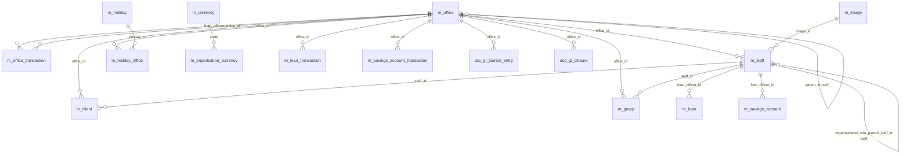

# Offices, Staff & Organization Data Model

This page documents the **organisational backbone** of Apache Fineract:
the tree of branches (`m_office`), their staff (`m_staff`), the inter-office
transfer ledger (`m_office_transaction`), the holiday and working-day calendars
that drive repayment-schedule rolling, and the currency catalogue
(`m_currency`/`m_organisation_currency`) referenced by every monetary table.
The business-date entries (`m_business_date`) added by the COB rework live
here too — they pin the tenant's view of "today".

Tables are seeded by
`fineract-provider/.../changelog/tenant/parts/0001_initial_schema.xml`.
The business-date change-set is `0015_add_business_date.xml`; later parts
(`0020_add_audit_entries.xml`, `0030_add_audit_entries_to_business_date.xml`)
add Spring auditing fields. JPA entities live in
`org.apache.fineract.organisation.*`.

## Source map

| Cluster element            | JPA entity                                              | Liquibase changeSet                                       |
| -------------------------- | ------------------------------------------------------- | --------------------------------------------------------- |
| `m_office`                 | `organisation.office.domain.Office`                     | `0001_initial_schema.xml`                                 |
| `m_office_transaction`     | `organisation.office.domain.OfficeTransaction`          | `0001_initial_schema.xml`                                 |
| `m_staff`                  | `organisation.staff.domain.Staff`                       | `0001_initial_schema.xml`                                 |
| `m_holiday`                | `organisation.holiday.domain.Holiday`                   | `0001_initial_schema.xml`                                 |
| `m_holiday_office`         | join `Holiday.offices`                                  | `0001_initial_schema.xml`                                 |
| `m_working_days`           | `organisation.workingdays.domain.WorkingDays`           | `0001_initial_schema.xml`                                 |
| `m_currency`               | `organisation.monetary.domain.ApplicationCurrency`      | `0001_initial_schema.xml`                                 |
| `m_organisation_currency`  | `organisation.monetary.domain.OrganisationCurrency`     | `0001_initial_schema.xml`                                 |
| `m_business_date`          | `infrastructure.businessdate.domain.BusinessDate`       | `0015_add_business_date.xml`; audit added by `0030_*`     |

Subsystem cross-links:
[`branch/overview`](/branch/overview),
[`organisation/offices`](/organisation/offices) if present in your nav, plus
[`core/business-date`](/core/business-date) for the COB business-date
mechanism and [`accounting/closure`](/accounting/closure) for inter-office
posting rules.

Note: there is no separate `m_office_holiday` table; the linkage is
`m_holiday_office` (a join table on the holiday's office collection).

## ER diagram



## `m_office`

Branch / sub-office tree. The materialised path `hierarchy` is used by
data-scope filters everywhere (loans, savings, GL postings, reports).

| Column        | Type           | Nullable | Role                                                                                          |
| ------------- | -------------- | -------- | --------------------------------------------------------------------------------------------- |
| `id`          | `BIGINT`       | no       | PK.                                                                                           |
| `parent_id`   | `BIGINT`       | yes      | Self FK → `m_office.id`. NULL for the root (Head Office).                                     |
| `hierarchy`   | `VARCHAR(100)` | yes      | Materialised path of `.id.id.id.`. Recomputed when the office is moved.                       |
| `external_id` | `VARCHAR(100)` | yes      | Unique caller-supplied identifier.                                                            |
| `name`        | `VARCHAR(50)`  | no       | Unique business name.                                                                         |
| `opening_date`| `date`         | no       | Office opening date — also the lower bound for child transactions.                            |

Part `0020_add_audit_entries.xml` adds `createdby_id`, `created_date`,
`lastmodifiedby_id`, `lastmodified_date`. See
[`branch/overview`](/branch/overview).

## `m_office_transaction`

A simple inter-office posting (e.g. cash transfer Head Office → Branch).
Posts a balanced pair of `acc_gl_journal_entry` rows via the
`ASSET_TRANSFER` / `LIABILITY_TRANSFER` financial activities.

| Column              | Type            | Nullable | Role                                                  |
| ------------------- | --------------- | -------- | ----------------------------------------------------- |
| `id`                | `BIGINT`        | no       | PK.                                                   |
| `from_office_id`    | `BIGINT`        | yes      | FK → `m_office.id` (NULL when the source is external).|
| `to_office_id`      | `BIGINT`        | yes      | FK → `m_office.id` (NULL when the destination is external).|
| `currency_code`     | `VARCHAR(3)`    | no       | ISO 4217.                                             |
| `currency_digits`   | `INT`           | no       | Decimal places.                                       |
| `transaction_amount`| `DECIMAL(19,6)` | no       | Amount transferred.                                   |
| `transaction_date`  | `date`          | no       | Effective date.                                       |
| `description`       | `VARCHAR(100)`  | yes      | Free text.                                            |

See [`accounting/financial-activity-accounts`](/accounting/financial-activity-accounts).

## `m_staff`

Branch employees. `is_loan_officer = 1` exposes the staff member to loan
officer selection lists; supervisors can be modelled via
`organisational_role_parent_staff_id`.

| Column                                | Type           | Nullable | Role                                                              |
| ------------------------------------- | -------------- | -------- | ----------------------------------------------------------------- |
| `id`                                  | `BIGINT`       | no       | PK.                                                               |
| `is_loan_officer`                     | `boolean`      | no       | Loan-officer eligibility flag.                                    |
| `office_id`                           | `BIGINT`       | yes      | FK → `m_office.id`.                                               |
| `firstname` / `lastname`              | `VARCHAR(50)`  | yes      | Name parts.                                                       |
| `display_name`                        | `VARCHAR(102)` | no       | Unique computed display name.                                     |
| `mobile_no`                           | `VARCHAR(50)`  | yes      | Unique when populated.                                            |
| `external_id`                         | `VARCHAR(100)` | yes      | Unique caller id.                                                 |
| `organisational_role_enum`            | `SMALLINT`     | yes      | `OrganisationalRole` (Branch Manager, Area Manager, …).           |
| `organisational_role_parent_staff_id` | `BIGINT`       | yes      | Self FK → `m_staff.id` (supervisor chain).                        |
| `is_active`                           | `boolean`      | no       | Active flag.                                                      |
| `joining_date`                        | `date`         | yes      | Joining date.                                                     |
| `image_id`                            | `BIGINT`       | yes      | FK → `m_image.id`.                                                |
| `email_address`                       | `VARCHAR(150)` | yes      | Free-form email.                                                  |

See `org.apache.fineract.organisation.staff.domain.Staff`.

## `m_holiday`

A named holiday window. When the loan/savings repayment-schedule generator
hits a date inside one of these windows it consults
`rescheduling_type` and `repayments_rescheduled_to` to roll the installment
forward or backward.

| Column                      | Type           | Nullable | Role                                                                            |
| --------------------------- | -------------- | -------- | ------------------------------------------------------------------------------- |
| `id`                        | `BIGINT`       | no       | PK.                                                                             |
| `name`                      | `VARCHAR(100)` | no       | Display name.                                                                   |
| `from_date`                 | `datetime`     | no       | Window start (inclusive).                                                       |
| `to_date`                   | `datetime`     | no       | Window end (inclusive).                                                         |
| `repayments_rescheduled_to` | `datetime`     | yes      | Anchor date when `rescheduling_type` is "reschedule to specific date".         |
| `status_enum`               | `INT`          | no       | `HolidayStatusType` (PENDING_FOR_ACTIVATION=100, ACTIVE=300, DELETED=600).      |
| `processed`                 | `boolean`      | no       | True after the apply-holidays-to-loans job has consumed this holiday.           |
| `description`               | `VARCHAR(100)` | yes      | Free text.                                                                      |
| `rescheduling_type`         | `INT`          | no       | 1 = move to next repayment, 2 = reschedule to `repayments_rescheduled_to`, 3 = move to next working day. |

`m_holiday_office` is the (`holiday_id`, `office_id`) join table that scopes
a holiday to a subset of offices.

## `m_holiday_office`

| Column      | Type     | Nullable | Role                              |
| ----------- | -------- | -------- | --------------------------------- |
| `holiday_id`| `BIGINT` | no       | PK part, FK → `m_holiday.id`.     |
| `office_id` | `BIGINT` | no       | PK part, FK → `m_office.id`.      |

## `m_working_days`

A single row carries the institution-wide weekly recurrence (RRULE-style)
and rescheduling rule for non-working days.

| Column                          | Type           | Nullable | Role                                                                                |
| ------------------------------- | -------------- | -------- | ----------------------------------------------------------------------------------- |
| `id`                            | `BIGINT`       | no       | PK (typically only one row).                                                        |
| `recurrence`                    | `VARCHAR(100)` | yes      | RRULE string, e.g. `FREQ=WEEKLY;INTERVAL=1;BYDAY=MO,TU,WE,TH,FR`.                  |
| `repayment_rescheduling_enum`   | `SMALLINT`     | yes      | `RepaymentRescheduleType` (SAME_DAY, MOVE_TO_NEXT_WORKING_DAY, MOVE_TO_NEXT_REPAYMENT_MEETING_DAY, MOVE_TO_PREVIOUS_WORKING_DAY). |
| `extend_term_daily_repayments`  | `boolean`      | yes      | When true and the loan is daily, the term is extended for each non-working day.    |
| `extend_term_holiday_repayment` | `boolean`      | no       | When true the holiday rescheduling extends the loan term rather than overlapping.   |

## `m_currency` and `m_organisation_currency`

`m_currency` is the ISO-4217 reference list. `m_organisation_currency`
is the per-tenant subset that the tenant has explicitly enabled — every
account creation validates against this latter table.

### `m_currency`

| Column                       | Type           | Nullable | Role                                            |
| ---------------------------- | -------------- | -------- | ----------------------------------------------- |
| `id`                         | `BIGINT`       | no       | PK.                                             |
| `code`                       | `VARCHAR(3)`   | no       | Unique ISO 4217 alpha-3.                        |
| `decimal_places`             | `SMALLINT`     | no       | Number of decimals for amount fields.           |
| `currency_multiplesof`       | `SMALLINT`     | yes      | Rounding granularity (1, 5, 10, 25, 50, 100).   |
| `display_symbol`             | `VARCHAR(10)`  | yes      | Glyph (e.g. `$`, `€`).                          |
| `name`                       | `VARCHAR(50)`  | no       | Display name.                                   |
| `internationalized_name_code`| `VARCHAR(50)`  | no       | i18n key.                                       |

### `m_organisation_currency`

| Column                       | Type           | Nullable | Role                                            |
| ---------------------------- | -------------- | -------- | ----------------------------------------------- |
| `id`                         | `BIGINT`       | no       | PK.                                             |
| `code`                       | `VARCHAR(3)`   | no       | FK by string to `m_currency.code`.              |
| `decimal_places`             | `SMALLINT`     | no       | Tenant-pinned decimals.                         |
| `currency_multiplesof`       | `SMALLINT`     | yes      | Tenant-pinned rounding granularity.             |
| `name`                       | `VARCHAR(50)`  | no       | Display name (tenant override).                 |
| `display_symbol`             | `VARCHAR(10)`  | yes      | Tenant override.                                |
| `internationalized_name_code`| `VARCHAR(50)`  | no       | i18n key.                                       |

The columns `currency_code`, `currency_digits` and `currency_multiplesof`
that appear on `m_loan`, `m_savings_account`, `m_charge`, `m_office_transaction`,
`m_account_transfer_transaction`, etc. denormalise the values from
`m_organisation_currency` at row-create time.

## `m_business_date`

Added by `0015_add_business_date.xml` for the Close-of-Business engine.

| Column              | Type           | Nullable | Role                                                          |
| ------------------- | -------------- | -------- | ------------------------------------------------------------- |
| `id`                | `BIGINT`       | no       | PK.                                                           |
| `type`              | `VARCHAR(100)` | no       | Unique; one row per `BusinessDateType` (`BUSINESS_DATE`, `COB_DATE`). |
| `date`              | `DATE`         | no       | Current value.                                                |
| `createdby_id`      | `BIGINT`       | yes      | Audit (added by `0030_*`).                                    |
| `created_date`      | `DATETIME`     | yes      | Audit.                                                        |
| `version`           | `BIGINT`       | no       | JPA optimistic lock.                                          |
| `lastmodifiedby_id` | `BIGINT`       | yes      | Audit.                                                        |
| `lastmodified_date` | `DATETIME`     | yes      | Audit.                                                        |

See [`core/business-date`](/core/business-date).

## Office hierarchy mechanics

The `hierarchy` column on `m_office` is the cornerstone of Fineract's
data-scope. It is a materialised path of the form `.id1.id2.id3.` (note
the leading and trailing dots). When the office tree is reshaped (a branch
is moved or a new sub-office is inserted), the platform recomputes
`hierarchy` for the affected subtree in a single transaction.

Every read service that returns rows tied to an office (clients, groups,
loans, savings, GL entries, etc.) filters by

```sql
office.hierarchy LIKE :userOfficeHierarchy || '%'
```

so that a user can only see entities under their own office subtree. This
is implemented in `org.apache.fineract.useradministration.api.AppUserApiResource`
and the per-domain read services (see `OfficeReadPlatformServiceImpl`).

When `c_configuration.name = 'office-specific-products-enabled'` is on
(see [`models/configuration-and-codes`](/models/configuration-and-codes))
the join `m_office.id ↔ m_product_loan.id` is also consulted to restrict
the products that the user can disburse loans against.

## Inter-office accounting

Inter-office transactions wired through `m_office_transaction` produce two
balanced postings in `acc_gl_journal_entry`:

| Leg          | Office               | GL account                                              |
| ------------ | -------------------- | ------------------------------------------------------- |
| 1 (debit)    | `to_office_id`       | `acc_gl_financial_activity_account.ASSET_TRANSFER`      |
| 2 (credit)   | `from_office_id`     | `acc_gl_financial_activity_account.ASSET_TRANSFER`      |

The mirror entry for cash leaving the source office and arriving at the
destination office is wired through the configured `ASSET_TRANSFER` and
`LIABILITY_TRANSFER` financial activities — see
[`models/accounting-and-gl`](/models/accounting-and-gl). When a transfer
involves a third party (e.g. a vendor), `from_office_id` or
`to_office_id` may be NULL; the missing leg is replaced by the configured
"external" financial activity.

## Holidays and the repayment scheduler

When the loan / savings repayment-schedule generator emits a candidate
installment date, the scheduler consults two tables:

1. `m_working_days` — the institution-wide weekly recurrence. The single
   row's `recurrence` RRULE determines whether the candidate date is a
   working day at all.
2. `m_holiday` (joined to `m_holiday_office`) — the list of explicit
   holidays for the loan's branch.

If the candidate date is a non-working day, the
`repayment_rescheduling_enum` value picks whether the installment moves
forward, backward, stays put, or moves to the next meeting day. If it is a
holiday, the holiday's `rescheduling_type` overrides this with one of:

- `MOVE_TO_NEXT_REPAYMENT` (1): roll the missed installment into the
  next-scheduled installment, accumulating.
- `RESCHEDULE_TO_SPECIFIC_DATE` (2): move to `repayments_rescheduled_to`.
- `MOVE_TO_NEXT_WORKING_DAY` (3): move to the next working day after the
  holiday window.

`processed = true` on `m_holiday` marks the holiday as applied to all
in-flight loans. The `Apply Holidays To Loans` scheduled job (see
[`models/jobs-and-batch`](/models/jobs-and-batch)) flips this flag when it
finishes processing.

## Business-date and COB

The `m_business_date` table is the source-of-truth for "today" in Fineract.
There are two type rows:

- `BUSINESS_DATE` — the date used by business rules (interest accrual,
  arrears, charge maturity). Advances when an operator triggers
  end-of-business.
- `COB_DATE` — the date the COB Spring Batch chain processed last.

The flag `c_configuration.name = 'is-business-date-enabled'` controls
whether the platform reads `BUSINESS_DATE` from this row or from the JVM
clock. When disabled, every business date defaults to the JVM's `LocalDate.now()`.

See [`core/business-date`](/core/business-date) and
[`models/jobs-and-batch`](/models/jobs-and-batch).

## Currency seeding

`m_currency` is seeded by `0002_initial_data.xml` with the full ISO 4217
catalogue. `m_organisation_currency` is empty at boot — operators populate
it through the `/currencies` REST surface. Attempting to create a row in
`m_organisation_currency` whose `code` is not in `m_currency` is rejected
at the application layer.

The triple `(currency_code, currency_digits, currency_multiplesof)`
denormalised on every monetary row uses the values from
`m_organisation_currency` at row-create time, not from `m_currency`.
Changing the organisation's `currency_multiplesof` does not retroactively
update historical rows.

## Cross-cluster references

- Every party and account row references `m_office` (and frequently
  `m_staff`):
  - `m_client`, `m_group` → [`models/clients-and-groups`](/models/clients-and-groups).
  - `m_loan` → [`models/loans-and-products`](/models/loans-and-products).
  - `m_savings_account` → [`models/savings-and-deposits`](/models/savings-and-deposits).
- GL artefacts (`acc_gl_journal_entry`, `acc_gl_closure`,
  `acc_accounting_rule`) →
  [`models/accounting-and-gl`](/models/accounting-and-gl).
- `m_image` (referenced by `m_staff.image_id`) →
  [`models/documents-and-images`](/models/documents-and-images).
- `m_appuser.office_id` and `m_appuser.staff_id` →
  [`models/users-roles-permissions`](/models/users-roles-permissions).
- The COB chain that advances `BUSINESS_DATE` runs on
  [`models/jobs-and-batch`](/models/jobs-and-batch) infrastructure.
- Currency strings used by transaction tables anchor in
  `m_organisation_currency`; cross-tenant scope is covered in the
  tenant-store changelog (not in this cluster).
