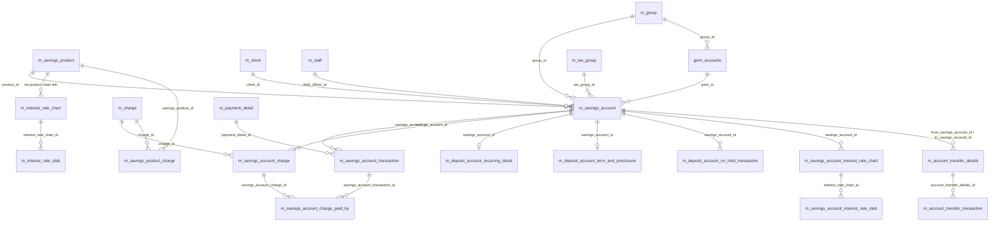

# Savings & Deposits Data Model

This page documents the physical schema behind Apache Fineract savings,
recurring-deposit (RD) and fixed-deposit (FD) products. Savings is a single
`m_savings_account` row hierarchy that polymorphically becomes a savings, RD
or FD based on `deposit_type_enum`; the additional `_recurring_detail` and
`_term_and_preclosure` side-tables carry the type-specific configuration. The
interest-rate chart pair (`m_interest_rate_chart` /
`m_savings_account_interest_rate_chart`) gives products and individual
accounts the same chart structure.

Tables are created by `0001_initial_schema.xml` in
`fineract-provider/.../changelog/tenant/parts/`. The savings module
(`fineract-savings/.../changelog/tenant/module/savings/parts/`) adds later
columns such as `last_interest_calculation_date` precision changes, dormancy
columns and `is_loan_disbursement` flagging. JPA entities live in
`org.apache.fineract.portfolio.savings.domain.*`.

## Source map

| Cluster element                              | JPA entity                                                          | Liquibase changeSet                                       |
| -------------------------------------------- | ------------------------------------------------------------------- | --------------------------------------------------------- |
| `m_savings_account`                          | `savings.domain.SavingsAccount`                                     | `0001_initial_schema.xml`                                 |
| `m_savings_account_transaction`              | `savings.domain.SavingsAccountTransaction`                          | `0001_initial_schema.xml`                                 |
| `m_savings_account_charge`                   | `savings.domain.SavingsAccountCharge`                               | `0001_initial_schema.xml`                                 |
| `m_savings_account_charge_paid_by`           | `savings.domain.SavingsAccountChargePaidBy`                         | `0001_initial_schema.xml`                                 |
| `m_savings_account_interest_rate_chart`      | `savings.domain.SavingsAccountInterestRateChart`                    | `0001_initial_schema.xml`                                 |
| `m_savings_account_interest_rate_slab`       | `savings.domain.SavingsAccountInterestRateSlab`                     | `0001_initial_schema.xml`                                 |
| `m_savings_product`                          | `savings.domain.SavingsProduct`                                     | `0001_initial_schema.xml`                                 |
| `m_savings_product_charge`                   | join `SavingsProduct.charges`                                       | `0001_initial_schema.xml`                                 |
| `m_deposit_account_recurring_detail`         | `savings.domain.DepositAccountRecurringDetail`                      | `0001_initial_schema.xml`                                 |
| `m_deposit_account_term_and_preclosure`      | `savings.domain.DepositAccountTermAndPreClosure`                    | `0001_initial_schema.xml`                                 |
| `m_deposit_account_on_hold_transaction`      | `savings.domain.DepositAccountOnHoldTransaction`                    | `0001_initial_schema.xml`                                 |
| `m_interest_rate_chart`                      | `interestratechart.domain.InterestRateChart`                        | `0001_initial_schema.xml`                                 |
| `m_interest_rate_slab`                       | `interestratechart.domain.InterestRateChartSlab`                    | `0001_initial_schema.xml`                                 |
| `gsim_accounts`                              | `savings.domain.GroupSavingsIndividualMonitoring`                   | `0001_initial_schema.xml`                                 |
| `m_account_transfer_details`                 | `account.domain.AccountTransferDetails`                             | `0001_initial_schema.xml`                                 |
| `m_account_transfer_transaction`             | `account.domain.AccountTransferTransaction`                         | `0001_initial_schema.xml`                                 |

Subsystem cross-links:
[`savings/savings-account-domain`](/savings/savings-account-domain),
[`savings/savings-transactions`](/savings/savings-transactions),
[`savings/savings-charges`](/savings/savings-charges),
[`savings/fixed-deposit`](/savings/fixed-deposit),
[`savings/recurring-deposit`](/savings/recurring-deposit),
[`savings/gsim-group-savings`](/savings/gsim-group-savings),
[`savings/deposit-account-on-hold-funds`](/savings/deposit-account-on-hold-funds),
[`portfolio/interest-rate-charts`](/portfolio/interest-rate-charts) and
[`portfolio/account-transfers`](/portfolio/account-transfers).

## ER diagram

## `m_savings_account`

The polymorphic root for savings, RD and FD accounts. `deposit_type_enum`
selects the subtype (100 = SAVINGS_DEPOSIT, 200 = FIXED_DEPOSIT,
300 = RECURRING_DEPOSIT, 400 = CURRENT). The `SavingsAccount` JPA class is
the parent of `FixedDepositAccount` and `RecurringDepositAccount` via
single-table inheritance with `deposit_type_enum` as the discriminator.

| Column                                              | Type             | Nullable | Role                                                                       |
| --------------------------------------------------- | ---------------- | -------- | -------------------------------------------------------------------------- |
| `id`                                                | `BIGINT`         | no       | PK.                                                                        |
| `account_no`                                        | `VARCHAR(20)`    | no       | Unique business id.                                                        |
| `external_id`                                       | `VARCHAR(100)`   | yes      | Unique caller id.                                                          |
| `client_id`                                         | `BIGINT`         | yes      | FK → `m_client.id`.                                                        |
| `group_id`                                          | `BIGINT`         | yes      | FK → `m_group.id` (group / JLG accounts).                                  |
| `gsim_id`                                           | `BIGINT`         | yes      | FK → `gsim_accounts.id` for GSIM-monitored accounts.                       |
| `product_id`                                        | `BIGINT`         | yes      | FK → `m_savings_product.id`.                                               |
| `field_officer_id`                                  | `BIGINT`         | yes      | FK → `m_staff.id`.                                                         |
| `status_enum`                                       | `SMALLINT`       | no       | `SavingsAccountStatusType` (default 100 SUBMITTED, 300 ACTIVE, …).         |
| `sub_status_enum`                                   | `SMALLINT`       | no       | `SavingsAccountSubStatusEnum` (DORMANT, INACTIVE, ESCHEAT, …).             |
| `account_type_enum`                                 | `SMALLINT`       | no       | `AccountType` (INDIVIDUAL=1, GROUP=2, JLG=3, GSIM=4).                      |
| `deposit_type_enum`                                 | `SMALLINT`       | no       | `DepositAccountType` discriminator.                                        |
| `submittedon_date` / `submittedon_userid`           | mixed            | partial  | Submission audit.                                                          |
| `approvedon_date` / `approvedon_userid`             | mixed            | yes      | Approval audit.                                                            |
| `rejectedon_date` / `rejectedon_userid`             | mixed            | yes      | Rejection audit.                                                           |
| `withdrawnon_date` / `withdrawnon_userid`           | mixed            | yes      | Withdrawal audit.                                                          |
| `activatedon_date` / `activatedon_userid`           | mixed            | yes      | Activation audit.                                                          |
| `closedon_date` / `closedon_userid`                 | mixed            | yes      | Close audit.                                                               |
| `currency_code` / `currency_digits` / `currency_multiplesof` | mixed   | partial  | Currency triple.                                                           |
| `nominal_annual_interest_rate`                      | `DECIMAL(19,6)`  | no       | Nominal rate.                                                              |
| `interest_compounding_period_enum`                  | `SMALLINT`       | no       | `SavingsCompoundingInterestPeriodType` (DAILY, MONTHLY, …).                |
| `interest_posting_period_enum`                      | `SMALLINT`       | no       | `SavingsPostingInterestPeriodType` (MONTHLY=4, QUARTERLY=5, …).            |
| `interest_calculation_type_enum`                    | `SMALLINT`       | no       | `SavingsInterestCalculationType` (daily balance / avg daily balance).      |
| `interest_calculation_days_in_year_type_enum`       | `SMALLINT`       | no       | 360 / 365.                                                                 |
| `min_required_opening_balance`                      | `DECIMAL(19,6)`  | yes      | Required opening deposit.                                                  |
| `lockin_period_frequency` / `lockin_period_frequency_enum` | mixed     | yes      | Lock-in period config.                                                     |
| `withdrawal_fee_for_transfer`                       | `boolean`        | yes      | Charge withdrawal fee on transfer.                                         |
| `allow_overdraft`                                   | `boolean`        | no       | Whether overdraft is allowed.                                              |
| `overdraft_limit`                                   | `DECIMAL(19,6)`  | yes      | Limit.                                                                     |
| `nominal_annual_interest_rate_overdraft`            | `DECIMAL(19,6)`  | no       | Overdraft interest rate.                                                   |
| `min_overdraft_for_interest_calculation`            | `DECIMAL(19,6)`  | no       | Threshold for overdraft interest.                                          |
| `lockedin_until_date_derived`                       | `date`           | yes      | Derived lock-in expiry.                                                    |
| `total_deposits_derived` / `total_withdrawals_derived` | `DECIMAL(19,6)` | yes   | Lifetime totals.                                                           |
| `total_withdrawal_fees_derived` / `total_fees_charge_derived` / `total_penalty_charge_derived` / `total_annual_fees_derived` | `DECIMAL(19,6)` | yes | Fee rollups.                                                              |
| `total_interest_earned_derived` / `total_interest_posted_derived` | `DECIMAL(19,6)` | yes | Interest rollups.                                                          |
| `total_overdraft_interest_derived`                  | `DECIMAL(19,6)`  | no       | Overdraft interest rollup.                                                 |
| `total_withhold_tax_derived`                        | `DECIMAL(19,6)`  | yes      | Withholding tax rollup.                                                    |
| `account_balance_derived`                           | `DECIMAL(19,6)`  | no       | Posted account balance.                                                    |
| `min_required_balance` / `enforce_min_required_balance` | mixed        | no       | Min balance config.                                                        |
| `min_balance_for_interest_calculation`              | `DECIMAL(19,6)`  | yes      | Floor below which no interest accrues.                                     |
| `start_interest_calculation_date`                   | `date`           | yes      | Override start.                                                            |
| `on_hold_funds_derived`                             | `DECIMAL(19,6)`  | yes      | Hold-amount rollup.                                                        |
| `version`                                           | `INT`            | no       | JPA optimistic lock.                                                       |
| `withhold_tax` / `tax_group_id`                     | mixed            | no       | Tax-group reference (see [`models/charges-fees-taxes`](/models/charges-fees-taxes)). |
| `last_interest_calculation_date`                    | `date`           | yes      | Marker used by interest jobs.                                              |
| `total_savings_amount_on_hold`                      | `DECIMAL(19,6)`  | yes      | Hold rollup (lien).                                                        |
| `interest_posted_till_date`                         | `date`           | yes      | Last posting date.                                                         |

Later parts add `lien_allowed`, `is_dormancy_tracking_active`,
`days_to_inactive`/`dormancy`/`escheat`, and (from `0009_hold_reason_savings_account`)
`reason_for_block` columns and `m_savings_account_block_narrations` /
`m_savings_account_block_history` accessory tables.

See [`savings/savings-account-domain`](/savings/savings-account-domain) and
[`savings/savings-write-service`](/savings/savings-write-service).

## `m_savings_account_transaction`

| Column                          | Type             | Nullable | Role                                                       |
| ------------------------------- | ---------------- | -------- | ---------------------------------------------------------- |
| `id`                            | `BIGINT`         | no       | PK.                                                        |
| `savings_account_id`            | `BIGINT`         | no       | FK → `m_savings_account.id`.                               |
| `office_id`                     | `BIGINT`         | no       | FK → `m_office.id` (point of record).                      |
| `payment_detail_id`             | `BIGINT`         | yes      | FK → `m_payment_detail.id`.                                |
| `transaction_type_enum`         | `SMALLINT`       | no       | `SavingsAccountTransactionType` (DEPOSIT=1, WITHDRAWAL=2, INTEREST_POSTING=4, …). |
| `is_reversed`                   | `boolean`        | no       | Reversal flag.                                             |
| `transaction_date`              | `date`           | no       | Effective date.                                            |
| `amount`                        | `DECIMAL(19,6)`  | no       | Gross amount.                                              |
| `overdraft_amount_derived`      | `DECIMAL(19,6)`  | yes      | Portion attributable to overdraft.                         |
| `balance_end_date_derived`      | `date`           | yes      | End of balance period this txn anchors.                    |
| `balance_number_of_days_derived`| `INT`            | yes      | Day-count for interest accrual.                            |
| `running_balance_derived`       | `DECIMAL(19,6)`  | yes      | Balance after txn.                                         |
| `cumulative_balance_derived`    | `DECIMAL(19,6)`  | yes      | Balance × days product used by accrual.                    |
| `created_date`                  | `datetime`       | no       | System timestamp.                                          |
| `appuser_id`                    | `BIGINT`         | yes      | FK → `m_appuser.id`.                                       |
| `is_manual`                     | `boolean`        | no       | Distinguishes user-driven vs system-generated entries.     |
| `release_id_of_hold_amount`     | `BIGINT`         | yes      | Self-FK to txn id that placed the corresponding hold.      |
| `is_loan_disbursement`          | `boolean`        | yes      | True when the savings line is a loan disbursal credit.     |
| `ref_no`                        | `VARCHAR(128)`   | yes      | Unique reference; `0016_changed_unique_constraint_of_ref_no.xml` widened the uniqueness scope. |

Part `0005_savings_transaction_reversal.xml` adds `reversal_id` and links a
reversal back to its source. See
[`savings/savings-transactions`](/savings/savings-transactions).

## `m_savings_account_charge`

| Column                            | Type             | Nullable | Role                                                        |
| --------------------------------- | ---------------- | -------- | ----------------------------------------------------------- |
| `id`                              | `BIGINT`         | no       | PK.                                                         |
| `savings_account_id`              | `BIGINT`         | no       | FK → `m_savings_account.id`.                                |
| `charge_id`                       | `BIGINT`         | no       | FK → `m_charge.id`.                                         |
| `is_penalty`                      | `boolean`        | no       | Mirrors `m_charge.is_penalty`.                              |
| `charge_time_enum`                | `SMALLINT`       | no       | `ChargeTimeType`.                                           |
| `charge_due_date`                 | `date`           | yes      | Due date.                                                   |
| `fee_on_month` / `fee_on_day`     | `SMALLINT`       | yes      | Anchoring for annual / monthly fees.                        |
| `fee_interval`                    | `SMALLINT`       | yes      | Months between recurring fees.                              |
| `free_withdrawal_count`           | `INT`            | yes      | Withdrawals before the fee triggers.                        |
| `charge_reset_date`               | `date`           | yes      | Date the free-withdrawal counter resets.                    |
| `charge_calculation_enum`         | `SMALLINT`       | no       | `ChargeCalculationType`.                                    |
| `calculation_percentage` / `calculation_on_amount` | `DECIMAL(19,6)` | yes | Calculation inputs.                                       |
| `amount` / `amount_paid_derived` / `amount_waived_derived` / `amount_writtenoff_derived` / `amount_outstanding_derived` | `DECIMAL(19,6)` | mixed | Charge rollups. |
| `is_paid_derived` / `waived` / `is_active` | `boolean`| no       | Status.                                                     |
| `inactivated_on_date`             | `date`           | yes      | Inactivation date.                                          |

See [`savings/savings-charges`](/savings/savings-charges).

## `m_savings_account_charge_paid_by`

Allocation between a savings transaction and the charges it paid.

| Column                          | Type            | Nullable | Role                                          |
| ------------------------------- | --------------- | -------- | --------------------------------------------- |
| `id`                            | `BIGINT`        | no       | PK.                                           |
| `savings_account_transaction_id`| `BIGINT`        | no       | FK → `m_savings_account_transaction.id`.      |
| `savings_account_charge_id`     | `BIGINT`        | no       | FK → `m_savings_account_charge.id`.           |
| `amount`                        | `DECIMAL(19,6)` | no       | Amount allocated.                             |

## `m_savings_account_interest_rate_chart`

Per-account interest-rate chart used by FD and RD.

| Column                          | Type            | Nullable | Role                                          |
| ------------------------------- | --------------- | -------- | --------------------------------------------- |
| `id`                            | `BIGINT`        | no       | PK.                                           |
| `savings_account_id`            | `BIGINT`        | no       | FK → `m_savings_account.id`.                  |
| `name`                          | `VARCHAR(100)`  | yes      | Display name.                                 |
| `description`                   | `VARCHAR(200)`  | yes      | Free text.                                    |
| `from_date`                     | `date`          | no       | Validity start.                               |
| `end_date`                      | `date`          | yes      | Validity end.                                 |
| `is_primary_grouping_by_amount` | `boolean`       | no       | Whether amount range is the primary axis.     |

Slabs in `m_savings_account_interest_rate_slab` carry the same column shape
as `m_interest_rate_slab` plus FK `savings_account_interest_rate_chart_id`.

## `m_savings_product`

Selected columns:

| Column                                              | Type             | Nullable | Role                                              |
| --------------------------------------------------- | ---------------- | -------- | ------------------------------------------------- |
| `id`                                                | `BIGINT`         | no       | PK.                                               |
| `name`                                              | `VARCHAR(100)`   | no       | Unique.                                           |
| `short_name`                                        | `VARCHAR(4)`     | no       | Unique short code.                                |
| `description`                                       | `VARCHAR(500)`   | yes      | Free text.                                        |
| `deposit_type_enum`                                 | `SMALLINT`       | no       | 100 SAVINGS / 200 FD / 300 RD / 400 CURRENT.      |
| `currency_code` / `currency_digits` / `currency_multiplesof` | mixed   | partial  | Currency.                                         |
| `nominal_annual_interest_rate`                      | `DECIMAL(19,6)`  | no       | Default.                                          |
| `interest_compounding_period_enum` / `interest_posting_period_enum` / `interest_calculation_type_enum` / `interest_calculation_days_in_year_type_enum` | `SMALLINT` | no | Defaults.                                                                  |
| `min_required_opening_balance`                      | `DECIMAL(19,6)`  | yes      | Default opening deposit.                          |
| `lockin_period_frequency` / `lockin_period_frequency_enum` | mixed     | yes      | Lock-in defaults.                                 |
| `accounting_type`                                   | `SMALLINT`       | no       | `AccountingRuleType` (NONE/CASH/ACCRUAL).         |
| `withdrawal_fee_amount` / `withdrawal_fee_type_enum`| mixed            | yes      | Withdrawal fee.                                   |
| `withdrawal_fee_for_transfer`                       | `boolean`        | yes      | Apply fee on transfer.                            |
| `allow_overdraft` / `overdraft_limit`               | mixed            | partial  | Overdraft config.                                 |
| `nominal_annual_interest_rate_overdraft`            | `DECIMAL(19,6)`  | no       | Overdraft rate.                                   |
| `min_overdraft_for_interest_calculation`            | `DECIMAL(19,6)`  | no       | Overdraft floor.                                  |
| `min_required_balance` / `enforce_min_required_balance` / `min_balance_for_interest_calculation` | mixed | no/yes | Balance constraints.                            |
| `withhold_tax` / `tax_group_id`                     | mixed            | no/yes   | Withholding tax.                                  |
| `is_dormancy_tracking_active`                       | `boolean`        | yes      | Dormancy toggle.                                  |
| `days_to_inactive` / `days_to_dormancy` / `days_to_escheat` | `INT`     | yes      | Dormancy timers.                                  |

`m_savings_product_charge` is the join table.

## `m_deposit_account_recurring_detail`

Per-RD configuration.

| Column                                  | Type            | Nullable | Role                                                |
| --------------------------------------- | --------------- | -------- | --------------------------------------------------- |
| `id`                                    | `BIGINT`        | no       | PK.                                                 |
| `savings_account_id`                    | `BIGINT`        | no       | FK → `m_savings_account.id`.                        |
| `mandatory_recommended_deposit_amount`  | `DECIMAL(19,6)` | yes      | Expected periodic deposit.                          |
| `is_mandatory`                          | `boolean`       | no       | True if missed deposits trigger arrears.            |
| `allow_withdrawal`                      | `boolean`       | no       | Whether early withdrawal is permitted.              |
| `adjust_advance_towards_future_payments`| `boolean`       | no       | Over-deposits absorb future obligations.            |
| `is_calendar_inherited`                 | `boolean`       | no       | Calendar inherited from a parent group calendar.    |
| `total_overdue_amount`                  | `DECIMAL(19,6)` | yes      | Running overdue rollup.                             |
| `no_of_overdue_installments`            | `INT`           | yes      | Count of missed installments.                       |

See [`savings/recurring-deposit`](/savings/recurring-deposit).

## `m_deposit_account_term_and_preclosure`

Per-FD configuration.

| Column                                  | Type            | Nullable | Role                                          |
| --------------------------------------- | --------------- | -------- | --------------------------------------------- |
| `id`                                    | `BIGINT`        | no       | PK.                                           |
| `savings_account_id`                    | `BIGINT`        | no       | FK → `m_savings_account.id`.                  |
| `min_deposit_term` / `max_deposit_term` | `INT`           | yes      | Term bounds.                                  |
| `min_deposit_term_type_enum` / `max_deposit_term_type_enum` | `SMALLINT` | yes | Term unit (days/weeks/months/years).         |
| `in_multiples_of_deposit_term` / `in_multiples_of_deposit_term_type_enum` | mixed | yes | Allowed term increments.                 |
| `pre_closure_penal_applicable`          | `boolean`       | yes      | Penalty toggle.                               |
| `pre_closure_penal_interest`            | `DECIMAL(19,6)` | yes      | Penalty rate.                                 |
| `pre_closure_penal_interest_on_enum`    | `SMALLINT`      | yes      | What the penalty is calculated on.            |
| `deposit_period` / `deposit_period_frequency_enum` | mixed | yes      | Active term.                                  |
| `deposit_amount` / `maturity_amount`    | `DECIMAL(19,6)` | yes      | Deposit and projected maturity.               |
| `maturity_date`                         | `date`          | yes      | Projected maturity date.                      |
| `on_account_closure_enum`               | `SMALLINT`      | yes      | Action at maturity (withdraw, renew, transfer).|
| `expected_firstdepositon_date`          | `date`          | yes      | Expected first deposit.                       |
| `transfer_interest_to_linked_account`   | `boolean`       | no       | Pay interest into a linked savings.           |
| `transfer_to_savings_account_id`        | `BIGINT`        | yes      | FK → `m_savings_account.id`.                  |

See [`savings/fixed-deposit`](/savings/fixed-deposit).

## `m_deposit_account_on_hold_transaction`

Holds (lien) placed on a savings account by the loan-on-hold-funds engine.

| Column                  | Type            | Nullable | Role                              |
| ----------------------- | --------------- | -------- | --------------------------------- |
| `id`                    | `BIGINT`        | no       | PK.                               |
| `savings_account_id`    | `BIGINT`        | no       | FK → `m_savings_account.id`.      |
| `amount`                | `DECIMAL(19,6)` | no       | Hold amount.                      |
| `transaction_type_enum` | `SMALLINT`      | no       | `DepositAccountOnHoldTransactionType` (HOLD=1, RELEASE=2). |
| `transaction_date`      | `date`          | no       | Effective date.                   |
| `is_reversed`           | `boolean`       | no       | Reversal flag.                    |
| `created_date`          | `datetime`      | no       | System timestamp.                 |

See [`savings/deposit-account-on-hold-funds`](/savings/deposit-account-on-hold-funds).

## `m_interest_rate_chart` (product-level)

| Column                          | Type            | Nullable | Role                                           |
| ------------------------------- | --------------- | -------- | ---------------------------------------------- |
| `id`                            | `BIGINT`        | no       | PK.                                            |
| `name`                          | `VARCHAR(100)`  | yes      | Name.                                          |
| `description`                   | `VARCHAR(200)`  | yes      | Free text.                                     |
| `from_date`                     | `date`          | no       | Validity start.                                |
| `end_date`                      | `date`          | yes      | Validity end.                                  |
| `is_primary_grouping_by_amount` | `boolean`       | no       | Whether amount range is the primary axis.      |

A product → chart link sits via `m_savings_product_*` charts (one chart per
product variant). See
[`portfolio/interest-rate-charts`](/portfolio/interest-rate-charts).

## `m_interest_rate_slab`

| Column                  | Type            | Nullable | Role                                                |
| ----------------------- | --------------- | -------- | --------------------------------------------------- |
| `id`                    | `BIGINT`        | no       | PK.                                                 |
| `interest_rate_chart_id`| `BIGINT`        | no       | FK → `m_interest_rate_chart.id`.                    |
| `description`           | `VARCHAR(200)`  | yes      | Free text.                                          |
| `period_type_enum`      | `SMALLINT`      | yes      | Days / weeks / months / years.                      |
| `from_period`           | `INT`           | yes      | Slab start (term in `period_type` units).           |
| `to_period`             | `INT`           | yes      | Slab end.                                           |
| `amount_range_from`     | `DECIMAL(19,6)` | yes      | Lower amount cutoff.                                |
| `amount_range_to`       | `DECIMAL(19,6)` | yes      | Upper amount cutoff.                                |
| `annual_interest_rate`  | `DECIMAL(19,6)` | no       | Applicable rate.                                    |
| `currency_code`         | `VARCHAR(3)`    | no       | ISO 4217.                                           |

## `gsim_accounts`

Group-Savings-with-Individual-Monitoring parent record. Each group savings
group has one row here; individual `m_savings_account.gsim_id` rows are its
children.

| Column                | Type            | Nullable | Role                                              |
| --------------------- | --------------- | -------- | ------------------------------------------------- |
| `id`                  | `BIGINT`        | no       | PK.                                               |
| `group_id`            | `BIGINT`        | no       | FK → `m_group.id`.                                |
| `account_number`      | `VARCHAR(50)`   | no       | Unique parent account number.                     |
| `parent_deposit`      | `DECIMAL(19,6)` | no       | Aggregate deposit across child accounts.          |
| `child_accounts_count`| `INT`           | no       | Number of children.                               |
| `accepting_child`     | `boolean`       | no       | Whether further children may be added.            |
| `savings_status_id`   | `SMALLINT`      | no       | Aggregate status.                                 |
| `application_id`      | `DECIMAL(10)`   | yes      | Logical grouping id for applications.             |

See [`savings/gsim-group-savings`](/savings/gsim-group-savings).

## `m_account_transfer_details` and `m_account_transfer_transaction`

These two tables wire savings ↔ savings and savings ↔ loan transfers.

### `m_account_transfer_details`

| Column                  | Type     | Nullable | Role                                                      |
| ----------------------- | -------- | -------- | --------------------------------------------------------- |
| `id`                    | `BIGINT` | no       | PK.                                                       |
| `from_office_id`        | `BIGINT` | no       | FK → `m_office.id`.                                       |
| `to_office_id`          | `BIGINT` | no       | FK → `m_office.id`.                                       |
| `from_client_id`        | `BIGINT` | yes      | FK → `m_client.id`.                                       |
| `to_client_id`          | `BIGINT` | yes      | FK → `m_client.id`.                                       |
| `from_savings_account_id`| `BIGINT`| yes      | FK → `m_savings_account.id`.                              |
| `to_savings_account_id` | `BIGINT` | yes      | FK → `m_savings_account.id`.                              |
| `from_loan_account_id`  | `BIGINT` | yes      | FK → `m_loan.id`.                                         |
| `to_loan_account_id`    | `BIGINT` | yes      | FK → `m_loan.id`.                                         |
| `transfer_type`         | `SMALLINT`| yes     | `AccountTransferType` (REGULAR, LOAN_REPAYMENT, …).       |

### `m_account_transfer_transaction`

| Column                       | Type            | Nullable | Role                                          |
| ---------------------------- | --------------- | -------- | --------------------------------------------- |
| `id`                         | `BIGINT`        | no       | PK.                                           |
| `account_transfer_details_id`| `BIGINT`        | no       | FK → `m_account_transfer_details.id`.         |
| `from_savings_transaction_id`| `BIGINT`        | yes      | FK → `m_savings_account_transaction.id`.      |
| `from_loan_transaction_id`   | `BIGINT`        | yes      | FK → `m_loan_transaction.id`.                 |
| `to_savings_transaction_id`  | `BIGINT`        | yes      | FK → `m_savings_account_transaction.id`.      |
| `to_loan_transaction_id`     | `BIGINT`        | yes      | FK → `m_loan_transaction.id`.                 |
| `is_reversed`                | `boolean`       | no       | Reversal flag.                                |
| `transaction_date`           | `date`          | no       | Effective date.                               |
| `currency_code` / `currency_digits` / `currency_multiplesof` | mixed | partial | Currency triple.                              |
| `amount`                     | `DECIMAL(19,6)` | no       | Transferred amount.                           |
| `description`                | `VARCHAR(200)`  | no       | Description.                                  |

Sibling tables `m_account_transfer_standing_instructions` and
`m_account_transfer_standing_instructions_history` carry standing-instruction
scheduling — see
[`portfolio/standing-instructions`](/portfolio/standing-instructions).

## Cross-cluster references

- `m_client`, `m_group` → [`models/clients-and-groups`](/models/clients-and-groups).
- `m_office`, `m_staff` → [`models/offices-staff-organization`](/models/offices-staff-organization).
- `m_charge`, `m_tax_group` → [`models/charges-fees-taxes`](/models/charges-fees-taxes).
- `acc_*` journal entries derived from savings transactions →
  [`models/accounting-and-gl`](/models/accounting-and-gl).
- `m_loan`, `m_loan_transaction` (referenced by account-transfer tables) →
  [`models/loans-and-products`](/models/loans-and-products).
- `m_payment_detail`, `m_appuser` →
  [`models/users-roles-permissions`](/models/users-roles-permissions).
