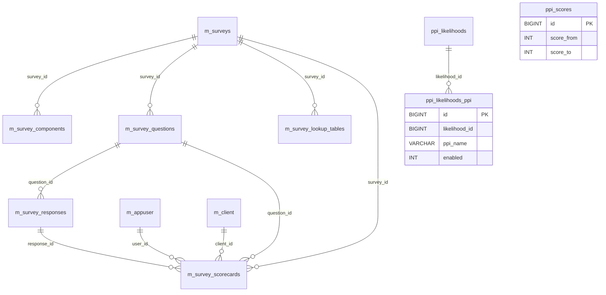

# Surveys & SPM Data Model

This page documents the schema behind Apache Fineract's two related
client-assessment subsystems:

1. The **surveys** subsystem (`m_surveys`, `m_survey_components`,
   `m_survey_questions`, `m_survey_responses`, `m_survey_scorecards`,
   `m_survey_lookup_tables`) — generic multi-choice questionnaires answered
   on behalf of a client and scored against per-survey lookup ranges.
2. The **Social-Performance-Management (SPM) / Progress out of Poverty
   Index (PPI)** tables (`ppi_likelihoods`, `ppi_likelihoods_ppi`,
   `ppi_scores`) — the metadata that maps a survey total score to a
   poverty-line likelihood band.

The task brief mentioned `m_survey`, `m_question`, `m_response`, `m_scorecard`,
`m_likelihood` and `m_poverty_line`; in the actual schema these are
respectively `m_surveys`, `m_survey_questions`, `m_survey_responses`,
`m_survey_scorecards`, `ppi_likelihoods` and `ppi_scores` (no `m_poverty_line`
table exists). The mapping below documents the canonical names.

Tables are seeded by
`fineract-provider/.../changelog/tenant/parts/0001_initial_schema.xml`.
JPA entities live in
`org.apache.fineract.spm.domain.*`.

## Source map

| Cluster element           | JPA entity                                                          | Liquibase changeSet                                       |
| ------------------------- | ------------------------------------------------------------------- | --------------------------------------------------------- |
| `m_surveys`               | `spm.domain.Survey`                                                 | `0001_initial_schema.xml`                                 |
| `m_survey_components`     | `spm.domain.SurveyComponent`                                        | `0001_initial_schema.xml`                                 |
| `m_survey_questions`      | `spm.domain.Question`                                               | `0001_initial_schema.xml`                                 |
| `m_survey_responses`      | `spm.domain.Response`                                               | `0001_initial_schema.xml`                                 |
| `m_survey_scorecards`     | `spm.domain.Scorecard`                                              | `0001_initial_schema.xml`                                 |
| `m_survey_lookup_tables`  | `spm.domain.LookupTable`                                            | `0001_initial_schema.xml`                                 |
| `ppi_likelihoods`         | `spm.domain.Likelihood`                                             | `0001_initial_schema.xml`                                 |
| `ppi_likelihoods_ppi`     | `spm.domain.LikelihoodPpi`                                          | `0001_initial_schema.xml`                                 |
| `ppi_scores`              | `spm.domain.PpiScore` (or read directly by `SurveyApiResource`)     | `0001_initial_schema.xml`                                 |

Subsystem cross-links:
[`surveys/overview`](/surveys/overview) and the SPM module docs if present
in your nav. The `spm` JPA package lives in `fineract-provider`.

## ER diagram



## `m_surveys`

The header of a questionnaire.

| Column       | Type           | Nullable | Role                                              |
| ------------ | -------------- | -------- | ------------------------------------------------- |
| `id`         | `BIGINT`       | no       | PK.                                               |
| `a_key`      | `VARCHAR(32)`  | no       | Logical key (used by API path parameter).         |
| `a_name`     | `VARCHAR(255)` | no       | Display name.                                     |
| `description`| `VARCHAR(4000)`| yes      | Free text.                                        |
| `country_code`| `VARCHAR(2)`  | no       | ISO 3166-1 alpha-2; pins a PPI survey to a country.|
| `valid_from` | `datetime`     | yes      | Lower validity bound.                             |
| `valid_to`   | `datetime`     | yes      | Upper validity bound.                             |

## `m_survey_components`

A logical section grouping a subset of the questions.

| Column       | Type           | Nullable | Role                                                              |
| ------------ | -------------- | -------- | ----------------------------------------------------------------- |
| `id`         | `BIGINT`       | no       | PK.                                                               |
| `survey_id`  | `BIGINT`       | no       | FK → `m_surveys.id`.                                              |
| `a_key`      | `VARCHAR(32)`  | no       | Logical key — joined non-FK to `m_survey_questions.component_key`.|
| `a_text`     | `VARCHAR(255)` | no       | Display name.                                                     |
| `description`| `VARCHAR(4000)`| yes      | Free text.                                                        |
| `sequence_no`| `INT`          | no       | Render order.                                                     |

## `m_survey_questions`

A single question within a survey, optionally tied to a component via the
non-FK `component_key`.

| Column         | Type           | Nullable | Role                                              |
| -------------- | -------------- | -------- | ------------------------------------------------- |
| `id`           | `BIGINT`       | no       | PK.                                               |
| `survey_id`    | `BIGINT`       | no       | FK → `m_surveys.id`.                              |
| `component_key`| `VARCHAR(32)`  | yes      | Soft-link to `m_survey_components.a_key`.         |
| `a_key`        | `VARCHAR(32)`  | no       | Logical key.                                      |
| `a_text`       | `VARCHAR(255)` | no       | Question text.                                    |
| `description`  | `VARCHAR(4000)`| yes      | Free text.                                        |
| `sequence_no`  | `INT`          | no       | Render order within the component.                |

## `m_survey_responses`

A single allowable answer for a question with an associated score
(`a_value`).

| Column       | Type           | Nullable | Role                                          |
| ------------ | -------------- | -------- | --------------------------------------------- |
| `id`         | `BIGINT`       | no       | PK.                                           |
| `question_id`| `BIGINT`       | no       | FK → `m_survey_questions.id`.                 |
| `a_text`     | `VARCHAR(255)` | no       | Answer text (UI label).                       |
| `a_value`    | `INT`          | no       | Score contribution.                           |
| `sequence_no`| `INT`          | no       | Render order.                                 |

## `m_survey_scorecards`

A recorded answer for a specific client by a specific staff user. Each
scorecard row maps to one (question, response) pair.

| Column       | Type        | Nullable | Role                                                  |
| ------------ | ----------- | -------- | ----------------------------------------------------- |
| `id`         | `BIGINT`    | no       | PK.                                                   |
| `survey_id`  | `BIGINT`    | no       | FK → `m_surveys.id`.                                  |
| `question_id`| `BIGINT`    | no       | FK → `m_survey_questions.id`.                         |
| `response_id`| `BIGINT`    | no       | FK → `m_survey_responses.id`.                         |
| `user_id`    | `BIGINT`    | no       | FK → `m_appuser.id` (the surveyor).                   |
| `client_id`  | `BIGINT`    | no       | FK → `m_client.id`.                                   |
| `created_on` | `datetime`  | yes      | When this row was captured.                           |
| `a_value`    | `INT`       | no       | Materialised score (denormalised from `m_survey_responses.a_value`). |

A scorecard "submission" is a set of rows sharing
`(survey_id, client_id, user_id, created_on)`. The total score is the sum of
`a_value` over the set.

## `m_survey_lookup_tables`

Survey-level lookup that bins a total `a_value` into a band score (used to
convert a raw total into a poverty-likelihood band for PPI-style surveys).

| Column       | Type           | Nullable | Role                                              |
| ------------ | -------------- | -------- | ------------------------------------------------- |
| `id`         | `BIGINT`       | no       | PK.                                               |
| `survey_id`  | `BIGINT`       | no       | FK → `m_surveys.id`.                              |
| `a_key`      | `VARCHAR(255)` | no       | Lookup name (e.g. `national_poverty_line`).       |
| `description`| `INT`          | yes      | Numeric description code (legacy schema).         |
| `value_from` | `INT`          | no       | Lower bound (inclusive) of total score range.     |
| `value_to`   | `INT`          | no       | Upper bound (inclusive) of total score range.     |
| `score`      | `DECIMAL(5,2)` | no       | Score-to-band conversion factor.                  |

## `ppi_likelihoods`

The named likelihood (e.g. "National 2010 poverty line").

| Column | Type           | Nullable | Role                                            |
| ------ | -------------- | -------- | ----------------------------------------------- |
| `id`   | `BIGINT`       | no       | PK.                                             |
| `code` | `VARCHAR(100)` | no       | Logical key.                                    |
| `name` | `VARCHAR(250)` | no       | Display name.                                   |

## `ppi_likelihoods_ppi`

The (likelihood, PPI) join. `enabled` carries 100 for the default likelihood
of a given PPI; other values indicate disabled.

| Column         | Type           | Nullable | Role                                          |
| -------------- | -------------- | -------- | --------------------------------------------- |
| `id`           | `BIGINT`       | no       | PK.                                           |
| `likelihood_id`| `BIGINT`       | no       | FK → `ppi_likelihoods.id`.                    |
| `ppi_name`     | `VARCHAR(250)` | no       | PPI / survey name.                            |
| `enabled`      | `INT`          | no       | Likelihood activation flag (100 = ENABLED).   |

## `ppi_scores`

Score-band boundaries used by the PPI computations.

| Column      | Type     | Nullable | Role                                          |
| ----------- | -------- | -------- | --------------------------------------------- |
| `id`        | `BIGINT` | no       | PK.                                           |
| `score_from`| `INT`    | no       | Lower bound (inclusive).                      |
| `score_to`  | `INT`    | no       | Upper bound (inclusive).                      |

There is **no** `m_poverty_line` table in the current schema — poverty-line
thresholds are encoded in `m_survey_lookup_tables` for custom surveys and
in `ppi_scores` for PPI surveys.

## Scoring algorithm

A survey total score is computed as the sum of `a_value` over the
scorecard rows for a single submission:

```sql
SELECT sum(a_value) AS total
FROM   m_survey_scorecards
WHERE  survey_id  = :surveyId
AND    client_id  = :clientId
AND    created_on = :createdOn
```

For PPI surveys, the total is then bin-converted into a poverty-likelihood
percentage via `m_survey_lookup_tables`:

```sql
SELECT score
FROM   m_survey_lookup_tables
WHERE  survey_id  = :surveyId
AND    a_key      = :lookupName
AND    :total BETWEEN value_from AND value_to
```

The resulting `score` value is the institution-configured percentage that
represents the client's likelihood of falling below the named poverty line.
A single survey may have multiple lookups (e.g. for the national poverty
line, $1.25/day, $2.50/day) — each is recorded as a distinct `a_key`.

## Read API surface

The `/surveys` and `/surveys/scorecards` API endpoints follow these
patterns:

- `GET /surveys` — list available surveys (rows in `m_surveys`).
- `GET /surveys/{id}` — full survey definition, including the joined
  questions and responses.
- `POST /surveys/{id}/scorecards` — submit a scorecard for a client. The
  body is a JSON array of `{question_id, response_id}` tuples; the platform
  fans out one row per tuple in `m_survey_scorecards`, copying the
  selected response's `a_value` into the scorecard row.
- `GET /surveys/{id}/scorecards/{client_id}` — list past scorecards.

The PPI / likelihood reads are exposed as separate `/likelihoods` and
`/ppi/scores` endpoints in older builds and are now folded into the
`/surveys` read surface for newer installs.

## Permissions

The seeded permission set includes:

- `READ_SURVEY`, `CREATE_SURVEY`, `UPDATE_SURVEY`, `DELETE_SURVEY` — admin
  CRUD on `m_surveys`.
- `READ_SCORECARD`, `CREATE_SCORECARD`, `DELETE_SCORECARD` — scorecard
  capture and review.

Maker-checker is not enabled by default for survey actions because they do
not affect the financial state.

## Data quality and integrity

A few invariants worth knowing when migrating SPM data:

- `m_survey_responses.a_value` is the **answer score**; this value is also
  copied into `m_survey_scorecards.a_value` at submission time so the
  scorecard remains valid even after the response definition changes.
- The (`survey_id`, `client_id`, `created_on`) tuple is treated as the
  logical submission id. Because `created_on` is `datetime`, two
  submissions in the same second by the same staff for the same client
  will collide; the API guards against this by serialising submissions
  per-thread.
- `m_survey_lookup_tables.description` is typed `INT` (legacy) rather than
  `VARCHAR` — it carries a numeric category code used by some PPI
  variants. The newer columns rely on `a_key` for naming.

## Cross-cluster references

- `m_appuser` (`m_survey_scorecards.user_id`) →
  [`models/users-roles-permissions`](/models/users-roles-permissions).
- `m_client` (`m_survey_scorecards.client_id`) →
  [`models/clients-and-groups`](/models/clients-and-groups).
- Survey submissions are not posted to the GL — they produce no rows in
  [`models/accounting-and-gl`](/models/accounting-and-gl). They can,
  however, be referenced from the data-tables checks documented in
  [`models/datatables`](/models/datatables) (the SPM module makes use of a
  few client-level datatables to capture additional attributes consumed by
  survey scoring).
- The country code on a survey can be cross-referenced with
  `m_code_value` rows whose parent `m_code.code_name = 'Country'` —
  [`models/configuration-and-codes`](/models/configuration-and-codes).
