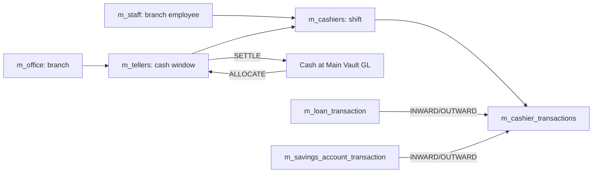
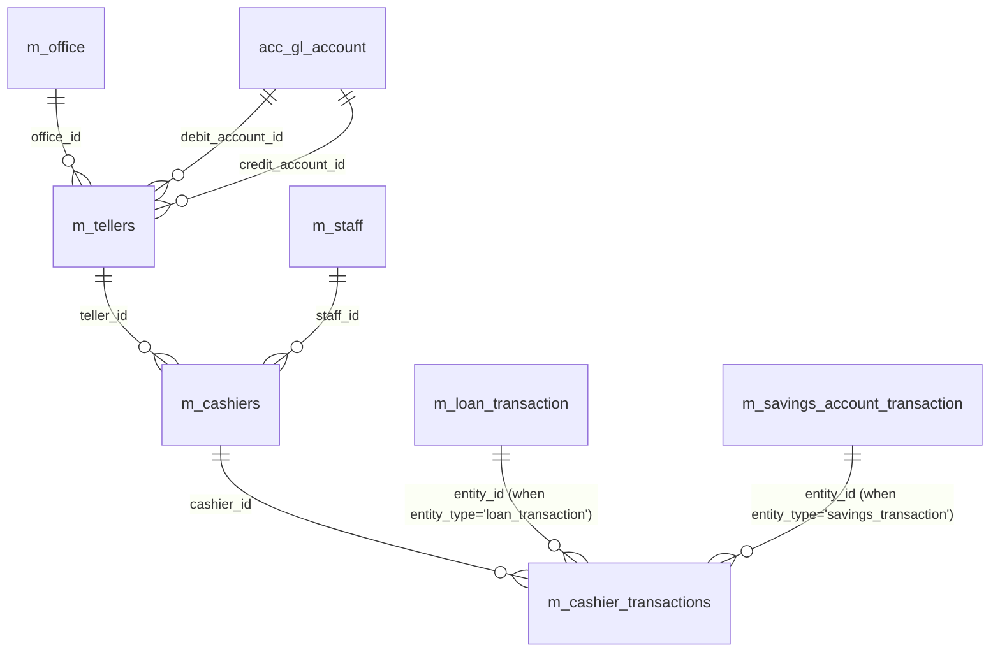
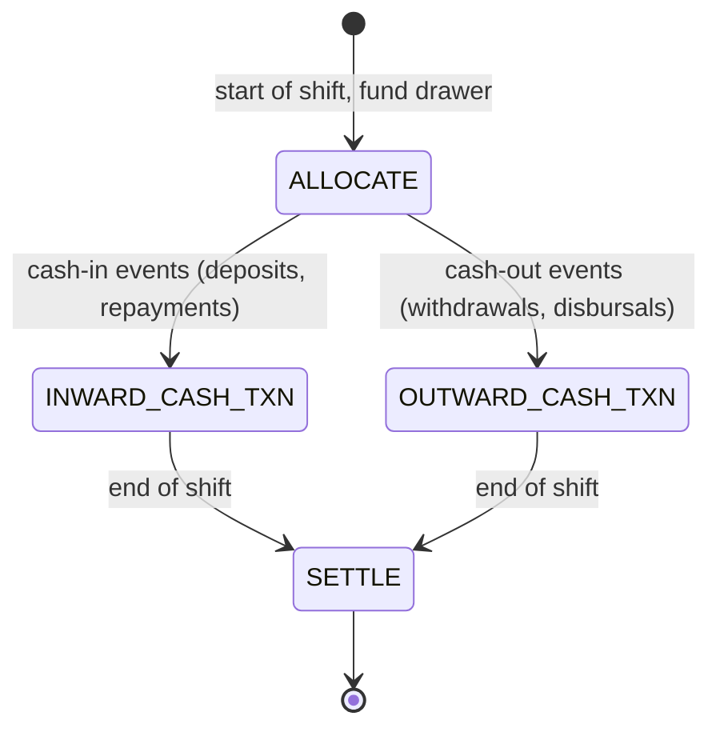

# Teller & Cashier Data Model

This page documents the **cash-drawer** subsystem. Conceptually a *teller*
is a logical cash window at an `m_office` that has its own debit/credit GL
account pair; a *cashier* is a staff member assigned to that window for a
shift; *cashier transactions* are the discrete debit/credit movements that
fund the drawer at start of shift, settle at end of shift, and absorb the
cash-collecting business events (loan repayment by cash, savings deposit
by cash, etc.) that landed on the cashier.

The base tables are seeded by
`fineract-provider/.../changelog/tenant/parts/0001_initial_schema.xml`.
The actual physical names are `m_tellers`, `m_cashiers` and
`m_cashier_transactions` (note `m_tellers` is plural — `m_teller` does not
exist in the schema). JPA entities live in
`org.apache.fineract.organisation.teller.domain.*`.

## Source map

| Cluster element            | JPA entity                                                          | Liquibase changeSet                                       |
| -------------------------- | ------------------------------------------------------------------- | --------------------------------------------------------- |
| `m_tellers`                | `organisation.teller.domain.Teller`                                 | `0001_initial_schema.xml`                                 |
| `m_cashiers`               | `organisation.teller.domain.Cashier`                                | `0001_initial_schema.xml`                                 |
| `m_cashier_transactions`   | `organisation.teller.domain.CashierTransaction`                     | `0001_initial_schema.xml`                                 |

Note: the task brief mentioned `m_teller`; the actual physical table is
`m_tellers`.

Subsystem cross-links:
[`organisation/staff`](/organisation/staff) if your nav has it, the teller
runtime overview, and
[`accounting/journal-entries`](/accounting/journal-entries) (cashier
transactions ultimately produce balanced GL postings against the
`debit_account_id` / `credit_account_id` pinned on the teller).

## Conceptual model



## ER diagram



## `m_tellers`

A teller window at a single office. The two GL accounts pinned on the row
are used for the start-of-day / end-of-day cash-balancing postings.

| Column              | Type           | Nullable | Role                                                                |
| ------------------- | -------------- | -------- | ------------------------------------------------------------------- |
| `id`                | `BIGINT`       | no       | PK.                                                                 |
| `office_id`         | `BIGINT`       | no       | FK → `m_office.id`. Each teller is anchored to a single office.     |
| `debit_account_id`  | `BIGINT`       | yes      | FK → `acc_gl_account.id`. Account hit on cash receipts.             |
| `credit_account_id` | `BIGINT`       | yes      | FK → `acc_gl_account.id`. Account hit on cash payouts.              |
| `name`              | `VARCHAR(50)`  | no       | Unique business name.                                               |
| `description`       | `VARCHAR(100)` | yes      | Free text.                                                          |
| `valid_from`        | `date`         | yes      | Lower bound of the teller's validity.                               |
| `valid_to`          | `date`         | yes      | Upper bound of the teller's validity. NULL = open-ended.            |
| `state`             | `SMALLINT`     | yes      | `TellerStatus` (ACTIVE=300, INACTIVE=400, CLOSED=600, …).           |

The two GL account columns are the linkage point between the teller
subsystem and the
[`models/accounting-and-gl`](/models/accounting-and-gl) ledger. Typical
configuration pins both to the same "Cash on Hand" detail account but the
schema allows separating them for institutions that need different debit /
credit slots.

## `m_cashiers`

A shift assignment — staff member X is the cashier for teller Y between
two dates (and optionally time-of-day slots).

| Column        | Type           | Nullable | Role                                              |
| ------------- | -------------- | -------- | ------------------------------------------------- |
| `id`          | `BIGINT`       | no       | PK.                                               |
| `staff_id`    | `BIGINT`       | yes      | FK → `m_staff.id`.                                |
| `teller_id`   | `BIGINT`       | yes      | FK → `m_tellers.id`.                              |
| `description` | `VARCHAR(100)` | yes      | Free text.                                        |
| `start_date`  | `date`         | yes      | Shift start date.                                 |
| `end_date`    | `date`         | yes      | Shift end date.                                   |
| `start_time`  | `VARCHAR(10)`  | yes      | Shift start time (HH:mm).                         |
| `end_time`    | `VARCHAR(10)`  | yes      | Shift end time (HH:mm).                           |
| `full_day`    | `boolean`      | yes      | When `true`, the time columns are ignored.        |

Multiple cashiers can be assigned to a single teller window so long as the
date / time windows do not overlap.

## `m_cashier_transactions`

The cash-drawer movement log. Each row is a single typed transaction
(`txn_type`) against a cashier; balanced GL postings are derived from this
row when the transaction is committed.

| Column         | Type            | Nullable | Role                                                                            |
| -------------- | --------------- | -------- | ------------------------------------------------------------------------------- |
| `id`           | `BIGINT`        | no       | PK.                                                                             |
| `cashier_id`   | `BIGINT`        | no       | FK → `m_cashiers.id`.                                                           |
| `txn_type`     | `SMALLINT`      | no       | `CashierTxnType`: 101 = ALLOCATE (fund drawer), 102 = SETTLE (drain drawer), 103 = INWARD_CASH_TXN, 104 = OUTWARD_CASH_TXN. |
| `txn_amount`   | `DECIMAL(19,6)` | no       | Amount.                                                                         |
| `txn_date`     | `date`          | no       | Business date.                                                                  |
| `created_date` | `datetime`      | no       | System timestamp.                                                               |
| `entity_type`  | `VARCHAR(50)`   | yes      | When the row mirrors a business txn, this names the source entity (`loan_transaction`, `savings_transaction`, …). |
| `entity_id`    | `BIGINT`        | yes      | Id of the source entity row.                                                    |
| `txn_note`     | `VARCHAR(200)`  | yes      | Free text.                                                                      |
| `currency_code`| `VARCHAR(3)`    | yes      | ISO 4217 (denormalised — should equal the teller's office's organisation currency). |

`entity_type` and `entity_id` together act as a polymorphic FK back into the
business-transaction tables. Their semantics are interpreted by
`CashierTransactionType` consumers and not enforced at the DB level.

### Cashier transaction lifecycle



The drawer cash balance at any point is the algebraic sum of the cashier
transactions with the standard sign convention (allocate positive, settle
negative, inward positive, outward negative).

## GL postings derived from cashier transactions

The teller subsystem doubles as a thin layer on top of the GL. Every
cashier transaction produces a balanced journal-entry pair when it commits,
honouring the GL accounts pinned on `m_tellers`:

| `txn_type`        | Debit                                | Credit                                  | Notes                                              |
| ----------------- | ------------------------------------ | --------------------------------------- | -------------------------------------------------- |
| `ALLOCATE`        | `m_tellers.debit_account_id`         | Cash at Main Vault (financial activity) | Funds the cashier from the institution's main vault.|
| `SETTLE`          | Cash at Main Vault                   | `m_tellers.debit_account_id`            | Drains the cashier back to the vault.              |
| `INWARD_CASH_TXN` | `m_tellers.debit_account_id`         | mirror of the business txn's credit     | Posted when a cash receipt lands on the cashier.   |
| `OUTWARD_CASH_TXN`| mirror of the business txn's debit   | `m_tellers.debit_account_id`            | Posted when a cash payout leaves the cashier.      |

The "Cash at Main Vault" reference resolves through
`acc_gl_financial_activity_account.financial_activity_type =
CASH_AT_MAINVAULT` (see
[`models/accounting-and-gl`](/models/accounting-and-gl)). The `INWARD_CASH_TXN`
and `OUTWARD_CASH_TXN` legs piggy-back on the original business
transaction's posting, replacing the institution-wide Cash account with the
cashier-specific drawer account so that drawer reconciliation works at
end-of-shift.

## Permissions

The teller subsystem ships a sizeable permission set (seeded by
`0001_initial_schema.xml` rows for the teller / cashier entities). Notable
codes:

- `CREATE_TELLER`, `UPDATE_TELLER`, `DELETE_TELLER`.
- `CREATE_CASHIER`, `UPDATE_CASHIER`, `DELETE_CASHIER`, `ALLOCATECASHIER`,
  `SETTLECASHIER`.
- `INCASHTXN_CASHIER`, `OUTCASHTXN_CASHIER` for the per-shift cash flow.

These are exposed via the `/tellers` and `/cashiers` REST surface and
maker-checker is enabled by default for the create / update / delete
actions.

## Lifecycle and constraints

A few rules enforced by the write service that are not strictly visible in
the DDL but worth knowing:

- A teller cannot be soft-deleted while at least one `m_cashiers` row
  references it with `end_date IS NULL` or `end_date > today`.
- Allocation cannot exceed the available vault balance for the configured
  currency at the teller's office.
- Settlement closes the open shift; the `m_cashiers` row's `end_date` is
  updated to the settlement date if it was originally NULL.
- The currency on every `m_cashier_transactions` row must match the
  organisation currency of the parent office (cross-currency drawer
  transactions are not supported).

## Reporting queries

The provided stretchy reports (see
[`models/datatables`](/models/datatables)) include:

- **Cashier Daybook** — lists every `m_cashier_transactions` row for a
  cashier on a given business date and rolls up the balance.
- **Teller Daybook** — aggregates all cashiers under a teller.
- **Cash at Drawer** — projects the running balance per teller.

These reports are read-only and consult only the four tables in this
cluster plus the GL postings derived from them.

## Cross-cluster references

- `m_office`, `m_staff` →
  [`models/offices-staff-organization`](/models/offices-staff-organization).
- `acc_gl_account` and `acc_gl_financial_activity_account` →
  [`models/accounting-and-gl`](/models/accounting-and-gl).
- Source entities referenced by `entity_id` (when populated):
  - `m_loan_transaction` →
    [`models/loans-and-products`](/models/loans-and-products).
  - `m_savings_account_transaction` →
    [`models/savings-and-deposits`](/models/savings-and-deposits).
  - `m_client_transaction` →
    [`models/clients-and-groups`](/models/clients-and-groups).
- Audit references `m_appuser` →
  [`models/users-roles-permissions`](/models/users-roles-permissions).
- Currency code is denormalised from
  [`models/offices-staff-organization`](/models/offices-staff-organization)
  (`m_organisation_currency`).

## Failure modes

A few non-obvious failure modes worth knowing when debugging the teller
subsystem:

1. **Overlapping cashier shifts.** The schema allows overlapping
   `m_cashiers` rows on the same teller; the platform's write service
   normally rejects them but a direct DB insert can create them. The
   "Cash at Drawer" report will then double-count drawer balance because
   two cashiers will claim the same `m_cashier_transactions` rows.
2. **Teller debit/credit accounts disabled.** When an operator disables
   the GL accounts pinned to a teller (`acc_gl_account.disabled = true`),
   subsequent `ALLOCATE` and `SETTLE` operations will fail at
   journal-posting time even though the write service accepts them. The
   `m_cashier_transactions` row is rolled back along with the missing GL
   leg.
3. **Currency mismatch.** When a teller is created for an office that
   later switches its `m_organisation_currency`, the existing cashier
   transactions become unreconcilable. The platform does not auto-migrate
   the historical rows.
4. **Cashier with NULL `staff_id`.** Some legacy installations have
   cashier rows with a NULL staff link. The API will refuse to allocate
   to them; data migration is needed to attach a valid staff member.

## Reading the cashier balance

The canonical balance query for a cashier on a business date is:

```sql
SELECT sum(CASE WHEN txn_type IN (101, 103) THEN txn_amount   -- ALLOCATE, INWARD
                WHEN txn_type IN (102, 104) THEN -txn_amount  -- SETTLE, OUTWARD
           END) AS balance
FROM   m_cashier_transactions
WHERE  cashier_id = :cashierId
AND    txn_date <= :asOfDate
```

The result must equal the physical cash count at end of shift; mismatches
trigger an exception entry in the institution's reconciliation process.
