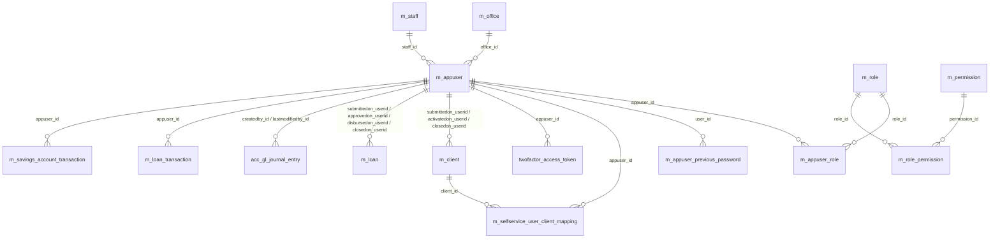

# Users, Roles & Permissions Data Model

This page documents the **identity and authorisation** schema used by every
Apache Fineract REST call. The runtime path is straightforward: Spring
Security loads an `AppUser` from `m_appuser`, joins to `m_appuser_role`,
to `m_role`, to `m_role_permission`, to `m_permission`; the merged set of
permission codes becomes the user's granted authorities. Password history
sits in `m_appuser_previous_password`, validation policy in
`m_password_validation_policy`, and the two-factor extension's tables
(`twofactor_access_token`, `twofactor_configuration`) are included here even
though the runtime lives in `fineract-security`.

Tables are seeded by
`fineract-provider/.../changelog/tenant/parts/0001_initial_schema.xml`.
JPA entities live in `org.apache.fineract.useradministration.domain.*`
(in `fineract-core`).

## Source map

| Cluster element                     | JPA entity                                                  | Liquibase changeSet                   |
| ----------------------------------- | ----------------------------------------------------------- | ------------------------------------- |
| `m_appuser`                         | `useradministration.domain.AppUser`                         | `0001_initial_schema.xml`             |
| `m_role`                            | `useradministration.domain.Role`                            | `0001_initial_schema.xml`             |
| `m_permission`                      | `useradministration.domain.Permission`                      | `0001_initial_schema.xml`             |
| `m_appuser_role`                    | join `AppUser.roles`                                        | `0001_initial_schema.xml`             |
| `m_role_permission`                 | join `Role.permissions`                                     | `0001_initial_schema.xml`             |
| `m_appuser_previous_password`       | `useradministration.domain.AppUserPreviousPassword`         | `0001_initial_schema.xml`             |
| `m_password_validation_policy`      | `useradministration.domain.PasswordValidationPolicy`        | `0001_initial_schema.xml`             |
| `m_selfservice_user_client_mapping` | `portfolio.self.service.domain.SelfServiceRegistration` etc.| `0001_initial_schema.xml`             |
| `twofactor_access_token`            | `infrastructure.security.twofactor.domain.AccessToken`      | `0001_initial_schema.xml`             |
| `twofactor_configuration`           | `infrastructure.security.twofactor.domain.TwoFactorConfiguration`| `0001_initial_schema.xml`        |

Subsystem cross-links:
[`security/overview`](/security/overview),
[`security/security-config`](/security/security-config),
[`security/authentication-api`](/security/authentication-api),
[`security/user-details-api`](/security/user-details-api),
[`security/two-factor-auth`](/security/two-factor-auth),
[`security/password-encoding`](/security/password-encoding) and
`fineract-core` `useradministration-domain`.

## ER diagram



## `m_appuser`

| Column                       | Type           | Nullable | Role                                                              |
| ---------------------------- | -------------- | -------- | ----------------------------------------------------------------- |
| `id`                         | `BIGINT`       | no       | PK.                                                               |
| `is_deleted`                 | `boolean`      | no       | Soft delete. Login is rejected when `true`.                       |
| `office_id`                  | `BIGINT`       | yes      | FK → `m_office.id`. Drives data-scope filters.                    |
| `staff_id`                   | `BIGINT`       | yes      | FK → `m_staff.id` (optional staff linkage).                       |
| `username`                   | `VARCHAR(100)` | no       | Login identifier (unique across non-deleted rows by index).       |
| `firstname` / `lastname`     | `VARCHAR(100)` | no       | Name parts.                                                       |
| `password`                   | `VARCHAR(255)` | no       | BCrypt hash (encoder configured in `fineract-security`).          |
| `email`                      | `VARCHAR(100)` | no       | Email address (used for password reset and notifications).        |
| `firsttime_login_remaining`  | `boolean`      | no       | Forces password change after the first login.                     |
| `nonexpired`                 | `boolean`      | no       | `UserDetails.isAccountNonExpired` mirror.                         |
| `nonlocked`                  | `boolean`      | no       | `UserDetails.isAccountNonLocked` mirror.                          |
| `nonexpired_credentials`     | `boolean`      | no       | `UserDetails.isCredentialsNonExpired` mirror.                     |
| `enabled`                    | `boolean`      | no       | `UserDetails.isEnabled` mirror.                                   |
| `last_time_password_updated` | `date`         | no       | Anchor for the password-expiry validation.                        |
| `password_never_expires`     | `boolean`      | no       | When `true` the policy never expires this user's credentials.     |
| `is_self_service_user`       | `boolean`      | no       | Marks a portal account opened by an external client.              |
| `cannot_change_password`     | `boolean`      | yes      | Disables self-service password change.                            |

Part `0020_add_audit_entries.xml` adds `createdby_id`, `created_date`,
`lastmodifiedby_id`, `lastmodified_date`. See
[`security/user-details-api`](/security/user-details-api).

## `m_role`

| Column        | Type           | Nullable | Role                                          |
| ------------- | -------------- | -------- | --------------------------------------------- |
| `id`          | `BIGINT`       | no       | PK.                                           |
| `name`        | `VARCHAR(100)` | no       | Unique business name (e.g. "Super user").     |
| `description` | `VARCHAR(500)` | no       | Free text.                                    |
| `is_disabled` | `boolean`      | no       | Soft disable. Disabled roles do not contribute permissions. |

## `m_permission`

A single permission token. The code is the surface the rest of the system
checks (`hasAuthority("CREATE_CLIENT")`, etc.). `can_maker_checker = 1` lets
a maker-checker workflow be applied to actions guarded by this permission.

| Column            | Type           | Nullable | Role                                                                             |
| ----------------- | -------------- | -------- | -------------------------------------------------------------------------------- |
| `id`              | `BIGINT`       | no       | PK.                                                                              |
| `grouping`        | `VARCHAR(45)`  | yes      | UI grouping label (e.g. "portfolio", "accounting").                              |
| `code`            | `VARCHAR(100)` | no       | Unique permission code (e.g. `CREATE_LOAN`, `APPROVE_LOAN_CHECKER`).             |
| `entity_name`     | `VARCHAR(100)` | yes      | The domain entity being acted upon (`LOAN`, `CLIENT`).                           |
| `action_name`     | `VARCHAR(100)` | yes      | The action (`CREATE`, `READ`, `UPDATE`, `DELETE`, `APPROVE`).                    |
| `can_maker_checker`| `boolean`     | no       | Whether the permission supports a maker-checker variant.                         |

## `m_appuser_role` and `m_role_permission`

Pure join tables.

### `m_appuser_role`

| Column        | Type     | Nullable | Role                       |
| ------------- | -------- | -------- | -------------------------- |
| `appuser_id`  | `BIGINT` | no       | PK part, FK → `m_appuser.id`.|
| `role_id`     | `BIGINT` | no       | PK part, FK → `m_role.id`. |

### `m_role_permission`

| Column         | Type     | Nullable | Role                          |
| -------------- | -------- | -------- | ----------------------------- |
| `role_id`      | `BIGINT` | no       | PK part, FK → `m_role.id`.    |
| `permission_id`| `BIGINT` | no       | PK part, FK → `m_permission.id`.|

## `m_appuser_previous_password`

History row used by the password-reuse check.

| Column         | Type           | Nullable | Role                                       |
| -------------- | -------------- | -------- | ------------------------------------------ |
| `id`           | `BIGINT`       | no       | PK.                                        |
| `user_id`      | `BIGINT`       | no       | FK → `m_appuser.id`.                       |
| `password`     | `VARCHAR(255)` | no       | BCrypt hash of the retired password.       |
| `removal_date` | `date`         | no       | When this password was rotated out.        |

## `m_password_validation_policy`

A row contains a regex and a description for one rule (e.g. "at least one
digit"). Only one row should have `active = 1`. The active row is consulted
when a user changes their password.

| Column        | Type           | Nullable | Role                                              |
| ------------- | -------------- | -------- | ------------------------------------------------- |
| `id`          | `INT`          | no       | PK.                                               |
| `regex`       | `TEXT`         | no       | Java regex enforced against the candidate password.|
| `description` | `TEXT`         | no       | Human-readable rule.                              |
| `active`      | `boolean`      | no       | Activation flag.                                  |
| `key`         | `VARCHAR(255)` | no       | Logical key (e.g. `simple`, `medium`, `strong`).  |

See [`security/password-encoding`](/security/password-encoding).

## `m_selfservice_user_client_mapping`

When a portal user is granted access to one or more `m_client` records, one
row per (user, client) pair is added here.

| Column       | Type     | Nullable | Role                                |
| ------------ | -------- | -------- | ----------------------------------- |
| `id`         | `BIGINT` | no       | PK.                                 |
| `appuser_id` | `BIGINT` | no       | FK → `m_appuser.id` (must have `is_self_service_user = 1`). |
| `client_id`  | `BIGINT` | no       | FK → `m_client.id`.                 |

## Two-factor tables

### `twofactor_access_token`

| Column       | Type           | Nullable | Role                                            |
| ------------ | -------------- | -------- | ----------------------------------------------- |
| `id`         | `BIGINT`       | no       | PK.                                             |
| `token`      | `VARCHAR(32)`  | no       | Random token issued to the client.              |
| `appuser_id` | `BIGINT`       | no       | FK → `m_appuser.id`.                            |
| `valid_from` | `datetime`     | no       | Lower validity bound.                           |
| `valid_to`   | `datetime`     | no       | Upper validity bound.                           |
| `enabled`    | `boolean`      | no       | When `false`, the token is rejected immediately.|

### `twofactor_configuration`

Key/value bag for global two-factor settings (`SMS_PROVIDER`, `EMAIL_*`, the
token TTL).

| Column  | Type            | Nullable | Role                                  |
| ------- | --------------- | -------- | ------------------------------------- |
| `id`    | `BIGINT`        | no       | PK.                                   |
| `name`  | `VARCHAR(40)`   | no       | Unique key.                           |
| `value` | `VARCHAR(1024)` | yes      | Stringified value.                    |

See [`security/two-factor-auth`](/security/two-factor-auth).

## Authentication flow at the schema level

The Basic-auth / OAuth2 authentication flow consults this cluster in the
following order:

1. **Username lookup.** `AppUserRepository.findAppUserByName(username)`
   selects from `m_appuser` where `username = ? AND is_deleted = false`.
2. **Password verification.** The BCrypt hash in `password` is compared to
   the candidate; `m_password_validation_policy` is *not* consulted here
   — it only fires on password change.
3. **Account-state check.** The five boolean columns
   (`enabled`, `nonexpired`, `nonlocked`, `nonexpired_credentials`,
   `firsttime_login_remaining`) feed Spring Security's `UserDetails`
   contract. A `firsttime_login_remaining = true` forces the API to
   reject every endpoint other than "change password" until the user
   complies.
4. **Authority resolution.** The merged set of `m_permission.code` strings
   is loaded via:

   ```sql
   SELECT DISTINCT p.code
   FROM   m_appuser u
   JOIN   m_appuser_role  ar ON ar.appuser_id  = u.id
   JOIN   m_role          r  ON r.id           = ar.role_id AND r.is_disabled = false
   JOIN   m_role_permission rp ON rp.role_id   = r.id
   JOIN   m_permission    p  ON p.id           = rp.permission_id
   WHERE  u.id = ?
   ```

5. **Two-factor (optional).** If two-factor is enabled, a row in
   `twofactor_access_token` with the candidate token must satisfy
   `enabled = true AND valid_from <= now() < valid_to`.

## Password change flow

When a user submits a new password (via `/users/{id}/password` or the
self-service equivalent), the platform:

1. Loads the candidate's BCrypt hash and compares against every row in
   `m_appuser_previous_password` for the user; if any row hashes the
   candidate, the change is rejected with a "password reuse" error.
2. Loads the single `m_password_validation_policy` row with `active =
   true` and applies its regex; failure rejects with the row's
   `description`.
3. Inserts a row in `m_appuser_previous_password` with the **old** hash and
   `removal_date = today`.
4. Updates `m_appuser.password` with the new hash and stamps
   `last_time_password_updated = today`.
5. Clears `firsttime_login_remaining` if set.

## Data-scope and office hierarchy

Permission-based access control is intersected with data-scope: an action
on a `m_client`, `m_loan`, `m_savings_account`, etc. is allowed only when
the row's office hierarchy is a sub-path of the calling user's
`m_appuser.office_id` hierarchy. This is enforced in
`PortfolioCommandSourceWritePlatformService` and the various read services
through a "scoped office hierarchy" filter that joins to
`m_office.hierarchy`. The intersection means: even a user with the
`CHECKER_*` super-permission cannot approve a loan in a branch not under
their office subtree.

The `c_configuration` flags `office-specific-products-enabled` and
`restrict-products-to-user-office` further narrow the products a user may
operate on; see
[`models/configuration-and-codes`](/models/configuration-and-codes).

## Maker-checker tracking

Maker-checker is realised through the
`m_portfolio_command_source` table (documented in the command framework).
Each row keeps the `command` payload, the `maker_id`, the `checker_id` and
the approval state — both ids point back to `m_appuser`. The
`m_permission.can_maker_checker` column is the per-permission switch that
determines whether a checker action is even possible; the runtime flag
`maker-checker` in `c_configuration` is the master switch.

## Self-service users

Self-service users (`is_self_service_user = true`) are subject to a
different authority resolution: their access to portfolio entities is
restricted to the `m_client` rows they are explicitly mapped to through
`m_selfservice_user_client_mapping`. Even if a self-service user is granted
`READ_LOAN` through a role, they will only see loans whose
`m_loan.client_id` appears in the mapping table.

Self-service users use a smaller set of permissions, all prefixed with
`SELFSERVICE_`. The seed data file installs the canonical set; custom
extensions of self-service can introduce additional permissions but should
gate the relevant API surface on them.

## Cross-cluster references

- `m_office`, `m_staff` →
  [`models/offices-staff-organization`](/models/offices-staff-organization).
- `m_client` (used by `m_selfservice_user_client_mapping`) →
  [`models/clients-and-groups`](/models/clients-and-groups).
- Maker-checker rows live in `m_portfolio_command_source` (the command
  framework table) and are documented in
  [`core/commands-framework`](/core/commands-framework).
- `c_configuration` flags that gate authentication / data-scope behaviour
  live in [`models/configuration-and-codes`](/models/configuration-and-codes).
- Every audit-stamped table in Fineract references `m_appuser` (via
  `createdby_id`, `lastmodifiedby_id`, `submittedon_userid`,
  `approvedon_userid`, `disbursedon_userid`, `closedon_userid`,
  `appuser_id`); see all sibling pages.
