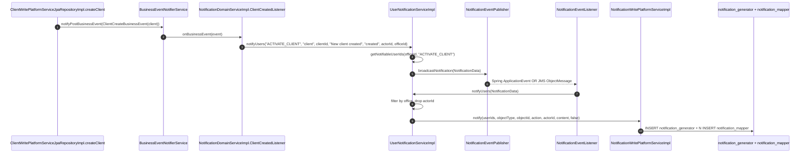

Apache Fineract ships an in-app **notification subsystem** that turns selected `BusinessEvent`s — a client being created, a loan being approved, a savings deposit posted — into per-user inbox rows that authenticated users read through `/v1/notifications`. It is split across two Gradle modules: [`fineract-core`](https://github.com/apache/fineract/tree/develop/fineract-core/src/main/java/org/apache/fineract/notification) exposes the shared `NotificationData` DTO and `UserNotificationService` SPI, and [`fineract-provider`](https://github.com/apache/fineract/tree/develop/fineract-provider/src/main/java/org/apache/fineract/notification) ships the listeners, JMS / Spring event glue, JPA entities, JDBC read service, and REST resource.

This page is the entry point. It walks the package layout, names every concrete class, and shows the end-to-end flow from a domain mutation to a row appearing in `notification_mapper` for a specific `AppUser`. The follow-up pages drill into the listener wiring, the dual Spring-event / ActiveMQ transport, and the REST surface.

## What you can build on top of it

The subsystem ships the producer (business event → inbox row), the transport, the persistence, and the read REST endpoint. Consumers typically do one or more of:

* **Front-end inbox** — poll `/v1/notifications` (unread by default) every N seconds, surface the count, render each item with deep-link metadata (`objectType` + `objectId`).
* **Server-side fanout** — replace `UserNotificationServiceImpl` with one that also calls an external push / email / SMS provider after the JDBC write. The `@ConditionalOnMissingBean` wiring in `NotificationConfiguration` makes the swap a single bean definition.
* **Multi-tenant analytics** — read `notification_generator` directly; the `tenant`-scoped data warehouse views can aggregate by `object_type`, `action`, and `actor`.
* **Audit cross-checks** — the rows in `notification_generator` are a parallel record of which significant business actions completed. They are not the source of truth (the underlying JPA writes are), but they can flag drift.

What the subsystem deliberately does **not** do today:

* Per-user opt-in / opt-out — every user with the right permission and office gets a row.
* Rich content — `content` is a fixed string per event type, not a templated message.
* Channels — the inbox is the only sink. Push / email / SMS require a custom listener.
* Cross-tenant — `tenantIdentifier` is part of the payload, but every consumer reads / writes within the tenant context it inherits.

## What the subsystem does

<CardGroup cols={2}>
  <Card title="Business event → notification" icon="bell">
    `NotificationDomainServiceImpl` registers `BusinessEventListener`s for ~20 post-commit events (`ClientCreateBusinessEvent`, `LoanApprovedBusinessEvent`, `SavingsDepositBusinessEvent`, …) and turns each into a `NotificationData`.
  </Card>
  <Card title="Per-office permission fanout" icon="users">
    `UserNotificationServiceImpl.getNotifiableUserIds` queries `appUserRepository.findByOfficeId` and keeps users that hold the relevant permission or `ALL_FUNCTIONS`. The actor is filtered out.
  </Card>
  <Card title="Spring or ActiveMQ transport" icon="arrows-rotate">
    A `NotificationEventPublisher` either publishes a Spring `ApplicationEvent` (default, `@Profile("!activeMqEnabled")`) or sends a JMS `ObjectMessage` onto `NotificationQueue` when the `activeMqEnabled` profile is on.
  </Card>
  <Card title="Persistent inbox" icon="inbox">
    The listener side fans the notification out into one `notification_generator` row plus N `notification_mapper` rows — one per recipient — and the user reads them through `NotificationApiResource`.
  </Card>
</CardGroup>

## Package map

| Package | Module | Role |
| --- | --- | --- |
| `org.apache.fineract.notification.data` | `fineract-core` | `NotificationData` DTO (Serializable, used in JMS payloads). |
| `org.apache.fineract.notification.service` | `fineract-core` | `UserNotificationService` SPI used by domain code. |
| `org.apache.fineract.notification.eventandlistener` | `fineract-provider` | `NotificationEventPublisher` / `NotificationEventListener` and their Spring + ActiveMQ implementations. |
| `org.apache.fineract.notification.service` | `fineract-provider` | `NotificationDomainServiceImpl`, `UserNotificationServiceImpl`, read / write services, JDBC row mappers. |
| `org.apache.fineract.notification.domain` | `fineract-provider` | JPA entities `Notification` (table `notification_generator`) and `NotificationMapper` (table `notification_mapper`). |
| `org.apache.fineract.notification.api` | `fineract-provider` | `NotificationApiResource` — `/v1/notifications` GET and PUT. |
| `org.apache.fineract.notification.config` | `fineract-provider` | `MessagingConfiguration` — ActiveMQ broker, `JmsTemplate`, and `DefaultMessageListenerContainer` (only when `activeMqEnabled`). |
| `org.apache.fineract.notification.starter` | `fineract-provider` | `NotificationConfiguration` — `@Bean`s for all services, gated by `@ConditionalOnMissingBean`. |
| `org.apache.fineract.notification.cache` | `fineract-provider` | `CacheNotificationResponseHeader` — per-tenant cache used by the unread-flag endpoint. |

## End-to-end flow

```mermaid
flowchart LR
    Domain[Domain mutation\nLoanWritePlatformServiceImpl, ClientWritePlatformServiceImpl, ...]
    Notifier[BusinessEventNotifierService\nnotifyPostBusinessEvent]
    Listener["BusinessEventListener\nNotificationDomainServiceImpl inner classes"]
    UNS[UserNotificationServiceImpl.notifyUsers\nbuilds NotificationData]
    Pub{{NotificationEventPublisher}}
    SpringPub[SpringNotificationEventPublisher\nApplicationEventPublisher]
    AmqPub[ActiveMQNotificationEventPublisher\nJmsTemplate -> NotificationQueue]
    SpringSub[SpringNotificationEventListener\nApplicationListener]
    AmqSub[ActiveMQNotificationEventListener\nSessionAwareMessageListener]
    Sink[NotificationEventListener\nuserNotificationService.notifyUsers]
    Write[NotificationWritePlatformServiceImpl\nnotification_generator + notification_mapper]
    DB[(JPA / EclipseLink)]
    Inbox[NotificationApiResource\nGET /v1/notifications]

    Domain --> Notifier --> Listener --> UNS --> Pub
    Pub -->|profile != activeMqEnabled| SpringPub --> SpringSub --> Sink
    Pub -->|profile = activeMqEnabled| AmqPub --> AmqSub --> Sink
    Sink --> Write --> DB
    DB --> Inbox
```



The hand-off goes through `NotificationEventPublisher.broadcastNotification(NotificationData)` regardless of transport, and the receiving side always calls back into `NotificationEventListener.receive(...)` which finally invokes `UserNotificationService.notifyUsers(NotificationData)` on the inbound side. The split lets domain transactions complete first (commit), then the publish happens, then the listener inserts inbox rows in a separate transaction or thread.

## The data shape

`NotificationData` lives in `fineract-core/.../notification/data/NotificationData.java` and is `Serializable` so the same object can travel through a Spring `ApplicationEvent` or a JMS `ObjectMessage`:

```java
// fineract-core/src/main/java/org/apache/fineract/notification/data/NotificationData.java
@Data
@NoArgsConstructor
@Accessors(chain = true)
public class NotificationData implements Serializable {

    private Long id;
    private String objectType;        // "client", "loan", "savingsAccount", ...
    private Long objectId;
    private String action;            // "created", "approved", "depositMade", ...
    private Long actorId;             // AppUser that triggered the event
    private String content;           // human-readable text
    private boolean isRead;
    private boolean isSystemGenerated;
    private String tenantIdentifier;  // resolved from ThreadLocalContextUtil
    private String createdAt;
    private Long officeId;            // used to limit fanout
    private Set<Long> userIds;        // candidate recipients
}
```

The producing side fills `objectType`, `objectId`, `action`, `content`, `actorId`, `officeId`, `tenantIdentifier`, and the candidate `userIds` set. The consuming side intersects `userIds` with the recipients that actually belong to `officeId`, drops the actor, and persists a `Notification` row plus one `NotificationMapper` row per surviving recipient.

## Storage model

Two tables back the inbox. Schemas come from the JPA entities in `fineract-provider/.../notification/domain/`:

| Table | Entity | Purpose |
| --- | --- | --- |
| `notification_generator` | `Notification` | One row per published notification; columns `object_type`, `object_identifier`, `action`, `actor`, `is_system_generated`, `notification_content`, `created_at`. |
| `notification_mapper` | `NotificationMapper` | One row per recipient; FK `notification_id` → `notification_generator.id`, FK `user_id` → `m_appuser.id`, plus `is_read` and `created_at`. |

`NotificationReadPlatformServiceImpl` joins them with `INNER JOIN notification_generator ng ON nm.notification_id = ng.id` and filters by `nm.user_id = ?` plus `nm.is_read = ?` to render the user-scoped inbox view (see [API page](/notification/notification-api)).

## Feature flag

The whole subsystem is gated by a single property:

```properties
# fineract-provider/src/main/resources/application.properties
fineract.notification.user-notification-system.enabled=${FINERACT_USER_NOTIFICATION_SYSTEM_ENABLED:true}
```

Both `notifyUsers(...)` overloads in `UserNotificationServiceImpl` early-return when `fineractProperties.getNotification().getUserNotificationSystem().isEnabled()` is `false`, so when you disable it neither the producer nor the consumer does any work. `hasUnreadUserNotifications(Long)` likewise returns `false`.

## How a single event becomes inbox rows

The sequence below traces `ClientCreateBusinessEvent` end to end. The class names and method signatures are real:



Each numbered step corresponds to a method you can grep for. The pages that follow:

* [`notification-event-listener`](/notification/notification-event-listener) — every `BusinessEventListener` inner class inside `NotificationDomainServiceImpl` and the permission / object-type table it produces.
* [`spring-and-activemq`](/notification/spring-and-activemq) — the `@Profile("activeMqEnabled")` switch, the `MessagingConfiguration` broker setup, and the JMS message format.
* [`notification-api`](/notification/notification-api) — the `/v1/notifications` REST resource, the unread-only default, mark-as-read PUT, and the per-tenant unread-flag cache.

## Cross references

| Topic | Page |
| --- | --- |
| `NotificationData` DTO, shared SPI in `fineract-core` | [`/core/notification-data`](/core/notification-data) |
| The `BusinessEventNotifierService` and `BusinessEventListener` plumbing | [`/core/event-business`](/core/event-business) |
| `CommandHandler` framework that ultimately fires the business events | [`/command/overview`](/command/overview) |
| Tenant resolution used to stamp `tenantIdentifier` on every `NotificationData` | [`/core/datasource-tenant-routing`](/core/datasource-tenant-routing) |
| `AppUser` and permission model used by the office / `ALL_FUNCTIONS` filter | [`/core/security-services`](/core/security-services) |

## Build / wiring guarantees

`NotificationConfiguration` in `fineract-provider/.../notification/starter/NotificationConfiguration.java` is a plain `@Configuration` that registers every service bean with `@ConditionalOnMissingBean`, so a downstream module can replace any of them by exposing its own bean:

```java
@Bean
@ConditionalOnMissingBean(NotificationDomainService.class)
public NotificationDomainService notificationDomainService(BusinessEventNotifierService businessEventNotifierService,
        PlatformSecurityContext context, UserNotificationService userNotificationService) {
    return new NotificationDomainServiceImpl(businessEventNotifierService, context, userNotificationService);
}

@Bean
@ConditionalOnMissingBean(UserNotificationService.class)
public UserNotificationService userNotificationService(NotificationEventPublisher notificationEventPublisher,
        AppUserRepository appUserRepository, FineractProperties fineractProperties,
        NotificationReadPlatformService notificationReadPlatformService,
        NotificationWritePlatformService notificationWritePlatformService) {
    return new UserNotificationServiceImpl(notificationEventPublisher, appUserRepository, fineractProperties,
            notificationReadPlatformService, notificationWritePlatformService);
}
```

`NotificationDomainServiceImpl.addListeners()` is annotated `@PostConstruct`, so the moment Spring finishes wiring the bean, all ~20 `BusinessEventListener` instances are registered through `BusinessEventNotifierService.addPostBusinessEventListener(class, listener)`. This means notifications are wired purely by the presence of the bean — there is no extra activator.

## Failure isolation

Two design choices make sure notification problems do not break business transactions:

1. `UserNotificationServiceImpl.notifyUsers(String, String, ...)` wraps `notificationEventPublisher.broadcastNotification(...)` in `try / catch (Exception e)` and only logs the failure. The originating domain transaction therefore commits even if the publish throws.
2. Listener registration is `addPostBusinessEventListener`, so the listener runs *after* the business event's commit phase. A listener exception cannot roll back the original loan / client / savings write.

This is why the architecture is best modelled as "fire and forget after commit" — the inbox is eventually-consistent with the domain, never atomic with it.

## When to read which page

| You want to … | Read |
| --- | --- |
| add a new business event → inbox mapping | [Event listener](/notification/notification-event-listener) |
| change deployment from in-process Spring events to ActiveMQ | [Spring & ActiveMQ](/notification/spring-and-activemq) |
| build a UI on top of the inbox or call mark-as-read | [Notification API](/notification/notification-api) |
| understand the `NotificationData` DTO contract used by JMS payloads | [`/core/notification-data`](/core/notification-data) |
| trace which `BusinessEvent` your code already fires | [`/core/event-business`](/core/event-business) |

## File pointer reference

The table below lets you jump straight to the source. All paths are relative to the repo root.

| Concern | File |
| --- | --- |
| Producer entry point | `fineract-provider/src/main/java/org/apache/fineract/notification/service/NotificationDomainServiceImpl.java` |
| Per-user fanout | `fineract-provider/src/main/java/org/apache/fineract/notification/service/UserNotificationServiceImpl.java` |
| Publisher interface | `fineract-provider/src/main/java/org/apache/fineract/notification/eventandlistener/NotificationEventPublisher.java` |
| Spring publisher / listener | `fineract-provider/src/main/java/org/apache/fineract/notification/eventandlistener/SpringNotificationEvent{Publisher,Listener}.java` |
| ActiveMQ publisher / listener | `fineract-provider/src/main/java/org/apache/fineract/notification/eventandlistener/ActiveMQNotificationEvent{Publisher,Listener}.java` |
| Spring `ApplicationEvent` wrapper | `fineract-provider/src/main/java/org/apache/fineract/notification/eventandlistener/NotificationEvent.java` |
| Common listener sink | `fineract-provider/src/main/java/org/apache/fineract/notification/eventandlistener/NotificationEventListener.java` |
| Broker config (`activeMqEnabled`) | `fineract-provider/src/main/java/org/apache/fineract/notification/config/MessagingConfiguration.java` |
| Spring `@Bean`s | `fineract-provider/src/main/java/org/apache/fineract/notification/starter/NotificationConfiguration.java` |
| JPA entities | `fineract-provider/src/main/java/org/apache/fineract/notification/domain/{Notification,NotificationMapper}.java` |
| Read service + RowMappers | `fineract-provider/src/main/java/org/apache/fineract/notification/service/NotificationReadPlatformServiceImpl.java` |
| Write service | `fineract-provider/src/main/java/org/apache/fineract/notification/service/NotificationWritePlatformServiceImpl.java` |
| REST resource | `fineract-provider/src/main/java/org/apache/fineract/notification/api/NotificationApiResource.java` |
| Unread-flag cache | `fineract-provider/src/main/java/org/apache/fineract/notification/cache/CacheNotificationResponseHeader.java` |
| Shared DTO (`fineract-core`) | `fineract-core/src/main/java/org/apache/fineract/notification/data/NotificationData.java` |
| Shared SPI (`fineract-core`) | `fineract-core/src/main/java/org/apache/fineract/notification/service/UserNotificationService.java` |
| Instance-mode condition for publisher / broker | `fineract-core/src/main/java/org/apache/fineract/infrastructure/core/condition/EnableFineractEventsCondition.java` |
| Instance-mode condition for listener | `fineract-core/src/main/java/org/apache/fineract/infrastructure/core/condition/EnableFineractEventListenerCondition.java` |

## Key invariants

To save a debugging round trip, internalise these:

1. **Listeners run post-commit.** The originating domain transaction has already committed before any notification work begins, so a notification failure cannot roll the domain change back.
2. **The actor never receives a notification about their own action.** Filtered out in `UserNotificationServiceImpl.notifyUsers(NotificationData)` after the office re-check.
3. **The office filter is applied twice.** Once at produce time (`getNotifiableUserIds(officeId, permission)`), once at consume time (the office re-check). The second guards against stale `userIds`.
4. **The unread flag has a one-second per-instance cache.** Don't expect cross-node mark-as-read to be reflected instantly.
5. **The feature flag short-circuits both sides.** Disabling it stops both publish *and* consume — no rows are written and `hasUnreadNotifications` returns `false`.
6. **Tenant identity travels in the payload.** `NotificationData.tenantIdentifier` is set by the producer and is the source of truth for the consumer; do not rely on the JMS listener's thread-local context.
