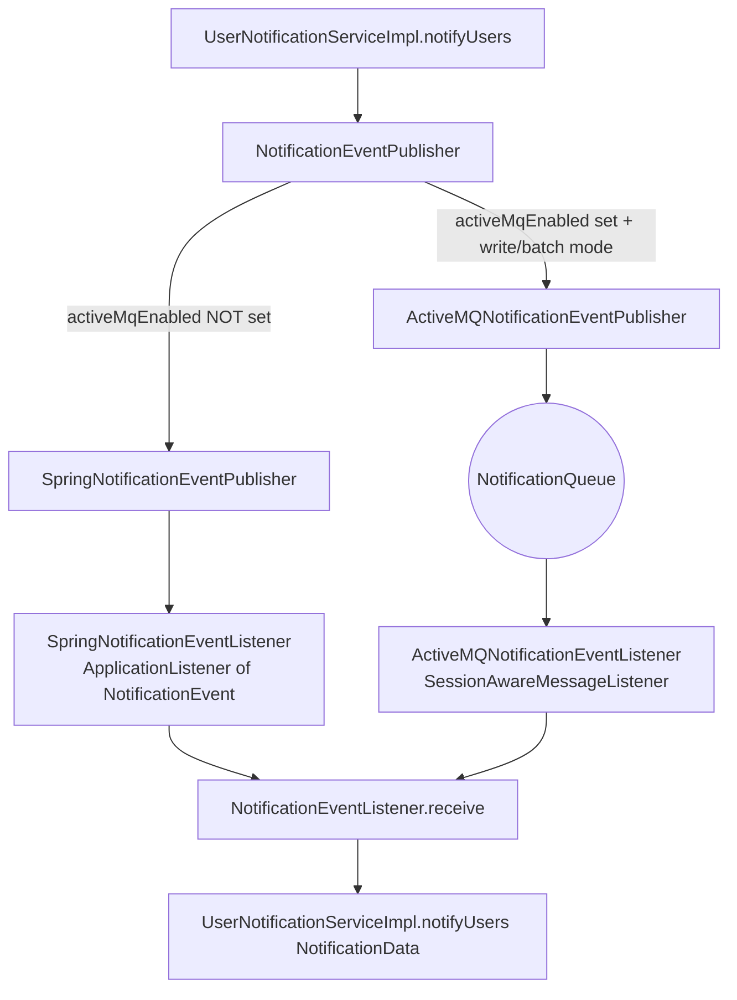

The Apache Fineract notification subsystem is transport-agnostic: producers always call `NotificationEventPublisher.broadcastNotification(NotificationData)`, and consumers always end up calling `NotificationEventListener.receive(NotificationData)`. What sits between them is selectable through a Spring profile. By default the transport is an in-process `ApplicationEvent`; with the `activeMqEnabled` profile active the transport becomes a JMS `ObjectMessage` on the `NotificationQueue` ActiveMQ destination. This page documents both code paths, the broker configuration, the instance-mode conditions, and the on-wire format.

## The interface

```java
// fineract-provider/src/main/java/org/apache/fineract/notification/eventandlistener/NotificationEventPublisher.java
public interface NotificationEventPublisher {
    void broadcastNotification(NotificationData notificationData);
}
```

There are exactly two implementations and they are mutually exclusive through `@Profile`:

| Implementation | Profile | Transport |
| --- | --- | --- |
| `SpringNotificationEventPublisher` | `@Profile("!activeMqEnabled")` | Spring `ApplicationEventPublisher`, same JVM, synchronous by default. |
| `ActiveMQNotificationEventPublisher` | `@Profile("activeMqEnabled")` + `@Conditional(EnableFineractEventsCondition.class)` | `JmsTemplate` sending an `ObjectMessage` to the `NotificationQueue` ActiveMQ queue. |

The Spring `ApplicationContext` only ever has one `NotificationEventPublisher` bean wired, so callers are unaware of which transport is active.

## Choice flow



## Spring transport — the default

```java
// fineract-provider/src/main/java/org/apache/fineract/notification/eventandlistener/SpringNotificationEventPublisher.java
@Service
@Profile("!activeMqEnabled")
@RequiredArgsConstructor
@Slf4j
public class SpringNotificationEventPublisher implements NotificationEventPublisher {

    private final ApplicationEventPublisher applicationEventPublisher;

    @Override
    public void broadcastNotification(final NotificationData notificationData) {
        log.debug("Sending Spring notification event: {}", notificationData);
        NotificationEvent event = new NotificationEvent(SpringNotificationEventPublisher.class, notificationData,
                ThreadLocalContextUtil.getContext());
        applicationEventPublisher.publishEvent(event);
    }
}
```

`NotificationEvent` extends `FineractEvent` (which itself extends `ApplicationEvent`) and carries the current `FineractContext`. That means the listener can re-establish the tenant, user, and locale state — important because Spring's listener may run on a different thread when async listeners are configured.

```java
@SuppressWarnings("serial")
public class NotificationEvent extends FineractEvent {

    private NotificationData notificationData;

    public NotificationEvent(Object source, NotificationData notificationData, FineractContext context) {
        super(source, context);
        this.notificationData = notificationData;
    }

    public NotificationData getNotificationData() { return notificationData; }
}
```

The matching listener installs and tears down the `ThreadLocalContextUtil` state before dispatching to the shared sink:

```java
// fineract-provider/src/main/java/org/apache/fineract/notification/eventandlistener/SpringNotificationEventListener.java
@Component
@Profile("!activeMqEnabled")
@RequiredArgsConstructor
@Slf4j
public class SpringNotificationEventListener implements ApplicationListener<NotificationEvent> {

    private final NotificationEventListener notificationEventListener;

    @Override
    public void onApplicationEvent(@NonNull final NotificationEvent event) {
        log.debug("Processing Spring notification event {}", event);
        try {
            ThreadLocalContextUtil.init(event.getContext());
            final NotificationData notificationData = event.getNotificationData();
            notificationEventListener.receive(notificationData);
        } finally {
            ThreadLocalContextUtil.reset();
        }
    }
}
```

The publish is **synchronous** by default — Spring delivers `ApplicationEvent`s on the publishing thread unless an `ApplicationEventMulticaster` with a `TaskExecutor` is configured. That keeps the listener inside the originating HTTP request's lifecycle. Because `UserNotificationServiceImpl.notifyUsers(String, ...)` already wraps the call in a `try / catch (Exception)`, a listener failure is logged and dropped, not propagated.

When to pick the Spring transport:

* **Single-instance deployments** where every notification stays in-process.
* **No JMS broker available** — this is the zero-infrastructure default.
* **Lower latency** — the listener insert happens in the same JVM, no network hop.

## ActiveMQ transport

When the `activeMqEnabled` profile is on, the producer becomes:

```java
// fineract-provider/src/main/java/org/apache/fineract/notification/eventandlistener/ActiveMQNotificationEventPublisher.java
@Service
@Profile("activeMqEnabled")
@Conditional(EnableFineractEventsCondition.class)
@RequiredArgsConstructor
public class ActiveMQNotificationEventPublisher implements NotificationEventPublisher {

    private final JmsTemplate jmsTemplate;

    @Override
    public void broadcastNotification(NotificationData notificationData) {
        Queue queue = new ActiveMQQueue("NotificationQueue");
        this.jmsTemplate.send(queue, session -> session.createObjectMessage(notificationData));
    }
}
```

Three things to call out:

1. **Queue name is hard-coded** to `NotificationQueue` (`org.apache.activemq.command.ActiveMQQueue`). It is also wired into `messageListenerContainer.setDestinationName(...)`. There is no externalised property.
2. The payload is a Java `ObjectMessage` — `NotificationData implements Serializable`. JMS receivers must trust the class on the classpath.
3. The producer bean is also gated by `EnableFineractEventsCondition` — see the **instance mode** section below.

The consumer:

```java
// fineract-provider/src/main/java/org/apache/fineract/notification/eventandlistener/ActiveMQNotificationEventListener.java
@Component
@Profile("activeMqEnabled")
@Conditional(EnableFineractEventListenerCondition.class)
@RequiredArgsConstructor
public class ActiveMQNotificationEventListener implements SessionAwareMessageListener {

    private final NotificationEventListener notificationEventListener;

    @Override
    public void onMessage(Message message, Session session) throws JMSException {
        if (message instanceof ObjectMessage) {
            NotificationData notificationData = (NotificationData) ((ObjectMessage) message).getObject();
            notificationEventListener.receive(notificationData);
        }
    }
}
```

Important: the ActiveMQ listener does **not** re-install `ThreadLocalContextUtil` — `NotificationData` carries `tenantIdentifier` and the downstream code that needs a tenant reads it from the payload rather than from the thread local. If you add downstream logic that requires the full `FineractContext`, you must reconstruct it from the JMS context yourself.

## Broker configuration

The broker, `ConnectionFactory`, `JmsTemplate`, and `DefaultMessageListenerContainer` all live in one `@Configuration`:

```java
// fineract-provider/src/main/java/org/apache/fineract/notification/config/MessagingConfiguration.java
@Configuration
@Profile("activeMqEnabled")
@Conditional(EnableFineractEventsCondition.class)
public class MessagingConfiguration {

    @Autowired private Environment env;
    @Autowired private NotificationEventListener notificationEventListener;

    private static final String DEFAULT_BROKER_URL = "tcp://localhost:61616";

    @Bean
    public ActiveMQConnectionFactory amqConnectionFactory() {
        ActiveMQConnectionFactory amqConnectionFactory = new ActiveMQConnectionFactory(); // NOSONAR
        try {
            amqConnectionFactory.setBrokerURL(DEFAULT_BROKER_URL);
        } catch (Exception e) {
            amqConnectionFactory.setBrokerURL(this.env.getProperty("brokerUrl"));
        }
        return amqConnectionFactory;
    }

    @Bean public CachingConnectionFactory connectionFactory() {
        return new CachingConnectionFactory(amqConnectionFactory());
    }

    @Bean public JmsTemplate jmsTemplate() {
        JmsTemplate jmsTemplate = new JmsTemplate(connectionFactory());
        jmsTemplate.setConnectionFactory(connectionFactory());
        return jmsTemplate;
    }

    @Bean
    public DefaultMessageListenerContainer messageListenerContainer() {
        DefaultMessageListenerContainer messageListenerContainer = new DefaultMessageListenerContainer();
        messageListenerContainer.setConnectionFactory(connectionFactory());
        messageListenerContainer.setDestinationName("NotificationQueue");
        messageListenerContainer.setMessageListener(notificationEventListener);
        messageListenerContainer.setExceptionListener(new ExceptionListener() {
            @Override
            public void onException(JMSException jmse) {
                loggerBean().error("Network Error: ActiveMQ Broker Unavailable.");
                messageListenerContainer.shutdown();
            }
        });
        return messageListenerContainer;
    }
}
```

| Bean | Configuration |
| --- | --- |
| `ActiveMQConnectionFactory` | broker URL `tcp://localhost:61616` by default; falls back to `env.getProperty("brokerUrl")` on exception. |
| `CachingConnectionFactory` | wraps the AMQ factory for connection / session caching. |
| `JmsTemplate` | thin façade for the publisher. |
| `DefaultMessageListenerContainer` | binds `NotificationEventListener` (note: the wrapping listener bean, not `ActiveMQNotificationEventListener` directly) to `NotificationQueue`. On broker disconnect the container shuts itself down. |

The `NotificationEventListener` passed into `messageListenerContainer.setMessageListener` is the **plain** Spring bean — `messageListenerContainer` is the Spring JMS container, so when a message arrives the `SessionAwareMessageListener` (`ActiveMQNotificationEventListener`) is what gets the callback through the JMS plumbing.

### Setting `brokerUrl`

To point at a non-default broker, set the `brokerUrl` property (env var `BROKER_URL` in a Spring Boot env) **and** trigger the catch block. Because the implementation only reads `brokerUrl` from the environment when the `setBrokerURL` of the default URL throws, in practice the most reliable approach today is to also override the bean via your own `@Configuration` with a higher precedence. Note that this is a known wart of the current setup.

## Choosing the profile

The Spring profile selector lives at the JVM startup level. Set one of:

| Property | Effect |
| --- | --- |
| `spring.profiles.active=activeMqEnabled` | Activates the JMS publisher, JMS listener, and broker config. |
| `SPRING_PROFILES_ACTIVE=activeMqEnabled` | Same, via env var. |
| No profile or any profile that is not `activeMqEnabled` | Default Spring transport. |

There is no parallel `fineract.notification.spring-events.enabled` switch — the profile *is* the switch. (The string `spring-events.enabled` only exists for the remote Spring Batch job message handler.)

## Instance mode conditions

Both ActiveMQ beans are also gated by `Condition`s rooted in `FineractInstanceModeConstants`. They decide whether **this** instance should publish and / or listen depending on the read / write / batch mode flags:

```java
// fineract-core/.../infrastructure/core/condition/EnableFineractEventsCondition.java
public class EnableFineractEventsCondition implements Condition {
    @Override
    public boolean matches(ConditionContext context, AnnotatedTypeMetadata metadata) {
        boolean isReadModeEnabled  = ... // FINERACT_MODE_READ_ENABLE_PROPERTY
        boolean isWriteModeEnabled = ... // FINERACT_MODE_WRITE_ENABLE_PROPERTY
        boolean isBatchModeEnabled = ... // FINERACT_MODE_BATCH_ENABLE_PROPERTY
        return !isReadModeEnabled && (isWriteModeEnabled || isBatchModeEnabled);
    }
}
```

```java
// fineract-core/.../infrastructure/core/condition/EnableFineractEventListenerCondition.java
public class EnableFineractEventListenerCondition implements Condition {
    @Override
    public boolean matches(ConditionContext context, AnnotatedTypeMetadata metadata) {
        // ...
        return (isReadModeEnabled && isBatchModeEnabled && isWriteModeEnabled)   // All mode
                || (!isReadModeEnabled && !isBatchModeEnabled && isWriteModeEnabled); // Write mode
    }
}
```

| Instance mode | `EnableFineractEventsCondition` (publisher, broker) | `EnableFineractEventListenerCondition` (consumer) |
| --- | --- | --- |
| All (read+write+batch) | false — no JMS publisher | true — listens |
| Write only | true | true |
| Write + batch | true | false |
| Read only | false | false |

In practice that means in a multi-instance topology you typically run a **write** or **write+batch** instance that *publishes* and one **all** or **write** instance that *listens* and writes the inbox rows. See [`/core/instance-mode`](/core/instance-mode) for the full enable/disable matrix.

## On-the-wire format

Both transports carry the same Java object — `NotificationData` — without translation:

* **Spring**: the publisher constructs a `NotificationEvent(source, notificationData, FineractContext)` and `publishEvent` walks the listener list synchronously.
* **JMS**: `session.createObjectMessage(notificationData)` writes the Java-serialized form of the DTO. The receiver casts back with `(NotificationData) ((ObjectMessage) message).getObject()`. The class signature, fields, and `serialVersionUID = 1L` are part of the contract.

The fields you'll see in an `ObjectMessage` payload (all `private` in `NotificationData`):

```text
id, objectType, objectId, action, actorId, content,
isRead (=false at publish time), isSystemGenerated (=false from this path),
tenantIdentifier, createdAt, officeId, userIds (Set<Long>)
```

`tenantIdentifier` is the only field the JMS consumer relies on for routing tenant-scoped writes (the listener does **not** call `ThreadLocalContextUtil.init` like the Spring listener does, so downstream code that needs the tenant context must read it from the payload or be set up separately).

## Operational concerns

| Concern | Spring transport | ActiveMQ transport |
| --- | --- | --- |
| Cross-JVM delivery | No — same JVM only | Yes — across cluster |
| Persistence on failure | Lost if listener throws (logged, swallowed by producer wrapper) | Kept on queue until consumed (broker persistence depends on AMQ config) |
| Backpressure | None — synchronous | JMS prefetch + `DefaultMessageListenerContainer` concurrency |
| Tenant context | Re-installed by `SpringNotificationEventListener` | Read from `NotificationData.tenantIdentifier` only |
| Failure mode on broker outage | N/A | `messageListenerContainer.shutdown()` — the container stops itself on JMS exception |
| Recovery | Automatic | Manual restart required after `shutdown()` |

The shutdown-on-exception behaviour is a notable footgun — once the broker has been unreachable, the listener container will not retry on its own. A pod restart resurrects it.

## Customising

Both publisher and listener are plain Spring beans. To change the transport you can:

1. Define your own `NotificationEventPublisher` with a higher precedence; both shipped beans are conditional on profile so `@Primary` or `@ConditionalOnMissingBean` chains keep working.
2. Replace `MessagingConfiguration` with one that reads `brokerUrl` from `FineractProperties` rather than the catch-block fallback.
3. Override `NotificationConfiguration.userNotificationService(...)` to plug a different `UserNotificationService` — the publisher is injected and you can do whatever you want with the `NotificationData`.

## Cross references

| Topic | Page |
| --- | --- |
| The data model travelling on the wire | [`/core/notification-data`](/core/notification-data) |
| What feeds the publisher (the listener inner classes) | [`/notification/notification-event-listener`](/notification/notification-event-listener) |
| The instance-mode conditions used by `@Conditional` | [`/core/instance-mode`](/core/instance-mode) |
| The shared `BusinessEvent` plumbing upstream | [`/core/event-business`](/core/event-business) |
| The user-facing REST view downstream | [`/notification/notification-api`](/notification/notification-api) |
