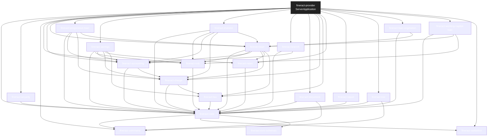
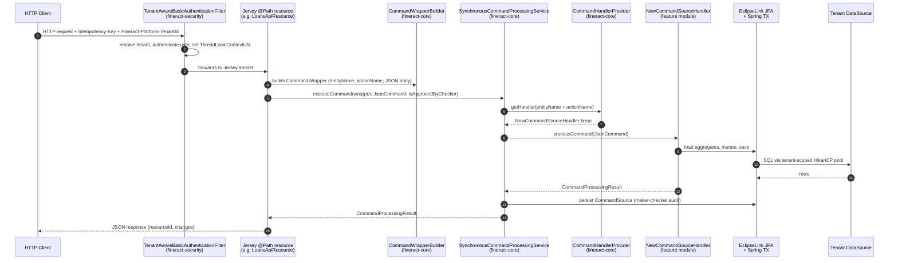
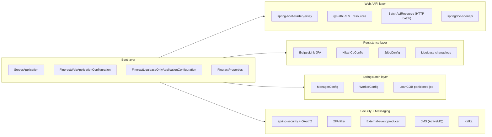

Apache Fineract is a multi-module Spring Boot 3 application whose composition root is `fineract-provider` (`fineract-provider/src/main/java/org/apache/fineract/ServerApplication.java`). This page maps the static module graph, the per-request control flow that runs through `org.apache.fineract.commands.service.SynchronousCommandProcessingService`, and the five runtime layers (boot, web, persistence, batch, messaging+security) that every feature module plugs into.

## Composition root

`ServerApplication` is the `SpringBootServletInitializer` entry point. Its inner `Configuration` class imports `FineractWebApplicationConfiguration` (the normal HTTP server) and `FineractLiquibaseOnlyApplicationConfiguration` (a migration-only profile); see `fineract-provider/src/main/java/org/apache/fineract/infrastructure/core/boot/FineractWebApplicationConfiguration.java` and `.../FineractLiquibaseOnlyApplicationConfiguration.java`. The two configurations are mutually exclusive through `FineractWebApplicationCondition` and `FineractLiquibaseOnlyApplicationCondition` in `fineract-core/src/main/java/org/apache/fineract/infrastructure/core/condition/`, both gated on the `liquibase-only` profile string defined in `fineract-core/src/main/java/org/apache/fineract/infrastructure/core/boot/FineractProfiles.java`.

The `@ComponentScan(basePackages = "org.apache.fineract.**")` in `FineractWebApplicationConfiguration` is what physically lights up every feature module: each Gradle subproject lives under the same `org.apache.fineract` package root, so once `fineract-provider` declares an `implementation(project(path: ':fineract-loan'))` dependency, all of its `@Component`, `@RestController` and Jersey-annotated classes are discovered. See `fineract-provider/dependencies.gradle` for the full project-dependency list.

## Module composition graph

The diagram below reflects the `project(path: ':...')` edges declared in each module's `dependencies.gradle`. `fineract-provider` is the only module that imports every feature module; feature modules generally depend on `fineract-core` plus a small set of peers.

<Note>
The graph above is sourced verbatim from `dependencies.gradle` in each module. `fineract-war` (`fineract-war/build.gradle`) is a packaging-only subproject that consumes `fineract-provider`'s runtime classpath; it does not introduce new sources.
</Note>

For a per-module deep dive (descriptions, packages, role) see [`/overview/module-graph`](/overview/module-graph). For directory walk see [`/overview/repository-layout`](/overview/repository-layout).

## Request lifecycle

Fineract serves REST traffic through Jersey 3 (`org.glassfish.jersey.media:jersey-media-multipart` and `spring-boot-starter-jersey` in `fineract-core/dependencies.gradle`). Mutating endpoints do not call business services directly — they translate the request into a `CommandWrapper` and hand it to `SynchronousCommandProcessingService`, which routes the wrapper to a registered `NewCommandSourceHandler` and persists a `CommandSource` row for the maker-checker audit trail.

### Key types in the lifecycle

| Step | Type | File |
|------|------|------|
| Tenant resolution | `TenantAwareBasicAuthenticationFilter` | `fineract-security/src/main/java/org/apache/fineract/infrastructure/security/filter/` |
| Tenant scoping | `ThreadLocalContextUtil` | `fineract-core/.../infrastructure/core/service/ThreadLocalContextUtil.java` |
| Wrapper construction | `CommandWrapperBuilder` | `fineract-core/src/main/java/org/apache/fineract/commands/service/CommandWrapperBuilder.java` |
| Command DTO | `CommandWrapper` | `fineract-core/src/main/java/org/apache/fineract/commands/domain/CommandWrapper.java` |
| Idempotency | `IdempotencyKeyResolver`, `IdempotencyKeyGenerator` | `fineract-core/src/main/java/org/apache/fineract/commands/service/` |
| Processing | `SynchronousCommandProcessingService` | `fineract-core/src/main/java/org/apache/fineract/commands/service/SynchronousCommandProcessingService.java` |
| Handler lookup | `CommandHandlerProvider` | `fineract-core/src/main/java/org/apache/fineract/commands/provider/CommandHandlerProvider.java` |
| Handler contract | `NewCommandSourceHandler` | `fineract-core/src/main/java/org/apache/fineract/commands/handler/NewCommandSourceHandler.java` |
| Audit row | `CommandSource` | `fineract-core/src/main/java/org/apache/fineract/commands/domain/CommandSource.java` |
| Result | `CommandProcessingResult` | `fineract-core/.../commands/domain/CommandProcessingResultType.java` (+ `CommandProcessingResult`) |
| Public maker-checker facade | `PortfolioCommandSourceWritePlatformServiceImpl` | `fineract-core/src/main/java/org/apache/fineract/commands/service/PortfolioCommandSourceWritePlatformServiceImpl.java` |

The annotation `@CommandType(entity = "...", action = "...")` on each handler implementation is what `CommandHandlerProvider` indexes; see `fineract-core/src/main/java/org/apache/fineract/commands/annotation/CommandType.java`.

For more on commands and maker-checker, see [`/command/overview`](/command/overview).

## Runtime layers

The five layers below sit inside a single JVM. The "messaging" layer is optional and is gated by `fineract.events.external.*` and `fineract.remote-job-message-handler.*` properties in `fineract-provider/src/main/resources/application.properties`.

### Boot layer

The boot layer wires Spring profiles, condition classes and configuration property classes.

| File | Role |
|------|------|
| `fineract-provider/src/main/java/org/apache/fineract/ServerApplication.java` | `main()` and `SpringBootServletInitializer` for WAR deployments. |
| `fineract-provider/src/main/java/org/apache/fineract/infrastructure/core/boot/FineractWebApplicationConfiguration.java` | `@EnableAutoConfiguration`, `@EnableTransactionManagement`, `@EnableWebSecurity`, `@ComponentScan("org.apache.fineract.**")`, `@IntegrationComponentScan`, gated by `FineractWebApplicationCondition`. |
| `fineract-provider/src/main/java/org/apache/fineract/infrastructure/core/boot/FineractLiquibaseOnlyApplicationConfiguration.java` | Activates only `service.migration`, `service.database`, `service.tenant` packages — used to run Liquibase changelogs and exit. |
| `fineract-core/src/main/java/org/apache/fineract/infrastructure/core/boot/FineractProfiles.java` | Holds the `LIQUIBASE_ONLY`, `DIAGNOSTICS`, `TEST` profile constants. |
| `fineract-core/src/main/java/org/apache/fineract/infrastructure/core/condition/FineractWebApplicationCondition.java` | Matches when `liquibase-only` is **not** active. |
| `fineract-core/src/main/java/org/apache/fineract/infrastructure/core/condition/FineractLiquibaseOnlyApplicationCondition.java` | Matches when `liquibase-only` **is** active. |
| `fineract-core/src/main/java/org/apache/fineract/infrastructure/core/config/FineractProperties.java` | `@ConfigurationProperties(prefix = "fineract")` — type-safe binding for every `fineract.*` key. |

Profile-driven boot is documented in detail in [`/overview/runtime-modes`](/overview/runtime-modes).

### Web / API layer

Jersey 3 hosts JAX-RS resources. The Spring Boot starter `spring-boot-starter-jersey` is brought in by `fineract-core/dependencies.gradle` and re-exported transitively to feature modules. Resource classes live next to their domain in each module under `org/apache/fineract/.../api`.

| File | Role |
|------|------|
| `fineract-core/src/main/java/org/apache/fineract/batch/api/BatchApiResource.java` | HTTP-level batch endpoint that enforces `fineract.mode.read-enabled` via `fineractProperties.getMode().isReadOnlyMode()` in `validateRequestMethodsAllowedOnInstanceType(...)`. |
| `fineract-core/src/main/java/org/apache/fineract/infrastructure/instancemode/filter/FineractInstanceModeApiFilter.java` | `OncePerRequestFilter` that rejects writes when `write-enabled=false` and exempts `/v1/jobs`, `/v1/scheduler`, `/v1/loans/catch-up`, `/v1/instance-mode`, and `/v1/batches` from the gate. |
| `fineract-core/src/main/java/org/apache/fineract/infrastructure/businessdate/api/BusinessDateApiResource.java` | Sets the COB business-date for the tenant. |
| `fineract-provider/src/main/java/org/apache/fineract/infrastructure/instancemode/api/InstanceModeApiResource.java` | `@Profile(FineractProfiles.TEST)` endpoint to flip `fineract.mode.*` flags at runtime — must not be used in production. |
| `fineract-provider/src/main/java/org/apache/fineract/portfolio/loanaccount/api/` | Loan REST endpoints. |
| `fineract-provider/src/main/java/org/apache/fineract/portfolio/savings/api/` | Savings REST endpoints. |
| `fineract-core/.../infrastructure/core/exceptionmapper/` & `fineract-cob/src/main/java/org/apache/fineract/core/exceptionmapper/` | JAX-RS `ExceptionMapper`s that translate `PlatformApiDataValidationException` etc. into JSON. |

OpenAPI is served by `org.springdoc:springdoc-openapi-starter-webmvc-ui` (see `fineract-core/dependencies.gradle`).

### Persistence layer

Fineract runs **EclipseLink** as the JPA provider — note the `exclude group: 'org.hibernate'` lines in `fineract-core/dependencies.gradle` and the explicit `org.eclipse.persistence:org.eclipse.persistence.jpa` import. The provider must be statically woven; see `STATIC_WEAVING.md` and `static-weaving.gradle`.

| File | Role |
|------|------|
| `fineract-provider/src/main/java/org/apache/fineract/infrastructure/core/config/HikariCpConfig.java` | HikariCP defaults shared across tenants (lives in `fineract-provider`; imported by both web and `liquibase-only` boot configs). |
| `fineract-provider/src/main/java/org/apache/fineract/infrastructure/core/config/JdbcConfig.java` | Bootstraps the **tenant-master** DataSource (lives in `fineract-provider`; imported by both web and `liquibase-only` boot configs). |
| `fineract-core/src/main/java/org/apache/fineract/infrastructure/core/service/database/DataSourcePerTenantServiceFactory.java` | Builds per-tenant Hikari pools (via `HikariDataSourceFactory`); respects `fineract.tenant.read-only-host` and `isReadOnlyMode()`. |
| `fineract-core/src/main/java/org/apache/fineract/infrastructure/core/service/database/HikariDataSourceFactory.java` | Thin wrapper that instantiates a `HikariDataSource` from a `HikariConfig`. |
| `fineract-core/src/main/java/org/apache/fineract/infrastructure/core/domain/FineractPlatformTenant.java` | In-memory tenant descriptor used by `ThreadLocalContextUtil`. |
| `fineract-core/src/main/java/org/apache/fineract/infrastructure/core/service/migration/` | Liquibase per-tenant migration runner. |
| `fineract-db/multi-tenant-demo-backups/` | Reference tenant snapshots (mariadb dumps). |
| `static-weaving.gradle` | Gradle task that runs the EclipseLink static weaver. |

Tenant isolation is enforced by `ThreadLocalContextUtil.setTenant(...)` driven from `fineract-security`'s authentication filter — every JPA query is dispatched on the per-tenant DataSource.

### Spring Batch layer

Fineract runs scheduled and remote-partitioned jobs via Spring Batch. The Loan COB job (`LOAN_COB`) is the principal partitioned job; see the `fineract.partitioned-job.partitioned-job-properties[0]` block in `application.properties`.

| File | Role |
|------|------|
| `fineract-provider/src/main/java/org/apache/fineract/infrastructure/springbatch/ManagerConfig.java` | `@ConditionalOnProperty("fineract.mode.batch-manager-enabled")`; configures the partition-manager step. |
| `fineract-provider/src/main/java/org/apache/fineract/infrastructure/springbatch/WorkerConfig.java` | `@ConditionalOnProperty("fineract.mode.batch-worker-enabled")`; configures partition workers. |
| `fineract-provider/src/main/java/org/apache/fineract/infrastructure/springbatch/messagehandler/MessageHandlerConfig.java` | Wires the `StepExecutionRequestHandler` for remote partitioning. |
| `fineract-provider/src/main/java/org/apache/fineract/infrastructure/jobs/service/StuckJobListener.java` | Re-runs jobs stuck > `fineract.job.stuck-retry-threshold`. |
| `fineract-cob/src/main/java/org/apache/fineract/cob/` | COB business-step framework (`COBBusinessStep`, `COBBusinessStepService`). |
| `fineract-loan/src/main/java/org/apache/fineract/cob/loan/` | Loan-specific COB tasklets and steps. |

The COB pipeline and its business-step contract is documented at [`/cob/overview`](/cob/overview).

### Security + messaging layer

| File | Role |
|------|------|
| `fineract-security/src/main/java/org/apache/fineract/infrastructure/security/config/` | Spring Security web-config; basic-auth, OAuth2 resource-server and client. |
| `fineract-security/src/main/java/org/apache/fineract/infrastructure/security/filter/` | Tenant-aware authentication and CORS filters. |
| `fineract-security/src/main/java/org/apache/fineract/infrastructure/security/twofactor/` | OTP delivery (email/SMS) and 2FA enforcement. |
| `fineract-core/src/main/java/org/apache/fineract/infrastructure/event/external/` | External event publisher (`fineract.events.external.*`). |
| `fineract-provider/src/main/java/org/apache/fineract/infrastructure/event/external/producer/` | JMS and Kafka external-event producers. |
| `fineract-avro-schemas/src/main/avro/` | Avro IDLs for serialized external events. |
| `fineract-provider/src/main/java/org/apache/fineract/infrastructure/springbatch/messagehandler/conditions/` | Per-transport `@ConditionalOnProperty` gates (Spring events, JMS, Kafka). |

For deeper detail see [`/security/overview`](/security/overview) and `application.properties` keys `fineract.security.basicauth.enabled`, `fineract.security.oauth2.enabled`, `fineract.security.2fa.enabled`.

## Tenant isolation model

| Concern | File |
|---------|------|
| Tenant resolver header | `Fineract-Platform-TenantId` — parsed in `fineract-security/.../filter/TenantAwareBasicAuthenticationFilter.java`. |
| Tenant master DB | Configured by `fineract.tenant.*` keys in `application.properties` (e.g. `fineract.tenant.identifier=default`). |
| Per-tenant DataSource | `DataSourcePerTenantServiceFactory.createNewDataSourceFor(...)`. |
| Thread context | `ThreadLocalContextUtil` exposes `setTenant`, `getTenant`, `setBusinessDates`, `getBusinessDate`. |
| Tenant repository | `fineract-core/.../infrastructure/core/service/tenant/TenantDetailsService.java`. |

The tenant master database stores rows in `tenants` and `tenant_server_connections`; each tenant's own schema is migrated on demand by Liquibase using `service/migration/TenantDataSourceFactory.java`.

## Cross-cutting infrastructure

| Concern | File |
|---------|------|
| Correlation IDs | `fineract.correlation.*` — Mapped Diagnostic Context for logs. |
| Configuration props | `fineract-core/.../infrastructure/core/config/FineractProperties.java` (`@ConfigurationProperties(prefix = "fineract")`). |
| Idempotency | `fineract.idempotency-key-header-name` = `Idempotency-Key`; `IdempotencyKeyResolver`, `IdempotencyKeyGenerator`. |
| SQL injection guard | `fineract.sql-validation.patterns[*]` (8 regex rules) + `fineract-validation/src/main/java/org/apache/fineract/validation/`. |
| Content storage | `fineract.content.filesystem.*`, `fineract.content.s3.*`; handlers in `fineract-document/src/main/java/org/apache/fineract/infrastructure/contentstore/`. |
| Reporting | `fineract-report/src/main/java/org/apache/fineract/infrastructure/report/`. |
| MIX XBRL export | `fineract-mix/src/main/java/org/apache/fineract/mix/`. |

## Where to read next

<CardGroup cols={2}>
  <Card title="Repository layout" href="/overview/repository-layout">
    Directory-by-directory walk of every top-level folder, plus per-module package roots.
  </Card>
  <Card title="Module graph" href="/overview/module-graph">
    Gradle module dependency edges sourced from `dependencies.gradle`, plus the dynamic `custom/` module loader.
  </Card>
  <Card title="Runtime modes" href="/overview/runtime-modes">
    `fineract.mode.read-enabled`, `write-enabled`, `batch-worker-enabled`, `batch-manager-enabled` and the `liquibase-only` profile.
  </Card>
  <Card title="Glossary" href="/overview/glossary">
    COB, GLIM/GSIM, BusinessStep, datatable, journal entry, idempotency key — each linked to source.
  </Card>
</CardGroup>
