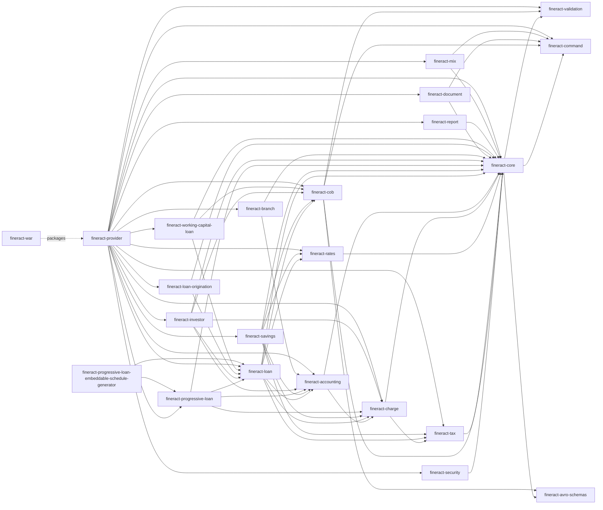

This page documents every Gradle subproject declared in `settings.gradle` (rooted at the repository root), the `project(path: ':...')` edges declared in each module's `dependencies.gradle`, the role of each module, and the dynamic `custom/<company>/<category>/<module>` loader at the bottom of `settings.gradle`. For a directory walk see [`/overview/repository-layout`](/overview/repository-layout); for the runtime behaviour see [`/overview/architecture`](/overview/architecture).

## Module list (from `settings.gradle`)

The order below matches the `include ':...'` statements in `settings.gradle`. Sources for each module are anchored at `<module>/src/main/java/org/apache/fineract/`.

| # | Gradle path | `description` (from `build.gradle`) | Role |
|---|-------------|-------------------------------------|------|
| 1 | `:fineract-core` | Fineract Core | Cross-cutting infrastructure: tenants, commands, business-date, configuration properties, condition classes. |
| 2 | `:fineract-security` | Fineract Security | Spring Security wiring, OAuth2, 2FA, ESAPI, SQL-injection regex enforcement. |
| 3 | `:fineract-cob` | Fineract COB | Close-of-Business job framework and `COBBusinessStep` SPI. |
| 4 | `:fineract-validation` | Fineract Validation | ICU4j + Jakarta Bean Validation utilities. |
| 5 | `:fineract-command` | Fineract Command | Command-source persistence and shared command DSL. |
| 6 | `:fineract-accounting` | Fineract Accounting | GL accounts, journal entries, accruals, provisioning. |
| 7 | `:fineract-provider` | Fineract Provider | Composition root — `ServerApplication` and all legacy code that has not been split out. |
| 8 | `:fineract-branch` | Fineract Branch | Branch/teller/cash management. |
| 9 | `:fineract-document` | Fineract Document | Document attachments + content stores. |
| 10 | `:fineract-investor` | Fineract Investor | External-asset-owner / investor module. |
| 11 | `:fineract-rates` | Fineract Rates | Floating interest rates. |
| 12 | `:fineract-charge` | Fineract Charge | Charges and fees. |
| 13 | `:fineract-tax` | Fineract Tax | Tax components, groups, mappings. |
| 14 | `:fineract-loan-origination` | Fineract Loan Origination | Loan-application capture. |
| 15 | `:fineract-loan` | Fineract Loan | Classic loan domain (products, accounts, schedules). |
| 16 | `:fineract-savings` | Fineract Savings | Savings products and deposit accounts. |
| 17 | `:fineract-report` | Fineract Report | Reporting infrastructure (Pentaho/Jasper). |
| 18 | `:fineract-mix` | Fineract MIX | MIX Market XBRL taxonomy generator. |
| 19 | `:fineract-war` | Fineract WAR | Tomcat WAR packaging of `fineract-provider`. |
| 20 | `:integration-tests` | Integration tests | Black-box REST tests. |
| 21 | `:twofactor-tests` | 2FA tests | Two-factor authentication test pack. |
| 22 | `:oauth2-tests` | OAuth2 tests | OAuth2 authentication test pack. |
| 23 | `:fineract-client` | Generated client | Retrofit-based REST client. |
| 24 | `:fineract-client-feign` | Generated Feign client | Spring Cloud OpenFeign variant. |
| 25 | `:fineract-doc` | Fineract Doc | Antora/AsciiDoc developer documentation. |
| 26 | `:fineract-avro-schemas` | Avro schemas | Avro IDL for external events. |
| 27 | `:fineract-e2e-tests-core` | E2E framework | Cucumber/Karate shared steps. |
| 28 | `:fineract-e2e-tests-runner` | E2E runner | Runnable harness. |
| 29 | `fineract-progressive-loan` | Progressive loan | Newer progressive-interest loan engine. |
| 30 | `fineract-progressive-loan-embeddable-schedule-generator` | Schedule generator | Embeddable schedule library. |
| 31 | `fineract-working-capital-loan` | Working capital loan | WCL product variant on top of `:fineract-loan`. |
| 32 | `:custom:docker` | Custom Docker | Aggregates every `custom/` module into a single Docker image. |

## Dependency edges (project-to-project)

The table below is taken verbatim from each module's `dependencies.gradle` (`grep "project(path:"`). Only project-to-project edges are listed — third-party libs are out of scope here.

| From | To |
|------|----|
| `fineract-core` | `fineract-avro-schemas`, `fineract-command`, `fineract-validation` |
| `fineract-security` | `fineract-core` |
| `fineract-cob` | `fineract-avro-schemas`, `fineract-command`, `fineract-validation`, `fineract-core` |
| `fineract-validation` | — |
| `fineract-command` | — |
| `fineract-accounting` | `fineract-core`, `fineract-charge` |
| `fineract-provider` | `fineract-core`, `fineract-cob`, `fineract-command`, `fineract-validation`, `fineract-accounting`, `fineract-investor`, `fineract-rates`, `fineract-charge`, `fineract-loan`, `fineract-savings`, `fineract-branch`, `fineract-document`, `fineract-progressive-loan`, `fineract-report`, `fineract-tax`, `fineract-loan-origination`, `fineract-security`, `fineract-working-capital-loan`, `fineract-mix` |
| `fineract-branch` | `fineract-core`, `fineract-accounting` |
| `fineract-document` | `fineract-core`, `fineract-command` |
| `fineract-investor` | `fineract-core`, `fineract-cob`, `fineract-accounting`, `fineract-charge`, `fineract-loan` |
| `fineract-rates` | `fineract-core` |
| `fineract-charge` | `fineract-core`, `fineract-tax` |
| `fineract-tax` | `fineract-core` |
| `fineract-loan-origination` | `fineract-core`, `fineract-loan` |
| `fineract-loan` | `fineract-core`, `fineract-cob`, `fineract-accounting`, `fineract-charge`, `fineract-rates`, `fineract-tax` |
| `fineract-savings` | `fineract-core`, `fineract-cob`, `fineract-accounting`, `fineract-charge`, `fineract-rates`, `fineract-tax` |
| `fineract-report` | `fineract-core` |
| `fineract-mix` | `fineract-core`, `fineract-command` |
| `fineract-progressive-loan` | `fineract-core`, `fineract-accounting`, `fineract-charge`, `fineract-loan` |
| `fineract-working-capital-loan` | `fineract-core`, `fineract-loan`, `fineract-cob` |
| `fineract-progressive-loan-embeddable-schedule-generator` | `fineract-progressive-loan`, `fineract-loan` (compile), `fineract-core` (test only) |
| `fineract-avro-schemas` | — |
| `fineract-validation` | — |
| `fineract-command` | — |

<Note>
`fineract-war` is a packaging-only module; its `build.gradle` declares `apply plugin: 'war'` and consumes `fineract-provider`'s output via the `war` distribution. It contributes no Java sources.
</Note>

## Visual dependency graph



## Module details

For each module the table below lists the key Java packages (anchored at `org/apache/fineract/`) and the one-line role.

### `fineract-core`

| Key package | Role |
|-------------|------|
| `commands/` | Command-source domain (`CommandSource`, `CommandWrapper`, `CommandHandlerProvider`, `SynchronousCommandProcessingService`). |
| `infrastructure/core/boot/` | `FineractProfiles` constants. |
| `infrastructure/core/condition/` | `FineractWebApplicationCondition`, `FineractLiquibaseOnlyApplicationCondition`, `ProfileCondition`. |
| `infrastructure/core/config/` | `FineractProperties`, `HikariCpConfig`, `JdbcConfig`. |
| `infrastructure/core/service/database/` | `DataSourcePerTenantServiceFactory` (per-tenant Hikari pool). |
| `infrastructure/core/service/migration/` | Per-tenant Liquibase runner. |
| `infrastructure/core/service/tenant/` | `TenantDetailsService`. |
| `infrastructure/core/domain/` | `FineractPlatformTenant`, `FineractPlatformTenantConnection`. |
| `infrastructure/businessdate/` | Business-date entity + REST API. |
| `infrastructure/codes/` | Code values. |
| `infrastructure/event/business/` | Internal `BusinessEvent` contracts. |
| `infrastructure/event/external/` | External-event service contracts. |
| `organisation/{holiday,workingdays,staff,office}/` | Shared organisation entities. |
| `batch/` | HTTP batch DTOs. |
| `portfolio/{delinquency,fund}/` | Shared delinquency and fund-source model. |
| `accounting/` | Shared GL model (also consumed by `fineract-accounting`). |

### `fineract-security`

| Key package | Role |
|-------------|------|
| `infrastructure/security/config/` | `SecurityConfig`, CORS, HSTS. |
| `infrastructure/security/filter/` | Tenant-aware basic-auth and OAuth2 resource-server filters. |
| `infrastructure/security/twofactor/` | OTP delivery, 2FA enforcement. |
| `infrastructure/security/utils/` | ESAPI + SQL-injection regex (`fineract.sql-validation.patterns[*]`). |

### `fineract-cob`

| Key package | Role |
|-------------|------|
| `cob/COBBusinessStep` | Business-step SPI. |
| `cob/data/BusinessStep` | DTO for step config. |
| `cob/domain/` | `LoanAccountLock`, `BatchBusinessStep` entities. |
| `cob/listener/` | Spring Batch listeners. |
| `cob/resolver/BusinessDateResolver` | Determines `BusinessDateType` for a job. |
| `cob/service/` | Async COB orchestration. |
| `cob/tasklet/` | One-shot tasklets for non-partitioned COB steps. |

### `fineract-validation`

| Key package | Role |
|-------------|------|
| `validation/` | Jakarta Validation utilities. |
| `validation/constraints/` | `@MoneyValue`, `@JsonString`, etc. |

### `fineract-command`

| Key package | Role |
|-------------|------|
| `command/core/` | Generic command/result DSL. |
| `command/persistence/` | JDBC persistence of command results. |
| `command/starter/` | Spring auto-configuration. |

### `fineract-accounting`

| Key package | Role |
|-------------|------|
| `accounting/glaccount/` | GL account hierarchy. |
| `accounting/journalentry/` | Journal entry posting, reversal. |
| `accounting/accrual/` | Accrual jobs. |
| `accounting/closure/` | Period closure. |
| `accounting/provisioning/` | Loan-provisioning categories. |
| `accounting/producttoaccountmapping/` | Product → GL mapping. |
| `accounting/financialactivityaccount/` | Liquidity / portfolio control accounts. |
| `accounting/trialbalance/` | Trial-balance reads. |
| `accounting/rule/` | Reusable journal-entry templates. |

### `fineract-provider`

Holds the composition root and any legacy code that hasn't been split yet. Key packages described in [`/overview/repository-layout`](/overview/repository-layout).

### `fineract-branch`

| Key package | Role |
|-------------|------|
| `organisation/teller/` | Teller, cashier, cash management entity. |

### `fineract-document`

| Key package | Role |
|-------------|------|
| `infrastructure/documentmanagement/` | Document REST API. |
| `infrastructure/contentstore/` | Filesystem and S3 backends. |

### `fineract-investor`

| Key package | Role |
|-------------|------|
| `investor/api/` | External-asset-owner REST resources. |
| `investor/domain/` | Asset-owner-transfer aggregate. |
| `investor/service/` | Transfer business logic. |
| `investor/accounting/` | Investor GL postings. |
| `investor/cob/` | Investor business steps embedded in the COB pipeline. |
| `investor/enricher/` | Loan-data enrichers. |

### `fineract-rates`

| Key package | Role |
|-------------|------|
| `portfolio/floatingrates/` | Floating-rate definition + periods. |

### `fineract-charge`

| Key package | Role |
|-------------|------|
| `portfolio/charge/` | Charge entity, charge slabs, charge-time/calculation enums. |

### `fineract-tax`

| Key package | Role |
|-------------|------|
| `portfolio/tax/` | Tax component, tax group, tax mappings. |

### `fineract-loan-origination`

| Key package | Role |
|-------------|------|
| `portfolio/loanorigination/` | Application capture, decisioning, status transitions. |

### `fineract-loan`

| Key package | Role |
|-------------|------|
| `portfolio/loanaccount/` | Loan account aggregate, transactions, handlers. |
| `portfolio/loanproduct/` | Loan-product entity. |
| `portfolio/delinquency/` | Loan-side delinquency. |
| `portfolio/interestpauses/` | Interest pause periods. |
| `portfolio/collateral/`, `collateralmanagement/` | Loan collateral. |
| `accounting/productaccountmapping/` | Loan-product → GL mapping. |
| `cob/loan/` | Loan-specific COB business steps. |

### `fineract-savings`

| Key package | Role |
|-------------|------|
| `portfolio/savings/` | Savings account/product. |
| `portfolio/charge/` | Savings-specific charge handling. |
| `portfolio/interestratechart/` | Interest-rate chart. |
| `cob/savings/` | Savings COB steps. |
| `interoperation/` | Mojaloop interoperation. |

### `fineract-report`

| Key package | Role |
|-------------|------|
| `infrastructure/report/` | Pluggable report runner (Pentaho, Jasper, SQL). |

### `fineract-mix`

| Key package | Role |
|-------------|------|
| `mix/api/` | MIX taxonomy REST. |
| `mix/domain/` | Taxonomy, namespace entities. |
| `mix/mapping/` | XBRL generation. |
| `mix/handler/` | Maker-checker handlers. |

### `fineract-progressive-loan`

| Key package | Role |
|-------------|------|
| `portfolio/loanaccount/` | Progressive loan transaction processor. |
| `portfolio/loanproduct/` | Progressive product properties. |
| `portfolio/delinquency/` | Progressive delinquency. |
| `portfolio/configuration/` | Feature flags. |
| `portfolio/util/` | Math helpers (EMI, compound interest). |

### `fineract-working-capital-loan`

| Key package | Role |
|-------------|------|
| `portfolio/workingcapitalloan/` | WCL account. |
| `portfolio/workingcapitalloanproduct/` | WCL product. |
| `cob/workingcapitalloan/` | WCL COB steps. |
| `cob/domain/` | WCL-specific COB entities. |

### `fineract-avro-schemas`

Schemas under `fineract-avro-schemas/src/main/avro/` generate Java POJOs into `build/generated-main-avro-java/`. Consumed by `fineract-core` (and any module that re-emits Avro events).

### `fineract-client`, `fineract-client-feign`

Generated clients — no hand-written sources. Built via the Swagger/OpenAPI generator against the document produced by `fineract-provider`'s `springdoc` integration.

### `fineract-war`

Packaging only. `fineract-war/build.gradle` declares `archiveFileName = 'fineract-provider.war'` and adds licence files under `WEB-INF/licenses/binary/` when `licenses/binary/` exists.

### `fineract-progressive-loan-embeddable-schedule-generator`

Standalone library that exposes the progressive-loan schedule generator with minimal dependencies, suitable for embedding in other JVM apps. Compile depends on `:fineract-progressive-loan` and `:fineract-loan`; test depends on `:fineract-core`.

## Test modules

| Module | dependencies.gradle highlights |
|--------|--------------------------------|
| `integration-tests` | Pulls in `:fineract-client` to issue REST calls. |
| `oauth2-tests` | Adds Spring Security OAuth2 test starters on top of `:fineract-client`. |
| `twofactor-tests` | Adds 2FA scenarios on top of `:fineract-client`. |
| `fineract-e2e-tests-core` | Cucumber + Karate test framework. |
| `fineract-e2e-tests-runner` | Runnable harness consuming `fineract-e2e-tests-core`. |

## Dynamic `custom/` module loader

The last block of `settings.gradle` walks the `custom/` directory three levels deep and `include`s every leaf directory as a Gradle subproject. The exact rule is:

```groovy
file("${rootDir}/custom").eachDir { companyDir ->
    if('build' != companyDir.name && 'docker' != companyDir.name) {
        file("${rootDir}/custom/${companyDir.name}").eachDir { categoryDir ->
            if('build' != categoryDir.name) {
                file("${rootDir}/custom/${companyDir.name}/${categoryDir.name}").eachDir { moduleDir ->
                    if('build' != moduleDir.name) {
                        include ":custom:${companyDir.name}:${categoryDir.name}:${moduleDir.name}"
                    }
                }
            }
        }
    }
}
```

The implications:

| Rule | Consequence |
|------|-------------|
| Three nested levels (`company` → `category` → `module`) | Vendors keep their modules namespaced; one company can ship multiple categories. |
| `build` directories ignored | Gradle's per-project `build/` artefacts don't accidentally register as modules. |
| `custom/docker` excluded from this walk | It is explicitly added earlier via `include ':custom:docker'` so it can aggregate other custom modules into one image. |
| Project path uses `:` separator | `custom/acme/loan/cob` is referenced as `:custom:acme:loan:cob`. |

The reference vendor `acme` ships the following modules (visible under `custom/acme/`):

| Custom module | Package root | Role |
|---------------|--------------|------|
| `custom/acme/event/externalevent` | `com.acme.fineract.event.externalevent` | Example external-event extension (`AcmeLoanExternalEvent`). |
| `custom/acme/event/starter` | `com.acme.fineract.event.starter` | Spring Boot auto-configuration that registers the event handlers. |
| `custom/acme/loan/cob` | `com.acme.fineract.loan.cob` | Custom COB business step. |
| `custom/acme/loan/job` | `com.acme.fineract.loan.job` | Custom scheduled job. |
| `custom/acme/loan/processor` | `com.acme.fineract.loan.processor` | Loan-transaction processor variant. |
| `custom/acme/loan/starter` | `com.acme.fineract.loan.starter` | Auto-configuration for the loan custom modules. |
| `custom/acme/note/service` | `com.acme.fineract.note.service` | Custom note service. |
| `custom/acme/note/starter` | `com.acme.fineract.note.starter` | Auto-configuration. |

Custom modules use the `com.<company>` package root rather than `org.apache.fineract.*` so that the `@ComponentScan(basePackages = "org.apache.fineract.**")` in `FineractWebApplicationConfiguration.java` does **not** pick them up automatically. Each custom module ships a `*-starter` subproject that declares Spring `@AutoConfiguration` classes; the platform discovers these via `META-INF/spring/org.springframework.boot.autoconfigure.AutoConfiguration.imports`.

The `custom/docker` module bundles all enabled custom modules into a Docker image — see `docker-compose-custom.yml` at the repository root for an example stack.

## Notes on edges that are not module-to-module

Several behaviours travel across module boundaries without showing up as Gradle edges:

| Behaviour | Mechanism |
|-----------|-----------|
| Command handlers picked up across modules | `@CommandType(entity = ..., action = ...)` discovered by `CommandHandlerProvider` (`fineract-core/.../commands/provider/CommandHandlerProvider.java`) at runtime. |
| Business events | `BusinessEventListener` beans wherever they live; published via `BusinessEventNotifierService`. |
| COB steps | Beans implementing `COBBusinessStep` are auto-registered by `COBBusinessStepService`. |
| External events | Avro types defined in `fineract-avro-schemas` and emitted from any module; routed by `fineract-core`'s external-event service. |
| Scheduled jobs | `@CronTarget`-annotated services discovered by `JobRegistererServiceImpl` in `fineract-provider`. |

## Where to read next

<CardGroup cols={2}>
  <Card title="Architecture" href="/overview/architecture">
    Composition root, request lifecycle, runtime layers.
  </Card>
  <Card title="Repository layout" href="/overview/repository-layout">
    Top-level directory walk plus per-module package roots.
  </Card>
  <Card title="Runtime modes" href="/overview/runtime-modes">
    `fineract.mode.*` toggles, instance-mode REST hot-flip, `liquibase-only` profile.
  </Card>
  <Card title="COB overview" href="/cob/overview">
    Deep dive into the `COBBusinessStep` SPI and the Loan COB partitioned job.
  </Card>
</CardGroup>
