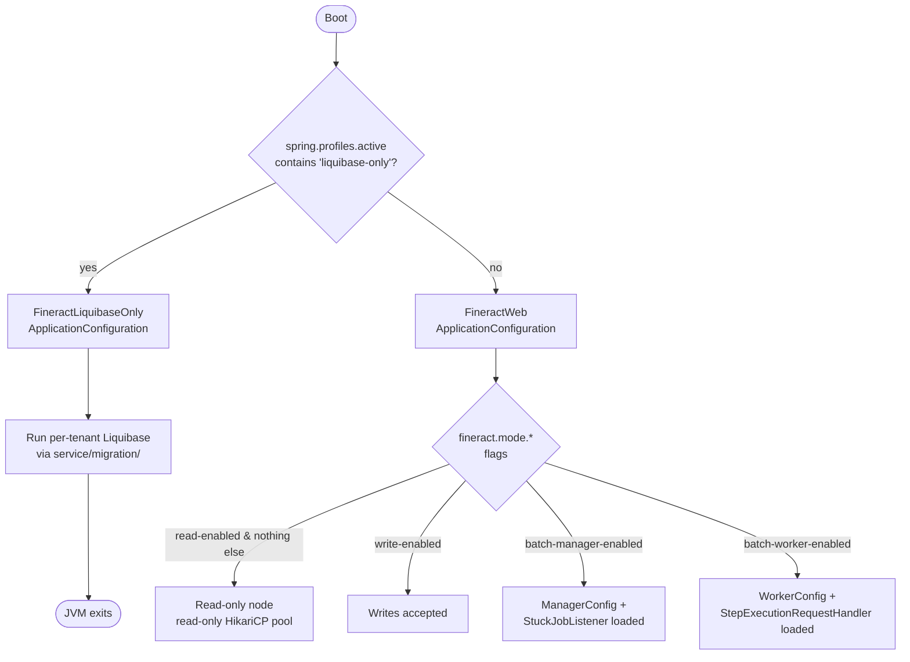

Apache Fineract is a single-process Spring Boot 3 application but supports several deployment shapes: read-only replicas, write-only nodes, batch-manager, batch-worker, and a degenerate "liquibase-only" mode that runs database migrations and exits. The behaviour is controlled by four `fineract.mode.*` flags from `fineract-provider/src/main/resources/application.properties` and a single Spring profile constant declared in `fineract-core/src/main/java/org/apache/fineract/infrastructure/core/boot/FineractProfiles.java`. This page is a reference of every code path that consults those flags.

## Sources of truth

| Mechanism | File |
|-----------|------|
| Boot config (web) | `fineract-provider/src/main/java/org/apache/fineract/infrastructure/core/boot/FineractWebApplicationConfiguration.java` |
| Boot config (migrate-only) | `fineract-provider/src/main/java/org/apache/fineract/infrastructure/core/boot/FineractLiquibaseOnlyApplicationConfiguration.java` |
| Profile constants | `fineract-core/src/main/java/org/apache/fineract/infrastructure/core/boot/FineractProfiles.java` |
| Condition base class | `fineract-core/src/main/java/org/apache/fineract/infrastructure/core/condition/ProfileCondition.java` |
| Web-mode condition | `fineract-core/src/main/java/org/apache/fineract/infrastructure/core/condition/FineractWebApplicationCondition.java` |
| Migrate-only condition | `fineract-core/src/main/java/org/apache/fineract/infrastructure/core/condition/FineractLiquibaseOnlyApplicationCondition.java` |
| Properties binding | `fineract-core/src/main/java/org/apache/fineract/infrastructure/core/config/FineractProperties.java` (inner class `FineractModeProperties`) |
| Runtime hot-flip API | `fineract-provider/src/main/java/org/apache/fineract/infrastructure/instancemode/api/InstanceModeApiResource.java` (test profile only) |

## The four `fineract.mode.*` flags

The defaults are declared in `application.properties`:

```properties
fineract.mode.read-enabled=${FINERACT_MODE_READ_ENABLED:true}
fineract.mode.write-enabled=${FINERACT_MODE_WRITE_ENABLED:true}
fineract.mode.batch-worker-enabled=${FINERACT_MODE_BATCH_WORKER_ENABLED:true}
fineract.mode.batch-manager-enabled=${FINERACT_MODE_BATCH_MANAGER_ENABLED:true}
```

The flags are bound by `FineractProperties.FineractModeProperties`:

```java
@Getter
@Setter
public static class FineractModeProperties {
    private boolean readEnabled;
    private boolean writeEnabled;
    private boolean batchWorkerEnabled;
    private boolean batchManagerEnabled;

    public boolean isReadOnlyMode() {
        return readEnabled && !writeEnabled && !batchWorkerEnabled && !batchManagerEnabled;
    }
}
```

### Flag matrix

| Flag | Property | Env var | Default | Purpose |
|------|----------|---------|---------|---------|
| `readEnabled` | `fineract.mode.read-enabled` | `FINERACT_MODE_READ_ENABLED` | `true` | Allows GET endpoints to serve traffic. |
| `writeEnabled` | `fineract.mode.write-enabled` | `FINERACT_MODE_WRITE_ENABLED` | `true` | Allows POST/PUT/DELETE and any non-GET batch entries. |
| `batchWorkerEnabled` | `fineract.mode.batch-worker-enabled` | `FINERACT_MODE_BATCH_WORKER_ENABLED` | `true` | Activates `WorkerConfig`, partition-step listeners, and remote-batch message consumers. |
| `batchManagerEnabled` | `fineract.mode.batch-manager-enabled` | `FINERACT_MODE_BATCH_MANAGER_ENABLED` | `true` | Activates `ManagerConfig`, the stuck-job listener and the remote-job topic auto-create check. |

### `isReadOnlyMode()` semantics

The helper method only returns `true` when read is enabled AND every other flag is off. In other words, a node that has `read-enabled=true` and `write-enabled=true` is **not** considered read-only — the helper is conservative. Two consumers act on it:

| Consumer | File | Effect |
|----------|------|--------|
| HTTP batch endpoint | `fineract-core/src/main/java/org/apache/fineract/batch/api/BatchApiResource.java` (method `validateRequestMethodsAllowedOnInstanceType`) | Throws `InvalidInstanceTypeMethodException` if any inner request is non-GET. |
| Per-tenant DataSource | `fineract-core/src/main/java/org/apache/fineract/infrastructure/core/service/database/DataSourcePerTenantServiceFactory.java` | Substitutes `fineract.tenant.read-only-*` host/port/credentials when present **and** calls `HikariConfig.setReadOnly(true)` on the pool. |

The DataSource override uses `tenantConnection.getReadOnlySchemaServer()` etc. (see `FineractPlatformTenantConnection` in `fineract-core/.../core/domain/`). When those fields are blank in the tenant master row, the primary host is used — so flipping `readEnabled` alone is safe but does not automatically point at a replica.

## Deployment topologies

| Topology | `read-enabled` | `write-enabled` | `batch-worker-enabled` | `batch-manager-enabled` | Notes |
|----------|----------------|-----------------|------------------------|-------------------------|-------|
| **Monolith (default)** | true | true | true | true | Single node serves traffic and runs jobs. |
| **Read replica** | true | false | false | false | `isReadOnlyMode()` returns true; uses `fineract.tenant.read-only-*`; mutating endpoints rejected by `BatchApiResource`. |
| **Write API node** | false | true | false | false | Accepts writes; relies on a separate manager/worker for batch. Spring-Security still requires `read-enabled` for some GET fall-back queries, so most deployments leave it on. |
| **Batch manager** | true | true | false | true | Owns the partition manager step; the stuck-job listener (`StuckJobListener`) is active. |
| **Batch worker** | true | true | true | false | Subscribes to JMS/Kafka step requests via `MessageHandlerConfig` and `StepExecutionRequestHandler`. |
| **Migrate-only** | n/a | n/a | n/a | n/a | Activated via `--spring.profiles.active=liquibase-only`; see next section. |

## `@ConditionalOnProperty` consumers

The `batch-manager-enabled` and `batch-worker-enabled` flags drive Spring `@ConditionalOnProperty` gates. The complete in-tree list is:

| File | Gate |
|------|------|
| `fineract-provider/src/main/java/org/apache/fineract/infrastructure/springbatch/ManagerConfig.java` | `@ConditionalOnProperty(value = "fineract.mode.batch-manager-enabled", havingValue = "true")` |
| `fineract-provider/src/main/java/org/apache/fineract/infrastructure/springbatch/WorkerConfig.java` | `@ConditionalOnProperty(value = "fineract.mode.batch-worker-enabled", havingValue = "true")` |
| `fineract-provider/src/main/java/org/apache/fineract/infrastructure/springbatch/messagehandler/MessageHandlerConfig.java` | `@ConditionalOnProperty(value = "fineract.mode.batch-worker-enabled", havingValue = "true")` |
| `fineract-provider/src/main/java/org/apache/fineract/infrastructure/springbatch/messagehandler/StepExecutionRequestHandler.java` | `@ConditionalOnProperty(value = "fineract.mode.batch-worker-enabled", havingValue = "true")` |
| `fineract-provider/src/main/java/org/apache/fineract/infrastructure/springbatch/messagehandler/conditions/spring/SpringEventManagerCondition.java` | `@ConditionalOnProperty(value = "fineract.mode.batch-manager-enabled", havingValue = "true")` |
| `fineract-provider/src/main/java/org/apache/fineract/infrastructure/springbatch/messagehandler/conditions/spring/SpringEventWorkerCondition.java` | `@ConditionalOnProperty(value = "fineract.mode.batch-worker-enabled", havingValue = "true")` |
| `fineract-provider/src/main/java/org/apache/fineract/infrastructure/springbatch/messagehandler/conditions/jms/JmsManagerCondition.java` | `@ConditionalOnProperty(value = "fineract.mode.batch-manager-enabled", havingValue = "true")` |
| `fineract-provider/src/main/java/org/apache/fineract/infrastructure/springbatch/messagehandler/conditions/jms/JmsWorkerCondition.java` | `@ConditionalOnProperty(value = "fineract.mode.batch-worker-enabled", havingValue = "true")` |
| `fineract-provider/src/main/java/org/apache/fineract/infrastructure/springbatch/messagehandler/conditions/kafka/KafkaManagerCondition.java` | `@ConditionalOnProperty(value = "fineract.mode.batch-manager-enabled", havingValue = "true")` |
| `fineract-provider/src/main/java/org/apache/fineract/infrastructure/springbatch/messagehandler/conditions/kafka/KafkaRemoteJobTopicAutoCreateCondition.java` | `@ConditionalOnProperty(value = "fineract.mode.batch-manager-enabled", havingValue = "true")` |
| `fineract-provider/src/main/java/org/apache/fineract/infrastructure/springbatch/messagehandler/conditions/kafka/KafkaWorkerCondition.java` | `@ConditionalOnProperty(value = "fineract.mode.batch-worker-enabled", havingValue = "true")` |
| `fineract-provider/src/main/java/org/apache/fineract/infrastructure/jobs/service/StuckJobListener.java` | `@ConditionalOnProperty(value = "fineract.mode.batch-manager-enabled", havingValue = "true")` |

Each `*Manager*Condition` / `*Worker*Condition` class additionally checks the relevant transport flag (`fineract.remote-job-message-handler.spring-events.enabled` / `.jms.enabled` / `.kafka.enabled`) so a node can choose its transport independently of its role.

The HTTP batch endpoint `BatchApiResource` is the only consumer of `readEnabled`/`writeEnabled` at JAX-RS level; per-resource enforcement is otherwise delegated to Spring Security and HTTP method semantics.

## The `liquibase-only` profile

`FineractProfiles` defines three constants, of which `LIQUIBASE_ONLY` is the operational one:

| Constant | Value | Purpose |
|----------|-------|---------|
| `LIQUIBASE_ONLY` | `"liquibase-only"` | Boot a JVM that runs all Liquibase changelogs against the tenant master + every tenant schema, then exits. |
| `DIAGNOSTICS` | `"diagnostics"` | Activates additional diagnostics beans (e.g. extra logging). |
| `TEST` | `"test"` | Unlocks the runtime-mode hot-flip API (`InstanceModeApiResource`). |

`FineractLiquibaseOnlyApplicationCondition` matches when `liquibase-only` is in the active profiles list; `FineractWebApplicationCondition` matches when it is **not**. Both conditions extend `ProfileCondition`, which inspects `context.getEnvironment().getActiveProfiles()`. The two `@Configuration` classes are therefore mutually exclusive: exactly one of them is loaded per JVM.

### What gets loaded in `liquibase-only`

`FineractLiquibaseOnlyApplicationConfiguration` declares:

```java
@Conditional(FineractLiquibaseOnlyApplicationCondition.class)
@EnableConfigurationProperties({ FineractProperties.class, LiquibaseProperties.class })
@Import({ HikariCpConfig.class, JdbcConfig.class })
@ComponentScan(basePackages = {
    "org.apache.fineract.infrastructure.core.service.migration",
    "org.apache.fineract.infrastructure.core.service.database",
    "org.apache.fineract.infrastructure.core.service.tenant"
})
public class FineractLiquibaseOnlyApplicationConfiguration implements InitializingBean { ... }
```

Compared with the full web configuration this means:

| Feature | Web mode | `liquibase-only` mode |
|---------|----------|----------------------|
| Component scan | `org.apache.fineract.**` | Only `service.migration`, `service.database`, `service.tenant` |
| Web layer | enabled (Jersey, Spring MVC, security) | disabled (no `@EnableWebSecurity`) |
| Transaction manager | enabled | not declared |
| `@IntegrationComponentScan` | enabled | not declared |
| Liquibase auto-configuration | **excluded** in `FineractWebApplicationConfiguration` because Fineract runs Liquibase per tenant manually | **excluded** here too; the platform's own runner in `service/migration/` performs the work |
| Banner log line | "Fineract is running in web application mode" | "Fineract is running in Liquibase only mode" |

The migrate-only profile is the recommended way to bring up a brand-new tenant database in CI without warming up the application context. Run with:

```bash
java -jar fineract-provider.jar --spring.profiles.active=liquibase-only
```

or set `SPRING_PROFILES_ACTIVE=liquibase-only` for the container image.

<Note>
Both `HikariCpConfig` and `JdbcConfig` are imported by `FineractLiquibaseOnlyApplicationConfiguration` because the migration runner needs the same DataSource factories used at runtime. See `fineract-core/src/main/java/org/apache/fineract/infrastructure/core/service/migration/`.
</Note>

## Runtime hot-flip API (test profile only)

`InstanceModeApiResource` lives under `fineract-provider/src/main/java/org/apache/fineract/infrastructure/instancemode/api/`. It is annotated with `@Profile(FineractProfiles.TEST)` and emits a stark log warning on startup:

```java
log.warn("DO NOT USE THIS IN PRODUCTION!");
log.warn("Instance type changing feature is enabled");
log.warn("DO NOT USE THIS IN PRODUCTION!");
```

The single endpoint is `PUT /v1/instance-mode` with a JSON body matching `InstanceModeApiResourceSwagger.ChangeInstanceModeRequest`:

| Field | Type | Maps to |
|-------|------|---------|
| `readEnabled` | boolean | `FineractModeProperties.setReadEnabled` |
| `writeEnabled` | boolean | `FineractModeProperties.setWriteEnabled` |
| `batchWorkerEnabled` | boolean | `FineractModeProperties.setBatchWorkerEnabled` |
| `batchManagerEnabled` | boolean | `FineractModeProperties.setBatchManagerEnabled` |

Because beans gated by `@ConditionalOnProperty` are **not re-evaluated** after context start, this only mutates the values returned by `FineractProperties.getMode()`. Hot-flipping does not start or stop the batch manager beans — it only affects the runtime checks in `BatchApiResource.validateRequestMethodsAllowedOnInstanceType` and the HikariCP read-only flag, which is set at pool creation. The endpoint exists purely to let integration tests in `integration-tests/` and `twofactor-tests/` simulate mode transitions without restarting the JVM.

## Profile combinations cheat-sheet

| Active profile(s) | Web layer | Migrations | Hot-flip API | Notes |
|-------------------|-----------|------------|--------------|-------|
| _(none)_ | yes | platform-managed at startup | no | Default; pair with `fineract.mode.*` flags. |
| `liquibase-only` | no | yes | no | One-shot migration; process exits after changelog completes. |
| `test` | yes | yes | yes | Enables `InstanceModeApiResource`. |
| `diagnostics` | yes | yes | no | Additional diagnostic beans (not exhaustive in this page). |
| `test,diagnostics` | yes | yes | yes | Comma-separated profile list. |

Spring's `spring.profiles.active` is the source of the active list; on a container it is typically set via `SPRING_PROFILES_ACTIVE`.

## Decision tree



## Examples

<Tabs>
  <Tab title="Read replica">
```bash
FINERACT_MODE_READ_ENABLED=true \
FINERACT_MODE_WRITE_ENABLED=false \
FINERACT_MODE_BATCH_WORKER_ENABLED=false \
FINERACT_MODE_BATCH_MANAGER_ENABLED=false \
FINERACT_DEFAULT_TENANTDB_RO_HOSTNAME=replica.db.example.com \
FINERACT_DEFAULT_TENANTDB_RO_PORT=5432 \
java -jar fineract-provider.jar
```
`isReadOnlyMode()` evaluates `true`; `HikariConfig.setReadOnly(true)` is applied. `BatchApiResource` rejects POST/PUT/DELETE child requests with `InvalidInstanceTypeMethodException`.
  </Tab>
  <Tab title="Batch manager only">
```bash
FINERACT_MODE_BATCH_MANAGER_ENABLED=true \
FINERACT_MODE_BATCH_WORKER_ENABLED=false \
FINERACT_REMOTE_JOB_MESSAGE_HANDLER_KAFKA_ENABLED=true \
FINERACT_REMOTE_JOB_MESSAGE_HANDLER_KAFKA_BOOTSTRAP_SERVERS=kafka:9092 \
java -jar fineract-provider.jar
```
Loads `ManagerConfig`, `StuckJobListener`, `KafkaManagerCondition` and the `KafkaRemoteJobTopicAutoCreateCondition`. Worker beans are skipped.
  </Tab>
  <Tab title="Batch worker only">
```bash
FINERACT_MODE_BATCH_WORKER_ENABLED=true \
FINERACT_MODE_BATCH_MANAGER_ENABLED=false \
FINERACT_REMOTE_JOB_MESSAGE_HANDLER_JMS_ENABLED=true \
FINERACT_REMOTE_JOB_MESSAGE_HANDLER_JMS_BROKER_URL=tcp://activemq:61616 \
java -jar fineract-provider.jar
```
Loads `WorkerConfig`, `MessageHandlerConfig`, `StepExecutionRequestHandler`, `JmsWorkerCondition`. Manager beans are skipped.
  </Tab>
  <Tab title="Migration only">
```bash
SPRING_PROFILES_ACTIVE=liquibase-only \
java -jar fineract-provider.jar
```
`FineractLiquibaseOnlyApplicationConfiguration` is loaded; no web layer comes up. Logs `"Fineract is running in Liquibase only mode"` and exits after applying changelogs.
  </Tab>
</Tabs>

## Interaction with `fineract.tenant.read-only-*`

The tenant master DB stores `read_only_*` columns on `tenant_server_connections`. Fields are surfaced via `FineractPlatformTenantConnection` and applied in `DataSourcePerTenantServiceFactory.createNewDataSourceFor(...)`. The substitution is conditional on `fineractProperties.getMode().isReadOnlyMode()`:

```java
if (fineractProperties.getMode().isReadOnlyMode()) {
    schemaServer = StringUtils.defaultIfBlank(tenantConnection.getReadOnlySchemaServer(), schemaServer);
    schemaPort = StringUtils.defaultIfBlank(tenantConnection.getReadOnlySchemaServerPort(), schemaPort);
    // ...
    config.setReadOnly(true);
}
```

Operators who deploy a read replica should populate the `read_only_*` columns; otherwise the pool will simply point at the primary with `setReadOnly(true)` and the primary will reject `UPDATE` statements at the JDBC layer.

## Operator checklist

Before promoting a Fineract node to a non-default topology, verify each of the rows below against the source files.

| # | Check | Reference |
|---|-------|-----------|
| 1 | Profile list does not contain `liquibase-only` for a runtime node. | `FineractWebApplicationCondition.matches(...)` returns `false` otherwise. |
| 2 | `fineract.mode.*` flags reflect the intended split. | `application.properties` lines 67-70. |
| 3 | For read replicas: tenant connection has `read_only_*` columns populated. | `DataSourcePerTenantServiceFactory.createNewDataSourceFor(...)`. |
| 4 | For batch workers: a transport flag is enabled (`spring-events`, `jms` or `kafka`). | `fineract.remote-job-message-handler.*.enabled`. |
| 5 | `Idempotency-Key` header name matches the load balancer's allow list. | `fineract.idempotency-key-header-name`. |
| 6 | `Fineract-Platform-TenantId` header is forwarded by every proxy. | `fineract-security/.../filter/TenantAwareBasicAuthenticationFilter.java`. |
| 7 | `fineract.task-executor.tenant-upgrade-task-executor-*` is left at `1` (single thread) until Liquibase PR 7227 lands. | `application.properties` comment block. |
| 8 | `fineract.correlation.enabled` is on when shipping logs to a SIEM. | `fineract.correlation.*`. |
| 9 | `fineract.job.stuck-retry-threshold` is tuned to the manager's poll cadence. | `application.properties`. |
| 10 | Test profile (`test`) is never active in production. | `InstanceModeApiResource.@Profile(FineractProfiles.TEST)`. |

## Observability of the active mode

There is no dedicated `/healthcheck/mode` endpoint. The active mode is observable through three side channels:

| Channel | File |
|---------|------|
| Startup log line | `FineractWebApplicationConfiguration.afterPropertiesSet()` logs `"Fineract is running in web application mode"`; `FineractLiquibaseOnlyApplicationConfiguration.afterPropertiesSet()` logs `"Fineract is running in Liquibase only mode"`. |
| Per-tenant Hikari pool name | `"<schemaName>_pool"` (see `DataSourcePerTenantServiceFactory`). The pool's `readOnly` flag is exposed by HikariCP's JMX MBean. |
| `InstanceModeApiResource` startup warning | Logs `"Instance type changing feature is enabled"` when the `test` profile is active — a signal that a non-production runtime is in use. |

## Where to read next

<CardGroup cols={2}>
  <Card title="Architecture" href="/overview/architecture">
    The five runtime layers (boot, web, persistence, batch, security/messaging) and the request lifecycle.
  </Card>
  <Card title="COB overview" href="/cob/overview">
    Loan COB partitioned job — the principal customer of `batch-worker-enabled` and `batch-manager-enabled`.
  </Card>
  <Card title="Security overview" href="/security/overview">
    Authentication, OAuth2, 2FA and how the tenant header is resolved.
  </Card>
  <Card title="Glossary" href="/overview/glossary">
    Business-date, tenant, idempotency key — terms used throughout this page.
  </Card>
</CardGroup>
