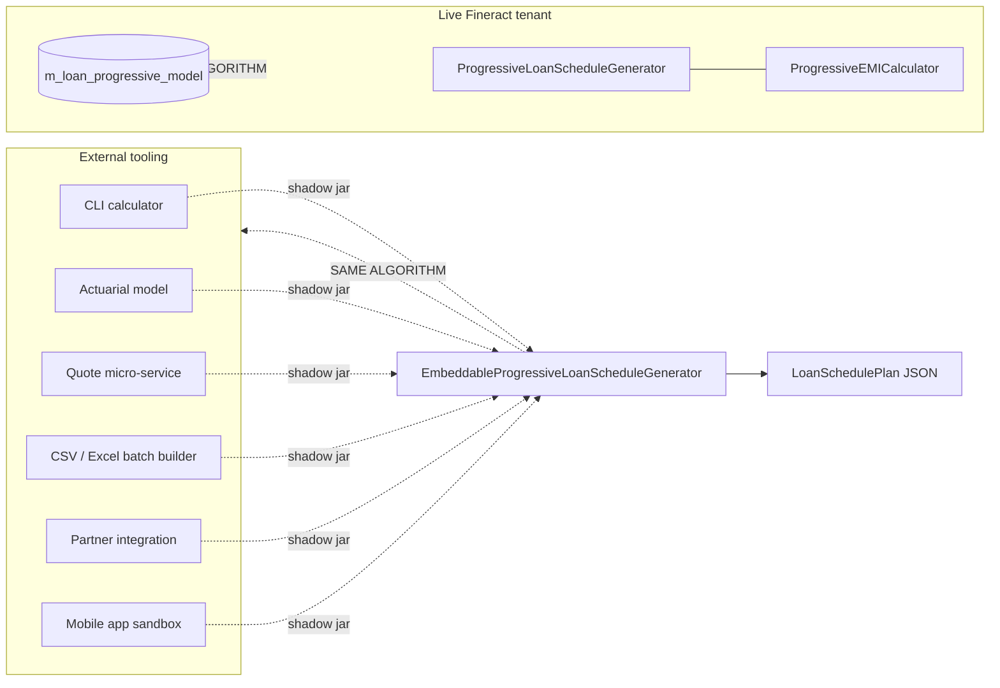

`fineract-progressive-loan-embeddable-schedule-generator` is the **standalone library** sibling of Apache Fineract's progressive-loan module. It packages the `ProgressiveLoanScheduleGenerator` + `ProgressiveEMICalculator` machinery — along with their minimum runtime dependencies — into a single fat (shadow) jar that can be dropped onto any Java 17+ classpath outside a running Fineract installation. The library lives at `fineract-progressive-loan-embeddable-schedule-generator/` in the root multi-module repo and ships exactly **one** public entry-point class: `EmbeddableProgressiveLoanScheduleGenerator`.

The use-case: produce **bit-identical** schedules to a live Fineract tenant from external tooling — actuarial models, CLI calculators, partner integrations, batch CSV builders, prepayment-quote services — without booting Spring, JPA, Liquibase, security or any of the platform's dependencies.

## Module layout

```
fineract-progressive-loan-embeddable-schedule-generator/
├── README.md                # build + run instructions
├── build.gradle             # shadow-jar configuration
├── dependencies.gradle      # one-line dependency set
├── misc/
│   └── Main.java            # CI smoke-test driver
└── src/
    ├── main/java/.../portfolio/loanaccount/loanschedule/domain/
    │   └── EmbeddableProgressiveLoanScheduleGenerator.java
    └── test/java/.../portfolio/loanaccount/loanschedule/domain/
        └── EmbeddableProgressiveLoanScheduleGeneratorTest.java
```

Only one production source file — the wrapper class — plus a JUnit test that asserts the worked example documented below.

## Public API

```java
package org.apache.fineract.portfolio.loanaccount.loanschedule.domain;

@SuppressWarnings("unused")
public class EmbeddableProgressiveLoanScheduleGenerator {

    private final ProgressiveLoanScheduleGenerator scheduleGenerator;

    public EmbeddableProgressiveLoanScheduleGenerator() {
        final ScheduledDateGenerator scheduledDateGenerator = new DefaultScheduledDateGenerator();
        final EMICalculator emiCalculator = new ProgressiveEMICalculator(scheduledDateGenerator);
        this.scheduleGenerator = new ProgressiveLoanScheduleGenerator(
                scheduledDateGenerator, emiCalculator,
                new NoopInterestScheduleModelRepositoryWrapper());
    }

    public LoanSchedulePlan generate(final MathContext mc, final LoanRepaymentScheduleModelData modelData) {
        return scheduleGenerator.generate(mc, modelData);
    }

    private static final class NoopInterestScheduleModelRepositoryWrapper
            implements InterestScheduleModelRepositoryWrapper {
        // every method returns Optional.empty() or 0L
    }
}
```

That is the **entire** public surface. Three observations:

1. **No Spring**. The class is built with plain `new` and a `@SuppressWarnings("unused")` annotation because it is consumed directly by name from external code.
2. **No persistence**. `NoopInterestScheduleModelRepositoryWrapper` returns `Optional.empty()` for every read — this is acceptable because `generate(MathContext, LoanRepaymentScheduleModelData)` builds a fresh schedule from immutable input and never asks the repository for a saved model. The repository wrapper field is required by the constructor of `ProgressiveLoanScheduleGenerator`, hence the no-op stand-in.
3. **Returns `LoanSchedulePlan`**, not `LoanScheduleModel`. The `LoanSchedulePlan` DTOs in `fineract-progressive-loan/.../loanaccount/loanschedule/data/` are POJO-only and round-trip through Gson/Jackson without dragging in JPA entities — they are the safe public payload for external tools.

### Inputs — `LoanRepaymentScheduleModelData`

This record (declared in `fineract-loan`) is the input to `generate(...)`:

```java
public record LoanRepaymentScheduleModelData(
        @NotNull LocalDate scheduleGenerationStartDate,
        @NotNull CurrencyData currency,
        @NotNull BigDecimal disbursementAmount,
        @NotNull LocalDate disbursementDate,
        @NotNull int numberOfRepayments,
        @NotNull int repaymentFrequency,
        @NotBlank String repaymentFrequencyType,          // "MONTHS" / "WEEKS" / "DAYS"
        @NotNull BigDecimal annualNominalInterestRate,
        @NotNull boolean downPaymentEnabled,
        @NotNull DaysInMonthType daysInMonth,
        @NotNull DaysInYearType daysInYear,
        BigDecimal downPaymentPercentage,
        Integer installmentAmountInMultiplesOf,
        Integer fixedLength,
        @NotNull Boolean interestRecognitionOnDisbursementDate,
        @Nullable DaysInYearCustomStrategyType daysInYearCustomStrategy,
        @NotNull InterestMethod interestMethod,
        @NotNull boolean allowPartialPeriodInterestCalculation,
        @NotNull boolean allowFullTermForTranche) {
}
```

| Field | Notes |
| --- | --- |
| `scheduleGenerationStartDate` | The "from" date for the first installment; usually the disbursement date |
| `currency` | `CurrencyData(code, name, decimalPlaces, inMultiplesOf, displaySymbol, nameCode)` |
| `numberOfRepayments` × `repaymentFrequency` × `repaymentFrequencyType` | Term — e.g. `6 × 1 × MONTHS` = six monthly installments |
| `annualNominalInterestRate` | Per-annum percentage, not decimal |
| `daysInMonth` / `daysInYear` | `DAYS_30` / `DAYS_360` for actuarial conventions, `ACTUAL` for calendar |
| `downPaymentEnabled` + `downPaymentPercentage` | If enabled, the percent of disbursed principal that becomes a separate down-payment installment on disbursement day |
| `installmentAmountInMultiplesOf` | Rounding bucket for EMI |
| `fixedLength` | Optional fixed term length override |
| `interestRecognitionOnDisbursementDate` | When true, day 0 also accrues interest |
| `daysInYearCustomStrategy` | For `DaysInYearType.ACTUAL` — leap-year handling strategy |
| `interestMethod` | `DECLINING_BALANCE` (typical) or `FLAT` |
| `allowPartialPeriodInterestCalculation` | When true, partial-period interest is computed pro-rata; when false the period is treated as a full period |
| `allowFullTermForTranche` | Multi-tranche disbursement scenario flag |

### Output — `LoanSchedulePlan`

```
LoanSchedulePlan
├── periods : List<LoanSchedulePlanPeriod>
│     ├── LoanSchedulePlanDisbursementPeriod  (period 0)
│     ├── LoanSchedulePlanDownPaymentPeriod   (optional, period 1)
│     └── LoanSchedulePlanRepaymentPeriod     (the EMI rows)
├── currency
├── loanTermInDays
├── totalDisbursedAmount
├── totalInterestAmount
├── totalFeeChargesAmount
├── totalPenaltyChargesAmount
├── totalRepaymentAmount
└── totalOutstandingAmount
```

Each `LoanSchedulePlanRepaymentPeriod` exposes `periodNumber`, `periodFromDate`, `periodDueDate`, `principalAmount`, `interestAmount`, `feeChargesAmount`, `penaltyChargesAmount`, `outstandingLoanBalance`, and `totalDueAmount` getters.

## Build

The shadow-jar is produced with the `com.gradleup.shadow` plugin:

```groovy
description = 'Fineract Progressive Loan Embeddable Schedule Generator'

apply plugin: 'com.gradleup.shadow'
apply plugin: 'java'
apply from: 'dependencies.gradle'

import com.github.jengelman.gradle.plugins.shadow.tasks.ShadowJar

var requiredModuleNames = [
        'fineract-core',
        'fineract-loan',
        'fineract-progressive-loan',
]

tasks.named('shadowJar', ShadowJar) {
    dependencies {
        exclude((dep) -> !requiredModuleNames.any( (reqModName) -> dep.moduleName.contains(reqModName)))
    }
    minimize() {
        exclude("*.xml")
    }
}
```

The `dependencies` exclusion keeps only `fineract-core`, `fineract-loan`, `fineract-progressive-loan` and their transitive runtime requirements; everything else (Spring, EclipseLink, Liquibase, Jersey…) is dropped. `minimize()` then runs the `ShadowJar` minimizer to strip unused classes.

Run:

```shell
./gradlew :fineract-progressive-loan-embeddable-schedule-generator:shadowJar
```

The artifact lands at:

```
fineract-progressive-loan-embeddable-schedule-generator/build/libs/
  fineract-progressive-loan-embeddable-schedule-generator-<version>-SNAPSHOT-all.jar
```

The `-all` suffix is the shadow-jar convention — it contains the original module classes **and** the relocated dependencies.

### Module dependencies

```groovy
dependencies {
    implementation(project(path: ':fineract-progressive-loan'))
    implementation(project(path: ':fineract-loan'))
    testImplementation(project(path: ':fineract-core'))

    annotationProcessor 'org.projectlombok:lombok'
    annotationProcessor 'org.mapstruct:mapstruct-processor'
}
```

That's the entire dependency set — three internal modules and two annotation processors. The shadow plugin pulls the runtime closure of these into the fat jar.

## Sample application

Copied straight from `misc/Main.java`, which is also wired into CI to verify the jar boots and produces the expected output:

```java
import org.apache.fineract.organisation.monetary.data.CurrencyData;
import org.apache.fineract.portfolio.common.domain.DaysInMonthType;
import org.apache.fineract.portfolio.common.domain.DaysInYearType;
import org.apache.fineract.portfolio.common.domain.DaysInYearCustomStrategyType;
import org.apache.fineract.portfolio.loanaccount.loanschedule.data.LoanSchedulePlan;
import org.apache.fineract.portfolio.loanaccount.loanschedule.data.LoanSchedulePlanDisbursementPeriod;
import org.apache.fineract.portfolio.loanaccount.loanschedule.data.LoanSchedulePlanDownPaymentPeriod;
import org.apache.fineract.portfolio.loanaccount.loanschedule.data.LoanSchedulePlanPeriod;
import org.apache.fineract.portfolio.loanaccount.loanschedule.data.LoanSchedulePlanRepaymentPeriod;
import org.apache.fineract.portfolio.loanaccount.loanschedule.domain.EmbeddableProgressiveLoanScheduleGenerator;
import org.apache.fineract.portfolio.loanaccount.loanschedule.domain.LoanRepaymentScheduleModelData;
import org.apache.fineract.portfolio.loanproduct.domain.InterestMethod;

import java.math.BigDecimal;
import java.math.MathContext;
import java.math.RoundingMode;
import java.time.LocalDate;

public class Main {
    public static void main(String[] args) {
        MathContext mc = new MathContext(12, RoundingMode.HALF_UP);
        EmbeddableProgressiveLoanScheduleGenerator calculator = new EmbeddableProgressiveLoanScheduleGenerator();

        final CurrencyData currency  = new CurrencyData("usd", "US Dollar", 2, null, "usd", "$");
        final LocalDate startDate    = LocalDate.of(2024, 1, 1);
        final LocalDate disbursementDate = LocalDate.of(2024, 1, 1);
        final BigDecimal disbursedAmount = BigDecimal.valueOf(100);

        final int noRepayments                  = 6;
        final int repaymentFrequency            = 1;
        final String repaymentFrequencyType     = "MONTHS";
        final BigDecimal downPaymentPercentage  = BigDecimal.ZERO;
        final boolean isDownPaymentEnabled      = BigDecimal.ZERO.compareTo(downPaymentPercentage) != 0;
        final BigDecimal annualNominalInterestRate = BigDecimal.valueOf(7.0);
        final DaysInMonthType daysInMonthType      = DaysInMonthType.DAYS_30;
        final DaysInYearType daysInYearType        = DaysInYearType.DAYS_360;
        final Integer installmentAmountInMultiplesOf = null;
        final Integer fixedLength                  = null;
        final Boolean interestRecognitionOnDisbursementDate = false;
        final DaysInYearCustomStrategyType daysInYearCustomStrategy = null;
        final InterestMethod interestMethod        = InterestMethod.DECLINING_BALANCE;
        final boolean allowPartialPeriodInterestCalculation = true;

        var config = new LoanRepaymentScheduleModelData(
                startDate, currency, disbursedAmount, disbursementDate, noRepayments,
                repaymentFrequency, repaymentFrequencyType, annualNominalInterestRate,
                isDownPaymentEnabled, daysInMonthType, daysInYearType, downPaymentPercentage,
                installmentAmountInMultiplesOf, fixedLength, interestRecognitionOnDisbursementDate,
                daysInYearCustomStrategy, interestMethod, allowPartialPeriodInterestCalculation, false);

        final LoanSchedulePlan plan = calculator.generate(mc, config);
        printPlan(plan);
    }

    static void printPlan(final LoanSchedulePlan plan) {
        System.out.println("#------ Loan Schedule -----------------#");
        System.out.printf("  Number of Periods: %d%n",
                plan.getPeriods().stream()
                        .filter(period -> !(period instanceof LoanSchedulePlanDisbursementPeriod)).count());
        System.out.printf("  Loan Term in Days: %d%n",       plan.getLoanTermInDays());
        System.out.printf("  Total Disbursed Amount: %s%n",  plan.getTotalDisbursedAmount());
        System.out.printf("  Total Interest Amount: %s%n",   plan.getTotalInterestAmount());
        System.out.printf("  Total Repayment Amount: %s%n",  plan.getTotalRepaymentAmount());
        System.out.println("#------ Repayment Schedule ------------#");

        for (LoanSchedulePlanPeriod period : plan.getPeriods()) {
            if (period instanceof LoanSchedulePlanDisbursementPeriod dp) {
                System.out.printf("  Disbursement - Date: %s, Amount: %s%n",
                        dp.periodDueDate(), dp.getPrincipalAmount());
            }
            if (period instanceof LoanSchedulePlanDownPaymentPeriod rp) {
                System.out.printf("  Down payment Period: #%d, Due Date: %s, Principal: %s%n",
                        rp.periodNumber(), rp.periodDueDate(), rp.getPrincipalAmount());
            }
            if (period instanceof LoanSchedulePlanRepaymentPeriod rp) {
                System.out.printf("  Repayment Period: #%d, Due Date: %s, Balance: %s, Principal: %s, Interest: %s, Total: %s%n",
                        rp.periodNumber(), rp.periodDueDate(),
                        rp.getOutstandingLoanBalance(),
                        rp.getPrincipalAmount(), rp.getInterestAmount(), rp.getTotalDueAmount());
            }
        }
    }
}
```

Compile and run (per `README.md`):

```shell
# Verify Java 17+
java -version

# Compile against the shadow jar
javac -cp fineract-progressive-loan-embeddable-schedule-generator-<ver>-SNAPSHOT-all.jar Main.java

# Run with the shadow jar on the classpath
java -cp fineract-progressive-loan-embeddable-schedule-generator-<ver>-SNAPSHOT-all.jar:. Main
```

### Expected output

For a `$100, 7% APR, 6-month, DECLINING_BALANCE` loan starting `2024-01-01`:

```
#------ Loan Schedule -----------------#
  Number of Periods: 6
  Loan Term in Days: 182
  Total Disbursed Amount: 100.00
  Total Interest Amount: 2.05
  Total Repayment Amount: 102.05
#------ Repayment Schedule ------------#
  Disbursement - Date: 2024-01-01, Amount: 100.00
  Repayment Period: #1, Due Date: 2024-02-01, Balance: 83.57, Principal: 16.43, Interest: 0.58, Total: 17.01
  Repayment Period: #2, Due Date: 2024-03-01, Balance: 67.05, Principal: 16.52, Interest: 0.49, Total: 17.01
  Repayment Period: #3, Due Date: 2024-04-01, Balance: 50.43, Principal: 16.62, Interest: 0.39, Total: 17.01
  Repayment Period: #4, Due Date: 2024-05-01, Balance: 33.71, Principal: 16.72, Interest: 0.29, Total: 17.01
  Repayment Period: #5, Due Date: 2024-06-01, Balance: 16.90, Principal: 16.81, Interest: 0.20, Total: 17.01
  Repayment Period: #6, Due Date: 2024-07-01, Balance: 0.00, Principal: 16.90, Interest: 0.10, Total: 17.00
```

The exact figures are also asserted in `EmbeddableProgressiveLoanScheduleGeneratorTest`:

```java
Assertions.assertEquals(182,   plan.getLoanTermInDays());
Assertions.assertEquals(100.00, toDouble(plan.getTotalDisbursedAmount()));
Assertions.assertEquals(2.05,   toDouble(plan.getTotalInterestAmount()));
Assertions.assertEquals(102.05, toDouble(plan.getTotalRepaymentAmount()));
Assertions.assertEquals(7,      plan.getPeriods().size());
// ... per-period assertions ...
```

## How it works internally

`EmbeddableProgressiveLoanScheduleGenerator.generate(...)` is a paper-thin pass-through:

```java
public LoanSchedulePlan generate(final MathContext mc, final LoanRepaymentScheduleModelData modelData) {
    return scheduleGenerator.generate(mc, modelData);
}
```

…which calls the public `LoanSchedulePlan generate(MathContext, LoanRepaymentScheduleModelData)` overload on `ProgressiveLoanScheduleGenerator`:

```java
public LoanSchedulePlan generate(final MathContext mc, final LoanRepaymentScheduleModelData modelData) {
    LoanApplicationTerms loanApplicationTerms = LoanApplicationTerms.assembleFrom(modelData, mc);
    return LoanSchedulePlan.from(generate(mc, loanApplicationTerms, null, null));
}
```

`LoanApplicationTerms.assembleFrom(modelData, mc)` is the only stateful translation step — it converts the immutable `LoanRepaymentScheduleModelData` record into the richer `LoanApplicationTerms` that the full generator consumes. From there, the schedule build follows the exact algorithm documented in [Progressive schedule generator](/progressive-loan/progressive-schedule-generator):

1. Generate proposed due dates.
2. Build a fresh `ProgressiveLoanInterestScheduleModel`.
3. Run a single synthesised disbursement on day 0.
4. Per period: apply rate changes, disbursements, pull principal & interest off the EMI model, apply charges.
5. Collapse the schedule into a `LoanSchedulePlan`.

Because charges and holiday details are `null`, none of the charge-application code paths run, and the schedule is deterministic for a given input record.

## Intended consumers



Typical consumers:

* **Pricing / quote micro-services** — produce a what-if schedule for a prospective borrower without taking a lock on the Fineract DB.
* **Partner integrations** — banks / lenders that pre-validate offers in their own systems can use the jar to verify the schedule they'll get from Fineract.
* **CI / regression harnesses** — fixture generation, golden-output testing of the schedule maths.
* **CLI tooling for ops** — quick "what would this loan look like if we changed the rate?" calculator for product designers.
* **Mobile app sandbox** — embed the jar inside a Kotlin/JVM Android app to show schedule previews offline.
* **Actuarial / risk teams** — bulk-generate schedules for portfolio Monte-Carlo simulations.

## Known limitations

The jar deliberately covers **only** the initial schedule generation path. It does **NOT** support:

* **Reprocessing transactions** — there's no `reprocessLoanTransactions(...)` exposure; the embeddable surface is the read-only `generate(...)`.
* **Persisting the interest model** — the no-op repository wrapper rejects all writes.
* **Buy-down fee / capitalized income** — these features are amortization-time concerns and require the full processing-service stack; the embeddable does not include them.
* **Charges** — `loanCharges` is forced to `null` in the wrapper's pass-through; the per-period charge loop runs but adds nothing.
* **Holidays** — `HolidayDetailDTO` is `null`; due dates ignore non-working-day adjustments.
* **Multi-tranche disbursements** — supported by the underlying generator but the embeddable input record only carries one disbursement amount + date.
* **Re-age / re-amortize** — these are post-disbursement operations.

For anything beyond initial-schedule preview, callers must use the full Fineract instance via the REST API — see [Progressive Loan API](/progressive-loan/progressive-loan-api).

## Versioning

The jar version tracks the Fineract version exactly (`fineract-progressive-loan-embeddable-schedule-generator-1.11.0-SNAPSHOT-all.jar`), so an integration that needs to mirror a live Fineract instance must use the matching jar version. Consumers should pin and rebuild on each Fineract release.

## Cross references

* The full schedule-generation algorithm the jar wraps — [Progressive schedule generator](/progressive-loan/progressive-schedule-generator).
* What the `LoanSchedulePlan` periods mean in the broader loan-domain context — [Loan overview](/loan/overview).
* The interest model the jar **doesn't** persist (and why) — [Model and recalculation](/progressive-loan/model-and-recalculation).
* The HTTP API surface for full-fidelity progressive loan operations — [Progressive Loan API](/progressive-loan/progressive-loan-api).
* Apache Fineract's progressive-loan module overview — [Progressive loan overview](/progressive-loan/overview).
