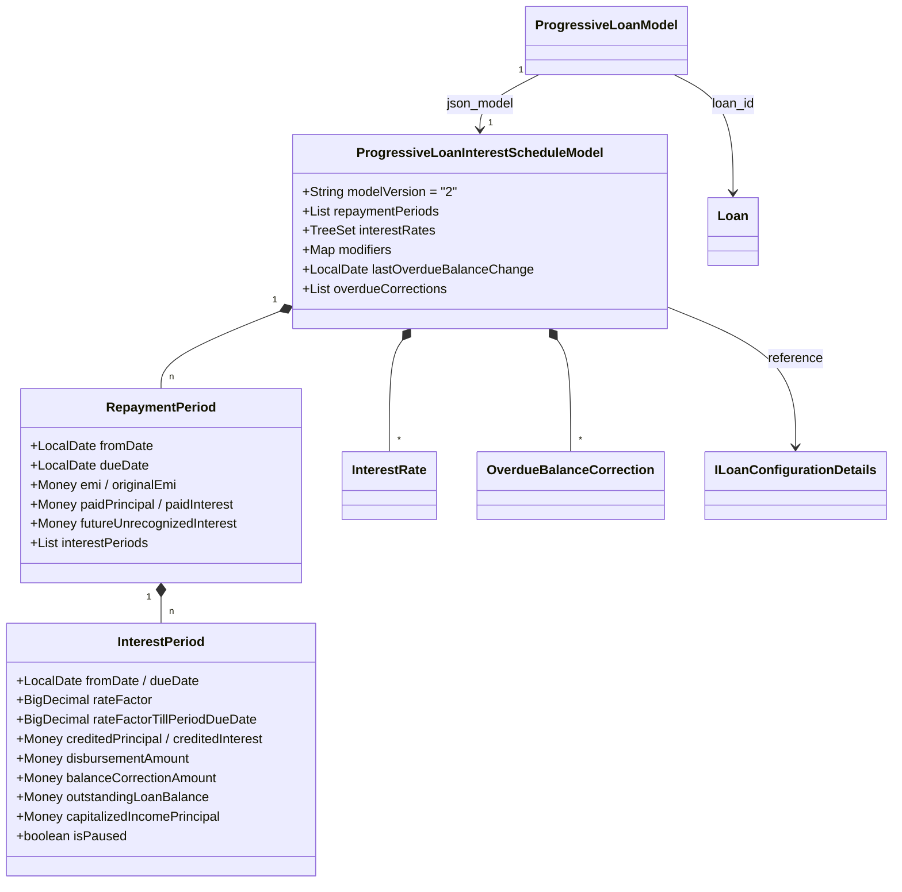
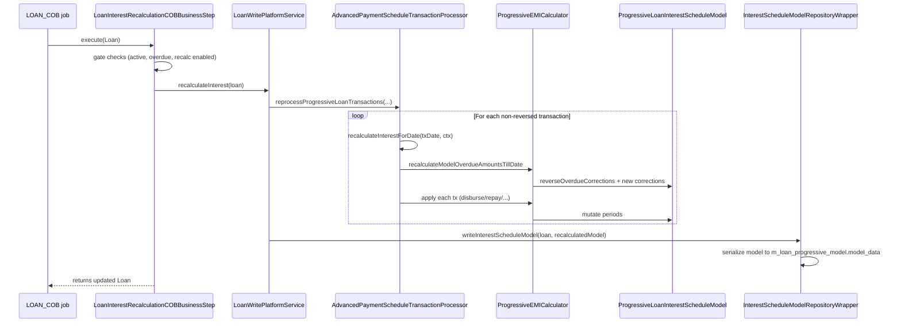
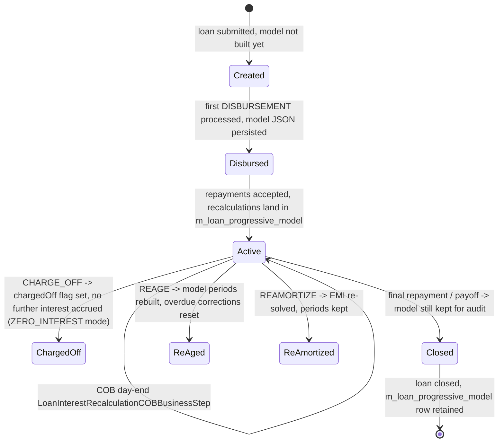

The Apache Fineract progressive-loan engine pivots around one persistent data structure: the **`ProgressiveLoanInterestScheduleModel`**. Where the classic loan flow stores the schedule entirely in `m_loan_repayment_schedule`, the progressive flow keeps an additional JSON snapshot of the live interest model in `m_loan_progressive_model.model_data`. That snapshot is the source of truth for daily-compounded interest: it knows which days are paused, which days had balance changes, which interest periods have been paid, and what EMI was charged versus solved for. This page documents the model's shape, the services that load and persist it, and the daily recalculation that keeps it in sync with the COB date.

## Object graph



## `ProgressiveLoanInterestScheduleModel`

Lives at `fineract-progressive-loan/src/main/java/org/apache/fineract/portfolio/loanproduct/calc/data/ProgressiveLoanInterestScheduleModel.java`. It is a Lombok `@Data` class with fluent accessors:

```java
@Data
@Accessors(fluent = true)
@AllArgsConstructor
public class ProgressiveLoanInterestScheduleModel {

    private static final String modelVersion = "2";
    private final List<RepaymentPeriod> repaymentPeriods;
    private final TreeSet<InterestRate> interestRates;
    @JsonExclude
    private final ILoanConfigurationDetails loanProductRelatedDetail;
    private final Integer installmentAmountInMultiplesOf;
    @JsonExclude
    private final MathContext mc;
    @JsonExclude
    private final Money zero;
    private final Map<LoanInterestScheduleModelModifiers, Boolean> modifiers;

    @Setter
    private LocalDate lastOverdueBalanceChange;
    private List<OverdueBalanceCorrection> overdueCorrections = new ArrayList<>();
    // ...
}
```

### `modelVersion`

A constant `"2"`. When the JSON parser reads a stored model whose version mismatches the current code, `ProgressiveLoanModelProcessingService.hasValidModel(...)` returns false and the model is rebuilt from scratch.

### `modifiers`

A `Map<LoanInterestScheduleModelModifiers, Boolean>` carrying four flags:

| Modifier | Meaning |
| --- | --- |
| `EMI_RECALCULATION` | When false, structural mutations (disbursement, balance correction) no longer trigger an EMI re-solve |
| `COPY` | Set to `true` on the in-memory deep copy used by speculative calculations (`copyWithoutPaidAmounts`) so they don't accidentally persist |
| `INTEREST_RECALCULATION_ENABLED` | Mirrors the loan product flag |
| `INTEREST_PAUSE_FOR_EMI_CALCULATION` | True when the product has a positive `graceOnInterestPayment` |

### `interestRates`

`TreeSet<InterestRate>` in reverse-chronological order. Each `InterestRate` is `(LocalDate effectiveFrom, BigDecimal interestRate)`. The lookup is "first one whose `effectiveFrom <= target`":

```java
public BigDecimal getInterestRate(final LocalDate effectiveDate) {
    return interestRates.isEmpty() ? loanProductRelatedDetail.getAnnualNominalInterestRate()
                                   : findInterestRate(effectiveDate);
}

private BigDecimal findInterestRate(final LocalDate effectiveDate) {
    return interestRates.stream()
            .filter(ir -> !DateUtils.isAfter(ir.effectiveFrom(), effectiveDate))
            .map(InterestRate::interestRate)
            .findFirst()
            .orElse(loanProductRelatedDetail.getAnnualNominalInterestRate());
}
```

### Period lookup helpers

```java
public Optional<RepaymentPeriod> findRepaymentPeriodByFromAndDueDate(LocalDate from, LocalDate due) { ... }
public Optional<RepaymentPeriod> findRepaymentPeriod(@NotNull LocalDate transactionDate)        { ... }
public List<RepaymentPeriod> getRelatedRepaymentPeriods(LocalDate calculateFromRepaymentPeriodDueDate) { ... }
```

`findRepaymentPeriodByFromAndDueDate` first looks for an exact match, then falls back to a period that encompasses the requested range — this handles collapsed stub periods produced by re-aging.

### Mutation API

```java
public Optional<RepaymentPeriod> changeOutstandingBalanceAndUpdateInterestPeriods(
        LocalDate balanceChangeDate, Money disbursedAmount,
        Money correctionAmount, Money capitalizedIncomePrincipal) {
    return findRepaymentPeriodForBalanceChange(balanceChangeDate).stream()
            .peek(updateInterestPeriodOnRepaymentPeriod(balanceChangeDate, disbursedAmount,
                    correctionAmount, capitalizedIncomePrincipal))
            .findFirst();
}
```

A balance change date either lands inside an existing `InterestPeriod` (in which case the period's amounts are incremented in place) or splits an interest period at the change date by calling `insertInterestPeriod(...)`:

```java
void insertInterestPeriod(final RepaymentPeriod repaymentPeriod, final LocalDate balanceChangeDate,
        final Money disbursedAmount, final Money correctionAmount, Money capitalizedIncomePrincipal) {
    final InterestPeriod previousInterestPeriod = findPreviousInterestPeriod(repaymentPeriod, balanceChangeDate);
    final LocalDate originalDueDate = previousInterestPeriod.getDueDate();
    final LocalDate newDueDate      = calculateNewDueDate(previousInterestPeriod, balanceChangeDate);
    final boolean isPaused          = previousInterestPeriod.isPaused();

    previousInterestPeriod.setDueDate(newDueDate);
    previousInterestPeriod.addDisbursementAmount(disbursedAmount);
    previousInterestPeriod.addCapitalizedIncomePrincipalAmount(capitalizedIncomePrincipal);
    previousInterestPeriod.addBalanceCorrectionAmount(correctionAmount);

    final InterestPeriod interestPeriod = InterestPeriod.withEmptyAmounts(repaymentPeriod, newDueDate, originalDueDate, isPaused);
    final List<InterestPeriod> interestPeriods = repaymentPeriod.getInterestPeriods();
    final int previousIndex = interestPeriods.indexOf(previousInterestPeriod);
    interestPeriods.add(previousIndex + 1, interestPeriod);
}
```

### Overdue corrections

`OverdueBalanceCorrection` is recorded whenever the daily recalculation finds that interest accrued past a period due date needs to be added back into a later period:

```java
public void recordOverdueCorrection(LocalDate correctionDate, Money amount, LocalDate affectedRpDueDate) {
    overdueCorrections.add(new OverdueBalanceCorrection(correctionDate, amount, affectedRpDueDate));
}

public void reverseOverdueCorrections() {
    for (final OverdueBalanceCorrection oc : overdueCorrections) {
        changeOutstandingBalanceAndUpdateInterestPeriods(oc.correctionDate(), zero(),
                oc.amount().negated(), zero());
    }
    overdueCorrections.clear();
    this.lastOverdueBalanceChange = null;
}
```

`reverseOverdueCorrections()` is what `recalculateInterestForDate(...)` calls at the top of every iteration to undo the previous recalculation before applying a fresh one.

### Aggregated reads

These are used by accounting / read APIs and by `getOutstandingAmountsTillDate(...)`:

```java
public Money getTotalDueInterest()              // includes credited interest
public Money getTotalDuePrincipal()             // disbursed + capitalized income
public Money getTotalPaidInterest()
public Money getTotalPaidPrincipal()
public Money getTotalCreditedPrincipal()
public Money getTotalOutstandingPrincipal()
```

## `RepaymentPeriod`

```java
@ToString(exclude = { "previous" })
@EqualsAndHashCode(exclude = { "previous" })
public class RepaymentPeriod {

    @JsonExclude private final RepaymentPeriod previous;
    @Setter @Getter private LocalDate fromDate;
    @Setter @Getter private LocalDate dueDate;
    @Getter @Setter private List<InterestPeriod> interestPeriods;
    @Setter private Money emi;
    @Setter private Money originalEmi;
    private Money paidPrincipal;
    private Money paidInterest;
    @Setter private Money futureUnrecognizedInterest;
    @JsonExclude @Getter private final MathContext mc;

    @JsonExclude private Memo<BigDecimal> rateFactorPlus1Calculation;
    @JsonExclude private Memo<Money>      calculatedDueInterestCalculation;
    @JsonExclude private Memo<Money>      dueInterestCalculation;
    @JsonExclude private Memo<Money>      outstandingBalanceCalculation;

    @Getter @Setter private boolean isInterestMovedUpward = false;
    // ...
}
```

* `previous` — back-pointer used for balance carry-forward; **excluded** from JSON (avoids cycles).
* `emi` vs. `originalEmi` — `originalEmi` is the EMI that was solved when the model was built; `emi` is the current effective EMI after re-amortization, re-aging or rate changes.
* `paidPrincipal` / `paidInterest` — track repayments applied to this period; they are immutable from the outside (no setters) and only change via `addPaidPrincipal/addPaidInterest` callbacks.
* `futureUnrecognizedInterest` — set by `calculateUnrecognizedInterestForClosedPeriodByInterestRecalculationStrategy` for pre-pay attempts using `TILL_REST_FREQUENCY_DATE` strategy.
* `Memo<T>` fields — lazy memoised calculations of rate factor, due interest and outstanding balance, invalidated whenever the period mutates.

## `InterestPeriod`

The most granular unit:

```java
@Getter
@ToString(exclude = { "repaymentPeriod" })
@EqualsAndHashCode(exclude = { "repaymentPeriod" })
public class InterestPeriod implements Comparable<InterestPeriod> {
    @JsonExclude private final RepaymentPeriod repaymentPeriod;
    @Setter @NotNull private LocalDate fromDate;
    @Setter @NotNull private LocalDate dueDate;
    @Setter private BigDecimal rateFactor;
    @Setter private BigDecimal rateFactorTillPeriodDueDate;
    private Money creditedPrincipal;      // CHARGEBACK / CREDIT_BALANCE_REFUND
    private Money creditedInterest;       // CHARGEBACK
    @Setter private Money disbursementAmount;
    private Money balanceCorrectionAmount;
    private Money outstandingLoanBalance;
    private Money capitalizedIncomePrincipal;
    @JsonExclude @Getter private final MathContext mc;
    @Setter private boolean isPaused;
    // ...
}
```

`rateFactor` is `annualRate × daysInPeriod / daysInYear` honouring the loan product's `DaysInMonthType` and `DaysInYearType`. `rateFactorTillPeriodDueDate` is the partial factor up to the repayment period's due date, used by mid-period accrual queries.

## Persistence — `ProgressiveLoanModel` row

`m_loan_progressive_model` is the JPA-mapped table; the entity (in `fineract-loan`) carries:

| Column | Java type | Notes |
| --- | --- | --- |
| `id` | `Long` | PK |
| `loan_id` | `Long` | FK to `m_loan` |
| `business_date` | `LocalDate` | Last business date the model was recalculated to |
| `model_data` | `String` (JSON) | Serialized `ProgressiveLoanInterestScheduleModel` |
| `model_version` | `String` | Must equal `ProgressiveLoanInterestScheduleModel.modelVersion` |

The JSON is produced/consumed by `ProgressiveLoanInterestScheduleModelParserServiceGsonImpl`, which uses a Gson context (`InterestScheduleModelServiceGsonContext`) configured with the JSON converters in `loanproduct/calc/converter/`.

## `InterestScheduleModelRepositoryWrapper`

The interface that every other layer talks to:

```java
public interface InterestScheduleModelRepositoryWrapper {

    Optional<ProgressiveLoanModel> findOneByLoanId(Long loanId);
    Optional<ProgressiveLoanModel> findOneByLoan(Loan loan);

    Optional<ProgressiveLoanInterestScheduleModel> extractModel(Optional<ProgressiveLoanModel> progressiveLoanModel);

    ProgressiveLoanInterestScheduleModel writeInterestScheduleModel(Loan loan, ProgressiveLoanInterestScheduleModel model);

    Optional<ProgressiveLoanInterestScheduleModel> readProgressiveLoanInterestScheduleModel(
            Long loanId, ILoanConfigurationDetails detail, Integer installmentAmountInMultipliesOf);

    boolean hasValidModelForDate(Long loanId, LocalDate targetDate);

    Optional<ProgressiveLoanInterestScheduleModel> getSavedModel(Loan loan, LocalDate businessDate);

    Long removeByLoanId(Long loanId);
}
```

### `getSavedModel(...)` — read with on-the-fly catch-up

This is the most frequently-called method; it not only loads but rolls forward when the persisted model is older than `businessDate`:

```java
@Override
public Optional<ProgressiveLoanInterestScheduleModel> getSavedModel(Loan loan, LocalDate businessDate) {
    Optional<ProgressiveLoanModel> progressiveLoanModel = findOneByLoanId(loan.getId());
    Optional<ProgressiveLoanInterestScheduleModel> savedModel;
    if (progressiveLoanModel.isPresent()) {
        savedModel = extractModel(progressiveLoanModel);
        if (savedModel.isPresent() && progressiveLoanModel.get().getBusinessDate().isBefore(businessDate)) {
            ProgressiveTransactionCtx ctx = new ProgressiveTransactionCtx(loan.getCurrency(),
                    loan.getRepaymentScheduleInstallments(), Set.of(),
                    new MoneyHolder(loan.getTotalOverpaidAsMoney()),
                    new ChangedTransactionDetail(), savedModel.get(),
                    loan.getActiveLoanTermVariations());
            ctx.setChargedOff(loan.isChargedOff());
            ctx.setWrittenOff(loan.isClosedWrittenOff());
            ctx.setContractTerminated(loan.isContractTermination());
            advancedPaymentScheduleTransactionProcessor.recalculateInterestForDate(businessDate, ctx);
        }
    } else {
        savedModel = Optional.empty();
    }
    return savedModel;
}
```

The wrapper builds a temporary `ProgressiveTransactionCtx` and asks the processor to recalculate interest up to the requested business date — without writing anything back. This is how `getPeriodInterestTillDate(...)` and prepayment quotes are always "as of today" even if the persisted snapshot is from yesterday.

### `writeInterestScheduleModel(...)`

Serializes the model, sets `business_date = today`, and upserts:

* If a row exists for the loan, update `model_data`, `business_date`, `model_version`.
* Otherwise insert a fresh row.

### `hasValidModelForDate(...)`

A cheap check used by callers that want to know whether a re-recalc is needed:

```java
@Override
public boolean hasValidModelForDate(Long loanId, LocalDate targetDate) {
    Optional<ProgressiveLoanModel> progressiveLoanModel = findOneByLoanId(loanId);
    LocalDate modelUpdatedTilDate = progressiveLoanModel.map(ProgressiveLoanModel::getBusinessDate).orElse(null);
    return progressiveLoanModel.isPresent() && !targetDate.isBefore(modelUpdatedTilDate);
}
```

## `ProgressiveLoanModelProcessingService`

Top-level orchestrator that decides "should we recompute?" and persists the result:

```java
@Component
@RequiredArgsConstructor
public class ProgressiveLoanModelProcessingService {

    private static final List<LoanStatus> allowedLoanStatuses = List.of(
            LoanStatus.ACTIVE, LoanStatus.CLOSED_OBLIGATIONS_MET,
            LoanStatus.CLOSED_WRITTEN_OFF, LoanStatus.OVERPAID);

    private final LoanRepositoryWrapper loanRepositoryWrapper;
    private final ProgressiveLoanModelRecalculationService modelProcessingService;
    private final InterestScheduleModelRepositoryWrapper modelRepositoryWrapper;
    private final ProgressiveLoanModelRepository progressiveLoanModelRepository;

    public boolean hasValidModel(Long loanId, String modelVersion) {
        return progressiveLoanModelRepository.hasValidModel(loanId, modelVersion);
    }

    @Transactional(propagation = Propagation.REQUIRES_NEW)
    public void recalculateModelAndSave(Long loanId) {
        Loan loan = loanRepositoryWrapper.findOneWithNotFoundDetection(loanId);
        ProgressiveLoanInterestScheduleModel recalculatedModel = modelProcessingService.getRecalculatedModel(
                loan.getId(), ThreadLocalContextUtil.getBusinessDate());
        if (recalculatedModel != null) {
            modelRepositoryWrapper.writeInterestScheduleModel(loan, recalculatedModel);
        }
    }

    public boolean allowedLoanStatuses(Long loanId) {
        return loanRepositoryWrapper.isLoanInAllowedStatus(loanId, allowedLoanStatuses);
    }
}
```

The `REQUIRES_NEW` propagation is critical: even when the surrounding business operation rolls back, the recalculated model can be committed independently.

## `ProgressiveLoanModelRecalculationService`

The inner worker — does a full reprocess of the transaction history in its own read-only transaction:

```java
@Component
@RequiredArgsConstructor
public class ProgressiveLoanModelRecalculationService {

    private final LoanRepaymentScheduleTransactionProcessorFactory transactionProcessorFactory;
    private final LoanTransactionRepository loanTransactionRepository;
    private final LoanRepositoryWrapper loanRepositoryWrapper;

    @Transactional(readOnly = true, propagation = Propagation.REQUIRES_NEW)
    public ProgressiveLoanInterestScheduleModel getRecalculatedModel(Long loanId, LocalDate tillDate) {
        Loan loan = loanRepositoryWrapper.findOneWithNotFoundDetection(loanId);
        LoanRepaymentScheduleTransactionProcessor transactionProcessor = transactionProcessorFactory
                .determineProcessor(loan.getTransactionProcessingStrategyCode());
        if (transactionProcessor instanceof AdvancedPaymentScheduleTransactionProcessor advanced) {
            List<LoanTransaction> loanTransactions =
                    loanTransactionRepository.findNonReversedTransactionsForReprocessingByLoan(loan);
            Pair<ChangedTransactionDetail, ProgressiveLoanInterestScheduleModel> result =
                    advanced.reprocessProgressiveLoanTransactions(loan.getDisbursementDate(), tillDate,
                            loanTransactions, loan.getCurrency(),
                            loan.getRepaymentScheduleInstallments(), loan.getActiveCharges());
            return result.getRight();
        }
        return null;
    }
}
```

`reprocessProgressiveLoanTransactions(...)` returns both the model and a `ChangedTransactionDetail` describing every transaction whose components moved as a result — for example interest reallocated because a past-due interest period shifted into a new bucket after recalculation.

## Daily recalculation through COB

The progressive interest model is advanced daily by `LoanInterestRecalculationCOBBusinessStep` (Apache Fineract's only COB step that runs `LoanWritePlatformService.recalculateInterest`). It lives at `fineract-provider/src/main/java/org/apache/fineract/cob/loan/LoanInterestRecalculationCOBBusinessStep.java` — see [Loan COB business steps](/cob/loan-cob-business-steps) for the full step catalog.

```java
@Slf4j
@Component
@RequiredArgsConstructor
public class LoanInterestRecalculationCOBBusinessStep implements LoanCOBBusinessStep {

    private final LoanWritePlatformService loanWritePlatformService;

    @Override
    public Loan execute(Loan loan) {
        try {
            ThreadLocalContextUtil.setActionContext(ActionContext.DEFAULT);
            if (!loan.getStatus().isActive()
                    || loan.isNpa()
                    || loan.isChargedOff()
                    || !loan.isInterestBearingAndInterestRecalculationEnabled()
                    || loan.getLoanInterestRecalculationDetails().disallowInterestCalculationOnPastDue()
                    || !hasOverdueInstallment(loan)) {
                log.debug("Skip processing loan interest recalculation [{}] ...", loan.getId());
                return loan;
            }
            log.debug("Start processing loan interest recalculation [{}]", loan.getId());
            loan = loanWritePlatformService.recalculateInterest(loan);
            log.debug("End processing loan interest recalculation [{}]", loan.getId());
            return loan;
        } finally {
            ThreadLocalContextUtil.setActionContext(ActionContext.COB);
        }
    }

    private boolean hasOverdueInstallment(Loan loan) {
        return loan.getRepaymentScheduleInstallments().stream()
                .anyMatch(installment -> DateUtils.isBeforeBusinessDate(installment.getDueDate())
                        && !installment.isObligationsMet());
    }

    @Override public String getEnumStyledName()      { return "LOAN_INTEREST_RECALCULATION"; }
    @Override public String getHumanReadableName()   { return "Loan Interest Recalculation"; }
}
```

Gate conditions — the step **skips** a loan when any of these hold:

* Loan status is not `ACTIVE`.
* Loan is flagged NPA (non-performing).
* Loan is already charged-off.
* Loan is not interest-bearing OR interest recalculation is disabled at product level.
* `LoanInterestRecalculationDetails.disallowInterestCalculationOnPastDue` is true.
* No installment is currently overdue.

The `ActionContext` swap from `COB` to `DEFAULT` is important — it ensures the recalculation behaves as a regular business write so business-event publishers fire correctly.

## End-to-end recalculation sequence



## EMI Calculator API surface

`EMICalculator` is the contract; `ProgressiveEMICalculator` is the only implementation. Key mutation methods (all live in `fineract-progressive-loan/src/main/java/org/apache/fineract/portfolio/loanproduct/calc/EMICalculator.java`):

```java
ProgressiveLoanInterestScheduleModel generatePeriodInterestScheduleModel(
        @NotNull List<LoanScheduleModelRepaymentPeriod> periods,
        @NotNull ILoanConfigurationDetails loanProductRelatedDetail,
        Integer installmentAmountInMultiplesOf, MathContext mc);

ProgressiveLoanInterestScheduleModel generateInstallmentInterestScheduleModel(
        @NotNull List<RepaymentScheduleInstallmentData> installments,
        @NotNull ILoanConfigurationDetails loanProductRelatedDetail,
        Integer installmentAmountInMultiplesOf, MathContext mc);

Optional<RepaymentPeriod> findRepaymentPeriod(ProgressiveLoanInterestScheduleModel scheduleModel,
        LocalDate fromDate, LocalDate dueDate);

void addDisbursement(ProgressiveLoanInterestScheduleModel scheduleModel, LocalDate disbursementDueDate,
        Money disbursedAmount);

void addCapitalizedIncome(ProgressiveLoanInterestScheduleModel scheduleModel, LocalDate transactionDueDate,
        Money transactionAmount);

void changeInterestRate(ProgressiveLoanInterestScheduleModel scheduleModel,
        LocalDate newInterestSubmittedOnDate, BigDecimal newInterestRate);

void addRepaymentPeriods(ProgressiveLoanInterestScheduleModel scheduleModel, LocalDate submittedOnDate, ...);

void addBalanceCorrection(ProgressiveLoanInterestScheduleModel scheduleModel,
        LocalDate balanceCorrectionDate, Money correctionAmount);

void payInterest(ProgressiveLoanInterestScheduleModel scheduleModel, LocalDate repaymentPeriodFromDate,
        LocalDate transactionDate, Money paidInterest);

void payPrincipal(ProgressiveLoanInterestScheduleModel scheduleModel, LocalDate repaymentPeriodFromDate,
        LocalDate transactionDate, Money paidPrincipal);

void creditPrincipal(ProgressiveLoanInterestScheduleModel scheduleModel, LocalDate transactionDate,
        Money creditedPrincipalAmount);

void creditInterest(ProgressiveLoanInterestScheduleModel scheduleModel, LocalDate transactionDate,
        Money creditedInterestAmount);

PeriodDueDetails getDueAmounts(@NotNull ProgressiveLoanInterestScheduleModel scheduleModel,
        @NotNull LocalDate periodFromDate, ...);

Money getPeriodInterestTillDate(@NotNull ProgressiveLoanInterestScheduleModel scheduleModel,
        @NotNull LocalDate periodFromDate, ...);

Money getOutstandingLoanBalanceOfPeriod(ProgressiveLoanInterestScheduleModel interestScheduleModel,
        LocalDate targetDate);

OutstandingDetails getOutstandingAmountsTillDate(ProgressiveLoanInterestScheduleModel model, LocalDate targetDate);

void applyInterestPause(ProgressiveLoanInterestScheduleModel scheduleModel, LocalDate fromDate, LocalDate endDate);

boolean recalculateModelOverdueAmountsTillDate(ProgressiveLoanInterestScheduleModel ctx,
        LocalDate targetDate, boolean prepayAttempt);
```

## How an interest period gets its rate factor

`ProgressiveEMICalculator.calculateRateFactorForRepaymentPeriod(...)` walks every `InterestPeriod` of the period and computes:

```text
rateFactor          = (annualRate / 100) × daysInPeriod / daysInYearForPeriod
rateFactorTillDueDate = (annualRate / 100) × daysFromPeriodStartToDueDate / daysInYearForPeriod
```

The `daysInYear` value depends on the loan product's `DaysInYearType`:

| Enum | Days |
| --- | --- |
| `DAYS_360` | 360 |
| `DAYS_364` | 364 |
| `DAYS_365` | 365 |
| `ACTUAL` | actual days in calendar year (depends on `daysInYearCustomStrategy`) |

Interest periods marked `isPaused = true` contribute zero rate factor — that's how the pause feature suspends interest accrual without changing principal.

## OverdueBalanceCorrection — how past-due interest catches up

When the COB date crosses a repayment-period due date and the borrower has paid less than the period's `dueInterest + duePrincipal`, the unpaid principal slides forward and continues to accrue interest. `recalculateModelOverdueAmountsTillDate(...)` discovers this by walking the periods up to `targetDate`, summing each period's outstanding-principal-as-of-due-date, and recording an `OverdueBalanceCorrection` for the **subsequent** period:

```java
public void recordOverdueCorrection(final LocalDate correctionDate, final Money amount, final LocalDate affectedRpDueDate) {
    overdueCorrections.add(new OverdueBalanceCorrection(correctionDate, amount, affectedRpDueDate));
}
```

The correction acts like a balance bump in the next period's interest periods, adding additional `balanceCorrectionAmount` so the rate factor multiplies a larger base.

On the next recalculation the model **reverses** all corrections first (`reverseOverdueCorrections()`), then computes fresh corrections from the current truth — making the operation idempotent.

## Lifecycle map



## Cross references

* For the schedule generator that creates the initial model — [Progressive schedule generator](/progressive-loan/progressive-schedule-generator).
* For how each transaction type mutates the model — [Progressive transaction processors](/progressive-loan/progressive-transaction-processors).
* For the daily COB step that drives recalculation — [Loan COB business steps](/cob/loan-cob-business-steps).
* For the parent loan domain that owns the schedule installments — [Loan overview](/loan/overview).
* For accounting outputs of interest accrual — [Accounting processors](/accounting/accounting-processors).
