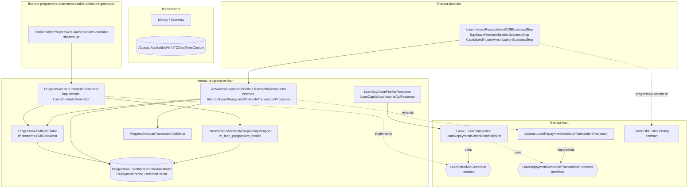
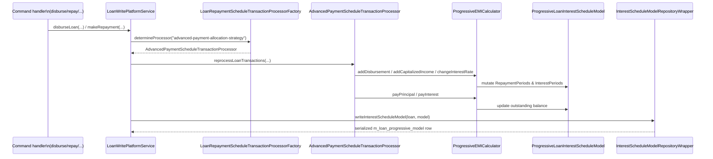

Apache Fineract's **progressive loan** subsystem lives in `fineract-progressive-loan/` and layers on top of the classic `fineract-loan` module to deliver loans whose interest is compounded **daily on the outstanding balance** rather than allocated by flat or declining-balance precomputation. A progressive loan keeps a persistent **interest schedule model** (`ProgressiveLoanInterestScheduleModel`) that is mutated by every transaction — disbursement, repayment, charge, charge-off, re-age, capitalized income, buy-down fee — so EMI and interest amounts are continuously re-derived from a single source of truth. Interest is split across `InterestPeriod`s that align with balance-change events, and the schedule generator (`ProgressiveLoanScheduleGenerator`) drives initial schedule build while the **advanced payment allocation strategy** (`AdvancedPaymentScheduleTransactionProcessor`) replays transactions to project the live schedule forward.

The module pairs a Spring-bean stack inside `fineract-progressive-loan` with a shadow-jar sibling — `fineract-progressive-loan-embeddable-schedule-generator` — that re-exports the schedule generator as a standalone library, so external integrations can produce identical schedules without booting the whole Fineract container.

## What "progressive" means in code

<CardGroup cols={2}>
  <Card title="Daily compounding on outstanding balance" icon="calculator">
    `ProgressiveEMICalculator` walks each `InterestPeriod` and applies a rate factor derived from days-in-period / days-in-year, compounding into the next period's opening balance.
  </Card>
  <Card title="Advanced payment allocation" icon="route">
    The transaction processor reads a configurable `paymentAllocation` array (PAST_DUE / IN_ADVANCE / DUE / FUTURE × PENALTY/FEE/INTEREST/PRINCIPAL) and applies funds horizontally or vertically.
  </Card>
  <Card title="Persistent interest model" icon="database">
    The serialized `ProgressiveLoanInterestScheduleModel` is stored in `m_loan_progressive_model` so re-loads pick up exactly where they left off without re-running every transaction.
  </Card>
  <Card title="Daily recalculation hook" icon="clock">
    `LoanInterestRecalculationCOBBusinessStep` recomputes the model whenever the COB date moves and there are overdue installments, registering newly accrued interest into the live model.
  </Card>
</CardGroup>

## Module file tree

```
fineract-progressive-loan/
└── src/main/java/org/apache/fineract/
    ├── portfolio/
    │   ├── configuration/                                    # Spring auto-config glue
    │   ├── delinquency/service/                              # Progressive-aware delinquency reads
    │   ├── loanaccount/
    │   │   ├── api/
    │   │   │   ├── LoanBuyDownFeeApiResource.java            # GET /v1/loans/{id}/buydown-fees
    │   │   │   └── LoanCapitalizedIncomeApiResource.java     # GET /v1/loans/{id}/capitalized-incomes
    │   │   ├── data/
    │   │   │   ├── BuyDownFeeAmortizationDetails.java
    │   │   │   ├── CapitalizedIncomeDetails.java
    │   │   │   └── LoanCapitalizedIncomeData.java
    │   │   ├── domain/
    │   │   │   ├── LoanBuyDownFeeBalance.java                # @Entity m_loan_buy_down_fee_balance
    │   │   │   ├── LoanCapitalizedIncomeBalance.java         # @Entity m_loan_capitalized_income_balance
    │   │   │   └── transactionprocessor/impl/
    │   │   │       ├── AdvancedPaymentScheduleTransactionProcessor.java  # ~4200 LoC
    │   │   │       ├── ChangeOperation.java
    │   │   │       └── ProgressiveTransactionCtx.java
    │   │   ├── handler/
    │   │   │   ├── AddBuyDownFeeCommandHandler.java          # LOAN/BUYDOWNFEE
    │   │   │   ├── AddCapitalizedIncomeCommandHandler.java   # LOAN/CAPITALIZEDINCOME
    │   │   │   ├── BuyDownFeeAdjustmentCommandHandler.java
    │   │   │   └── CapitalizedIncomeAdjustmentCommandHandler.java
    │   │   ├── loanschedule/
    │   │   │   ├── data/                                     # LoanSchedulePlan*Period DTOs
    │   │   │   └── domain/
    │   │   │       └── ProgressiveLoanScheduleGenerator.java # implements LoanScheduleGenerator
    │   │   ├── mapper/                                       # LoanConfigurationDetailsMapper etc.
    │   │   ├── repository/                                   # LoanBuyDownFeeBalanceRepository, ...
    │   │   ├── rescheduleloan/                               # Progressive reschedule support
    │   │   ├── service/
    │   │   │   ├── BuyDownFeePlatformService.java            # write
    │   │   │   ├── BuyDownFeeReadPlatformService.java
    │   │   │   ├── BuyDownFeeWritePlatformServiceImpl.java
    │   │   │   ├── CapitalizedIncomeBalanceReadService.java
    │   │   │   ├── CapitalizedIncomeBalanceServiceImpl.java
    │   │   │   ├── CapitalizedIncomeWritePlatformServiceImpl.java
    │   │   │   ├── InterestScheduleModelRepositoryWrapper.java
    │   │   │   ├── InternalProgressiveLoanApiResource.java   # @Profile(TEST)
    │   │   │   ├── ProgressiveLoanConfiguration.java
    │   │   │   ├── ProgressiveLoanModelProcessingService.java
    │   │   │   ├── ProgressiveLoanModelRecalculationService.java
    │   │   │   ├── ProgressiveLoanStatusChangePlatformServiceImpl.java
    │   │   │   ├── ProgressiveLoanTransactionValidator.java
    │   │   │   └── ProgressiveLoanTransactionValidatorImpl.java
    │   │   └── starter/                                      # Spring Boot AutoConfiguration
    │   ├── loanproduct/
    │   │   ├── calc/
    │   │   │   ├── EMICalculator.java                        # contract
    │   │   │   ├── ProgressiveEMICalculator.java             # ~2200 LoC implementation
    │   │   │   ├── EMICalculatorDataMapper.java
    │   │   │   ├── converter/                                # JSON converters for serialized model
    │   │   │   └── data/
    │   │   │       ├── ProgressiveLoanInterestScheduleModel.java
    │   │   │       ├── RepaymentPeriod.java
    │   │   │       ├── InterestPeriod.java
    │   │   │       ├── EmiChangeOperation.java
    │   │   │       ├── OutstandingDetails.java
    │   │   │       └── PeriodDueDetails.java
    │   │   ├── domain/                                       # Progressive-only loan-product props
    │   │   ├── mapper/                                       # MapStruct adapters
    │   │   └── service/                                      # Progressive product services
    │   └── util/                                             # Helpers (InstallmentProcessingHelper)
    └── resources/
        ├── db/changelog/tenant/module/progressiveloan/        # Liquibase tenant changesets
        └── jpa/static-weaving/module/fineract-progressive-loan/

fineract-progressive-loan-embeddable-schedule-generator/
└── src/main/java/org/apache/fineract/portfolio/loanaccount/loanschedule/domain/
    └── EmbeddableProgressiveLoanScheduleGenerator.java       # public API of the shadow jar
```

## How it extends fineract-loan

`fineract-progressive-loan` does not fork the loan domain — it plugs a different schedule generator and transaction processor into the existing `Loan` aggregate. The classic `fineract-loan` module owns the `Loan`, `LoanRepaymentScheduleInstallment`, `LoanTransaction` entities and the `LoanScheduleGenerator` / `LoanRepaymentScheduleTransactionProcessor` interfaces; the progressive module supplies progressive implementations that the platform picks up by Spring bean discovery.



The key contract: a `Loan` is **progressive** when `loan.isProgressiveSchedule()` returns true (i.e. `loan_product.schedule_type = 'PROGRESSIVE'`) **and** its `transactionProcessingStrategyCode` resolves to `advanced-payment-allocation-strategy`. When both hold, Fineract injects `ProgressiveLoanScheduleGenerator` and `AdvancedPaymentScheduleTransactionProcessor` into the schedule write paths instead of the cumulative/declining-balance defaults.

## Interest model in one paragraph

`ProgressiveLoanInterestScheduleModel` is a list of `RepaymentPeriod` objects. Each `RepaymentPeriod` owns one or more `InterestPeriod` segments that fan out whenever a balance event happens inside the repayment window — a disbursement, a chargeback, a capitalized income credit, a balance correction from a repayment, an interest pause start/end, an interest-rate change, or a re-age boundary. Per-segment interest is `outstandingBalance × rateFactor` where `rateFactor = annualRate × daysInPeriod / daysInYear`. The repayment period's interest is the sum of its segments, and EMI is solved either flat-across-future-periods (for fixed EMI products) or pure declining-balance.

```java
// ProgressiveEMICalculator.generatePeriodInterestScheduleModel — entry point for new schedules
@Override
@NotNull
public ProgressiveLoanInterestScheduleModel generatePeriodInterestScheduleModel(
        @NotNull List<LoanScheduleModelRepaymentPeriod> periods,
        @NotNull ILoanConfigurationDetails loanProductRelatedDetail,
        final Integer installmentAmountInMultiplesOf, final MathContext mc) {
    return generateInterestScheduleModel(periods,
            LoanScheduleModelRepaymentPeriod::periodFromDate,
            LoanScheduleModelRepaymentPeriod::periodDueDate,
            loanProductRelatedDetail, installmentAmountInMultiplesOf, mc);
}
```

## Where each transaction type lands

`AdvancedPaymentScheduleTransactionProcessor.processLatestTransaction(...)` is the single switch that dispatches each `LoanTransactionType` to its handler:

```java
switch (loanTransaction.getTypeOf()) {
    case DISBURSEMENT          -> handleDisbursement(loanTransaction, ctx);
    case WRITEOFF              -> handleWriteOff(loanTransaction, ctx);
    case REFUND_FOR_ACTIVE_LOAN -> handleRefund(loanTransaction, ctx);
    case CHARGEBACK            -> handleChargeback(loanTransaction, ctx);
    case CREDIT_BALANCE_REFUND -> handleCreditBalanceRefund(loanTransaction, ctx);
    case REPAYMENT, MERCHANT_ISSUED_REFUND, PAYOUT_REFUND, GOODWILL_CREDIT,
         CHARGE_REFUND, CHARGE_ADJUSTMENT, DOWN_PAYMENT, WAIVE_INTEREST,
         RECOVERY_REPAYMENT, INTEREST_PAYMENT_WAIVER, CAPITALIZED_INCOME_ADJUSTMENT
                              -> handleRepayment(loanTransaction, ctx);
    case INTEREST_REFUND       -> handleInterestRefund(loanTransaction, ctx);
    case CHARGE_OFF            -> handleChargeOff(loanTransaction, ctx);
    case CHARGE_PAYMENT        -> handleChargePayment(loanTransaction, ctx);
    case REAMORTIZE            -> handleReAmortization(loanTransaction, ctx);
    case REAGE                 -> handleReAge(loanTransaction, ctx);
    case CAPITALIZED_INCOME    -> handleCapitalizedIncome(loanTransaction, ctx);
    case CONTRACT_TERMINATION  -> handleContractTermination(loanTransaction, ctx);
    case WAIVE_CHARGES         -> log.debug("WAIVE_CHARGES transaction will not be processed.");
    default                    -> log.warn("Unhandled transaction processing for transaction type: {}", loanTransaction.getTypeOf());
}
```

Each branch is documented in [Progressive transaction processors](/progressive-loan/progressive-transaction-processors).

## Touch points with adjacent subsystems

| Subsystem | Where it plugs in | Page |
| --- | --- | --- |
| Classic loan schedule generation | `ProgressiveLoanScheduleGenerator` is one of two `LoanScheduleGenerator` beans; selected by loan product `schedule_type` | [Loan overview](/loan/overview) |
| Classic transaction processors | `AdvancedPaymentScheduleTransactionProcessor` is one strategy registered against `LoanRepaymentScheduleTransactionProcessorFactory`; chosen by `transactionProcessingStrategyCode = advanced-payment-allocation-strategy` | [Loan transaction processors](/loan/transaction-processors) |
| Close-of-business | `LoanInterestRecalculationCOBBusinessStep`, `BuyDownFeeAmortizationBusinessStep`, `CapitalizedIncomeAmortizationBusinessStep` all live in `fineract-provider/.../cob/loan/` and only act on progressive loans | [Loan COB business steps](/cob/loan-cob-business-steps) |
| Accounting / GL | Each repayment portion (principal / interest / fees / penalties) flows through the standard accounting processors; buy-down and capitalized income use dedicated income-recognition entries | [Accounting processors](/accounting/accounting-processors) |
| External events | Buy-down and capitalized-income transactions produce `LoanBuyDownFee*BusinessEvent`, `LoanCapitalizedIncome*BusinessEvent` published from `fineract-loan` | — |
| Internal test API | `InternalProgressiveLoanApiResource` exposes `/v1/internal/loan/progressive/{loanId}/model` (only `@Profile(FineractProfiles.TEST)`) for inspecting the persisted model | [Progressive Loan API](/progressive-loan/progressive-loan-api) |

## Reading order for this section

<Steps>
  <Step title="Schedule generator">
    Start with [Progressive schedule generator](/progressive-loan/progressive-schedule-generator) to see how an initial `LoanScheduleModel` is produced from `LoanApplicationTerms` and the EMI calculator.
  </Step>
  <Step title="Interest model">
    Read [Model and recalculation](/progressive-loan/model-and-recalculation) for the data shapes (`RepaymentPeriod`, `InterestPeriod`) and the daily recalculation flow.
  </Step>
  <Step title="Transaction processor">
    Then [Progressive transaction processors](/progressive-loan/progressive-transaction-processors) for how each `LoanTransaction` mutates the model and the schedule.
  </Step>
  <Step title="Capitalized income & buy-down fee">
    Both [Capitalized income](/progressive-loan/capitalized-income) and [Buy-down fee](/progressive-loan/buy-down-fee) are progressive-only loan-account constructs.
  </Step>
  <Step title="APIs and embeddable jar">
    Wrap up with [Progressive Loan API](/progressive-loan/progressive-loan-api) and [Embeddable schedule generator](/progressive-loan/embeddable-schedule-generator).
  </Step>
</Steps>

## Quick orientation: who calls whom



## Where to look in the code first

| Question | Open this file |
| --- | --- |
| "How is the initial schedule built?" | `loanschedule/domain/ProgressiveLoanScheduleGenerator.java` |
| "How is interest calculated day-by-day?" | `loanproduct/calc/ProgressiveEMICalculator.java` |
| "What happens when a repayment lands?" | `domain/transactionprocessor/impl/AdvancedPaymentScheduleTransactionProcessor.java#handleRepayment` |
| "How is the persistent model stored and re-read?" | `service/InterestScheduleModelRepositoryWrapperImpl.java` |
| "What COB step recomputes interest?" | `fineract-provider/.../cob/loan/LoanInterestRecalculationCOBBusinessStep.java` |
| "How do I capitalize income on a loan?" | `service/CapitalizedIncomeWritePlatformServiceImpl.java`, `handler/AddCapitalizedIncomeCommandHandler.java` |
| "How do I add a buy-down fee?" | `service/BuyDownFeeWritePlatformServiceImpl.java`, `handler/AddBuyDownFeeCommandHandler.java` |
| "Can I run the schedule generator without booting Fineract?" | `fineract-progressive-loan-embeddable-schedule-generator/.../EmbeddableProgressiveLoanScheduleGenerator.java` |

## What progressive loans give you that classic ones don't

<CardGroup cols={2}>
  <Card title="True declining-balance interest" icon="trending-down">
    Interest accrues on the actual outstanding principal day-by-day; a repayment that lands mid-period immediately reduces the next day's interest accrual. Classic flat / declining-balance schedules pre-compute interest per installment and cannot react to mid-period balance changes without a full reschedule.
  </Card>
  <Card title="Per-day balance correctness" icon="calendar-days">
    `getOutstandingLoanBalanceOfPeriod(model, anyDate)` returns the principal as of any historical date. The persisted model is what makes that O(1).
  </Card>
  <Card title="Configurable allocation order" icon="list-ol">
    `LoanProductPaymentAllocationRule` lets product teams ship different products with different allocation policies (e.g. interest-first for SME, principal-first for student loans) without code changes.
  </Card>
  <Card title="Daily income recognition" icon="coins">
    Buy-down fees and capitalized income are recognised over the loan term via COB amortization steps — the deferred-income liability is correctly carried day-by-day.
  </Card>
  <Card title="Multi-tranche aware" icon="boxes-stacked">
    `addDisbursement(...)` on the EMI calculator natively supports mid-loan tranches, recomputing the EMI from the disbursement date onward without losing earlier history.
  </Card>
  <Card title="Re-age and re-amortize built-in" icon="rotate">
    `REAGE` / `REAMORTIZE` transactions mutate the model in place; previous repayments stay attached to their original installments.
  </Card>
</CardGroup>

## Critical invariants

These are properties the module guarantees and that downstream code relies on:

* **Strategy code = `advanced-payment-allocation-strategy`** — a progressive loan whose `transactionProcessingStrategyCode` does NOT match this constant will fail at runtime when the loan is reprocessed. The strategy code is normally seeded by the loan-product save flow.
* **`schedule_type = PROGRESSIVE` ⇒ ProgressiveLoanScheduleGenerator** — selected by `LoanScheduleGeneratorFactory` in `fineract-loan`. Changing `schedule_type` after disbursement is forbidden.
* **`model_version` must match** — `ProgressiveLoanInterestScheduleModel.modelVersion` is currently `"2"`. A persisted JSON with a different version is rejected by `ProgressiveLoanModelProcessingService.hasValidModel(...)` and the model is rebuilt.
* **The persisted model is the source of truth between transactions** — any service that wants to know "what does the borrower owe right now?" must go through `InterestScheduleModelRepositoryWrapper.getSavedModel(loan, businessDate)`, which rolls the model forward in memory if needed.
* **Buy-down fees do NOT touch the schedule** — by design. They affect lender P&L, not the borrower's amortization. Capitalized income, in contrast, DOES recalc the schedule because it inflates the borrower's amortizing principal.
* **All progressive transaction types dispatch through `AdvancedPaymentScheduleTransactionProcessor.processLatestTransaction`** — even capitalized-income adjustments and re-amortizations. There is no alternate code path.

## Glossary

| Term | Meaning |
| --- | --- |
| **EMI** | Equated Monthly Installment — the constant payment amount solved across periods for a fixed-payment progressive loan |
| **Interest period** | A sub-segment of a repayment period bounded by balance-change events |
| **Repayment period** | An installment window — from one due date to the next |
| **Allocation horizontal/vertical** | The order in which the payment-allocation array is walked across installments |
| **Capitalized income** | A non-cash credit that increases borrower principal and is recognised as fee/interest over the term |
| **Buy-down fee** | A fee inflow that funds a rate reduction; recognised over the term but does NOT change borrower principal |
| **Charge-off behaviour** | `ZERO_INTEREST` (stop accruing) vs. `ACCELERATE_MATURITY` (collapse remaining schedule into today) |
| **Down payment** | A fractional principal slice booked as a separate installment on disbursement day |
| **Re-age** | Operation that shifts past-due installments forward into a new period structure |
| **Re-amortize** | Operation that keeps the term and re-solves EMI against current outstanding |
