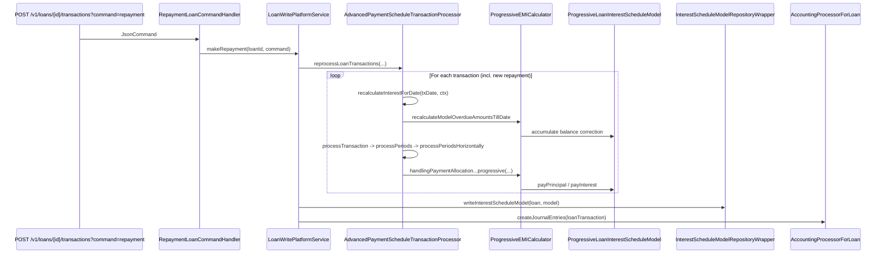

`AdvancedPaymentScheduleTransactionProcessor` (~4200 LoC, lives at `fineract-progressive-loan/src/main/java/org/apache/fineract/portfolio/loanaccount/domain/transactionprocessor/impl/AdvancedPaymentScheduleTransactionProcessor.java`) is the Apache Fineract progressive-loan implementation of `LoanRepaymentScheduleTransactionProcessor`. It is the **only** processor that knows how to mutate a `ProgressiveLoanInterestScheduleModel` in response to a `LoanTransaction`, so it is the runtime brain of progressive loans — every disbursement, repayment, refund, charge-off and re-age routes through it.

It is registered under the strategy code:

```java
public static final String ADVANCED_PAYMENT_ALLOCATION_STRATEGY      = "advanced-payment-allocation-strategy";
public static final String ADVANCED_PAYMENT_ALLOCATION_STRATEGY_NAME = "Advanced payment allocation strategy";
```

`LoanRepaymentScheduleTransactionProcessorFactory` picks this implementation whenever `loan.transactionProcessingStrategyCode == "advanced-payment-allocation-strategy"`. See [Loan transaction processors](/loan/transaction-processors) for the factory mechanics and the catalog of all strategy codes.

## Where it sits in the hierarchy

```java
public class AdvancedPaymentScheduleTransactionProcessor
        extends AbstractLoanRepaymentScheduleTransactionProcessor {

    private final EMICalculator emiCalculator;
    private final InterestRefundService interestRefundService;
    private final LoanScheduleComponent loanSchedule;
    private final LoanChargeService loanChargeService;
    private final SingleLoanChargeRepaymentScheduleProcessingWrapper loanChargeRepaymentScheduleProcessing;
    private final ScheduledDateGenerator scheduledDateGenerator;

    public AdvancedPaymentScheduleTransactionProcessor(EMICalculator emiCalculator,
            InterestRefundService interestRefundService, ExternalIdFactory externalIdFactory,
            LoanScheduleComponent loanSchedule, LoanChargeValidator loanChargeValidator,
            LoanBalanceService loanBalanceService, LoanChargeService loanChargeService,
            ScheduledDateGenerator scheduledDateGenerator) {
        super(externalIdFactory, loanChargeValidator, loanBalanceService);
        // ...
    }
}
```

`AbstractLoanRepaymentScheduleTransactionProcessor` is the shared base in `fineract-loan`; it provides the `reprocessLoanTransactions(...)` loop scaffolding, the maker-checker entry points, and the small `handleTransactionThatIsX(...)` callbacks. The progressive subclass deliberately **throws `UnsupportedOperationException`** from every classic single-installment callback — it never allocates against one installment at a time the way the cumulative processor does:

```java
@Override
protected Money handleTransactionThatIsALateRepaymentOfInstallment(...)             { throw new UnsupportedOperationException(); }
@Override
protected Money handleTransactionThatIsPaymentInAdvanceOfInstallment(...)           { throw new UnsupportedOperationException(); }
@Override
protected Money handleTransactionThatIsOnTimePaymentOfInstallment(...)              { throw new UnsupportedOperationException(); }
@Override
protected Money handleRefundTransactionPaymentOfInstallment(...)                    { throw new UnsupportedOperationException(); }
@Override
public Money handleRepaymentSchedule(...)                                           { throw new UnsupportedOperationException(); }
```

Everything is funneled through `processLatestTransaction(loanTransaction, ctx)` instead, which gives the processor enough context to mutate the `ProgressiveLoanInterestScheduleModel` carried inside the `ProgressiveTransactionCtx`.

## The dispatch switch

```java
@Override
public ChangedTransactionDetail processLatestTransaction(LoanTransaction loanTransaction, TransactionCtx ctx) {
    if (ctx instanceof ProgressiveTransactionCtx progressiveTransactionCtx) {
        if (loanTransaction.isRepaymentLikeType() && loanTransaction.isNotReversed()) {
            progressiveTransactionCtx.setPrepayAttempt(calculateIsPrepayAttempt(loanTransaction, progressiveTransactionCtx));
        }
        recalculateInterestForDate(loanTransaction.getTransactionDate(), progressiveTransactionCtx);
    }
    switch (loanTransaction.getTypeOf()) {
        case DISBURSEMENT          -> handleDisbursement(loanTransaction, ctx);
        case WRITEOFF              -> handleWriteOff(loanTransaction, ctx);
        case REFUND_FOR_ACTIVE_LOAN -> handleRefund(loanTransaction, ctx);
        case CHARGEBACK            -> handleChargeback(loanTransaction, ctx);
        case CREDIT_BALANCE_REFUND -> handleCreditBalanceRefund(loanTransaction, ctx);
        case REPAYMENT, MERCHANT_ISSUED_REFUND, PAYOUT_REFUND, GOODWILL_CREDIT, CHARGE_REFUND,
             CHARGE_ADJUSTMENT, DOWN_PAYMENT, WAIVE_INTEREST, RECOVERY_REPAYMENT,
             INTEREST_PAYMENT_WAIVER, CAPITALIZED_INCOME_ADJUSTMENT -> handleRepayment(loanTransaction, ctx);
        case INTEREST_REFUND       -> handleInterestRefund(loanTransaction, ctx);
        case CHARGE_OFF            -> handleChargeOff(loanTransaction, ctx);
        case CHARGE_PAYMENT        -> handleChargePayment(loanTransaction, ctx);
        case WAIVE_CHARGES         -> log.debug("WAIVE_CHARGES transaction will not be processed.");
        case REAMORTIZE            -> handleReAmortization(loanTransaction, ctx);
        case REAGE                 -> handleReAge(loanTransaction, ctx);
        case CAPITALIZED_INCOME    -> handleCapitalizedIncome(loanTransaction, ctx);
        case CONTRACT_TERMINATION  -> handleContractTermination(loanTransaction, ctx);
        default                    -> log.warn("Unhandled transaction processing for transaction type: {}", loanTransaction.getTypeOf());
    }
    return ctx.getChangedTransactionDetail();
}
```

Two things happen **before** dispatch:

1. **Prepay attempt flag** — for repayment-like transactions the processor decides whether this is a likely pre-closure attempt (used to short-circuit interest recalculation strategies later).
2. **Interest recalculation up to the transaction date** — `recalculateInterestForDate(...)` rolls the model forward so the schedule reflects all daily-compounded interest up to the transaction's effective date.

```java
public void recalculateInterestForDate(LocalDate targetDate, ProgressiveTransactionCtx ctx) {
    recalculateInterestForDate(targetDate, ctx, true);
}

public void recalculateInterestForDate(LocalDate targetDate, ProgressiveTransactionCtx ctx, boolean updateInstallments) {
    // ... triggers emiCalculator.recalculateModelOverdueAmountsTillDate(...) and updates installments if requested
}
```

## `ProgressiveTransactionCtx`

The processor needs a richer carrier than the base `TransactionCtx`. `ProgressiveTransactionCtx` extends it with the live interest schedule model, processed-charges tracking, pre-pay flag, charged-off flag, and a "skip" list of installments excluded from allocation:

```java
public class ProgressiveTransactionCtx extends TransactionCtx {
    private final ProgressiveLoanInterestScheduleModel model;
    private final Set<LoanCharge> processedLoanCharges;
    private final Set<LoanRepaymentScheduleInstallment> skipRepaymentScheduleInstallments;
    private boolean chargedOff;
    private boolean prepayAttempt;
    // ...
}
```

Every dispatcher method receives this ctx and mutates the model. After all transactions are processed (in `reprocessLoanTransactions`), the model gets persisted via `InterestScheduleModelRepositoryWrapper.writeInterestScheduleModel(...)`.

## Disbursement

`handleDisbursement` picks between two paths depending on whether the EMI calculator is in play (i.e. interest-bearing loan with a real model in the ctx):

```java
private void handleDisbursement(LoanTransaction disbursementTransaction, TransactionCtx transactionCtx) {
    if (shouldUseEmiCalculation(transactionCtx, disbursementTransaction.getTransactionDate())) {
        handleDisbursementWithEMICalculator(disbursementTransaction, transactionCtx);
    } else {
        handleDisbursementWithoutEMICalculator(disbursementTransaction, transactionCtx);
    }
    if (!disbursementTransaction.getLoan().isInterestBearingAndInterestRecalculationEnabled()) {
        recalculateInstallmentFeeCharges(disbursementTransaction);
    }
}
```

### `handleDisbursementWithEMICalculator`

```java
private void handleDisbursementWithEMICalculator(LoanTransaction disbursementTransaction, TransactionCtx transactionCtx) {
    ProgressiveLoanInterestScheduleModel model;
    if (!(transactionCtx instanceof ProgressiveTransactionCtx)
            || (model = ((ProgressiveTransactionCtx) transactionCtx).getModel()) == null) {
        throw new IllegalStateException("TransactionCtx has no model");
    }
    final MathContext mc = MoneyHelper.getMathContext();
    Loan loan = disbursementTransaction.getLoan();
    LoanProductRelatedDetail loanProductRelatedDetail = loan.getLoanRepaymentScheduleDetail();
    Integer installmentAmountInMultiplesOf = loanProductRelatedDetail.getInstallmentAmountInMultiplesOf();
    List<LoanRepaymentScheduleInstallment> installments = transactionCtx.getInstallments();
    LocalDate transactionDate = disbursementTransaction.getTransactionDate();
    MonetaryCurrency currency = transactionCtx.getCurrency();

    // 1. Carve out the down-payment slice and book it onto the zero-balance down-payment installment
    Money downPaymentAmount = Money.zero(currency);
    if (loanProductRelatedDetail.isEnableDownPayment()) {
        BigDecimal downPaymentAmt = MathUtil.percentageOf(disbursementTransaction.getAmount(),
                loanProductRelatedDetail.getDisbursedAmountPercentageForDownPayment(), mc);
        if (installmentAmountInMultiplesOf != null) {
            downPaymentAmt = Money.roundToMultiplesOf(downPaymentAmt, installmentAmountInMultiplesOf);
        }
        downPaymentAmount = Money.of(currency, downPaymentAmt);
        LoanRepaymentScheduleInstallment downPaymentInstallment = installments.stream()
                .filter(i -> i.isDownPayment() && i.getPrincipal(currency).isZero()).findFirst().orElseThrow();
        downPaymentInstallment.addToPrincipal(transactionDate, downPaymentAmount);
    }

    // 2. Push the remaining principal into the interest model
    Money amortizableAmount = disbursementTransaction.getAmount(currency).minus(downPaymentAmount);
    emiCalculator.addDisbursement(model, transactionDate, amortizableAmount);

    // 3. For post-maturity disbursements create an N+1 "additional" installment
    boolean needsNPlusOneInstallment = installments.stream()
            .filter(i -> i.getDueDate().isAfter(transactionDate) || i.getDueDate().isEqual(transactionDate))
            .filter(i -> !i.isDownPayment() && !i.isAdditional()).findAny().isEmpty();
    if (needsNPlusOneInstallment) {
        LoanRepaymentScheduleInstallment newInstallment = new LoanRepaymentScheduleInstallment(
                disbursementTransaction.getLoan(), installments.size() + 1, transactionDate, transactionDate,
                Money.zero(currency).getAmount(), Money.zero(currency).getAmount(),
                Money.zero(currency).getAmount(), Money.zero(currency).getAmount(), true, null);
        newInstallment.updatePrincipal(amortizableAmount.getAmount());
        newInstallment.markAsAdditional();
        disbursementTransaction.getLoan().addLoanRepaymentScheduleInstallment(newInstallment);
        installments.add(newInstallment);
    }

    disbursementTransaction.resetDerivedComponents();
    recalculateRepaymentPeriodsWithEMICalculation(amortizableAmount, model, installments,
            disbursementTransaction, currency, ((ProgressiveTransactionCtx) transactionCtx).getProcessedLoanCharges());
    allocateOverpayment(disbursementTransaction, transactionCtx);
}
```

After step 2 the model knows about the new principal; step 4 (`recalculateRepaymentPeriodsWithEMICalculation`) walks the `RepaymentPeriod` list and copies the recalculated `duePrincipal` and `dueInterest` back onto the persistent `LoanRepaymentScheduleInstallment` rows.

### `handleDisbursementWithoutEMICalculator`

Used for **interest-free** progressive loans (interest method is `FLAT` with zero rate or interest-recalculation disabled). It distributes the disbursed principal evenly across remaining installments without touching the interest model.

## Capitalized income

A capitalized income transaction inflates the principal mid-loan without an actual cash inflow. The handler mirrors disbursement:

```java
private void handleCapitalizedIncomeWithEMICalculator(LoanTransaction capitalizedIncomeTransaction, TransactionCtx transactionCtx) {
    ProgressiveLoanInterestScheduleModel model = ((ProgressiveTransactionCtx) transactionCtx).getModel();
    List<LoanRepaymentScheduleInstallment> installments = transactionCtx.getInstallments();
    LocalDate transactionDate = capitalizedIncomeTransaction.getTransactionDate();
    MonetaryCurrency currency = transactionCtx.getCurrency();

    Money amortizableAmount = capitalizedIncomeTransaction.getAmount(currency);
    emiCalculator.addCapitalizedIncome(model, transactionDate, amortizableAmount);

    recalculateRepaymentPeriodsWithEMICalculation(amortizableAmount, model, installments,
            capitalizedIncomeTransaction, currency,
            ((ProgressiveTransactionCtx) transactionCtx).getProcessedLoanCharges());
    allocateOverpayment(capitalizedIncomeTransaction, transactionCtx);
}
```

`emiCalculator.addCapitalizedIncome(...)` differs from `addDisbursement(...)` in that it routes the amount into `InterestPeriod.capitalizedIncomePrincipal` rather than `disbursementAmount`, so accounting can tell the two apart when posting journal entries. See [Capitalized income](/progressive-loan/capitalized-income) for the full life-cycle.

## Repayment-like transactions

A long list of types collapse into `handleRepayment`: `REPAYMENT`, `MERCHANT_ISSUED_REFUND`, `PAYOUT_REFUND`, `GOODWILL_CREDIT`, `CHARGE_REFUND`, `CHARGE_ADJUSTMENT`, `DOWN_PAYMENT`, `WAIVE_INTEREST`, `RECOVERY_REPAYMENT`, `INTEREST_PAYMENT_WAIVER`, `CAPITALIZED_INCOME_ADJUSTMENT`.

```java
private void handleRepayment(LoanTransaction loanTransaction, TransactionCtx transactionCtx) {
    if (loanTransaction.isRepaymentLikeType() || loanTransaction.isInterestWaiver()
            || loanTransaction.isRecoveryRepayment()) {
        loanTransaction.resetDerivedComponents();
    }
    calculateUnrecognizedInterestForClosedPeriodByInterestRecalculationStrategy(loanTransaction, transactionCtx);
    Money transactionAmountUnprocessed = loanTransaction.getAmount(transactionCtx.getCurrency());
    processTransaction(loanTransaction, transactionCtx, transactionAmountUnprocessed);
}

private void processTransaction(LoanTransaction loanTransaction, TransactionCtx transactionCtx, Money transactionAmountUnprocessed) {
    List<LoanTransactionToRepaymentScheduleMapping> transactionMappings = new ArrayList<>();
    Money zero = Money.zero(transactionCtx.getCurrency());
    Balances balances = new Balances(zero, zero, zero, zero);
    transactionAmountUnprocessed = processPeriods(loanTransaction, transactionAmountUnprocessed,
            transactionMappings, balances, transactionCtx);

    loanTransaction.updateComponents(balances.getAggregatedPrincipalPortion(),
            balances.getAggregatedInterestPortion(),
            balances.getAggregatedFeeChargesPortion(),
            balances.getAggregatedPenaltyChargesPortion());
    loanTransaction.updateLoanTransactionToRepaymentScheduleMappings(transactionMappings);

    handleOverpayment(transactionAmountUnprocessed, loanTransaction, transactionCtx);
}
```

The payment amount is run through `processPeriods(...)`, which dispatches based on `LoanScheduleProcessingType`.

## Horizontal vs. vertical allocation

```java
private Money processPeriods(LoanTransaction transaction, Money processAmount, LoanPaymentAllocationRule allocationRule,
        List<LoanTransactionToRepaymentScheduleMapping> transactionMappings, Balances balances, TransactionCtx transactionCtx) {
    LoanScheduleProcessingType scheduleProcessingType = transaction.getLoan().getLoanProductRelatedDetail()
            .getLoanScheduleProcessingType();
    if (scheduleProcessingType.isHorizontal()) {
        return processPeriodsHorizontally(transaction, transactionCtx, processAmount, allocationRule, transactionMappings, balances);
    }
    if (scheduleProcessingType.isVertical()) {
        return processPeriodsVertically(transaction, transactionCtx, processAmount, allocationRule, transactionMappings, balances);
    }
    return processAmount;
}
```

* **HORIZONTAL** — group `paymentAllocation` entries by `DueType` (`PAST_DUE`, `DUE`, `IN_ADVANCE`), then for each due-type bucket apply **all** allocation types in order across the relevant installments before moving on. This is what most modern progressive loan products use.
* **VERTICAL** — walk allocation types one at a time across **all** installments before moving to the next allocation type. Used for legacy parity.

## The `paymentAllocation` array

The behaviour of an allocation step is read from `LoanPaymentAllocationRule` rows attached to the loan / loan product. Each rule contains an ordered list of `PaymentAllocationType` values whose order **is** the allocation order. The `PaymentAllocationType` enum is the cartesian product:

```
{ PAST_DUE, DUE, IN_ADVANCE } × { PENALTY, FEE, INTEREST, PRINCIPAL }
```

— giving 12 atomic allocation steps. Each value also exposes its `AllocationType` (PENALTY/FEE/INTEREST/PRINCIPAL) and its `DueType` (PAST_DUE/DUE/IN_ADVANCE).

A default rule is provided by:

```java
public static LoanPaymentAllocationRule getDefaultAllocationRule(Loan loan) { ... }
```

A typical horizontal rule emitted by the platform:

```
PAST_DUE_PENALTY      PAST_DUE_FEE      PAST_DUE_INTEREST    PAST_DUE_PRINCIPAL
DUE_PENALTY           DUE_FEE           DUE_INTEREST         DUE_PRINCIPAL
IN_ADVANCE_PENALTY    IN_ADVANCE_FEE    IN_ADVANCE_INTEREST  IN_ADVANCE_PRINCIPAL
```

Plus a `FutureInstallmentAllocationRule` that decides where the IN_ADVANCE bucket lands:

| Rule | Meaning |
| --- | --- |
| `NEXT_INSTALLMENT` | All IN_ADVANCE money goes to the very next unpaid installment |
| `LAST_INSTALLMENT` | All IN_ADVANCE money goes to the final installment |
| `NEXT_LAST_INSTALLMENT` | Current installment if money is inside its window, else last |
| `REAMORTIZATION` | Spread evenly across every unpaid future installment |

The horizontal loop reads the rule and dispatches per `DueType`:

```java
LinkedHashMap<DueType, List<PaymentAllocationType>> paymentAllocationsMap = paymentAllocationRule.getAllocationTypes().stream()
        .collect(Collectors.groupingBy(PaymentAllocationType::getDueType, LinkedHashMap::new,
                mapping(Function.identity(), toList())));

for (Map.Entry<DueType, List<PaymentAllocationType>> paymentAllocationsEntry : paymentAllocationsMap.entrySet()) {
    transactionAmountUnprocessed = processAllocationsHorizontally(loanTransaction, transactionCtx,
            transactionAmountUnprocessed, paymentAllocationsEntry.getValue(),
            paymentAllocationRule.getFutureInstallmentAllocationRule(), transactionMappings, balances);
}
```

Inside `processAllocationsHorizontally(...)`, a `LoopGuard.runSafeDoWhileLoop(...)` walks installments, resolving for each iteration:

```java
LoanRepaymentScheduleInstallment oldestPastDueInstallment = ...    // PAST_DUE bucket
LoanRepaymentScheduleInstallment dueInstallment            = ...   // DUE bucket
List<LoanRepaymentScheduleInstallment> inAdvanceInstallments = ... // IN_ADVANCE bucket per rule
```

Each `PaymentAllocationType` runs through either:

* `processPaymentAllocation(...)` — generic path for non-interest-bearing loans.
* `handlingPaymentAllocationForInterestBearingProgressiveLoan(...)` — interest-bearing path that asks `emiCalculator` for the current `duePrincipal` / `dueInterest` snapshot before deciding how much money is consumed.

```java
private Money processPaymentAllocation(PaymentAllocationType paymentAllocationType,
        LoanRepaymentScheduleInstallment currentInstallment, LoanTransaction loanTransaction,
        Money transactionAmountUnprocessed,
        LoanTransactionToRepaymentScheduleMapping loanTransactionToRepaymentScheduleMapping,
        Set<LoanCharge> chargesOfInstallment, Balances balances,
        LoanRepaymentScheduleInstallment.PaymentAction action) {
    AllocationType allocationType = paymentAllocationType.getAllocationType();
    MonetaryCurrency currency = loanTransaction.getLoan().getCurrency();
    LocalDate transactionDate = loanTransaction.getTransactionDate();
    LoanRepaymentScheduleInstallment.PaymentFunction paymentFunction =
            currentInstallment.getPaymentFunction(allocationType, action);
    ChargesPaidByFunction chargesPaidByFunction = getChargesPaymentFunction(action);
    Money portion = paymentFunction.accept(transactionDate, transactionAmountUnprocessed);

    switch (allocationType) {
        case PENALTY    -> { balances.setAggregatedPenaltyChargesPortion(balances.getAggregatedPenaltyChargesPortion().add(portion));
                              addToTransactionMapping(loanTransactionToRepaymentScheduleMapping, zero, zero, zero, portion);
                              Set<LoanCharge> penalties = chargesOfInstallment.stream().filter(LoanCharge::isPenaltyCharge).collect(toSet());
                              chargesPaidByFunction.accept(loanTransaction, portion, penalties, currentInstallment.getInstallmentNumber()); }
        case FEE        -> { /* same shape, fees bucket */ }
        case INTEREST   -> { balances.setAggregatedInterestPortion(balances.getAggregatedInterestPortion().add(portion));
                              addToTransactionMapping(loanTransactionToRepaymentScheduleMapping, zero, portion, zero, zero); }
        case PRINCIPAL  -> { balances.setAggregatedPrincipalPortion(balances.getAggregatedPrincipalPortion().add(portion));
                              addToTransactionMapping(loanTransactionToRepaymentScheduleMapping, portion, zero, zero, zero); }
    }
    currentInstallment.checkIfRepaymentPeriodObligationsAreMet(transactionDate, currency);
    return portion;
}
```

Each call increments the right aggregate in the `Balances` record; after the loop those become the transaction's `principalPortion`, `interestPortion`, `feeChargesPortion`, `penaltyChargesPortion`.

## Refunds

Refund transactions (`REFUND_FOR_ACTIVE_LOAN`, plus `INTEREST_REFUND` for accrued interest) reverse the allocation. The processor offers two refund flows:

```java
private Money refundTransactionHorizontally(LoanTransaction loanTransaction, TransactionCtx ctx,
        Money transactionAmountUnprocessed, ...) { ... }

private Money refundTransactionVertically(LoanTransaction loanTransaction, TransactionCtx ctx, ...) { ... }
```

The horizontal refund mirrors horizontal allocation but in **reverse-order** of `PaymentAllocationType` and uses `LoanRepaymentScheduleInstallment.PaymentAction.UNPAY` for the payment function. Interest refunds are pre-computed by `InterestRefundService` and then turned into a regular refund flow.

## Charge-off

`handleChargeOff` is the most behaviour-heavy single transaction handler. It honours two `LoanChargeOffBehaviour` modes from the loan product:

* **`ZERO_INTEREST`** — stop accruing interest from the charge-off date forward.
* **`ACCELERATE_MATURITY`** — collapse the rest of the schedule into a single accelerated maturity at the charge-off date.

```java
private void handleChargeOff(final LoanTransaction loanTransaction, final TransactionCtx transactionCtx) {
    Money principalPortion        = Money.zero(transactionCtx.getCurrency());
    Money interestPortion         = Money.zero(transactionCtx.getCurrency());
    Money feeChargesPortion       = Money.zero(transactionCtx.getCurrency());
    Money penaltyChargesPortion   = Money.zero(transactionCtx.getCurrency());

    if (transactionCtx.getInstallments().stream().anyMatch(this::isNotObligationsMet)) {
        if (LoanChargeOffBehaviour.ZERO_INTEREST.equals(loanTransaction.getLoan().getLoanProductRelatedDetail().getChargeOffBehaviour())) {
            handleZeroInterestChargeOff(loanTransaction, transactionCtx);
        } else if (LoanChargeOffBehaviour.ACCELERATE_MATURITY.equals(loanTransaction.getLoan().getLoanProductRelatedDetail().getChargeOffBehaviour())) {
            handleAccelerateMaturityDate(loanTransaction, transactionCtx);
        }

        final BigDecimal newInterest = getInterestTillChargeOffForPeriod(loanTransaction.getLoan(),
                loanTransaction.getTransactionDate(), transactionCtx);
        createMissingAccrualTransactionDuringChargeOffIfNeeded(newInterest, loanTransaction,
                loanTransaction.getTransactionDate(), transactionCtx);

        if (!loanTransaction.getLoan().isInterestBearingAndInterestRecalculationEnabled()) {
            recalculateInstallmentFeeCharges(loanTransaction);
        }
        loanTransaction.resetDerivedComponents();

        // Sum every outstanding component across installments and stamp them on the charge-off transaction
        for (final LoanRepaymentScheduleInstallment currentInstallment : transactionCtx.getInstallments()) {
            principalPortion      = principalPortion.plus(currentInstallment.getPrincipalOutstanding(transactionCtx.getCurrency()));
            interestPortion       = interestPortion.plus(currentInstallment.getInterestOutstanding(transactionCtx.getCurrency()));
            feeChargesPortion     = feeChargesPortion.plus(currentInstallment.getFeeChargesOutstanding(transactionCtx.getCurrency()));
            penaltyChargesPortion = penaltyChargesPortion.plus(currentInstallment.getPenaltyChargesOutstanding(transactionCtx.getCurrency()));
        }
        loanTransaction.updateComponentsAndTotal(principalPortion, interestPortion, feeChargesPortion, penaltyChargesPortion);
    } else {
        loanTransaction.resetDerivedComponents();
        loanTransaction.updateComponentsAndTotal(principalPortion, interestPortion, feeChargesPortion, penaltyChargesPortion);
    }

    if (transactionCtx instanceof ProgressiveTransactionCtx progressiveTransactionCtx) {
        progressiveTransactionCtx.setChargedOff(true);
    }

    if (isAllComponentsZero(principalPortion, interestPortion, feeChargesPortion, penaltyChargesPortion)
            && loanTransaction.isNotReversed()) {
        loanTransaction.reverse();
        loanTransaction.getLoan().liftChargeOff();
        if (transactionCtx instanceof ProgressiveTransactionCtx progressiveCtx) progressiveCtx.setChargedOff(false);
    }
}
```

`handleAccelerateMaturityDate(...)` shrinks the current installment's due date to the charge-off date, prorates interest, and folds future principal and charges into the now-accelerated installment.

## Chargeback

A chargeback re-creates lost principal. `handleChargeback(...)` re-adds principal back into the model via `emiCalculator.addBalanceCorrection(...)` then walks installments to recognize the post-chargeback fee/penalty allocation. The processor keeps an inverse mapping in `LoanTransactionRelation` with `LoanTransactionRelationTypeEnum.CHARGEBACK` so the original transaction and its chargeback are linked.

```java
private void recognizeAmountsAfterChargeback(final TransactionCtx ctx, final LocalDate transactionDate, ...) { ... }
```

## Charge payment

A `CHARGE_PAYMENT` is a transaction that pays a specific charge directly (e.g. a one-off insurance fee). `handleChargePayment(...)` resolves the targeted charge from the transaction's `LoanChargePaidBy` row, allocates the amount, and then re-runs the leftover through `processTransaction(...)` so any excess applies against the rest of the schedule.

## Re-age and re-amortization

Two operational corrections sit on top of the processor:

```java
private void handleReAge(LoanTransaction loanTransaction, TransactionCtx ctx) { ... }
private void handleReAmortization(LoanTransaction loanTransaction, TransactionCtx transactionCtx) { ... }
```

* **Re-age** moves past-due installments forward, optionally adjusting interest handling. The processor delegates to `emiCalculator.updateModelRepaymentPeriodsDuringReAge(...)` to spread the past-due principal evenly across new installments and re-applies any interest-pause windows that fall on the re-aged horizon.
* **Re-amortization** keeps the term but recomputes EMI based on the current outstanding. `LoanReAgeInterestHandlingType` (`KEEP_ON_FIRST`, `EQUAL_AMORTIZATION`, `WAIVE`) governs how outstanding interest is folded back in.

## Interest refund

```java
private void handleInterestRefund(final LoanTransaction loanTransaction, final TransactionCtx ctx) { ... }
```

`InterestRefundService.calculateRefundableAmount(...)` returns how much of the previously-paid interest is refundable; the resulting amount is then routed through the standard refund path.

## Where it persists changes

After all transactions are reprocessed the caller — typically `LoanWritePlatformService` — invokes `InterestScheduleModelRepositoryWrapper.writeInterestScheduleModel(loan, model)`, which serializes the model JSON into `m_loan_progressive_model.model_data` and stamps the loan id and version. See `InterestScheduleModelRepositoryWrapperImpl` for the wrapper implementation and [Model and recalculation](/progressive-loan/model-and-recalculation) for the lifecycle.

## Idempotency of reprocessing

Because every mutation goes through the model and the model is fully reconstructable from the ordered transaction list, the processor exposes a public batch entry point:

```java
public Pair<ChangedTransactionDetail, ProgressiveLoanInterestScheduleModel> reprocessProgressiveLoanTransactions(
        LocalDate disbursementDate, LocalDate tillDate, List<LoanTransaction> loanTransactions,
        MonetaryCurrency currency, List<LoanRepaymentScheduleInstallment> installments,
        Set<LoanCharge> charges) { ... }

@Override
public ChangedTransactionDetail reprocessLoanTransactions(LocalDate disbursementDate, List<LoanTransaction> loanTransactions,
        MonetaryCurrency currency, List<LoanRepaymentScheduleInstallment> installments, Set<LoanCharge> charges) { ... }
```

The second method is what `LoanWritePlatformService.recalculateInterest(loan)` calls from `LoanInterestRecalculationCOBBusinessStep` to rebuild a loan from scratch — see [Loan COB business steps](/cob/loan-cob-business-steps).

## End-to-end repayment flow



## Cross-references

* The base class scaffolding and the strategy registry are documented in [Loan transaction processors](/loan/transaction-processors).
* The interest model and its serialization live in [Model and recalculation](/progressive-loan/model-and-recalculation).
* The COB step that triggers `reprocessLoanTransactions(...)` daily is `LoanInterestRecalculationCOBBusinessStep` in [Loan COB business steps](/cob/loan-cob-business-steps).
* Repayment journals come from [Accounting processors](/accounting/accounting-processors).
* The buy-down-fee and capitalized-income transactions handled here have dedicated pages: [Buy-down fee](/progressive-loan/buy-down-fee) and [Capitalized income](/progressive-loan/capitalized-income).
