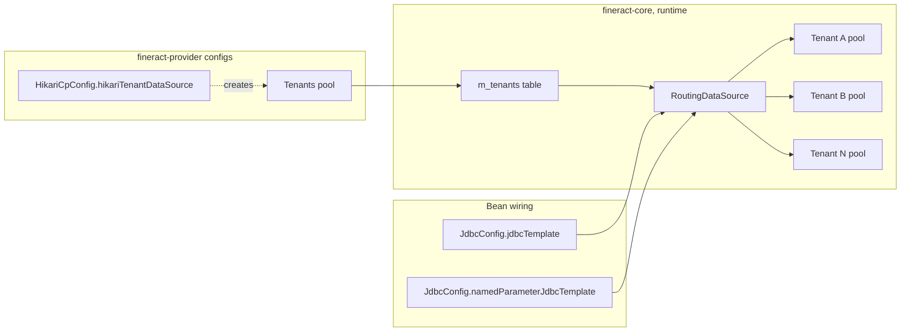

The Apache Fineract provider module owns two data-source bean definitions and
a `JdbcTemplate` factory. They cooperate to build the singleton "tenants"
`HikariDataSource` — the pool that points at the *meta* database holding the
`m_tenants` registry — and to expose `JdbcTemplate` over the per-request
`RoutingDataSource`.

This page focuses on what the provider module itself wires. For the broader
multitenant routing logic — `RoutingDataSource`, `FineractPlatformTenant`,
read-replica selection — see
[/runtime/datasource-and-connection-pooling](/runtime/datasource-and-connection-pooling).

## The three classes

| File | Role |
| --- | --- |
| `infrastructure/core/config/HikariCpConfig.java` | The current, preferred way to declare the tenants pool — reads `spring.datasource.hikari.*` |
| `infrastructure/core/config/CompatibilityConfig.java` | Deprecated fallback that reads legacy `fineract_tenants_*` env vars |
| `infrastructure/core/config/JdbcConfig.java` | Builds `JdbcTemplate` and `NamedParameterJdbcTemplate` over the `RoutingDataSource` |

Both `HikariCpConfig` and `CompatibilityConfig` produce a bean named
`hikariTenantDataSource`. Their `@ConditionalOnExpression` guards ensure
exactly one is active per JVM.

## HikariCpConfig — the preferred path

Source: `infrastructure/core/config/HikariCpConfig.java`

```java
@Configuration
@ConditionalOnExpression("#{ systemEnvironment['fineract_tenants_driver'] == null }")
public class HikariCpConfig {

    // initMethod is triggering lazy initialization of Hikari pool
    @Bean(initMethod = "getConnection", destroyMethod = "close")
    @ConfigurationProperties(prefix = "spring.datasource.hikari")
    public HikariDataSource hikariTenantDataSource() {
        return new HikariDataSource();
    }
}
```

Four design decisions are encoded in this 6-line bean:

1. **`@ConditionalOnExpression("#{ systemEnvironment['fineract_tenants_driver'] == null }")`** —
   activated only when the legacy `fineract_tenants_driver` env var is **not**
   set. If it is set, `CompatibilityConfig` takes over.

2. **`@ConfigurationProperties(prefix = "spring.datasource.hikari")`** binds the
   whole Hikari configuration surface from Spring Boot's standard property
   prefix. Every Hikari setter — `jdbcUrl`, `username`, `password`, `driverClassName`,
   `maximumPoolSize`, `minimumIdle`, `connectionTimeout`, `idleTimeout`,
   `maxLifetime`, `dataSourceProperties.*`, … — becomes a property key.

3. **`initMethod = "getConnection"`** is the lazy-init trick. `HikariDataSource`
   does not eagerly open connections until the first `getConnection()` call.
   By making bean initialization *call* `getConnection()`, Spring's bean
   container forces the pool to warm up before the application is considered
   started — and fails fast if the database is unreachable.

4. **`destroyMethod = "close"`** ensures the pool is shut down cleanly when the
   application context closes, releasing the JDBC connections.

### The comment that hints at the future

The source carries a TODO:

```
// TODO: we can get rid of this config class by defining
//       "spring.hikariTenantDataSource.hikari.*" in "application.properties"
//       and enabling auto-configuration
```

In Spring Boot 3 there is a built-in autoconfigure path for named Hikari
datasources. The reason the explicit bean still exists is that the Liquibase
runner and the per-tenant `RoutingDataSource` both look up
`hikariTenantDataSource` by exact bean name.

### Typical `application.properties` keys

```properties
spring.datasource.hikari.driverClassName=org.mariadb.jdbc.Driver
spring.datasource.hikari.jdbcUrl=jdbc:mariadb://localhost:3306/fineract_tenants
spring.datasource.hikari.username=root
spring.datasource.hikari.password=mysql
spring.datasource.hikari.minimumIdle=3
spring.datasource.hikari.maximumPoolSize=10
spring.datasource.hikari.idleTimeout=60000
spring.datasource.hikari.connectionTimeout=20000
spring.datasource.hikari.connectionTestQuery=SELECT 1
spring.datasource.hikari.autoCommit=true
# MySQL-specific data-source properties
spring.datasource.hikari.dataSourceProperties.cachePrepStmts=true
spring.datasource.hikari.dataSourceProperties.prepStmtCacheSize=250
spring.datasource.hikari.dataSourceProperties.prepStmtCacheSqlLimit=2048
spring.datasource.hikari.dataSourceProperties.useServerPrepStmts=true
spring.datasource.hikari.dataSourceProperties.useLocalSessionState=true
spring.datasource.hikari.dataSourceProperties.rewriteBatchedStatements=true
spring.datasource.hikari.dataSourceProperties.cacheResultSetMetadata=true
spring.datasource.hikari.dataSourceProperties.cacheServerConfiguration=true
spring.datasource.hikari.dataSourceProperties.elideSetAutoCommits=true
spring.datasource.hikari.dataSourceProperties.maintainTimeStats=false
spring.datasource.hikari.dataSourceProperties.logSlowQueries=true
spring.datasource.hikari.dataSourceProperties.dumpQueriesOnException=true
```

## CompatibilityConfig — the deprecated fallback

Source: `infrastructure/core/config/CompatibilityConfig.java`

```java
@Configuration
@ConditionalOnExpression("#{ systemEnvironment['fineract_tenants_driver'] != null }")
@Deprecated // NOTE: this will be removed in one of the next releases
public class CompatibilityConfig {

    @Autowired
    ApplicationContext context;

    @PostConstruct
    public void init() {
        Environment environment = context.getEnvironment();
        LOG.warn("===============================================================================================\n");
        LOG.warn("You are using a deprecated tenant DB configuration:\n");
        LOG.warn("- Env var 'fineract_tenants_driver':                                  {}",
                environment.getProperty("fineract_tenants_driver"));
        // ... ~30 more lines of WARN logging ...
    }

    @Bean(destroyMethod = "close")
    public HikariDataSource hikariTenantDataSource(HikariConfig hc) {
        return new HikariDataSource(hc);
    }

    @Bean
    public HikariConfig hikariConfig() {
        Environment environment = context.getEnvironment();
        HikariConfig hc = new HikariConfig();
        hc.setDriverClassName(environment.getProperty("fineract_tenants_driver"));
        hc.setJdbcUrl(environment.getProperty("fineract_tenants_url"));
        hc.setUsername(environment.getProperty("fineract_tenants_uid"));
        hc.setPassword(environment.getProperty("fineract_tenants_pwd"));
        hc.setMinimumIdle(3);
        hc.setMaximumPoolSize(10);
        hc.setIdleTimeout(60000);
        hc.setConnectionTestQuery("SELECT 1");
        hc.setDataSourceProperties(dataSourceProperties());
        return hc;
    }
    ...
}
```

### Behaviour

1. **Activation:** only when the legacy `fineract_tenants_driver` env var is
   present.
2. **WARN log on `@PostConstruct`:** prints the deprecated env vars *and* the
   equivalent new variables (`FINERACT_HIKARI_*`) so operators can migrate.
3. **Hard-coded knobs:** `minimumIdle=3`, `maximumPoolSize=10`,
   `idleTimeout=60000`, `connectionTestQuery=SELECT 1`. No way to override
   without removing this config.
4. **Hard-coded data-source properties:**
   ```java
   props.setProperty("cachePrepStmts", "true");
   props.setProperty("prepStmtCacheSize", "250");
   props.setProperty("prepStmtCacheSqlLimit", "2048");
   props.setProperty("useServerPrepStmts", "true");
   props.setProperty("useLocalSessionState", "true");
   props.setProperty("rewriteBatchedStatements", "true");
   props.setProperty("cacheResultSetMetadata", "true");
   props.setProperty("cacheServerConfiguration", "true");
   props.setProperty("elideSetAutoCommits", "true");
   props.setProperty("maintainTimeStats", "false");
   props.setProperty("logSlowQueries", "true");
   props.setProperty("dumpQueriesOnException", "true");
   ```
   These are MySQL/MariaDB-tuned defaults. Postgres deployments using the
   legacy env vars will pass through these — they are ignored by the Postgres
   driver but produce a warning at boot.

### When you might hit this

Older Docker images, CI pipelines and shell scripts that still set
`fineract_tenants_driver=…`. The class will go away once those are flushed out.

## JdbcConfig — read templates over the routing DataSource

Source: `infrastructure/core/config/JdbcConfig.java`

```java
@Configuration
public class JdbcConfig {

    @Bean
    public JdbcTemplate jdbcTemplate(RoutingDataSource dataSource) {
        return new JdbcTemplate(dataSource);
    }

    @Bean
    public NamedParameterJdbcTemplate namedParameterJdbcTemplate(RoutingDataSource dataSource) {
        return new NamedParameterJdbcTemplate(dataSource);
    }
}
```

That's it. Both templates wrap the `RoutingDataSource` from `fineract-core`
(`infrastructure.core.service.database.RoutingDataSource`) — which routes the
JDBC call to whichever tenant's pool is currently bound to the
`ThreadLocal<FineractPlatformTenant>` context.

This means every `JdbcTemplate.query(...)` call from any `*ReadPlatformService`
implementation goes:

```
JdbcTemplate → RoutingDataSource.getConnection()
            → currentTenant().getConnection()
            → Hikari pool for that tenant
            → JDBC driver → database
```

The `hikariTenantDataSource` produced by `HikariCpConfig` is *not* directly
wrapped by these templates — it is used by the tenant-resolver to bootstrap the
list of tenants, and each tenant entry in `m_tenants` then defines its own
per-tenant Hikari pool.

### Why two templates?

- **`JdbcTemplate`** — positional `?` parameters. Most legacy
  `*ReadPlatformService` classes use it.
- **`NamedParameterJdbcTemplate`** — named `:param` parameters. Newer reports
  and complex queries use it for readability. It also makes `IN (:list)`
  expansion trivial via `MapSqlParameterSource`.

### `JdbcTemplateAutoConfiguration` is excluded

Recall from
[Server Application Entrypoint](/provider/server-application-entrypoint) that
`FineractWebApplicationConfiguration` lists `JdbcTemplateAutoConfiguration` in
its exclusion array. That's why this manual `JdbcConfig` is necessary — Spring
Boot would otherwise auto-wire a `JdbcTemplate` against the auto-detected
`DataSource` (which would *not* be the routing one).

## The two pools

Fineract maintains two distinct sets of Hikari pools at runtime:



- The **tenants pool** points at the *meta* database that owns `m_tenants`,
  `m_tenant_server_connections` (and the corresponding read-replica tables).
  It is short-lived: queried during tenant resolution and cached.
- The **per-tenant pools** point at each business database. They are created
  lazily on first use by the tenant-resolution layer in `fineract-core`.

The `RoutingDataSource` selects the per-tenant pool based on the thread-local
tenant set by the `TenantAwareBasicAuthenticationFilter` /
`TenantAwareAuthenticationFilter` (see
[Provider Security Config](/provider/security-config)).

## Driver and JDBC URL conventions

The default `application.properties` ships with a MariaDB driver. Postgres
deployments override:

```properties
spring.datasource.hikari.driverClassName=org.postgresql.Driver
spring.datasource.hikari.jdbcUrl=jdbc:postgresql://localhost:5432/fineract_tenants
```

Both drivers are listed in `fineract-provider/dependencies.gradle`:

```groovy
implementation 'org.mariadb.jdbc:mariadb-java-client'
implementation 'org.postgresql:postgresql'
```

— so a single binary supports both.

## Pool sizing rules of thumb

The defaults in `application.properties` ship with `minimumIdle=3` and
`maximumPoolSize=10` per tenant. The "right" sizing depends on:

- Number of concurrent Tomcat threads (`server.tomcat.threads.max`, default 200).
- Number of background workers (`fineract.task-executor.*` — see
  [Task Executor Config](/provider/task-executor-config)).
- Number of COB partition workers.
- Whether the database is a managed RDS instance with its own connection cap.

The platform does not pool-share across tenants — every active tenant counts
against the database's total max-connections. For multi-tenant production
deployments, prefer a small `maximumPoolSize` (≤ 10) per tenant and let
hot-spotting tenants opt up via `m_tenant_server_connections`.

## Related pages

- [Provider Overview](/provider/overview) — how this fits into the module map.
- [JPA and EclipseLink](/provider/jpa-and-eclipselink) — the EMF built atop
  this `DataSource`.
- [/runtime/datasource-and-connection-pooling](/runtime/datasource-and-connection-pooling)
  — the full multi-tenant routing architecture.
- [Server Application Entrypoint](/provider/server-application-entrypoint) —
  why `DataSourceAutoConfiguration` is excluded.
- [Transaction Management](/runtime/transaction-management) — how
  `@Transactional` interacts with the routing layer.
