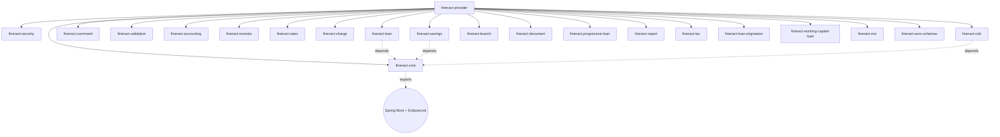
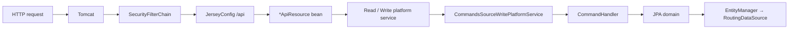

`fineract-provider` is the Apache Fineract assembly module — the Gradle project
that pulls every domain library together, wires the Spring `ApplicationContext`,
and exposes the runnable `ServerApplication` `main()`. None of the domain
modules (loan, savings, accounting, cob, …) ship a `main()` of their own; they
publish beans, Liquibase changelogs and JPA entities, and rely on
`fineract-provider` to register them, expose them over Jersey/JAX-RS and bind
them to a tenant `DataSource`.

This page is the map. It enumerates which modules `fineract-provider` depends
on, which Spring `@Configuration` classes it owns, and which legacy domain
packages still live inside the provider module itself (instead of having been
extracted into a sibling Gradle project). Subsequent pages drill into each
configuration class.

## Where the wiring lives

The provider module is rooted at:

```
fineract-provider/
├── build.gradle
├── dependencies.gradle
├── config/
└── src/main/java/org/apache/fineract/
    ├── ServerApplication.java
    ├── accounting/
    ├── adhocquery/
    ├── batch/
    ├── cob/
    ├── commands/
    ├── infrastructure/
    │   ├── core/
    │   │   ├── boot/      ← FineractWebApplicationConfiguration, …LiquibaseOnly…
    │   │   ├── config/    ← HikariCpConfig, JdbcConfig, SecurityConfig, …
    │   │   └── jersey/    ← JerseyConfig (JAX-RS ResourceConfig)
    │   ├── security/config/  ← AuthorizationServerConfig (OAuth2)
    │   └── …
    ├── interoperation/
    ├── notification/
    ├── organisation/
    ├── portfolio/         ← legacy: client/group/loanaccount/savings/… APIs
    ├── spm/
    ├── template/
    └── useradministration/
```

The entry point (`ServerApplication`) imports two profile configurations:

```java
@Import({ FineractWebApplicationConfiguration.class,
          FineractLiquibaseOnlyApplicationConfiguration.class })
private static final class Configuration {}
```

Only one is activated at runtime — see
[Server Application Entrypoint](/provider/server-application-entrypoint) and
[/runtime/server-application](/runtime/server-application).

## Gradle dependency graph

The full list of intra-repo modules pulled in by
`fineract-provider/dependencies.gradle` is reproduced verbatim below — this is
the authoritative source of the assembly:

```groovy
implementation(project(path: ':fineract-core'))
implementation(project(path: ':fineract-cob'))
implementation(project(path: ':fineract-command'))
implementation(project(path: ':fineract-validation'))
implementation(project(path: ':fineract-accounting'))
implementation(project(path: ':fineract-investor'))
implementation(project(path: ':fineract-rates'))
implementation(project(path: ':fineract-charge'))
implementation(project(path: ':fineract-loan'))
implementation(project(path: ':fineract-savings'))
implementation(project(path: ':fineract-branch'))
implementation(project(path: ':fineract-document'))
implementation(project(path: ':fineract-progressive-loan'))
implementation(project(path: ':fineract-report'))
implementation(project(path: ':fineract-tax'))
implementation(project(path: ':fineract-loan-origination'))
implementation(project(path: ':fineract-security'))
implementation(project(path: ':fineract-working-capital-loan'))
implementation(project(path: ':fineract-mix'))
implementation(project(path: ':fineract-avro-schemas'))
```

Visualised:



`fineract-core` is the transitive foundation: every other module depends on it
for the `FineractProperties` properties model, the `RoutingDataSource`, the
tenant resolution APIs, exception hierarchies and the Liquibase orchestrator.

## Configuration classes owned by fineract-provider

The `infrastructure/core/config` package is the heart of the assembly — every
class here is a `@Configuration` (or a constant / interface used by one):

| Class | Page | Purpose |
| --- | --- | --- |
| `HikariCpConfig` | [JDBC and Hikari](/provider/jdbc-and-hikari-config) | Builds the `hikariTenantDataSource` from `spring.datasource.hikari.*` |
| `CompatibilityConfig` | [JDBC and Hikari](/provider/jdbc-and-hikari-config) | Deprecated fallback that reads the legacy `fineract_tenants_*` env vars |
| `JdbcConfig` | [JDBC and Hikari](/provider/jdbc-and-hikari-config) | `JdbcTemplate` + `NamedParameterJdbcTemplate` over `RoutingDataSource` |
| `jpa/JPAConfig` | [JPA and EclipseLink](/provider/jpa-and-eclipselink) | `LocalContainerEntityManagerFactoryBean`, EclipseLink vendor adapter, static weaving |
| `jpa/EntityManagerFactoryCustomizer` | [JPA and EclipseLink](/provider/jpa-and-eclipselink) | SPI to add packages, vendor props, persistence unit post-processors |
| `SecurityConfig` | [Provider Security Config](/provider/security-config) | Basic-auth `SecurityFilterChain` + filter ordering |
| `SecurityValidationConfig` | [Provider Security Config](/provider/security-config) | Fails fast if both basic-auth and OAuth2 are on/off |
| `infrastructure/security/config/AuthorizationServerConfig` | [Provider Security Config](/provider/security-config) | OAuth2 authorization-server + resource-server filter chains |
| `MetricsConfig` | [Metrics Config](/provider/metrics-config) | Micrometer `TimedAspect` for `@Timed` AOP |
| `OkHttp3Config` | [OkHttp Config](/provider/okhttp-config) | Shared `OkHttpClient` for hook processors, credit-bureau integrations, Twilio, … |
| `SpringConfig` | [Spring Config](/provider/spring-config) | Event multicaster, security-context strategy, `fineractEventExecutor` |
| `TaskExecutorConfig` + `TaskExecutorConstant` | [Task Executor Config](/provider/task-executor-config) | Default + prototype-scoped `ThreadPoolTaskExecutor` for background work |
| `cache/CacheConfig` + helpers | [Cache Config](/provider/cache-config) | Ehcache 3 (JCache) manager + transaction-bound reset + per-name supported list |
| `ContentS3Config` | [S3 Content Config](/provider/s3-content-config) | `S3Client` for `ContentRepository` (document/image storage) |
| `infrastructure/s3/AmazonS3Config` | [S3 Content Config](/provider/s3-content-config) | `S3Client` for the datatable export feature |
| `FineractStartupValidationConfig` | [Server Application Entrypoint](/provider/server-application-entrypoint) | Aborts boot if any `*ValidationCondition` fired |

And the boot configurations:

| Class | Activated by | Imports |
| --- | --- | --- |
| `FineractWebApplicationConfiguration` | `FineractWebApplicationCondition` | `@EnableAutoConfiguration(exclude = {DataSourceAutoConfiguration, HibernateJpaAutoConfiguration, …})`, `@EnableTransactionManagement`, `@EnableWebSecurity`, `@ComponentScan("org.apache.fineract.**")`, `@IntegrationComponentScan` |
| `FineractLiquibaseOnlyApplicationConfiguration` | `FineractLiquibaseOnlyApplicationCondition` | `@Import({HikariCpConfig.class, JdbcConfig.class})`, narrowly scoped component scan for `core.service.migration/database/tenant` |

The `FineractWebApplicationCondition` and `FineractLiquibaseOnlyApplicationCondition`
classes live in `fineract-core` (`infrastructure.core.condition`).

## Legacy domain packages still inside fineract-provider

Most domain logic has migrated into dedicated Gradle modules
(`fineract-loan`, `fineract-savings`, …), but a long tail of *portfolio* and
*infrastructure* domains still lives inside the provider module. They have not
yet been extracted, mostly because their JPA entities are entangled with each
other. They are full first-class subsystems with `domain/`, `service/`, `api/`,
`data/`, `handler/` and `serialization/` packages — exactly the same shape as
the extracted modules.

The top-level packages inside
`fineract-provider/src/main/java/org/apache/fineract/` are:

| Package | Notes |
| --- | --- |
| `accounting` | Journal entries, GL accounts, provisioning, financial activity mappings — `JournalEntriesApiResource` |
| `adhocquery` | Free-form SQL reports — `AdHocApiResource` |
| `batch` | Spring Batch (`batch.api`, `batch.service`) — JSON batch endpoint |
| `cob` | Close-of-business orchestration — `ConfigureBusinessStepApiResource`; complements `fineract-cob` |
| `commands` | The command/handler dispatcher and audit log |
| `infrastructure` | Cross-cutting platform services (see table below) |
| `interoperation` | Mojaloop interoperation API |
| `notification` | In-app notifications, user notification service |
| `organisation` | Office, staff, holiday, working days, currencies, monetary, codevalue, teller, provisioning categories |
| `portfolio` | Legacy domain APIs (see table below) |
| `spm` | Social Performance Management surveys |
| `template` | Mustache template engine for hooks and notifications |
| `useradministration` | AppUser, Role, Permission, password rules |

For the long-form enumeration, see
[Portfolio Services Overview](/provider/portfolio-services-overview).

## How a request flows through fineract-provider



- **Tomcat** is the embedded servlet container chosen by Spring Boot. The
  provider does not register `TomcatServletWebServerFactory` explicitly — it
  relies on Spring Boot autoconfig.
- **`SecurityFilterChain`** is built either by `SecurityConfig` (basic auth) or
  by `AuthorizationServerConfig` (OAuth2). See
  [Provider Security Config](/provider/security-config).
- **`JerseyConfig`** is a Spring `@Configuration` that extends Jersey's
  `ResourceConfig` and registers every `@Path` and `@Provider` bean found in
  the application context — see [Web Config](/provider/web-config).
- **`*ApiResource`** beans live both inside `fineract-provider` (legacy domains)
  and inside the sibling modules.
- **Read services** go straight to `JdbcTemplate`; **write services** go through
  the command-handler pipeline (`fineract-command`) where each handler is a
  `@CommandType` bean that opens a JPA transaction.

## Conditions and modes

`fineract-provider` runs in one of three modes selected by application
properties read by conditions in `fineract-core`:

1. **Web** (`fineract.mode.write-enabled` or read mode) — the full HTTP server.
   `FineractWebApplicationCondition` matches and
   `FineractWebApplicationConfiguration` is active.
2. **Liquibase-only** — boots only the database upgrade pipeline and exits.
   `FineractLiquibaseOnlyApplicationCondition` matches and
   `FineractLiquibaseOnlyApplicationConfiguration` is active.
3. **Validation failure** — if any property combination is inconsistent (e.g.
   both basic-auth and OAuth2 enabled), `FineractValidationCondition` matches
   and `FineractStartupValidationConfig` closes the context via
   `((ConfigurableApplicationContext) ctx).close()`.

The mode selection lives in `fineract-core/infrastructure/core/condition/*` and
is documented in [Server Application](/runtime/server-application).

## Read-only resources packaged with the provider

The provider's `src/main/resources/` directory is part of the assembly too.
The notable entries:

| Resource | Role |
| --- | --- |
| `application.properties` | The base property file. Web mode reads it. |
| `application-liquibase-only.properties` | Override applied when Liquibase-only mode is active. |
| `banner.txt` | The Spring Boot startup banner. |
| `db/changelog/` | Liquibase changelogs owned by the provider (mostly platform-level housekeeping changes). |
| `jpa/` | EclipseLink ORM XML and persistence-unit metadata. |
| `keystore.jks` | A development-only TLS keystore. **Do not** ship this to production. |
| `logback-spring.xml` | The Logback configuration. |
| `messages.properties` / `messages_de.properties` | i18n message bundles. |
| `ESAPI.properties` | OWASP ESAPI configuration (used by the legacy XSS filter). |
| `validation.properties` | Bean Validation message overrides. |
| `static/` | Static HTML, including `apiLive.htm` legacy docs. |
| `templates/` | Mustache templates used for hook payload rendering. |
| `sql/` | Bundled raw SQL scripts referenced by reports. |

The Liquibase changelogs are *the* mechanism by which a fresh database is
populated. The default master changelog references per-module sub-changelogs
that ship in `fineract-loan`, `fineract-savings`, `fineract-accounting`, etc.

## Reading order for a new contributor

1. **Start here** with this Overview page.
2. Walk
   [Server Application Entrypoint](/provider/server-application-entrypoint) to
   see how `main()` resolves into a Spring `ApplicationContext`.
3. Read [Web Config](/provider/web-config) and
   [Provider Security Config](/provider/security-config) to understand how
   HTTP requests reach business logic.
4. Read [JDBC and Hikari](/provider/jdbc-and-hikari-config) and
   [JPA and EclipseLink](/provider/jpa-and-eclipselink) to understand how
   business logic reaches the database.
5. Skim [Spring Config](/provider/spring-config),
   [Task Executor Config](/provider/task-executor-config),
   [Cache Config](/provider/cache-config),
   [OkHttp Config](/provider/okhttp-config) and
   [Metrics Config](/provider/metrics-config) for cross-cutting concerns.
6. Reference [Portfolio Services Overview](/provider/portfolio-services-overview)
   when navigating the legacy domain packages.

## Where to go next

- Configuration deep-dives: pages listed in the table above.
- Cross-module architectural context:
  [Spring Boot Configuration](/runtime/spring-boot-configuration),
  [Server Application](/runtime/server-application),
  [DataSource and Connection Pooling](/runtime/datasource-and-connection-pooling),
  [Transaction Management](/runtime/transaction-management).
- Domain references:
  [Portfolio Services Overview](/provider/portfolio-services-overview),
  [Clients](/portfolio/clients),
  [Content Store](/document/content-store).
