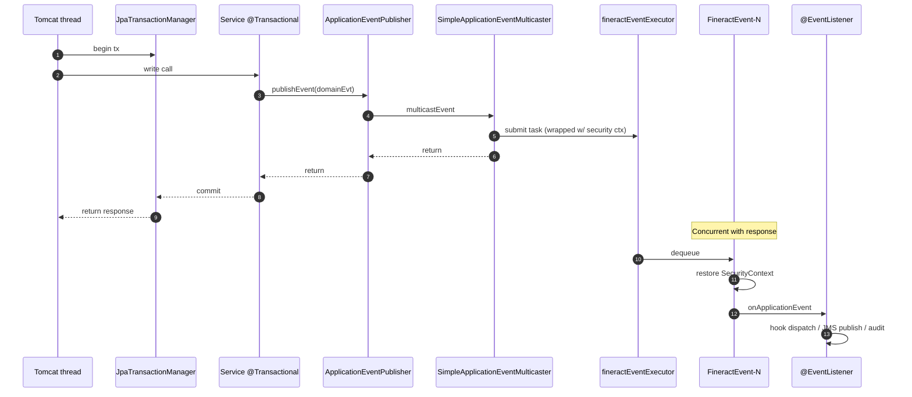

`SpringConfig` is a small but central `@Configuration` in Apache Fineract's
provider module. It does three things:

1. Builds the `fineractEventExecutor` — the `ThreadPoolTaskExecutor` used by
   Spring's asynchronous event publication.
2. Overrides the `SecurityContextHolder` strategy globally to
   `MODE_INHERITABLETHREADLOCAL` so child threads inherit the authenticated
   user.
3. Registers an asynchronous `SimpleApplicationEventMulticaster` that
   delegates to the executor.

Together these turn Spring's default *synchronous* application-event publication
into a security-context-propagating, async fan-out used by hooks, external
events, audit emissions and any in-process `@EventListener`.

## Source

File: `fineract-provider/src/main/java/org/apache/fineract/infrastructure/core/config/SpringConfig.java`

```java
@Configuration
public class SpringConfig {

    private static final int AWAIT_TERMINATION_SECONDS = 60;
    private static final int DEFAULT_QUEUE_CAPACITY = 100;

    @Bean(name = "fineractEventExecutor")
    public ThreadPoolTaskExecutor fineractEventExecutor(ThreadPoolTaskExecutorBuilder builder,
            @Value("${spring.task.execution.pool.core-size:-1}") int configuredCore,
            @Value("${spring.task.execution.pool.max-size:-1}") int configuredMax,
            @Value("${spring.task.execution.pool.queue-capacity:-1}") int configuredQueueCapacity) {

        int cpus = Runtime.getRuntime().availableProcessors();
        int smartCore = cpus * 2;
        int smartMax = cpus * 5;

        int coreSize = configuredCore > 0 ? configuredCore : smartCore;
        int rawMaxSize = configuredMax > 0 ? configuredMax : smartMax;
        int queueCapacity = configuredQueueCapacity >= 0 ? configuredQueueCapacity : DEFAULT_QUEUE_CAPACITY;

        int finalMaxSize = Math.max(rawMaxSize, coreSize);

        ThreadPoolTaskExecutor executor = builder
            .threadNamePrefix("FineractEvent-")
            .corePoolSize(coreSize)
            .maxPoolSize(finalMaxSize)
            .queueCapacity(queueCapacity)
            .build();

        executor.setRejectedExecutionHandler(new ThreadPoolExecutor.CallerRunsPolicy());
        executor.setWaitForTasksToCompleteOnShutdown(true);
        executor.setAwaitTerminationSeconds(AWAIT_TERMINATION_SECONDS);

        return executor;
    }

    @Bean
    @DependsOn("overrideSecurityContextHolderStrategy")
    public SimpleApplicationEventMulticaster applicationEventMulticaster(
            @Qualifier("fineractEventExecutor") ThreadPoolTaskExecutor taskExecutor) {
        SimpleApplicationEventMulticaster multicaster = new SimpleApplicationEventMulticaster();
        multicaster.setTaskExecutor(new DelegatingSecurityContextAsyncTaskExecutor(taskExecutor));
        return multicaster;
    }

    @Bean
    public MethodInvokingFactoryBean overrideSecurityContextHolderStrategy() {
        MethodInvokingFactoryBean factoryBean = new MethodInvokingFactoryBean();
        factoryBean.setTargetClass(SecurityContextHolder.class);
        factoryBean.setTargetMethod("setStrategyName");
        factoryBean.setArguments(SecurityContextHolder.MODE_INHERITABLETHREADLOCAL);
        return factoryBean;
    }

    @Bean
    @DependsOn("overrideSecurityContextHolderStrategy")
    public SecurityContextHolderStrategy securityContextHolderStrategy() {
        return SecurityContextHolder.getContextHolderStrategy();
    }
}
```

## The `fineractEventExecutor` bean

### Smart defaults vs. operator overrides

The executor's sizing logic merges two signals:

- Operator-provided `spring.task.execution.pool.*` properties (Spring Boot's
  standard task-execution keys).
- "Smart" defaults based on the available processor count.

The defaulting is:

| Setting | Operator key | Default if unset/≤0 |
| --- | --- | --- |
| Core pool size | `spring.task.execution.pool.core-size` | `2 × cores` |
| Max pool size | `spring.task.execution.pool.max-size` | `5 × cores` |
| Queue capacity | `spring.task.execution.pool.queue-capacity` | `100` |

The clamp `finalMaxSize = Math.max(rawMaxSize, coreSize)` guards against a
misconfiguration where the max is set lower than the core size.

### Thread name prefix

`"FineractEvent-"` produces threads named `FineractEvent-1`, `FineractEvent-2`,
… in the JVM thread dump. The prefix is intentional — when triaging a slow
deployment, a `jstack` showing dozens of `FineractEvent-*` threads stuck
in `OkHttpClient.newCall()` is an immediate signal that hook notifications are
backed up.

### Rejection policy

```java
executor.setRejectedExecutionHandler(new ThreadPoolExecutor.CallerRunsPolicy());
```

`CallerRunsPolicy` means: when the queue is full and the max pool is at
capacity, the *caller* thread runs the task synchronously. This is back-pressure
— it slows down event publishers until the queue drains. The alternative
(`AbortPolicy`, the default) would throw a `RejectedExecutionException` and
lose events.

For a system that emits domain events as a side effect of business
transactions, dropping events silently is worse than slowing down the
transaction. `CallerRunsPolicy` keeps the loss rate at zero.

### Graceful shutdown

```java
executor.setWaitForTasksToCompleteOnShutdown(true);
executor.setAwaitTerminationSeconds(60);
```

When the application context closes, the executor waits up to 60 seconds for
queued and running tasks to finish. This lets in-flight hook notifications
complete instead of being aborted mid-call.

## Security context strategy override

```java
@Bean
public MethodInvokingFactoryBean overrideSecurityContextHolderStrategy() {
    MethodInvokingFactoryBean factoryBean = new MethodInvokingFactoryBean();
    factoryBean.setTargetClass(SecurityContextHolder.class);
    factoryBean.setTargetMethod("setStrategyName");
    factoryBean.setArguments(SecurityContextHolder.MODE_INHERITABLETHREADLOCAL);
    return factoryBean;
}
```

`SecurityContextHolder` has three modes:

- `MODE_THREADLOCAL` — the default. Each thread sees only the context set
  on that thread.
- `MODE_INHERITABLETHREADLOCAL` — child threads inherit the parent's context
  at the moment they are spawned (via `InheritableThreadLocal`).
- `MODE_GLOBAL` — a single global context, not useful for servers.

Switching to `INHERITABLETHREADLOCAL` is essential for Fineract. When a
request thread spawns a worker (e.g. via `taskExecutor.execute(...)`), that
worker must see the same authenticated user so:

- `AuditorAwareImpl` writes the correct `last_modified_by_userid`.
- Tenant resolution works (the tenant is also held in a `ThreadLocal`-backed
  context).
- Permission checks inside the worker honour the originating user's grants.

The `MethodInvokingFactoryBean` approach is awkward but minimally invasive —
it invokes `SecurityContextHolder.setStrategyName(...)` at bean-creation time,
once, globally for the JVM.

### Why a separate `securityContextHolderStrategy` bean?

```java
@Bean
@DependsOn("overrideSecurityContextHolderStrategy")
public SecurityContextHolderStrategy securityContextHolderStrategy() {
    return SecurityContextHolder.getContextHolderStrategy();
}
```

This exposes the (already-overridden) strategy as an injectable bean. Spring
Security 6 prefers `SecurityContextHolderStrategy` injection over the static
`SecurityContextHolder` accessor (the static methods still work but the
non-static path is recommended). Beans that need to read the security context
in idiomatic Spring Security 6 style inject this one.

The `@DependsOn("overrideSecurityContextHolderStrategy")` ensures the override
runs before the strategy bean is exposed.

## The async event multicaster

```java
@Bean
@DependsOn("overrideSecurityContextHolderStrategy")
public SimpleApplicationEventMulticaster applicationEventMulticaster(
        @Qualifier("fineractEventExecutor") ThreadPoolTaskExecutor taskExecutor) {
    SimpleApplicationEventMulticaster multicaster = new SimpleApplicationEventMulticaster();
    multicaster.setTaskExecutor(new DelegatingSecurityContextAsyncTaskExecutor(taskExecutor));
    return multicaster;
}
```

Three points:

1. **The bean name is implicit.** Spring's `ApplicationContext` looks up a
   multicaster bean named `applicationEventMulticaster` (or falls back to a
   synchronous one). Replacing it changes the behaviour of every
   `applicationEventPublisher.publishEvent(...)` call across the application.

2. **`SimpleApplicationEventMulticaster.setTaskExecutor(...)`** — when a task
   executor is set, every event publication is dispatched through the
   executor. So `publishEvent` returns immediately and the listeners run on
   the executor's threads.

3. **`DelegatingSecurityContextAsyncTaskExecutor`** — Spring Security's
   wrapper. It snapshots the current `SecurityContext` before submitting the
   task and restores it on the worker thread before the listener runs. Combined
   with the `INHERITABLETHREADLOCAL` strategy this gives belt-and-braces
   propagation.

### What this enables

- `@EventListener` methods anywhere in the codebase run asynchronously without
  needing `@Async`.
- Domain events emitted from inside a `@Transactional` write service do not
  block the transaction. The transaction commits, control returns to the
  caller, and the event listeners (hook dispatchers, external-event JMS
  producers, audit emitters) run on `FineractEvent-*` threads.
- Combined with `CallerRunsPolicy`, slow listeners apply back-pressure to the
  transactional path instead of falling over.

## Bean creation order

Spring's `@DependsOn` annotations force the order:

```
overrideSecurityContextHolderStrategy  (writes the static strategy)
        │
        ├──> applicationEventMulticaster  (wraps the executor in DelegatingSecurityContextAsyncTaskExecutor)
        │
        └──> securityContextHolderStrategy  (re-exposes as an injectable bean)
```

`fineractEventExecutor` has no `@DependsOn` — it can be created in any order
because it does not depend on the security strategy directly. The
`DelegatingSecurityContextAsyncTaskExecutor` wrapping happens later, inside
`applicationEventMulticaster`.

## Common questions

### Can I disable async events?

Not via a property. To revert to synchronous publication you would have to
remove the `setTaskExecutor(...)` call and the wrapping bean. In practice,
the answer is "don't" — many parts of the platform assume the publication is
off the request thread.

### Can multiple listeners run in parallel for the same event?

Yes — `SimpleApplicationEventMulticaster` with a task executor invokes each
listener as a separate submission. They will run concurrently on different
`FineractEvent-*` threads.

### What about transactional integrity?

Listeners run *after* the publishing thread returns from `publishEvent`. If
that publishing happened *during* a `@Transactional` method, the transaction
may not yet be committed when the listener fires. For cases that must wait
for commit, use `@TransactionalEventListener` instead of `@EventListener` —
Spring will defer dispatch until after the commit phase.

### What if a listener throws?

The exception is logged by `SimpleApplicationEventMulticaster.invokeListener`
and the publication continues to the next listener. The originating
publishing thread sees no error — async publication is fire-and-forget.

## Sequence diagram: a domain event publication

To make all this concrete, here is what happens when a write service publishes
a domain event inside a transaction:



The two critical guarantees:

- Steps 5-7 do *not* wait for step 9. The HTTP response is sent before the
  listener runs.
- The listener's `SecurityContextHolder.getContext()` still returns the
  authenticated user from step 1 — thanks to
  `DelegatingSecurityContextAsyncTaskExecutor`.

## Failure modes to be aware of

- **Listener throws.** Logged at WARN by the multicaster, then suppressed.
  The originating thread is unaffected. If you need the failure to bubble up,
  publish synchronously by *not* using `publishEvent` — call the listener
  directly.
- **Executor saturation.** Under sustained load, the queue fills, the pool
  reaches max, and `CallerRunsPolicy` makes the publisher run the listener
  inline — which means the response stops being sent in step 7 until the
  listener finishes. The next request to the publisher experiences latency.
  This is back-pressure working as designed; monitor it via the executor's
  Micrometer metrics (`executor.queued`, `executor.active`).
- **Context leak in pool.** `InheritableThreadLocal` snapshots the parent's
  context *at thread creation*, not at task submission. The
  `DelegatingSecurityContextAsyncTaskExecutor` snapshots at submission and
  restores per-task, which is the correct behaviour. If you switch to a
  different executor wrapper (e.g. plain `Executors.newFixedThreadPool`)
  without `DelegatingSecurityContext...`, you'll see authentication of the
  first request leak into every subsequent task in that pool.
- **`@TransactionalEventListener` confusion.** A listener annotated this way
  is registered with the transaction synchronization manager, not the
  multicaster. It runs after commit, on the *same* thread that committed —
  not on a `FineractEvent-N` thread. Useful when you must publish a JMS
  message only after the database row is durable.

## Property reference

The keys this class reads are all standard Spring Boot keys:

```properties
# Smart defaults are 2*cores / 5*cores / 100 — override if needed
spring.task.execution.pool.core-size=8
spring.task.execution.pool.max-size=64
spring.task.execution.pool.queue-capacity=500
```

There is no `fineract.spring.*` prefix — Fineract is happy to inherit Spring
Boot's standard property surface for this one executor.

## Related pages

- [Task Executor Config](/provider/task-executor-config) — the *other* set of
  executors, used directly by services for explicit background work.
- [Metrics Config](/provider/metrics-config) — sibling configuration enabling
  AspectJ auto-proxy (which composes with `@Async`).
- [/runtime/spring-boot-configuration](/runtime/spring-boot-configuration) —
  property layering and overrides.
- [/runtime/task-executors](/runtime/task-executors) — runtime view of all
  executors.
- [Provider Overview](/provider/overview) — module map.
