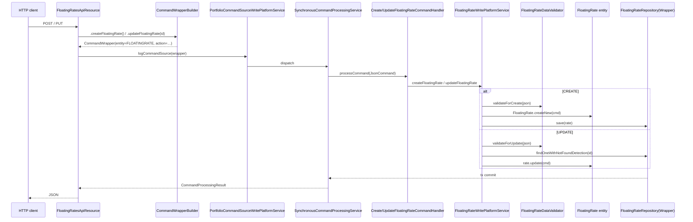

`FloatingRatesApiResource` is the Apache Fineract Jersey resource at `/v1/floatingrates` that drives the `FloatingRate` catalog. The class lives at `fineract-rates/src/main/java/org/apache/fineract/portfolio/floatingrates/api/FloatingRatesApiResource.java` and exposes four endpoints — list, retrieve, create, update. There is intentionally **no DELETE**: floating rates are append-only and the active flag is the kill-switch.

For the entity model see [Floating rate domain](/rates/floating-rate-domain); for the module map see [Rates overview](/rates/overview).

## Class declaration

```java
@Path("/v1/floatingrates")
@Component
@Tag(name = "Floating Rates", description = "It lets you create, list, retrieve and upload the floating rates")
@RequiredArgsConstructor
public class FloatingRatesApiResource {

    private static final String RESOURCE_NAME = "FLOATINGRATE";

    private final PlatformSecurityContext context;
    private final PortfolioCommandSourceWritePlatformService commandsSourceWritePlatformService;
    private final DefaultToApiJsonSerializer<FloatingRateData> toApiJsonSerializer;
    private final FloatingRatesReadPlatformService floatingRatesReadPlatformService;
    // ...
}
```

Every endpoint guards `READ_FLOATINGRATE`. Write permissions are enforced downstream by `SynchronousCommandProcessingService` against the `CREATE_FLOATINGRATE` / `UPDATE_FLOATINGRATE` rows in `m_permission`.

## Endpoint summary

| HTTP | Path | Method | Permission | Purpose |
| --- | --- | --- | --- | --- |
| `GET` | `/v1/floatingrates` | `retrieveAll` | `READ_FLOATINGRATE` | List every catalog row. |
| `GET` | `/v1/floatingrates/{id}` | `retrieveOne` | `READ_FLOATINGRATE` | Fetch one row including all periods. |
| `POST` | `/v1/floatingrates` | `createFloatingRate` | `CREATE_FLOATINGRATE` | Create a new floating rate. |
| `PUT` | `/v1/floatingrates/{id}` | `updateFloatingRate` | `UPDATE_FLOATINGRATE` | Rename / toggle active / append future periods. |

## `POST /v1/floatingrates`

```java
@POST
@Operation(summary = "Create a new Floating Rate",
    description = "Creates a new Floating Rate\n"
        + "Mandatory Fields: name\n"
        + "Optional Fields: isBaseLendingRate, isActive, ratePeriods")
@RequestBody(required = true, content = @Content(schema = @Schema(implementation = FloatingRateRequest.class)))
@ApiResponse(responseCode = "200", description = "OK",
    content = @Content(schema = @Schema(implementation = FloatingRatesApiResourceSwagger.PostFloatingRatesResponse.class)))
public CommandProcessingResult createFloatingRate(@Parameter(hidden = true) final FloatingRateRequest floatingRateRequest) {
    final CommandWrapper commandRequest = new CommandWrapperBuilder().createFloatingRate()
            .withJson(toApiJsonSerializer.serialize(floatingRateRequest)).build();
    return commandsSourceWritePlatformService.logCommandSource(commandRequest);
}
```

`CommandWrapperBuilder.createFloatingRate()` produces a wrapper with `entityName="FLOATINGRATE"`, `actionName="CREATE"`. `CreateFloatingRateCommandHandler` (in `fineract-rates/.../handler/`) picks it up:

```java
@Service
@CommandType(entity = "FLOATINGRATE", action = "CREATE")
public class CreateFloatingRateCommandHandler implements NewCommandSourceHandler {
    private final FloatingRateWritePlatformService writePlatformService;
    @Autowired public CreateFloatingRateCommandHandler(final FloatingRateWritePlatformService writePlatformService) {
        this.writePlatformService = writePlatformService;
    }
    @Transactional
    @Override
    public CommandProcessingResult processCommand(final JsonCommand command) {
        return this.writePlatformService.createFloatingRate(command);
    }
}
```

The write service:

1. Runs `FloatingRateDataValidator.validateForCreate(json)`.
2. Calls `FloatingRate.createNew(command)` (see [Floating rate domain](/rates/floating-rate-domain)).
3. Persists via `FloatingRateRepository`.

### `FloatingRateRequest` DTO

The DTO mirrors the parameters accepted by the validator (see `FloatingRateDataValidator` and `FloatingRatePeriodRequest`):

| Field | Type | Notes |
| --- | --- | --- |
| `name` | string | Required; unique against `m_floating_rates.name`. |
| `isBaseLendingRate` | boolean | Defaults to false. |
| `isActive` | boolean | Defaults to true. |
| `ratePeriods` | `FloatingRatePeriodRequest[]` | Optional list of periods. |

Each `FloatingRatePeriodRequest` carries:

| Field | Type | Notes |
| --- | --- | --- |
| `fromDate` | LocalDate | Required. Must be strictly after today's business date (validator). |
| `interestRate` | BigDecimal | Required. Absolute or differential rate. |
| `isDifferentialToBaseLendingRate` | boolean | Defaults to false. |
| `locale`, `dateFormat` | strings | Required for date parsing. |

### Sample request — base lending rate

```json
POST /fineract-provider/api/v1/floatingrates
{
  "name":              "Base lending rate",
  "isBaseLendingRate": true,
  "isActive":          true,
  "locale":            "en",
  "dateFormat":        "yyyy-MM-dd",
  "ratePeriods": [
    { "fromDate": "2024-09-01", "interestRate": 6.0,  "isDifferentialToBaseLendingRate": false,
      "locale": "en", "dateFormat": "yyyy-MM-dd" }
  ]
}
```

Response:

```json
{ "resourceId": 1 }
```

### Sample request — auto loan reference rate with differential

```json
POST /fineract-provider/api/v1/floatingrates
{
  "name":      "Auto loan reference",
  "isActive":  true,
  "locale":    "en",
  "dateFormat":"yyyy-MM-dd",
  "ratePeriods": [
    { "fromDate": "2024-09-01", "interestRate": 1.50, "isDifferentialToBaseLendingRate": true,
      "locale": "en", "dateFormat": "yyyy-MM-dd" }
  ]
}
```

A loan product later referencing this rate will receive `(active base rate on the loan date) + 1.50`.

## `GET /v1/floatingrates`

```java
@GET
@Operation(summary = "List Floating Rates", description = "Lists Floating Rates")
@ApiResponse(responseCode = "200", description = "OK",
    content = @Content(array = @ArraySchema(schema = @Schema(implementation = FloatingRatesApiResourceSwagger.GetFloatingRatesResponse.class))))
public List<FloatingRateData> retrieveAll() {
    this.context.authenticatedUser().validateHasReadPermission(RESOURCE_NAME);
    return floatingRatesReadPlatformService.retrieveAll();
}
```

`FloatingRateData` carries:

- `id`, `name`, `isBaseLendingRate`, `isActive`.
- `createdBy`, `createdOn`, `modifiedBy`, `modifiedOn` audit fields.
- `ratePeriods` — list of `FloatingRatePeriodData` `{id, fromDate, interestRate, isDifferentialToBaseLendingRate, isActive}`.

## `GET /v1/floatingrates/{floatingRateId}`

```java
@GET
@Path("{floatingRateId}")
@Operation(summary = "Retrieve Floating Rate", description = "Retrieves Floating Rate")
public FloatingRateData retrieveOne(@PathParam("floatingRateId") final Long floatingRateId) {
    this.context.authenticatedUser().validateHasReadPermission(RESOURCE_NAME);
    return floatingRatesReadPlatformService.retrieveOne(floatingRateId);
}
```

Throws `FloatingRateNotFoundException` (HTTP 404) on miss.

## `PUT /v1/floatingrates/{floatingRateId}`

```java
@PUT
@Path("{floatingRateId}")
@Operation(summary = "Update Floating Rate",
    description = "Updates new Floating Rate. Rate Periods in the past cannot be modified. All the future rateperiods would be replaced with the new ratePeriods data sent.")
@RequestBody(required = true, content = @Content(schema = @Schema(implementation = FloatingRateRequest.class)))
@ApiResponse(responseCode = "200", description = "OK",
    content = @Content(schema = @Schema(implementation = FloatingRatesApiResourceSwagger.PutFloatingRatesFloatingRateIdResponse.class)))
public CommandProcessingResult updateFloatingRate(
        @PathParam("floatingRateId") final Long floatingRateId,
        @Parameter(hidden = true) final FloatingRateRequest floatingRateRequest) {
    final CommandWrapper commandRequest = new CommandWrapperBuilder().updateFloatingRate(floatingRateId)
            .withJson(toApiJsonSerializer.serialize(floatingRateRequest)).build();
    return commandsSourceWritePlatformService.logCommandSource(commandRequest);
}
```

Handler:

```java
@Service
@CommandType(entity = "FLOATINGRATE", action = "UPDATE")
public class UpdateFloatingRateCommandHandler implements NewCommandSourceHandler {
    private final FloatingRateWritePlatformService writePlatformService;
    @Transactional
    @Override
    public CommandProcessingResult processCommand(final JsonCommand command) {
        return this.writePlatformService.updateFloatingRate(command.entityId(), command);
    }
}
```

The write service:

1. Runs `FloatingRateDataValidator.validateForUpdate(json)`.
2. Loads the entity via `FloatingRateRepositoryWrapper.findOneWithNotFoundDetection(id)`.
3. Calls `floatingRate.update(command)`.

Inside `FloatingRate.update`:

- `name`, `isBaseLendingRate`, `isActive` are straight overwrites if changed.
- The `ratePeriods` payload is **appended** to the existing list. Any **future** existing periods (i.e. `fromDate > today's business date`) are set `isActive=false`.

Sample request — append a new period and rename:

```json
PUT /fineract-provider/api/v1/floatingrates/1
{
  "name":   "Base lending rate (revised)",
  "locale": "en",
  "dateFormat": "yyyy-MM-dd",
  "ratePeriods": [
    { "fromDate": "2025-01-01", "interestRate": 6.5,
      "isDifferentialToBaseLendingRate": false, "locale": "en", "dateFormat": "yyyy-MM-dd" }
  ]
}
```

Response:

```json
{
  "resourceId": 1,
  "changes": {
    "name": "Base lending rate (revised)",
    "ratePeriods": [
      { "fromDate": "2025-01-01", "interestRate": 6.5, "isDifferentialToBaseLendingRate": false,
        "locale": "en", "dateFormat": "yyyy-MM-dd" }
    ]
  }
}
```

The `changes.ratePeriods` value is exactly the JSON fragment that was POSTed (set by `command.jsonFragment("ratePeriods")`) — it is **not** the diff of period rows.

## Validator overview

`FloatingRateDataValidator` runs both create and update validation. Its parameter sets:

```java
public static final String NAME                                     = "name";
public static final String IS_BASE_LENDING_RATE                     = "isBaseLendingRate";
public static final String IS_ACTIVE                                = "isActive";
public static final String RATE_PERIODS                             = "ratePeriods";
public static final String FROM_DATE                                = "fromDate";
public static final String INTEREST_RATE                            = "interestRate";
public static final String IS_DIFFERENTIAL_TO_BASE_LENDING_RATE     = "isDifferentialToBaseLendingRate";

private static final Set<String> SUPPORTED_PARAMETERS_FOR_FLOATING_RATES =
    new HashSet<>(Arrays.asList(NAME, IS_BASE_LENDING_RATE, IS_ACTIVE, RATE_PERIODS));
private static final Set<String> SUPPORTED_PARAMETERS_FOR_FLOATING_RATE_PERIODS =
    new HashSet<>(Arrays.asList(FROM_DATE, INTEREST_RATE, IS_DIFFERENTIAL_TO_BASE_LENDING_RATE, LOCALE, DATE_FORMAT));
```

`validateForCreate`:

- `name` — required, not blank, `notExceedingLengthOf(200)`, unique against `m_floating_rates.name`.
- `isBaseLendingRate` — optional, boolean.
  - When true, the validator also enforces that **no other rate currently has `is_base_lending_rate=true`**, walking `floatingRateRepository.retrieveBaseLendingRate()`.
- `isActive` — optional, boolean.
- `ratePeriods` — optional array.
  - Each entry: `fromDate` required, `interestRate` required (`notNull`, `notLessThanMin(0)`), `isDifferentialToBaseLendingRate` optional.
  - `fromDate` must be strictly **after** today's business date.
  - Each entry rejects unsupported parameters via `checkForUnsupportedParameters(SUPPORTED_PARAMETERS_FOR_FLOATING_RATE_PERIODS)`.
  - Duplicate `fromDate` within the same payload is rejected.

`validateForUpdate`:

- All fields optional, validated when present.
- `ratePeriods` entries are still required to be strictly future — past `fromDate`s are rejected as immutable.

`PlatformApiDataValidationException` carries one `ApiParameterError` per failure.

## Resource ↔ handler topology



## Errors

| HTTP | Cause |
| --- | --- |
| 400 | `PlatformApiDataValidationException` — missing / malformed fields, past `fromDate`, duplicate periods, `isBaseLendingRate=true` while another base exists. |
| 400 | Unique constraint violation on `m_floating_rates.name` (mapped from JPA). |
| 401 / 403 | Missing `READ_FLOATINGRATE` / `CREATE_FLOATINGRATE` / `UPDATE_FLOATINGRATE` permission. |
| 404 | `FloatingRateNotFoundException`. |

## Cross-references

- For the entity-level algorithm (`fetchInterestRates`, differential vs absolute, `updateRatePeriods`): [Floating rate domain](/rates/floating-rate-domain).
- For the broader module map: [Rates overview](/rates/overview).
- For how loan products bind their `floatingRateId` and the per-loan rate snapshot: [Loan charges](/loan/loan-charges).
- For the `CommandWrapper` / `CommandWrapperBuilder` / `PortfolioCommandSourceWritePlatformService` plumbing: [Portfolio shared domain](/core/portfolio-shared-domain).
- For configuration and reference data: [Configuration and code APIs](/api/global-configuration).
