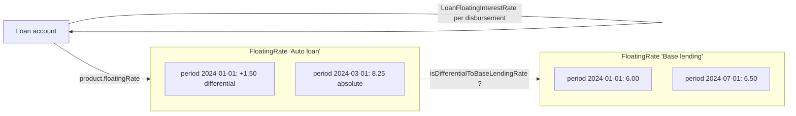
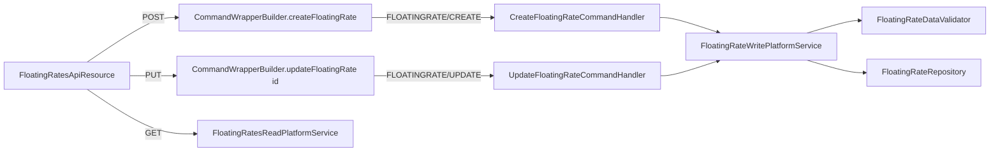
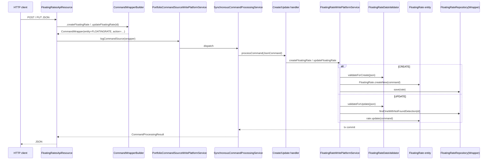
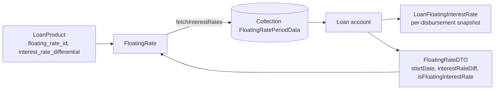

`fineract-rates` is the Apache Fineract Gradle module that owns the **floating interest rate catalog**. A `FloatingRate` is a named rate timeline: a list of `FloatingRatePeriod` rows, each carrying a `from_date`, an `interest_rate`, and a flag that marks it as a **base** rate or a **differential** rate. Loan products reference a floating rate and add their own spread; the rate that ends up on a loan installment is `floating + product spread + per-loan differential`.

Use this overview to find:

- The two persisted entities → [Floating rate domain](/rates/floating-rate-domain).
- The Jersey resource at `/v1/floatingrates` → [Floating rates API](/rates/floating-rates-api).
- How loan products consume floating rates → see `LoanProduct.floatingRate` and `LoanFloatingInterestRate` in [Loan charges](/loan/loan-charges) and the loan-product reference.

## Module layout

```
fineract-rates/
└── src/main/java/org/apache/fineract/portfolio/floatingrates/
    ├── api/
    │   ├── FloatingRatesApiResource.java        ← @Path("/v1/floatingrates")
    │   └── FloatingRatesApiResourceSwagger.java
    ├── data/
    │   ├── FloatingRateDTO.java                 ← request DTO for "give me the schedule at date X"
    │   ├── FloatingRateData.java                ← read DTO
    │   ├── FloatingRatePeriodData.java
    │   ├── FloatingRatePeriodRequest.java       ← inbound JSON for one rate period
    │   ├── FloatingRateRequest.java             ← inbound JSON for the whole rate
    │   └── InterestRatePeriodData.java
    ├── domain/
    │   ├── FloatingRate.java                    ← @Entity m_floating_rates
    │   ├── FloatingRatePeriod.java              ← @Entity m_floating_rates_periods
    │   ├── FloatingRateRepository.java
    │   └── FloatingRateRepositoryWrapper.java
    ├── exception/
    │   └── FloatingRateNotFoundException.java
    ├── handler/
    │   ├── CreateFloatingRateCommandHandler.java   ← @CommandType FLOATINGRATE/CREATE
    │   └── UpdateFloatingRateCommandHandler.java   ← @CommandType FLOATINGRATE/UPDATE
    ├── serialization/
    │   └── FloatingRateDataValidator.java
    ├── service/
    │   ├── FloatingRatesReadPlatformService.java + Impl
    │   └── FloatingRateWritePlatformService.java + Impl
    └── starter/
        └── FloatingRatesConfiguration.java
```

There is **no DELETE handler** — a floating rate cannot be removed once created. Active flags on the rate and on each period let operators stop the rate from being applied to new loans.

## Conceptual model

A floating rate has two shapes:

- **Base lending rate** — `is_base_lending_rate = true`. Carries absolute interest rates. Only one rate row in the catalog should ever have this flag (operators are expected to enforce this manually). When a loan product references this rate, the rate quoted to the borrower is just the period rate.
- **Differential rate** — `is_base_lending_rate = false`. Each period that has `is_differential_to_base_lending_rate=true` carries a **delta** that is added to the base lending rate active on that period's `from_date`. The remaining periods are absolute.



The `FloatingRate.fetchInterestRates(FloatingRateDTO)` method walks the period list ordered by `(fromDate, id)` and returns the periods applicable from a starting date forward — see [Floating rate domain](/rates/floating-rate-domain).

## REST surface



The resource only exposes four endpoints — list, retrieve, create, update. Detail on each is in [Floating rates API](/rates/floating-rates-api).

## How loan products consume floating rates

- `LoanProduct.floatingRate` is a `@ManyToOne` reference to `FloatingRate`. The product carries its own `interest_rate_differential` (a spread that is added on top of the floating rate).
- `LoanFloatingInterestRate` is a per-loan record (in `fineract-loan`) that stores the rate snapshot at each disbursement / repricing date. It is **derived from** the catalog at the moment the loan moves, so subsequent changes to the catalog do not retroactively change historical loan interest.
- Cf. `Loan.fetchInterestRateForDisbursement(...)` and the COB jobs in [Jobs overview](/jobs/overview).

## Validator + handler topology

Two `@CommandType` handlers wired to the standard portfolio command pipeline:

```java
@Service
@CommandType(entity = "FLOATINGRATE", action = "CREATE")
public class CreateFloatingRateCommandHandler implements NewCommandSourceHandler {
    private final FloatingRateWritePlatformService writePlatformService;
    @Autowired public CreateFloatingRateCommandHandler(final FloatingRateWritePlatformService s) {
        this.writePlatformService = s;
    }
    @Transactional
    @Override
    public CommandProcessingResult processCommand(final JsonCommand command) {
        return this.writePlatformService.createFloatingRate(command);
    }
}
```

```java
@Service
@CommandType(entity = "FLOATINGRATE", action = "UPDATE")
public class UpdateFloatingRateCommandHandler implements NewCommandSourceHandler {
    private final FloatingRateWritePlatformService writePlatformService;
    @Transactional
    @Override
    public CommandProcessingResult processCommand(final JsonCommand command) {
        return this.writePlatformService.updateFloatingRate(command.entityId(), command);
    }
}
```

`FloatingRateDataValidator` (see the source listing in the next section) validates inbound JSON for both endpoints. Two parameter sets:

```java
private static final Set<String> SUPPORTED_PARAMETERS_FOR_FLOATING_RATES =
    new HashSet<>(Arrays.asList(NAME, IS_BASE_LENDING_RATE, IS_ACTIVE, RATE_PERIODS));
private static final Set<String> SUPPORTED_PARAMETERS_FOR_FLOATING_RATE_PERIODS =
    new HashSet<>(Arrays.asList(FROM_DATE, INTEREST_RATE, IS_DIFFERENTIAL_TO_BASE_LENDING_RATE, LOCALE, DATE_FORMAT));
```

## Exceptions

| Exception | Trigger |
| --- | --- |
| `FloatingRateNotFoundException` | `FloatingRateRepositoryWrapper.findOneWithNotFoundDetection(id)` for missing id. |

Plus standard `PlatformApiDataValidationException` from the validator for malformed JSON / missing fields / overlapping rate periods.

## End-to-end write flow



## Why the append-only update model

`FloatingRate.update(JsonCommand)` does **not** replace the period list. New periods are appended, and any **future** existing period (where `fromDate > business date`) is set `isActive=false`. The reason this matters in practice:

- **History is preserved**. A loan disbursed last year on a particular period's rate will continue to query that period when its accruals are replayed (audits, COB re-runs, statement generation).
- **Repricing is forward-only**. To "change" the rate from a future date, an operator submits a new period for that date; the old, future-dated row is deactivated automatically.
- **Past periods are immutable** — even via PUT. The Swagger description says it explicitly: "Rate Periods in the past cannot be modified. All the future rateperiods would be replaced with the new ratePeriods data sent."

`FloatingRateDataValidator` enforces the matching JSON-side rule by rejecting any `fromDate` that is not strictly after today's business date.

## How a loan reads the catalog



At a disbursement event:

1. The loan engine builds a `FloatingRateDTO` carrying the disbursement date as `startDate`, the product's `interest_rate_differential` as `interestRateDiff`, and the loan-level "is floating" flag.
2. It calls `floatingRate.fetchInterestRates(dto)`.
3. The returned `FloatingRatePeriodData` list is captured into one or more `LoanFloatingInterestRate` rows so future re-evaluations replay the same rates.

## What the module deliberately does not own

- **Loan-product write APIs** — the product references a `floatingRateId`; the wire-up and validation of that reference lives in `fineract-loan` / `fineract-progressive-loan`.
- **Per-loan rate snapshots** — `LoanFloatingInterestRate` lives in `fineract-loan` because it is part of the loan's history; this module only owns the catalog.
- **Schedule recalculation** — the COB jobs that re-amortize loans on rate changes live in `fineract-cob`; see [Jobs overview](/jobs/overview).

## Quick reference — fields, FKs and tables

| Concern | Where it lives |
| --- | --- |
| Catalog tables | `m_floating_rates`, `m_floating_rates_periods`. |
| JPA entities | `FloatingRate`, `FloatingRatePeriod` (both `AbstractAuditableWithUTCDateTimeCustom<Long>`). |
| Read DTOs | `FloatingRateData`, `FloatingRatePeriodData`, `InterestRatePeriodData`. |
| Read services | `FloatingRatesReadPlatformService` + `Impl`. |
| Write services | `FloatingRateWritePlatformService` + `Impl`. |
| JSON validator | `FloatingRateDataValidator`. |
| Repository wrapper | `FloatingRateRepositoryWrapper.findOneWithNotFoundDetection(...)`. |
| `@CommandType` handlers | `CreateFloatingRateCommandHandler`, `UpdateFloatingRateCommandHandler`. |
| Cross-module FKs | `m_product_loan.floating_rates_id`, plus per-loan `m_loan_floating_interest_rate` (in `fineract-loan`). |
| Spring configuration | `starter/FloatingRatesConfiguration.java`. |
| Permissions | `READ_FLOATINGRATE`, `CREATE_FLOATINGRATE`, `UPDATE_FLOATINGRATE` (+ `*_CHECKER` when maker-checker enabled). |

## Worked example — applying a differential floating rate

Suppose the catalog holds two `FloatingRate` rows:

- `"Base lending rate"` with `isBaseLendingRate=true`, periods:
  - `2024-01-01: 6.00`
  - `2024-07-01: 6.50`
- `"Auto loan reference"` with `isBaseLendingRate=false`, periods:
  - `2024-01-01: +1.50, isDifferentialToBaseLendingRate=true`
  - `2024-10-01: 8.25, isDifferentialToBaseLendingRate=false`

A loan product binds `"Auto loan reference"` and quotes a product-level spread `interestRateDiff=0.25`. A loan is disbursed on `2024-08-01` with `isFloatingInterestRate=true`.

The loan engine builds a `FloatingRateDTO(startDate=2024-08-01, interestRateDiff=0.25, isFloatingInterestRate=true)` and calls `autoLoanRef.fetchInterestRates(dto)`. The walk:

| Period | Action | Resulting rate |
| --- | --- | --- |
| `2024-01-01: +1.50 (differential)` | `applicableRates.isEmpty() && startDate < period.fromDate` is false (`2024-08-01 > 2024-01-01`), skip. `previousPeriod` set. | — |
| `2024-10-01: 8.25 (absolute)` | `applicableRates.isEmpty() && startDate < period.fromDate` is true; loan is floating ⇒ `addPeriodData=true`. Previous period (`+1.50` differential) is added first: `(+1.50) + 0.25 + (BLR at 2024-01-01 = 6.00)` = `7.75`. Then this period itself is added: `8.25 + 0.25 = 8.50`. | — |

So the loan picks up:

- `2024-08-01 .. 2024-09-30 → 7.75%` (the previous differential row, folded against the BLR at its own `fromDate` and the product spread).
- `2024-10-01 onwards → 8.50%` (the absolute row, just product spread added).

Note that the differential row's BLR resolution uses the **period's own `fromDate`** (`2024-01-01`, BLR=6.00), not the loan's `startDate` (`2024-08-01`, BLR=6.50). This is deliberate — the rate captured into `LoanFloatingInterestRate` reflects what the period *would have been* at its inception. The COB repricing job calls `fetchInterestRates(...)` again on subsequent rate-change dates with the loan's then-current state to refresh the active rate.

If the loan had instead been disbursed with `isFloatingInterestRate=false`, the loop would have returned only the differential row (the period active on `2024-08-01`), so the loan locks in `7.75%` for its life — even after the catalog moves to the absolute `8.25` on `2024-10-01`.

## Operational notes for new contributors

- The "base lending rate" semantics depend on convention, not constraint. The validator rejects creating a second rate with `isBaseLendingRate=true`, but it does **not** stop two existing rows from carrying the flag if the data is hand-edited. Cross-module code looks up the base via `FloatingRateRepository.retrieveBaseLendingRate()`; if multiple rows match, the result is undefined.
- Period rows are eager-fetched on every catalog read. For tenants with very long-lived rates the period count can grow into the hundreds; if read performance becomes an issue, the standard workaround is to deactivate ancient periods rather than restructure the catalog.
- The `interest_rate` column has `scale=6, precision=19` — so values can be stored down to six decimal places. Loan APIs round at the point of accrual, not at storage.

## Cross-references

- For the entity model, the `(name, isBaseLendingRate, isActive, periods[])` shape, and the `fetchInterestRates(FloatingRateDTO)` algorithm: [Floating rate domain](/rates/floating-rate-domain).
- For the REST endpoints: [Floating rates API](/rates/floating-rates-api).
- For shared `JsonCommand`, `CommandWrapperBuilder`, `AbstractAuditableWithUTCDateTimeCustom`: [Portfolio shared domain](/core/portfolio-shared-domain).
- For how loan accounts pick up the rate: [Loan charges](/loan/loan-charges) and related loan-product pages.
- For the COB jobs that reprice floating-rate loans: [Jobs overview](/jobs/overview).
