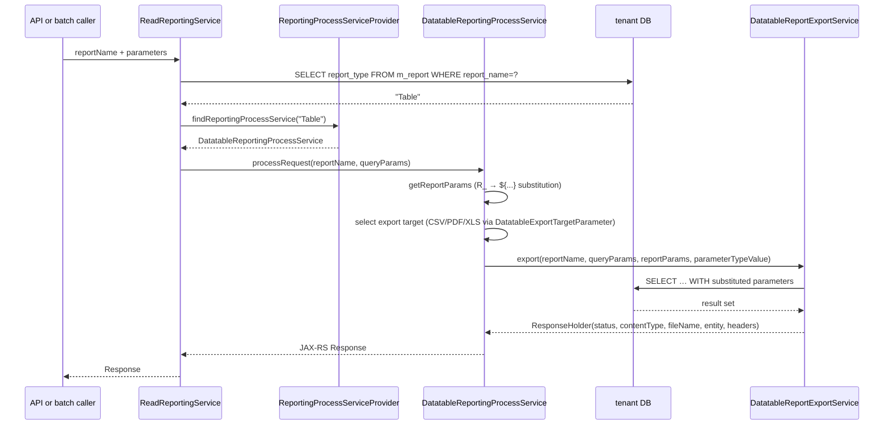

`fineract-report` is the Apache Fineract Gradle module that defines the **reporting plug-in surface**. It is intentionally small: one annotation (`@ReportService`), one service interface (`ReportingProcessService`), one abstract base (`AbstractReportingProcessService`), and one provider registry (`ReportingProcessServiceProvider`). The module ships **no concrete reports**. Concrete implementations — `DatatableReportingProcessService` for SQL-backed stretchy reports, and any Pentaho `.prpt` adapter — register themselves from `fineract-provider`.

Use this overview to navigate:

- The provider abstraction and how implementations are registered → [Report provider](/report/report-provider).
- The scheduled job that emails reports → [Report mailing job](/report/report-mailing-job).
- The matching REST endpoints for running reports interactively → [Reports and data APIs](/api/reports).

## Module layout

```
fineract-report/
└── src/main/java/org/apache/fineract/infrastructure/report/
    ├── annotation/
    │   └── ReportService.java          ← @Retention(RUNTIME) marker
    ├── provider/
    │   └── ReportingProcessServiceProvider.java
    └── service/
        ├── ReportingProcessService.java       ← interface
        └── AbstractReportingProcessService.java
```

The entire public surface fits in four classes. Everything else — `Report` entity, `ReadReportingService`, datatable resolution, Pentaho integration, the SQL execution path — lives in `fineract-provider` under `org.apache.fineract.infrastructure.dataqueries` and friends. The `fineract-report` module is the **plug-in seam** between those resource-bearing classes and the rest of the platform.

## Conceptual model

A `Report` row (in `m_report`) carries a `report_type` field — `Table`, `Chart`, `SMS`, or `Pentaho`. When a report is run:

1. The `Report` row is looked up.
2. The `report_type` string is passed to `ReportingProcessServiceProvider.findReportingProcessService(type)`.
3. The returned `ReportingProcessService` performs the export.

`ReportingProcessService` is intentionally tiny:

```java
public interface ReportingProcessService {
    Response processRequest(String reportName, MultivaluedMap<String, String> queryParams);
    List<ReportExportType> getAvailableExportTargets();
    Map<String, String> getReportParams(MultivaluedMap<String, String> queryParams);
}
```

A concrete implementation must register itself for one or more `report_type` strings via the `@ReportService` annotation:

```java
@Retention(RUNTIME) @Target(ElementType.TYPE) @Documented
public @interface ReportService {
    String[] type();
}
```

Example registration (lives in `fineract-provider`):

```java
@Service
@ReportService(type = { "Table", "Chart", "SMS" })
public class DatatableReportingProcessService extends AbstractReportingProcessService {
    // ...
}
```

The provider scans every `ReportingProcessService` bean on startup, reads the `@ReportService` annotation, and indexes the bean by each type it claims. Lookups at runtime are constant-time and never throw — missing types just return `null`.

## Provider registry

```mermaid
flowchart LR
    subgraph fineract_report
        PSA[ReportingProcessService interface]
        ABS[AbstractReportingProcessService]
        Annot[@ReportService type]
        Prov[ReportingProcessServiceProvider]
    end
    subgraph fineract_provider
        DT[DatatableReportingProcessService\n@ReportService Table Chart SMS]
        Pentaho[(Pentaho RPT impl\nregistered for type=Pentaho\nif Pentaho jars present)]
    end
    PSA <|-- ABS
    ABS <|-- DT
    Annot --- DT
    Annot --- Pentaho
    DT --> Prov
    Pentaho --> Prov
    Caller[ReadReportingService / job tasklets] --> Prov
    Prov -->|byType| DT
    Prov -->|byType| Pentaho
```

```java
@Component @Scope("singleton")
public class ReportingProcessServiceProvider {
    public static final String SERVICE_MISSING =
        "There is no ReportingProcessService registered in the ReportingProcessServiceProvider for this report type: ";
    private final Map<String, ReportingProcessService> reportingProcessServices;

    @Autowired
    public ReportingProcessServiceProvider(List<ReportingProcessService> reportingProcessServices) {
        var mapBuilder = ImmutableMap.<String, ReportingProcessService>builder();
        for (ReportingProcessService s : reportingProcessServices) {
            String[] reportTypes = s.getClass().getAnnotation(ReportService.class).type();
            for (String type : reportTypes) { mapBuilder.put(type, s); }
            LOGGER.info("Registered report service '{}' for type/s '{}'", s, reportTypes);
        }
        this.reportingProcessServices = mapBuilder.build();
    }

    public ReportingProcessService findReportingProcessService(final String reportType) {
        return reportingProcessServices.getOrDefault(reportType, null);
    }

    public Collection<String> findAllReportingTypes() { return this.reportingProcessServices.keySet(); }
}
```

Notes:

- Built atop Guava `ImmutableMap` — claims are baked at startup.
- The constructor **requires** `@ReportService` to be present on every `ReportingProcessService` bean (raw `s.getClass().getAnnotation(ReportService.class).type()` would NPE otherwise). Implementers must annotate the bean class.
- `findReportingProcessService(...)` returns `null` for unknown types. Callers (`ReadReportingService`, `ExecuteReportMailingJobsTasklet`) raise `GeneralPlatformDomainRuleException` with `SERVICE_MISSING` when that happens.

## Shared base — `AbstractReportingProcessService`

```java
public abstract class AbstractReportingProcessService implements ReportingProcessService {
    private final SqlValidator sqlValidator;
    protected AbstractReportingProcessService(SqlValidator sqlValidator) { this.sqlValidator = sqlValidator; }

    @Override
    public Map<String, String> getReportParams(final MultivaluedMap<String, String> queryParams) {
        final Map<String, String> reportParams = new HashMap<>();
        for (Map.Entry<String, List<String>> entry : queryParams.entrySet()) {
            if (entry.getKey().startsWith("R_")) {
                String pKey   = "${" + entry.getKey().substring(2) + "}";
                String pValue = entry.getValue().get(0);
                sqlValidator.validate(pValue);
                reportParams.put(pKey, pValue);
            }
        }
        return reportParams;
    }
}
```

Two key behaviours:

- **`R_` prefix convention** — query parameters prefixed with `R_` are extracted as report parameters. The `R_` prefix is stripped and the result is wrapped in `${...}` so it can be substituted directly into a SQL template by the stretchy report engine.
- **SQL injection guard** — every extracted value runs through `SqlValidator` (from `fineract-security`) before becoming part of the substitution map. The validator rejects characters that would let a value break out of a SQL literal.

`getAvailableExportTargets()` and `processRequest(...)` are left abstract — the concrete implementation decides what export formats it can produce (CSV, PDF, XLS, …).

## Where the implementations live

### Datatable / SQL — `DatatableReportingProcessService` (in `fineract-provider`)

Claims types `Table`, `Chart`, `SMS`. The implementation reads the report SQL from `m_report.report_sql`, substitutes `${...}` parameters, runs the query via JDBC, and delegates output formatting to a list of `DatatableReportExportService` beans (one per export format). Excerpt:

```java
@Service @ReportService(type = { "Table", "Chart", "SMS" }) @Slf4j
public class DatatableReportingProcessService extends AbstractReportingProcessService {

    private final List<DatatableReportExportService> exportServices;

    public DatatableReportingProcessService(List<DatatableReportExportService> exportServices, SqlValidator sqlValidator) {
        super(sqlValidator);
        this.exportServices = exportServices;
    }

    @Override
    public Response processRequest(String reportName, MultivaluedMap<String, String> queryParams) {
        DatatableExportTargetParameter exportMode = DatatableExportTargetParameter.resolverExportTarget(queryParams);
        final String parameterTypeValue = ApiParameterHelper.parameterType(queryParams) ? "parameter" : "report";
        final Map<String, String> reportParams = getReportParams(queryParams);
        ResponseHolder response = findReportExportService(exportMode)
            .orElseThrow(() -> new GeneralPlatformDomainRuleException("error.msg.report.export.mode.unavailable",
                "Export mode %s unavailable".formatted(exportMode.name())))
            .export(reportName, queryParams, reportParams, parameterTypeValue);
        // ... assemble JAX-RS Response (Content-Type, Content-Disposition, body)
    }
}
```

### Pentaho — `type=Pentaho`

The Apache Fineract repo declares the `Pentaho` `report_type` but **ships no Pentaho implementation in this snapshot of the source** (the only `@ReportService` annotation in-tree is on `DatatableReportingProcessService`). The Pentaho `.prpt` integration is supplied by an external module/extension that registers an additional `@ReportService(type = "Pentaho")` bean. When that bean is absent, `findReportingProcessService("Pentaho")` returns `null` and the caller raises `GeneralPlatformDomainRuleException` with `SERVICE_MISSING + "Pentaho"`.

### SQL reports vs Pentaho

| Aspect | SQL ("Table" / "Chart" / "SMS") | Pentaho ("Pentaho") |
| --- | --- | --- |
| Source of definition | `m_report.report_sql` row + `m_report_parameter` mappings | A `.prpt` file on the filesystem (`m_report.report_name` resolves to the file). |
| Parameter substitution | `${name}` placeholders rewritten from `R_*` query params. | Pentaho's own parameter model. |
| SQL validation | `SqlValidator` on each parameter value. | Pentaho handles parameter typing. |
| Export formats | CSV, PDF, XLS, JSON via `DatatableReportExportService`. | Pentaho engine (PDF, HTML, XLS, CSV). |
| `@ReportService` claim | Single bean for "Table", "Chart", "SMS". | Separate bean for "Pentaho" (if shipped). |

## Where the provider is consumed

The provider is read from two consumers:

1. **`ReadReportingService.retrieveReportPDF` / `retrieveReportXLS` / etc. (in `fineract-provider`)** — the interactive `/v1/runreports/{name}` endpoint. The service resolves the `Report` row, picks `report_type`, asks the provider, and delegates.
2. **`ExecuteReportMailingJobsTasklet` (in `fineract-provider`)** — the batch job that runs scheduled reports and emails the output. See [Report mailing job](/report/report-mailing-job).

## How a report ends up emitted

The `m_report` row is fetched by `ReadReportingService`, the `report_type` column is read, and the provider dispatches:



The `R_` prefix convention used in `AbstractReportingProcessService.getReportParams(...)` plus the `SqlValidator.validate(...)` call is the entirety of the parameter-injection defence. Implementations that bypass `getReportParams(...)` are responsible for their own validation.

## Quick reference — surfaces and consumers

| Concern | Where it lives |
| --- | --- |
| SPI interface | `ReportingProcessService` (in `fineract-report`). |
| Plug-in marker | `@ReportService(type = …)` (in `fineract-report`). |
| Provider | `ReportingProcessServiceProvider` (in `fineract-report`). |
| Shared base | `AbstractReportingProcessService` (in `fineract-report`). |
| SQL implementation | `DatatableReportingProcessService` claims `Table`, `Chart`, `SMS` (in `fineract-provider`). |
| Pentaho implementation | External — operators bundle a bean annotated `@ReportService(type = "Pentaho")` if they need Pentaho. |
| Interactive entry point | `RunReportsApiResource` / `ReadReportingService` (in `fineract-provider`). |
| Batch entry point | `ExecuteReportMailingJobsTasklet` (in `fineract-provider`). |
| Report metadata table | `m_report` (`report_name`, `report_type`, `report_sql`, …) plus `m_report_parameter`. |
| Permissions | `READ_REPORT`, `EXECUTE_REPORT` etc. — checked by `ReadReportingService`, not by the SPI itself. |
| SQL injection guard | `SqlValidator` (in `fineract-security`) — invoked by `AbstractReportingProcessService.getReportParams`. |

## What this module does not own

- **Report definitions** — `m_report` is owned by `fineract-provider` / `fineract-core`'s data-queries package. This module just hands a `reportName` to whatever implementation claims the `report_type`.
- **Parameter typing** — there is no notion of "this parameter is a date" or "this is a list of office ids" in the SPI. The convention is purely textual (`R_` prefix); the SQL or Pentaho template is responsible for casting.
- **Caching** — every call re-runs the report. Operators that need response caching put a CDN or proxy in front.
- **Authorization** — `ReadReportingService` checks the `READ_REPORT` permission before dispatching; this module does not.
- **Reporting Pentaho integration** — the in-tree code only declares the seam. A Pentaho adapter is an external concern.

## Cross-references

- For the provider, annotation, and concrete implementations: [Report provider](/report/report-provider).
- For the scheduled-mail batch and its DB-backed configuration: [Report mailing job](/report/report-mailing-job).
- For the interactive `runreports` endpoint, datatable APIs, and the `m_report` / `m_report_parameter` schema: [Reports and data APIs](/api/reports).
- For the COB / Spring Batch infrastructure that the mailing job plugs into: [Jobs overview](/jobs/overview).
- For shared `SqlValidator`, `MultivaluedMap` plumbing, JAX-RS `Response` patterns: [Portfolio shared domain](/core/portfolio-shared-domain).
