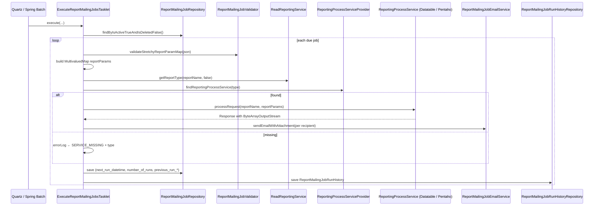

The Apache Fineract **report mailing job** is a recurring scheduled job that runs a stretchy/Pentaho report, packages the output as an email attachment, and mails it to a list of recipients. Jobs are persisted in `m_report_mailing_job`; each execution writes a row to `m_report_mailing_job_run_history`. A Spring Batch step `EXECUTE_REPORT_MAILING_JOBS` (`fineract-provider/.../campaigns/jobs/executereportmailingjobs/`) iterates eligible jobs, runs them through the `ReportingProcessServiceProvider`, and dispatches the resulting `ByteArrayOutputStream` via the SMTP-backed email service.

For the reporting plug-in surface this job sits on top of, see [Report provider](/report/report-provider). For Spring Batch wiring, see [Jobs overview](/jobs/overview).

## Spring Batch wiring

```java
@Configuration
public class ExecuteReportMailingJobsConfig {

    @Autowired private JobRepository jobRepository;
    @Autowired private PlatformTransactionManager transactionManager;
    @Autowired private ReportMailingJobRepository reportMailingJobRepository;
    @Autowired private ReportMailingJobValidator reportMailingJobValidator;
    @Autowired private ReadReportingService readReportingService;
    @Autowired private ReportingProcessServiceProvider reportingProcessServiceProvider;
    @Autowired private ReportMailingJobEmailService reportMailingJobEmailService;
    @Autowired private ReportMailingJobRunHistoryRepository reportMailingJobRunHistoryRepository;
    @Autowired private FineractProperties fineractProperties;

    @Bean
    protected Step executeReportMailingJobsStep() {
        return new StepBuilder(JobName.EXECUTE_REPORT_MAILING_JOBS.name(), jobRepository)
                .tasklet(executeReportMailingJobsTasklet(), transactionManager).build();
    }

    @Bean
    public Job executeReportMailingJobsJob() {
        return new JobBuilder(JobName.EXECUTE_REPORT_MAILING_JOBS.name(), jobRepository)
                .start(executeReportMailingJobsStep())
                .incrementer(new RunIdIncrementer()).build();
    }

    @Bean
    public ExecuteReportMailingJobsTasklet executeReportMailingJobsTasklet() {
        return new ExecuteReportMailingJobsTasklet(reportMailingJobRepository, reportMailingJobValidator,
                readReportingService, reportingProcessServiceProvider, reportMailingJobEmailService,
                reportMailingJobRunHistoryRepository, fineractProperties);
    }
}
```

The job name is `JobName.EXECUTE_REPORT_MAILING_JOBS` (defined in `fineract-core/.../infrastructure/jobs/service/JobName.java`). The Quartz trigger and `m_scheduled_job_*` rows are configured per tenant — see [Jobs overview](/jobs/overview) for the scheduling layer.

## Tasklet flow

```java
@Slf4j @RequiredArgsConstructor
public class ExecuteReportMailingJobsTasklet implements Tasklet {

    private final ReportMailingJobRepository reportMailingJobRepository;
    private final ReportMailingJobValidator reportMailingJobValidator;
    private final ReadReportingService readReportingService;
    private final ReportingProcessServiceProvider reportingProcessServiceProvider;
    private final ReportMailingJobEmailService reportMailingJobEmailService;
    private final ReportMailingJobRunHistoryRepository reportMailingJobRunHistoryRepository;
    private final FineractProperties fineractProperties;

    private static final String DATETIME_FORMAT = "yyyy-MM-dd HH:mm:ss";

    @Override
    public RepeatStatus execute(StepContribution contribution, ChunkContext chunkContext) throws Exception {
        final Collection<ReportMailingJob> reportMailingJobCollection =
            reportMailingJobRepository.findByIsActiveTrueAndIsDeletedFalse();

        for (ReportMailingJob reportMailingJob : reportMailingJobCollection) {
            final LocalDateTime localDateTimeOftenant = DateUtils.getLocalDateTimeOfTenant();
            final LocalDateTime nextRunDateTime = reportMailingJob.getNextRunDateTime();

            if (nextRunDateTime != null && DateUtils.isBefore(nextRunDateTime, localDateTimeOftenant)) {
                final ReportMailingJobEmailAttachmentFileFormat emailAttachmentFileFormat =
                    ReportMailingJobEmailAttachmentFileFormat.newInstance(reportMailingJob.getEmailAttachmentFileFormat());

                if (emailAttachmentFileFormat != null && emailAttachmentFileFormat.isValid()) {
                    final Report stretchyReport = reportMailingJob.getStretchyReport();
                    final String reportName = (stretchyReport != null) ? stretchyReport.getReportName() : null;
                    final StringBuilder errorLog = new StringBuilder();
                    final Map<String, String> validateStretchyReportParamMap =
                        reportMailingJobValidator.validateStretchyReportParamMap(reportMailingJob.getStretchyReportParamMap());

                    MultivaluedMap<String, String> reportParams = new MultivaluedStringMap();
                    if (validateStretchyReportParamMap != null) {
                        for (Map.Entry<String, String> e : validateStretchyReportParamMap.entrySet()) {
                            String key = e.getKey(), value = e.getValue();
                            if (StringUtils.containsIgnoreCase(key, "date")) {
                                ReportMailingJobStretchyReportParamDateOption dateOpt =
                                    ReportMailingJobStretchyReportParamDateOption.newInstance(value);
                                if (dateOpt.isValid()) {
                                    value = ReportMailingJobDateUtil.getDateAsString(dateOpt);
                                }
                            }
                            reportParams.add(key, value);
                        }
                    }
                    generateReportOutputStream(reportMailingJob, emailAttachmentFileFormat, reportParams, reportName, errorLog);
                    updateReportMailingJobAfterJobExecution(reportMailingJob, errorLog, localDateTimeOftenant);
                }
            }
        }
        return RepeatStatus.FINISHED;
    }
    // ...
}
```

The driver loop:

1. Loads every `ReportMailingJob` with `is_active=true AND is_deleted=false`.
2. For each job, compares `next_run_datetime` to the tenant's "now" (`DateUtils.getLocalDateTimeOfTenant()`). If `next_run_datetime` is in the past, the job is due.
3. The `emailAttachmentFileFormat` (`PDF`, `XLS`, `CSV`, `XLSX`) is decoded from the persisted integer code.
4. The persisted `stretchyReportParamMap` JSON-ish payload is parsed into a map of `{ paramName -> value }`. Any key whose name contains "date" is run through `ReportMailingJobStretchyReportParamDateOption` (a small DSL — `TODAY`, `YESTERDAY`, `FIRST_DAY_OF_LAST_MONTH`, etc.) so the same job can be scheduled to ship "last month's data" without modifying the row.
5. `generateReportOutputStream(...)` invokes the report.
6. `updateReportMailingJobAfterJobExecution(...)` advances `next_run_datetime`, increments `number_of_runs`, captures the error log, and writes a run-history row.

### `generateReportOutputStream`

```java
private void generateReportOutputStream(final ReportMailingJob reportMailingJob,
        final ReportMailingJobEmailAttachmentFileFormat emailAttachmentFileFormat,
        final MultivaluedMap<String, String> reportParams,
        final String reportName, final StringBuilder errorLog) {
    try {
        final String reportType = readReportingService.getReportType(reportName, false);
        final ReportingProcessService reportingProcessService =
            reportingProcessServiceProvider.findReportingProcessService(reportType);

        if (reportingProcessService != null) {
            final Response processReport = reportingProcessService.processRequest(reportName, reportParams);
            final Object responseObject = (processReport != null) ? processReport.getEntity() : null;

            if (responseObject != null && responseObject.getClass().equals(ByteArrayOutputStream.class)) {
                final ByteArrayOutputStream byteArrayOutputStream = (ByteArrayOutputStream) responseObject;
                final String fileLocation = fineractProperties.getContent().getFilesystem().getRootFolder() + File.separator + "";
                final String fileNameWithoutExtension = fileLocation + File.separator + reportName;

                if (!new File(fileLocation).isDirectory()) {
                    new File(fileLocation).mkdirs();
                }
                if (byteArrayOutputStream.size() == 0) {
                    errorLog.append("Report processing failed, empty output stream created");
                } else if ((errorLog != null && errorLog.length() == 0) && (byteArrayOutputStream.size() > 0)) {
                    final String fileName = fileNameWithoutExtension + "." + emailAttachmentFileFormat.getValue();
                    sendReportFileToEmailRecipients(reportMailingJob, fileName, byteArrayOutputStream, errorLog);
                }
            } else {
                errorLog.append("Response object entity is not equal to ByteArrayOutputStream ---------- ");
            }
        } else {
            errorLog.append(ReportingProcessServiceProvider.SERVICE_MISSING).append(reportType);
        }
    } catch (Exception e) {
        errorLog.append("The ReportMailingJobWritePlatformServiceImpl.generateReportOutputStream method threw an Exception: ")
                .append(e).append(" ---------- ");
    }
}
```

Key points:

- `reportType` comes from `m_report.report_type`. If no `ReportingProcessService` is registered for that type, the run is logged as a failure with `SERVICE_MISSING + reportType`.
- The tasklet **requires** the implementation to return its entity as a `ByteArrayOutputStream`. Other entity types are rejected with "Response object entity is not equal to ByteArrayOutputStream".
- The attachment is **written to disk** at `${fineract.content.filesystem.root-folder}/reportName.ext` before being attached to the email. The directory is created if missing.

### `sendReportFileToEmailRecipients`

```java
private void sendReportFileToEmailRecipients(final ReportMailingJob reportMailingJob, final String fileName,
        final ByteArrayOutputStream byteArrayOutputStream, final StringBuilder errorLog) {
    final Set<String> emailRecipients =
        this.reportMailingJobValidator.validateEmailRecipients(reportMailingJob.getEmailRecipients());
    try {
        final File file = new File(fileName);
        final FileOutputStream outputStream = new FileOutputStream(file);
        byteArrayOutputStream.writeTo(outputStream);
        for (String emailRecipient : emailRecipients) {
            final ReportMailingJobEmailData reportMailingJobEmailData = new ReportMailingJobEmailData()
                .setTo(emailRecipient)
                .setText(reportMailingJob.getEmailMessage())
                .setSubject(reportMailingJob.getEmailSubject())
                .setAttachment(file);
            reportMailingJobEmailService.sendEmailWithAttachment(reportMailingJobEmailData);
        }
        outputStream.close();
    } catch (IOException e) {
        errorLog.append("The ReportMailingJobWritePlatformServiceImpl.sendReportFileToEmailRecipients method threw an IOException "
                + "exception: ").append(e).append(" ---------- ");
    }
}
```

- `emailRecipients` is parsed by `ReportMailingJobValidator.validateEmailRecipients(...)` — the persisted format is a comma-separated list; the validator returns a `Set<String>`, deduplicating and trimming.
- One email per recipient is sent (no batched "To:" list). That mirrors `ReportMailingJobEmailData`'s single-`to` shape.

### Recurrence advancement

```java
private LocalDateTime createNextRecurringDateTime(final String recurrencePattern, final LocalDateTime startDateTime) {
    LocalDateTime nextRecurringDateTime = null;
    if (StringUtils.isNotBlank(recurrencePattern) && startDateTime != null) {
        final LocalDate nextDayLocalDate = startDateTime.plus(Duration.ofDays(1)).toLocalDate();
        final LocalDate nextRecurringLocalDate = CalendarUtils.getNextRecurringDate(recurrencePattern,
                startDateTime.toLocalDate(), nextDayLocalDate);
        final String nextDateTimeString = nextRecurringLocalDate + " " + startDateTime.getHour() + ":"
                + startDateTime.getMinute() + ":" + startDateTime.getSecond();
        final DateTimeFormatter dateTimeFormatter = DateTimeFormatter.ofPattern(DATETIME_FORMAT);
        nextRecurringDateTime = LocalDateTime.parse(nextDateTimeString, dateTimeFormatter);
    }
    return nextRecurringDateTime;
}
```

The recurrence pattern stored in `m_report_mailing_job.recurrence` is the same iCal RRULE-like format used elsewhere in Fineract (`CalendarUtils.getNextRecurringDate(...)`). When the pattern is blank, the job is **one-shot**: after a successful run, `is_active` is flipped to false and `next_run_datetime` is nulled out:

```java
if (StringUtils.isEmpty(recurrence)) {
    reportMailingJob.setActive(false);
    reportMailingJob.setNextRunDateTime(null);
} else if (nextRunDateTime != null) {
    final LocalDateTime nextRecurringDateTime = createNextRecurringDateTime(recurrence, nextRunDateTime);
    reportMailingJob.setNextRunDateTime(nextRecurringDateTime);
}
```

### Run history

```java
private void createReportMailingJobRunHistroryAfterJobExecution(final ReportMailingJob reportMailingJob,
        final StringBuilder errorLog, final LocalDateTime jobStartDateTime, final String jobRunStatus) {
    final LocalDateTime jobEndDateTime = DateUtils.getLocalDateTimeOfTenant();
    final String errorLogToString = (errorLog != null) ? errorLog.toString() : null;
    final ReportMailingJobRunHistory reportMailingJobRunHistory = ReportMailingJobRunHistory.newInstance(reportMailingJob,
            jobStartDateTime, jobEndDateTime, jobRunStatus, null, errorLogToString);
    reportMailingJobRunHistoryRepository.save(reportMailingJobRunHistory);
}
```

Every execution attempt — success or failure — yields one row in `m_report_mailing_job_run_history`.

## `ReportMailingJob` entity

`fineract-provider/src/main/java/org/apache/fineract/infrastructure/reportmailingjob/domain/ReportMailingJob.java`:

```java
@Entity
@Table(name = "m_report_mailing_job", uniqueConstraints = { @UniqueConstraint(columnNames = { "name" }, name = "unique_name") })
@Getter @Setter @NoArgsConstructor @Accessors(chain = true)
public class ReportMailingJob extends AbstractAuditableCustom {

    @Column(name = "name", nullable = false)                                  private String name;
    @Column(name = "description")                                              private String description;
    @Column(name = "start_datetime", nullable = false)                         private LocalDateTime startDateTime;
    @Column(name = "recurrence")                                               private String recurrence;
    @Column(name = "email_recipients", nullable = false)                       private String emailRecipients;
    @Column(name = "email_subject", nullable = false)                          private String emailSubject;
    @Column(name = "email_message", nullable = false)                          private String emailMessage;
    @Column(name = "email_attachment_file_format", nullable = false)           private String emailAttachmentFileFormat;
    @ManyToOne @JoinColumn(name = "stretchy_report_id", nullable = false)      private Report stretchyReport;
    @Column(name = "stretchy_report_param_map")                                private String stretchyReportParamMap;
    @Column(name = "previous_run_datetime")                                    private LocalDateTime previousRunDateTime;
    @Column(name = "next_run_datetime")                                        private LocalDateTime nextRunDateTime;
    @Column(name = "previous_run_status")                                      private String previousRunStatus;
    @Column(name = "previous_run_error_log")                                   private String previousRunErrorLog;
    @Column(name = "previous_run_error_message")                               private String previousRunErrorMessage;
    @Column(name = "number_of_runs", nullable = false)                         private Integer numberOfRuns;
    @Column(name = "is_active", nullable = false)                              private boolean isActive;
    @Column(name = "is_deleted", nullable = false)                             private boolean isDeleted;
    @ManyToOne(optional = false) @JoinColumn(name = "run_as_userid", nullable = false) private AppUser runAsUser;
    // ...
}
```

Notable details:

- `name` carries a unique constraint.
- `stretchyReport` (`@ManyToOne` to `Report`) is **required** — the job must point at a row in `m_report`. The selected report can be either SQL- or Pentaho-backed; the tasklet asks the provider to dispatch by type.
- `stretchyReportParamMap` is persisted as a JSON-ish string. `ReportMailingJobValidator.validateStretchyReportParamMap(...)` parses it on each run.
- `runAsUser` (`AppUser`) is the user identity used when the report SQL is executed — it determines tenant data visibility.
- `recurrence` is an iCal-style RRULE pattern; null/blank means one-shot.

### `ReportMailingJob.newInstance(JsonCommand, Report, AppUser)`

Parses every field from `JsonCommand` using `ReportMailingJobConstants.*PARAM_NAME` keys. Highlights:

```java
LocalDateTime startDateTime = LocalDateTime.now(DateUtils.getDateTimeZoneOfTenant());
if (jsonCommand.hasParameter(ReportMailingJobConstants.START_DATE_TIME_PARAM_NAME)) {
    final String startDateTimeString = jsonCommand.stringValueOfParameterNamed(ReportMailingJobConstants.START_DATE_TIME_PARAM_NAME);
    if (startDateTimeString != null) {
        final DateTimeFormatter dateTimeFormatter = DateTimeFormatter.ofPattern(jsonCommand.dateFormat())
                .withLocale(jsonCommand.extractLocale());
        startDateTime = LocalDateTime.parse(startDateTimeString, dateTimeFormatter);
    }
}
return new ReportMailingJob()
    .setName(...).setDescription(...).setStartDateTime(startDateTime).setRecurrence(...)
    .setEmailRecipients(...).setEmailSubject(...).setEmailMessage(...)
    .setEmailAttachmentFileFormat(emailAttachmentFileFormat.getValue())
    .setStretchyReport(stretchyReport).setStretchyReportParamMap(stretchyReportParamMap)
    .setNextRunDateTime(startDateTime).setActive(isActive).setDeleted(false).setRunAsUser(runAsUser);
```

`nextRunDateTime` is seeded to `startDateTime`, so the first execution honours the configured start.

`update(JsonCommand)` does the usual `isChangeInXxxParameterNamed`-driven partial update across all writable fields plus `startDateTime`, advancing `next_run_datetime` only when the inbound start date differs from the persisted one.

## `ReportMailingJobApiResource`

`@Path("/v1/reportmailingjobs")` (resource name from `ReportMailingJobConstants.REPORT_MAILING_JOB_RESOURCE_NAME = "reportmailingjobs"`).

| HTTP | Path | Method | Handler / permission | Purpose |
| --- | --- | --- | --- | --- |
| `POST` | `/v1/reportmailingjobs` | `createReportMailingJob` | `CREATE_REPORTMAILINGJOB` via `CreateReportMailingJobCommandHandler` | Create a new job. |
| `PUT` | `/v1/reportmailingjobs/{entityId}` | `updateReportMailingJob` | `UPDATE_REPORTMAILINGJOB` via `UpdateReportMailingJobCommandHandler` | Update a job; partial. |
| `DELETE` | `/v1/reportmailingjobs/{entityId}` | `deleteReportMailingJob` | `DELETE_REPORTMAILINGJOB` via `DeleteReportMailingJobCommandHandler` | Soft-delete (`is_deleted=true`). |
| `GET` | `/v1/reportmailingjobs` | `retrieveAllReportMailingJobs` | `READ_REPORTMAILINGJOB` | Paginated list. |
| `GET` | `/v1/reportmailingjobs/{entityId}` | `retrieveReportMailingJob` | `READ_REPORTMAILINGJOB` | Single row (optionally with template enums). |
| `GET` | `/v1/reportmailingjobs/template` | `retrieveReportMailingJobTemplate` | `READ_REPORTMAILINGJOB` | Dropdown enums for the maintenance UI. |

`REPORT_MAILING_JOB_ENTITY_NAME = "REPORTMAILINGJOB"` is the entity name used both by `CommandWrapperBuilder` and by `m_permission`.

Excerpt of the create method:

```java
public String createReportMailingJob(@Parameter(hidden = true) final String apiRequestBodyAsJson) {
    final CommandWrapper commandWrapper = new CommandWrapperBuilder()
            .createReportMailingJob(ReportMailingJobConstants.REPORT_MAILING_JOB_ENTITY_NAME).withJson(apiRequestBodyAsJson).build();
    final CommandProcessingResult commandProcessingResult = this.commandsSourceWritePlatformService.logCommandSource(commandWrapper);
    return this.reportMailingToApiJsonSerializer.serialize(commandProcessingResult);
}
```

Note that the resource uses raw `String apiRequestBodyAsJson` rather than a typed DTO — the validator (`ReportMailingJobValidator`) is the source of truth for which keys are accepted.

The accepted parameter names are listed in `ReportMailingJobConstants`:

```java
public static final String REPORT_MAILING_JOB_ENTITY_NAME = "REPORTMAILINGJOB";
public static final String REPORT_MAILING_JOB_RESOURCE_NAME = "reportmailingjobs";
public static final String REPORT_MAILING_JOB_RUN_HISTORY_RESOURCE_NAME = "reportmailingjobrunhistory";
public static final String NAME_PARAM_NAME = "name";
public static final String DESCRIPTION_PARAM_NAME = "description";
public static final String START_DATE_TIME_PARAM_NAME = "startDateTime";
public static final String RECURRENCE_PARAM_NAME = "recurrence";
public static final String EMAIL_RECIPIENTS_PARAM_NAME = "emailRecipients";
public static final String EMAIL_SUBJECT_PARAM_NAME = "emailSubject";
public static final String EMAIL_MESSAGE_PARAM_NAME = "emailMessage";
public static final String EMAIL_ATTACHMENT_FILE_FORMAT_ID_PARAM_NAME = "emailAttachmentFileFormatId";
public static final String STRETCHY_REPORT_ID_PARAM_NAME = "stretchyReportId";
public static final String STRETCHY_REPORT_PARAM_MAP_PARAM_NAME = "stretchyReportParamMap";
public static final String IS_ACTIVE_PARAM_NAME = "isActive";
```

### Sample create

```json
POST /fineract-provider/api/v1/reportmailingjobs
{
  "name":                       "Daily KYC report",
  "description":                "Email the KYC datatable to compliance",
  "startDateTime":              "2024-09-01 06:00:00",
  "dateFormat":                 "yyyy-MM-dd HH:mm:ss",
  "locale":                     "en",
  "recurrence":                 "FREQ=DAILY;INTERVAL=1",
  "emailRecipients":            "compliance@example.org,ops@example.org",
  "emailSubject":               "Daily KYC report",
  "emailMessage":               "See attached.",
  "emailAttachmentFileFormatId": 1,
  "stretchyReportId":           42,
  "stretchyReportParamMap":     "{\"R_officeId\":\"1\",\"R_startDate\":\"YESTERDAY\"}",
  "isActive":                   true
}
```

`emailAttachmentFileFormatId` maps via `ReportMailingJobEmailAttachmentFileFormat` (`xls`, `pdf`, `csv`, `xlsx`). `stretchyReportParamMap` is JSON whose keys map to the `R_` parameters consumed by `AbstractReportingProcessService.getReportParams(...)` — see [Report provider](/report/report-provider).

The DSL values (`TODAY`, `YESTERDAY`, `FIRST_DAY_OF_LAST_MONTH`, …) are decoded at run-time by `ReportMailingJobStretchyReportParamDateOption` so the same job row remains correct across runs.

## `ReportMailingJobRunHistoryApiResource`

`@Path("/v1/reportmailingjobrunhistory")`. Read-only:

```java
@GET
public String retrieveAllByReportMailingJobId(@Context final UriInfo uriInfo,
        @QueryParam("reportMailingJobId") final Long reportMailingJobId,
        @QueryParam("offset") final Integer offset,
        @QueryParam("limit") final Integer limit,
        @QueryParam("orderBy") final String orderBy,
        @QueryParam("sortOrder") final String sortOrder) {
    this.platformSecurityContext.authenticatedUser()
        .validateHasReadPermission(ReportMailingJobConstants.REPORT_MAILING_JOB_ENTITY_NAME);
    sqlValidator.validate(orderBy);
    sqlValidator.validate(sortOrder);
    final SearchParameters searchParameters = SearchParameters.builder()
        .limit(limit).offset(offset).orderBy(orderBy).sortOrder(sortOrder).build();
    final Page<ReportMailingJobRunHistoryData> reportMailingJobRunHistoryData =
        this.reportMailingJobRunHistoryReadPlatformService.retrieveRunHistoryByJobId(reportMailingJobId, searchParameters);
    // ... serialize and return
}
```

Returns a paged list of `ReportMailingJobRunHistoryData` `{ id, reportMailingJobId, jobRunStartDateTime, jobRunEndDateTime, jobRunStatus, errorMessage, errorLog }` for one job. The `orderBy` / `sortOrder` parameters pass through `SqlValidator` to fend off injection through column ordering. There is intentionally no DELETE — history is append-only.

## End-to-end flow



## Cross-references

- For the reporting plug-in surface (`ReportingProcessService`, `@ReportService`, provider): [Report provider](/report/report-provider).
- For the module-level overview: [Report overview](/report/overview).
- For Spring Batch infrastructure, the `JobName` enum and Quartz scheduling: [Jobs overview](/jobs/overview).
- For the matching interactive endpoints (`/v1/runreports/{name}`, datatable APIs): [Reports and data APIs](/api/reports-and-data-apis).
- For `JsonCommand`, `CommandWrapper`, `PortfolioCommandSourceWritePlatformService`, `SqlValidator`: [Portfolio shared domain](/core/portfolio-shared-domain).
