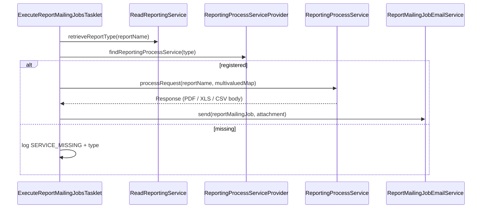

Apache Fineract abstracts report execution behind a single SPI: `ReportingProcessService`. Concrete adapters (SQL-backed stretchy reports, Pentaho `.prpt`) declare which `report_type` strings they handle via the `@ReportService` annotation; `ReportingProcessServiceProvider` indexes them on startup so callers can dispatch by name. This page documents the interface, the provider, the abstract base, and the one in-tree implementation (`DatatableReportingProcessService`), plus the contract a Pentaho adapter has to honour.

For the module-level map see [Report overview](/report/overview). For the mail-job consumer see [Report mailing job](/report/report-mailing-job).

## The SPI — `ReportingProcessService`

```java
package org.apache.fineract.infrastructure.report.service;

import jakarta.ws.rs.core.MultivaluedMap;
import jakarta.ws.rs.core.Response;
import java.util.List;
import java.util.Map;
import org.apache.fineract.infrastructure.dataqueries.data.ReportExportType;

public interface ReportingProcessService {
    Response processRequest(String reportName, MultivaluedMap<String, String> queryParams);
    List<ReportExportType> getAvailableExportTargets();
    Map<String, String> getReportParams(MultivaluedMap<String, String> queryParams);
}
```

Three methods:

- `processRequest(reportName, queryParams)` — actually run the report; returns a JAX-RS `Response` with the proper `Content-Type` / `Content-Disposition` headers and the report body as the entity.
- `getAvailableExportTargets()` — list of `ReportExportType` (a record carrying a code and a label) that this implementation can produce, used by the UI to render the export-format selector.
- `getReportParams(queryParams)` — extract and SQL-validate the `R_*` parameters out of the query string; default impl in the base class.

The `MultivaluedMap` shape comes from JAX-RS — it's what the JAX-RS resource handing the request gets when reading `@Context UriInfo`.`getQueryParameters()`. The mail-job tasklet builds an artificial `MultivaluedStringMap` to call the same method without going through HTTP.

## The annotation — `@ReportService`

```java
package org.apache.fineract.infrastructure.report.annotation;

import java.lang.annotation.*;

@Retention(RetentionPolicy.RUNTIME)
@Target(ElementType.TYPE)
@Documented
public @interface ReportService {
    /** @return the type of the report */
    String[] type();
}
```

A bean's class must carry this annotation **and** be a Spring bean — the provider scans `List<ReportingProcessService>` injected by Spring and pulls the annotation off `s.getClass()`. Missing annotation ⇒ `NullPointerException` at startup.

A single bean may claim multiple types. `DatatableReportingProcessService` claims three (`Table`, `Chart`, `SMS`) because all three are SQL-driven and produce tabular output; the runtime distinguishes them only when the UI renders the output.

## The registry — `ReportingProcessServiceProvider`

```java
@Component @Scope("singleton")
public class ReportingProcessServiceProvider {

    public static final String SERVICE_MISSING =
        "There is no ReportingProcessService registered in the ReportingProcessServiceProvider for this report type: ";

    private static final Logger LOGGER = LoggerFactory.getLogger(ReportingProcessServiceProvider.class);

    private final Map<String, ReportingProcessService> reportingProcessServices;

    @Autowired
    public ReportingProcessServiceProvider(List<ReportingProcessService> reportingProcessServices) {
        var mapBuilder = ImmutableMap.<String, ReportingProcessService>builder();
        for (ReportingProcessService s : reportingProcessServices) {
            String[] reportTypes = s.getClass().getAnnotation(ReportService.class).type();
            for (String type : reportTypes) {
                mapBuilder.put(type, s);
            }
            LOGGER.info("Registered report service '{}' for type/s '{}'", s, reportTypes);
        }
        this.reportingProcessServices = mapBuilder.build();
    }

    public ReportingProcessService findReportingProcessService(final String reportType) {
        return reportingProcessServices.getOrDefault(reportType, null);
    }

    public Collection<String> findAllReportingTypes() {
        return this.reportingProcessServices.keySet();
    }
}
```

Key properties:

- **`ImmutableMap.Builder`** — claims are baked at startup. Adding implementations post-startup is not supported (the registry has no mutation API).
- **No type-conflict diagnostics** — if two beans claim the same type, `ImmutableMap.Builder.put(...)` will throw `IllegalArgumentException` at construction. This makes type collisions a startup error.
- **`getOrDefault(..., null)`** — lookups never throw. Callers are responsible for handling the `null` case, typically by raising a `GeneralPlatformDomainRuleException` with `SERVICE_MISSING + reportType`.

`findAllReportingTypes()` is exposed so the platform can list which `report_type` values are actually executable in this deployment — useful for the validators that gate `m_report` create/update.

## The abstract base — `AbstractReportingProcessService`

```java
public abstract class AbstractReportingProcessService implements ReportingProcessService {

    private final SqlValidator sqlValidator;

    protected AbstractReportingProcessService(SqlValidator sqlValidator) {
        this.sqlValidator = sqlValidator;
    }

    @Override
    public Map<String, String> getReportParams(final MultivaluedMap<String, String> queryParams) {
        final Map<String, String> reportParams = new HashMap<>();
        for (Map.Entry<String, List<String>> entry : queryParams.entrySet()) {
            if (entry.getKey().startsWith("R_")) {
                String pKey   = "${" + entry.getKey().substring(2) + "}";
                String pValue = entry.getValue().get(0);
                sqlValidator.validate(pValue);
                reportParams.put(pKey, pValue);
            }
        }
        return reportParams;
    }
}
```

The class enforces **two conventions** that every SQL-based implementation gets for free:

1. **`R_` prefix convention** — any HTTP query parameter whose name starts with `R_` is forwarded into the SQL template. The `R_` prefix is stripped and the remaining name is wrapped in `${...}` so the stretchy-report engine substitutes it into the SQL body. Example: `?R_officeId=1&R_currencyCode=USD` becomes `{ "${officeId}": "1", "${currencyCode}": "USD" }`.
2. **SQL injection guard** — each value passes through `SqlValidator.validate(...)` (in `fineract-security`) before going anywhere near the SQL. The validator rejects characters that would let a value break out of a SQL literal (semicolons, quote sequences, etc.). The implementation in `fineract-security` raises `SQLInjectionException` on rejection.

Only one value is taken per parameter (`entry.getValue().get(0)`) — multi-valued query parameters are not supported here.

## In-tree implementation — `DatatableReportingProcessService`

Lives at `fineract-provider/src/main/java/org/apache/fineract/infrastructure/dataqueries/service/DatatableReportingProcessService.java`. Excerpt:

```java
@Service
@ReportService(type = { "Table", "Chart", "SMS" })
@Slf4j
public class DatatableReportingProcessService extends AbstractReportingProcessService {

    private final List<DatatableReportExportService> exportServices;

    public DatatableReportingProcessService(List<DatatableReportExportService> exportServices,
                                            SqlValidator sqlValidator) {
        super(sqlValidator);
        this.exportServices = exportServices;
    }

    @Override
    public Response processRequest(String reportName, MultivaluedMap<String, String> queryParams) {

        DatatableExportTargetParameter exportMode = DatatableExportTargetParameter.resolverExportTarget(queryParams);
        final String parameterTypeValue = ApiParameterHelper.parameterType(queryParams) ? "parameter" : "report";
        final Map<String, String> reportParams = getReportParams(queryParams);
        ResponseHolder response = findReportExportService(exportMode)
            .orElseThrow(() -> new GeneralPlatformDomainRuleException("error.msg.report.export.mode.unavailable",
                    "Export mode %s unavailable".formatted(exportMode.name())))
            .export(reportName, queryParams, reportParams, parameterTypeValue);

        Response.ResponseBuilder builder = Response.status(response.status().getStatusCode());
        if (StringUtils.isNotBlank(response.contentType()))
            builder = builder.type(response.contentType());
        if (StringUtils.isNotBlank(response.fileName()))
            builder = builder.header("Content-Disposition", "attachment; filename=" + response.fileName());
        if (response.entity() != null) builder = builder.entity(response.entity());
        if (response.headers() != null && !response.headers().isEmpty()) {
            builder = response.headers().stream()
                .collect(StreamUtil.foldLeft(builder, (b, h) -> b.header(h.getKey(), h.getValue())));
        }
        return builder.build();
    }

    @Override
    public List<ReportExportType> getAvailableExportTargets() {
        return Arrays.stream(DatatableExportTargetParameter.values())
            .filter(target -> findReportExportService(target).isPresent())
            .map(target -> new ReportExportType(target.name(), target.getValue()))
            .toList();
    }

    private Optional<DatatableReportExportService> findReportExportService(DatatableExportTargetParameter target) {
        return exportServices.stream().filter(service -> service.supports(target)).findFirst();
    }
}
```

How it picks an exporter:

- `DatatableExportTargetParameter.resolverExportTarget(queryParams)` reads either `&exportCSV=true`, `&exportPdf=true`, `&exportXLS=true` etc. to decide the target.
- The implementation iterates `List<DatatableReportExportService>` and picks the first one whose `supports(target)` returns true. Each exporter is itself a Spring bean (one per format).
- The actual report SQL is fetched inside `export(...)` from `m_report.report_sql` via the `Report` entity and `ReadReportingService`.

`ApiParameterHelper.parameterType(queryParams)` switches between "execute the report" mode and "return the report's parameter metadata" mode (the latter is used to populate the parameter prompt UI).

## Pentaho adapter contract

A Pentaho `.prpt` adapter (shipped outside this snapshot) should:

- Be a `@Service`-annotated Spring bean.
- Carry `@ReportService(type = "Pentaho")`.
- Extend `AbstractReportingProcessService` to inherit the `R_`-prefix convention and the SQL validation, or implement `ReportingProcessService` directly if its parameter model is materially different.
- Resolve `reportName` to a `.prpt` file on the classpath / filesystem.
- Honour the same `parameterType` query parameter so callers can ask for parameter metadata.

When no Pentaho bean is present, `ReportingProcessServiceProvider.findReportingProcessService("Pentaho")` returns `null` and `ReadReportingService` raises `GeneralPlatformDomainRuleException("error.msg.report.service.missing", SERVICE_MISSING + "Pentaho")`.

## End-to-end interactive call

```mermaid
sequenceDiagram
    participant C as HTTP client
    participant RR as RunReportsApiResource (/v1/runreports/{name})
    participant RS as ReadReportingService
    participant Prov as ReportingProcessServiceProvider
    participant Impl as ReportingProcessService\n(Datatable / Pentaho)
    participant DB as m_report + tenant data tables
    C->>RR: GET /v1/runreports/MyReport?R_officeId=1&exportCSV=true
    RR->>RS: retrieveReportType("MyReport")
    RS->>DB: SELECT report_type FROM m_report WHERE report_name=?
    DB-->>RS: "Table"
    RS->>Prov: findReportingProcessService("Table")
    Prov-->>RS: DatatableReportingProcessService
    RS->>Impl: processRequest("MyReport", queryParams)
    Impl->>Impl: getReportParams (R_ → ${...})
    Impl->>DB: SELECT … with substituted ${officeId}
    DB-->>Impl: ResultSet
    Impl-->>RS: Response (text/csv, attachment;…)
    RS-->>RR: Response
    RR-->>C: 200 + CSV body
```

## End-to-end batch call (mailing job)



See [Report mailing job](/report/report-mailing-job) for the tasklet code.

## SQL reports vs Pentaho — operational distinctions

| Concern | SQL ("Table", "Chart", "SMS") | Pentaho ("Pentaho") |
| --- | --- | --- |
| Where definitions live | `m_report.report_sql` + `m_report_parameter` join tables. | `.prpt` files on the filesystem. |
| Parameter contract | `R_xxx` query params → `${xxx}` placeholders in SQL. | Pentaho's own typed parameter model; bridge converts `R_xxx` to Pentaho input. |
| Multi-tenancy | Each tenant has its own connection; SQL runs against the tenant schema. | Same — the report definition lives outside the tenant DB but the data fetch is per-tenant. |
| Hot reload | Editing `m_report.report_sql` is live. | Editing `.prpt` may require a restart if the engine caches templates. |
| Output formats | Driven by `DatatableReportExportService` beans. | Driven by the Pentaho engine. |

## Cross-references

- For the module-level map: [Report overview](/report/overview).
- For the scheduled mail job that drives the provider in batch mode: [Report mailing job](/report/report-mailing-job).
- For the resource (`/v1/runreports/{name}`), the `m_report` schema, and the datatable API surface: [Reports and data APIs](/api/reports-and-data-apis).
- For `SqlValidator`, `MultivaluedMap`, JAX-RS `Response` plumbing and the shared `JsonCommand` / DTO utilities: [Portfolio shared domain](/core/portfolio-shared-domain).
- For the Spring Batch infrastructure consumed by the mailing job: [Jobs overview](/jobs/overview).
