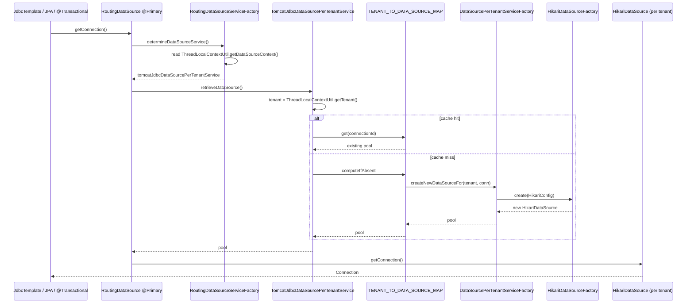

Fineract runs **two layers** of `javax.sql.DataSource`s:

1. A **master Hikari pool** to the *tenants registry* database
   (`fineract_tenants` by default). This pool stores the tenant catalogue
   itself.
2. A **dynamic, per‑tenant Hikari pool** for each `FineractPlatformTenant`
   discovered in that registry. These pools are created lazily on first
   use (and eagerly at `ContextRefreshedEvent`), cached in a
   `ConcurrentHashMap<Long, DataSource>`, and selected per request via
   `ThreadLocal` context propagated by the security filter chain.

The whole machinery is fronted by a single `@Primary` Spring bean —
`RoutingDataSource` — so all consumers (`JdbcTemplate`, JPA,
`@Transactional`, Spring Batch, every read service, every write service)
inject one DataSource and never need to know there is routing happening.

See [`/tenancy/overview`](/tenancy/overview) for the tenant resolution flow
that pushes the `ThreadLocalContextUtil` state, and
[`/database/overview`](/database/overview) for the Liquibase / migration
side.

## End‑to‑end flow

```mermaid
flowchart TD
    Req[HTTP request to /api/...] --> Auth[TenantAwareBasicAuthenticationFilter]
    Auth -->|reads Fineract-Platform-TenantId| Reg[(fineract_tenants<br/>via hikariTenantDataSource)]
    Reg --> TLC[ThreadLocalContextUtil.setTenant(...)]
    TLC --> Jersey[Jersey resource method]
    Jersey -->|@Autowired DataSource| RDS["RoutingDataSource<br/>(@Service value='dataSource' @Primary)"]
    RDS -->|determineDataSourceService| RDSF["RoutingDataSourceServiceFactory"]
    RDSF -->|CONTEXT_TENANTS?| Choice{Context?}
    Choice -->|tenants registry| TJDBC["tomcatJdbcDataSourcePerTenantService<br/>(default routing service)"]
    Choice -->|tenants schema lookup| DFT["dataSourceForTenants<br/>(direct master pool)"]
    TJDBC -->|cache miss| Factory[DataSourcePerTenantServiceFactory.createNewDataSourceFor]
    Factory --> HF[HikariDataSourceFactory.create]
    HF --> Pool[(Per-tenant HikariDataSource)]
    TJDBC -->|cache hit| Pool
    Pool --> SQL[Connection / SQL execution]
```

## Master pool: `HikariCpConfig`

```java HikariCpConfig.java
@Configuration
@ConditionalOnExpression("#{ systemEnvironment['fineract_tenants_driver'] == null }")
public class HikariCpConfig {

    @Bean(initMethod = "getConnection", destroyMethod = "close")
    @ConfigurationProperties(prefix = "spring.datasource.hikari")
    public HikariDataSource hikariTenantDataSource() {
        return new HikariDataSource();
    }
}
```

Source: `fineract-provider/src/main/java/org/apache/fineract/infrastructure/core/config/HikariCpConfig.java`.

The single `@Bean` is bound from `spring.datasource.hikari.*` keys in
`application.properties`:

| Key | Default | Note |
| --- | --- | --- |
| `driverClassName` | `org.mariadb.jdbc.Driver` | MariaDB; switch via `FINERACT_HIKARI_DRIVER_SOURCE_CLASS_NAME=org.postgresql.Driver` |
| `jdbcUrl` | `jdbc:mariadb://localhost:3306/fineract_tenants` | The **tenants registry** DB, not a tenant's own schema |
| `username` / `password` | `root` / `mysql` | Dev defaults |
| `minimumIdle` | `3` | `FINERACT_HIKARI_MINIMUM_IDLE` |
| `maximumPoolSize` | `10` | `FINERACT_HIKARI_MAXIMUM_POOL_SIZE` |
| `idleTimeout` | `60000` ms | `FINERACT_HIKARI_IDLE_TIMEOUT` |
| `connectionTimeout` | `20000` ms | `FINERACT_HIKARI_CONNECTION_TIMEOUT` |
| `connectionTestquery` | `SELECT 1` | `FINERACT_HIKARI_TEST_QUERY` |
| `autoCommit` | `true` | `FINERACT_HIKARI_AUTO_COMMIT` |
| `transactionIsolation` | `TRANSACTION_REPEATABLE_READ` | `FINERACT_HIKARI_TRANSACTION_ISOLATION` |
| `dataSourceProperties['cachePrepStmts']` | `true` | MySQL/MariaDB prep‑stmt cache |
| `dataSourceProperties['prepStmtCacheSize']` | `250` | |
| `dataSourceProperties['prepStmtCacheSqlLimit']` | `2048` | |
| `dataSourceProperties['useServerPrepStmts']` | `true` | |
| `dataSourceProperties['useLocalSessionState']` | `true` | |
| `dataSourceProperties['rewriteBatchedStatements']` | `true` | |

Two annotation choices matter:

- `initMethod = "getConnection"` forces the pool to acquire one connection
  immediately when Spring creates the bean — a misconfigured DB URL fails
  the boot rather than the first request.
- `destroyMethod = "close"` ensures the pool is drained on graceful
  shutdown (`server.shutdown=graceful`, drain `30s`).

The `@ConditionalOnExpression` activates `HikariCpConfig` only when the
legacy environment variable `fineract_tenants_driver` is **not** set. When
it IS set, `CompatibilityConfig` activates instead and builds the same
`HikariConfig` from the legacy env vars while logging a giant deprecation
warning.

## Routing layer: `RoutingDataSource`

```java RoutingDataSource.java
@Service(value = "dataSource")
@Primary
public class RoutingDataSource extends AbstractDataSource {

    @Autowired
    private RoutingDataSourceServiceFactory dataSourceServiceFactory;

    @Override
    public Connection getConnection() throws SQLException {
        return determineTargetDataSource().getConnection();
    }

    public DataSource determineTargetDataSource() {
        return this.dataSourceServiceFactory.determineDataSourceService().retrieveDataSource();
    }

    @Override
    public Connection getConnection(final String username, final String password) throws SQLException {
        return determineTargetDataSource().getConnection(username, password);
    }
}
```

Source: `fineract-core/src/main/java/org/apache/fineract/infrastructure/core/service/database/RoutingDataSource.java`.

The class extends Spring's `AbstractDataSource` — it has nothing of its own
to manage other than delegation. Spring's `@Primary` ensures any
`@Autowired DataSource ds` in the codebase resolves to `RoutingDataSource`.

Routing is per‑call: every `getConnection()` re‑resolves the target.

## Routing factory: `RoutingDataSourceServiceFactory`

```java RoutingDataSourceServiceFactory.java
@Component
public class RoutingDataSourceServiceFactory {

    @Autowired
    private ApplicationContext applicationContext;

    public RoutingDataSourceService determineDataSourceService() {
        String serviceName = "tomcatJdbcDataSourcePerTenantService";
        if (ThreadLocalContextUtil.CONTEXT_TENANTS.equalsIgnoreCase(ThreadLocalContextUtil.getDataSourceContext())) {
            serviceName = "dataSourceForTenants";
        }
        return this.applicationContext.getBean(serviceName, RoutingDataSourceService.class);
    }
}
```

Source: `fineract-core/.../infrastructure/core/service/database/RoutingDataSourceServiceFactory.java`.

The default routing service is **`tomcatJdbcDataSourcePerTenantService`**
(despite its name, the underlying pool is HikariCP — the name is a legacy
holdover from when Tomcat JDBC was used). If `ThreadLocalContextUtil`
reports the data source context as `CONTEXT_TENANTS`, the factory instead
returns `dataSourceForTenants`, which is a thin wrapper around the master
pool used for management operations on the tenants registry.

## Per‑tenant routing service: `TomcatJdbcDataSourcePerTenantService`

```java TomcatJdbcDataSourcePerTenantService.java
@Service
@RequiredArgsConstructor
public class TomcatJdbcDataSourcePerTenantService implements RoutingDataSourceService, ApplicationListener<ContextRefreshedEvent> {

    private static final Map<Long, DataSource> TENANT_TO_DATA_SOURCE_MAP = new ConcurrentHashMap<>();

    @Qualifier("hikariTenantDataSource")
    private final DataSource tenantDataSource;
    private final TenantDetailsService tenantDetailsService;
    private final DataSourcePerTenantServiceFactory dataSourcePerTenantServiceFactory;

    @Override
    public DataSource retrieveDataSource() {
        DataSource actualDataSource = this.tenantDataSource;
        final FineractPlatformTenant tenant = ThreadLocalContextUtil.getTenant();
        if (tenant != null) {
            final FineractPlatformTenantConnection tenantConnection = tenant.getConnection();
            Long tenantConnectionKey = tenantConnection.getConnectionId();
            actualDataSource = TENANT_TO_DATA_SOURCE_MAP.computeIfAbsent(tenantConnectionKey,
                    (key) -> dataSourcePerTenantServiceFactory.createNewDataSourceFor(tenant, tenantConnection));
        }
        ...
        return actualDataSource;
    }

    @Override
    public void onApplicationEvent(ContextRefreshedEvent event) {
        final List<FineractPlatformTenant> allTenants = tenantDetailsService.findAllTenants();
        for (final FineractPlatformTenant tenant : allTenants) {
            initializeDataSourceConnection(tenant);
        }
    }
    ...
}
```

Source: `fineract-core/.../infrastructure/core/service/database/TomcatJdbcDataSourcePerTenantService.java`.

| Aspect | Behaviour |
| --- | --- |
| Cache | `ConcurrentHashMap<Long, DataSource>` keyed by `tenantConnection.getConnectionId()`. Effectively per‑(tenant × connection) — read‑only and read‑write connections share the same cache. |
| Lazy creation | `computeIfAbsent(...)` ensures only one thread builds a given pool. |
| Eager warm‑up | On `ContextRefreshedEvent`, iterates `tenantDetailsService.findAllTenants()` and pre‑initialises every pool, validating connectivity. |
| Fallback | When no tenant is in `ThreadLocalContextUtil`, returns the master pool. |
| Money helper init | Triggers `moneyHelperInitializationService.initializeTenantRoundingMode(tenant)` once per tenant — there is a guarded `tenantMoneyInitializingSet` to make the call exactly‑once. |

## Pool factory: `DataSourcePerTenantServiceFactory`

```java DataSourcePerTenantServiceFactory.java
@Component
@RequiredArgsConstructor
public class DataSourcePerTenantServiceFactory {

    private final HikariConfig hikariConfig;
    private final FineractProperties fineractProperties;
    private final ApplicationContext context;
    @Qualifier("hikariTenantDataSource")
    private final DataSource tenantDataSource;
    private final HikariDataSourceFactory hikariDataSourceFactory;

    private final DatabasePasswordEncryptor databasePasswordEncryptor;
    private final Optional<MeterRegistry> meterRegistry;

    public DataSource createNewDataSourceFor(FineractPlatformTenant tenant, FineractPlatformTenantConnection tenantConnection) {
        if (!databasePasswordEncryptor.isMasterPasswordHashValid(tenantConnection.getMasterPasswordHash())) {
            throw new IllegalArgumentException("Invalid master password on tenant connection %d."
                    .formatted(tenantConnection.getConnectionId()));
        }
        String protocol = toProtocol(tenantDataSource);
        // Pick read-write OR read-only credentials based on fineract.mode.read-enabled / write-enabled
        String schemaServer = tenantConnection.getSchemaServer();
        String schemaPort   = tenantConnection.getSchemaServerPort();
        String schemaName   = tenantConnection.getSchemaName();
        String schemaUsername = tenantConnection.getSchemaUsername();
        String schemaPassword = tenantConnection.getSchemaPassword();
        String schemaConnectionParameters = tenantConnection.getSchemaConnectionParameters();
        if (fineractProperties.getMode().isReadOnlyMode()) {
            schemaServer = StringUtils.defaultIfBlank(tenantConnection.getReadOnlySchemaServer(), schemaServer);
            schemaPort   = StringUtils.defaultIfBlank(tenantConnection.getReadOnlySchemaServerPort(), schemaPort);
            schemaName   = StringUtils.defaultIfBlank(tenantConnection.getReadOnlySchemaName(), schemaName);
            schemaUsername = StringUtils.defaultIfBlank(tenantConnection.getReadOnlySchemaUsername(), schemaUsername);
            schemaPassword = StringUtils.defaultIfBlank(tenantConnection.getReadOnlySchemaPassword(), schemaPassword);
            schemaConnectionParameters = StringUtils.defaultIfBlank(
                    tenantConnection.getReadOnlySchemaConnectionParameters(), schemaConnectionParameters);
        }
        String jdbcUrl = toJdbcUrl(protocol, schemaServer, schemaPort, schemaName, schemaConnectionParameters);

        HikariConfig config = new HikariConfig();
        config.setReadOnly(fineractProperties.getMode().isReadOnlyMode());
        config.setJdbcUrl(jdbcUrl);
        config.setPoolName(schemaName + "_pool");
        config.setUsername(schemaUsername);
        config.setPassword(databasePasswordEncryptor.decrypt(schemaPassword));
        config.setMinimumIdle(getMinPoolSize(tenantConnection));
        config.setMaximumPoolSize(getMaxPoolSize(tenantConnection));
        config.setValidationTimeout(tenantConnection.getValidationInterval());
        config.setDriverClassName(hikariConfig.getDriverClassName());
        config.setConnectionTestQuery(hikariConfig.getConnectionTestQuery());
        config.setAutoCommit(hikariConfig.isAutoCommit());

        config.setRegisterMbeans(true);
        meterRegistry.ifPresent(registry -> config.setMetricsTrackerFactory(
                new TenantConnectionPoolMetricsTrackerFactory(tenant.getTenantIdentifier(), registry)));

        config.setDataSourceProperties(hikariConfig.getDataSourceProperties());

        return hikariDataSourceFactory.create(config);
    }

    private int getMaxPoolSize(FineractPlatformTenantConnection tenantConnection) {
        FineractProperties.FineractConfigProperties configOverride = fineractProperties.getTenant().getConfig();
        if (configOverride.isMaxPoolSizeSet()) {
            int maxPoolSize = configOverride.getMaxPoolSize();
            log.info("Overriding tenant datasource maximum pool size configuration to {}", maxPoolSize);
            return maxPoolSize;
        } else {
            return tenantConnection.getMaxActive();
        }
    }

    private int getMinPoolSize(FineractPlatformTenantConnection tenantConnection) {
        FineractProperties.FineractConfigProperties configOverride = fineractProperties.getTenant().getConfig();
        if (configOverride.isMinPoolSizeSet()) {
            int minPoolSize = configOverride.getMinPoolSize();
            log.info("Overriding tenant datasource minimum pool size configuration to {}", minPoolSize);
            return minPoolSize;
        } else {
            return tenantConnection.getInitialSize();
        }
    }
}
```

Source: `fineract-core/.../infrastructure/core/service/database/DataSourcePerTenantServiceFactory.java`.

| Aspect | Behaviour |
| --- | --- |
| Protocol | Inherited from the master pool via `FineractPlatformTenantConnection.toProtocol(tenantDataSource)`. |
| JDBC URL | Built from `tenantConnection` fields by `FineractPlatformTenantConnection.toJdbcUrl(...)`. |
| Read‑only fallback | When `fineract.mode.read-enabled=true` and `fineract.mode.write-enabled=false`, the read‑only host / port / credentials are used **if** populated. |
| Password decryption | `DatabasePasswordEncryptor.decrypt(schemaPassword)`. The master password from `fineract.tenant.master-password` (`fineract.database.defaultMasterPassword=fineract`) must hash to the same value stored alongside the tenant connection record. |
| Driver | Reused from master `HikariConfig#getDriverClassName()` — every tenant uses the same JDBC driver. |
| Connection test query | Reused from master. |
| Auto‑commit | Reused from master. |
| `setRegisterMbeans(true)` | Pool stats are exposed via JMX (HikariCP convention). |
| Micrometer tracker | When a `MeterRegistry` is present, `TenantConnectionPoolMetricsTrackerFactory` registers per‑tenant pool metrics. See [`/runtime/metrics-and-actuator`](/runtime/metrics-and-actuator). |
| DataSource properties | Inherited verbatim from master — every per‑tenant pool benefits from the same statement‑cache settings. |

## Pool‑size overrides

`fineract.tenant.config.min-pool-size` and
`fineract.tenant.config.max-pool-size` are *global* overrides that take
precedence over the per‑connection record stored in the tenants DB.

```properties application.properties
fineract.tenant.config.min-pool-size=${FINERACT_CONFIG_MIN_POOL_SIZE:-1}
fineract.tenant.config.max-pool-size=${FINERACT_CONFIG_MAX_POOL_SIZE:-1}
```

```java FineractProperties.java (excerpt)
public static class FineractConfigProperties {
    private int minPoolSize;
    private int maxPoolSize;
    public boolean isMinPoolSizeSet() { return minPoolSize != -1; }
    public boolean isMaxPoolSizeSet() { return maxPoolSize != -1; }
}
```

| Sentinel | Effect |
| --- | --- |
| `-1` (default) | Use the tenant connection's stored `initialSize` / `maxActive`. |
| Any non‑negative value | Override every tenant pool with this value at creation time. |

The override only applies to **newly created** pools — once cached, an
existing pool's sizing is not retroactively changed.

## Factory bean: `HikariDataSourceFactory`

```java HikariDataSourceFactory.java
@Component
public class HikariDataSourceFactory {

    public HikariDataSource create(HikariConfig config) {
        return new HikariDataSource(config);
    }
}
```

Source: `fineract-core/.../infrastructure/core/service/database/HikariDataSourceFactory.java`.

Trivial wrapper. Exists for one reason: unit tests can stub it out.

## Database driver detection: `DatabaseTypeResolver`

```java DatabaseTypeResolver.java
@Component
public class DatabaseTypeResolver implements InitializingBean {

    private static final Map<String, DatabaseType> DRIVER_MAPPING = Map.of(
            "org.mariadb.jdbc.Driver", DatabaseType.MYSQL,
            "com.mysql.jdbc.Driver", DatabaseType.MYSQL,
            "com.mysql.cj.jdbc.Driver", DatabaseType.MYSQL,
            "org.postgresql.Driver", DatabaseType.POSTGRESQL);

    @Override
    public void afterPropertiesSet() throws Exception {
        currentDatabaseType.set(determineDatabaseType(hikariConfig.getDriverClassName()));
    }

    public boolean isPostgreSQL() { return DatabaseType.POSTGRESQL == currentDatabaseType.get(); }
    public boolean isMySQL()      { return DatabaseType.MYSQL      == currentDatabaseType.get(); }
}
```

Source: `fineract-core/.../infrastructure/core/service/database/DatabaseTypeResolver.java`.

Detection happens **once** at startup based on the master pool's driver
class. All tenants must speak the same dialect.

The resolver feeds two downstream consumers:

1. **`DatabaseSelectingPersistenceUnitPostProcessor`** sets EclipseLink's
   `PersistenceUnitProperties.TARGET_DATABASE` based on the dialect.
2. **`DatabaseSpecificSQLGenerator`** (`@Component`) supplies dialect‑aware
   identifier escaping (`` `id` `` vs `"id"`), sequence increments and
   pagination clauses for hand‑written SQL.

## Dialect SQL: `DatabaseSpecificSQLGenerator`

```java DatabaseSpecificSQLGenerator.java (excerpt)
@Component
@RequiredArgsConstructor
public class DatabaseSpecificSQLGenerator {

    private final DatabaseTypeResolver databaseTypeResolver;
    private final RoutingDataSource dataSource;
    public static final String SELECT_CLAUSE = "SELECT %s";
    public static final int IN_CLAUSE_MAX_PARAMS = 10_000;

    public DatabaseType getDialect() {
        return databaseTypeResolver.databaseType();
    }

    public String escape(String arg) {
        if (databaseTypeResolver.isMySQL()) {
            return format("`%s`", arg);
        } else if (databaseTypeResolver.isPostgreSQL()) {
            return format("\"%s\"", arg);
        }
        return arg;
    }
    ...
}
```

Source: `fineract-core/.../infrastructure/core/service/database/DatabaseSpecificSQLGenerator.java`.

Used by every read service that builds SQL by hand (e.g.
`*ReadPlatformServiceImpl` classes that need to honour the
`fineract.query.in-clause-parameter-size-limit=1000` budget).

## `JdbcConfig` — Spring JDBC over the routing DS

```java JdbcConfig.java
@Configuration
public class JdbcConfig {

    @Bean public JdbcTemplate jdbcTemplate(RoutingDataSource dataSource) {
        return new JdbcTemplate(dataSource);
    }

    @Bean public NamedParameterJdbcTemplate namedParameterJdbcTemplate(RoutingDataSource dataSource) {
        return new NamedParameterJdbcTemplate(dataSource);
    }
}
```

Source: `fineract-provider/.../infrastructure/core/config/JdbcConfig.java`.

Both templates inject `RoutingDataSource` directly — Spring resolves it as
the unique `RoutingDataSource` candidate. Each individual `Connection`
acquired by the template routes per call.

## Tenant connection record

The shape stored in `fineract_tenants.tenant_server_connections` is
modelled by `FineractPlatformTenantConnection`. Key fields the routing
machinery reads:

| Field | Method | Purpose |
| --- | --- | --- |
| `connectionId` | `getConnectionId()` | Cache key in `TENANT_TO_DATA_SOURCE_MAP`. |
| `schemaServer`, `schemaServerPort` | `getSchemaServer()`, `getSchemaServerPort()` | Hostname / port for read‑write. |
| `schemaName` | `getSchemaName()` | Database name. |
| `schemaUsername`, `schemaPassword` | accessors | Credentials. Password is encrypted at rest. |
| `schemaConnectionParameters` | `getSchemaConnectionParameters()` | Appended to JDBC URL. |
| `readOnly*` siblings | `getReadOnly...()` | Used when `fineract.mode.read-enabled=true` AND `write-enabled=false`. |
| `initialSize`, `maxActive` | accessors | Default Hikari `minimumIdle` / `maximumPoolSize` for the per‑tenant pool. |
| `validationInterval` | `getValidationInterval()` | Hikari `validationTimeout`. |
| `masterPasswordHash` | `getMasterPasswordHash()` | Validated by `DatabasePasswordEncryptor.isMasterPasswordHashValid`. |

## Read‑only mode

`fineract.mode.read-enabled=true` + `fineract.mode.write-enabled=false`
turns the whole node into a read replica:

- `DataSourcePerTenantServiceFactory#createNewDataSourceFor` picks read‑only credentials whenever populated.
- `HikariConfig#setReadOnly(true)` is set on the per‑tenant pool, which forwards `Connection.setReadOnly(true)` to every checked‑out connection.
- `ExtendedJpaTransactionManager` observes `connection.isReadOnly()` and switches the EM to `FlushModeType.COMMIT` to avoid dirty‑check writes; see [`/runtime/transaction-management`](/runtime/transaction-management).
- All `/api/**` write endpoints are blocked at the security layer by `FineractInstanceModeApiFilter`; see [`/security/overview`](/security/overview).

## Metrics on the tenant pools

When Micrometer is on the classpath (always, via Spring Boot Actuator) and
`MeterRegistry` is in the context:

```java DataSourcePerTenantServiceFactory.java (excerpt)
meterRegistry.ifPresent(registry -> config.setMetricsTrackerFactory(
        new TenantConnectionPoolMetricsTrackerFactory(tenant.getTenantIdentifier(), registry)));
```

`TenantConnectionPoolMetricsTrackerFactory` (in
`fineract-core/.../service/database/metrics/`) tags each meter with
`tenant=<identifier>` so Prometheus / OTLP exports differentiate pools per
tenant. The Hikari standard meters (`hikaricp.connections`,
`hikaricp.connections.active`, `hikaricp.connections.usage`, etc.) get
emitted automatically by the pool itself once it has a tracker. See
[`/runtime/metrics-and-actuator`](/runtime/metrics-and-actuator).

## Migration touch‑points

Liquibase reuses these same data sources:

- The **tenants registry** changelog runs against the master pool, fed by
  `spring.liquibase.changeLog=classpath:/db/changelog/db.changelog-master.xml`.
- Each tenant's per‑tenant changelog runs against the dynamically‑built
  per‑tenant pool, orchestrated by `TenantDatabaseUpgradeService` (scanned
  by `FineractLiquibaseOnlyApplicationConfiguration` in headless mode).

`JPAConfig` declares `@DependsOn("tenantDatabaseUpgradeService")` so the
JPA `EntityManagerFactory` is not built until migrations finish.

See [`/database/overview`](/database/overview) for the full migration tour.

## Connection routing diagram



## Operational notes

| Concern | Where to look |
| --- | --- |
| Wrong driver → JPA pollutes startup logs with `target-database` errors | `DatabaseTypeResolver.afterPropertiesSet()` and `DatabaseSelectingPersistenceUnitPostProcessor` |
| Per‑tenant pool exhausted → `Connection is not available, request timed out after 20000ms` | Increase `fineract.tenant.config.max-pool-size` or the `maxActive` on the tenant record. |
| Per‑tenant pool too big → DB connection budget blown | Decrease the same. |
| Pool not picking up new tenant credentials | The pool is cached per `connectionId`; restart the node, or evict via the management endpoints in `fineract-investor`/`tenants` admin API. |
| Master pool warm‑up failure on boot | `initMethod = "getConnection"` makes this fail fast. Check `spring.datasource.hikari.jdbcUrl` and tenant network access. |
| Hikari MBeans not registering | Per‑tenant pools always call `setRegisterMbeans(true)`. Check JVM has JMX enabled. |

## Cross‑references

- [`/runtime/server-application`](/runtime/server-application) — loads `HikariCpConfig` and `JdbcConfig`.
- [`/runtime/spring-boot-configuration`](/runtime/spring-boot-configuration) — autoconfig exclusions that prevent Spring Boot from also creating a default DS.
- [`/runtime/transaction-management`](/runtime/transaction-management) — `ExtendedJpaTransactionManager` consumes `RoutingDataSource` indirectly via the `EntityManagerFactory`.
- [`/tenancy/overview`](/tenancy/overview) — how `ThreadLocalContextUtil.setTenant(...)` is populated by the security filter chain.
- [`/database/overview`](/database/overview) — Liquibase per‑tenant migrations and the tenants registry schema.
- [`/runtime/metrics-and-actuator`](/runtime/metrics-and-actuator) — Hikari pool metrics export.
- [`/security/overview`](/security/overview) — the auth filter that reads `Fineract-Platform-TenantId` and resolves the tenant before requests touch this layer.
- [`/core/overview`](/core/overview) — `fineract-core` packages that contribute `RoutingDataSource`, the tenant domain, and the database metrics adapters.
