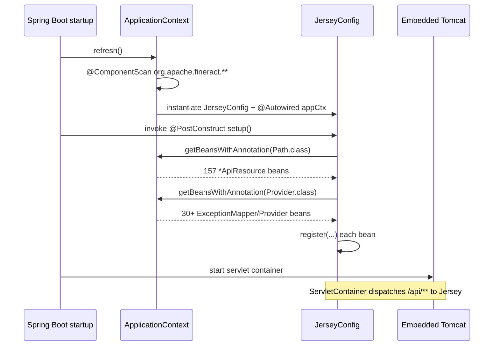
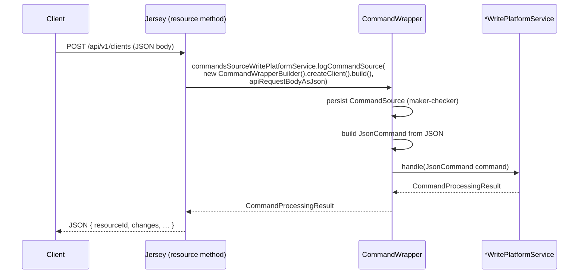

Fineract uses **Jersey 3 (Glassfish)** as its JAX‑RS implementation,
mounted at the context path `/fineract-provider/api/**`. JAX‑RS resources
are plain Spring `@Component`s annotated with `@Path` — they are NOT
managed by Jersey directly. `JerseyConfig` is a `ResourceConfig` that walks
the Spring `ApplicationContext` at startup and registers every bean
annotated with `@Path` or `@Provider`.

The result: any Spring bean — anywhere on the classpath, in any Fineract
Gradle module — annotated with `@Path("/v1/foo")` and `@Component` becomes
a live REST resource without any explicit registration.

## File and class

```java JerseyConfig.java
package org.apache.fineract.infrastructure.core.jersey;

@Configuration(proxyBeanMethods = false)
@ApplicationPath("/api")
public class JerseyConfig extends ResourceConfig {

    JerseyConfig() {
        register(org.glassfish.jersey.media.multipart.MultiPartFeature.class);
        register(new AbstractBinder() {
            @Override
            protected void configure() {
                bind(PageableParamProvider.class).to(ValueParamProvider.class).in(Singleton.class);
            }
        });
        register(org.glassfish.jersey.server.validation.ValidationFeature.class);
        property(ServerProperties.WADL_FEATURE_DISABLE, true);
    }

    @Autowired
    ApplicationContext appCtx;

    @PostConstruct
    public void setup() {
        appCtx.getBeansWithAnnotation(Path.class).values().forEach(this::register);
        appCtx.getBeansWithAnnotation(Provider.class).values().forEach(this::register);
    }
}
```

Source: `fineract-provider/src/main/java/org/apache/fineract/infrastructure/core/jersey/JerseyConfig.java`.

| Constructor registration | Purpose |
| --- | --- |
| `MultiPartFeature` | Enables `multipart/form-data` (file uploads in `documents`, `images`, bulk import). |
| `AbstractBinder` binding `PageableParamProvider` to `ValueParamProvider` (Singleton) | Injects Spring Data `Pageable` into resource methods annotated with `@Pagination`. |
| `ValidationFeature` | Bean Validation 3 — `@Valid` request bodies and `@NotNull` parameters. |
| `WADL_FEATURE_DISABLE = true` | Disables Jersey's WADL endpoint; Fineract exposes OpenAPI via springdoc instead. |

`@PostConstruct setup()` is the auto‑discovery step. After Spring has
finished refresh, it walks **two annotation classes**:

| Annotation | Beans registered | Examples |
| --- | --- | --- |
| `jakarta.ws.rs.Path` | All `*ApiResource` classes (157 of them) | `ClientsApiResource`, `LoansApiResource`, `SavingsApiResource`, ... |
| `jakarta.ws.rs.ext.Provider` | All exception mappers, body readers/writers | `DefaultExceptionMapper`, `BadCredentialsExceptionMapper`, `FineractExceptionMapper` implementations |

This means **Jersey never scans the classpath**. Spring scans the
classpath via `@ComponentScan(basePackages = "org.apache.fineract.**")` on
`FineractWebApplicationConfiguration`, and `JerseyConfig` then queries the
finished bean factory.



## URI routing and content negotiation

`@ApplicationPath("/api")` is combined with the server context path
(`/fineract-provider`) and the resource `@Path("/v1/clients")` to yield the
public URL:

```
https://localhost:8443/fineract-provider/api/v1/clients
                          \____________/  \_/\___________/
                          context path    JAX-RS  resource @Path
                                          @AppPath
```

Versioning is part of the resource's `@Path` literal, not a header. The
current public API version is `v1` everywhere.

### The `*ApiResource` convention

Every JAX‑RS resource in Fineract follows the same five‑decorator pattern:

```java ClientsApiResource.java (excerpt)
@Path("/v1/clients")
@Component
@Tag(name = "Client", description = "...")
@RequiredArgsConstructor
public class ClientsApiResource {

    private final PlatformSecurityContext context;
    private final ClientReadPlatformService clientReadPlatformService;
    private final ToApiJsonSerializer<ClientData> toApiJsonSerializer;
    private final ApiRequestParameterHelper apiRequestParameterHelper;
    private final PortfolioCommandSourceWritePlatformService commandsSourceWritePlatformService;

    @GET
    @Path("{clientId}")
    @Consumes({ MediaType.APPLICATION_JSON })
    @Produces({ MediaType.APPLICATION_JSON })
    @Operation(summary = "Retrieve a Client", operationId = "retrieveOneClient", ...)
    @ApiResponse(responseCode = "200", description = "OK", ...)
    public String retrieveOne(@PathParam("clientId") final Long clientId,
                              @Context final UriInfo uriInfo,
                              @DefaultValue("false") @QueryParam("staffInSelectedOfficeOnly") final boolean staffInSelectedOfficeOnly) {
        ...
    }
}
```

| Required element | Purpose |
| --- | --- |
| `@Path("/v1/<resource>")` | URI mount point. Always starts with `/v1/`. |
| `@Component` | Makes the class a Spring bean; `JerseyConfig` requires this. |
| Constructor injection via `@RequiredArgsConstructor` | Lombok‑generated constructor; matches Spring's recommended style. |
| `@Tag` (`io.swagger.v3.oas.annotations`) | Groups operations in the springdoc UI. |
| `@Consumes`/`@Produces` `MediaType.APPLICATION_JSON` | Content negotiation. Some endpoints also accept `multipart/form-data` for uploads. |
| `@Operation` + `@ApiResponse` (OpenAPI 3) | Surface in `/api-docs` and Swagger UI. |
| Return type `String` | Hand‑serialized JSON from `ToApiJsonSerializer` rather than POJOs Jersey would auto-marshal. |

The method always:
1. Authenticates and authorizes via `PlatformSecurityContext.authenticatedUser().validateHasReadPermission(...)` or `validateHasWritePermission`.
2. Calls a `*ReadPlatformService` (for reads) or constructs a `CommandWrapper` and invokes `PortfolioCommandSourceWritePlatformService.logCommandSource(...)` (for writes).
3. Returns a JSON `String` produced by `ToApiJsonSerializer<T>` honouring the `fields=` / `pretty=` query parameters resolved by `ApiRequestParameterHelper`.

There are 157 `*ApiResource` classes across the repo (run
`find . -name "*ApiResource.java" -not -path "*/test/*" | wc -l`).

### Content negotiation tables

Almost every endpoint uses:

```java
@Consumes({ MediaType.APPLICATION_JSON })
@Produces({ MediaType.APPLICATION_JSON })
```

Notable exceptions:

| Endpoint pattern | Consumes | Produces |
| --- | --- | --- |
| `/v1/clients/{id}/documents` (POST/PUT) | `multipart/form-data` | `application/json` |
| `/v1/clients/{id}/images` (POST/PUT) | `multipart/form-data` | `application/json` |
| `/v1/imports/*` (upload) | `multipart/form-data` | `application/json` |
| `/v1/datatables/.../report/.../export` | `application/json` | `application/octet-stream` |
| `/v1/runreports/{reportName}` | — | `application/csv` / `application/pdf` / `application/xml` based on `output-type` |

Compression is controlled at the Tomcat level
(`server.compression.enabled=true` from `application.properties` line 383).

## JSON serialization

Fineract does **not** rely on Jersey's default JSON binding. Resource
methods build their own JSON strings via `ToApiJsonSerializer<T>`, which
delegates to `GoogleGsonSerializerHelper.registerTypeAdapters(builder)`:

```java GoogleGsonSerializerHelper.java (excerpt)
public static void registerTypeAdapters(final GsonBuilder builder) {
    builder.registerTypeAdapter(java.util.Date.class, new DateAdapter());
    builder.registerTypeAdapter(LocalDate.class, new LocalDateAdapter());
    builder.registerTypeAdapter(LocalTime.class, new LocalTimeAdapter());
    builder.registerTypeAdapter(ZonedDateTime.class, new JodaDateTimeAdapter());
    builder.registerTypeAdapter(MonthDay.class, new JodaMonthDayAdapter());
    builder.registerTypeAdapter(LocalDateTime.class, new LocalDateTimeAdapter());
    builder.registerTypeAdapter(OffsetDateTime.class, new OffsetDateTimeAdapter());
    builder.registerTypeAdapter(ExternalId.class, new ExternalIdAdapter());
}
```

Source: `fineract-core/src/main/java/org/apache/fineract/infrastructure/core/serialization/GoogleGsonSerializerHelper.java`.

The adapters live in `fineract-core/.../infrastructure/core/api/`:

| Adapter | Java type | Output format | Why |
| --- | --- | --- | --- |
| `LocalDateAdapter` | `java.time.LocalDate` | Three‑element JSON array `[YYYY, MM, DD]` | Matches the historical Jackson format that all Fineract clients consume. |
| `LocalDateTimeAdapter` | `java.time.LocalDateTime` | Six‑element JSON array `[YYYY, MM, DD, HH, mm, ss]` | Same legacy compatibility constraint. |
| `LocalTimeAdapter` | `java.time.LocalTime` | Three‑element array `[HH, mm, ss]` | Same. |
| `JodaDateTimeAdapter` | `java.time.ZonedDateTime` | Epoch millis (long) | Historical Joda‑Time `DateTime` output preserved for backward compatibility. |
| `JodaMonthDayAdapter` | `java.time.MonthDay` | Two‑element array `[MM, DD]` | Loan repayment day specifications. |
| `OffsetDateTimeAdapter` | `java.time.OffsetDateTime` | ISO‑8601 offset string `2024-05-31T12:34:56.789+01:00` | Used by event payloads where round‑trip fidelity is mandatory. |
| `DateAdapter` | `java.util.Date` | Five‑element array (year/month/day/hour/min) | Legacy. |
| `ExternalIdAdapter` | `org.apache.fineract.infrastructure.core.domain.ExternalId` | Plain string or `null` | Unwraps the `ExternalId` value object to a primitive. |

```java LocalDateAdapter.java
public class LocalDateAdapter implements JsonSerializer<LocalDate> {
    @Override
    public JsonElement serialize(final LocalDate src, final Type typeOfSrc, final JsonSerializationContext context) {
        JsonArray array = null;
        if (src != null) {
            array = new JsonArray();
            array.add(new JsonPrimitive(src.get(ChronoField.YEAR_OF_ERA)));
            array.add(new JsonPrimitive(src.getMonthValue()));
            array.add(new JsonPrimitive(src.getDayOfMonth()));
        }
        return array;
    }
}
```

```java OffsetDateTimeAdapter.java
public class OffsetDateTimeAdapter implements JsonSerializer<OffsetDateTime> {
    @Override
    public JsonElement serialize(final OffsetDateTime dateTime, final Type typeOfSrc, final JsonSerializationContext context) {
        JsonElement object = null;
        if (dateTime != null) {
            object = new JsonPrimitive(DateTimeFormatter.ISO_OFFSET_DATE_TIME.format(dateTime));
        }
        return object;
    }
}
```

```java JodaDateTimeAdapter.java
public class JodaDateTimeAdapter implements JsonSerializer<ZonedDateTime> {
    @Override
    public JsonElement serialize(final ZonedDateTime src, final Type typeOfSrc, final JsonSerializationContext context) {
        JsonElement element = null;
        if (src != null) {
            element = new JsonPrimitive(src.toInstant().toEpochMilli());
        }
        return element;
    }
}
```

<Warning>
The legacy array‑based date format is a long‑standing wart. New endpoints
SHOULD emit ISO‑8601 strings via `OffsetDateTime`. Existing endpoints
remain on the array format to avoid breaking every Fineract client in the
field.
</Warning>

## Parameter and field filtering

The `ApiRequestParameterHelper` processes:

| Query parameter | Effect | Implementation |
| --- | --- | --- |
| `fields=field1,field2` | Inclusion strategy via Gson `ExclusionStrategy` | `ParameterListInclusionStrategy` |
| `pretty=true` | Pretty‑printed Gson output | `GsonBuilder#setPrettyPrinting` |
| `template=true` | Returns the form template payload alongside the entity | passed into resource service methods |

The two exclusion strategies live next to the adapters:

| Class | Role |
| --- | --- |
| `fineract-core/.../infrastructure/core/api/ParameterListInclusionStrategy.java` | Whitelists field names from `fields=` |
| `fineract-core/.../infrastructure/core/api/ParameterListExclusionStrategy.java` | Blacklists fields specified via response settings |

## `MutableUriInfo`

`fineract-core/src/main/java/org/apache/fineract/infrastructure/core/api/MutableUriInfo.java` is a `UriInfo` decorator
that lets filters or interceptors *append* synthetic query parameters
before the resource method reads them.

```java MutableUriInfo.java
@RequiredArgsConstructor
public class MutableUriInfo implements UriInfo {

    private final UriInfo delegate;

    @Getter
    private final MultivaluedMap<String, String> additionalQueryParameters = new MultivaluedHashMap<>();

    @Override
    public MultivaluedMap<String, String> getQueryParameters() {
        return fillAdditionalQueryParameters(delegate.getQueryParameters());
    }

    @Override
    public MultivaluedMap<String, String> getQueryParameters(boolean decode) {
        return fillAdditionalQueryParameters(delegate.getQueryParameters(decode));
    }

    private MultivaluedMap<String, String> fillAdditionalQueryParameters(MultivaluedMap<String, String> queryParameters) {
        MultivaluedMap<String, String> newQueryParameters = new MultivaluedHashMap<>(queryParameters);
        newQueryParameters.putAll(additionalQueryParameters);
        return newQueryParameters;
    }

    public void addAdditionalQueryParameter(String key, String value) {
        additionalQueryParameters.add(key, value);
    }

    public void putAdditionalQueryParameter(String key, List<String> values) {
        additionalQueryParameters.put(key, values);
    }
    ...
}
```

Typical use cases: instance‑mode filters add `command=<override>` to
write‑restricted nodes, the batch API replays parent request `fields=` into
sub‑request `UriInfo`s.

## `JsonCommand` — the write‑side wrapper

`fineract-core/src/main/java/org/apache/fineract/infrastructure/core/api/JsonCommand.java` is the immutable
JSON payload object passed to every `*WritePlatformService`. It is built
by the JAX‑RS layer (typically via `JsonCommand.fromExistingCommand(...)`
inside a `CommandHandler`) and exposes 60+ accessor methods such as
`stringValueOfParameterNamed("displayName")`, `localDateValueOfParameterNamed("activationDate")`,
`bigDecimalValueOfParameterNamed("amount")`, `isChangeInBigDecimalParameterNamed(...)`, and `mapOfParameters()`.

```java JsonCommand.java (signature excerpt)
public final class JsonCommand {

    public static JsonCommand from(final String jsonCommand, final JsonElement parsedCommand,
            final FromJsonHelper fromApiJsonHelper, final String entityName, final Long resourceId, ...) { ... }

    public static JsonCommand fromExistingCommand(final Long commandId, final String jsonCommand,
            final JsonElement parsedCommand, ...) { ... }

    public String stringValueOfParameterNamed(String parameterName) { ... }
    public LocalDate localDateValueOfParameterNamed(String parameterName) { ... }
    public BigDecimal bigDecimalValueOfParameterNamed(String parameterName) { ... }
    public boolean isChangeInBigDecimalParameterNamed(String parameterName, BigDecimal existingValue) { ... }
    public Map<String, Object> mapOfChanges() { ... }
    ...
}
```

The pipeline is:



The maker‑checker pipeline (`CommandWrapper` / `CommandSource`) lives in
`fineract-core/.../commands/` — see [`/core/overview`](/core/overview).

## Pagination — `PageableParamProvider`

`fineract-core/.../infrastructure/core/api/jersey/PageableParamProvider.java` implements Jersey's
`ValueParamProvider` SPI so resource methods can declare:

```java
@GET
public Page<ClientData> list(@Pagination(size = 50, maximumSize = 200) Pageable pageable) { ... }
```

and have Jersey synthesize a Spring Data `PageRequest`:

```java PageableParamProvider.java (excerpt)
@Override
public Function<ContainerRequest, ?> getValueProvider(Parameter parameter) {
    if (parameter.getRawType() == Pageable.class && parameter.isAnnotationPresent(Pagination.class)) {
        return new PageableFunction(parameter);
    }
    return null;
}

@Override
public PriorityType getPriority() {
    // Use HIGH otherwise it might not be used
    return Priority.HIGH;
}
```

The provider reads `page`, `size`, `sort=field,DIR` query params and
honours `@SortDefault` / `@SortDefault.SortDefaults` for default sort
orders. The binding is established in `JerseyConfig` via the constructor's
`AbstractBinder` block.

## `@Provider` beans — exception mappers and helpers

Every `*ExceptionMapper` that implements `jakarta.ws.rs.ext.ExceptionMapper`
and is annotated `@Component` is picked up automatically because Spring
also requires the JAX‑RS `@Provider`/`@Component` combination. The
exception mappers live in
`fineract-core/.../infrastructure/core/exceptionmapper/`:

| Mapper | Catches | HTTP status |
| --- | --- | --- |
| `DefaultExceptionMapper` | `RuntimeException` | 500 |
| `BadCredentialsExceptionMapper` | `BadCredentialsException` | 401 |
| `AccessDeniedExceptionMapper` | `AccessDeniedException` | 403 |
| `ConcurrencyFailureExceptionMapper` | `ConcurrencyFailureException` | 409 |
| `IdempotentCommandExceptionMapper` | `IdempotentCommandException` | 409 |
| `InvalidInstanceTypeMethodExceptionMapper` | `InvalidInstanceTypeMethodException` | 403 |
| `InvalidJsonExceptionMapper` | malformed request body | 400 |
| `BusinessStepExceptionMapper` (in `fineract-cob`) | COB step failures | 4xx/5xx |

```java DefaultExceptionMapper.java
@Component
@Scope("singleton")
@Slf4j
public class DefaultExceptionMapper implements FineractExceptionMapper, ExceptionMapper<RuntimeException> {

    @Override
    public int errorCode() {
        return 9999;
    }

    @Override
    public Response toResponse(RuntimeException exception) {
        log.warn("Exception occurred", ErrorHandler.findMostSpecificException(exception));
        return Response.status(SC_INTERNAL_SERVER_ERROR)
                .entity(Map.of("Exception", Objects.requireNonNullElse(exception.getMessage(), "No error message available")))
                .type(MediaType.APPLICATION_JSON).build();
    }
    ...
}
```

`FineractExceptionMapper` is the marker interface that gives every Fineract
mapper a numeric `errorCode()` — used for telemetry and uniform client
error reporting.

## Discovery contract summary

For a class to become a live REST resource it MUST satisfy ALL of:

1. **Class‑level `@Path("/v1/<name>")`** (the URI is `/api/v1/<name>` via `@ApplicationPath("/api")`).
2. **`@Component`** (or any Spring stereotype).
3. **Be visible to `@ComponentScan(basePackages = "org.apache.fineract.**")`.**

For an exception mapper / writer / reader the contract is `@Component` +
`jakarta.ws.rs.ext.Provider` + appropriate interface (`ExceptionMapper`,
`MessageBodyWriter`, `MessageBodyReader`, etc.).

## Cross‑references

- [`/runtime/server-application`](/runtime/server-application) — how `JerseyConfig` is loaded.
- [`/runtime/spring-boot-configuration`](/runtime/spring-boot-configuration) — `@ComponentScan` and bean overriding context.
- [`/security/overview`](/security/overview) — the `SecurityConfig` `/api/**` matcher gates every Jersey URL.
- [`/runtime/logging-and-correlation`](/runtime/logging-and-correlation) — correlation IDs propagate into resource handlers via MDC.
- [`/core/overview`](/core/overview) — where `JsonCommand`, `CommandWrapper`, and `ToApiJsonSerializer` live.
- [`/database/overview`](/database/overview) — how the tenant chosen in the auth filter eventually pulls the right `DataSource` for read services called by resources.
