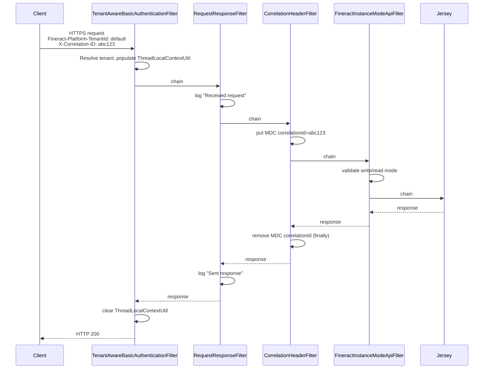

Fineract's log story has three concerns:

1. **Pattern** — the layout in `logback-spring.xml` is driven by the
   Spring Boot `CONSOLE_LOG_PATTERN` and includes per‑request `tenantId`,
   `correlationId`, `traceId`, and `spanId` slots.
2. **MDC propagation** — `MDCWrapper` and `CorrelationHeaderFilter`
   populate `org.slf4j.MDC` early in the filter chain and clear it on the
   way out, so each request's logs carry the correct context.
3. **Tenant context resolution** — `TenantIdentifierLoggingConverter` is a
   custom Logback `ClassicConverter` that resolves `%tenantId` against
   `ThreadLocalContextUtil.getTenant()` at log time.

JSON mode is opt‑in via `fineract.logging.json.enabled=true` and yields a
Logback `JsonLayout` suitable for shipping to ELK / Loki / Datadog.

See [`/runtime/server-application`](/runtime/server-application) for boot
order, [`/runtime/spring-boot-configuration`](/runtime/spring-boot-configuration)
for filter chain wiring, and [`/tenancy/overview`](/tenancy/overview) for
how the tenant lands in `ThreadLocalContextUtil`.

## `logback-spring.xml`

```xml logback-spring.xml
<?xml version="1.0" encoding="UTF-8"?>
<configuration>
    <springProperty name="jsonLoggingEnabled" source="fineract.logging.json.enabled" defaultValue="false"/>

    <include resource="org/springframework/boot/logging/logback/defaults.xml"/>

    <conversionRule conversionWord="tenantId"
                    converterClass="org.apache.fineract.infrastructure.core.logging.TenantIdentifierLoggingConverter" />

    <appender name="CONSOLE" target="System.out" class="ch.qos.logback.core.ConsoleAppender">
        <encoder>
            <pattern>${CONSOLE_LOG_PATTERN}</pattern>
        </encoder>
    </appender>

    <logger name="org.springframework.boot.web.embedded.tomcat.TomcatWebServer" level="info"/>
    <logger name="org.apache.fineract.ServerApplication" level="info"/>
    <logger name="org.apache.fineract" level="${FINERACT_LOGGING_LEVEL:-INFO}"/>
    <logger name="liquibase" level="warn"/>

    <if condition="${jsonLoggingEnabled} == true">
        <then>
            <appender name="JSON" class="ch.qos.logback.core.ConsoleAppender">
                <layout class="ch.qos.logback.contrib.json.classic.JsonLayout">
                    <jsonFormatter class="ch.qos.logback.contrib.jackson.JacksonJsonFormatter">
                        <prettyPrint>false</prettyPrint>
                    </jsonFormatter>
                    <appendLineSeparator>true</appendLineSeparator>
                </layout>
            </appender>

            <root level="info">
                <appender-ref ref="JSON"/>
            </root>
        </then>
        <else>
            <root level="info">
                <appender-ref ref="CONSOLE"/>
            </root>
        </else>
    </if>
</configuration>
```

Source: `fineract-provider/src/main/resources/logback-spring.xml`.

| Element | Effect |
| --- | --- |
| `<springProperty name="jsonLoggingEnabled" source="fineract.logging.json.enabled" defaultValue="false"/>` | Reads `fineract.logging.json.enabled` from Spring environment into a Logback variable. |
| `<include resource=".../boot/logging/logback/defaults.xml"/>` | Imports Spring Boot's level conversion rules and pattern variables (`CONSOLE_LOG_PATTERN`, `LOG_LEVEL_PATTERN`, `LOG_EXCEPTION_CONVERSION_WORD`). |
| `<conversionRule conversionWord="tenantId" converterClass="...TenantIdentifierLoggingConverter"/>` | Registers `%tenantId` as a custom pattern token. |
| `<logger name="org.apache.fineract" level="${FINERACT_LOGGING_LEVEL:-INFO}"/>` | Single root level knob for all Fineract code. |
| `<logger name="liquibase" level="warn"/>` | Silences Liquibase's chatty INFO output during migrations. |
| `<if condition="${jsonLoggingEnabled} == true">` | Switches between text console output and `JsonLayout`. The `<if>` element requires the `org.codehaus.janino:janino` library (declared explicitly in `fineract-provider/dependencies.gradle`). |

## Log pattern

```properties application.properties (line 328-329)
logging.pattern.console=${CONSOLE_LOG_PATTERN:%clr(%d{yyyy-MM-dd HH:mm:ss.SSS}){faint} %clr(${LOG_LEVEL_PATTERN:-%5p}) %clr(${PID:- }){magenta} %clr(%replace([%X{correlationId}]){'\\[\\]', ''}) [%15.15tenantId] %clr(---){faint} %clr([%15.15t]){faint} %clr(%-40.40logger{39}){cyan} %clr(:){faint} %m%n${LOG_EXCEPTION_CONVERSION_WORD:%wEx}}
logging.pattern.level=%5p [${spring.application.name:},%X{traceId:-},%X{spanId:-}]
```

Decoding the console pattern slot‑by‑slot:

| Slot | Token | Source |
| --- | --- | --- |
| Timestamp | `%d{yyyy-MM-dd HH:mm:ss.SSS}` | Logback |
| Level | `${LOG_LEVEL_PATTERN:-%5p}` | Spring Boot defaults, with right‑padding |
| PID | `${PID:- }` | Spring Boot startup writes the JVM PID |
| Correlation ID | `%replace([%X{correlationId}]){'\\[\\]', ''}` | MDC slot populated by `CorrelationHeaderFilter`. The `replace` removes the surrounding brackets when the MDC value is empty. |
| Tenant ID | `[%15.15tenantId]` | Custom converter; max 15 chars |
| Thread | `[%15.15t]` | Logback |
| Logger | `%-40.40logger{39}` | Logger name, abbreviated, max 40 chars |
| Message | `%m` | Logback |
| Newline | `%n` | Logback |
| Exception | `${LOG_EXCEPTION_CONVERSION_WORD:%wEx}` | Spring Boot |

The `logging.pattern.level` pattern feeds the embedded
`[$application,$traceId,$spanId]` trio used by Micrometer Tracing when
`management.tracing.enabled=true`. See
[`/runtime/metrics-and-actuator`](/runtime/metrics-and-actuator).

### JSON mode

`fineract.logging.json.enabled=true` switches the root appender to
`ch.qos.logback.contrib.json.classic.JsonLayout` wrapping
`ch.qos.logback.contrib.jackson.JacksonJsonFormatter`. Each line becomes a
single JSON object with default keys
(`timestamp`, `level`, `thread`, `logger`, `message`, `context`, `mdc`)
plus the entire MDC map. Stack traces are inlined.

## Custom converter: `TenantIdentifierLoggingConverter`

```java TenantIdentifierLoggingConverter.java
package org.apache.fineract.infrastructure.core.logging;

public class TenantIdentifierLoggingConverter extends ClassicConverter {

    @Override
    public String convert(ILoggingEvent event) {
        return ThreadLocalContextUtil.getTenant() != null
                ? ThreadLocalContextUtil.getTenant().getTenantIdentifier()
                : "no-tenant";
    }
}
```

Source: `fineract-core/src/main/java/org/apache/fineract/infrastructure/core/logging/TenantIdentifierLoggingConverter.java`.

| Aspect | Behaviour |
| --- | --- |
| `extends ClassicConverter` | Logback SPI for synchronous, in‑process pattern conversion. |
| Source of truth | `ThreadLocalContextUtil.getTenant()` — the same threadlocal that drives `RoutingDataSource`. |
| Fallback | `"no-tenant"` when no tenant has been set (boot, scheduler threads before the tenant context is established). |
| Registration | The `<conversionRule conversionWord="tenantId" .../>` element in `logback-spring.xml`. |

Because `%tenantId` resolves at log‑emit time (not at MDC‑put time), the
tenant context is always **fresh** even on async or executor threads
**provided** the executor propagates `ThreadLocalContextUtil`. The
`SecurityContextHolder.MODE_INHERITABLETHREADLOCAL` strategy installed by
`SpringConfig#overrideSecurityContextHolderStrategy` ensures inherited
thread local propagation for Spring Security; Fineract's own executors
(`fineractEventExecutor`, `fineractDefaultThreadPoolTaskExecutor`,
`loanCOBCatchUpThreadPoolTaskExecutor`) inherit MDC and tenant state via
the wrapping `DelegatingSecurityContextAsyncTaskExecutor` for events and
explicit `ThreadLocalContextUtil` copies elsewhere.

## `MDCWrapper`

```java MDCWrapper.java
package org.apache.fineract.infrastructure.core.service;

@Component
public class MDCWrapper {

    public void put(String key, String val) {
        MDC.put(key, val);
    }

    public void remove(String key) {
        MDC.remove(key);
    }

    public String get(String key) {
        return MDC.get(key);
    }
}
```

Source: `fineract-core/src/main/java/org/apache/fineract/infrastructure/core/service/MDCWrapper.java`.

A microscopic wrapper around `org.slf4j.MDC` — exists only so it can be
mocked in unit tests of filters that propagate context. There are no
business semantics inside `MDCWrapper` itself; the rules live in the
filters that call it.

## `CorrelationHeaderFilter`

```java CorrelationHeaderFilter.java
package org.apache.fineract.infrastructure.core.filters;

@RequiredArgsConstructor
@Slf4j
public class CorrelationHeaderFilter extends OncePerRequestFilter {

    public static final String CORRELATION_ID_KEY = "correlationId";

    private final FineractProperties fineractProperties;
    private final MDCWrapper mdcWrapper;

    @Override
    protected void doFilterInternal(HttpServletRequest request, HttpServletResponse response, FilterChain filterChain)
            throws IOException, ServletException {
        FineractProperties.FineractCorrelationProperties correlationProperties = fineractProperties.getCorrelation();
        if (correlationProperties.isEnabled()) {
            handleCorrelations(request, response, filterChain, correlationProperties);
        } else {
            filterChain.doFilter(request, response);
        }
    }

    private void handleCorrelations(HttpServletRequest request, HttpServletResponse response, FilterChain filterChain,
            FineractProperties.FineractCorrelationProperties correlationProperties) throws IOException, ServletException {
        try {
            String correlationHeaderName = correlationProperties.getHeaderName();
            String correlationId = request.getHeader(correlationHeaderName);
            if (StringUtils.isNotBlank(correlationId)) {
                String escapedCorrelationId = LogParameterEscapeUtil.escapeLogMDCParameter(correlationId);
                log.debug("Found correlationId in header : {}", escapedCorrelationId);
                mdcWrapper.put(CORRELATION_ID_KEY, escapedCorrelationId);
            }
            filterChain.doFilter(request, response);
        } finally {
            mdcWrapper.remove(CORRELATION_ID_KEY);
        }
    }

    @Override
    protected boolean isAsyncDispatch(final HttpServletRequest request) { return false; }

    @Override
    protected boolean shouldNotFilterErrorDispatch() { return false; }
}
```

Source: `fineract-core/src/main/java/org/apache/fineract/infrastructure/core/filters/CorrelationHeaderFilter.java`.

| Property | Default | Override |
| --- | --- | --- |
| `fineract.correlation.enabled` | `false` | `FINERACT_LOGGING_HTTP_CORRELATION_ID_ENABLED=true` |
| `fineract.correlation.header-name` | `X-Correlation-ID` | `FINERACT_LOGGING_HTTP_CORRELATION_ID_HEADER_NAME=My-Header` |

Both keys (lines 75‑76 of `application.properties`) are bound to
`FineractProperties#getCorrelation()`. When `enabled=false`, the filter is
still in the chain — `OncePerRequestFilter` does not skip itself — but it
short‑circuits to `filterChain.doFilter(...)` with no MDC mutation.

When `enabled=true`:

1. Read `X-Correlation-ID` (or whatever the configured header name is) off the request.
2. If non‑blank, sanitise via `LogParameterEscapeUtil.escapeLogMDCParameter(...)` (strips `\r` and `\n` so log injection is impossible) and place under `MDC` key `correlationId`.
3. Run the rest of the chain.
4. **Always** remove the key in `finally`, so the thread is clean for the next pooled request.

The filter is **the only** writer of the `correlationId` MDC slot, so the
log pattern's `%X{correlationId}` is well‑defined and bounded by request
scope.

### `LogParameterEscapeUtil`

```java LogParameterEscapeUtil.java
public final class LogParameterEscapeUtil {

    private LogParameterEscapeUtil() {}

    public static String escapeLogParameter(String logParameter) {
        return logParameter.replaceAll("[\n\r\t]", "_");
    }

    public static String escapeLogMDCParameter(String logParameter) {
        return logParameter.replaceAll("[\r\n]", "");
    }
}
```

Source: `fineract-core/src/main/java/org/apache/fineract/infrastructure/security/utils/LogParameterEscapeUtil.java`.

Used to prevent CRLF log injection attacks. `escapeLogMDCParameter` drops
the dangerous chars entirely (so they cannot pollute MDC values that the
pattern emits unchanged), while `escapeLogParameter` replaces them with
underscores (for free‑form log messages where structure is forgiving).

## Filter chain order

`SecurityConfig#filterChain` installs the correlation filter
**immediately after** the `RequestResponseFilter`:

```java SecurityConfig.java (excerpt)
.addFilterBefore(tenantAwareBasicAuthenticationFilter(), SecurityContextHolderFilter.class)
.addFilterAfter(requestResponseFilter(), ExceptionTranslationFilter.class)
.addFilterAfter(correlationHeaderFilter(), RequestResponseFilter.class)
.addFilterAfter(fineractInstanceModeApiFilter(), CorrelationHeaderFilter.class);
```



This is why every business log line inside a JAX‑RS handler carries a
**fresh** `tenantId` (resolved at log time from the threadlocal) and a
**bounded** `correlationId` (set by `CorrelationHeaderFilter` before the
handler runs, cleared after).

## `RequestResponseFilter`

```java RequestResponseFilter.java
@RequiredArgsConstructor
@Slf4j
public class RequestResponseFilter extends OncePerRequestFilter {

    @Override
    protected void doFilterInternal(HttpServletRequest request, HttpServletResponse response, FilterChain filterChain)
            throws ServletException, IOException {
        log.debug("Received request: [{}], [{}]", request.getMethod(), request.getRequestURI());
        filterChain.doFilter(request, response);
        log.debug("Sent response: [{}] for [{}], [{}]", response.getStatus(), request.getMethod(), request.getRequestURI());
    }
}
```

Source: `fineract-core/.../infrastructure/core/filters/RequestResponseFilter.java`.

The bookend `DEBUG` log lines surrounding every request. Default level is
`INFO`, so this filter is silent unless someone bumps
`FINERACT_LOGGING_LEVEL=DEBUG` or `logging.level.org.apache.fineract.infrastructure.core.filters=DEBUG`.

## Level overrides

| Knob | Default | Effect |
| --- | --- | --- |
| `FINERACT_LOGGING_LEVEL` env var | `INFO` | Sets the level for the whole `org.apache.fineract` logger tree via `${FINERACT_LOGGING_LEVEL:-INFO}` in `logback-spring.xml`. |
| `-Dlogging.level.root=DEBUG` JVM arg | `INFO` | Spring Boot honours this against the root logger. |
| `logging.level.<logger>=DEBUG` property | (none) | Per‑logger override, e.g. `logging.level.org.eclipse.persistence=FINEST` for EclipseLink SQL traces. |
| `<logger name="org.springframework.boot.web.embedded.tomcat.TomcatWebServer" level="info"/>` | `INFO` | Hard‑coded so the "started in N seconds" line is always visible. |
| `<logger name="org.apache.fineract.ServerApplication" level="info"/>` | `INFO` | Ensures `Fineract is running in web/Liquibase only mode` warns are visible. |
| `<logger name="liquibase" level="warn"/>` | `WARN` | Hides per‑changeset INFO chatter. |

## Statement logging

```properties application.properties
fineract.jpa.statementLoggingEnabled=${FINERACT_STATEMENT_LOGGING_ENABLED:false}
```

When `true`, EclipseLink emits raw SQL at log level `FINE` — combine with
`logging.level.org.eclipse.persistence.session=FINE` (`FINE` maps to
SLF4J `DEBUG`). This is **noisy** and should only be used during a
diagnosis session.

## Sampling subsystem

A separate, optional logger:

```properties application.properties (lines 211-214)
fineract.sampling.enabled=${FINERACT_SAMPLING_ENABLED:false}
fineract.sampling.samplingRate=${FINERACT_SAMPLING_RATE:1000}
fineract.sampling.sampledClasses=${FINERACT_SAMPLED_CLASSES:}
fineract.sampling.resetPeriodSec=${FINERACT_SAMPLING_RESET_PERIOD_IN_SEC:60}
```

Allows you to enable selective DEBUG logging for a list of classes at a
sampling rate (one in `samplingRate` invocations) without flooding the
log. The wiring lives under
`fineract-core/.../infrastructure/core/sampling/`. Off by default.

## Best practices in the codebase

1. **Always use `@Slf4j`** (Lombok) on the class — never `private static final Logger LOG = LoggerFactory.getLogger(...)` by hand. The platform standard is `lombok.extern.slf4j.Slf4j`.
2. **Always use placeholders, never string concatenation.** `log.info("Tenant {} processed {} loans", tenantId, count)` produces a single SLF4J event with two args.
3. **Sanitise user‑controlled values** going into the MDC or into log messages with `LogParameterEscapeUtil`. Already done for `correlationId`; do the same for any externally sourced ID you place in MDC.
4. **Never `MDC.put` without a matching remove in `finally`.** Pooled threads will leak the value into the next request otherwise.
5. **Wrap async executors in `DelegatingSecurityContextAsyncTaskExecutor`** (as `SpringConfig` does for the event multicaster) when you need the principal — but MDC requires its own propagation strategy (e.g. `MDCContext` from Kotlin coroutines, or `org.slf4j.MDC.getCopyOfContextMap()` manually copied into a `Runnable` decorator).

## Cross‑references

- [`/runtime/server-application`](/runtime/server-application) — boot order; the filters are registered by `SecurityConfig`.
- [`/runtime/spring-boot-configuration`](/runtime/spring-boot-configuration) — `SecurityConfig#filterChain` definition.
- [`/runtime/metrics-and-actuator`](/runtime/metrics-and-actuator) — `traceId`/`spanId` MDC slots populated by Micrometer Tracing.
- [`/runtime/jersey-jaxrs`](/runtime/jersey-jaxrs) — JAX‑RS handlers run after the filter chain, so MDC is already populated.
- [`/security/overview`](/security/overview) — full filter chain ordering and the tenant resolution that feeds `%tenantId`.
- [`/tenancy/overview`](/tenancy/overview) — `ThreadLocalContextUtil` and how the converter resolves the tenant identifier.
- [`/runtime/task-executors`](/runtime/task-executors) — why MDC propagation across `@Async` boundaries is the caller's responsibility.
- [`/core/overview`](/core/overview) — `infrastructure.core.logging` and `infrastructure.core.filters` packages.
