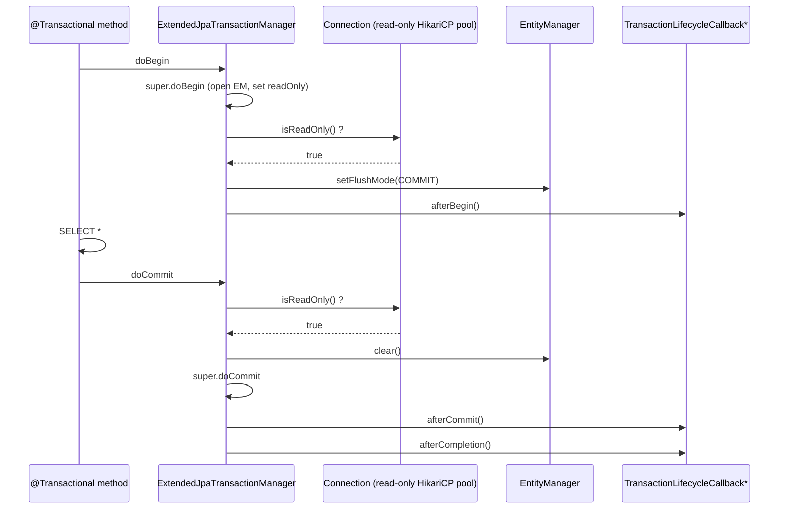
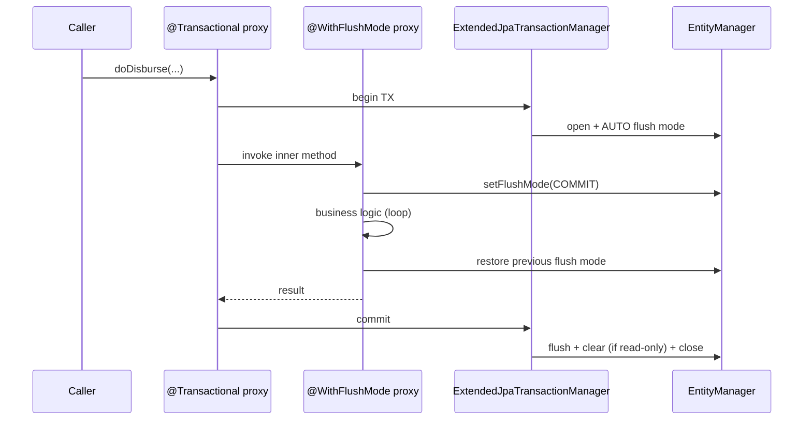

Fineract's transaction story has three moving parts:

1. **`ExtendedJpaTransactionManager`** — Fineract's `JpaTransactionManager`
   subclass that observes read‑only connections, switches the
   `EntityManager` to `FlushModeType.COMMIT`, and broadcasts
   `TransactionLifecycleCallback` events to registered listeners
   (the `TransactionBoundCacheManager` is the canonical consumer).
2. **`FlushModeHandler` + `@WithFlushMode` aspect** — a per‑method
   override that temporarily sets `FlushModeType.COMMIT` or
   `FlushModeType.AUTO` inside a transaction.
3. **EclipseLink static weaving** — bytecode enhancement applied at build
   time via `static-weaving.gradle` so EclipseLink can run with
   `PersistenceUnitProperties.WEAVING = "static"`.

All `@Transactional` annotations in the codebase resolve to a
`PlatformTransactionManager` bean named `transactionManager`, defined in
`ScheduledJobRunnerConfig`.

See [`/runtime/datasource-and-connection-pooling`](/runtime/datasource-and-connection-pooling) for the
DS layer beneath this, [`/runtime/spring-boot-configuration`](/runtime/spring-boot-configuration)
for how `@EnableTransactionManagement` activates, and
[`/database/overview`](/database/overview) for schema details.

## Where the `PlatformTransactionManager` is declared

```java ScheduledJobRunnerConfig.java
@Configuration(proxyBeanMethods = false)
@EnableBatchProcessing
public class ScheduledJobRunnerConfig {

    @Bean
    public PlatformTransactionManager transactionManager(
            ObjectProvider<TransactionManagerCustomizers> transactionManagerCustomizers,
            List<TransactionLifecycleCallback> callbacks) {
        ExtendedJpaTransactionManager transactionManager = new ExtendedJpaTransactionManager();
        transactionManager.setLifecycleCallbacks(callbacks);
        transactionManager.setValidateExistingTransaction(true);
        transactionManagerCustomizers.ifAvailable(customizers -> customizers.customize(transactionManager));
        return transactionManager;
    }
    ...
}
```

Source: `fineract-provider/src/main/java/org/apache/fineract/infrastructure/jobs/ScheduledJobRunnerConfig.java`.

Why is this in the **jobs** package? Because `@EnableBatchProcessing` in
Spring Batch *requires* a bean named `transactionManager` to be present
when the configuration class is parsed. Declaring the TM here satisfies
both the Spring Batch and the broader `@EnableTransactionManagement`
contracts simultaneously. The same bean services every `@Transactional`
in the rest of the platform.

| Configuration step | Why |
| --- | --- |
| `new ExtendedJpaTransactionManager()` | Fineract subclass — see next section. |
| `setLifecycleCallbacks(callbacks)` | Spring injects every `TransactionLifecycleCallback` bean (`TransactionBoundCacheManager` and any module‑local hooks). |
| `setValidateExistingTransaction(true)` | If nested `@Transactional` invocations have inconsistent attributes (e.g. `readOnly` flip), throws `IllegalTransactionStateException` rather than silently joining. |
| `customizers.customize(...)` | Spring Boot's `TransactionManagerCustomizers` hook — picks up `transaction.default-timeout` and similar config. |

## `ExtendedJpaTransactionManager`

```java ExtendedJpaTransactionManager.java
public class ExtendedJpaTransactionManager extends JpaTransactionManager {

    private final List<TransactionLifecycleCallback> lifecycleCallbacks = new CopyOnWriteArrayList<>();

    public ExtendedJpaTransactionManager() {
        setValidateExistingTransaction(true);
    }

    @Override
    protected void doBegin(Object transaction, TransactionDefinition definition) {
        super.doBegin(transaction, definition);
        if (isReadOnlyConnection() || isReadOnlyTx(transaction)) {
            EntityManager entityManager = getCurrentEntityManager();
            if (entityManager != null) {
                entityManager.setFlushMode(FlushModeType.COMMIT);
            }
        }
        invokeLifecycleCallbacks(TransactionLifecycleCallback::afterBegin);
    }

    @Override
    protected void doCommit(DefaultTransactionStatus status) {
        if (isReadOnlyConnection() || isReadOnlyTx(status.getTransaction())) {
            EntityManager entityManager = getCurrentEntityManager();
            if (entityManager != null) {
                entityManager.clear();
            }
        }
        super.doCommit(status);
        invokeLifecycleCallbacks(TransactionLifecycleCallback::afterCommit);
    }

    @Override
    protected void doCleanupAfterCompletion(Object transaction) {
        super.doCleanupAfterCompletion(transaction);
        invokeLifecycleCallbacks(TransactionLifecycleCallback::afterCompletion);
    }

    public boolean isReadOnlyConnection() {
        Connection connection = DataSourceUtils.getConnection(getDataSource());
        try {
            return connection.isReadOnly();
        } catch (SQLException e) {
            throw new IllegalStateException(e);
        } finally {
            DataSourceUtils.releaseConnection(connection, getDataSource());
        }
    }

    private boolean isReadOnlyTx(Object transaction) {
        JdbcTransactionObjectSupport txObject = (JdbcTransactionObjectSupport) transaction;
        return txObject.isReadOnly();
    }

    private EntityManager getCurrentEntityManager() {
        EntityManagerHolder holder = (EntityManagerHolder)
                TransactionSynchronizationManager.getResource(obtainEntityManagerFactory());
        if (holder != null) {
            return holder.getEntityManager();
        }
        return null;
    }

    public void setLifecycleCallbacks(List<TransactionLifecycleCallback> lifecycleCallbacks) {
        this.lifecycleCallbacks.addAll(lifecycleCallbacks);
    }
}
```

Source: `fineract-core/src/main/java/org/apache/fineract/infrastructure/core/persistence/ExtendedJpaTransactionManager.java`.

### Behavioural overrides

| Override | What it adds |
| --- | --- |
| `doBegin` | After `super.doBegin`, asks the JDBC connection if it is `readOnly()` (HikariCP propagates `setReadOnly(true)` from the per‑tenant pool when `fineract.mode.read-enabled=true` AND `write-enabled=false`). If so, sets the EM's `FlushModeType.COMMIT` to disable EclipseLink's dirty checking. Then notifies every `TransactionLifecycleCallback#afterBegin`. |
| `doCommit` | If the tx or connection is read‑only, `EntityManager#clear()` evicts every managed entity, preventing accidental update propagation. Then calls `super.doCommit` and fans out `afterCommit`. |
| `doCleanupAfterCompletion` | Always fires `afterCompletion` regardless of commit/rollback. |

`isReadOnlyConnection()` is also called explicitly from
`BatchApiServiceImpl` to fail batch sub‑requests fast when the node is in
read‑only mode:

```java BatchApiServiceImpl.java (excerpt)
if (transactionManager instanceof ExtendedJpaTransactionManager extendedJpaTransactionManager) {
    transactionTemplate.setReadOnly(extendedJpaTransactionManager.isReadOnlyConnection());
}
```

Source: `fineract-core/src/main/java/org/apache/fineract/batch/service/BatchApiServiceImpl.java`.

### Read‑only flow



## `TransactionLifecycleCallback`

```java TransactionLifecycleCallback.java
public interface TransactionLifecycleCallback {
    default void afterBegin()       {}
    default void afterCommit()      {}
    default void afterCompletion()  {}
}
```

Source: `fineract-core/.../infrastructure/core/persistence/TransactionLifecycleCallback.java`.

Three optional hooks. Any Spring bean that implements this interface is
auto‑wired into `ExtendedJpaTransactionManager` because
`ScheduledJobRunnerConfig#transactionManager(... List<TransactionLifecycleCallback> callbacks ...)`
injects the full list.

### Built‑in implementation: `TransactionBoundCacheManager`

```java TransactionBoundCacheManager.java
@RequiredArgsConstructor
public class TransactionBoundCacheManager implements TransactionLifecycleCallback, CacheManager {

    private final CacheManager delegate;

    @Override
    public void afterCompletion() { resetCaches(); }
    @Override
    public void afterBegin()      { resetCaches(); }

    private void resetCaches() {
        Collection<String> cacheNames = delegate.getCacheNames();
        cacheNames.forEach(c -> {
            Cache cache = delegate.getCache(c);
            if (cache != null) {
                cache.clear();
            }
        });
    }
    ...
}
```

Source: `fineract-provider/src/main/java/org/apache/fineract/infrastructure/core/config/cache/TransactionBoundCacheManager.java`.

Wraps the delegate Spring `CacheManager` (an EhCache‑backed
`JCacheCacheManager`) and flushes **every** cache on transaction begin and
completion. The intent: configuration cached during a read transaction
must not leak into a subsequent write transaction operating on the same
data. See [`/core/overview`](/core/overview) for the cache infrastructure.

## `FlushModeHandler` and `@WithFlushMode`

```java FlushModeHandler.java
@Component
public class FlushModeHandler {

    @PersistenceContext
    private EntityManager entityManager;

    public <T> T withFlushMode(FlushModeType flushMode, Supplier<T> supplier) {
        FlushModeType original = entityManager.getFlushMode();
        try {
            entityManager.setFlushMode(flushMode);
            return supplier.get();
        } finally {
            entityManager.setFlushMode(original);
        }
    }

    public void withFlushMode(FlushModeType flushMode, Runnable runnable) { ... }
}
```

Source: `fineract-core/.../infrastructure/core/persistence/FlushModeHandler.java`.

Used directly by `LoanBalanceService`
(`fineract-loan/.../portfolio/loanaccount/service/LoanBalanceService.java`)
and `InterestScheduleModelRepositoryWrapperImpl`
(`fineract-progressive-loan/.../portfolio/loanaccount/service/InterestScheduleModelRepositoryWrapperImpl.java`)
to wrap hot inner loops with `FlushModeType.COMMIT`, preventing
EclipseLink from issuing a flush per intermediate `find/persist`.

The companion AOP aspect provides a declarative version:

```java FlushModeAspect.java (excerpt)
@Aspect
@Component
@Order
@RequiredArgsConstructor
public class FlushModeAspect {

    private final FlushModeHandler flushModeHandler;

    @Around("@within(withFlushMode) || @annotation(withFlushMode)")
    public Object manageFlushMode(ProceedingJoinPoint joinPoint, WithFlushMode withFlushMode) {
        WithFlushMode effectiveAnnotation = getEffectiveAnnotation(joinPoint, withFlushMode);
        if (effectiveAnnotation == null) return jointPointProceed(joinPoint);

        FlushModeType flushMode = effectiveAnnotation.value();
        boolean hasActiveTransaction = TransactionSynchronizationManager.isActualTransactionActive();
        if (!hasActiveTransaction) {
            logger.warn("No active transaction found for @WithFlushMode on {}.{}", ...);
            return jointPointProceed(joinPoint);
        }
        return flushModeHandler.withFlushMode(flushMode, () -> jointPointProceed(joinPoint));
    }
}
```

Source: `fineract-core/.../infrastructure/core/aop/FlushModeAspect.java`.

| Behaviour | Detail |
| --- | --- |
| Annotation location | Method **or** class via `@within` or `@annotation`. |
| Ordering | `@Order` (default `Ordered.LOWEST_PRECEDENCE`) — runs *inside* `@Transactional` so the JPA context already exists. The Javadoc notes: "ordered to run after the @Transactional aspect to ensure proper transaction management". |
| No transaction | Logs a WARN and proceeds without changing flush mode. |
| Cleanup | `try/finally` in `FlushModeHandler` restores the previous flush mode even on exception. |

The annotation type itself is `org.apache.fineract.infrastructure.core.annotation.WithFlushMode`.

## `@Transactional` conventions

The platform follows two firm conventions:

### 1. `@Transactional` lives on write services, not on JAX‑RS resources

API resources (`*ApiResource`) never carry `@Transactional`. They build a
`CommandWrapper`, hand it to `PortfolioCommandSourceWritePlatformService`,
which dispatches to the appropriate `*CommandHandler`. The handler in
turn invokes the write service method, which carries the
`@Transactional`. This means:

- The maker‑checker / audit envelope (`CommandSource`) is persisted in
  the *same* transaction as the business effect.
- Idempotency replay happens entirely inside that transaction.
- Rollback discards both the command audit and the side effect.

### 2. `*WritePlatformServiceJpaRepositoryImpl` carries method‑level `@Transactional`

Example sample: `fineract-loan/.../portfolio/loanaccount/service/LoanWritePlatformService.java`:

```java LoanWritePlatformService.java (signature excerpt)
public interface LoanWritePlatformService {

    @Transactional
    CommandProcessingResult disburseLoan(Long loanId, JsonCommand command, Boolean isAccountTransfer);

    @Transactional
    Map<String, Object> bulkLoanDisbursal(JsonCommand command,
            CollectionSheetBulkDisbursalCommand bulkDisbursalCommand, Boolean isAccountTransfer);

    @Transactional
    LoanTransaction makeRepayment(LoanTransactionType repaymentTransactionType, Loan loan, ...);
    ...
}
```

| Convention | Detail |
| --- | --- |
| Class names end in `…WritePlatformServiceImpl` or `…WritePlatformServiceJpaRepositoryImpl` | Marker that the class mutates persistent state. |
| `@Transactional` on the **interface method** (or `@Transactional` on the class for read‑only `*ReadPlatformService`s when needed) | Drives the AOP proxy created by `@EnableTransactionManagement`. |
| Propagation | Default `Propagation.REQUIRED` — nested calls join the outer transaction. The batch API explicitly creates `Propagation.REQUIRES_NEW` per batch entry via the `TransactionTemplate` it owns. |
| Isolation | Default `Isolation.DEFAULT` (which is `TRANSACTION_REPEATABLE_READ` at the Hikari pool level). |
| Read‑only | Use `@Transactional(readOnly = true)` on read services to get the read‑only optimisation; `ExtendedJpaTransactionManager` honours this both via `isReadOnlyTx` and via the underlying connection's read‑only flag. |

The `BatchApiServiceImpl` is the only place the platform builds a
`TransactionTemplate` by hand at runtime, to give each batch sub‑request
its own transaction boundary.

## EclipseLink JPA via static weaving

`JPAConfig` selects EclipseLink and demands **static** weaving:

```java JPAConfig.java (excerpt)
@Override
protected Map<String, Object> getVendorProperties(DataSource dataSource) {
    Map<String, Object> vendorProperties = new HashMap<>();
    vendorProperties.put(PersistenceUnitProperties.WEAVING, "static");
    vendorProperties.put(PersistenceUnitProperties.PERSISTENCE_CONTEXT_CLOSE_ON_COMMIT, "true");
    vendorProperties.put(PersistenceUnitProperties.CACHE_SHARED_DEFAULT, "false");
    emFactoryCustomizers.forEach(c -> vendorProperties.putAll(c.additionalVendorProperties()));
    return vendorProperties;
}

@Override
protected AbstractJpaVendorAdapter createJpaVendorAdapter() {
    return new EclipseLinkJpaVendorAdapter();
}
```

| EclipseLink property | Setting | Consequence |
| --- | --- | --- |
| `WEAVING` | `static` | EclipseLink does **not** weave bytecode at runtime. The classes loaded must already be enhanced (see `static-weaving.gradle`). |
| `PERSISTENCE_CONTEXT_CLOSE_ON_COMMIT` | `true` | After `doCommit`, the persistence context is detached. Stops accidental dirty checks against post‑commit mutations. |
| `CACHE_SHARED_DEFAULT` | `false` | Disables EclipseLink's L2 shared cache. Fineract uses Spring `@Cacheable` over EhCache for explicit caching instead. |

### `static-weaving.gradle`

Applied to every Gradle subproject from `build.gradle`:

```groovy static-weaving.gradle (excerpt)
project.afterEvaluate {
    if (!project.plugins.hasPlugin('java')) { return }

    def persistenceXmlFile = file("src/main/resources/jpa/static-weaving/module/${project.name}/persistence.xml")
    def hasJpaEntities = persistenceXmlFile.exists()

    if (hasJpaEntities) {
        compileJava.doLast {
            def source = sourceSets.main.java.classesDirectory.get()
            File weavingRoot = new File(temporaryDir, "static-weaving")
            File metaInf = new File(weavingRoot, "META-INF")
            metaInf.mkdirs()
            copy { from persistenceXmlFile.toPath(); into metaInf.toPath() }
            javaexec {
                mainClass.set("org.eclipse.persistence.tools.weaving.jpa.StaticWeave")
                classpath = project.sourceSets.main.runtimeClasspath
                args = [ "-persistenceinfo", weavingRoot.absolutePath, source, source ]
            }
        }
    }
}
```

| Step | Detail |
| --- | --- |
| Trigger | Last step of `compileJava` in any module that ships a `persistence.xml` under `src/main/resources/jpa/static-weaving/module/<module-name>/`. |
| Tool | `org.eclipse.persistence.tools.weaving.jpa.StaticWeave`, supplied by `org.eclipse.persistence:org.eclipse.persistence.jpa`. |
| Input/output | The compiled classes directory `build/classes/java/main`. Output is written **back** into the same directory (`args = [..., source, source]`). |
| Result | Each JPA entity class gets EclipseLink change‑tracking, lazy‑loading proxies, fetch‑group and value‑holder hooks woven into its bytecode. |

`STATIC_WEAVING.md` at the repo root explains the per‑module contract.
If a module declares entities but lacks a `persistence.xml`, those entities
load **without** weaving, EclipseLink notices on first access, and prints
a `[EL Warning]: Class … is missing the woven` line in the log. Lazy
loading silently degrades to eager loading and dirty checking becomes a
full‑object reflection scan — a measurable perf regression.

### Why static, not dynamic?

EclipseLink dynamic weaving requires either a Java agent
(`-javaagent:org.eclipse.persistence.jpa.jar`) or
`LoadTimeWeaver` integration. Fineract favours static weaving because:

1. The Spring Boot fat JAR ships without a Java agent.
2. Static weaving means the JVM never has to install a class‑file
   transformer, which is incompatible with Lombok's annotation processor
   if both are active at runtime.
3. Native‑image / GraalVM compatibility is straightforward.

## How `@WithFlushMode` and `@Transactional` cooperate



If `@WithFlushMode` is applied **without** an enclosing `@Transactional`,
the aspect logs a WARN and is a no‑op. This is intentional — flush mode
without a managed `EntityManager` has nothing to operate on.

## Read‑only mode interactions

| Trigger | Effect on transaction layer |
| --- | --- |
| `fineract.mode.read-enabled=true` AND `write-enabled=false` | Per‑tenant Hikari pool is created with `config.setReadOnly(true)`. |
| Every checked‑out `Connection.isReadOnly()` returns `true` | `ExtendedJpaTransactionManager#doBegin` sets `EntityManager` flush mode to `COMMIT` so EclipseLink does not attempt INSERT/UPDATE on the read‑only connection (which would fail anyway). |
| `@Transactional(readOnly = true)` explicitly set | `JdbcTransactionObjectSupport#isReadOnly()` returns `true` so the same code path runs even on a writable connection. |
| Write API call | Blocked at the HTTP layer by `FineractInstanceModeApiFilter` before reaching the service tier. |

## Cross‑references

- [`/runtime/server-application`](/runtime/server-application) — `@EnableTransactionManagement` activated by `FineractWebApplicationConfiguration`.
- [`/runtime/spring-boot-configuration`](/runtime/spring-boot-configuration) — `ScheduledJobRunnerConfig` registration table.
- [`/runtime/datasource-and-connection-pooling`](/runtime/datasource-and-connection-pooling) — read‑only `Connection` machinery and the per‑tenant pool's `setReadOnly`.
- [`/runtime/jersey-jaxrs`](/runtime/jersey-jaxrs) — the `JsonCommand` -> `CommandWrapper` -> `*WritePlatformService` chain that funnels every write through `@Transactional`.
- [`/runtime/metrics-and-actuator`](/runtime/metrics-and-actuator) — tracing transaction boundaries via Micrometer `transaction` meters.
- [`/core/overview`](/core/overview) — `fineract-core` package map; `FlushModeHandler`, `ExtendedJpaTransactionManager`, `TransactionBoundCacheManager`, `@WithFlushMode` all live there or in `fineract-provider`'s cache config.
- [`/database/overview`](/database/overview) — Liquibase migrations run with autoCommit semantics and never participate in these transactions.
- [`/security/overview`](/security/overview) — `SecurityContextHolder.MODE_INHERITABLETHREADLOCAL` set in `SpringConfig` so the principal propagates to executor‑bound async work and the resulting nested transactions.
