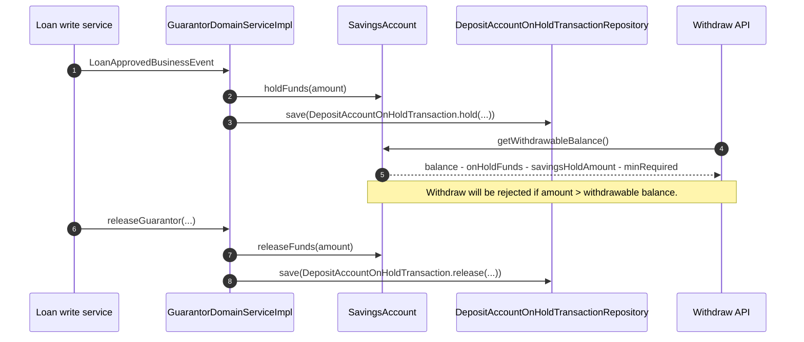

Apache Fineract uses the `DepositAccountOnHoldTransaction` entity to record amounts blocked on a savings or deposit account so they cannot be withdrawn while still backing some external obligation (today, almost exclusively a loan guarantee). The entity lives in `fineract-savings` under `org.apache.fineract.portfolio.savings.domain`; the writer that creates `HOLD` / `RELEASE` rows lives in `fineract-provider` (`GuarantorDomainServiceImpl` plus the loan transaction recovery path), and the read API surface is the small `DepositAccountOnHoldFundTransactionsApiResource`. The on-hold counter itself is `SavingsAccount.onHoldFunds`, which the `holdFunds` / `releaseFunds` mutators keep in sync with the running ledger of transactions.

This page is the engineering reference for the hold/release sub-model: how a `DepositAccountOnHoldTransaction` is created, how it flips `SavingsAccount.onHoldFunds`, the withdrawable-balance arithmetic, the read API exposed under `/savingsaccounts/{id}/onholdtransactions`, and the loan/guarantor paths that drive the writes. Pair it with [Savings Account Domain](/savings/savings-account-domain) for the parent aggregate and the Loan/Guarantor docs for the consumer side.

## Entity shape

```java
// fineract-savings/.../savings/domain/DepositAccountOnHoldTransaction.java
@Entity
@Table(name = "m_deposit_account_on_hold_transaction")
public class DepositAccountOnHoldTransaction
        extends AbstractAuditableWithUTCDateTimeCustom<Long> {

    @ManyToOne
    @JoinColumn(name = "savings_account_id")
    private SavingsAccount savingsAccount;

    @Column(name = "amount", scale = 6, precision = 19, nullable = false)
    private BigDecimal amount;

    @Column(name = "transaction_type_enum", nullable = false)
    private Integer transactionType;        // 1 = HOLD, 2 = RELEASE

    @Column(name = "transaction_date", nullable = false)
    private LocalDate transactionDate;

    @Column(name = "is_reversed", nullable = false)
    private boolean reversed;

    @Deprecated
    @Column(name = "created_date")
    private LocalDateTime createdDateToRemove; // legacy audit column
}
```

The two persisted enum values come from `DepositAccountOnHoldTransactionType` in `fineract-core`:

```java
public enum DepositAccountOnHoldTransactionType {
    INVALID(0, "deposutAccountOnHoldTransactionType.invalid"),
    HOLD(1,    "deposutAccountOnHoldTransactionType.hold"),
    RELEASE(2, "deposutAccountOnHoldTransactionType.release");

    public boolean isHold()    { return this.equals(HOLD); }
    public boolean isRelease() { return this.equals(RELEASE); }
}
```

The entity exposes only two factories — there is no public constructor:

```java
public static DepositAccountOnHoldTransaction hold(final SavingsAccount savingsAccount,
        final BigDecimal amount, final LocalDate transactionDate) {
    return new DepositAccountOnHoldTransaction(savingsAccount, amount,
            DepositAccountOnHoldTransactionType.HOLD, transactionDate, /* reversed */ false);
}

public static DepositAccountOnHoldTransaction release(final SavingsAccount savingsAccount,
        final BigDecimal amount, final LocalDate transactionDate) {
    return new DepositAccountOnHoldTransaction(savingsAccount, amount,
            DepositAccountOnHoldTransactionType.RELEASE, transactionDate, /* reversed */ false);
}
```

<Note>
A row in `m_deposit_account_on_hold_transaction` is a journal of changes, *not* the live balance. The aggregate balance is `SavingsAccount.onHoldFunds`, which is incremented on every `hold(...)` writer and decremented on every `release(...)` writer. Reversing a hold rolls the counter back automatically through `reverseTransaction()`.
</Note>

## The `onHoldFunds` counter on `SavingsAccount`

`SavingsAccount` carries a single `BigDecimal onHoldFunds` column that is updated through two tiny mutators:

```java
// fineract-savings/.../savings/domain/SavingsAccount.java
public BigDecimal getOnHoldFunds() {
    return this.onHoldFunds == null ? BigDecimal.ZERO : this.onHoldFunds;
}

public void holdFunds(BigDecimal onHoldFunds) {
    this.onHoldFunds = getOnHoldFunds().add(onHoldFunds);
}

public void releaseFunds(BigDecimal onHoldFunds) {
    this.onHoldFunds = getOnHoldFunds().subtract(onHoldFunds);
}
```

These mutators are called in two places:

1. Directly from the loan/guarantor write paths *before* a `DepositAccountOnHoldTransaction` row is persisted, so the running balance is always consistent with the journal.
2. From `DepositAccountOnHoldTransaction.reverseTransaction()` — see below.

### Withdrawable balance arithmetic

The on-hold balance participates in every "what can the customer take out" calculation:

```java
public BigDecimal getWithdrawableBalance() {
    return getAccountBalance()
        .subtract(minRequiredBalanceDerived(getCurrency()).getAmount())
        .subtract(this.getOnHoldFunds())
        .subtract(this.getSavingsHoldAmount());
}

public BigDecimal getWithdrawableBalanceWithoutMinimumBalance() {
    return getAccountBalance()
        .subtract(this.getOnHoldFunds())
        .subtract(this.getSavingsHoldAmount());
}
```

Two distinct concepts you should not confuse:

| Property                       | Source                                                | Driven by |
| ------------------------------ | ----------------------------------------------------- | --------- |
| `onHoldFunds`                  | `m_deposit_account_on_hold_transaction` journal       | Guarantor / loan workflows |
| `savingsHoldAmount`            | `SavingsAccountTransaction` of type `AMOUNT_HOLD` / `AMOUNT_RELEASE` | Admin block / lien commands on the savings transactions API |

Both reduce the withdrawable balance but they are tracked separately so each can be audited and reversed independently.

## Reversal — `reverseTransaction()`

When the parent business event (for example a guarantor de-link) is undone, the framework calls `reverseTransaction()` on the original hold/release row. The method flips `is_reversed = true` and immediately *reverses* the counter on the savings account, so the live `onHoldFunds` figure converges back to the pre-event value:

```java
public void reverseTransaction() {
    this.reversed = true;
    if (this.getTransactionType().isHold()) {
        this.savingsAccount.releaseFunds(this.amount);
    } else {
        this.savingsAccount.holdFunds(this.amount);
    }
}
```

So reversing a `HOLD(100)` immediately releases 100 from `onHoldFunds`; reversing a `RELEASE(100)` immediately re-holds 100. No new row is inserted — instead the original row is flagged so the audit trail shows both the original event and its reversal.

## Hold / release flow

```mermaid
flowchart LR
    LO([Loan with guarantor approved])
    LO --> Hold[GuarantorDomainServiceImpl.holdFunds]
    Hold --> CounterH[SavingsAccount.holdFunds(amount)]
    Hold --> JournalH[DepositAccountOnHoldTransaction.hold(...)]
    JournalH --> SaveH[(m_deposit_account_on_hold_transaction)]
    CounterH --> Withdraw{Validate getWithdrawableBalance >= 0}
    Withdraw -- ok --> Done([Continue]) 
    Withdraw -- < 0 --> Err[GUARANTOR_INSUFFICIENT_BALANCE]

    Release[GuarantorDomainServiceImpl.releaseGuarantor]
    Release --> CounterR[SavingsAccount.releaseFunds(amount)]
    Release --> JournalR[DepositAccountOnHoldTransaction.release(...)]
    JournalR --> SaveR[(m_deposit_account_on_hold_transaction)]

    Rev[reverseTransaction] --> Counter[Updates onHoldFunds via inverse mutator]
```

## Where holds are created — `GuarantorDomainServiceImpl`

The canonical writer of hold/release rows is `GuarantorDomainServiceImpl` in the loan module. It listens for `LoanApprovedBusinessEvent` and walks the loan's `GuarantorFundingDetails` to block the matching funds on each guarantor's savings account.

```java
// fineract-provider/.../loanaccount/guarantor/service/GuarantorDomainServiceImpl.java
@Override
public void holdGuarantorFunds(final Loan loan) {
    for (final Guarantor guarantor : existGuarantorList) {
        // … iterate every active GuarantorFundingDetails …
        SavingsAccount savingsAccount = guarantorFundingDetails.getLinkedSavingsAccount();
        savingsAccount.holdFunds(guarantorFundingDetails.getAmount());
        if (savingsAccount.getWithdrawableBalance().compareTo(BigDecimal.ZERO) < 0) {
            // Withdrawable balance would go negative — abort and emit error code
            baseDataValidator.reset().failWithCodeNoParameterAddedToErrorCode(
                GuarantorConstants.GUARANTOR_INSUFFICIENT_BALANCE_ERROR, savingsAccount.getId());
            throw new PlatformApiDataValidationException(…);
        }
        DepositAccountOnHoldTransaction onHoldTransaction =
            DepositAccountOnHoldTransaction.hold(savingsAccount,
                guarantorFundingDetails.getAmount(), transactionDate);
        // link the hold to the guarantor funding so we can reverse it later
        GuarantorFundingTransaction guarantorFundingTransaction =
            new GuarantorFundingTransaction(guarantorFundingDetails, null, onHoldTransaction);
        guarantorFundingDetails.addGuarantorFundingTransactions(guarantorFundingTransaction);
        this.depositAccountOnHoldTransactionRepository.saveAndFlush(onHoldTransaction);
    }
}
```

The reverse operation looks identical with `release(...)`:

```java
@Override
public void releaseGuarantor(final GuarantorFundingDetails guarantorFundingDetails,
                             final LocalDate transactionDate) {
    BigDecimal amoutForWithdraw = guarantorFundingDetails.getAmountRemaining();
    if (amoutForWithdraw.compareTo(BigDecimal.ZERO) > 0
            && guarantorFundingDetails.getStatus().isActive()) {
        SavingsAccount savingsAccount = guarantorFundingDetails.getLinkedSavingsAccount();
        savingsAccount.releaseFunds(amoutForWithdraw);
        DepositAccountOnHoldTransaction onHoldTransaction =
            DepositAccountOnHoldTransaction.release(savingsAccount, amoutForWithdraw,
                                                    transactionDate);
        GuarantorFundingTransaction guarantorFundingTransaction =
            new GuarantorFundingTransaction(guarantorFundingDetails, null, onHoldTransaction);
        guarantorFundingDetails.addGuarantorFundingTransactions(guarantorFundingTransaction);
        guarantorFundingDetails.releaseFunds(amoutForWithdraw);
        guarantorFundingDetails.withdrawFunds(amoutForWithdraw);
        guarantorFundingDetails.getLoanAccount().updateGuaranteeAmount(amoutForWithdraw.negate());
        this.depositAccountOnHoldTransactionRepository.saveAndFlush(onHoldTransaction);
        this.guarantorFundingRepository.saveAndFlush(guarantorFundingDetails);
    }
}
```

### Loan default — `transferFundsFromGuarantor`

If a loan goes into default, the guarantor module pulls funds from each guarantor's savings account: it first writes a `RELEASE` row (unblocking the amount) and then the loan write service creates a `WITHDRAWAL` `SavingsAccountTransaction` on the guarantor account paired with a deposit into the loan. The hold row stays on file so the audit trail clearly shows the lifecycle: `HOLD → RELEASE → WITHDRAWAL`.

```java
// excerpt
DepositAccountOnHoldTransaction onHoldTransaction =
    DepositAccountOnHoldTransaction.release(savingsAccount, guarantorAmount, transactionDate);
// … then deposit on loan account, withdraw from savings account …
```

### Listener wiring

The guarantor service subscribes to the loan business events at construction time:

```java
businessEventNotifierService.addPostBusinessEventListener(
    LoanApprovedBusinessEvent.class, new HoldFundsOnBusinessEvent());
```

so the hold flow is automatically triggered by an approved loan with at least one self-guarantee or external-guarantee linked savings account.

## Repository

There is only one Spring-Data repository for the entity:

```java
// fineract-provider/.../savings/domain/DepositAccountOnHoldTransactionRepository.java
public interface DepositAccountOnHoldTransactionRepository
        extends JpaRepository<DepositAccountOnHoldTransaction, Long>,
                JpaSpecificationExecutor<DepositAccountOnHoldTransaction> {

    List<DepositAccountOnHoldTransaction>
        findBySavingsAccountAndReversedFalseOrderByCreatedDateAsc(SavingsAccount account);
}
```

The `findBySavingsAccountAndReversedFalseOrderByCreatedDateAsc` query is what the savings interest calculation uses when running balances need to ignore previously released holds.

## Read API — `DepositAccountOnHoldFundTransactionsApiResource`

```java
// fineract-provider/.../savings/api/DepositAccountOnHoldFundTransactionsApiResource.java
@Path("/v1/savingsaccounts/{savingsId}/onholdtransactions")
@Component
@Tag(name = "Deposit Account On Hold Fund Transactions")
public class DepositAccountOnHoldFundTransactionsApiResource {

    @GET
    public String retrieveAll(@PathParam("savingsId") final Long savingsId,
            @QueryParam("guarantorFundingId") final Long guarantorFundingId,
            @QueryParam("offset") final Integer offset,
            @QueryParam("limit") final Integer limit,
            @QueryParam("orderBy") final String orderBy,
            @QueryParam("sortOrder") final String sortOrder,
            @Context final UriInfo uriInfo) {
        this.context.authenticatedUser()
            .validateHasReadPermission(SavingsApiConstants.SAVINGS_ACCOUNT_RESOURCE_NAME);

        sqlValidator.validate(orderBy);
        sqlValidator.validate(sortOrder);
        final SearchParameters searchParameters = SearchParameters.builder()
            .limit(limit).offset(offset)
            .orderBy(orderBy).sortOrder(sortOrder).build();

        final Page<DepositAccountOnHoldTransactionData> transfers =
            this.depositAccountOnHoldTransactionReadPlatformService
                .retriveAll(savingsId, guarantorFundingId, searchParameters);

        final ApiRequestJsonSerializationSettings settings =
            this.apiRequestParameterHelper.process(uriInfo.getQueryParameters());
        return this.toApiJsonSerializer.serialize(settings, transfers,
            SavingsApiSetConstants.SAVINGS_ACCOUNT_ON_HOLD_RESPONSE_DATA_PARAMETERS);
    }
}
```

There is exactly one verb:

| Method | Path | Operation | Permission |
| --- | --- | --- | --- |
| `GET` | `/v1/savingsaccounts/{savingsId}/onholdtransactions` | `retrieveAllDepositAccountOnHoldFundTransactions` | `READ_SAVINGSACCOUNT` |

Query parameters:

- `guarantorFundingId` — narrow the result to a specific guarantor link.
- `offset`, `limit`, `orderBy`, `sortOrder` — standard pagination/sort.

Response shape (`DepositAccountOnHoldTransactionData`):

```json
{ "pageItems": [
    { "transactionId": 12,
      "transactionType": { "id": 1, "code": "deposutAccountOnHoldTransactionType.hold",
                            "value": "Hold" },
      "transactionDate": [2024, 5, 1],
      "transactionAmount": 1500.00,
      "reversed": false,
      "savingsAccountNo": "SA-001",
      "savingsClientName": "Jane Doe",
      "savingId": 87,
      "loanId":  45, "loanAccountNo": "LN-009",
      "loanClientName": "Jane Doe"
    } ],
  "totalFilteredRecords": 1 }
```

### SQL behind the response

The mapper joins savings + guarantor + loan to enrich the payload:

```sql
select tr.id as transactionId, tr.transaction_type_enum as transactionType,
       tr.transaction_date as transactionDate, tr.amount as transactionAmount,
       tr.is_reversed as reversed, sa.account_no as savingsAccNum,
       COALESCE(sc.display_name, sg.display_name) as savingsClientName,
       ml.id as loanid, sa.id as savingid,
       ml.account_no as loanAccountNum,
       COALESCE(lc.display_name, lg.display_name) as loanClientName
from m_savings_account sa
join m_deposit_account_on_hold_transaction tr   on sa.id = tr.savings_account_id
left join m_client                          sc  on sc.id = sa.client_id
left join m_group                           sg  on sg.id = sa.group_id
left join m_guarantor_transaction           gt  on gt.deposit_on_hold_transaction_id = tr.id
left join m_guarantor_funding_details      mgfd on mgfd.id = gt.guarantor_fund_detail_id
left join m_portfolio_account_associations pa   on pa.id = mgfd.account_associations_id
left join m_loan                            ml  on ml.id = pa.loan_account_id
left join m_client                          lc  on lc.id = ml.client_id
left join m_group                           lg  on lg.id = ml.group_id
where tr.savings_account_id = ?
  -- optional: and gt.guarantor_fund_detail_id = ?
```

## How the on-hold balance interacts with the rest of the system



The interest calculation also consults the hold journal: when computing the daily running balance used by `SavingsHelper.calculateInterestForAllPostingPeriods`, the algorithm subtracts active (non-reversed) holds so interest is not paid on encumbered funds for products that flag this behaviour.

## Validation surface

The most common error codes you will see in this sub-model:

- `error.msg.guarantor.savings.account.insufficient.balance` — a `holdFunds(...)` attempt would push withdrawable balance negative.
- `error.msg.savingsaccount.transaction.insufficient.account.balance` — a customer-initiated withdrawal exceeds `withdrawableBalance` because of an active hold.
- `error.msg.deposit.account.onhold.transaction.cannot.reverse` — an attempt to reverse a hold whose linked guarantor funding has already been released.

## Cross references

<CardGroup cols={2}>
  <Card title="Savings account domain" icon="map" href="/savings/savings-account-domain">
    The parent `SavingsAccount` aggregate, including `onHoldFunds`, `savingsHoldAmount` and the withdrawable balance helpers.
  </Card>
  <Card title="Savings transactions" icon="arrow-right-arrow-left" href="/savings/savings-transactions">
    The `SavingsAccountTransaction` subtypes (`AMOUNT_HOLD`, `AMOUNT_RELEASE`) which represent admin-side blocks distinct from guarantor holds.
  </Card>
  <Card title="Fixed deposit" icon="vault" href="/savings/fixed-deposit">
    FDs can also back guarantees — the same hold/release mechanism applies because they share the `m_savings_account` table.
  </Card>
  <Card title="Savings accounts API" icon="code" href="/api/savings-accounts">
    Public reference for the parent savings account REST contract.
  </Card>
  <Card title="Accounting overview" icon="book" href="/accounting/overview">
    Hold rows do not post journal entries themselves; the linked loan postings do.
  </Card>
  <Card title="Savings COB business steps" icon="calendar" href="/cob/savings-cob-business-steps">
    Daily steps that consult `onHoldFunds` when running dormancy and overdraft checks.
  </Card>
</CardGroup>
