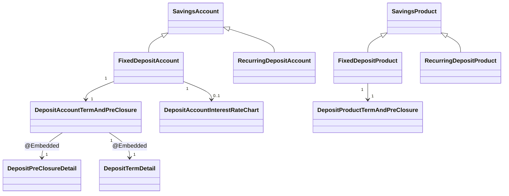
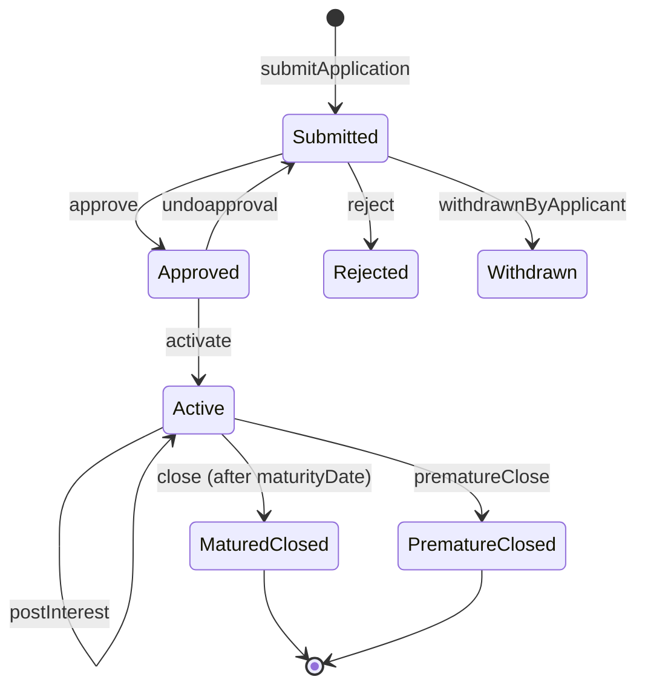

Apache Fineract models a fixed deposit (FD) as a `SavingsAccount` subtype carrying an embedded `DepositAccountTermAndPreClosure` aggregate. The persistent classes (`FixedDepositAccount`, `FixedDepositProduct`, `DepositAccountTermAndPreClosure`, `DepositPreClosureDetail`, `DepositTermDetail`) and the interest rate chart linkage live in the `fineract-savings` Gradle module, while the JPA-backed write service, the deposit-account assembler, the HTTP resources (`FixedDepositAccountsApiResource`, `FixedDepositProductsApiResource`) and the maturity / interest-posting jobs live in `fineract-provider`. All three deposit flavours share `m_savings_account` and `m_savings_product` through JPA single-table inheritance — FD uses the `200` discriminator value on both tables.

This page is the engineering reference for the FD subtype: the persistent shape, the relationship to `SavingsProduct`, how the deposit period and pre-closure rules are validated, how maturity dates and amounts are computed, and the full HTTP catalogue for accounts and products. Pair it with [Recurring Deposit](/savings/recurring-deposit) for the RD counterpart and [Savings Overview](/savings/overview) for the shared base.

## Entity inheritance

`FixedDepositAccount` extends `SavingsAccount` with one extra one-to-one to `DepositAccountTermAndPreClosure` and an optional `DepositAccountInterestRateChart`:

```java
// fineract-provider/.../savings/domain/FixedDepositAccount.java
@Entity
@DiscriminatorValue("200")
public class FixedDepositAccount extends SavingsAccount {

    @OneToOne(mappedBy = "account", cascade = CascadeType.ALL)
    private DepositAccountTermAndPreClosure accountTermAndPreClosure;

    @OneToOne(fetch = FetchType.LAZY, cascade = CascadeType.ALL, mappedBy = "account")
    protected DepositAccountInterestRateChart chart;
    …
}
```

Because the discriminator column (`deposit_type_enum`) is shared, every query against `m_savings_account` that filters by deposit type uses the constants in `DepositAccountType` (`SAVINGS_DEPOSIT = 100`, `FIXED_DEPOSIT = 200`, `RECURRING_DEPOSIT = 300`, `CURRENT = 400`).



## `DepositAccountTermAndPreClosure`

This embedded-rich entity (table `m_deposit_account_term_and_preclosure`) carries the per-account term values: deposit amount, maturity date/amount, deposit period, on-closure instruction, transfer-to-savings link plus the embedded pre-closure and term details:

```java
// fineract-savings/.../savings/domain/DepositAccountTermAndPreClosure.java
@Entity
@Table(name = "m_deposit_account_term_and_preclosure")
public class DepositAccountTermAndPreClosure extends AbstractPersistableCustom<Long> {
    @Column(name = "deposit_amount",   scale = 6, precision = 19) private BigDecimal depositAmount;
    @Column(name = "maturity_amount",  scale = 6, precision = 19) private BigDecimal maturityAmount;
    @Column(name = "maturity_date")                              private LocalDate  maturityDate;
    @Column(name = "expected_firstdepositon_date")               private LocalDate  expectedFirstDepositOnDate;
    @Column(name = "deposit_period")                              private Integer   depositPeriod;
    @Column(name = "deposit_period_frequency_enum")               private Integer   depositPeriodFrequency;
    @Column(name = "on_account_closure_enum")                     private Integer   onAccountClosureType;

    @Embedded private DepositPreClosureDetail preClosureDetail;
    @Embedded protected DepositTermDetail     depositTermDetail;

    @OneToOne @JoinColumn(name = "savings_account_id", nullable = false)
    private SavingsAccount account;

    @Column(name = "transfer_interest_to_linked_account", nullable = false)
    private boolean transferInterestToLinkedAccount;

    @Column(name = "transfer_to_savings_account_id")
    private Long transferToSavingsAccountId;
}
```

### Deposit period frequency

`depositPeriod` is an integer count interpreted with `SavingsPeriodFrequencyType` (in `fineract-core`):

```java
public enum SavingsPeriodFrequencyType {
    DAYS(0,   "savingsPeriodFrequencyType.days"),
    WEEKS(1,  "savingsPeriodFrequencyType.weeks"),
    MONTHS(2, "savingsPeriodFrequencyType.months"),
    YEARS(3,  "savingsPeriodFrequencyType.years"),
    INVALID(4, "savingsPeriodFrequencyType.invalid");
}
```

So `depositPeriod = 18`, `depositPeriodFrequency = MONTHS(2)` means "lock the principal for 18 months from the activation date". The maturity date is `activationDate + depositPeriod × frequency`.

### Pre-closure rules — `DepositPreClosureDetail`

The embedded pre-closure aggregate stores whether early closure is permitted and what penalty to subtract:

| Column | Field | Semantics |
| --- | --- | --- |
| `pre_closure_penal_applicable`   | `preClosurePenalApplicable`     | Master switch |
| `pre_closure_penal_interest`     | `preClosurePenalInterest`       | Basis-points penalty subtracted from chart rate |
| `pre_closure_penal_interest_on_enum` | `preClosurePenalInterestOnType` | `WHOLE_TERM` (1) or `TILL_PREMATURE_WITHDRAWAL` (2) |

`FixedDepositAccount.getEffectiveInterestRateAsFraction(...)` applies the penalty when `isPreMatureClosure` is true:

```java
if (isPreMatureClosure && this.accountTermAndPreClosure.isPreClosurePenalApplicable()) {
    applyPreMaturePenalty = true;
    penalInterest = this.accountTermAndPreClosure
            .depositPreClosureDetail().preClosurePenalInterest();
    final PreClosurePenalInterestOnType onType = this.accountTermAndPreClosure
            .depositPreClosureDetail().preClosurePenalInterestOnType();
    if (onType.isWholeTerm()) {
        depositCloseDate = interestCalculatedUpto();
    } else if (onType.isTillPrematureWithdrawal()) {
        depositCloseDate = interestPostingUpToDate;
    }
}
applicableInterestRate = this.chart.getApplicableInterestRate(
        depositAmount, depositStartDate(), depositCloseDate, this.client);
if (applyPreMaturePenalty) {
    applicableInterestRate = applicableInterestRate.subtract(penalInterest);
    applicableInterestRate = applicableInterestRate.compareTo(BigDecimal.ZERO) < 0
            ? BigDecimal.ZERO : applicableInterestRate;
}
```

### Term constraints — `DepositTermDetail`

The embedded `DepositTermDetail` carries minimum / maximum allowed term values (`minDepositTerm`, `minDepositTermType`, `maxDepositTerm`, `maxDepositTermType`, plus an `inMultiplesOfDepositTerm`). `validateInputDates(...)` checks that the user-requested `depositPeriod` falls inside that range and is an exact multiple when required.

### On-closure instruction (`DepositAccountOnClosureType`)

When the FD matures, the user picks what happens next via the `onAccountClosureType` column:

| Value | Constant | Behaviour |
| --- | --- | --- |
| 100 | `WITHDRAW_DEPOSIT`     | Roll principal + interest into a `WITHDRAWAL` transaction and close. |
| 200 | `TRANSFER_TO_SAVINGS`  | Transfer to the linked savings account in `transferToSavingsAccountId`. |
| 300 | `REINVEST`             | Open a new FD with the same product and roll the maturity amount over. |

## `FixedDepositProduct`

`FixedDepositProduct` carries the FD-specific defaults and interest rate charts:

```java
// fineract-savings/.../savings/domain/FixedDepositProduct.java
@Entity
@DiscriminatorValue("200")
public class FixedDepositProduct extends SavingsProduct {

    @OneToOne(mappedBy = "product", cascade = CascadeType.ALL)
    private DepositProductTermAndPreClosure productTermAndPreClosure;

    @OneToMany(fetch = FetchType.LAZY, cascade = CascadeType.ALL)
    @JoinTable(name = "m_deposit_product_interest_rate_chart",
               joinColumns = @JoinColumn(name = "deposit_product_id"),
               inverseJoinColumns = @JoinColumn(name = "interest_rate_chart_id", unique = true))
    protected Set<InterestRateChart> charts;
}
```

`DepositProductTermAndPreClosure` mirrors `DepositAccountTermAndPreClosure` but holds the *defaults* used when creating new FD applications — minimum / maximum allowed terms, default penal interest, allowed closure types.

### Interest rate chart

Each `FixedDepositProduct` can carry one or more `InterestRateChart` rows. A chart is a set of `InterestRateChartSlab` ranges keyed by deposit amount, deposit period and (optionally) client classification or gender. `DepositAccountInterestRateChart` is the per-account snapshot copied from the product chart at account submission time, so historical rates remain stable even if the product chart is later edited.

`getApplicableInterestRate(depositAmount, depositStartDate, depositCloseDate, client)` walks the slabs and returns the slab matching the deposit amount band and term duration. The applicable rate is then stored back into `nominalAnnualInterestRate` on the underlying `SavingsAccount`.

## Account lifecycle



The transitions in this diagram are the same `command=` query parameters accepted by `POST /v1/fixeddepositaccounts/{accountId}` (see below).

### Maturity calculation

`FixedDepositAccount.updateMaturityDateAndAmountBeforeAccountActivation(...)` is called when the application is submitted/approved so that the UI can display a projected maturity amount before the account is funded. It synthesises a deposit `SavingsAccountTransaction` at the activation date, runs the posting periods, and stores the result back on `accountTermAndPreClosure.maturityDate / maturityAmount`.

`updateMaturityDateAndAmount(...)` is called again at activation (when the real deposit transaction is present) and from the `updateDepositsAccountMaturityDetails` scheduled job whenever the projection has drifted.

`postMaturityInterest(isSavingsInterestPostingAtCurrentPeriodEnd, financialYearBeginningMonth)` is fired when an Active FD reaches its `maturityDate`. It posts a final interest transaction up to the maturity date and flips the account to `MATURED`.

## Pre-closure flow

```java
// FixedDepositAccount.prematureClosure
public void prematureClosure(final AppUser currentUser,
                             final JsonCommand command,
                             final Map<String, Object> actualChanges) {
    // 1. validate: account active, not locked-in, closedDate ∈ [activationDate, maturityDate)
    // 2. validate closedDate not before last transaction and not in the future
    if (DateUtils.isBefore(closedDate, getActivationDate()))      fail("must.be.after.activation.date");
    if (isAccountLocked(closedDate))                              fail("must.be.after.lockin.period");
    if (maturityDate() != null && DateUtils.isAfter(closedDate, maturityDate()))
                                                                  fail("must.be.before.maturity.date");
    if (DateUtils.isAfterBusinessDate(closedDate))                fail("cannot.be.a.future.date");
    // 3. set status = PRE_MATURE_CLOSURE and record onAccountClosureType
    this.status = SavingsAccountStatusType.PRE_MATURE_CLOSURE.getValue();
    final DepositAccountOnClosureType onClosureType = DepositAccountOnClosureType
            .fromInt(command.integerValueOfParameterNamed(onAccountClosureIdParamName));
    this.accountTermAndPreClosure.updateOnAccountClosureStatus(onClosureType);
}
```

The supplementary `calculatePrematureAmount` endpoint (see API table) calls `DepositAccountPreMatureCalculationPlatformServiceImpl.calculatePreMatureAmount(...)` which clones the deposit and runs interest posting up to the requested `preClosureDate` *with the penalty applied*, returning a `DepositAccountData` projection without persisting anything.

## `FixedDepositAccountsApiResource`

```java
// fineract-provider/.../savings/api/FixedDepositAccountsApiResource.java
@Path("/v1/fixeddepositaccounts")
@Component
@Tag(name = "Fixed Deposit Account")
public class FixedDepositAccountsApiResource { … }
```

### Endpoint catalogue

| Method | Path | Operation |
| --- | --- | --- |
| `GET`    | `/v1/fixeddepositaccounts/template`               | `template(clientId, groupId, productId, staffInSelectedOfficeOnly)` |
| `GET`    | `/v1/fixeddepositaccounts`                        | `retrieveAll(paged, limit, offset, …)` |
| `POST`   | `/v1/fixeddepositaccounts`                        | `submitApplication` |
| `GET`    | `/v1/fixeddepositaccounts/{accountId}`            | `retrieveOne(associations, staffInSelectedOfficeOnly)` |
| `GET`    | `/v1/fixeddepositaccounts/calculate-fd-interest`  | `calculateFixedDepositInterest` (template-driven projection) |
| `PUT`    | `/v1/fixeddepositaccounts/{accountId}`            | `update` (submitted-state modification) |
| `POST`   | `/v1/fixeddepositaccounts/{accountId}?command=…`  | `handleCommands` (state-machine dispatcher, table below) |
| `DELETE` | `/v1/fixeddepositaccounts/{accountId}`            | `delete` |
| `GET`    | `/v1/fixeddepositaccounts/{accountId}/template`   | `accountClosureTemplate` |
| `GET`    | `/v1/fixeddepositaccounts/downloadtemplate`       | Excel bulk-import template |
| `POST`   | `/v1/fixeddepositaccounts/uploadtemplate`         | Bulk-import upload |

### `handleCommands` query parameter dispatch

The `POST /{accountId}` endpoint multiplexes the account state-machine. The full set of `command=` values and the `CommandWrapperBuilder` calls they trigger:

```java
if (is(commandParam, "reject"))                builder.rejectFixedDepositAccountApplication(accountId);
else if (is(commandParam, "withdrawnByApplicant"))
                                              builder.withdrawFixedDepositAccountApplication(accountId);
else if (is(commandParam, "approve"))          builder.approveFixedDepositAccountApplication(accountId);
else if (is(commandParam, "undoapproval"))     builder.undoFixedDepositAccountApplication(accountId);
else if (is(commandParam, "activate"))         builder.fixedDepositAccountActivation(accountId);
else if (is(commandParam, "calculateInterest"))builder.withNoJsonBody().fixedDepositAccountInterestCalculation(accountId);
else if (is(commandParam, "postInterest"))     builder.fixedDepositAccountInterestPosting(accountId);
else if (is(commandParam, "close"))            builder.closeFixedDepositAccount(accountId);
else if (is(commandParam, "prematureClose"))   builder.prematureCloseFixedDepositAccount(accountId);
else if (is(commandParam, "calculatePrematureAmount")) {
    // not a command, runs DepositAccountPreMatureCalculationPlatformService synchronously
    return this.toApiJsonSerializer.serialize(settings,
        accountPreMatureCalculationPlatformService.calculatePreMatureAmount(
            accountId, query, DepositAccountType.FIXED_DEPOSIT),
        FIXED_DEPOSIT_ACCOUNT_RESPONSE_DATA_PARAMETERS);
}
```

<Warning>
`calculatePrematureAmount` is the only command that does **not** go through the command/event audit pipeline — it returns the projection inline because no state changes. The other commands all log a row in `m_portfolio_command_source` and emit a business event.
</Warning>

### Submission body

The `POST /v1/fixeddepositaccounts` body mirrors `SavingsAccountsApiResource.submitApplication` plus the FD-specific term/preclosure fields:

```json
{ "clientId": 1, "productId": 5,
  "submittedOnDate": "01 May 2024", "locale": "en", "dateFormat": "dd MMMM yyyy",
  "depositAmount": 1000000,
  "depositPeriod": 6,
  "depositPeriodFrequencyId": 2,                         // MONTHS
  "expectedFirstDepositOnDate": "01 May 2024",
  "interestCompoundingPeriodType": 1,                    // DAILY
  "interestPostingPeriodType": 4,                        // MONTHLY
  "interestCalculationType": 1,                          // DAILY_BALANCE
  "interestCalculationDaysInYearType": 365,
  "lockinPeriodFrequency": 0, "lockinPeriodFrequencyType": 0,
  "transferInterestToSavings": false,
  "transferToSavingsId": null,
  "maturityInstructionId": 100                           // WITHDRAW_DEPOSIT
}
```

### Pre-close body

```json
// POST /v1/fixeddepositaccounts/{accountId}?command=prematureClose
{ "closedOnDate": "11 Sep 2024",
  "onAccountClosureId": 200,        // TRANSFER_TO_SAVINGS
  "toSavingsAccountId": 87,
  "transferDescription": "Premature close to savings",
  "locale": "en", "dateFormat": "dd MMM yyyy" }
```

## `FixedDepositProductsApiResource`

```java
// fineract-provider/.../savings/api/FixedDepositProductsApiResource.java
@Path("/v1/fixeddepositproducts")
@Component
@Tag(name = "Fixed Deposit Product")
public class FixedDepositProductsApiResource { … }
```

| Method | Path | Operation |
| --- | --- | --- |
| `GET`    | `/v1/fixeddepositproducts`                  | `retrieveAll`           |
| `POST`   | `/v1/fixeddepositproducts`                  | `create` |
| `GET`    | `/v1/fixeddepositproducts/{productId}`      | `retrieveOne` |
| `PUT`    | `/v1/fixeddepositproducts/{productId}`      | `update` |
| `DELETE` | `/v1/fixeddepositproducts/{productId}`      | `delete` |
| `GET`    | `/v1/fixeddepositproducts/template`         | `template` (currencies, accounting rules, charts) |

A product create payload combines the savings-product shape (interest compounding/posting/calculation, days-in-year, charges, accounting GL mappings) with the FD-specific:

```json
{ "name": "1Y FD", "shortName": "FD1Y", "currencyCode": "USD",
  "digitsAfterDecimal": 2,
  "interestCompoundingPeriodType": 1, "interestPostingPeriodType": 4,
  "interestCalculationType": 1, "interestCalculationDaysInYearType": 365,
  "minDepositTerm": 6, "minDepositTermTypeId": 2,
  "maxDepositTerm": 24,"maxDepositTermTypeId": 2,
  "inMultiplesOfDepositTerm": 1, "inMultiplesOfDepositTermTypeId": 2,
  "preClosurePenalApplicable": true,
  "preClosurePenalInterest": 1.0,
  "preClosurePenalInterestOnTypeId": 1,                  // WHOLE_TERM
  "charts": [ { "name": "Standard", "fromDate": "01 Jan 2024",
                "chartSlabs": [ { "periodType": 2, "fromPeriod": 6, "toPeriod": 12,
                                  "amountRangeFrom": 0, "amountRangeTo": null,
                                  "annualInterestRate": 6.5 } ] } ],
  "accountingRule": 2 }
```

## Internal calculation service

`FixedDepositAccountInterestCalculationServiceImpl` exposes `calculateInterest(FixedDepositAccount, MathContext, boolean isPreMatureClosure)` — used by the synchronous `calculate-fd-interest` GET to project maturity values without persisting a transaction. The implementation re-uses `SavingsHelper.calculateInterestForAllPostingPeriods` so the projection always matches the real posting math.

## Scheduled jobs touching FDs

| Job (`JobName`) | What it does for FD |
| --- | --- |
| `POST_INTEREST_FOR_SAVINGS`            | Posts interest on Active FDs (and all other savings types) for the configured posting period. See [Interest Posting Job](/savings/interest-posting-job). |
| `UPDATE_DEPOSITS_ACCOUNT_MATURITY_DETAILS` | Re-projects `maturityDate` / `maturityAmount` for Active FDs whose term values have drifted; closes accounts that have reached maturity per the on-closure instruction. |
| `TRANSFER_INTEREST_TO_SAVINGS`         | If `transferInterestToLinkedAccount = true`, pushes posted interest to the linked passbook account. |
| `ACCRUAL_ACTIVITY_POSTING` / `ADD_PERIODIC_ACCRUAL_ENTRIES_FOR_SAVINGS_…` | Adds accrual transactions when the product is configured "Income from interest" as transactions; see [Savings Accrual](/savings/savings-accrual). |

## Cross references

<CardGroup cols={2}>
  <Card title="Savings overview" icon="map" href="/savings/overview">
    The shared `SavingsAccount` base class and single-table inheritance.
  </Card>
  <Card title="Recurring deposit" icon="calendar-days" href="/savings/recurring-deposit">
    Sister page covering the RD-specific schedule and instalments.
  </Card>
  <Card title="On-hold funds" icon="hand" href="/savings/deposit-account-on-hold-funds">
    `DepositAccountOnHoldTransaction` (used for FD-backed guarantees).
  </Card>
  <Card title="Interest posting job" icon="clock" href="/savings/interest-posting-job">
    POST_INTEREST_FOR_SAVINGS tasklet (FD + RD + passbook).
  </Card>
  <Card title="Accounting overview" icon="book" href="/accounting/overview">
    How FD deposit, interest posting and pre-closure produce journal entries.
  </Card>
  <Card title="Savings COB business steps" icon="calendar" href="/cob/savings-cob-business-steps">
    Deposit maturity / dormancy steps in the daily COB pipeline.
  </Card>
</CardGroup>
