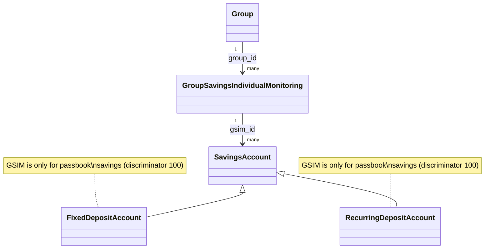
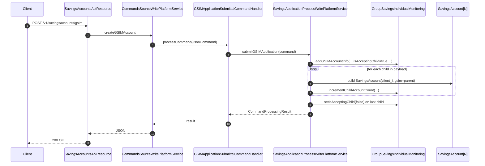
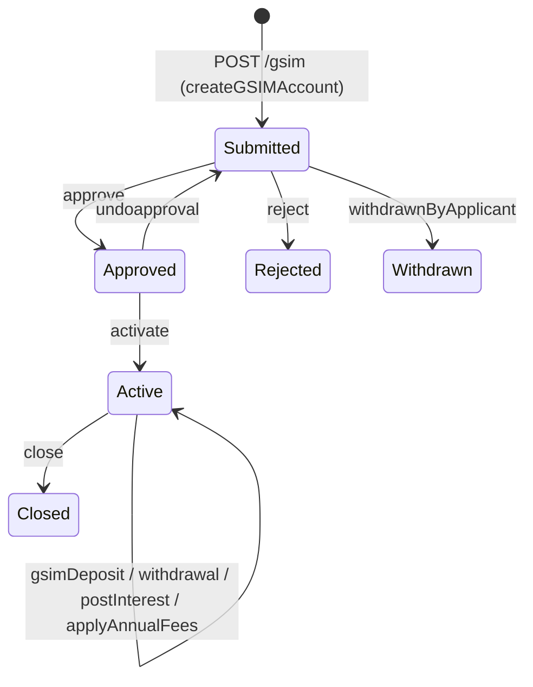

Apache Fineract implements *Group Savings Individual Monitoring* (GSIM) — a group-level aggregate that bundles several individual `SavingsAccount` rows behind a single parent identifier so that group officers can submit one application, approve once, activate once and deposit once on behalf of all members. The persistent classes (`GroupSavingsIndividualMonitoring`, `GSIMRepositoy`, `GSIMContainer`) live in `fineract-savings` under `org.apache.fineract.portfolio.savings.domain` and `.data`. The HTTP surface re-uses `SavingsAccountsApiResource` with `/gsim` and `/gsimcommands` sub-paths in `fineract-provider`, and the command-handler tier consists of eight `GSIM*CommandHandler` classes that all dispatch into `SavingsAccountWritePlatformServiceJpaRepositoryImpl` and `SavingsApplicationProcessWritePlatformService`.

This page is the engineering reference for GSIM: the entity, the relationship to child `SavingsAccount` rows via `gsim_id`, the command vocabulary, how aggregate balances (`parentDeposit`) are kept consistent with the children, and the read API. Pair it with [Savings Account Domain](/savings/savings-account-domain) for the child account shape and [Savings Write Service](/savings/savings-write-service) for the surrounding command flow.

## What GSIM is for

GSIM is the savings counterpart of GLIM (the loans grouping). It lets a microfinance group treat a basket of N member savings accounts as a single business object:

- One `submitApplication` POST creates N child applications in one transaction.
- A single `approve` / `undoapproval` / `activate` / `close` command applies to every child.
- A single `gsimDeposit` POST splits one customer payment over the children with explicit per-child amounts.
- The parent row maintains `parent_deposit` as the rolling sum of all child balances so that group dashboards can render a single number.

GSIM is wired only to passbook savings (discriminator `100`) — there is no GSIM equivalent for FD or RD.

## Entity shape

```java
// fineract-savings/.../savings/domain/GroupSavingsIndividualMonitoring.java
@Entity
@Table(name = "gsim_accounts",
       uniqueConstraints = { @UniqueConstraint(columnNames = { "account_number" },
                                               name = "gsim_id") })
public final class GroupSavingsIndividualMonitoring extends AbstractPersistableCustom<Long> {

    @ManyToOne
    @JoinColumn(name = "group_id", nullable = false)
    private Group group;

    @Column(name = "account_number", nullable = false)
    private String accountNumber;

    @Column(name = "parent_deposit")
    private BigDecimal parentDeposit;

    @Column(name = "child_accounts_count")
    private Long childAccountsCount;

    @Column(name = "accepting_child")
    private Boolean isAcceptingChild;

    @OneToMany
    private Set<SavingsAccount> childSaving;

    @Column(name = "savings_status_id", nullable = false)
    private Integer savingsStatus;

    @Column(name = "application_id")
    private BigDecimal applicationId;
}
```

| Column | Field | Meaning |
| --- | --- | --- |
| `account_number`        | `accountNumber`      | The parent's external account number (unique constraint `gsim_id`). |
| `group_id`              | `group`              | FK to `m_group` — every GSIM belongs to exactly one group. |
| `parent_deposit`        | `parentDeposit`      | Running sum of the underlying child account balances. |
| `child_accounts_count`  | `childAccountsCount` | Number of `SavingsAccount` rows that point back to this `gsim_id`. |
| `accepting_child`       | `isAcceptingChild`   | When true, new child accounts can still be added to this GSIM (during the create flow). |
| `savings_status_id`     | `savingsStatus`      | Aggregate status enum — `100` Submitted, `200` Approved, `300` Active, etc. |
| `application_id`        | `applicationId`      | Application correlation id used while child accounts are being created in batch. |

`SavingsAccount` carries the child-side foreign key:

```java
// fineract-savings/.../savings/domain/SavingsAccount.java (excerpt)
@ManyToOne
@JoinColumn(name = "gsim_id")
private GroupSavingsIndividualMonitoring gsim;
```

so each child savings row knows its parent and the parent collection can be reconstituted with `SavingsAccountRepositoryWrapper.findByGsimId(gsimId)`.

### Repository

```java
// fineract-savings/.../savings/domain/GSIMRepositoy.java
public interface GSIMRepositoy
        extends JpaRepository<GroupSavingsIndividualMonitoring, Long>,
                JpaSpecificationExecutor<GroupSavingsIndividualMonitoring> {

    GroupSavingsIndividualMonitoring findOneByIsAcceptingChild(boolean acceptingChild);

    GroupSavingsIndividualMonitoring findOneByIsAcceptingChildAndApplicationId(
            boolean acceptingChild, BigDecimal applicationId);

    GroupSavingsIndividualMonitoring findOneByAccountNumber(String accountNumber);

    GroupSavingsIndividualMonitoring findOneByIsAcceptingChildAndApplicationIdAndGroupId(
            boolean acceptingChild, BigDecimal applicationId, Long groupId);
}
```

The `isAcceptingChild` lookups are used during the batch submit flow: the first child account creates the parent row, then every subsequent child of the same application id finds the open parent and attaches itself before flipping `isAcceptingChild = false` on the last child.

## Entity relationship



## Write service — `GroupSavingsIndividualMonitoringWritePlatformService`

The small write service in `fineract-provider` owns the basic CRUD operations on the parent row. It is called by the application-process service while children are being created:

```java
// fineract-provider/.../savings/service/GroupSavingsIndividualMonitoringWritePlatformService.java
public interface GroupSavingsIndividualMonitoringWritePlatformService {
    void setIsAcceptingChild(GroupSavingsIndividualMonitoring gsimAccount);
    void resetIsAcceptingChild(GroupSavingsIndividualMonitoring gsimAccount);
    void incrementChildAccountCount(GroupSavingsIndividualMonitoring gsimAccount);
    GroupSavingsIndividualMonitoring addGSIMAccountInfo(String accountNumber, Group group,
            BigDecimal parentDeposit, Long childAccountsCount, Boolean isAcceptingChild,
            Integer loanStatus, BigDecimal applicationId);
}
```

```java
// implementation
@Override
public GroupSavingsIndividualMonitoring addGSIMAccountInfo(String accountNumber, Group group,
        BigDecimal parentDeposit, Long childAccountsCount, Boolean isAcceptingChild,
        Integer loanStatus, BigDecimal applicationId) {
    GroupSavingsIndividualMonitoring glimAccountInfo = GroupSavingsIndividualMonitoring.getInstance(
        accountNumber, group, parentDeposit, childAccountsCount, isAcceptingChild,
        loanStatus, applicationId);
    return this.gsimAccountRepository.save(glimAccountInfo);
}

@Override
public void incrementChildAccountCount(GroupSavingsIndividualMonitoring glimAccount) {
    long count = glimAccount.getChildAccountsCount();
    glimAccount.setChildAccountsCount(count + 1);
    gsimAccountRepository.save(glimAccount);
}
```

## Command handlers — eight verbs

GSIM has its own family of `@CommandType(entity = "GSIMACCOUNT", action = …)` handlers in `org.apache.fineract.portfolio.savings.handler`:

| Handler class | Action | Delegates to |
| --- | --- | --- |
| `GSIMApplicationSubmittalCommandHandler`   | `CREATE`        | `SavingsApplicationProcessWritePlatformService.submitGSIMApplication(...)` |
| `GSIMApplicationModificationCommandHandler`| `UPDATE`        | `SavingsApplicationProcessWritePlatformService.updateGSIMApplication(...)` |
| `GSIMApplicationApprovalCommandHandler`    | `APPROVE`       | Group-wide `approveGSIMApplication` |
| `GSIMUndoApprovalCommandHandler`           | `APPROVALUNDO`  | Group-wide undo |
| `GSIMApplicationRejectionHandler`          | `REJECT`        | Reject every child |
| `GSIMAccountActivationCommandHandler`      | `ACTIVATE`      | `SavingsAccountWritePlatformService.gsimActivate(...)` |
| `GSIMDepositCommandHandler`                | `DEPOSIT`       | `SavingsAccountWritePlatformService.gsimDeposit(...)` |
| `CloseGSIMCommandHandler`                  | `CLOSE`         | Close every child + flag parent |

A representative handler:

```java
@Service
@CommandType(entity = "GSIMACCOUNT", action = "CREATE")
public class GSIMApplicationSubmittalCommandHandler implements NewCommandSourceHandler {
    private final SavingsApplicationProcessWritePlatformService savingAccountWritePlatformService;

    @Transactional
    @Override
    public CommandProcessingResult processCommand(final JsonCommand command) {
        return this.savingAccountWritePlatformService.submitGSIMApplication(command);
    }
}
```

## REST endpoints (on `SavingsAccountsApiResource`)

GSIM does not own its own `*ApiResource` — instead the verbs are mounted directly on `SavingsAccountsApiResource` at `/v1/savingsaccounts/gsim*`:

```java
// fineract-provider/.../savings/api/SavingsAccountsApiResource.java
@Path("/v1/savingsaccounts")
public class SavingsAccountsApiResource {
    @POST @Path("/gsim")
    public String submitGSIMApplication(final String apiRequestBodyAsJson) { … }

    @PUT  @Path("/gsim/{parentAccountId}")
    public String updateGsim(@PathParam("parentAccountId") final Long parentAccountId, …) { … }

    @POST @Path("/gsimcommands/{parentAccountId}")
    public String handleGSIMCommands(@PathParam("parentAccountId") final Long parentAccountId,
            @QueryParam("command") final String commandParam, …) { … }
}
```

| Method | Path | Operation |
| --- | --- | --- |
| `POST` | `/v1/savingsaccounts/gsim`                                 | Submit a GSIM application (creates parent + children) |
| `PUT`  | `/v1/savingsaccounts/gsim/{parentAccountId}`               | Update a GSIM application (modify children list / details) |
| `POST` | `/v1/savingsaccounts/gsimcommands/{parentAccountId}?command=…` | State-machine dispatcher (table below) |

### `handleGSIMCommands` dispatcher

The `handleGSIMCommands` method multiplexes the parent state machine — the snippet from source spells out the full vocabulary:

```java
if (is(commandParam, "reject")) {
    builder.rejectGSIMAccountApplication(parentAccountId);
} else if (is(commandParam, "withdrawnByApplicant")) {
    builder.withdrawSavingsAccountApplication(parentAccountId);
} else if (is(commandParam, "approve")) {
    builder.approveGSIMAccountApplication(parentAccountId);
} else if (is(commandParam, "undoapproval")) {
    builder.undoGSIMApplicationApproval(parentAccountId);
} else if (is(commandParam, "activate")) {
    builder.gsimAccountActivation(parentAccountId);
} else if (is(commandParam, "calculateInterest")) {
    builder.withNoJsonBody().savingsAccountInterestCalculation(parentAccountId);
} else if (is(commandParam, "postInterest")) {
    builder.savingsAccountInterestPosting(parentAccountId);
} else if (is(commandParam, "applyAnnualFees")) {
    builder.savingsAccountApplyAnnualFees(parentAccountId);
} else if (is(commandParam, "close")) {
    builder.closeGSIMApplication(parentAccountId);
}
```

Accepted `command` values:

```text
reject | withdrawnByApplicant | approve | undoapproval | activate
calculateInterest | postInterest | applyAnnualFees | close
```

### GSIM deposit (one POST, N transactions)

Deposits go through `SavingsAccountTransactionsApiResource.handleTransactionCommands(...)` with `command=gsimDeposit`:

```java
// fineract-provider/.../savings/api/SavingsAccountTransactionsApiResource.java (excerpt)
case "gsimDeposit" -> builder.gsimSavingsAccountDeposit(savingsId).build();
```

The body carries a `savingsArray` with the per-child split:

```json
{ "transactionDate": "01 May 2024",
  "dateFormat": "dd MMMM yyyy", "locale": "en",
  "savingsArray": [
    { "childAccountId": 87, "transactionAmount": 250.00 },
    { "childAccountId": 88, "transactionAmount": 250.00 },
    { "childAccountId": 89, "transactionAmount": 500.00 }
  ] }
```

The implementation iterates each element and calls the normal per-child `deposit` flow:

```java
// SavingsAccountWritePlatformServiceJpaRepositoryImpl.gsimDeposit
public CommandProcessingResult gsimDeposit(final Long gsimId, final JsonCommand command) {
    JsonArray savingsArray = command.arrayOfParameterNamed("savingsArray");
    CommandProcessingResult result = null;
    for (JsonElement element : savingsArray) {
        result = deposit(element.getAsJsonObject().get("childAccountId").getAsLong(),
                         JsonCommand.fromExistingCommand(command, element));
    }
    return result;
}
```

And inside `deposit`, the parent's `parent_deposit` total is kept in sync after every successful child deposit:

```java
if (isGsim && (deposit.getId() != null)) {
    GroupSavingsIndividualMonitoring gsim = gsimRepository
        .findById(account.getGsim().getId()).orElseThrow();
    BigDecimal currentBalance = gsim.getParentDeposit();
    BigDecimal newBalance = currentBalance.add(transactionAmount);
    gsim.setParentDeposit(newBalance);
    gsimRepository.save(gsim);
}
```

A withdrawal does the inverse (subtracts the withdrawn amount from `parent_deposit`):

```java
GroupSavingsIndividualMonitoring gsim = gsimRepository
    .findById(account.getGsim().getId()).orElseThrow();
BigDecimal currentBalance = gsim.getParentDeposit().subtract(transactionAmount);
gsim.setParentDeposit(currentBalance);
gsimRepository.save(gsim);
```

### GSIM activate (N child activations)

```java
// SavingsAccountWritePlatformServiceJpaRepositoryImpl.gsimActivate
public CommandProcessingResult gsimActivate(final Long gsimId, final JsonCommand command) {
    Long parentSavingId = gsimId;
    GroupSavingsIndividualMonitoring parentSavings =
        gsimRepository.findById(parentSavingId).orElseThrow();
    List<SavingsAccount> childSavings = this.savingAccountRepositoryWrapper.findByGsimId(gsimId);

    CommandProcessingResult result = null;
    int count = 0;
    for (SavingsAccount account : childSavings) {
        result = activate(account.getId(), command);
        if (result != null) {
            count++;
            if (count == parentSavings.getChildAccountsCount()) {
                parentSavings.setSavingsStatus(SavingsAccountStatusType.ACTIVE.getValue());
                gsimRepository.save(parentSavings);
            }
        }
    }
    return result;
}
```

The parent flag flips to `ACTIVE` only when every child has activated successfully. The same shape applies to approve / undo-approve / close — each is implemented as a fan-out over `childSavings`.

## End-to-end create flow



## Read service — `GSIMReadPlatformService`

The read tier returns a `GSIMContainer` per parent so the UI can render both the aggregate header and every child summary:

```java
// fineract-savings/.../savings/service/GSIMReadPlatformServiceImpl.java (excerpt)
public Collection<GSIMContainer> findGSIMAccountContainerByGroupId(Long groupId) {
    Collection<GroupSavingsIndividualMonitoringAccountData> gsimInfo =
        findGSIMAccountsByGroupId(groupId + "");
    List<GSIMContainer> gsimAccounts = new ArrayList<>();
    for (GroupSavingsIndividualMonitoringAccountData gsimAccount : gsimInfo) {
        BigDecimal gsimId = gsimAccount.getGsimId();
        String whereClause = " where sa.group_id = ? and sa.gsim_id = ? "
                            + " order by sa.status_enum ASC, sa.account_no ASC";
        Collection<SavingsAccountData> childSavings =
            retrieveAccountDetails(whereClause, new Object[] { groupId, gsimId });
        gsimAccounts.add(new GSIMContainer(gsimAccount.getGsimId(), gsimAccount.getGroupId(),
            gsimAccount.getAccountNumber(), childSavings,
            gsimAccount.getParentDeposit(), gsimAccount.getSavingsStatus()));
    }
    return gsimAccounts;
}
```

The query that backs the parent listing:

```sql
select gsim.id              as gsimId,
       gsim.group_id        as groupId,
       gsim.account_number  as accountNumber,
       gsim.parent_deposit  as parentDeposit,
       gsim.child_accounts_count as childAccountsCount,
       gsim.savings_status_id    as savingsStatus
from gsim_accounts gsim
```

and the children are fetched with the standard `SavingsAccountData` projection joined to `m_savings_account` on `gsim_id`.

## State machine



Every transition fans out over `findByGsimId(gsimId)` so that the parent flag and the child statuses stay synchronised.

## Validation surface

The most common error codes you will see:

- `error.msg.gsim.account.not.accepting.child` — attempting to attach a child to a closed GSIM batch.
- `error.msg.gsim.savings.array.empty` — `gsimDeposit` called with an empty `savingsArray`.
- `error.msg.gsim.parent.status.mismatch` — a child has a different status (some children still pending approval).
- `error.msg.group.notfound` — `group_id` does not exist or is inactive.

## Cross references

<CardGroup cols={2}>
  <Card title="Savings overview" icon="map" href="/savings/overview">
    Module tour with the `SavingsAccount` inheritance hierarchy and discriminator values.
  </Card>
  <Card title="Savings account domain" icon="diagram-project" href="/savings/savings-account-domain">
    The parent `SavingsAccount` entity, including the `gsim_id` foreign-key.
  </Card>
  <Card title="Savings write service" icon="pen" href="/savings/savings-write-service">
    `SavingsAccountWritePlatformServiceJpaRepositoryImpl.gsimActivate / gsimDeposit / deposit` flow.
  </Card>
  <Card title="Savings transactions" icon="arrow-right-arrow-left" href="/savings/savings-transactions">
    Per-child transactions produced by a single GSIM deposit POST.
  </Card>
  <Card title="Savings accounts API" icon="code" href="/api/savings-accounts">
    Public reference for the `/gsim` and `/gsimcommands` endpoints exposed on `SavingsAccountsApiResource`.
  </Card>
  <Card title="Savings COB business steps" icon="calendar" href="/cob/savings-cob-business-steps">
    Daily COB that processes the children belonging to a GSIM parent.
  </Card>
</CardGroup>
